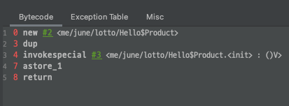

# 지옥자바 스터디 - 06 객체지향 프로그래밍 - 1

## 객체지향 언어

`객체지향 언어의 역사`
- 객체지향 언어의 기본 개념은 **실제 세계는 사물 (객체) 로 이루어 져 있고, 모든 사건들은 사물들의 상호 작용이다.**
- 객체지향 이론은 상속, 캡슐화, 추상화 개념을 쭝심으로 점차 구체적으로 발전되었다.
- 1960 년 중반 **시뮬라 (Simula)** 라는 최초의 객체지향 언어가 탄생
- 프로그램의 규모가 점점 커지고 요구사항이 빠르게 변화하는 상황을 절차지향 언어로는 한계가 있고, 객체지향 언어를 이용한 방법론이 점점 떠오르기 시작함
- 1995년 자바가 발표되고, 90년대 말 인터넷의 발전과 함께 크게 유행하면서 객체지향 언어가 프로그래밍 언어의 주류로 자리잡게 되었다.

`객체지향 언어`
- 기존 프로그래밍 언어와 전혀 새로운 것이 아닌, 기존 언어에 몇가지 새로운 규칙이 추가된 발전된 형태이다.
- 절차지향적인 개발방식에 익숙한 사람이라면, 객체지향적인 사고로 전환하는 것이 가장 힘든 벽이 될 수 있다.
- 객체지향 언어의 가장 큰 장점은 **재사용성이 높고 유지보수가 용이하다.** 는 점이다.

> 처음부터 완벽한 설계를 하는 사람은 없다. <br/>
> 우선 절차적으로 작성을 한뒤 차차 설계를 개선하는 방식이 더 나을 수도 있다. <br/>
> 결과물만 봤을땐 우아할지 몰라도 그 과정은 상당히 괴롭고 힘든 과정이다.

## 클래스와 객체

`클래스와 객체`
- **클래스** 란, 객체를 정의해 놓은것 혹은 객체의 설계도 라고 표현한다.
- 객체의 사전적 용어 : 실제로 존재하는 것
- 프로그래밍에서는 클래스를 먼저 작성한 뒤 객체를 생성해서 사용한다.

`객체와 인스턴스`
- 객체를 생성하는 과정을 **인스턴스화** 라고 한다.
- 특정 클래스로부터 생성된 객체를 해당 클래스의 **인스턴스** 라고 한다.

`객체의 구성 요소`
- 객체는 크게 속성과 기능 두 종류로 구성된다.
- 객체가 가지고 있는 속성과 기능을 객체의 **멤버** 라고 표현한다.
- 속성 : 멤버 변수, 특성, 필드, 상태
- 기능 : 메소드, 함수, 행위

> 객체지향 프로그래밍에서는 속성과 기능을 변수 와 메소드로 표현한다.

`인스턴스의 생성과 사용`
- 클래스로부터 인스턴스를 생성하는 방법은 다양하게 있지만 가장 일반적인 방법은 **new 키워드** 를 사용하는 것이다.

```java
클래스명 변수명;
변수명 = new 클래스명();

Tv tv;
tv = new Tv();
```
- 참조 변수를 **선언** 하는것 만으로는 아무것도 할 수 없다.
- 다양한 자료형의 초기화후 이를 사용할 수 있는것 처럼 인스턴화가 진행된 이후에 사용할 수 있다.
  - 참조 변수를 선언만 했다면 기본적으로 null 이 할당된다. 
- new 키워드를 통해 인스턴스화가 진행될때 해당 클래스의 인스턴스가 메모리 공간에 할당된다.
    - 해당 객체의 멤버 변수는 각 자료형에 해당하는 기본값으로 초기화 된다.

> 인스턴스는 참조변수를 통해서만 접근할 수 있으며, 참조 변수의 타입은 인스턴스 타입과 일치한다. <br/>
> 생성된 인스턴스가 더이상 참조중인 변수가 없을 경우, GC 에 의해 메모리에서 해제된다.

`객체 배열`
- 다른 자료형들과 동일하게 객체 역시 배열로 다루는것이 가능한데 이를 **객체 배열** 이라고 한다.
- 객체 배열의 경우 참조 변수들을 하나로 묶음 **참조 변수 배열** 이다.

> 다양한 종류의 객체를 하나의 배열로 저장하는 방법도 가능한데, 이는 다음장에 나올 **다형성** 에서 살펴본다.

`클래스의 또 다른 정의`
- **프로그래밍 관점** 에서 클래스의 정의와 의미를 살펴보면 다음과 같다.

1. 클래스 : 데이터와 함수의 결합
   1. 변수 : 하나의 데이터를 저장가능한 공간
   2. 배열 : 같은 종류의 여러 데이터를 하나의 집합으로 저장 가능한 공간
   3. 구조체 : 관련된 여러 데이터를 종류에 상관 없이 하나의 집합으로 저장 가능한 공간
   4. 클래스 : 데이터와 함수의 결합

```text
변수 -> 배열 -> 구조체 -> 클래스 의 형태로 데이터 저장형태가 발전해 왔다.
```

> 클래스는 관련된 데이터와, 기능 (메소드) 가 응집되어 있는 집합

2. 클래스 : 사용자 정의 타입
   - 언어레벨에서 제공하는 자료형 외에 프로그래머가 별도로 타입을 새롭게 선언할 수 있다.
   - 객체지향 언어에서는 클래스가 곧 사용자 정의 타입이다.

## 변수와 메소드

`선언 위치에 따른 변수의 종류`
- 변수는 크게 클래스 변수 / 인스턴스 변수 / 지역 변수 세 가지로 구분할 수 있다.
- 변수의 종류를 결정짓는 중요한 요소는 **변수의 선언된 위치** 이다.

```java
class Variables {
	int iv; // 인스턴스 변수
	static int cv; // 클래스 변수
	
	void method() {
		int lv = 0; // 지역 변수
    }
}
```

| 종류 | 선언 위치 | 생성 시기 |
| --- | --- | --- |
| 클래스 변수 | 클래스 영역 | 클래스가 메모리에 로드 될 때 |
| 인스턴스 변수 | 클래스 영역 | 인스턴스가 생성 되었을 때 |
| 지역 변수 | 클래스 영역 이외의 영역 | 변수 선언문이 수행되었을 때 |

1. 인스턴스 변수
   - 클래스의 인스턴스를 생성할 때 만들어 진다.
   - 독립적인 저장공간을 가지기 때문에 인스턴스 별로 다른 값을 가질 수 있다.
   - 인스턴스를 통해 접근할 수 있다.
2. 클래스 변수
   - 클래스 변수를 선언하는 방법은 static 키워드를 이용하는 것
   - 공통된 저장 공간을 통해 공유 되기 때문에 클래스 변수로 선언하는 것들은 Thread-Safe 해야 한다.
   - 클래스를 통해 직접 접근할 수 있다.
3. 지역 변수
   - 선언된 해당 블록에서만 사용이 가능하며, 해당 블록을 벗어나면 접근할 수 없다.
   - 만약 메소드 내에 선언된 지역변수라면, 메소드 호출이 종료되는 순간 소멸한다.

`메소드`
- **메소드** 는 특정 작업을 수행하는 일련의 문장을 하나로 묶은것
- 수학의 함수와 유사한 특징을 가지고 있다.
- 메소드의 시그니쳐만 알고, 내부 구현을 몰라도 사용할 수 있기 때문에 **블랙 박스** 라고도 표현한다.

`메소드를 사용하는 이유`
1. 높은 재사용성
2. 중복 코드 제거
3. 프로그램의 구조화

`메소드의 선언과 구현`
- 메소드는 선언부와 구현부로 이루어져 있다.
- 메소드의 정의는 선언부와 구현부를 작성하는 것을 의미한다.

```java
반환타입 메소드명 (타입 변수명 ...) {
	// 수행될 코드
}
```
- 메소드 선언부
  - 메소드 명, 매개변수, 반환 타입으로 구성되어 있다.
    - 메소드 명은 **동사** 로 짓는 것이 좋다.
    - 매개변수도 지역변수이다.
  - 작업 수행시 어떤 값이 필요하며 작업의 결과로 어떤 타입의 값을 반환하는지에 대한 정보를 제공한다.
  - 메소드 시그니쳐 라고 표현하기도 한다.
- 메소드 구현부
  - 선언부 이후에 중괄호 {} 를 메소드의 구현부라고 한다.
  - 메소드 호출시 수행한 코드를 작성한다.
  - 반환타입이 void 가 아니라면 구현부에 반드시 **return 반환값** 코드가 존재해야 한다.
    - void 일 경우 생략이 가능하며, 이는 컴파일러가 자동으로 추가해준다.

`메소드의 호출`

```java
메소드명(매개변수 ...);
int result = add(3, 5);
```
- 같은 클래스 내에 존재하는 **인스턴스 메소드** 끼리는 참조 변수를 사용하지 않아도 호출이 가능하다.
- 하지만 static 메소드는 같은 클래스 내의 인스턴스 메소드를 호출할 수 없다.
    - 메모리에 로드되는 방식을 생각해본다면 당연한것

`기본형 매개변수와 참조형 매개변수`
- 자바에서는 메소드 호출시 인자를 **복사** 해서 메소드의 인자로 넘겨준다.
- 기본형의 경우 값이 복사되고, 참조형이라면 주소값이 복사된다.
  - 참조형의 경우 주소를 통해 객체의 상태를 변경 할 수 있다.
- 때문에 자바가 Call by Value 냐, Call by Reference 냐 에 대한 논란이 있지만... 자바는 Call by Value 로 동작한다.

`재귀호출 (resursive call)`
- 메소드 내부에서 자신을 다시 호출하는 것을 **재귀호출** 이라고 한다.
- 메소드 입장에서는 자기 자신을 호출하는 것이 다른 메소드를 호출하는것 과 다를게 없다.
  - **값에 의한 호출 (Call by Value)** 로 동작하기 때문에 호출한 메소드와 관계없이 독립적인 작업이 가능하다.
- 무한 반복문이 종료조건을 가지는 조건문을 가지고 있어야 하는것 처럼 재귀 호출의 경우도 조건문이 필수로 존재해야 한다.
  - 만약 그렇지 않다면 무한 재귀 호출이 되어버린다.
  - StackOverFlow Error

`재귀호출을 사용하는 이유 ?`
- 반복문 대신 재귀호출을 사용하는 큰 이유는 재귀호출이 주는 **논리적 간결함** 때문이다.
- 재귀호출을 공재귀로 작성한뒤 **TCE (꼬리재귀 최적화)** 를 이용한 방법도 존재함
  - 이는 컴파일러에게 최적화를 맡기는 방법
  - 공재귀로 작성된 코드를 컴파일러가 반복문으로 변경해 주어 논리적인 간결함 + 성능적 이점을 모두 챙길 수 있다.

`클래스 멤버와 인스턴스 멤버`
- 클래스 설계시 멤버 변수중 모든 인스턴스에 공통적으로 사용해야 한다면 static 을 사용한다.
- 클래스 변수는 인스턴스를 생성하지 않아도 사용이 가능하다.
- 클래스 메소드는 인스턴스 변수를 사용할 수 없다.
- 메소드 내에서 인스턴스 변수를 사용하지 않는다면 static 을 붙이는 것을 고려한다.

## 오버로딩 (overloading)

`오버로딩이란 ?`
- 메소드 또한 변수와 동일하게 같은 스코프 내에서 서로 구분할 수 있어야 한다.
- **메소드 오버로딩** 이란 동일한 스코프 내에서 동일한 이름을 가지는 메소드가 있더라도, 매개변수의 수 혹은 타입이 다르면 동일한 이름을 가지는 메소드를 정의할 수있는 것을 말한다.

`오버로딩의 조건`
- 동일한 이름의 메소드를 정의한다고 해서 반드시 오버로딩인 것은 아니다.
- 오버로딩의 조건은 다음과 같다.
1. 메소드명이 동일해야 한다.
2. 매개변수의 개수 혹은 타입이 달라야 한다.

> 메소드 반환 타입은 오버로딩 구현시 아무런 영향을 주지 않는다.

`오버로딩의 예시`
- 가장 대표적인 것은 println 메소드
- 실제 println 메소드 선언부를 살펴보면 매개변수로 지정하는 값의 타입 마다 호출되는 메소드가 달라진다.
- PrintStream 클래스는 어떤 종류의 매개변수를 지정해도 출력이 가능하도록 10개의 오버로딩된 println 메소드를 가지고 있다.

`오버로딩의 장점`
- 만약 메소드도 변수와 같이 메소드명으로만 구분된다면, 모든 메소드들인 이름이 달라야한다.
- 근본적으로 같은 기능을 하지만, 매개변수 타입에 따라 네이밍이 달라져야하고 사용하는 입장에서도 까다로워진다.

`가변인자와 오버로딩`
- JDK 1.5 부터는 동적으로 인자를 지정할 수 있는 **가변 인자 (variable arguments)** 기능을 제공한다.
- **타입.. 변수명** 의 형태로 선언하며 PrintStream 클래스의 printf 메소드가 대표적이다.
    - 메소드 호출시 오버로딩을 제대로 구별하지 못하는 경우가 있기 때문에 가변인자 메소드는 가능하다면 오버로딩하지 않는것이 좋다.
```java
public PrintStream printf(String format, Object... args);
```

> 가변인자는 메소드 매개변수 가장 마지막에 선언되어야 한다. <br/>
> 가변인자 인지 아닌지 구분할 방법이 없기 때문에 컴파일 단계에서 허용되지 않는다. <br/>
> 가변인자는 배열을 이용하게 때문에 메소드 호출시마다 배열이 새롭게 생성된다는 점을 유의해야한다.

## 생성자 (Constructor)

`생성자란 ?`
- 생성자는 인스턴스 생성시 호출되는 **인스턴스 초기화 메소드** 이다.
- 인스턴스 생성시 수행되어야 할 작업을 위해 사용되기도 한다.
- **생성자의 조건** 은 클래스명과 동일해야하고, 반환 값이 없어야 한다.
  - 생성자 또한 오버로딩이 가능하다.

> new 연산자가 인스턴스를 생성하는 것이지, 생성자가 인스턴스를 생성하는 것이 아니라는것에 유의하라. <br/>
> 단지 **생성자** 라는 용어때문에 혼란을 야기하지만 조금 특별한 메소드일 뿐이다.

`기본 생성자`
- 모든 클래스에는 **반드시 하나 이상의 생성자가 존재** 해야 한다.
- 만약 클래스에 **생성자에 대한 정의가 없다면, 컴파일러는 자동으로 생성자를 하나 생성** 해준다.
- 이를 **기본 생성자 (default constructor)** 라고 한다.
- 컴파일러가 자동으로 만들어주는 기본 생성자는, 매개변수도 없고 생성자 내부에 아무런 로직이 없다.

`매개변수가 존재하는 생성자`
- 생성자는 메소드와 동일하게 매개변수를 선언할 수도 있다.
- 이를 받아 인스턴스 초기화 작업에 사용할 수 있다.
- 인스턴스마다 각기 다른 값으로 초기화를 수행해야하는 경우가 많기 때문에 이는 매우 유용한 방식이다.

`생성자에서 다른 생성자 호출 this(), this`
- 생성자 간에도 서로 호출이 가능하다.
- 생성자의 이름은 클래스 명 대신 this 라는 예약어를 사용한다.
- 한 생성자에서 다른 생성자를 호출 할 때에는 반드시 **첫 라인** 에서만 가능하다.

```java
Car (String color) {
	door = 5;
	Car(color, "auto", 4);
}
```
- 위와 같은 코드는 허용되지 않는다.

> 생성자내에서 다른 생성자 호출을 **첫라인에서만 가능하도록 제한한 이유** 는, 
> 다른 생성자를 호출하면서 이뤄지는 초기화 작업 때문에 현재 생서자에서 초기화한 작업이 무의미해질수 있기 때문이다.

```java
Car(String color, String gearType, int door) {
	this.color = color;
	this.gearType = gearType;
	this.door = door;
}
```
- 위와 같이 클래스의 멤버 필드와 생성자 매개변수의 이름이 동일할 경우 구분이 되지 않는다.
- 이런 경우 this 라는 키워드를 통해 **현재 인스턴스의 멤버** 를 가리킬 수 있다.
    - **모든 인스턴스 메소드의 지역변수로 this 가 제공** 된다.

## 변수의 초기화

`변수의 초기화`
- 변수를 선언하고 처음 값을 저장하는 것을 **변수의 초기화** 라고 한다.
- 가능하다면 선언과 동시에 초기화 하는 것이 가장 바람직하다.
- 멤버 변수의 경우에는 초기화를 하지 않아도 기본 값으로 초기화된다.
- 하지만 **지역변수는 사용하기 전에 반드시 초기화를 수행해야 한다.**

`멤버 변수의 초기화 방법`
1. 명시적 초기화 (explicit initialization)
2. 생성자 (constructor)
3. 초기화 블록 (initialization block)
    - 인스턴스 초기화 블록 : 인스턴스 변수 초기화시 사용
    - 클래스 초기화 블록 : 클래스 변수 초기화시 사용

`명시적 초기화`
- 변수를 선언과 동시에 초기화 하는 방법
- 가장 기본적이면서 간단한 방법이기 때문에 **최 우선적으로 고려되어야 한다.**

```java
class Car {
	int door = 4;
    ...
}
```

`초기화 블록`
- 초기화 블록은 **클래스 초기화 블록** 과 **인스턴스 초기화 블록** 두 종류가 있다.
- 클래스 초기화 블록은 클래스 변수 초기화시 사용된다.
  - 클래스가 메모리 로드될때 최초 1번만 수행된다.
- 인스턴스 초기화 블록은 인스턴스 변수 초기화시 사용된다.
  - 인스턴스 생성시마다 호출되며 **생성자 호출 이전에 호출** 된다.
  - 초기화시 가능하다면 생성자 내에서 초기화 하는 것을 권장하며, 모든 생성자에서 공통적인 초기화 로직이 있다면 초기화 블록을 고려해보자.
```java
class Car {

	static {
		// 클래스 초기화 블록
    }

	{
		// 인스턴스 초기화 블록
    }
}
```


## Object 의 인스턴스화 과정 살펴보기
- 인스턴스를 생성하는 심플한 자바코드가 있다.
```java
public class Hello {
	public static void main(String[] args) {
		Product p = new Product();
	}

	static class Product {

	}
}
```
- 이를 컴파일 한뒤 바이트 코드를 열어보면 다음과 같다.


- new, dup, invokespecial instrument 가 보이는데.. 각각 살펴보면..
- **new**
  - object 를 생성한다.
  - 3byte 로 구성되어 있고, 1byte 는 opcode, 2byte 는 오브젝트를 생성한 현재 클래스의 런타임 상수풀의 index 를 구성한다.
    - 런타임 상수풀에 인스턴스화 할 클래스의 정보가 있다면, 해당 클래스 정보를 통해 Heap 메모리에 메모리를 할당한다.
      - 이때 오브젝트는 초기화 되지 않은 상태
    - 인스턴스가 생성된 이후 참조 변수가 operand stack 에 push 된다.
- **dup**
  - operand stack 의 top 에 위치하는 값을 복제해 operand stack 에 push 한다.
  - dup 을 통해 operand stack 에 위치하는 object 에 대한 참조를 copy 한다는 것인데 이는 다음에 살펴볼 invokespecial 과 연관이 있다.
- **invokespecial**
  - instance method 를 invoke 한다. 생성자/superclass 메소드 호출시 사용한다.
  - Product.<init> (생성자) 을 호출한 뒤 Superclass 에 대한 생성자 호출을 재귀적으로 수행한다. (Object 클래스에 도달할때 까지)
  - 위에서 dup instrument 를 통해 복사한 이유가 등장한다.
  - invokespecial 를 수행할때 operand stack 의 object에 대한 참조를 pop 한다.
  - 만약 dup 을 통해 복사하지 않았다면, invokespecial 를 통한 초기화 이후 참조변수에 저장할 object ref 가 존재하지 않게됨
  - 이를 위해 objectref 를 복사한다..
```java
public class me/june/lotto/Hello {

  // compiled from: Hello.java
  NESTMEMBER me/june/lotto/Hello$Product
  // access flags 0x8
  static INNERCLASS me/june/lotto/Hello$Product me/june/lotto/Hello Product

  // access flags 0x1
  public <init>()V
   L0
    LINENUMBER 7 L0
    ALOAD 0
    INVOKESPECIAL java/lang/Object.<init> ()V
    RETURN
   L1
    LOCALVARIABLE this Lme/june/lotto/Hello; L0 L1 0
    MAXSTACK = 1
    MAXLOCALS = 1

  // access flags 0x9
  public static main([Ljava/lang/String;)V
   L0
    LINENUMBER 9 L0
    NEW me/june/lotto/Hello$Product
    DUP
    INVOKESPECIAL me/june/lotto/Hello$Product.<init> ()V
    ASTORE 1
   L1
    LINENUMBER 10 L1
    ALOAD 1
    INVOKEVIRTUAL me/june/lotto/Hello$Product.hello ()V
   L2
    LINENUMBER 11 L2
    RETURN
   L3
    LOCALVARIABLE args [Ljava/lang/String; L0 L3 0
    LOCALVARIABLE p Lme/june/lotto/Hello$Product; L1 L3 1
    MAXSTACK = 2
    MAXLOCALS = 2
}
```

## 참고
- https://eminentstar.tistory.com/72