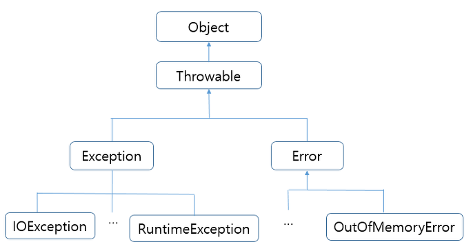

# 지옥자바 스터디 - 08 예외처리

## 예외 처리 (Exception Handling)

`프로그램 오류`

- 프로그램 실행중 특정 원인에 의해 오작동 또는 비정상 적인 종료가 발생하는 경우가 있다.
- 이를 발생 시점에 따라 컴파일 에러 / 런타임 에러 로 나눌 수 있다. + 논리적 에러 (재고가 음수라던가..)
    - 컴파일 에러 -> 컴파일 시 발생하는 에러
    - 런타임 에러 -> 실행시 발생하는 에러
    - 논리적 에러 -> 실행은 되지만, 의도와 다르게 동작하는 것
- 자바는 런타임에 발생할 수 있는 프로그램 오류를 Error 와 Exception 두가지로 구분 했다.
- Error -> OOM 이나 StackOverFlowError 와 같이 발생시 복구할 수 없는 심각한 오류
- Exception -> 발생하더라도 수습이 가능한 비교적 덜 심각한 에러

`예외 클래스의 계층 구조`



- RunTimeException 클래스들은 주로 개발자의 실수에 의해 발생할 수 있는 예외 들이다.
    - 자바 프로그래밍 요소들과 관계가 깊다.
    - ArrayIndex.., NPE.. ClassCast 등..
- Exception 클래스들은 주로 외부의 영향을 받을 수 있는 예외들이다.
    - 프로그램 사용자들의 동작에 의해 발생하는 경우가 많다.
    - 존재하지 않는 파일 / 클래스명 오타 등..

`예외 처리하기 try-catch`

- 예외 처리란, 프로그램시 실행 도중 발생할 수 있는 예외에 대비한 코드를 작성하는 것
- 예외처리의 목적은, 예외의 발생으로 인한 **실행중인 프로그램의 비정상 종료를 막고 정상적인 실행상태를 유지** 하는 것
- 발생한 예외를 처리하지 못하면 비정상 종료되고, 이는 JVM 예외 처리기 (UncaughtExceptionHandler) 가 받아 예외 원인을 화면에 출력한다.

```java
try {
	// 예외가 발생할 수 있는 문장
} catch (Exception e) {
    // 예외 처리	
}
```

`UncaughtExceptionHandler`

- JDK 1.5 에 추가된 인터페이스
- Thread 클래스의 내부 인터페이스로 선언되어 있고, 스레드가 동작도중 내부에서 발생한 예외를 처리 하지 않으면 해당 인터페이스 구현체에서 예외 처리가 가능하다.
- 기본적으로 스택 트레이스를 출력한다.
- 기본 구현체는 **ThreadGroup** 클래스
```java

@FunctionalInterface
public interface UncaughtExceptionHandler {
	/** * Method invoked when the given thread terminates due to the * given uncaught exception. * <p>Any exception thrown by this method will be ignored by the * Java Virtual Machine. * @param t the thread * @param e the exception */
	void uncaughtException(Thread t, Throwable e);
}
```

`try-catch 문의 흐름`
- try 블럭 내에서 예외가 발생한 경우
  - 발생한 예외와 일치하는 catch 블럭을 확인한다.
  - 일치하는 catch 블록이 존재할 경우 해당 문장을 수행하고 try-catch 블럭을 빠져나간다.
  - 일치하는 catch 블록이 존재하지 않을 경우 예외는 처리되지 못한다.
- try 블럭 내에서 예외가 발생하지 않은 경우
  - catch 블럭을 거치지 않고 try-catch 블럭을 빠져나간다.

> try 블럭에 포함시킬 코드의 범위를 잘 생각해야 한다.

`예외의 발생과 catch 블럭`
- 예외 발생시 발생한 예외 타입의 인스턴스가 생성된다.
- 첫번째 블록부터 차례대로 내려가며 instanceof 연산자를 이용해 검사 결과가 true 인 블록을 찾는다.
  - 하향식 검사
- 검사 결과가 모두 false 라면 예외 처리는 되지 않음
- JDK 1.7 부터 Multi-catch 블록이 사용 가능하다.
- 예외 발생시 관련된 예외 클래스의 인스턴스에는 발생한 예외에 대한 정보가 담겨 있다.
  - getMessage() : 저장된 메세지를 읽을 수 있음
  - printStackTrace() : 예외 발생 당시 호출 스택에 존재하던 메소드의 정보와 예외 메세지를 출력
    - 안티패턴... 절대 사용해서는 안된다.
    - 가장 큰 문제는 stackTrace 의 정보는 Tomcat 기준 catalina.out 에만 존재한다...
    - Logger 를 사용해서 출력하는 것을 권장함
    
```java
try {

} catch (ExceptionA | ExceptionB e) {
	e.printStackTrace();
}
```
- multi catch 에서 | 기호로 연결된 클래스가 조상-자손 관계라면 컴파일 에러가 발생한다.
- 특정 예외의 메소드는 호출이 불가능하다.
- catch 블록으로 잡은 예외 인스턴스 변수는 final 이다.

`예외 발생시키기`
- throw 키워드를 이용해 개발자가 의도적으로 예외를 발생 시킬 수 있다.

```java
Exception e = new Exception();
throw e;
```

`메소드에 예외 선언`
- 예외를 처리하는 또 다른 방법
- throws 를 이용해 호출자에게 예외 처리를 전가
```java
void method() thorws Exception1, Exception2, ... ExceptionN {

}
```
- 발생가능한 예외를 나열해 메소드 호출자가 어떤 예외를 처리해야하는지 알 수 있음
- 일반적으로 런타임 예외는 작성하지 않는다.

`finally 블럭`
- 예외 발생여부와 상관없이 반드시 실행되어야 하는 코드를 포함시킬 목적으로 사용된다.

```java
try {
	// 예외가 발생할 가능성이 있는 문장들을 넣음
} catch (Exception e){
	// 예외 처리를 위한 문장을 적음
} finally {
	// 예외의 발생여부에 관계없이 항상 수행되어야하는 문장들을 넣음
}
```

`try-with-resource 문`
- 사용후 반드시 자원을 회수해 주어야 하는 것들이 있음 (주로 I/O)
- 이 때 try-with-resource 문을 이용해 코드를 간략화 할 수 있다.

```java
//일반 try-catch-finally

try {
  FileInputStream fis = new FileInputStream("data.dat")
  DataInputStream dis = new DataInputStream(fis)
} catch (Exception e) {
	
} finally {
  try {
    if(dis != null) {
      dis.close();
    }
  } catch (IOException ie) {
    
  }
}


//try-with-resources
try(FileInputStream fis = new FileInputStream("data.dat");
    DataInputStream dis = new DataInputStream("data.dat")) {

} catch (Exception e) {

}
```
- try-with-resource 에 의해 객체의 자원을 회수하려면 AutoClosable 인터페이스를 구현하고 있어야 한다.
- close() 내부에서 예외가 발생한다면 supressed(억제된) 이라는 의미의 머리말과 함께 출력된다.

`사용자 정의 예외`
- 지정된 예외 외에도 사용자가 정의한 별도의 예외를 정의하여 사용할 수 있다.

```java
class HelloException extends RuntimeException {
	
}
```
- 체크예외 또는 언체크 예외를 상속받아 예외처리 여부를 선택할 수 있음

`예외 되 던지기 (exception re-throwing)`
- 예외를 처리하고 인위적으로 다시 발생시키는 방법
- 하나의 예외에 대해서 예외가 발생한 메소드와 이를 호출한 메소드 양쪽 모두 처리해야할 경우 사용된다.

```java
try {
    // ....
} catch (Exception e) {
    throw e; //<= 예외 재발생
}
```

`연결된 예외 (chained-excetpion)`
- 예외를 연결시켜 하나의 예외가 다른 예외를 연쇄적이로 발생 시킬 수 있다.

```java
try {
	startInstall();
	copyFiles();
} catch (SpaceException e) {
	InstallException ie = new InstallException("설치중 예외 발생");
	ie.initCause(e);
	throw ie;
}
```
- 예외를 연결시키는 이유
  - 여러 예외를 하나의 큰 분류의 예외로 묶어서 다루기 위함 (PSA)
  - 체크 예외를 언체크 예외로 변환하여 해당 예외처리를 선택적으로 할 수 있도록 한다.

## 참고
- https://www.slipp.net/questions/350