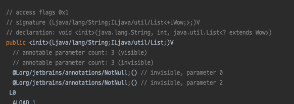
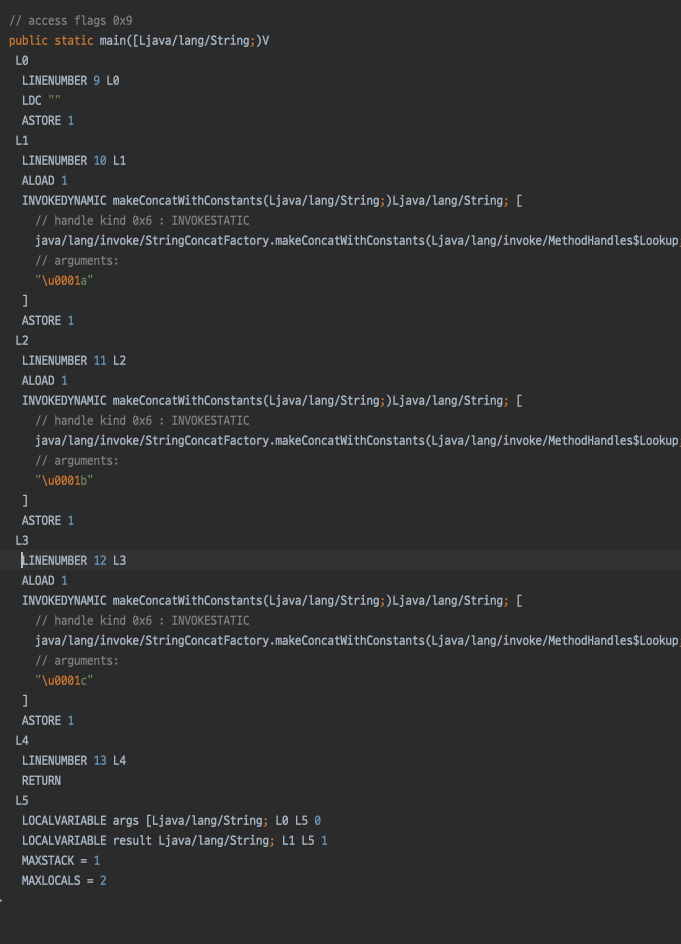
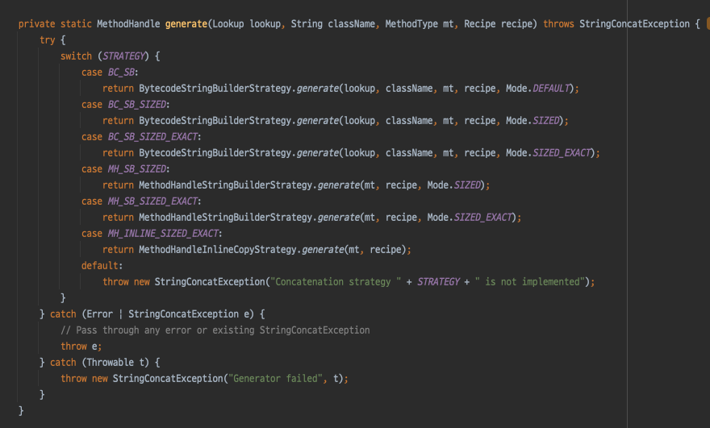
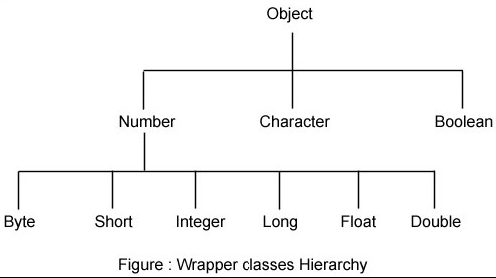
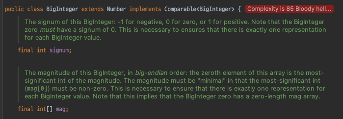
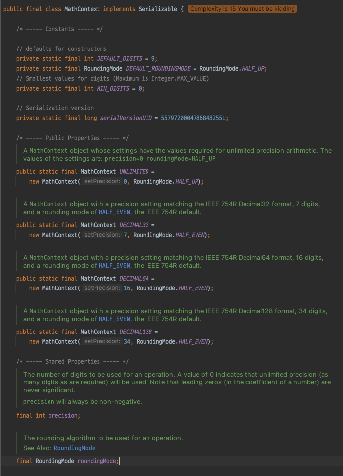

# 지옥자바 스터디 - 09 java.lang 패키지와 유용한 클래스

## java.lang 패키지
- 자바프로그래밍에 가장 기본이 되는 클래스들이 존재함
- import 문 없이도 사용이 가능하다
  - 컴파일러가 암묵적으로 추가해 줌

### Object 클래스
- 모든 클래스의 조상이 되는 클래스

| 메소드 | 설명 |
| --- | --- |
| clone() | 객체 자신의 복사본을 반환 |
| **equals()** | 인자로 들어온 객체와 자신이 동일한 객체인지 반환 |
| finalize() | 객체 소멸시 GC 에 의해 자동 호출 / 이때 수행될 코드가 있다면 오버라이딩 한다. |
| getClass() | 클래스 정보를 가지고 있는 Class 인스턴스를 반환 (Class 가 로드될때 Class 타입 객체가 생성됨) |
| **hashCode()** | 자신의 해시코드를 반환 |
| **toString()** | 자신의 정보를 문자열로 반환 |
| notify() | 객체 자신을 사용하기 위해 대기중인 스레드 하나를 깨운다. |
| notifyAll() | 객체 자신을 사용하기 위해 다기중인 스레드 모두를 깨운다. |
| wait() <br/> wait(long timeout) <br/> wait(long timeout, int nanos) | 다른 스레드가 notify, notifyAll 을 호출할 때 까지 현재 스레드를 대기 시킨다. |

> 위 메소드중 가장 자주 사용되고 / 중요한 3가지 메소드만 알아본다.

`Object - equals()`
- 매개변수로 객체의 참조를 받아 비교하여 해당 결과를 boolean 으로 반환 해준다.
- 아래 코드는 Object 클래스에 존재하는 기본 equals 메소드의 구현
- **객체 참조 값을 비교** 하여 **동등성** 을 판단한다.
```java
// Object 클래스의 기본 구현
public boolean equals(Object obj) {
    return (this == obj);
}
```

`Object - hashCode()`
- 해싱 기법에 사용되는 **해시 함수** 를 구현한 것
- 추후 배울 Collection 에서 이를 사용해 동일한 요소인지 판단을 할때 사용됨
- Object 클래스에 정의된 구현은 **객체의 주소값** 을 이용해 해시코드를 생성한다.
- 때문에 절대 동일한 해시코드 값을 가질 수 없다.
- 객체마다 다른 값을 반환하기 때문에 **객체의 지문** 이라고 표현하기도 한다.

> 해시코드 생성시 **소수** 가 사용된다.

`재밌는내용 - 이상적인 해시 함수에 가까운 해시함수 만들기`

```text
// 이펙티브 자바 2판

1.  17과 같은 0 아닌 상수를 result라는 이름의 int 변수에 저장한다.
2. 객체 안에 있는 모든 중요 필드 f에 대해서(equals 메서드가 사용하는 필드들을 말한다) 아래의 절차를 시행한다.
    2-1. 해당 필드에 대한 int 해시 코드 c를 계산한다.
        i. 필드가 boolean이면 (f ? 1 : 0)을 계산한다.
        ii. 필드가 byte, char, short, int 중 하나이면 (int) f를 계산한다.
        iii. 필드가 long이면 (int)(f ^ (f >>> 32))를 계산한다.
        iv. 필드가 float이면 Float.floatToIntBits(f)를 계산한다.
        v. 필드가 double이면 Double.doubleToLongBits(f)를 계산하고 그 결과로 얻은 long 값을 위의 절차 iii 에 따라 해시 코드로 변환한다.
        vi. 필드가 객체 참조이고 equals 메서드가 해당 필드의 equals 메서드를 재귀적으로 호출하는 경우에는 해당 필드의 hashCode 메서드를 제귀적으로 호출하여 해시 코드를 계산한다. 좀 더 복잡한 비교가 필요한 경우에는 해당 필드의 "대표 형태(canonical representation)"를 계산한 다음, 대표 형태에 대해 hashCode를 호출한다. 필드 값이 null인 경우에는 0을 반환한다. (다른 상수를 반환할 수도 있으나, 보통 0을 사용한다.)
        vii. 필드가 배열인 경우에는 배열의 각 원소가 별도 필드인 것처럼 계산한다. 즉, 각각의 중요 원소에 대해서 방금 설명한 규칙들을 재귀적으로 적용해 해시 코드를 계산하고, 그 결과를 절차 2.B와 같이 결합한다. 배열 내의 모든 원소가 중요하다면 JDK 1.5 부터 제공되는 Arrays.hashCode 메소드 가운데 하나를 사용할 수도 있다.
    2-2. 위의 절차 A에서 계산된 해시 코드 c를 result에 다음과 같이 결합한다.
        - result = 31 * result + c
3. result를 반환한다.
4. hashCode 구현이 끝났다면, 동치 관계에 있는 객체의 해시 코드 값이 똑같이 계산되는지 점검하라. 단위 테스트를 작성해서 생각대로 되는지 확인하라. 동치 관계의 객체인데 해시 코드 값이 서로 다르다면 원인을 알아내서 고쳐라.1


// 이펙티브 자바 3판

1. int 변수 result 를 선언한 후 값 c로 초기화한다. 이때 c는 해당 객체의 첫 번째 핵심 필드를 단계 2.a 방식으로 계산한 해시코드다(여기서 핵심 필드란 equals 비교에 사용되는 필드를 말한다. 아이템 10 참조).
2. 해당 객체의 나머지 핵심 필드 f 각각에 대해 다음 작업을 수행한다.
    2-1. 해당 필드의 해시코드 c를 계산한다.
        i. 기본 타입 필드라면, Type.hashCode(f)를 수행한다. 여기서 Type은 해당 기본 타입의 박싱 클래스다.
        ii. 참조 타입 필드면서 이 클래스의 equals 메서드가 이 필드의 equals를 재귀적으로 호출해 비교한다면, 이 필드의 표준형(canonical representation)을 만들어 그 표준형의 hashCode를 호출한다. 필드의 값이 null 이면 0을 사용한다(다른 상수도 괜찮지만 전통적으로 0을 사용한다).
        iii. 필드가 배열이라면, 핵심 원소 각각을 별도 필드처럼 다룬다. 이상의 규칙을 재귀적으로 적용해 각 핵심 원소의 해시코드를 계산한 다음, 단계 2.b 방식으로 갱신한다. 배열에 핵심 원소가 하나도 없다면 단순히 상수(0을 추천한다)를 사용한다. 모든 원소가 핵심 원소라면 Arrays.hashCode를 사용한다.
    2-2. 단계 2.a에서 계산한 해시코드 c로 result를 갱신한다. 코드로는 다음과 같다.
3. result = 31 * result + c
4. result 를 반환한다
```

`해시코드 구현시 31(소수) 이 사용되는 이유 ?`
- 이펙티브 자바에도 나와 있는 내용
- result = 31 * result + c

```text
31은 소수이면서 홀수이기 때문에 선택된 값이다. 
만일 그 값이 짝수였고 곱셈 결과가 오버플로되었다면 정보는 사라졌을 것이다. 
2로 곱하는 것은 비트를 왼쪽으로 shift하는 것과 같기 때문이다. 
소수를 사용하는 이점은 그다지 분명하지 않지만 전통적으로 널리 사용된다. 
31의 좋은 점은 곱셈을 시프트와 뺄셈의 조합으로 바꾸면 더 좋은 성능을 낼 수 있다는 것이다(31 * i는 (i << 5) - i 와 같다). 
최신 VM은 이런 최적화를 자동으로 실행한다.
```

> 32 와 같은 짝수로 곱하면 bit shift 가 발생하게 한쪽이 0으로 차게 되므로 하지 않는다. <br/>
> 하지만 **소수를 사용했을때 이점은 분명하지 않고, 관행이라고만 언급** 하고 있다.

```text
It's a mixture of superstition and good sense.

First, the superstition: People who write code having to do with hash tables apparently recall that prime numbers are particularly "good" for them. It seems they don't always remember just what the "goodness" was or in what connection, but they'll throw prime numbers into the mix whenever they can. They'll throw in prime numbers even if they're not too sure what a prime number is! A colleague of mine once ran across this little coding gem:

#define HASHSIZE 51 /* a smallish prime */

Second, the good sense: Suppose MULT were 26, and consider hashing a hundred-character string. How much influence does the string's first character have on the final value of 'h', just before the mod operation? The first character's value will have been multiplied by MULT 99 times, so if the arithmetic were done in infinite precision the value would consist of some jumble of bits followed by 99 low-order zero bits – each time you multiply by MULT you introduce another low-order zero, right? The computer's finite arithmetic just chops away all the excess high-order bits, so the first character's actual contribution to 'h' is … precisely zero! The 'h' value depends only on the rightmost 32 string characters (assuming a 32-bit int), and even then things are not wonderful: the first of those final 32 bytes influences only the leftmost bit of 'h' and has no effect on the remaining 31. Clearly, an even-valued MULT is a poor idea.
```

- 31 이라는 숫자를 사용하는 데에는 나쁜 이유와, 좋은 이유가 섞여 있다.
- **나쁜 이유**
  - 소수에 대한 미신
  - 알고리즘 작성에 소수가 도움이 될 것이라는 맹신
  - 아무 생각 없이 소수를 가져다 쓰는 사람이 있다.
  - 51을 사용하고 /* a smallish prime */ 이라는 주석을 붙인 코드를 본 적도 있었다.
- **좋은 이유**
  - MULT 값으로 **짝수를 피해야 한다**
  - 짝수를 사용하면 해시코드 계산시 마다 MULT 를 곱해가므로 비트의 오른쪽이 **0 으로 가득찬 결과가 도출** 된다.
  - 100글자 문자열의 해시코드를 구하면 오른쪽에 0이 99개 붙은 결과가 나온다.
  - 따라서 홀수를 사용해야 한다.

`CLRS 의 **나누기 방법**`
- 나누기 방법의 해시 함수는 **key % m** 과 같이 나머지를 구하는 방식
    - 해시 테이블의 크기가 m = 12 이고, key = 100 이라면 해시코드는 100 % 12 므로 4가 된다.
- 나누기 방법을 사용할 때 해시 테이블의 크기인 **m** 이 피해야하는 값이 있다.
    - m 이 2의 p 제곱인 숫자가 되지 않도록 한다.
    - key 가 2의 거듭제곱 기수법으로 표현된 문자열 일때 (2진/8진/16진) m 이 2^p - 1 이 되지 않도록 한다.
- m 의 값으로 2의 거듭제곱 값과 어느정도 거리가 있는 소수를 선택하자
  - 해시 테이블에 집어넣을 아이템이 2000개이고, 해시충돌이 링크드 리스트로 해결한다고 가정
  - 이 경우 해시테이블의 크기 m = 701 이 적절
  - 701은 소수이다
  - 2000 / 701 = 2.853.... 각 해시 버킷의 최대 길이는 3이다
    - 해시 충돌이 발생하더라도 3개만 검사하면 된다.

> 적당한 홀수 값을 선택하는 방식을 취하면 되는데 굳이 소수를 선택하는 것 같음.. <br/>
> java.util.HashMap 은 CLRS의 나누기 방법을 사용 하고 있음! <br/>
> 롬복이 생성해주는 hashCode() 는 31을 사용하지 않고, 59를 사용하고 있다. (1.16.20 버전 부터..) <br/>
> 기존에 277 을 사용중이 었지만, 127 보다 작은 소수를 사용하기로 결정했고 59로 변경된것으로 확인..

`Kotlin 에서 구현하는 equals 와 hashCode`
- data class : equals / hashCode / toString/ copy 함수를 자동으로 생성해주는 클래스
- 코틀린에서도 hashCode 구현시 소수 (31) 을 사용하고 있다.
```kotlin
data class Wow(
    val name: String,
    val age: Int,
)
```

```java
public final class Wow {
    // ... 중략 
    
   public int hashCode() {
      int result = this.name.hashCode();
      result = result * 31 + Integer.hashCode(this.age);
      return result;
   }

   public boolean equals(@Nullable Object other) {
      if (this == other) {
         return true;
      } else if (!(other instanceof Wow)) {
         return false;
      } else {
         Wow var2 = (Wow)other;
         if (!Intrinsics.areEqual(this.name, var2.name)) {
            return false;
         } else {
            return this.age == var2.age;
         }
      }
   }
}

```

`이펙티브 자바 - equals 재정의시 hashCode 도 재정의 하라`
- equals 메서드를 재정의한 클래스 모두에서 hashCode도 재정의해야 한다. 
- **hashCode의 일반 규약** 을 어기게 되므로 해당 클래스의 인스턴스를 HashMap이나 HashSet 같은 컬렉션의 원소로 사용할 때 문제를 일으키게 된다.

`hashcode 규약`
1. equals비교에 사용되는 정보가 변경되지 않았다면, 객체의 hashcode 메서드는 몇번을 호출해도 항상 일관된 값을 반환해야 한다.
   - (단, Application을 다시 실행한다면 값이 달라져도 상관없다. (메모리 소가 달라지기 때문))
2. equals메서드 통해 두 개의 객체가 같다고 판단했다면, 두 객체는 똑같은 hashcode 값을 반환해야 한다.
3. equals메서드가 두 개의 객체를 다르다고 판단했다 하더라도, 두 객체의 hashcode가 서로 다른 값을 가질 필요는 없다. (Hash Collision)
   - 단, 다른 객체에 대해서는 다른 값을 반환해야 해시테이블의 성능이 좋아진다.

`최악의 해시코드 구현`

```text
@Override
public int hashCode() {
  return 42;
}
```
- 모든 객체에 대해 같은 해시코드를 반환하다 보니 같은 해시테이블의 버킷에 담기고, 평균 수행시간이 O(1) -> O(n) 으로 느려져 해시테이블의 장점을 잃게됨..

`hashcode 를 생성하는 방법`
1. IDE 자동생성 기능
2. Objects.hash()
3. Lombok 의 @EqualsAndHashCode
4. Google @AutoValue

`hashcode 재정의시 주의`
- 불변 객체의 경우 hashcode 를 캐싱하여 성능 향상을 꾀할 수 있음
- 성능을 위해 hashcode 계산시 핵심 필드를 누락시켜서는 안된다.
- hashcode 생성 규칙을 사용자에게 공표하지 말것
  - 사용자가 hashcode 에 의존한 코드를 짤 가능성이 있음
  - 다음 릴리즈에 성능 개선 여지 마련
  
`toString()`
- 인스턴스에 대한 정보를 **문자열 (String)** 로 제공할 목적
- Object 클래스에 정의된 toString() 메소드는 클래스명 + 16진수 해시코드를 얻게 된다.

```java
public String toString() {
    return getClass().getName() + "@" + Integer.toHexString(hashCode());
}
```
  
`clone()`
- 자신을 복제해서 새로운 인스턴스를 생성후 반환
- Object 클래스에 정의된 clone 메소드는 단순 인스턴스 **변수의 값** 만 복사한다.
- Cloneable 인터페이스를 구현해야 한다.
- 접근 제어자를 protected -> public 으로 변경해야 한다.

`얕은 복사와 깊은 복사`

> 5장에서 살펴 봤으니 생략..

`공변 반환타입 (convariant return type)`
- JDK 1.5 부터 공변 반환타입 이 추가되었다.
- 오버라이딩시 조상 메소드의 반환타입을 자손 클래스 타입으로 변경을 허용한다.

`kotlin 클래스를 자바에서 상속받을때의 문제`

```kotlin
open class Wow(
    val name: String,
    val age: Int,
    val children: List<Wow>
)
```



```kotlin
public interface List<out E> : Collection<E> {
	
}
```
- 원인은 out 이라는 키워드 때문... 코틀린 -> 자바 로 변환하는 과정에서 공변 반환타입을 처리하는 방식

> Proxy 객체등을 사용한다거나 할 경우 문제가 됨... 실체 타입을 찾을 수 없음.. <br/>
> 실제 Hibernate 에서 이와 관련된 이슈가 있었음

- 해결방법 1
    - MutableList 로 변경한다.
```kotlin
open class Wow(
    val name: String,
    val age: Int,
    val children: MutableList<Wow>
)
```

- 해결방법 2
  - @JvmSuppressWildcards
```kotlin
open class Wow(
	val name: String,
	val age: Int,
	val children: List<@JvmSuppressWildcards Wow>
)
```

`getClass()`
- 자신이 속한 Class 객체를 반환하는 메소드
- Class 객체는 클래스의 모든 정보를 담고 있고, **클래스당 단 하나만 존재** 한다.
- 클래스파일이 **클래스로더에 의해 메모리 로드 될 때 생성됨**

`Class 객체를 얻는 방법`
- 클래스 정보가 핊요한 경우 Class 객체에 대한 참조가 필요하다.
- 사용 가능한 방법 3가지

```java
Class cObj = new Card().getClass(); // 생성된 객체로 부터 얻는 방법
Class cObj = Card.class; // 클래스 리터럴로 부터 얻는 방법
Class cObj = Class.forName("Card"); // 클래스 이름으로부터 얻는 방법
```
> Class.forName 은 특정 클래스파일 / JDBC 드라이버를 메모리에 로드할때 주로 사용하는 방법이다.

### String 클래스
- String 클래스는 문자열을 저장하기 위해 char 배열 변수를 인스턴스 변수로 가지고 있다.
- 한번 생성된 문자열을 변경할 수 없다. (Immutable) 
- \+ 연산을 통해 문자열을 결합하는 경우 새로운 문자열이 담긴 인스턴스가 생성된다.
- 문자열 결합/추출 등의 연산이 많은 경우 StringBuffer/Builder 를 사용하는 것이 좋다.

`문자열 생성`
- 문자열을 생성하는 방법은 두가지
- **리터럴** 을 지정하는 방법 / 생성자를 이용하는 방법
- 리터럴은 지정하는 방법은 이미 존재하는 것을 **재사용** 한다.
  - 컴파일 타임에 동일한 값을 가지는 인스턴스가 1번만 생성됨 (상수풀)
- 생성자를 이용하는 방법은 매번 새로운 인스턴스가 재 생성된다.

`문자열 비교`
- equals 와 == 비교 두가지 방식이 있다.
- == 은 **주소** 를 비교하기 때문에 리터럴을 지정한 경우에만 true 가 반환된다.
- 반면 equals() 메소드는 인스턴스 내부의 실제 값을 비교하기 때문에 리터럴/생성자 방식 모두 true 가 반환됨

`빈 문자열 (empty string)`
- 길이가 0인 배열을 내부적으로 가진 인스턴스
- C 언어에서는 길이가 0인 배열을 선언할 수 없다.

> C 언어에서는 널 문자를 이용해 문자열의 끝을 알리고, 자바에서는 널 문자를 사용하지 않고 문자열의 길이 정보를 별도로 저장한다.

`StringBuilder 와 StringBuffer`
- 신입 개발자 단골 질문..
- StringBuilder 와 StringBuffer 의 가장 큰 차이는 **동기화 여부** Thread-Safe 한가 ..
- StringBuilder 의 경우 Thread-Safe 하지 않지만 퍼포먼스는 StringBuffer 보다 뛰어남
- 기본 생성자의 capacity 는 16
> JDK 1.5 버전 부터 String 의 + 연산은 컴파일 타임에 StringBuilder 를 사용하도록 최적화가 되어 있다. (라고 알려져 있다.)

`StringBuilder 로 항상 변환될까 ?`
- 결론부터 말하자면, **항상 변환되지 않는다.**

```java
// case 1
String result = "a" + "b" + "c";
// case 1 컴파일 후
String result = "abc";

// case 2
String result = "";
result += "a";
result += "b";
result += "c";

// case 2 컴파일 후
String result = "";
result = (new StringBuilder()).append(result).append("0").toString();
result = (new StringBuilder()).append(result).append("1").toString();
result = (new StringBuilder()).append(result).append("2").toString();

// case 3
String result = "";
for (int i = 0; i < 10; i ++) {
    result += i;
}
// case 3 컴파일 후
String result = "";
for (int i = 0; i < 10; i ++) {
    result = (new StringBuilder()).append(result).append("0").toString();
}
```

> 디컴파일러 옵션에 따라 정확한 코드가 확인 안될 수 있음 CFR 디컴파일러도 그런 케이스 <br/>
> 정확한 확인을 위해서는 ByteCode 를 보는게 가장 좋음
> JDK1.5 ~ 1.8 까지는 StringBuilder 로 변환되고 / Java9 부터는 최적화 방식이 완전히 달라졌다.



- InvokeDynamic (JDK 함수를 호출) 을 사용해 컴파일된 코드라도 JDK 버전업에 따른 최적화를 받을 수 있도록 함
    - JDK 11 기준 StringConcatFactory 를 사용한다.



`intern()`
- JNI 를 통해 상수풀에 해당 인스턴스를 등록하는 메소드
  - 이미 존재한다면 해당 주소값 반환
- intern 을 통해 동일한 문자열을 가지는 인스턴스는 **하나만 존재** 하도록 할 수 있음 

```java
/**
 * Returns a canonical representation for the string object.
 * <p>
 * A pool of strings, initially empty, is maintained privately by the
 * class {@code String}.
 * <p>
 * When the intern method is invoked, if the pool already contains a
 * string equal to this {@code String} object as determined by
 * the {@link #equals(Object)} method, then the string from the pool is
 * returned. Otherwise, this {@code String} object is added to the
 * pool and a reference to this {@code String} object is returned.
 * <p>
 * It follows that for any two strings {@code s} and {@code t},
 * {@code s.intern() == t.intern()} is {@code true}
 * if and only if {@code s.equals(t)} is {@code true}.
 * <p>
 * All literal strings and string-valued constant expressions are
 * interned. String literals are defined in section 3.10.5 of the
 * <cite>The Java&trade; Language Specification</cite>.
 *
 * @return  a string that has the same contents as this string, but is
 *          guaranteed to be from a pool of unique strings.
 * @jls 3.10.5 String Literals
 */
public native String intern();
```
- 메모리를 효율적으로 사용할 수 있는 것 처럼 보이지만 치명적인 단점이 존재함
- 상수풀에 존재하는 문자열에 equals() 로 모두 비교해야한다.
- 상수풀에 위치함으로 인해 GC 이 대상이 될 수 없다 (1.7 이전)

`유니코드 보충문자`
- 기존에는 유니코드가 2bytes (16bit) 문자 체계였다.
- 하지만 유니코드가 늘어남에 따라 20비트로 확장하게 됨
- 하나의 문자를 char 타입으로 다루지 못하는 상황이 발생하여 int 타입으로 다루게 되었다.
- 메소드 인자를 보면 char / int 두가지가 존재하는데 int 타입을 인자로 가진다면 유니코드 보충문자까지 지원하는 함수라고 생각하면 된다.

`format()`
- printf() 와 같이 형식화된 문자열을 만들어내는 메소드

```java
String.format("%d 더하기 %d 는 %d 이다.", 3, 5, 3 + 5);
```

`valueOf()`
- 문자열 타입으로 변환하는 메소드
- String 뿐 아니라 추후에 살펴볼 Wrapper 클래스에도 valueOf 메소드가 존재하는데 Null Handling / 캐싱 으로 인한 이점이 있음

### Math 클래스
- 기본적인 수학 계산에 유용한 메소드들이 구성되어 있다.
- Math 클래스는 Util 성 클래스 / 인스턴스를 생성할 수 없고, 모두 static 메소드로 구성되어 있다.

`자주 사용하는 메소드`

| 메소드 명 | 설명 |
| --- | --- |
| ceil() | 올림 |
| floor() | 내림 |
| round() | 반올림 |
| random() | 랜덤 |
| max() | 최대 |
| min() | 최소 |

- random 의 경우 Random 클래스를 사용하는 것을 권장
  - 반복적인 Random 작업이 이뤄질 경우 Random 클래스의 경우 한 객체를 재사용 할 수 있기에 효율적
  - Random 클래스의 경우 다양한 범위의 랜덤 범위 및 추가 작업시 유리하다. (seed 값 지정, ThreadLocalRandom 등)

`예외를 발생시키는 메소드`
- 메소드 명에 **Exact** 가 포함된 메소드들이 JDK 1.8 부터 추가됨
- 정수형 연산중 발생가능한 오버플로우를 감지하기 위한것
- 연산자는 결과만 반환할뿐 오버플로우에 대한 예외는 알려주지 않는다.
- 하지만 exact 가 포함된 메소드들은 오버플로우 발생시 ArithmeticException 을 발생시킨다.

```java
int addExact(int x, int y);
int subtractExact(int x, int y);
int multiplyExact(int x, int y);
int incrementExact(int x, int y);
int decrementExact(int x, int y);
int negateExact(int x, int y);
int toIntExact(int x, int y);
```

`StrictMath 클래스`
- Math 클래스는 퍼포먼스 향상을 위해 JVM 의 OS 에 의존적인 계산을 하고 있다.
- 반올림 처리 방식이 OS 마다 다를 수 있기 때문에 동일한 프로그램이더라도 컴퓨터마다 결과가 달라질 수 있다.
- 이런 문제를 해결하기 위해 성능을 포기하는 다신 일관성을 유지하기 위한 클래스

### 래퍼 (Wrapper) 클래스
- 객체지향 개념에서 모든 것은 객체로 다루어 져야 한다.
- 자바는 8개의 기본형 타입을 객체로 취급하지 않고 있음 (자바가 완전한 객체지향 언어가 아니라는 얘길 듣는 이유)
- 기본형 타입도 객체로 다뤄야할 경우가 있는데, 이를 위한 것이 래퍼 클래스
  - 객체 생성시 내부적으로 각 자료형에 알맞은 값을 저장하고 있다.
  - 기본형을 Wrapping 하고 있기 때문에 래퍼 클래스라고 한다.

| 기본형 | 래퍼클래스 |
| --- | --- |
| boolean | Boolean |
| char | Character |
| byte | Byte |
| short | Short |
| int | Integer |
| long | Long |
| float | Float |
| double | Double |

`오토박싱 (autoboxing) 과 언박싱 (unboxing)`
- JDK 1.5 이전에는 기본형과 참조형 간의 연산이 불가능 했다.
- 1.5 이후부터는 기본형과 참조형 간의 연산이 가능해졌다. (컴파일러가 변환)
- 기본형 -> 래퍼클래스로 자동변환 하는것을 **오토박싱**
- 참조형 -> 기본형 으로 변환하는 것을 **언박싱**

> 헷갈릴 수 있는데, 기본형을 래핑 (박싱), 래핑 된것을 언래핑 (언박싱) 이라고 생각하면 좀 더 쉬울 것이다.

`Number 클래스`


- 내부적으로 숫자를 멤버변수로 가지는 래퍼 클래스 들의 조상 클래스 이며 추상클래스 이다.
- Number 의 자손으로 BigInteger, BigDecimal 등이 있는데, 이는 long 이나 double 로 다룰 수 없는 큰 범위의 수를 처리하기 위한 것들이다.

## 유용한 클래스

### java.util.Objects
- Object 클래스의 보조 클래스이며 Math 클래스처럼 모든 메소드가 static 이다.
- 객체비교 혹은 널 체크시 유용하다.

> https://pupupee9.tistory.com/192

### java.util.Random
- 보통 난수값을 생성할때 Math.random() 을 사용한다.
  - Math 클래스도 내부적으로 Random 클래스를 사용한다.
- 난수 생성시 Random 클래스 사용을 권장한다.
  - 반복적인 Random 작업이 이뤄질 경우 Random 클래스의 경우 한 객체를 재사용 할 수 있기에 효율적
  - Random 클래스의 경우 다양한 범위의 랜덤 범위 및 추가 작업시 유리하다. (seed 값 지정, ThreadLocalRandom 등)

### java.util.regex (정규식)
- 정규식 이란, 텍스트 데이터중 원하는 조건 (pattern) 에 일치하는 문자열을 찾아 내기 위해 사용하는 것
  - Unix 환경에서 사용되던 것이지만 다양한 언어에서 지원하고 있음
- 특정 패턴의 문자열인지 검사하거나, 특정 데이터를 뽑아내는 등 다양한 활용이 가능하다.

`Pattern 과 Matcher`
- Pattern 객체는 Thread-Safe 하지만, Matcher 객체는 Thread-Safe 하지 않다.

```java
Pattern p = Pattern.compile("c[a-z]*"); //c 로 시작하는 소문자 영단어
String data = "car";
Matcher m = p.matcher(data);
if (m.matches()) {
    // dosomething..	
}
```

`Matcher.appendReplacement() 와 역슬래시(\,backslash) 그리고 $(dolar sign) 문제`
- matcher.appendReplacement(sb, “역슬래시 혹은 $가 존재하는 값”); 을 실행하면 오류가 발생할 수 있다.
  - 역슬래시와 $ 기호를 정규표현식의 특수문자로 취급하기 때문
- 다음과 같이 escape 처리를 해주어야함

```java
String value = valueToReplace.replaceAll("\\\\", "\\\\\\\\").replaceAll("\\$", "\\\\\\$");
matcher.appendReplacement(sb, value);
```

`새줄 기호 (newline) 기준으로 문자열 자르기`

```java
String[] splited = str.split("[\\r\\n]+"); // 빈 줄은 모두 사라진다.

// java 8 이후
String[] splited = str.split("\\R"); // 마지막 빈 줄 삭제됨
// split("\\R",-1) // 마지막 빈 줄 남겨두기
// split("\\R+") // 빈 줄 삭제
```

`정규식 그룹화`
- 정규식의 일부를 괄호 () 로 나누어 그룹화 할 수 있다.
- 한번 혹은 그 이상 반복을 의미하는 +, * 가 뒤에 오면 그룹화된 부분이 적용 대상이 됨
- group(int i) 로접근이 가능한데 그룹은 1 부터 시작한다.
```java
String pattern = "(0\\d{1,2})-(\\d{3,4)-(\\d{4)";

Pattern p = Pattern.compile(pattern);
Matcher m = p.matcher(p);

while(m.find()) {
	m.group()
    m.group(1)
    m.group(2)
    m.group(3)
}
```

### Scanner 클래스
- 화면/파일/문자열 등 입력소스로 부터 **문자데이터** 를 읽을때 사용할 목적으로 JDK 1.5 부터 추가되었다.
- 정규식을 이용한 라인 단위 검색을 지원한다.   
- JDK1.6 부터 **화면 입출력을 전문적으로 담당** 하는 java.io.Console 클래스가 추가됨
  - 이클립스 같은 IDE 에서는 잘 동작하지 않는다.
  
`생성자`

```java
Scanner(String source)
Scanner(File source)
Scanner(InputStream source)
Scanner(Readable source)
Scanner(ReadableByteChannel source)
Scanner(Path source) // JDK1.7 부터 추가됨
```

```java
Scanner useDelimiter(Pattern pattern)
Scanner useDelimiter(String pattern)
```

`PatternLRUCache`
- 재밌는 부분을 발견...
- Scanner 클래스 내부에 PatternLRUCache 를 구현해 두었음
- Simple 한 LRU Cache...

```java
// A cache of the last few recently used Patterns
private PatternLRUCache patternCache = new PatternLRUCache(7);

public Scanner useDelimiter(String pattern) {
    modCount++;
    delimPattern = patternCache.forName(pattern);
    return this;
}

// Small LRU cache of Patterns.
private static class PatternLRUCache {

	private Pattern[] oa = null;
	private final int size;

	PatternLRUCache(int size) {
		this.size = size;
	}

	boolean hasName(Pattern p, String s) {
		return p.pattern().equals(s);
	}

	void moveToFront(Object[] oa, int i) {
		Object ob = oa[i];
		for (int j = i; j > 0; j--)
			oa[j] = oa[j - 1];
		oa[0] = ob;
	}

	Pattern forName(String name) {
		if (oa == null) {
			Pattern[] temp = new Pattern[size];
			oa = temp;
		} else {
			for (int i = 0; i < oa.length; i++) {
				Pattern ob = oa[i];
				if (ob == null)
					continue;
				if (hasName(ob, name)) {
					if (i > 0)
						moveToFront(oa, i);
					return ob;
				}
			}
		}

		// Create a new object
		Pattern ob = Pattern.compile(name);
		oa[oa.length - 1] = ob;
		moveToFront(oa, oa.length - 1);
		return ob;
	}
}
```

### java.util.StringTokenizer 클래스
- 문자열을 특정한 구분자 (delimiter) 를 기준으로 토큰이라는 다수의 문자열로 잘라낼때 사용된다.

`StringTokenizer vs Split`

| StringTokenizer | Split |
| --- | --- |
| 문자열을 토큰화 하는 레거시 클래스 | String 또는 java.util.regex 패키지의 메소드, 지정된 정규식을 기준으로 토큰화 |
| 한번에 하나의 문자열을 반환 | 하위 문자 **배열** 을 반환 |
| EMPTY_STRING 을 처리하지 못함 | "ant, bat, pat" 같은 경우 구분자 뒤의 EMPTY_STRING 을 처리하기 좋음 |
| 구문적으로 까다로움 | 쉬운 사용 방식 |
| 구분자를 "문자열" 로 받음 | 구분자를 "정규식" 으로 받음 |
| Split 보다 약 2배 빠르다 | StringTokenizer 보다 느리다 |

> StringTokenizer 는 한 문자의 구분자만 사용할 수 있다. <br/>
> "+-*/=()" 로 구분자를 지정했다면 "+-*/=()" 전체가 구분자가 아닌, 각 문자들이 모두 구분자가 된다. <br/>
> https://www.geeksforgeeks.org/difference-between-stringtokenizer-and-split-method-in-java/

`StringTokenizer 는 정말 빠를까?`
- 구분자가 한글 집합이라거나, 한자 집합 처럼 **구분자가 매우 많은 경우 StringTokenizer 구현상 매우 비효율적으로 동작한다.**

> https://codingdog.tistory.com/entry/java-split-%EB%A9%94%EC%86%8C%EB%93%9C-stringtokenizer%EB%B3%B4%EB%8B%A4-%ED%95%AD%EC%83%81-%EB%8A%90%EB%A6%B4%EA%B9%8C%EC%9A%94

### java.math.BigInteger 클래스
- long 타입으로 표현가능한 값은 10진수로 19자리 정도
- 이보다 큰 값을 계산할 때 사용하기 좋다.
- BigInteger 은 내부에서 int 배열을 사용해서 값을 다루기 때문에 훨씬 큰 값을 다룰 수 있지만 성능은 떨어진다.
- 다른 정수형 처럼 2의 보수 형태로 표현한다.
  - 부호 필드와 실제 값을 담는 배열을 가지고 있음
- String 과 마찬가지로 Immutable 하다.



`BigInteger 생성`

```java
new BigInteger("123456789"); // 문자열로 생성
new BigInteger("FFFF", 16); // n 진수 (radix) 의 문자열로 생성
BigInteger.valueOf(123456789L); // 숫자로 생성
```
- BigInteger 의 경우 기본형으로 다룰수 없는 범위의 수를 처리하는것이 목적이기 때문에 일반적으로 문자열로 생성을 방법을 많이 사용함

`BigInteger 연산`
- 정수형 연산에 사용될 수 있는 메소드 들이 정의되어 있다.
- 기본적인 연산을 지원하는 메소드들의 목록은 다음과 같다.

```java
BigInteger add(BigInteger val); // 덧셈
BigInteger subtract(BigInteger val); // 뺄셈
BigInteger multiply(BigInteger val); // 곱셈
BigInteger divide(BigInteger val); // 나눗셈
BigInteger remainder(BigInteger val); // 나머지
```

> 나머지를 지원하는 remainder, mod 메소드가 있지만, mod 는 나누는 값이 음수일 경우 ArithmeticException 이 발생한다.


`비트 연산 메소드`
- 큰 숫자를 다루는 만큼 성능이 떨어지므로 성능 향상을 위한 다양한 비트 연산 메소드가 있다.
- BigInteger 가 정수가 짝수인지 확인하고 싶을때 가장 오른쪽 비트는 0일 것이므로 testBit(0) 으로 확인하는 것이 효율적

| 메소드 | 설명 |
| --- | --- |
| int bitCount() | 2진수로 표현 했을때, 1의 개수 (음수일 경우 0) 를 반환 |
| int bitLength() | 2진수로 표현 했을때 값을 표현하는데 필요한 bit 수 |
| boolean testBit(int n) | 우측에서 n + 1 번째 비트가 1이면 참, 아니면 거짓 |
| BigInteger setBit(int n) | 우측에서 n + 1 번째 비트를 1로 변경 |
| BigInteger clearBit(int n) | 우측에서 n + 1 번째 비트를 0으로 변경 |
| BigInteger flipBit(int n) | 우측에서 n + 1 번째 비트를 전환 (1 은 0으로, 0은 1로) |

### java.math.BigDecimal 클래스
- double 타입으로 표현가능한 값은 범위가 넓지만 정밀도가 13자리 밖에 되지않아 실수형 특성상 **오차** 를 피할 수 없다.
  - 10진 실수 -> 2진 실수로 정확히 변환이 불가능함
- BigDecimal 클래스는 정수를 이용해 실수를 표현한다.
  - 2진 정수로 변환하여 다룸
- 정수 저장시 BigInteger 를 사용한다.
- IEEE 754 의 **Decimal128** 을 지원한다.

`BigDecimal 생성`

```java
new BigDecimal("123.4567890"); // 문자열로 생성
new BigDecimal(123.456); // double 리터럴로 생성
new BigDecimal(123456); // int, long 리터럴로 생성
BigDecimal.valueOf(123.456); // 생성자 대신 사용..
```
- 기본 리터럴로 표현하는 한계가 있기 때문에 일반적으로 문자열로 생성을 방법을 많이 사용한다.

> double 타입의 값을 인자로 받는 생성자로 인스턴스를 생성할 경우 오차가 발생할 수 있음에 유의해야 한다.

`BigDecimal 연산`
- BigInteger 와 마찬가지로 수학적 연산을 지원하는 다양한 메소드들이 있다.
- 한 가지 유의할 점은 연산의 결과의 정수, 지수, 정밀도가 달라 질 수 있다.
- 곱셈의 경우 피연산자의 scale 을 더하고, 나눗셈의 경우에는 빼버린다.
- 덧셈,뺄셈의 경우에는 둘 중 자리수고 높은 쪽으로 맞추기 위해 scale 이 큰 쪽이 결과가 된다.

`divide 와 setScale`
- 나눗셈을 처리하기 위한 메소드는 다양하게 제공을 한다.
- 결과를 어떻게 반올림 처리 할 것인지, 몇 번째 자리 (scale) 에서 반올림 할 것인지 지정이 가능하다.
- 아무리 오차 없이 실수를 저장하더라도, 나눗셈에서 발생하는 오차는 어쩔 수 없다.

```java
divide(BigDecimal divisor)
divide(BigDecimal divisor, int roudingMode)
divide(BigDecimal divisor, RoundingMode roundingMode)
divide(BigDecimal divisor, int scale, int roungdingMode)
divide(BigDecimal divisor, int scale, RoundingMode roungdingMode)
divide(BigDecimal divisor, int scale, MathContext mc)
```

`RoundingMode`

| 상수 | 설명 |
| --- | --- |
| CEILING | 올림 |
| FLOOR | 내림 |
| UP | 양수시 올림, 음수시 내림 |
| DOWN | UP 과 반대 |
| HALF_UP | 반올림 (5 기준) |
| HALF_EVEN | 반올림 (짝수면 HALF_DOWN, 홀수면 HALF_UP) |
| HALF_DOWN | 반올림 (6 기준) |
| UNNECESSARY | 나눗셈이 나누어 떨어지지 않는 경우 ArithmeticException 발생 |

> divide 메소드의 결과가 무한소수인 경우 반올림 모드가 지정되지 않았다면 ArithmeticException 가 발생한다.

`java.math.MathContext`



- 반올림 모드와 정밀도를 하나로 묶어둔 클래스
- devide 에서 scale 은 소수점 이하의 자리수 를 의미하지만 MathContext 의 precision 은 정수와 소수점 이하를 포함한 모든 자리수를 의미 한다.


## 참고
- https://johngrib.github.io/wiki/Object-hashCode/
- https://bytes.com/topic/c/answers/537762-why-mult-31-hash-function-string
- https://jaehun2841.github.io/2019/01/12/effective-java-item11/
- https://bcho.tistory.com/1072
- https://d2.naver.com/helloworld/831311
- https://www.baeldung.com/introduction-to-autovalue
- https://www.youtube.com/watch?v=Ou_-DFaAUhQ&list=PLdHtZnJh1KdaM0AfxPA7qGK1UuvhpvffL&index=7
- https://siyoon210.tistory.com/160
- https://gist.github.com/benelog/b81b4434fb8f2220cd0e900be1634753
- https://dzone.com/articles/jdk-9jep-280-string-concatenations-will-never-be-t
- https://docs.oracle.com/en/java/javase/11/docs/api/java.base/java/lang/invoke/StringConcatFactory.html
- https://programmingnote.tistory.com/37
- https://kwonnam.pe.kr/wiki/java/regex
- https://www.geeksforgeeks.org/difference-between-stringtokenizer-and-split-method-in-java/
- https://codingdog.tistory.com/entry/java-split-%EB%A9%94%EC%86%8C%EB%93%9C-stringtokenizer%EB%B3%B4%EB%8B%A4-%ED%95%AD%EC%83%81-%EB%8A%90%EB%A6%B4%EA%B9%8C%EC%9A%94
- https://pridiot.tistory.com/62