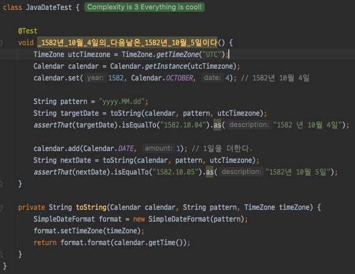
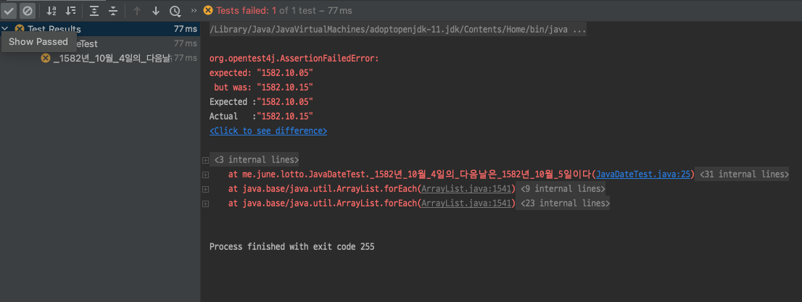
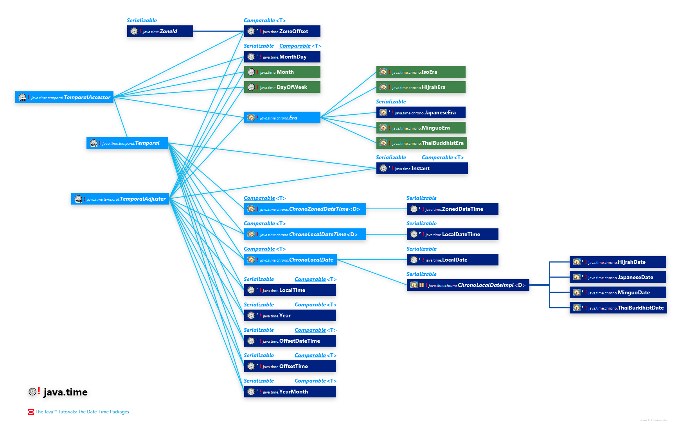
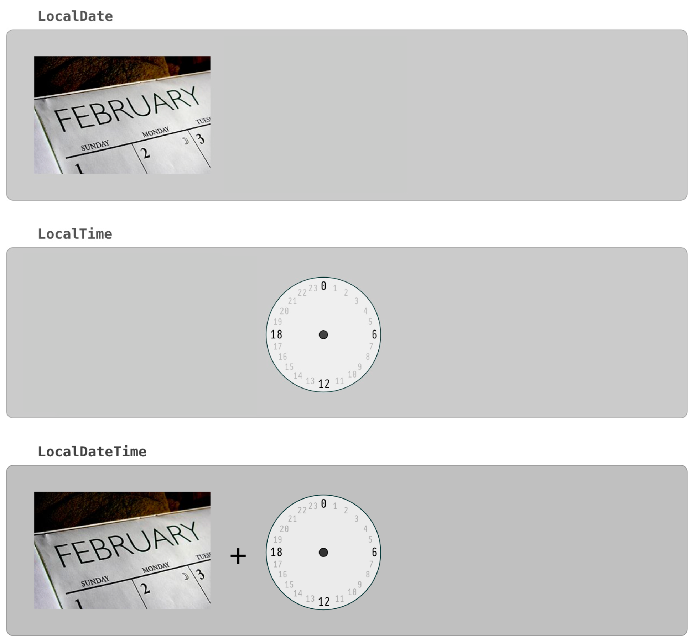
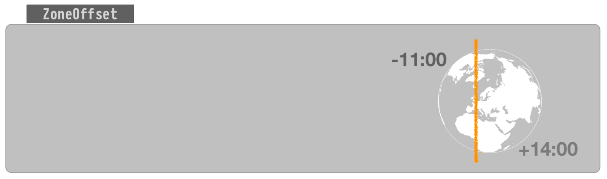
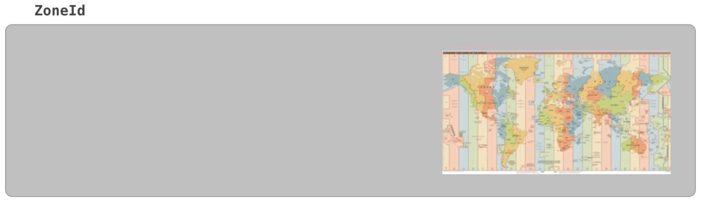
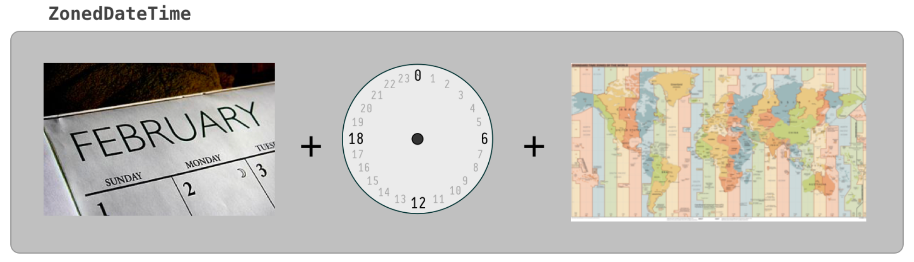
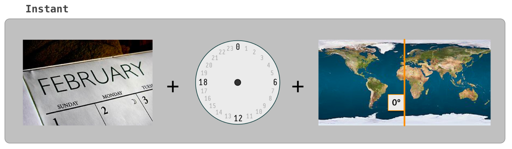

# 지옥자바 스터디 - 10 날짜와 시간 & 형식화

## 날짜와 시간

### Calendar 와 Date
- Date 클래스는 날짜와 시간을 다루는 목적으로 JDK 1.0 부터 제공된 클래스
- Calendar 클래스는 JDK1.1 부터 제공된 클래스 이다.
  - Date 클래스의 기능이 부족했기 때문에 서둘러 추가됨
- Date 클래스의 단점을 보완하기 위해 Calendar 클래스가 추가 되었지만 몇가지 단점이 발견되었다.
- 때문에 JDK1.8 부터 JodaTime 을 본따 LocalDateTime 등이 추가 되었다. (JSR-310)

`1582년 10월 4일의 다음날은 ?`




- 위 테스트는 실패한다.
- 1582년에서 사라진 10일은, 그레고리력을 처음 적용하면서 율리우스력에 의해 누적된 오차를 교정하기 위해 건너뛴 기간...
- 위 코드에서 getInstance() 는 **GregorianCalendar** 의 인스턴스를 반환하고 있다.
  - 이는 그레고리력과 율리우스력을 같이 구현하고 있다.
- AD 4년의 3월 1일 이전에는 윤년을 불규칙하게 두었기 때문에 GregorianCalendar 클래스로 구한 날짜는 정확하지는 않다

> 이외에도 썸머타임 등의 문제가 있음..

`JDK 기본 날짜 클래스의 문제`
- Immutable 하지 않음
- int 상수 필드를 남용하고 있음
- 실수를 유발하기 쉬운 월 지정
- 일관성이 없는 요일 상수
- Date / Calendar 의 불편한 역할 분담
- 오류에 둔감한 시간대 ID 지정
- java.util.Date 하위 클래스 문제

### Calendar 와 GregorianCalendar
- Calendar 는 추상 클래스이다.
  - Calendar.getInstance() 메소드는 이를 구현한 클래스의 인스턴스를 반환
  - 구현 클래스로는 GregorianCalendar / BuddhistCalendar (태국) 가 있다.

> getInstance() 로 얻은 인스턴스는 기본적으로 현재 시스템 날짜와 시간에 대한 정보를 담고 있다. <br/>
> 현재 설정된 Locale 정보를 기반으로 GregorianCalendar / BuddhistCalendar 중 하나의 인스턴스를 반환한다.

```java
public static Calendar getInstance() {
    Locale aLocale = Locale.getDefault(Locale.Category.FORMAT);
    return createCalendar(defaultTimeZone(aLocale), aLocale);
}
```

### Date 와 Calendar 간의 변환
- Calendar 클래스가 추가 됨으로 인해 Date 클래스의 대부분 메소드가 deprecated 되었다.

```java
// Calendar to Date
Calendar cal = Calendar.getInstnace();
Date d = new Date(cal.getTimeInMillis());

// Date to Calendar
Date d = new Date();
Calendar cal = Calendar.getInstance();
cal.setTime(d);
```

`Calendar.add 와 Calendar.roll`
- add 와 roll 메소드 모두 지정한 필드 값을 원하는 만큼 증가 혹은 감소 시키는 메소드이다.
- 이둘의 차이는 **다른 필드 영향의 유무**
- add 메소드로 Calendar.DATE 의 값을 31 만큼 증가 시켰다면 다음 달로 넘어가므로 Calendar.MONTH 의 값도 증가하지만 roll 메소드는 일 필드만 변경된다.

> 한 가지 예외 상황으로는 Calendar.DATE 필드가 **말일** 일 때, roll 메소드로 Calendar.MONTH 필드를 변경하면 일 필드에 영향을 미칠 수 있다. 

## 형식화 클래스

### DecimalFormat
- 숫자를 형식화 하기 위해 제공되는 클래스
- 숫자 -> 정수, 부동소수점, 금액 등 다양한 형식으로 표현이 가능하다.
- 형식화 클래스 에서는 원하는 형식으로 표현 / 변환하기 위해 **패턴** 을 정의한다.

| 기호 | 의미 | 패턴 | 결과 |
| --- | --- | --- | --- |
| 0 | 10진수 (값이 없다면 0) | 0 <br/> 0.0 | 12345678 <br/> 1234567.9 |
| # | 10진수 | # <br/> #.# | 12345678 <br/> 12345678.9 |
| . | 소수점 | #.# | 1234567.9 |
| - | 음수부호 | #.#- <br/> -#.# | 1234567.9- <br/> -1234567.9 |
| , | 단위 구분자 | #,###,## | 1,234,567,89 |

> 위 패턴 외에도 지원하는 다양한 패턴이 존재함

```java
double number = 1234567.89;
DecimalFormat df = new DecimalFormat("#.#E0");
String result = df.format(number);
```

`패턴을 이용해 숫자를 다르게 변환하기`

```java
DecimalFormat df = new DecimalFormat("#,###.##");
DecimalFormat df2 = new DecimalFormat("#.###E0");

Numer num = df.parse("1,234,567.89");

double d = num.doubleValue();

df2.format(num);
// 결과
// 1,234,567,89 -> 1234567.89 -> 1.23E6
```

> Integer.parseInt 메소드는 콤마 (,) 점(.) 이 들어간 문자열을 숫자로 변환하지 못한다.

### SimpleDateFormat
- 날짜를 형식화 하는 클래스
- **DateFormat** 클래스를 구현하고 있다.
    - getInstance 메소드를 통해 반환 되는 것은 SimpleDateFormat 클래스
- Thread-Safe 하지 않다.

```java
Date today = new Date();
SimpleDateFormat df = new SimpleDateFormat("yyyy-MM-dd");
String result = df.format(today);
```

> Java8 에 추가된 DateTimeFormatter 사용 권장

`Java 8 DateTimeFormatter`

```java
DateTimeFormatter format = DateTimeFormatter.ofPattern("yyyy-MM-dd HH:mm:ss");
LocalDateTime.parse("2021-01-18 20:00:0", format);
```

`JodaTime DateTimeFormat`

```java
DateTimeFormat format = DateTimeFormat.forPattern("yyyy-MM-dd HH:mm:ss")
DateTime.parse("2021-01-18 20:00:0", format);
```

### ChoiceFormat
- 특정 범위에 속하는 값을 문자열로 반환해준다.
- 연속적 혹은 불연속적인 범위의 값들을 처리하는데 있어서 if 나 switch 문은 적절하지 못한 경우가 많다.
- ChoiceFormat 을 잘 사용해 간단하고 직관적인 코드 작성이 가능하다.

```java
double[] limits = {60, 70, 80, 90};

String[] grades = {"D", "C", "B", "A"};

int scores = {100, 95, 88, 70, 52, 60, 70};

ChoiceFormat form = new ChoiceFormat(limits, grades);

for (int i = 0; i < scores.length; i++) {
	scores[i];
    form.format(scores[i]);   
}
// 100: A
// 95: A
// 88: B
// 70: C
// 52: D
// 60: D
// 70: C
```
- 위 코드는 두 개의 배열이 사용 되었다.
  - 범위 경계값 저장
  - 범위에 포함된 값을 치환할 문자열 저장
- 경계값은 **반드시 오름차순으로 정렬** 되어 있어야 한다.
- 치환될 문자열의 갯수는 경계값의 범위 개수와 일치해야 한다.
  - 그렇지 않을 경우 IllegalArgumentException 이 발생함

```java
String pattern = "60#D|70#C|80<B|90#A";

int scores = {91, 90, 80, 88, 70, 52, 60};

ChoiceFormat form = new ChoiceFormat(pattern);

for (int i = 0; i < scores.length; i++) {
    scores[i];
    form.format(scores[i]);
}
// 91: A
// 90: A
// 80: C
// 88: B
// 70: C
// 52: D
// 60: D
```
- 배열 대신 패턴을 사용하는 방법
- 구분자로 # 과 < 두가지를 제공한다.
  - limit#value 의 형식
  - \# : 지정된 경계값을 포함
  - < : 지정된 경계값을 포함시키지 않음

### MessageFormat
- 데이터를 정해진 양식에 맞게 출력한다.

```java
String msg = "Name: {0} \nTel: {1} \nAge:{2} \nBirthday:{3}";

Object[] arguments = {
    "이자바", "02-123-1234", "27", "07-09"
};

String result = MessageFormat.format(msg, arguments);
// Name: 이자바
// Tel: 02-123-1234
// Age: 27
// Birthday: 07-09
```
- {n} 의 형태로 표시된 부분이 데이터가 출력될 자리이고, 배열처럼 인덱스가 0 부터 시작한다.
- 홑따옴표 (') 는 MessageFormat 의 양식에서 escape 문자로 사용되기 때문에 필요시 연속으로 두번 사용 해야 한다.

## java.time 패키지
- Date 와 Calendar 의 단점들을 해소하기 위해 JDK 1.8 부터 추가되었다.
- 이 패키지에 속한 클래스들은 String 과 마찬가지로 **Immutable** 하다.
- java.time
  - 날짜와 시간을 다루는 핵심 클래스 제공
- java.time.chrono
  - 표준 (ISO) 가 아닌 달력 시스템을 위한 클래스 제공
- java.time.format
  - 날짜와 시간을 파싱 / 형식화 하기 위한 클래스 제공
- java.time.temporal
  - 날짜와 시간의 필드 / 단위를 위한 클래스 제공
- java.time.zone
  - 시간대 (time-zone) 와 관련된 클래스 제공

### java.time 핵심 클래스
- LocalDate
  - 날짜 표현시 사용
- LocalTime
  - 시간 표현시 사용
- LocalDateTime
  - 날짜 + 시간 표현시 사용
- ZonedDateTime
  - 날짜 + 시간 + 시간대
- Instant
  - Date 와 유사한 클래스
  - 날짜와 시간을 초단위 (나노초) 로 표현

> Instant 는 **날짜와 시간의 차이를 계산하거나 순서를 비교할 때 유리** 해 데이터베이스에 많이 사용한다. <br/>

### Period 와 Duration
- Period
  - 두 날짜간의 차이를 표현
- Duration
  - 시간의 차이를 표현

### 객체 생성 - now 와 of
- java.time 패키지에 존재하는 클래스의 객체를 생성하는 가장 기본적인 방법

`now()`
- 현재 날짜와 시간을 저장하는 객체를 생성한다.
- now 메소드는 Instant 타입의 인스턴스를 생성하여 계산한다.
```java
LocalDate.now(); // 2015-11-23
LocalTime.now(); // 21:54:01.875
LocalDateTime.now(); // 2015-11-23T21:54:01.875
ZonedDateTime.now(); // 2015-11-23T21:54:01.875+09:00[Asia/Seoul]
```

`of()`
- 해당 필드의 값을 순서대로 지정하여 생성한다.

```java
LocalDate date = LocalDate.of(2015, 11, 23);
LocalTime time = LocalTime.of(23, 59, 59);

LocalDateTime dateTime = LocalDateTime.of(date, time);
ZonedDateTime.of(dateTime, ZoneId.of("Asia/Seoul"));
```

### Temporal 와 TemporalAmount



- 날짜와 시간을 표현하기 위한 클래스 (LocalDate, LocalDateTime 등..) 들은 모두 **Temporal, TemporalAccessor, TemporalAdjuster 인터페이스를 구현** 하고 있다.
- Period, Duration 클래스 (두 날짜/시간의 차이를 표현) 는 **TemporalAmount 인터페이스를 구현** 하고 있다.
  - 클래스명이 Temporal 로 시작하는것들 대부분은 날짜와 시간을 위한것이다.
  - TemporalAmount 인지 그외 것들인지 만 확인하면 된다.

> Temporal 과 Chrono 모두 시간을 의미하지만 굳이 구분한 이유 -> 시간 (시분초) 와 더 큰 개념의 시간 (년월일시분초) 를 구분하기 위함이다. 

`TemporalAccessor`
- 시간 관련 객체에 대한 Read-Only 액세스를 정의한 인터페이스
- 해당 인터페이스는 프로그램 코드레벨에서 사용해서는 안된다.
  - 이는 프레임워크 레벨의 인터페이스
- 프로그램 코드레벨에서는 LocalDate 와 같은 구체 타입을 사용해야 한다.

`Temporal`
- TemporalAccessor 의 하위 인터페이스
- 시간 객체에 대한 조정 / 조작을 지원한다.

`TemporalAdjuster`
- 조정기
- 함수형 인터페이스
- 시간 객체를 수정하기 위한 명세이다.
- 전략 패턴에 따라 서로 다른 접근법을 허용 (조정 프로세스를 외부화 하기 위해 존재한다.)

`Temporal, TemporalAccessor, TemporalAdjuster 를 구현한 클래스`
- LocalDate
- LocalTime
- LocalDateTime
- ZonedDateTime
- Instant
- etc..

`TemporalAmount 를 구현한 클래스`
- Period
- Duration

`TemporalUnit 과 TemporalField`
- **TemporalUnit** 인터페이스는 날짜 / 시간의 **단위** 를 정의해 놓은 것이다.
  - 구현체는 ChronoUnit
- **TemporalField** 는 년, 월, 일 과 같이 날짜와 시간 필드를 정의해 놓은 것이다.
  - 구현체는 ChronoField

`ChronoUnit`

```java
public enum ChronoUnit implements TemporalUnit {

    /**
     * Unit that represents the concept of a nanosecond, the smallest supported unit of time.
     * For the ISO calendar system, it is equal to the 1,000,000,000th part of the second unit.
     */
    NANOS("Nanos", Duration.ofNanos(1)),
    /**
     * Unit that represents the concept of a microsecond.
     * For the ISO calendar system, it is equal to the 1,000,000th part of the second unit.
     */
    MICROS("Micros", Duration.ofNanos(1000)),
    /**
     * Unit that represents the concept of a millisecond.
     * For the ISO calendar system, it is equal to the 1000th part of the second unit.
     */
    MILLIS("Millis", Duration.ofNanos(1000_000)),
    /**
     * Unit that represents the concept of a second.
     * For the ISO calendar system, it is equal to the second in the SI system
     * of units, except around a leap-second.
     */
    SECONDS("Seconds", Duration.ofSeconds(1)),
    /**
     * Unit that represents the concept of a minute.
     * For the ISO calendar system, it is equal to 60 seconds.
     */
    MINUTES("Minutes", Duration.ofSeconds(60)),
    /**
     * Unit that represents the concept of an hour.
     * For the ISO calendar system, it is equal to 60 minutes.
     */
    HOURS("Hours", Duration.ofSeconds(3600)),
    /**
     * Unit that represents the concept of half a day, as used in AM/PM.
     * For the ISO calendar system, it is equal to 12 hours.
     */
    HALF_DAYS("HalfDays", Duration.ofSeconds(43200)),
    /**
     * Unit that represents the concept of a day.
     * For the ISO calendar system, it is the standard day from midnight to midnight.
     * The estimated duration of a day is {@code 24 Hours}.
     * <p>
     * When used with other calendar systems it must correspond to the day defined by
     * the rising and setting of the Sun on Earth. It is not required that days begin
     * at midnight - when converting between calendar systems, the date should be
     * equivalent at midday.
     */
    DAYS("Days", Duration.ofSeconds(86400)),
    /**
     * Unit that represents the concept of a week.
     * For the ISO calendar system, it is equal to 7 days.
     * <p>
     * When used with other calendar systems it must correspond to an integral number of days.
     */
    WEEKS("Weeks", Duration.ofSeconds(7 * 86400L))
    // ...
}
```

`ChronoField`

```java
public enum ChronoField implements TemporalField {

    /**
     * The nano-of-second.
     * <p>
     * This counts the nanosecond within the second, from 0 to 999,999,999.
     * This field has the same meaning for all calendar systems.
     * <p>
     * This field is used to represent the nano-of-second handling any fraction of the second.
     * Implementations of {@code TemporalAccessor} should provide a value for this field if
     * they can return a value for {@link #SECOND_OF_MINUTE}, {@link #SECOND_OF_DAY} or
     * {@link #INSTANT_SECONDS} filling unknown precision with zero.
     * <p>
     * When this field is used for setting a value, it should set as much precision as the
     * object stores, using integer division to remove excess precision.
     * For example, if the {@code TemporalAccessor} stores time to millisecond precision,
     * then the nano-of-second must be divided by 1,000,000 before replacing the milli-of-second.
     * <p>
     * When parsing this field it behaves equivalent to the following:
     * The value is validated in strict and smart mode but not in lenient mode.
     * The field is resolved in combination with {@code MILLI_OF_SECOND} and {@code MICRO_OF_SECOND}.
     */
    NANO_OF_SECOND("NanoOfSecond", NANOS, SECONDS, ValueRange.of(0, 999_999_999)),
    /**
     * The nano-of-day.
     * <p>
     * This counts the nanosecond within the day, from 0 to (24 * 60 * 60 * 1,000,000,000) - 1.
     * This field has the same meaning for all calendar systems.
     * <p>
     * This field is used to represent the nano-of-day handling any fraction of the second.
     * Implementations of {@code TemporalAccessor} should provide a value for this field if
     * they can return a value for {@link #SECOND_OF_DAY} filling unknown precision with zero.
     * <p>
     * When parsing this field it behaves equivalent to the following:
     * The value is validated in strict and smart mode but not in lenient mode.
     * The value is split to form {@code NANO_OF_SECOND}, {@code SECOND_OF_MINUTE},
     * {@code MINUTE_OF_HOUR} and {@code HOUR_OF_DAY} fields.
     */
    NANO_OF_DAY("NanoOfDay", NANOS, DAYS, ValueRange.of(0, 86400L * 1000_000_000L - 1)),
    /**
     * The micro-of-second.
     * <p>
     * This counts the microsecond within the second, from 0 to 999,999.
     * This field has the same meaning for all calendar systems.
     * <p>
     * This field is used to represent the micro-of-second handling any fraction of the second.
     * Implementations of {@code TemporalAccessor} should provide a value for this field if
     * they can return a value for {@link #SECOND_OF_MINUTE}, {@link #SECOND_OF_DAY} or
     * {@link #INSTANT_SECONDS} filling unknown precision with zero.
     * <p>
     * When this field is used for setting a value, it should behave in the same way as
     * setting {@link #NANO_OF_SECOND} with the value multiplied by 1,000.
     * <p>
     * When parsing this field it behaves equivalent to the following:
     * The value is validated in strict and smart mode but not in lenient mode.
     * The field is resolved in combination with {@code MILLI_OF_SECOND} to produce
     * {@code NANO_OF_SECOND}.
     */
    MICRO_OF_SECOND("MicroOfSecond", MICROS, SECONDS, ValueRange.of(0, 999_999)),
    /**
     * The micro-of-day.
     * <p>
     * This counts the microsecond within the day, from 0 to (24 * 60 * 60 * 1,000,000) - 1.
     * This field has the same meaning for all calendar systems.
     * <p>
     * This field is used to represent the micro-of-day handling any fraction of the second.
     * Implementations of {@code TemporalAccessor} should provide a value for this field if
     * they can return a value for {@link #SECOND_OF_DAY} filling unknown precision with zero.
     * <p>
     * When this field is used for setting a value, it should behave in the same way as
     * setting {@link #NANO_OF_DAY} with the value multiplied by 1,000.
     * <p>
     * When parsing this field it behaves equivalent to the following:
     * The value is validated in strict and smart mode but not in lenient mode.
     * The value is split to form {@code MICRO_OF_SECOND}, {@code SECOND_OF_MINUTE},
     * {@code MINUTE_OF_HOUR} and {@code HOUR_OF_DAY} fields.
     */
    MICRO_OF_DAY("MicroOfDay", MICROS, DAYS, ValueRange.of(0, 86400L * 1000_000L - 1)),
```

- 위 설명만 보았을땐 크게 와닿지 않을 수 있는데 다음 예제를 살펴보면 확실히 감이 온다.

```java
// ChronoField
LocalTime now = LocalTime.now();
int minute = now.getMinute(); // 현재 시간에서 **분(minute)** 만 추출한다.
int minute = now.get(ChronoField.MINUTE_OF_HOUR); // 위 코드와 동일

// ChronoUnit
LocalDate today = LocalDate.now();
today.plusDays(1); // 오늘 날짜에 1일을 더한다.
today.plus(1, ChronoUnit.DAYS); // 위 코드와 동일
```

`isSupported()`
- 특정 TemporalField / TemporalUnit 을 사용할 수 있는지 확인하는 메소드
- 날짜 / 시간을 표현하는 모든 클래스에 포함되어 있다.

```java
boolean isSupported(TemporalUnit unit); // Temporal interface
boolean isSupported(TemporalField field); // TemporalAccessor 
```

### LocalDate 와 LocalTime
- java.time 패키지의 가장 기본이 되는 클래스이다.
- 나머지는 이 두 클래스의 확장이므로 이 두 클래스를 잘 이해하는것이 중요하다.
- LocalDate 와 LocalTime 을 합쳐 LocalDateTime 을 만들 수 있고, LocalDateTime 을 LocalDate / LocalTime 으로 변환할 수 있다.
- ZonedDateTime 은 LocalDateTime + ZonedId / ZonedOffset 을 더한 것이다. (위와 동일하게 변환도 가능하다)

`특정 필드 값 조회`
- get() , getLong()
- get 메소드에서 사용가능한 필드의 목록 -> ChronoField
  - 날짜/시간 타입에 이용 할 수 없으므로 유의

```java
LocalDate today LocalDate.now();
int year = today.get(ChronoField.YEAR);
int day = today.get(ChronoField.DAY_OF_MONTH);
int month = today.get(ChronoField.MONTH_OF_YEAR);

int year = today.getYear();
int monthValue = today.getMonthValue();
Month month = today.getMonth();
int dayOfMonth = today.getDayOfMonth();
int dayOfYear = today.getDayOfYear();
DayOfWeek dayOfWeek = today.getDayOfWeek();

LocalTime now = LocalTime.now();
int hour = now.getHour();
int minute = now.getMinute();
int second = now.getSecond();
int nano = now.getNano();
```

``

`특정 필드 값 변경하기`
- with(), plus(), minus()
- 필드를 변경하는 메소드 들은 **항상 새로운 객체를 새롭게 생성하여 반환** 한다는 점에 유의해야 한다.

```java
LocalDate with(TemporalField field, long newValue);

LocalDate withYear(int year);
LocalDate withMolnth(int dayOfMonth);
// ..

LocalTime plus(TemporalAmount aamountToAdd);
LocalTime plus(long amountToAdd, TemporalUnit unit);
LocalDate plus(TemporalAmount amountToAdd);
LocalDate plus(long amountToAdd, TemporalUnit unit);

LocalDate plusYears(long yearsToAdd);
LocalDate plusMonths(long monthsToAdd);
```
- LocalTime 클래스는 truncatedTo() 라는 특별한 메소드가 있다.
- 이는 메소드 **매개변수로 전달된 것 보다 작은 단위의 필드를 0으로 만든다.**
    - 매개변수로 전달하는 필드는, 시간과 관련된 필드만 사용이 가능하다.
```java
LocalTime time = LocalTime.of(12, 34, 56); // 12:34:56
LocalTime truncatedTime = time.truncatedTo(ChronoUnit.HOURS); // 시간 보다 작은 단위를 0으로 만든다. (12:00)
```

> LocalDate 에는 truncatedTo() 메소드가 존재하지 않는다. <br/>
> 그 이유는 LocalDate 필드인 년/월/일은 0이 될 수 없기 때문이다.

`날짜와 시간 비교`
- LocalDate, LocalTime 모두 Comparable 인터페이스를 구현하고 있다.
- 때문에 compareTo 메소드를 통해 비교도 가능하지만, 보다 편리하게 비교가 가능한 메소드들을 제공한다.
- isAfter(), isBefore(), isEqual()

```java
boolean isAfter(ChronoLocalDate other);
boolean isBefore(ChronoLocalDate other);
boolean isEqual(ChronoLocalDate other); // LocalDate 에만 존재
```
- equals() 메소드가 있음에도 isEqual() 메소드를 제공하는 이유
  - 연표 (Chronology) 가 다른 날짜를 비교하기 위함이다
  - equals() 메소드는 모든 필드가 일치해야 하지만 isEqual() 메소드는 오직 날짜만 비교한다.
- 대부분의 경우 equals() / isEqual() 의 결과가 동일하다.
  - 지정된 연대가 다르다면 결과는 달라진다.

```java
LocalDate kDate = LocalDate.of(1999, 12, 31);
JapaneseDate jDate = JapaneseDate.of(1999, 12, 31);

System.out.println("equals() = " + kDate.equals(jDate)); // false
System.out.println("isEqual() = " + kDate.isEqual(jDate)); // true
```
> 연대가 다른 날짜간의 비교시 equals() 메소드를 호출하면 'equals' between objects of inconvertible types 'LocalDate' and 'JapaneseDate 과 같은 경고가 발생함 (Intellij)

### Instant
- 에포크타임 (Epoch Time / 1970-01-01 00:00:00 UTC) 부터 경과된 시간을 나노초로 표현
- 사람에겐 불편한 표기방법 이지만 / 단일 진법으로 다루기 때문에 계산시 성능상 유리하다.
  - 사람이 사용하는 날짜/시간 표기법은 여러 진법이 섞여있어 계산하기 까다롭다.
- Instant 클래스는 시간을 초 단위 / 나노초 단위로 **나누어 저장** 한다.
- 기존의 java.util.Date 를 대체하기 위한 것이며, JDK1.8 부터 Date 클래스에서는 Instant 타입으로 변환할 수 있는 새로운 메소드가 추가되었다.

```java
Instant now();
Instant ofEpochSecond(long epochSecond);
Instant ofEpochSecond(long epochSecond, long nanoAdjustment);
```

> Instant 클래스는 **항상 UTC 를 기준** 이라는 점에 유의해야 한다 (한국이라면 +09:00 이므로 LocalTime 과 9시간 차이가 있음)

`UTC`
- UTC 는 CoordinatedUniversalTime 의 약자
- "세계 협정시" 라고 하며 1972년 1월1일 부터 시행된 국제 표준시
- 이전에 사용되던 GMT (그리니치 시간) 과 거의 같지만 UTC 가 좀 더 정확하다

### LocalDateTime 과 ZonedDateTime
- LocalDateTime 에 시간대 (time zone) 을 추가한 것이 ZonedDateTime

`TimeZone`
- 표준 시간이 같은 지역을 묶어서 정의한 규칙 집합

`ZoneId`
- 지역 ID 는 **지역/도시** 와 같은 형식으로 이루어 진다.
- IANA Time Zone Database 에서 제공하는 지역 집합 정보를 사용한다
- ZonedId 객체를 얻은 뒤 LocalDate, LocalDateTime, Instant 를 이용해 ZonedDateTime 객체로 변환할 수 있다.
- ZonedId 의 getRules() 메소드를 이용해 해당 시간대의 규정 획득이 가능하다.
- 기존에는 TimeZone 클래스를 사용했으나 java.time 패키지에서는 ZoneId 라는 클래스를 사용하낟.
- ZoneId 는 일광 절약시간 (썸머타임) 을 자동적으로 처리해 준다.

`ZoneOffset`
- UTC 로 부터 얼마나 떨어져있는지를 표현한다.
- 서울은 +9 / 즉 UTC 보다 9시간이 빠르다.

`OffsetDateTime`
- ZoneOffset 을 사용한 것이 OffsetDateTime
- ZonedId 는 썸머타임을 포함하지만 / ZoneOffset 은 시간대를 시간의 차이로만 구분한다.

`ZonedDateTime 변환`
- GregorianCalender 와 가장 유사한 것이 ZonedDateTime

```java
GregorianCalendar from(ZonedDateTime zdt); // ZonedDateTime to GregorianCalendar
ZonedDateTime toZonedDateTime(); // GregorianCalendar to ZonedDateTime
```

### LocalDate / LocalTime / LocalDateTime / ZonedDateTime / Instant / OffsetDateTime / ZoneId / ZoneOffset








### TemporalAdjusters
- 자주 쓰일만한 날짜 계산들을 대신해주는 메소를 정의해둔 것
- 필요시 자주 사용되는 메소드를 직접 만들 수 있다.
    
```java
LocalDate with(TemporalAdjuster adjuster);
```
- TemporalAdjuster 인터페이스를 구현한 객체를 매개변수로 제공하면 된다.

`TemporalAdjuster`

```java
@FunctionalInterface
public interface TemporalAdjuster {
	Temporal adjustInto(Temporal temporal);
}
```

`예제 - 2일을 추가하는 메소드 구현`

```java
TemporalAdjuster adjuster = new TemporalAdjuster() {
    @Override
    public Temporal adjustInto(Temporal temporal) {
        return temporal.plus(2, ChronoUnit.DAYS);
    }
};

LocalDate now = LocalDate.now();
now.with(adjuster);
```

### Period 와 Duration
- Period 는 날짜의 차이 / Duration 은 시간 차이를 계산하기 위한 것

`between()`

```java
Period period = Period.between(date1, date2);
Duration duration = Duration.between(time1, time2);
```
- date1 이 date2 이전이라면 양수, 이후면 음수로 저장된다.

- until()
  - between 과 거의 유사하지만 인스턴스 메소드라는 차이
- of()
  - 생성자 메소드
- with()
  - 특정 필드 변경
- multipliedBy/devidedBy
  - 매개변 만큼 곱하거나 나누는 메소드
  - 나누는것은 Duration 클래스만 가능
- isNegative/isZero
  - 음수 / 0 인지 확인하는 메소드
- negate/abs
  - 부호를 반대로 변경하거나 부호를 제거하는 메소드
- normalized
  - 월이 12를 넘지않도록 보정하는 메소드

### 파싱과 포맷
- 날짜와 시간을 원하는 시간으로 출력하고 해석하는 것
- 형식화 (formatting) 와 관련된 클래스들은 java.time.format 패키지에 위치하며 **DateTimeFormatter** 가 핵심 클래스
- Formatter 뿐 아니라 LocalDate / LocalTime 에도 해당 format() 메소드가 존재한다.

`로케일에 종속된 형식화`

```java
DateTimeFormatter formatter = DateTimeFormatter.ofLocalizedDateTime(FormatStyle.MEDIUM);
System.out.println(formatter.format(LocalDateTime.now())); // 2021. 8. 21. 오후 9:19:55
```

`출력 형식 정의하기`
- DateTimeFormatter.ofPattern() 메소드로 원하는 형식을 만들 수 있다.
- 문자열을 이용하는 방식 / 형식화 상수를 이용한 방식 두가지를 지원한다. 

```java
DateTimeFormatter.ofPattern("yyyy/MM/dd");
DateTimeFormatter.ISO_DATE_TIME;
```

## 참고
- https://d2.naver.com/helloworld/645609#note02


