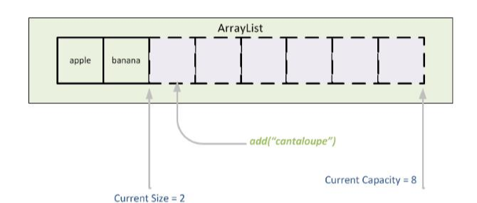
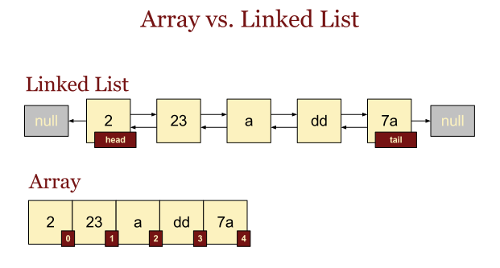
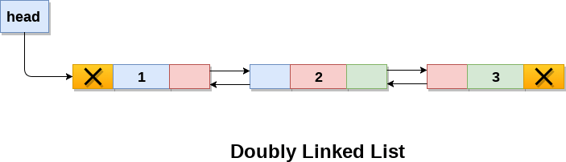
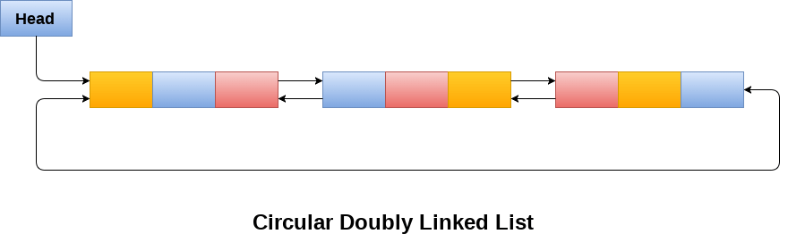
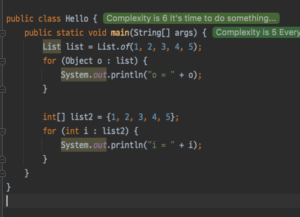
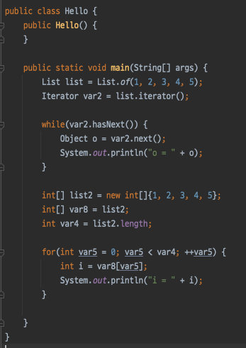
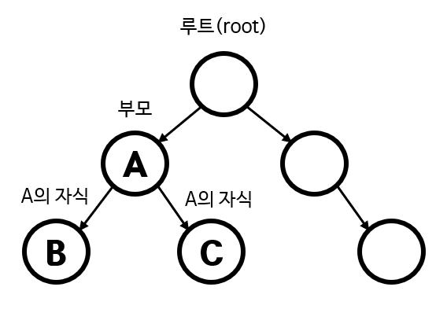
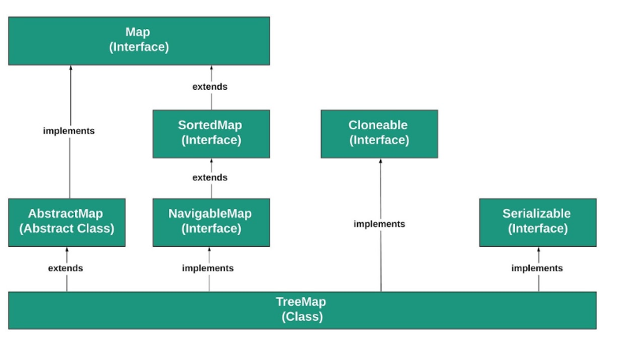
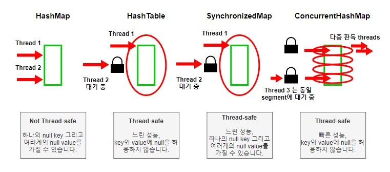

# 지옥자바 스터디 - 11 컬렉션 프레임워크

## 컬렉션 프레임워크 (Collections Framework)
- 컬렉션 프레임웍이란 **데이터를 저장하는 클래스들을 표준화 한 것** 이다.
- JDK1.2 이전까지는 Vector / Hashtable / Properties 와 같은 컬렉션 클래스 등이 각자 다른 방식으로 처리되어 있었다.
- JDK1.2 부터 컬렉션 프레임웍이 등장하며 다양한 종류의 컬렉션 클래스가 추가되고 모두 표준화된 방식으로 다룰 수 있게 체계화 되었다.

### 컬렉션 프레임워크의 핵심 인터페이스
- 데이터 그룹을 크게 3가지로 정의 하였다.
  - List / Set / Map
- List / Set 의 공통적인 부분을 다시 뽑아 상위 인터페이스인 Collection 을 추가로 정의했다.

| 인터페이스 | 설명 |
| --- | --- |
| List | 순서가 있는 데이터의 집합 / 중복 허용 / ArrayList, LinkedList, Stack, Vector 등 |
| Set | 순서를 유지하지 않는 데이터의 집합 / 중복 비허용 / HashSet, TreeSet 등 |
| Map | 키/값 쌍으로 이뤄진 데이터의 집합 / 키는 중복 비허용, 값은 중복 허용 / HashMap, TreeMap 등 |

- Vector, Stack, Hashtable, Properties 와 같은 클래스들은 컬렉션 프레임워크 이전에 구현된 클래스이다.
- 때문에 컬렉션 프레임워크의 명명법을 따르지 않는다.
- Vector, Hashtable 과 같은 기존 컬렉션 들은 호환성을 위해 남아있지만 가급적 새로 추가된 클래스를 사용할 것을 권장

`Collection 인터페이스`
- 컬렉션 클래스에 저장된 데이터를 읽고 추가 및 삭제하는 등 가장 기본적인 메소드 들을 정의하고 있다.

```java
public interface Collection<E> extends Iterable<E> {
    // Query Operations
    int size();
    
    boolean isEmpty();

    boolean contains(Object o);

    Iterator<E> iterator();


    Object[] toArray();

    <T> T[] toArray(T[] a);

    default <T> T[] toArray(IntFunction<T[]> generator) {
        return toArray(generator.apply(0));
    }

    // Modification Operations
    boolean add(E e);
 
    boolean remove(Object o);


    // Bulk Operations

    boolean containsAll(Collection<?> c);

    boolean addAll(Collection<? extends E> c);


    boolean removeAll(Collection<?> c);


    default boolean removeIf(Predicate<? super E> filter) {
        Objects.requireNonNull(filter);
        boolean removed = false;
        final Iterator<E> each = iterator();
        while (each.hasNext()) {
            if (filter.test(each.next())) {
                each.remove();
                removed = true;
            }
        }
        return removed;
    }

    boolean retainAll(Collection<?> c);

    void clear();
}
```

`List 인터페이스`
- List 인터페이스는 중복을 허용 하고 순서가 유지되는 컬렉션 구현시 사용된다.

```java

public interface List<E> extends Collection<E> {
    // Query Operations
    int size();

    boolean isEmpty();

    boolean contains(Object o);

    Iterator<E> iterator();

    Object[] toArray();

    <T> T[] toArray(T[] a);

    // Modification Operations
    boolean add(E e);

    boolean remove(Object o);
    
    // Bulk Modification Operations
    boolean containsAll(Collection<?> c);

    boolean addAll(Collection<? extends E> c);

    boolean addAll(int index, Collection<? extends E> c);

    boolean removeAll(Collection<?> c);

    boolean retainAll(Collection<?> c);

    default void replaceAll(UnaryOperator<E> operator) {
        Objects.requireNonNull(operator);
        final ListIterator<E> li = this.listIterator();
        while (li.hasNext()) {
            li.set(operator.apply(li.next()));
        }
    }

    @SuppressWarnings({"unchecked", "rawtypes"})
    default void sort(Comparator<? super E> c) {
        Object[] a = this.toArray();
        Arrays.sort(a, (Comparator) c);
        ListIterator<E> i = this.listIterator();
        for (Object e : a) {
            i.next();
            i.set((E) e);
        }
    }

    void clear();


    // Comparison and hashing
    boolean equals(Object o);

    int hashCode();


    // Positional Access Operations
    E get(int index);

    E set(int index, E element);
    
    void add(int index, E element);
    
    E remove(int index);


    // Search Operations
    int indexOf(Object o);
    
    int lastIndexOf(Object o);


    // List Iterators
    ListIterator<E> listIterator();


    ListIterator<E> listIterator(int index);

    // View
    List<E> subList(int fromIndex, int toIndex);

    @Override
    default Spliterator<E> spliterator() {
        if (this instanceof RandomAccess) {
            return new AbstractList.RandomAccessSpliterator<>(this);
        } else {
            return Spliterators.spliterator(this, Spliterator.ORDERED);
        }
    }

    static <E> List<E> of() {
        return ImmutableCollections.emptyList();
    }

    
    static <E> List<E> of(E e1) {
        return new ImmutableCollections.List12<>(e1);
    }

  
    static <E> List<E> of(E e1, E e2) {
        return new ImmutableCollections.List12<>(e1, e2);
    }

    
    static <E> List<E> of(E e1, E e2, E e3) {
        return new ImmutableCollections.ListN<>(e1, e2, e3);
    }


    static <E> List<E> of(E e1, E e2, E e3, E e4) {
        return new ImmutableCollections.ListN<>(e1, e2, e3, e4);
    }

    static <E> List<E> of(E e1, E e2, E e3, E e4, E e5) {
        return new ImmutableCollections.ListN<>(e1, e2, e3, e4, e5);
    }

 
    static <E> List<E> of(E e1, E e2, E e3, E e4, E e5, E e6) {
        return new ImmutableCollections.ListN<>(e1, e2, e3, e4, e5,
                                                e6);
    }

 
    static <E> List<E> of(E e1, E e2, E e3, E e4, E e5, E e6, E e7) {
        return new ImmutableCollections.ListN<>(e1, e2, e3, e4, e5,
                                                e6, e7);
    }

 
    static <E> List<E> of(E e1, E e2, E e3, E e4, E e5, E e6, E e7, E e8) {
        return new ImmutableCollections.ListN<>(e1, e2, e3, e4, e5,
                                                e6, e7, e8);
    }


    static <E> List<E> of(E e1, E e2, E e3, E e4, E e5, E e6, E e7, E e8, E e9) {
        return new ImmutableCollections.ListN<>(e1, e2, e3, e4, e5,
                                                e6, e7, e8, e9);
    }


    static <E> List<E> of(E e1, E e2, E e3, E e4, E e5, E e6, E e7, E e8, E e9, E e10) {
        return new ImmutableCollections.ListN<>(e1, e2, e3, e4, e5,
                                                e6, e7, e8, e9, e10);
    }
    
    @SafeVarargs
    @SuppressWarnings("varargs")
    static <E> List<E> of(E... elements) {
        switch (elements.length) { // implicit null check of elements
            case 0:
                return ImmutableCollections.emptyList();
            case 1:
                return new ImmutableCollections.List12<>(elements[0]);
            case 2:
                return new ImmutableCollections.List12<>(elements[0], elements[1]);
            default:
                return new ImmutableCollections.ListN<>(elements);
        }
    }

    static <E> List<E> copyOf(Collection<? extends E> coll) {
        return ImmutableCollections.listCopy(coll);
    }
}
```

`Set 인터페이스`
- Set 인터페이스는 중복을 허용하지 않고 저장 순서가 유지되는 컬렉션 구현시 사용된다.

```java
public interface Set<E> extends Collection<E> {
    // Query Operations
    int size();

    boolean isEmpty();

    boolean contains(Object o);

    Iterator<E> iterator();

    Object[] toArray();

    <T> T[] toArray(T[] a);

    // Modification Operations
    boolean add(E e);

    boolean remove(Object o);

    // Bulk Operations
    boolean containsAll(Collection<?> c);

    boolean addAll(Collection<? extends E> c);

    boolean retainAll(Collection<?> c);

    boolean removeAll(Collection<?> c);

    void clear();

    // Comparison and hashing
    boolean equals(Object o);

    int hashCode();

    @Override
    default Spliterator<E> spliterator() {
        return Spliterators.spliterator(this, Spliterator.DISTINCT);
    }

    static <E> Set<E> of() {
        return ImmutableCollections.emptySet();
    }

    static <E> Set<E> of(E e1) {
        return new ImmutableCollections.Set12<>(e1);
    }

    static <E> Set<E> of(E e1, E e2) {
        return new ImmutableCollections.Set12<>(e1, e2);
    }

    static <E> Set<E> of(E e1, E e2, E e3) {
        return new ImmutableCollections.SetN<>(e1, e2, e3);
    }

    static <E> Set<E> of(E e1, E e2, E e3, E e4) {
        return new ImmutableCollections.SetN<>(e1, e2, e3, e4);
    }

    static <E> Set<E> of(E e1, E e2, E e3, E e4, E e5) {
        return new ImmutableCollections.SetN<>(e1, e2, e3, e4, e5);
    }

    static <E> Set<E> of(E e1, E e2, E e3, E e4, E e5, E e6) {
        return new ImmutableCollections.SetN<>(e1, e2, e3, e4, e5,
                                               e6);
    }

    static <E> Set<E> of(E e1, E e2, E e3, E e4, E e5, E e6, E e7) {
        return new ImmutableCollections.SetN<>(e1, e2, e3, e4, e5,
                                               e6, e7);
    }

    static <E> Set<E> of(E e1, E e2, E e3, E e4, E e5, E e6, E e7, E e8) {
        return new ImmutableCollections.SetN<>(e1, e2, e3, e4, e5,
                                               e6, e7, e8);
    }

    static <E> Set<E> of(E e1, E e2, E e3, E e4, E e5, E e6, E e7, E e8, E e9) {
        return new ImmutableCollections.SetN<>(e1, e2, e3, e4, e5,
                                               e6, e7, e8, e9);
    }

    static <E> Set<E> of(E e1, E e2, E e3, E e4, E e5, E e6, E e7, E e8, E e9, E e10) {
        return new ImmutableCollections.SetN<>(e1, e2, e3, e4, e5,
                                               e6, e7, e8, e9, e10);
    }

    @SafeVarargs
    @SuppressWarnings("varargs")
    static <E> Set<E> of(E... elements) {
        switch (elements.length) { // implicit null check of elements
            case 0:
                return ImmutableCollections.emptySet();
            case 1:
                return new ImmutableCollections.Set12<>(elements[0]);
            case 2:
                return new ImmutableCollections.Set12<>(elements[0], elements[1]);
            default:
                return new ImmutableCollections.SetN<>(elements);
        }
    }

    @SuppressWarnings("unchecked")
    static <E> Set<E> copyOf(Collection<? extends E> coll) {
        if (coll instanceof ImmutableCollections.AbstractImmutableSet) {
            return (Set<E>)coll;
        } else {
            return (Set<E>)Set.of(new HashSet<>(coll).toArray());
        }
    }
}
```

`Map 인터페이스`
- 키 값 을 하나의 쌍으로 묶어 저장하는 클래스 구현시 사용한다.
- 키는 중복을 허용하지 않지만 값을 중복을 허용한다.
- 중복된 키를 저장하면 마지막에 저장한 값이 남게 된다.

```java
public interface Map<K, V> {
    // Query Operations
    int size();

    boolean isEmpty();

    boolean containsKey(Object key);

    boolean containsValue(Object value);

    V get(Object key);

    // Modification Operations
    V put(K key, V value);

    V remove(Object key);

    // Bulk Operations
    void clear();

    // Views
    Set<K> keySet();
    
    Collection<V> values();

    Set<Map.Entry<K, V>> entrySet();

    // Comparison and hashing
    boolean equals(Object o);

    int hashCode();

    // Defaultable methods
    default V getOrDefault(Object key, V defaultValue) {
        V v;
        return (((v = get(key)) != null) || containsKey(key))
            ? v
            : defaultValue;
    }

    default void forEach(BiConsumer<? super K, ? super V> action) {
        Objects.requireNonNull(action);
        for (Map.Entry<K, V> entry : entrySet()) {
            K k;
            V v;
            try {
                k = entry.getKey();
                v = entry.getValue();
            } catch (IllegalStateException ise) {
                // this usually means the entry is no longer in the map.
                throw new ConcurrentModificationException(ise);
            }
            action.accept(k, v);
        }
    }

    default void replaceAll(BiFunction<? super K, ? super V, ? extends V> function) {
        Objects.requireNonNull(function);
        for (Map.Entry<K, V> entry : entrySet()) {
            K k;
            V v;
            try {
                k = entry.getKey();
                v = entry.getValue();
            } catch (IllegalStateException ise) {
                // this usually means the entry is no longer in the map.
                throw new ConcurrentModificationException(ise);
            }

            // ise thrown from function is not a cme.
            v = function.apply(k, v);

            try {
                entry.setValue(v);
            } catch (IllegalStateException ise) {
                // this usually means the entry is no longer in the map.
                throw new ConcurrentModificationException(ise);
            }
        }
    }

    default V putIfAbsent(K key, V value) {
        V v = get(key);
        if (v == null) {
            v = put(key, value);
        }

        return v;
    }

    default boolean remove(Object key, Object value) {
        Object curValue = get(key);
        if (!Objects.equals(curValue, value) ||
            (curValue == null && !containsKey(key))) {
            return false;
        }
        remove(key);
        return true;
    }

    default boolean replace(K key, V oldValue, V newValue) {
        Object curValue = get(key);
        if (!Objects.equals(curValue, oldValue) ||
            (curValue == null && !containsKey(key))) {
            return false;
        }
        put(key, newValue);
        return true;
    }

    default V replace(K key, V value) {
        V curValue;
        if (((curValue = get(key)) != null) || containsKey(key)) {
            curValue = put(key, value);
        }
        return curValue;
    }

    default V computeIfAbsent(K key,
            Function<? super K, ? extends V> mappingFunction) {
        Objects.requireNonNull(mappingFunction);
        V v;
        if ((v = get(key)) == null) {
            V newValue;
            if ((newValue = mappingFunction.apply(key)) != null) {
                put(key, newValue);
                return newValue;
            }
        }

        return v;
    }

    default V computeIfPresent(K key,
            BiFunction<? super K, ? super V, ? extends V> remappingFunction) {
        Objects.requireNonNull(remappingFunction);
        V oldValue;
        if ((oldValue = get(key)) != null) {
            V newValue = remappingFunction.apply(key, oldValue);
            if (newValue != null) {
                put(key, newValue);
                return newValue;
            } else {
                remove(key);
                return null;
            }
        } else {
            return null;
        }
    }

    default V compute(K key,
            BiFunction<? super K, ? super V, ? extends V> remappingFunction) {
        Objects.requireNonNull(remappingFunction);
        V oldValue = get(key);

        V newValue = remappingFunction.apply(key, oldValue);
        if (newValue == null) {
            // delete mapping
            if (oldValue != null || containsKey(key)) {
                // something to remove
                remove(key);
                return null;
            } else {
                // nothing to do. Leave things as they were.
                return null;
            }
        } else {
            // add or replace old mapping
            put(key, newValue);
            return newValue;
        }
    }

    default V merge(K key, V value,
            BiFunction<? super V, ? super V, ? extends V> remappingFunction) {
        Objects.requireNonNull(remappingFunction);
        Objects.requireNonNull(value);
        V oldValue = get(key);
        V newValue = (oldValue == null) ? value :
                   remappingFunction.apply(oldValue, value);
        if (newValue == null) {
            remove(key);
        } else {
            put(key, newValue);
        }
        return newValue;
    }

    static <K, V> Map<K, V> of() {
        return ImmutableCollections.emptyMap();
    }

    static <K, V> Map<K, V> of(K k1, V v1) {
        return new ImmutableCollections.Map1<>(k1, v1);
    }

    static <K, V> Map<K, V> of(K k1, V v1, K k2, V v2) {
        return new ImmutableCollections.MapN<>(k1, v1, k2, v2);
    }

    static <K, V> Map<K, V> of(K k1, V v1, K k2, V v2, K k3, V v3) {
        return new ImmutableCollections.MapN<>(k1, v1, k2, v2, k3, v3);
    }

    static <K, V> Map<K, V> of(K k1, V v1, K k2, V v2, K k3, V v3, K k4, V v4) {
        return new ImmutableCollections.MapN<>(k1, v1, k2, v2, k3, v3, k4, v4);
    }

    static <K, V> Map<K, V> of(K k1, V v1, K k2, V v2, K k3, V v3, K k4, V v4, K k5, V v5) {
        return new ImmutableCollections.MapN<>(k1, v1, k2, v2, k3, v3, k4, v4, k5, v5);
    }

    static <K, V> Map<K, V> of(K k1, V v1, K k2, V v2, K k3, V v3, K k4, V v4, K k5, V v5,
                               K k6, V v6) {
        return new ImmutableCollections.MapN<>(k1, v1, k2, v2, k3, v3, k4, v4, k5, v5,
                                               k6, v6);
    }

    static <K, V> Map<K, V> of(K k1, V v1, K k2, V v2, K k3, V v3, K k4, V v4, K k5, V v5,
                               K k6, V v6, K k7, V v7) {
        return new ImmutableCollections.MapN<>(k1, v1, k2, v2, k3, v3, k4, v4, k5, v5,
                                               k6, v6, k7, v7);
    }

    static <K, V> Map<K, V> of(K k1, V v1, K k2, V v2, K k3, V v3, K k4, V v4, K k5, V v5,
                               K k6, V v6, K k7, V v7, K k8, V v8) {
        return new ImmutableCollections.MapN<>(k1, v1, k2, v2, k3, v3, k4, v4, k5, v5,
                                               k6, v6, k7, v7, k8, v8);
    }

    static <K, V> Map<K, V> of(K k1, V v1, K k2, V v2, K k3, V v3, K k4, V v4, K k5, V v5,
                               K k6, V v6, K k7, V v7, K k8, V v8, K k9, V v9) {
        return new ImmutableCollections.MapN<>(k1, v1, k2, v2, k3, v3, k4, v4, k5, v5,
                                               k6, v6, k7, v7, k8, v8, k9, v9);
    }

    static <K, V> Map<K, V> of(K k1, V v1, K k2, V v2, K k3, V v3, K k4, V v4, K k5, V v5,
                               K k6, V v6, K k7, V v7, K k8, V v8, K k9, V v9, K k10, V v10) {
        return new ImmutableCollections.MapN<>(k1, v1, k2, v2, k3, v3, k4, v4, k5, v5,
                                               k6, v6, k7, v7, k8, v8, k9, v9, k10, v10);
    }

    @SafeVarargs
    @SuppressWarnings("varargs")
    static <K, V> Map<K, V> ofEntries(Entry<? extends K, ? extends V>... entries) {
        if (entries.length == 0) { // implicit null check of entries array
            return ImmutableCollections.emptyMap();
        } else if (entries.length == 1) {
            // implicit null check of the array slot
            return new ImmutableCollections.Map1<>(entries[0].getKey(),
                    entries[0].getValue());
        } else {
            Object[] kva = new Object[entries.length << 1];
            int a = 0;
            for (Entry<? extends K, ? extends V> entry : entries) {
                // implicit null checks of each array slot
                kva[a++] = entry.getKey();
                kva[a++] = entry.getValue();
            }
            return new ImmutableCollections.MapN<>(kva);
        }
    }

    static <K, V> Entry<K, V> entry(K k, V v) {
        // KeyValueHolder checks for nulls
        return new KeyValueHolder<>(k, v);
    }

    @SuppressWarnings({"rawtypes","unchecked"})
    static <K, V> Map<K, V> copyOf(Map<? extends K, ? extends V> map) {
        if (map instanceof ImmutableCollections.AbstractImmutableMap) {
            return (Map<K,V>)map;
        } else {
            return (Map<K,V>)Map.ofEntries(map.entrySet().toArray(new Entry[0]));
        }
    }
}
```

`Map.Entry 인터페이스`
- Map 에 저장되는 Key/Value 쌍을 다루기 위해 내부적으로 정의한 인터페이스

```java
interface Entry<K, V> {
        
    K getKey();
    
    V getValue();

    V setValue(V value);

    boolean equals(Object o);

    int hashCode();

    public static <K extends Comparable<? super K>, V> Comparator<Map.Entry<K, V>> comparingByKey() {
        return (Comparator<Map.Entry<K, V>> & Serializable)
            (c1, c2) -> c1.getKey().compareTo(c2.getKey());
    }

    public static <K, V extends Comparable<? super V>> Comparator<Map.Entry<K, V>> comparingByValue() {
        return (Comparator<Map.Entry<K, V>> & Serializable)
            (c1, c2) -> c1.getValue().compareTo(c2.getValue());
    }

    public static <K, V> Comparator<Map.Entry<K, V>> comparingByKey(Comparator<? super K> cmp) {
        Objects.requireNonNull(cmp);
        return (Comparator<Map.Entry<K, V>> & Serializable)
            (c1, c2) -> cmp.compare(c1.getKey(), c2.getKey());
    }

    public static <K, V> Comparator<Map.Entry<K, V>> comparingByValue(Comparator<? super V> cmp) {
        Objects.requireNonNull(cmp);
        return (Comparator<Map.Entry<K, V>> & Serializable)
            (c1, c2) -> cmp.compare(c1.getValue(), c2.getValue());
    }
}
```

### ArrayList



- 컬렉션 프레임워크에서 가장 많이 사용되는 컬렉션
- List 인터페이스의 구현체
- 기존의 Vector 를 개선한 것으로 Vector 과 기능적인 측면에서 동일하다.
- Vector 클래스는 기존 소스코드와 호환을 위해 남겨두었기 때문에 가능하다면 Vector 보다 ArrayList 를 사용할 것을 권장한다.
- 내부적으로 **배열** 을 이용해 데이터를 순차적으로 저장한다.
  - 배열에 더 이상 저장할 공간이 없다면 기존 배열보다 큰 크기의 배열을 생성한뒤 기존 요소를 복사한다.
- ArrayList 생성시 **저장할 요소의 개수를 고려해 약간 여유있게 크기를 설정** 하는 것이 좋다.
  - 크기가 부족하면 자동으로 증가 (배열의 크기를 2배로 늘림) 하지만, 이 과정에서 처리시간이 많이 소요된다.
  
> ArrayList 와 같이 배열을 이용한 자료구조는 데이터를 읽고/쓰는데는 효율이 좋지만 크기가 늘어나면 상당히 효율이 떨어진다.

- 데이터를 저장하는 배열에 순차적으로 저장 / 삭제 시 System.arrayCopy() 메소드를 호출하지 않는다.
  - 작업시간이 짧음
- 하지만 순차적인 처리가 아닌 중간에 위치한 요소를 저장 / 삭제시 System.arrayCopy() 메소드를 호출해 위치를 이동시킨다.
  - 작업시간이 길어짐

`배열을 활용한 자료구조의 단점`
- 크기를 변경할 수 없다
  - 새로운 배열을 생성해서 데이터를 복사하는 방식으로 크기를 늘려야 한다
  - 실행속도 향상을 위해 충분히 큰 크기의 배열을 생성해야하기 때문에 메모리 낭비 발생
- 비순차적인 데이터 추가 및 삭제에 시간이 오래걸린다
  - 순차적인 접근 (저장/삭제) 의 경우 빠르지만, 요소들의 중간에 접근 (저장/삭제) 하는 경우 다른 데이터들을 복사해 이동시켜야 한다

### LinkedList



- 배열을 기반으로 하는 자료구조의 단점을 보완하기 위한 자료구조
- 배열은 모든 데이터가 연속적으로 존재하지만, 링크드 리스트는 불연속적으로 존재하는 데이터를 서로 **연결 (link)** 한 형태
- 모든 요소는 자신과 연결된 **다음 요소를 가리키는 참조** 를 가지고 있다
- 데이터의 추가/삭제 시 이전요소의 가리키는 참조만 변경하면 되기 때문에 처리속도가 매우 빠름
  - 배열처럼 데이터를 이동하는 과정이 없음
- LinkedList 는 JDK 1.5 에는 Queue 인터페이스를 구현 / JDK1.6 부터는 Dequeue 인터페이스를 구현한다.

`이중 연결 리스트 (doubly linked list)`



- 링크드 리스트는 이동방향이 **단 방향** 이다
- 때문에 다음 요소에 대한 접근은 쉽지만, 이전 요소에 대한 접근은 어려움
  - 단순히 이전 요소를 가리키는 참조를 추가
- 이 점을 보완하기 위하 만든 것이 더블 링크드 리스트

`이중 원형 연결리스트 (doubly circular linked List)`



- 더블 링크드 리스트의 접근성을 좀 더 향상 시킨 것
- 첫번째와 마지막 요소를 서로 연결한 것이다
  - 마지막요소로 다음요소로 첫 번째 요소를 가리키고 있기 때매 원처럼 계속해서 순환하게 된다.

`ArrayList 와 LinkedList`
- 데이터를 순차접근 (추가/삭제) 하는 경우 ArrayList 가 LinkedList 보다 빠르다
  - ArrayList 는 마지막 데이터부터 삭제하는 경우 단순히 null 로 치환하기만 하면 된다
  - 단, 요소 추가시 크기가 충분히 확보되지 않은 상태라면 LinkedList 가 더 빠를 수 있다
- 요소의 중간에 접근 (추가/삭제) 하는 경우 LinkedList 가 ArrayList 보다 빠르다
  - 중간 요소를 처리하는 경우 LinkedList 는 각 요소의 참조 (연결) 만 변경하면 된다
  - 반면 ArrayList 는 각 요소들을 재배치하여 공간 확보 또는 빈 공간을 채우는 작업이 필요하다

> 데이터의 양이 많지 않다면 사실상 두 자료구조간의 차이가 거의 없다 <br/>
> 두 자료구조 간의 장단점을 잘 이해하고 적절히 사용하는 것이 중요하다.

| 컬렉션 | 읽기 | 추가/삭제 | 비고 |
| --- | --- | --- | --- |
| ArrayList | 빠름 | 느림 | 순차 접근(추가/삭제) 시 빠름, 메모리 효율 안좋음 |
| LinkedList | 느림 | 빠름 | 데이터가 많을수록 접근성이 떨어짐 |

`ArrayList 와 LinkedList 조합해 사용하기`
- 두 클래스의 장점을 조합해 사용하는 방법도 있다.
- 최초 작업시 ArrayList 를 이용해 저장해두고, 추후 데이터가 추가된다면 LinkedList 를 이용하는 방식을 취할 수도 있다.

### Stack 과 Queue
- **스택 (Stack)** 은, LIFO (Last In First Out) 구조 이고, **큐 (Queue)** 는, FIFO (First In First Out) 구조로 되어 있다.
- 스택은 순차적으로 데이터 접근 (추가/삭제) 가 이뤄지기 때문에 ArrayList 로 구현하는 것이 좋고, 큐는 항상 첫번째 데이터에 접근하므로 LinkedList 로 구현하는 것이 바람직하다.

> 자바에서 Stack 은 구체 클래스로 제공하지만 Queue 는 인터페이스로 제공 하고 있다. <br/>
> Queue 의 경우 구현체들 (LinkedList 등..) 중 하나를 선택해 사용하면 된다.

`Stack 과 Queue 의 활용`
- 스택
  - 수식 계산 / 수식 괄호 검사 / undo, redo
- 큐
  - 최근 사용 문서, 버퍼 (buffer)

`PriorityQueue`
- Queue 의 구현체중 하나
- **저장한 순서에 상관없이 우선순위가 높은 순서대로 꺼낸다** 때문에 우선순위 큐 라고 한다.
- Null 은 저장할 수 없다. (NPE 발생)
- 저장공간으로 배열을 사용하며, 각 요소를 **힙 (Heap)** 자료구조 형태로 저장한다.
  - 힙은 이진트리의 일종

`Dequeue (Double-Ended Queue)`
- Queue 의 변형으로 양방향으로 추가/삭제가 가능하다.
- 덱 혹은 데크, 디큐 라고 읽는다.
- Queue 인터페이스를 상속하고 있으며 구현체는 ArrayDeque / LinkedList 등이 있다.

### Iterator, ListIterator, Enumeration
- Iterator, ListIterator, Enumeration 모두 컬렉션에 저장된 요소 접근시 사용하는 인터페이스 이다.
- Enumeration 은 Iterator 의 레거시이고, ListIterator 는 Iterator 의 향상된 버전이다.

`Iterator`
- 컬렉션 프레임워크에서 저장된 요소를 읽어오는 방법을 표준화 한 것
- Collection 인터페이스는 Iterator 인스턴스를 반환하는 iterator() 메소드를 정의하고 있다.

````java
public interface Iterator<E> {

	boolean hasNext();

	E next();

	default void remove() {
		throw new UnsupportedOperationException("remove");
	}

	default void forEachRemaining(Consumer<? super E> action) {
		Objects.requireNonNull(action);
		while (hasNext())
			action.accept(next());
	}
}
public interface Collection<E> extends Iterable<E> {
	Iterator<E> iterator();
}
````
- hasNext()
  - 다음 요소가 존재하는지 여부를 논리 값으로 반환한다
- next()
  - 다음 요소를 읽어온다 (호출 이전 hasNext() 를 선행작업으로 사용하는것이 안전)
- remove() (optional)
  - next() 로 읽어온 요소를 제거한다

> optional method 는 반드시 구현하지 않아도 된다. 대신 메소드 바디는 구현을 해야한다. (UnsupportedOperationException 예외 발생 하도록..)

`Iterable`
- iterator 를 반환하는 메소드를 정의한 인터페이스
- 해당 인터페이스를 구현하고 있다면, for-each loop 를 사용할 수 있다.
- 1.8 버전부터는 forEach / spliterator 등 디폴트 메소드가 추가되었다.

```java
public interface Iterable<T> {

    Iterator<T> iterator();

    default void forEach(Consumer<? super T> action) {
        Objects.requireNonNull(action);
        for (T t : this) {
            action.accept(t);
        }
    }
    
    default Spliterator<T> spliterator() {
        return Spliterators.spliteratorUnknownSize(iterator(), 0);
    }
}
```

`Iterator vs Iterable`
- Iterator
    - iteration 상태를 저장할 수 있다.
    - next 메소드를 통해 현재 element 에 접근
    - 이를 통해 각각의 element 를 처리한다
    - remove 등의 메소드가 있어 element 삭제가 가능하다
- Iterable
    - iteration 상태를 알 수 없다.
    - element 삭제가 불가능 하다

`for-each loop 는 반드시 iterable 인터페이스를 구현해야 사용할 수 있을까 ?`
- 사실 Iterable 인터페이스를 구현하고 있지 않은 배열같은 자료구조의 경우에도 for-each loop 를 사용할 수 있다.
- 평소에 별 생각없이 사용해왔던 부분인데, 살펴보니 iterable 인터페이스를 구현하고 있지 않아도, for loop 로 컴파일러가 변환하여 처리해주는 방식을 취한다.





`Map 과 Iterator`
- Map 인터페이스를 구현한 컬렉션은 키/값 을 쌍으로 저장하고 있기 때문에 iterator() 를 직접 호출할 수 없다.
- keySet() / entrySet() 과 같은 메소드를 통해 키와 값을 별도의 Set 형태로 가져온 뒤 iterator() 를 호출해야 한다.

`Iterator 와 ListIterator 그리고 Enumeration`
- Enumeration 은 컬렉션 프레임워크가 생기기 이전 **Iterator 의 구버전** 이다.
- Iterator 와 Enumeration 의 가장 큰 차이는 **Snap Shot** 여부 이다.
  - Snap Shot 을 사용하는 곳이 어디인지 ?... 원본 데이터가 변경되면 바로 반영됨 ㅜ
- 또 다른 차이는 Iterator 는 **Fail-Fast** 기법을 사용하고 있다는 점
  - Enumeration 의 경우 원본 데이터가 변경되더라도 순차접근을 계속해서 진행한다.
  - 하지만 Iterator 는 잘못된 순회를 방지하기 위해 Fail-Fast 기법을 적용하여 ConcurrentModificationException 을 발생시킨다.

> Iterator 와 Enumeration 둘의 가장 큰 차이는 Fail-Fast 적용 여부 (ConcurrentModificationException 발생 시킴) 이다.

### Arrays
- 배열을 다를때 유용한 메소드들이 정의되어 있다.

`배열의 복사`
- copyOf()
  - 배열 전체를 복사해 새 배열을 반환한다.
- copyOfRange()
  - 배열 일부를 복사해 새 배열을 반환한다.

```java
int[] arr = {1, 2, 3, 4, 5};
int[] copiedArr = Arrays.copyOf(arr, arr.length);
int[] copiedArr2 = Arrays.copyOfRange(arr, 0, arr.length);
```

`배열 채우기`
- fill()
  - 배열의 모든 요소를 지정된 값으로 초기화 한다.
- setAll()
  - 배열을 초기화할 때 사용할 함수 인터페이스를 인자로 받는다.

```java
int[] fillArr = new int[5];
Arrays.fill(fillArr, 0);

int[] setAllArr = new int[5];
Arrays.setAll(setAllArr, operand -> 10);
```

`배열의 정렬과 검색`
- sort()
  - 배열을 정렬할 때 사용한다.
- binarySearch()
  - 배열에 저장된 요소 검색 (이진 탐색) 시 사용한다. (해당 요소의 인덱스 반환)
  - 반드시 정렬된 상태어야 올바른 결과를 얻을 수 있다.

```java
int[] arr = {1, 2, 3, 4, 5};
Arrays.sort(arr);
int index = Arrays.binarySearch(arr, 5);
```

`문자열의 비교와 출력`
- toString()
  - 배열의 모든 요소를 문자열로 출력한다.
  - 다차원 배열의 경우 deepToString() 메소드를 사용해야 한다 (이는 모든 요소에 재귀적으로 접근)
- equals()
    - 배열의 모든 요소를 비교한다.
    - 다차원 배열의 경우 deepEquals() 메소드를 사용해야 한다.
  
`배열을 List 로 변환`
- asList()
  - 배열을 List 로 변환해 반호나한다
  - 매개변수 타입이 가변인자이기 때문에 배열 생성 없이 요소를 나열하는 방식으로도 사용이 가능하다.

```java
Arrays.asList(1, 2, 3, 4, 5);
```

`paralleXXX(), spliterator(), stream()`
- parallelXXX()
  - 일반적인 메소드보다 빠른 결과를 산출한다
  - 여러 스레드를 이용해 작업을 나누어 처리한다.
  - **ForkJoinPool 을 사용하므로 주의**
- spliterator()
  - 여러 쓰레드가 처리가능하도록 하나의 작업을 여러 작업으로 나누는 Spliterator 를 반환한다.
- stream()
  - 컬렉션을 스트림으로 변환한다.

```java
int[] arr = {1, 2, 3, 4, 5};

Arrays.parallelSort(arr);
Arrays.spliterator(arr);
Arrays.stream(arr);
```

### Comparator 와 Comparable
- Arrays.sort() 메소드를 호출하면 자동으로 정렬하는것 처럼 보이지만 사실은 Comparable 인터페이스 구현에 의해 정렬된 것이다.
- Comparator 와 Comparable 모두 인터페이스 이며 컬렉션 정렬시 필요한 메소드를 정의하고 있다.
  - 두 객체가 같다면 0, 작으면 음소, 크면 양수를 반환하도록 구현해야 한다.
- 기본적으로 Comparable 을 구현하고 있는 클래스들은 **오름차순** 으로 구현하고 있다.

```java
public interface Comparable<T> {
    int compareTo(T o);
}

@FunctionalInterface
public interface Comparator<T> {
	int compare(T o1, T o2);
	// ...
}
```
- Comparable 과 Comparator 는 모두 정렬과 관련된 메소드를 정의하고 있는데 이 둘의 용도는 다르다.
- Comparable 의 compareTo 메소드는 **기본 정렬 기준** 을 구현하는것이 목적이다.
- 반면 Comparator 의 compare 메소드는 **기본 정렬 기준 외 다른 기준* 을 구현하는것이 목적이다. 

> String 클래스의 기본구현은 **사전순 정렬** 이다, 대소문자를 구분하지 않게 정렬하고 싶다면 CASE_INSENSITIVE_ORDER 상수를 이용하자

### HashSet
- Set 인터페이스를 구현하는 대표적인 컬렉션
- Set 인터페이스의 특징을 따르며, 중복된 요소를 저장하지 않는다.
- List 인터페이스 처럼 저장순서를 유지하고 싶다면 LinkedHashSet 을 사용해야 한다.

> HashSet 은 내부적으로 HashMap 을 이용해 만들어졌고, 해싱을 이용해 구현했기 때문에 붙여진 이름이다.

- loadfactor 라는 값이 있는데, 이는 컬렉션 클래스에 저장공간이 가득 차기전에 미리 용량을 확보하기 위한 값이다.
- 기본값은 0.75 이고 만약 0.8이라고 가정할 경우 저장공간이 80%가 채워졌을 때 용량이 두배로 늘어난다.

`equals 와 hashCode`
- 새로운 요소를 추가하기 전에 기존에 저장된 요소와 같은 것인지 판별해야 한다.
- 이 때 해당 요소의 equals / hashCode 메소드를 호출하기 때문에 이를 적절하게 오버라이딩 해야한다. 
- JDK 1.8 에 추가된 Objects.hash() 메소드를 이용하면 간단하게 구현이 가능하다.

```java
public int hashCode() {
	return Objects.hash(name, age); 
}
```

`hashCode 의 구현 조건`
1. 실행중인 애플리케이션 내에 동일한 객체에 대해 여러번 hashCode 를 호출해도 동일한 값을 반환해야 한다.
    - 애플리케이션 실행시마다 동일한 값을 반환할 필요는 없다.
2. equals 메소드를 호출했을때 결과가 true 라면 hashCode 의 결과도 동일해야 한다.
3. equals 메소드를 호출했을때 결과가 false 일때 hashCode 의 결과가 같아도 상관은 없지만 컬렉션의 성능 향상을 위해 다른 값을 반환하도록 구현하는 것이 좋다.

> 두 객체에 대해 equals 가 true 라면 해시코드는 반드시 같아야 한다 <br/>
> 하지만 해시코드가 같다고해서 equals 가 반드시 true 일 필요는 없다.

### TreeSet



- **이진 검색 트리 (binary search tree)** 의 형태로 데이터를 저장하는 컬렉션 클래스이다.
- 정렬 / 검색 / 범위 검색에 높은 성능을 보인다.
- TreeSet 은 이진 검색트리의 성능을 향상시킨 **레드-블랙 트리 (Red-Black tree)** 로 구현되어 있다.
- **중복된 데이터를 저장하지 않으며, 정렬된 위치에 저장하기 때문에 저장순서를 유지하지 않는다.**
- 이진 트리는, 링크드리스트 처럼 다수의 노드가 서로 연결된 구조이고, 각 노드는 **최대 2개의 노드를 연결** 할 수 있다.
- **루트 (root)** 라고 불리는 하나의 노드에서 부터 시작해서 계속 확장이 가능하다.
- 이진 검색트리는, 부모 노드의 왼쪽은 부모 노드의 값 보다 작은 값을 / 오른쪽은 큰 값을 저장하는 형태의 이진트리이다.

> TreeSet 에 저장되는 객체는 Comparable 인터페이스를 구현하거나, Comparator 를 제공해 주어 두 객체를 비교할 방법을 제공해야 한다. <br/>
> 만약 그렇지 않다면 저장시 예외가 발생한다.

- 트리는 자료구조 특성상 데이터 저장시에는 트리를 재구성하는 작업이 필요할 수 있어 성능이 떨어진다.
- 하지만 배열 / 링크드 리스트에 비해 검색 및 정렬 성능이 뛰어나다.
    - 값의 개수가 10배 증가해도 특정값 검색시 필요한 비교횟수가 3~4번만 증가 할 정도로 검색 효율이 뛰어나다.
  
`이진 검색 트리 의 특징`
- 모든 노드는 최대 두개의 자식 노드를 가질 수 있다.
- 왼쪽 자식 노드의 값은 부모 노드의 값 보다 작아야 하며 오른쪽 자식 노드의 값은 부모 노드의 값 보다 커야 한다.
- 노드의 추가 / 삭제시 시간이 걸린다. (순차저장을 하지 않음)
- 검색 / 범위 검색 / 정렬시 유리하다.
- 중복된 값을 저장하지 못한다.

`subSet, headSet, tailSet`
- subSet()
  - 범위 검색시 사용한다.
  - 시작 범위는 포함되지만, 끝 범위는 포함되지 않는다.
- headSet()
  - TreeSet 에 저장된 객체중 지정한 기준 값 보다 작은 값의 객체들을 얻을 수 있다.
- tailSet()
  - TreeSet 에 저장된 객체중 지정한 기준 값 보다 큰 값의 객체들을 얻을 수 있다.

```java
TreeSet set = new TreeSet();
int[] values = {10, 15, 90, 100 ,35, 50, 60, 70};
for (int value : values) {
set.add(value);
}

SortedSet subSet = set.subSet(50, 90);
SortedSet headSet = set.headSet(50);
SortedSet tailSet = set.tailSet(90);
System.out.println("subSet = " + subSet);
System.out.println("headSet = " + headSet);
System.out.println("tailSet = " + tailSet);

// 실행 결과
subSet = [50, 60, 70]
headSet = [10, 15, 35]
tailSet = [90, 100]
```

// TODO 레드 블랙 트리 조사

### HashMap 과 HashTable
- HashMap 과 HashTable 은 Vector 와 ArrayList 의 관계와 같다. HashMap 사용을 권장한다.
- Map 인터페이스를 구현하고 있고, key/value 쌍으로 묶어 하나의 Entry 로 관리한다.
- 해싱 (hashing) 을 이용하기 때문에 검색에 있어서 높은 성능을 보여준다.

> Hashtable 은 key/value 모두 null 을 허용하지 않는다 하지만 HashMap 은 이를 허용한다.

`해싱과 해시함수`
- 해싱 -> 해시함수를 이용해 데이터를 해시테이블에 저장하고 검색하는 기법
- 해시함수 -> 넘겨받은 데이터에 대해 고유한 숫자값을 알고리즘을 구현한 함수
- Boolean 과 같이 서로 구별되는 객체의 종류가 적거나 Number 객체는 객체가 표현하는 값 자체를 해시 값으로 사용이 가능하기 때문에 **완전 해시 함수** 대상으로 삼을 수 있다.
- 하지만 String 과 같은 **POJO (Plain Old Java Object)** 에 대하여 완전한 해시 함수를 제작하는 것은 사실상 불가능하다.
- HashMap 의 경우 기본적으로 각 객체의 hashCode() 메소드의 반환 값을 사용하는데 결과는 int 타입이다.
  - 32비트 정수 자료형으로는 완전한 해시함수를 만들 수 없다.
  - 논리적으로 생성 가능한 객체의 수가 2^32 보다 많을 수 있고, 모든 HashMap 객체에서 O(1) 을 보장하려면 원소가 2^32 인 배열을 모든 HashMap 이 가지고 있어야한다.
- 암호화 -> 해시 분석시 해시함수를 알아낼 수 없도록 해야한다.
- 충돌 위험 최소화 -> 서로 다른 데이터에 대해 동일한 해시를 만들지 않도록 해야 한다.

`해시`
- 특정 데이터가 저장되는 고유한 위치 (index) -> 추가/삭제시 데이터 이동이 없다.
- 내부적으로 배열을 이용해 데이터를 저장하기 때문에 검색속도가 빠르다.

`해시 충돌`
- 새롭게 저장하려는 해시 와 기존 해시가 동일할때
- 해시 충돌이 발생하더라도 키/값 쌍 데이터를 잘 저장하고 조회할 수 있게 하는 대표적인 방법 2가지가 있다.
1. **개방 주소법 (Open Addressing)**
   - 배열만을 사용하는 방식
   - 해시 버킷 (저장 공간) 이 충돌되면 다른 버킷에 데이터를 저장한다.
   - 충돌이 많이 발생할 경우 심각한 성능저하의 원인이 된다.
   - 데이터 저장 및 조회시 선형 탐색 / 제곱 탐색 등의 방법을 사용한다.
     - 선형 탐색 (Linear Probing) -> 빈 버킷을 찾을때 까지 순차적으로 탐색
     - 제곱 탐색 (Quadratic Probing) -> 제곱만큼 건너뛴 버킷을 탐색
     - 이중 해시 (Double Hashing Probing) -> 해시 충돌시 다른 해시 함수를 사용해 새로운 해시를 할당 받음
2. **분리 연결법 (Separate Chaining)**
   - HashMap 에서 사용하는 방식
   - 배열과 LinkedList 를 조합해서 사용한다.
     - 각 배열의 인자는 LinkedList 의 HEAD 이다.
   - 해시 테이블 버킷마다 LinkedList 를 저장하여 충돌이 발생하면 Node 를 추가한다.
   - 데이터 검색시 해시 의 index 를 찾은후 연결된 LinkedList 를 순차탐색하여 Node 의 해시와 비교검색한다.
- 두 방법 모두 최악의 경우 O(M)
  - OpenAddressing 방식이 SeparateChaining 보다 캐시 효율이 높다. (연속된 공간에 데이터를 저장하기 때문)
  - 데이터 개수가 충분히 적다면 OpenAddressing 이 성능이 더 좋다.
  - 배열의 크기가 커질수록 OpenAddressing 의 장점이 낮아진다 (캐시 히트율 낮아짐)

`해싱 알고리즘`
- 중복된 해시코드를 반환하는 것을 최소화 해야한다.
- HashMap 과 같이 해싱을 구현한 컬렉션 클래스에서는 Object 클래스에 정의된 hashCode 가 객체의 주소를 이용하기 때문에 모든 객체에 대해 호출 결과가 중복되지 않는다.
- 하지만 String 클래스의 경우 이를 override 했기 때문에 동일한 문자열은 같은 해시코드를 반환한다.

`String 의 해시`
- String 에 대한 해시함수 수행 시간은 문자열 길이에 비례한다.
    - JDK 1.1 -> 모든 문자에 대해 해시함수를 계산하지 않음 / 문자열 길이가 16이 넘어가면 최소 하나의 문자를 건너뛰며 함수를 계산
    - URL 은 길이가 길어지면서 앞부분이 동일하게 구성되는 경우가 많음 / 서로 다른 URL 에 대해 해시값이 동일해지는 빈도가 높아질 수 있다는 문제
    - 이 방식은 폐기되고 **Horner's method** 를 구현한 방식 을 1.8 까지 사용중

```java
// 1.1
public int hashCode() {  
    int hash = 0;
     int skip = Math.max(1, length() / 8);
     for (int i = 0; i < length(): i+= skip) 
           hash = s[i] + (37 * hash);
    return hash;
}

// 1.1 이후
public int hashCode() {
	int h = hash;
	if (h == 0 && value.length > 0) {
	    char val[] = value;

        for (int i = 0; i < value.length; i++) {
            h = 31 * h + val[i];
        }
        hash = h;
	}
	return h;
}
```

`완전 해싱`
- 서로 다른 키값이 해시 함수에 의해 해시값 을 할당 받을때 절대 겹치지 않는 경우
- 일대일 대응 외에는 존재하지 않는 방식

`정형 해싱`
- 데이터를 저장할 배열의 크기를 미리 지정해두는 방식
- 필요한 만큼의 메모리를 미리 측정하여 할당
- 메모리의 범위를 넘어서는 경우 다시 메모리를 할당받아 해싱해야 한다.

`동적 해싱`
- 동적으로 메모리의 크기를 변화 시킴

`보조 해시 함수`
- 보조해시함수의 목적은 해시 충돌 가능성을 줄이는 것이다.
- JDK 1.4 부터 등장했고, 5 ~ 7 이 같은 방식을 사용하며 8 부터 새로운 방식의 보조 해시 함수를 사용한다.

```java
// JDK 7
final int hash(Object k) {  
    // Java 7부터는 JRE를 실행할 때, 데이터 개수가 일정 이상이면
    // String 객체에 대해서 JVM에서 제공하는 별도의 옵션으로
    // 해시 함수를 사용하도록 할 수 있다.
    // 만약 이 옵션을 사용하지 않으면 hashSeed의 값은 0이다.
    int h = hashSeed;
    if (0 != h && k instanceof String) {
        return sun.misc.Hashing.stringHash32((String) k);
    }
    h ^= k.hashCode();
    // 해시 버킷의 개수가 2a이기 때문에 해시 값의 a비트 값만을 
    // 해시 버킷의 인덱스로 사용한다. 따라서 상위 비트의 값이 
    // 해시 버킷의 인덱스 값을 결정할 때 반영될 수 있도록
    // shift 연산과 XOR 연산을 사용하여, 원래의 해시 값이 a비트 내에서 
    // 최대한 값이 겹치지 않고 구별되게 한다.
    h ^= (h >>> 20) ^ (h >>> 12);
    return h ^ (h >>> 7) ^ (h >>> 4);
}

// JDK 8
static final int hash(Object key) {
	int h;
	return (key == null) ? 0 : (h = key.hashCode()) ^ (h >>> 16);
}
```
- JDK 8 의 경우 7보다 단순한 형태의 보조 해시 함수를 사용한다.
  - 상위 16 비트 값을 XOR 연산하는 단순한 형태
- 8버전 부터 해시충돌시 LinkedList -> Tree 형태로 변형되면서 성능 문제가 완화되었다.
- 추가적으로 최근의 해시함수가 균등하게 분포가 잘되어 7까지 사용했던 보조 해시함수의 효과가 크지 않다.

### UUID
- UUID (Universally Unique Identifier) 는 유일 무이한 식별 번호
- Open Software Foundation (OSF) 에서 제정한 표준이며 소프트웨어 구현히 사용하기 위한 목적
- 각 프로그램에서 생성하는 UUID 는 유일무이하다고 가정하면 된다. (중복되는 경우가 있지만 가능성은 희박하다)
- UUID 는 16bytes 로 구성되어 있다.
  - 최대 생성가능한 UUID 의 갯수는 2^128
  - 100억년 동안 1 nanos 마다 10^12 개의 UUID 를 만들어내면 최대 생성가능한 UUID 갯수를 모두 만들어낼 수 있다.
- UUID 의 표준 표기법
  - 32개의 hexadigit 과 4개의 하이픈으로 표시한다.
  - 4바이트-2바이트-2바이트-2바이트-6바이트 (550e8400-e29b-41d4-a716-446655440000)
- UUID 생성 알고리즘
  - version 1 (datetime + MAC address) : UUID를 생성시키는 컴퓨터의 MAC 어드레스와 시간 정보를 가지고 UUID를 만들어 낸다.
    - 단점은, 어느 컴퓨터가 언제 UUID를 생성시켰는지의 정보가 남기 때문에, 보안에 문제가 있다.
  - version 2 (datetime + mac + DCE 보안)
  - version 3 (namespace + MD5 hash): URL로 부터 MD5를 이용해서 만들어 내는 방법이다.
  - version 4 (Random): Random Number를 이용하는 방법이다.
  - version 5 (namespace + SHA-1 hash): SHA-1 hashing을 이용하는 방법이다.

### TreeMap
- 이진 검색트리의 형태로 key/value 데이터를 저장한다.
- 검색 성능은 HashMap 이 뛰어나지만 범위 검색 또는 정렬이 필요한 경우 TreeMap 을 사용한다.
    - TreeMap 은 key 에 대한 정렬이 이루어진다.



### Properties
- HashTable 을 상속받아 구현한것
- Properties 는 String 키/값을 다루기위해 단순화된 클래스
- 주로 애플리케이션의 환경설정 및 속성을 저장시 사용되며 데이터를 파일로부터 읽고/쓰는 편리한 기능을 제공한다.

### Collections
- Collections 는 컬렉션과 관련된 편의 메소드들을 제공한다.
- fill(), copy(), sort() 등과 같은 메소드들이 있다.

`컬렉션의 동기화`
- 멀티쓰레드 환경에서 데이터 일관성을 유지하기 위해 공유되는 객체를 동기화 해야 한다.
- Vector / Hashtable 등 JDK 1.2 이전 클래스
  - 자체적으로 동기화 처리가 되어있지만 / Thread-Safe 가 요구되지 않는 경우 불필요한 부분이 되어 성능문제가 발생한다.
- ArrayList / HashMap 등 새롭게 정의된 클래스
  - Collections 클래스의 동기화 메소드를 이용하여 동기화 처리를 해야한다.

```java
static Collection synchronizedCollection(Collection c)
static List synchronizedList(List list)
static <K, V> Map<K, V> synchronizedMap(Map<K, V> m)
static Set synchronizedSet(Set s)
static <K, V> SortedMap<K, V> synchronizedSortedMap(SortedMap<K, V> m)
static SortedSet synchronizedSortedSet(SortedSet s)
```

```java
ArrayList<Integer> list = new ArrayList<>();
list.add(1);
list.add(2);
list.add(3);
List<Integer> syncList = Collections.synchronizedList(list);
```

`Concurrent Collections`



- https://github.com/Cr0ffle/Java-Basic/blob/main/%5B11%5D_%EC%BB%AC%EB%A0%89%EC%85%98_%ED%94%84%EB%A0%88%EC%9E%84%EC%9B%8D/index.md#%EC%BB%AC%EB%A0%89%EC%85%98%EC%9D%98-%EB%8F%99%EA%B8%B0%ED%99%94

`변경 불가 컬렉션`
- 컬렉션에 저장된 데이터를 보호하기 위해 읽기 전용으로 생성하는 방법

```java
static Collection unmodifiableCollection(Collection<? extends T> c)
static List unmodifiableList(List<? extends T> list)
static Set unmodifiableSet(Set<? extends T> s)
static <K, V> Map<K, V> unmodifiableMap(Map<? extends K, ? extends V> m)
static NavigableSet unmodifiableNavigableSet(Set s)
static SortedSet unmodifiableSortedSet(SortedSet s)
static NavigableMap unmodifiableNavigableMap(Map m)
static <K, V> SortedMap<K, V> unmodifiableSortedMap(SortedMap<K, ? extends V> m)
```

`싱글톤 컬렉션`
- 인스턴스의 개수를 제한하는 방법
- 반환된 컬렉션은 변경할 수 없다.

```java
static Set singleton(T o)
static List singletonList(T o)
static <K, V> Map<K, V> singletonMap(K key, V value)
```

### 불변 리스트
- https://github.com/Cr0ffle/Java-Basic/blob/main/%5B11%5D_%EC%BB%AC%EB%A0%89%EC%85%98_%ED%94%84%EB%A0%88%EC%9E%84%EC%9B%8D/index.md#%EC%B0%B8%EA%B3%A0---%EB%B6%88%EB%B3%80-%EB%A6%AC%EC%8A%A4%ED%8A%B8

## 참고
- http://changpd.blogspot.com/2014/08/arraylist-linkedlist-java.html
- https://www.javatpoint.com/doubly-linked-list
- https://soyeondev.tistory.com/60
- https://dundung.tistory.com/170
- https://doublesprogramming.tistory.com/185