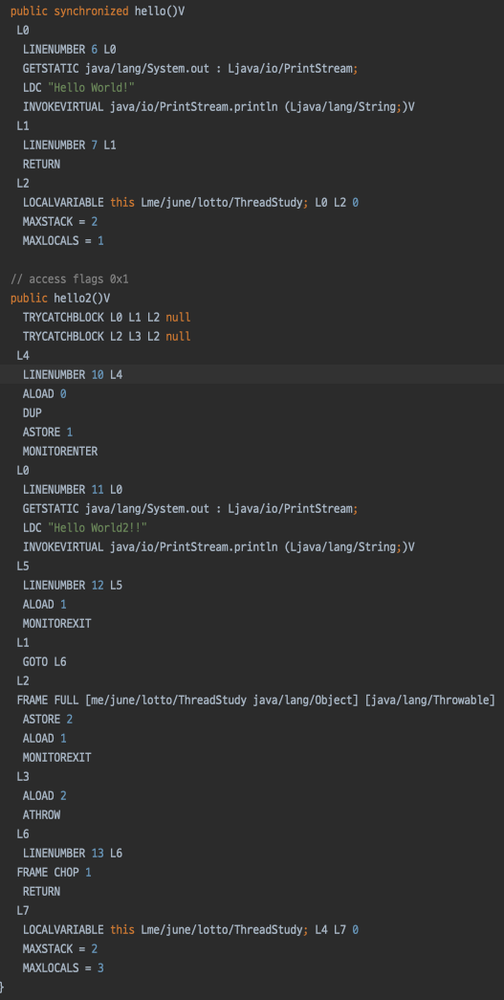

# 지옥자바 스터디 - 13 쓰레드

## 프로세스와 쓰레드

`프로세스 (process)`
- **프로세스 (process)** 란, 간단히 말하면 실행중인 프로그램
  - 메모리에 올라와 **실행중인 프로그램의 인스턴스 (독립적인 개체)**
  - 운영체제로 부터 시스템 자원을 할당받는 **작업 단위**  
- 할당받는 시스템 자원
  - CPU 시간
  - 필요한 주소 공간
  - Code, Data, Stack, Heap 구조의 독립된 메모리 공간
- 특징
  - 프로세스는 각각 **독립된 메모리 영역을 할당** 받는다
  - 프로세스당 **최소 1개의 스레드 (메인 스레드)** 를 가지고 있다
  - 각 프로세스는 별도의 주소 공간에서 실행되며, 프로세스간의 변수 등 자원에 직접 접근이 불가능하다.
  - 프로세스 간의 자원에 접근하려면 프로세스간 통신을 통해서 가능하다
    - 파이프, 파일, 소켓 등..

`쓰레드 (thread)`
- **쓰레드 (thread)** 란, 프로세스 내에서 실행되는 흐름 단위, **실행의 최소단위**
  - 예전에는 최소 단위가 process 였지만, 멀티쓰레드 환경으로 넘어오면서 Thread 로 전환 되었다
  - 실행 최소단위가 Thread 라고 해서 process 가 의미 없는 것은 아니다
- 특징
  - 쓰레드는 프로세스 내에서 Stack 만 할당받고, 나머지 메모리 영역은 공유한다 (프로세스 내의 자원을 쓰레드 끼리 공유)
  - 멀티 쓰레드 환경의 경우 Thread-Safe 여부에 따라 잘못된 결과를 초례할 수 있다

> 프로세스 간의 데이터 공유는 커널레벨에서 제공해주는 서비스를 사용해야한다. <br/>
> 반면 쓰레드는 메모리 영역을 공유하기 때문에 손쉽게 가능하다.

`자바와 프로세스 / 쓰레드`
- 자바는 Thread 기반으로 동작하며, 언어레벨에서 Thread 를 지원한다
- 자바는 실행되는 순간 해당 자바 프로그램 자체가 **하나의 프로세스** 가 되기 때문에 쓰레드만이 존재할 수 있다
- 자바의 쓰레드는 JVM 이 운영체제의 역할을 수행 한다
  - JVM 에 의해 스케쥴되는 실행단위 코드블록 이라고 한다
- JVM 이 관리하는 쓰레드 정보
  - 쓰레드의 갯수
  - 쓰레드로 인해 실행되는 코드의 메모리 주소
  - 쓰레드의 상태
  - 쓰레드의 우선순위

`멀티태스킹과 멀티쓰레딩`
- 대부분의 OS 는 **멀티 테스킹 (multi-tasking)** 을 지원하기 때문에 여러 프로세스가 동시에 실행될 수 있다
- 이와 비슷하게 **멀티 쓰레딩 (multi-threading)** 은 하나의 프로세스 내에서 여러 쓰레드가 동시에 작업을 수행하는 것이다
  - CPU 의 코어는 한번에 하나의 작업만 수행가능 하기때문에 실제로는 매우 짧은 순간에 여러번 작업을 번갈아가며 수행하므로 동시에 진행하는 것 처럼 보인다
- 실제 동시에 처리되는 작업이 이뤄지는 것은 CPU 의 코어 수와 일치한다

> 프로세스의 성능이 쓰레드의 갯수가 많다고 좋아지는 것은 아니며 오히려 두 개의 쓰레드를 가진 프로세스가 더 낮은 성능일 보일 때도 있다

`멀티쓰레딩의 장단점`
- CPU 사용률 향상
- 효율적인 자원 사용
- 응답성 향상
- 작업의 분리

> 쓰레드는 가벼운 프로세스, LWP (Light-Weight-Process) 라고 부르기도 한다. <br/>
> 하지만 쓰레드 끼리 공유하는 자원이 있기 때문에 **동기화나 교착상태와 같은 문제** 들이 늘 따라다닌다.

## 쓰레드의 구현과 실행
1. Thread 클래스를 상속 (서브 클래싱) 하는 방법
    - 상속받는 하위 클래스를 선언하고, **run() 메소드를 오버라이딩** 한다
    - 구현 클래스의 인스턴스를 생성하고, start() 메소드를 호출해 실행한다
2. Runnable 인터페이스를 구현한 뒤 쓰레드의 생성자로 넘기는 방법
    - Runnable 인터페이스는 run() 메소드 하나만 가지고 있다
    - Runnable 인터페이스를 구현한 뒤 Thread 의 생성자로 넘겨준다

`Thread 클래스를 서브 클래싱 하는 방법`
```java
Thread t1 = new MyThread();
t1.start();

class MyThread extends Thread {
    @Override
    public void run() {
        System.out.println("Hello World!");
    }
}
```

`Runnable 인터페이스 사용`
```java
//		Runnable runnable = new Runnable() {
//			@Override
//			public void run() {
//				System.out.println("Hello World!");
//			}
//		};
Runnable runnable = () -> System.out.println("Hello World!");
Thread t1 = new Thread(runnable);
t1.start();
```

- start() 메소드를 호출하는것은 단순히 run() 메소드를 트리거 하는게 아닌 **Thread 생성을 위한 사전 준비작업을 포함하는 개념** 이다
    - 스레드의 개별 스택 할당
    - JVM Thread Scheduler 에 등록
    - 해당 스레드를 **RUNNABLE 상태** 로 만들어 스케쥴러에 의해 실행 될 수 있는 상태로 만듦

> 단순히 run() 메소드만 호출한다면 run 메소드의 결과만 도출될 뿐이지 스레드로 동작되는 것이 아니다.

### 쓰레드의 생명 주기
- NEW
  - 스레드 인스턴스가 생성 되었지만, start() 되지 않은 상태
- RUNNABLE
  - 현재 실행중이거나 혹은 실행 대기중인 상태
  - **RUNNABLE** 이지 실행중이라는 것이 아님에 유의
- BLOCKED
  - Blocking I/O 에 의해 작업이 완료될때 까지 대기하는 상태
    - Blocking I/O 로 호출하게 되면 IO 수행을 위해 system call (커널모드로 전환되어 수행) 이 발생한다.
    - NIO 의 경우 Non-Blocking I/O 를 지원
    - synchronized 에 의해 대기하는 상태
      - 공유자원의 **모니터락** 을 획득하기 위해 대기하는 상태
- WAITING
  - 특정 조건이 만족될 떄 까지 대기하는 상태
  - Object.wait()
    - 다른 스레드에 의해 notify 될 때 까지 대기한다.
    - 소유한 모니터락의 WaitSet 에 현재 스레드를 대기시키고, 소유한 락을 반환한다.
  - Thread.join()
    - 대상 스레드 (호출된 스레드) 가 종료될때 까지 현재 스레드를 대기 시킨다.
- TIMED_WAITING
  - 특정 조건이 만족될때 까지 **특정 시간** 동안 대기하는 상태
    - Thread.sleep(long timeoutMills), Thread.sleep(long timeoutMillis, int nanos)
      - 현재 스레드를 지정한 시간 동안 대기한다.
    - Object.wait(long timeoutMillis), Object.wait(long timeoutMillis, int nanos)
      - 다른 스레드에 의해 notify 될 떄 까지 지정한 시간 동안 대기한다.
    - Thread.join(long timeoutMillis), Thread.join(long timeoutMillis, int nanos)
      - 대상 스레드 (호출된 스레드) 가 종료될때 까지 현재 스레드를 지정한 시간 동안 대기한다.
- TERMINATED
  - 스레드가 종료된 상태
  - 종료된 스레드는 다시 start 할 수 없다.

`WAITING (TIME_WAITING) 과 Interrupt`
- WAITING (TIME_WAITING) 과 관련된 메소드들을 보면 모두 Interrupt 예외를 던진다.
- 이는 다른스레드에 의해 interrupt 되었을때 발생하는 예외이다.
- 이 예외가 발생함으로 인해 **대기 상태** 에 있던 스레드가 **살행 가능한 상태로 전이** 되어 프로그램 수행을 계속 한다는 것이 중요 포인트


#### Java 의 고유락 (intrinsic lock)

`고유 락`
- 자바의 모든 객체는 **락 (lock)** 을 가지고 있다.
- 고유락 또는 모니터락이라고도 한다.

`모니터락 (monitor)`
- 자바의 모든 객체는 반드시 하나의 모니터를 가지고 있다.
- 고유락은 이 모니터를 이용해 동시성을 제어한다.
- 특정 객체의 모니터에는 **동시에 하나의 스레드만이 접근 가능** 하다.
- 이미 다른 스레드가 점유한 모니터에 접근하기 위해서는 **모니터의 WaitSet** 에서 대기해야 한다.
- 멀티스레드 환경에서 모니터 락을 사용한다면, 공유자원에 대해 접근할 때 모니터를 가지고 있는 스레드만이 접근할 수 있다.
- 만약 다른 스레드가 모니터를 가지고 있다면, 해당 스레드가 모니터를 해제할 때 까지 Wait Queue 에서 대기해야 한다.

> Java 에서 고유 락을 사용하는 유일한 방법은 **Synchronized** 키워드를 사용하는 것 뿐이다.

`Synchronized`
- 자바에서 고유 락을 사용하는 방법

```java
public class ThreadStudy {

	public synchronized void hello() {
		System.out.println("Hello World!");
	}

	public void hello2() {
		synchronized (this) {
			System.out.println("Hello World2!!");
		}
	}
}
```
- Synchronized method 와 Synchronized statement 두가지로 구분 된다.
- Synchronized method 는 메소드에 적용하는 방식
- Synchronized statement 는 메소드 내에 특정 코드블록에 적용하는 방식
    - 이를 사용하면 모니터 락을 수행하는 작업이 바이트코드 상에 명시적으로 드러난다.




- hello2 메소드의 바이트코드를 보면 MONITORENTER, MONITOREXIT 이라는 instrument 가 있다.
- 현재 Object 를 대상으로 모니터락을 수행하는데, **MONITORENTER** 가 수행되면 Stack 에 존재하는 Object 참조를 이용해 (this) Lock 을 획득하는 작업을 수행한다.
- 만약 처음 Lock 을 획득한다면 Lock Count 를 1로 하고 Lock 을 소유 (이미 획득 했다면 Lock Count 를 증가) / Lock 을 획득할 수 없다면 Lock 을 획득할 때 까지 **BLOCKED** 상태로 대기한다.
- **MONITOREXIT** 이 실행되면 Lock Count 를 감소시키고, 0에 도달하면 Lock 을 해제한다.
- MONITOREXIT 은 Exception 을 던지기 직전 **Critical Section** 을 빠져나오기 위해 사용되는데 Synchronized statement 는 내부적으로 try-catch 절을 사용하는 효과가 있다 (바이트코드에 드러나있음)

> 간단하게 요약하면 모니터에 들어가 코드를 실행하고, 다시 모니터를 빠져나오는 방식이 자바가 동기화를 수행하는 방법

`재진입 가능성 (Reentrancy)`
- 자바의 고유락은 **재진입** 이 가능하다.
- 락의 획득이 호출 단위가 아닌 **스레드 단위** 로 일어나기 때문
- 이미 락을 획득한 스레드는 락을 얻기 위해 대기할 필요가 없다.

```java
public class ThreadStudy {

	public synchronized void a() {
		// lock count 증가
		System.out.println("A, Thread Name = " + Thread.currentThread().getName());

		// 락을 이미 획득했기때문에 b 접근시 락을 획득할 필요가 없다!
		b();
		// 빠져나갈때 감소
	}

	public synchronized void b() {
		// lock count 증가
		System.out.println("B, Thread Name = " + Thread.currentThread().getName());
		// 빠져나갈때 감소
	}

	public static void main(String[] args) {
		ThreadStudy ts = new ThreadStudy();
		List.of(1, 2, 3, 4, 5).parallelStream()
			.forEach((index) -> {
				ts.a();
			});
	}
}
```
- 실행 결과는 ?...

```text
A, Thread Name = main
B, Thread Name = main
A, Thread Name = ForkJoinPool.commonPool-worker-27
B, Thread Name = ForkJoinPool.commonPool-worker-27
A, Thread Name = ForkJoinPool.commonPool-worker-5
B, Thread Name = ForkJoinPool.commonPool-worker-5
A, Thread Name = ForkJoinPool.commonPool-worker-23
B, Thread Name = ForkJoinPool.commonPool-worker-23
A, Thread Name = ForkJoinPool.commonPool-worker-19
B, Thread Name = ForkJoinPool.commonPool-worker-19
```
- 최초 a 의 락을 획득한 스레드가 b 에 접근한다.
  - 이미 모니터락을 소유한 상태이기 때문.. 위의 lock count 가 왜 사용되는지 여기서 알 수 있다!

> 만약 자바의 고유 락이 재진입을 허용하지 않는다면, 위 코드는 데드락이 발생할 것이다.

`구조적인 락 (structured lock)`
- 고유 락을 이용한 동기화를 **구조적인 락 (structured lock)** 이라고 한다.
- synchronized 블록 단위로 락의 획득/해제가 일어나므로 구조적이라고 표현한다.
- A 획득 -> B 획득 -> B 해제 -> A 해제 는 가능하다
- 하지만 A 획득 -> B획득 -> A해제 -> B해제는 불가능 하다
- 위와 같은 경우 ReentrantLock 과 같은 **명시적인 락** 을 사용해야 한다


// TODO Thread Command 패턴 / Strategy 패턴 내용 정리

## 참고
- https://www.kdata.or.kr/info/info_04_view.html?field=&keyword=&type=techreport&page=18&dbnum=183741&mode=detail&type=techreport