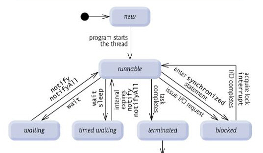
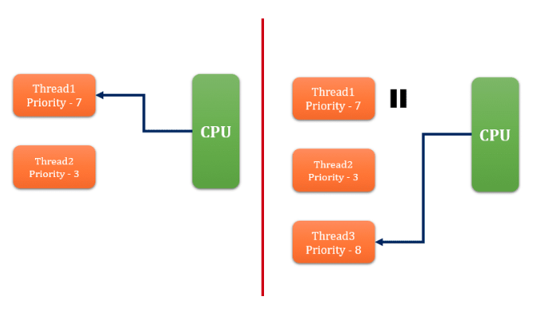
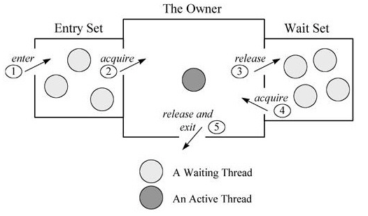
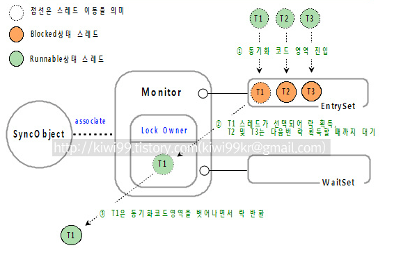
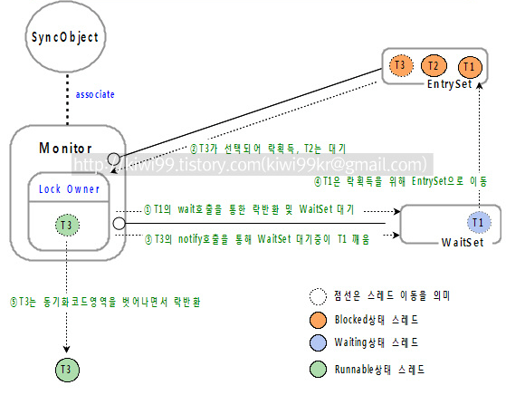

# 지옥자바 스터디 - 13 쓰레드

## 프로세스와 쓰레드

`프로세스 (process)`

- **프로세스 (process)** 란, 간단히 말하면 실행중인 프로그램
    - 메모리에 올라와 **실행중인 프로그램의 인스턴스 (독립적인 개체)**
    - 운영체제로 부터 시스템 자원을 할당받는 **작업 단위**
- 할당받는 시스템 자원
    - CPU 시간
    - 필요한 주소 공간
    - Code, Data, Stack, Heap 구조의 독립된 메모리 공간
- 특징
    - 프로세스는 각각 **독립된 메모리 영역을 할당** 받는다
    - 프로세스당 **최소 1개의 스레드 (메인 스레드)** 를 가지고 있다
    - 각 프로세스는 별도의 주소 공간에서 실행되며, 프로세스간의 변수 등 자원에 직접 접근이 불가능하다.
    - 프로세스 간의 자원에 접근하려면 프로세스간 통신을 통해서 가능하다
        - 파이프, 파일, 소켓 등..

`쓰레드 (thread)`

- **쓰레드 (thread)** 란, 프로세스 내에서 실행되는 흐름 단위, **실행의 최소단위**
    - 예전에는 최소 단위가 process 였지만, 멀티쓰레드 환경으로 넘어오면서 Thread 로 전환 되었다
    - 실행 최소단위가 Thread 라고 해서 process 가 의미 없는 것은 아니다
- 특징
    - 쓰레드는 프로세스 내에서 Stack 만 할당받고, 나머지 메모리 영역은 공유한다 (프로세스 내의 자원을 쓰레드 끼리 공유)
    - 멀티 쓰레드 환경의 경우 Thread-Safe 여부에 따라 잘못된 결과를 초례할 수 있다

> 프로세스 간의 데이터 공유는 커널레벨에서 제공해주는 서비스를 사용해야한다. <br/>
> 반면 쓰레드는 메모리 영역을 공유하기 때문에 손쉽게 가능하다.

`자바와 프로세스 / 쓰레드`

- 자바는 Thread 기반으로 동작하며, 언어레벨에서 Thread 를 지원한다
- 자바는 실행되는 순간 해당 자바 프로그램 자체가 **하나의 프로세스** 가 되기 때문에 쓰레드만이 존재할 수 있다
- 자바의 쓰레드는 JVM 이 운영체제의 역할을 수행 한다
    - JVM 에 의해 스케쥴되는 실행단위 코드블록 이라고 한다
- JVM 이 관리하는 쓰레드 정보
    - 쓰레드의 갯수
    - 쓰레드로 인해 실행되는 코드의 메모리 주소
    - 쓰레드의 상태
    - 쓰레드의 우선순위

`멀티태스킹과 멀티쓰레딩`

- 대부분의 OS 는 **멀티 테스킹 (multi-tasking)** 을 지원하기 때문에 여러 프로세스가 동시에 실행될 수 있다
- 이와 비슷하게 **멀티 쓰레딩 (multi-threading)** 은 하나의 프로세스 내에서 여러 쓰레드가 동시에 작업을 수행하는 것이다
    - CPU 의 코어는 한번에 하나의 작업만 수행가능 하기때문에 실제로는 매우 짧은 순간에 여러번 작업을 번갈아가며 수행하므로 동시에 진행하는 것 처럼 보인다
- 실제 동시에 처리되는 작업이 이뤄지는 것은 CPU 의 코어 수와 일치한다

> 프로세스의 성능이 쓰레드의 갯수가 많다고 좋아지는 것은 아니며 오히려 두 개의 쓰레드를 가진 프로세스가 더 낮은 성능일 보일 때도 있다

`멀티쓰레딩의 장단점`

- CPU 사용률 향상
- 효율적인 자원 사용
- 응답성 향상
- 작업의 분리
- **컨텍스트 스위칭** 으로 인한 오버헤드 발생

> 쓰레드는 가벼운 프로세스, LWP (Light-Weight-Process) 라고 부르기도 한다. <br/>
> 하지만 쓰레드 끼리 공유하는 자원이 있기 때문에 **동기화나 교착상태와 같은 문제** 들이 늘 따라다닌다.

## 쓰레드의 구현과 실행

1. Thread 클래스를 상속 (서브 클래싱) 하는 방법
    - 상속받는 하위 클래스를 선언하고, **run() 메소드를 오버라이딩** 한다
    - 구현 클래스의 인스턴스를 생성하고, start() 메소드를 호출해 실행한다
2. Runnable 인터페이스를 구현한 뒤 쓰레드의 생성자로 넘기는 방법
    - Runnable 인터페이스는 run() 메소드 하나만 가지고 있다
    - Runnable 인터페이스를 구현한 뒤 Thread 의 생성자로 넘겨준다

`Thread 클래스를 서브 클래싱 하는 방법`

```java
Thread t1=new MyThread();
t1.start();

class MyThread extends Thread {
	@Override
	public void run() {
		System.out.println("Hello World!");
	}
}
```

`Runnable 인터페이스 사용`

```java
//		Runnable runnable = new Runnable() {
//			@Override
//			public void run() {
//				System.out.println("Hello World!");
//			}
//		};
Runnable runnable=()->System.out.println("Hello World!");
Thread t1=new Thread(runnable);
t1.start();
```

- start() 메소드를 호출하는것은 단순히 run() 메소드를 트리거 하는게 아닌 **Thread 생성을 위한 사전 준비작업을 포함하는 개념** 이다
    - 스레드의 개별 스택 할당
    - JVM Thread Scheduler 에 등록
    - 해당 스레드를 **RUNNABLE 상태** 로 만들어 스케쥴러에 의해 실행 될 수 있는 상태로 만듦

> 단순히 run() 메소드만 호출한다면 run 메소드의 결과만 도출될 뿐이지 스레드로 동작되는 것이 아니다.

`Command 패턴`

- Command 패턴과 연관되는 세 가지 조건
    - 클라이언트
        - 커맨드 객체를 인스턴스화 하고 메소드 호출시 필요한 정보를 제공
    - 호출자
        - 메소드가 언제 호출되어야 하는지 결정
    - 수신자
        - 메소드 코드를 포함하고 있는 클래스 객체
- Command 패턴의 핵심은 **Command 인터페이스**
- Java 의 Thread 가 전형적인 Command 패턴의 형태라고 할 수 있다.
    - ThreadPool 은 Queue 를 이용해 Task 를 관리한다.
    - Task 들은 커맨드 객체 / ThreadPool 은 전략에 따라 Task 를 실행하기만 할 뿐 어떤 테스크를 수행할지에 대해 전혀 알지 못함

```java
interface Command {
	void execute();
}

// 전등을 켜는 커맨드
class LightOnCommand implements Command {
	Light light;

	public LightOnCommand(Light light) {
		this.light = light;
	}

	@Override
	public void execute() {
		light.on();
	}
}
```

```java
class Command implements Runnable {
	@Override
	public void run() {
		// dosomething...
	}
}

Thread t = new Thread(new Command());
t.start(); // Command 의 run 메소드를 실행하지만 Command 가 무엇을 실행하는지는 모른다.
```

## 쓰레드 그룹 (Thread Group)

- 서로 관련된 쓰레드를 그루핑해서 다루기 위한 것
- 폴더안에 폴더를 생성하듯이 그룹안에 또 다른 그룹을 포함할 수 있다.
- 쓰레드 그룹은 보안상의 이유로 도입된 개념이고, 자신이 속한 쓰레드 그룹은 변경이 가능하지만, 다른 쓰레드 그룹은 변경이 불가능하다.
- 모든 쓰레드는 **반드시 쓰레드 그룹에 속해있어야 한다**
    - 쓰레드 그룹을 지정하지 않을 경우, 자신을 생성한 쓰레드와 동일한 그룹에 속하게 됨

```java
ThreadGroup threadGroup=new ThreadGroup("my-group"); // 그룹 생성
Thread t1 = new Thread(threadGroup,() -> System.out.println(Thread.currentThread().getThreadGroup())); // 그룹 출력
t1.start(); // 쓰레드 시작

System.out.println("Main = " + Thread.currentThread().getThreadGroup()); // main 쓰레드 그룹 출력
// 실행 결과
java.lang.ThreadGroup[name=my-group,maxpri=10]
Main = java.lang.ThreadGroup[name=main,maxpri=10]
```

> 자바 애플리케이션 실행시 JVM 은 main/system 쓰레드 그룹을 만들고, JVM 운영에 필요한 쓰레드를 생성해 그룹에 포함시킨다.

`ThreadGroup 관련 메소드`

```java
ThreadGroup getThreadGroup(); // 자신이 속한 쓰레드 그룹 반환
void uncaughtException(Thread t, Throwable e); // 쓰레드 그룹의 쓰레드에서 발생한 예외가 처리되지 못해 실행 종료될 경우 JVM 에 의해 트리거됨
```

## 데몬 쓰레드 (Daemon Thread)

- 다른 일반 쓰레드 (데몬 쓰레드가 아닌 쓰레드) 의 작업을 돕기 위한 쓰레드
- 일반 쓰레드가 모두 종료되면 강제적으로 자동 종료 된다.
    - 보조할 일반 쓰레드가 없기 때문에 의미가 사라지기 때문
- 데몬 쓰레드의 예는 GC / 워드프로세서 자동 저장 등이 있음

```java
boolean isDaemon(); // 데몬스레드 여부 확인
void setDaemon(boolean on); // 데몬스레드 스위칭
```

- 데몬쓰레드 사용은 일반 쓰레드와 동일하며 setDaemon(true); 로 지정하기만 하면 된다.

> 데몬쓰레드 지정은 반드시 start() 호출 이전에 이뤄져야 한다. 그렇지 않을 경우 IllegalThreadStateException 예외가 발생한다. <br/>

## 쓰레드의 생명 주기



- NEW
    - 스레드 인스턴스가 생성 되었지만, start() 되지 않은 상태
- RUNNABLE
    - 현재 실행중이거나 혹은 실행 대기중인 상태
    - **RUNNABLE** 이지 실행중이라는 것이 아님에 유의
- UNRUNNABLE
    - 실행 불가능한 상태 / CPU 자원을 할당 받을 수 없는 상태
    - 일반적으로 **대기 상태** 라고 표현한다.
    - BLOCKED
        - Blocking I/O 에 의해 작업이 완료될때 까지 대기하는 상태
            - Blocking I/O 로 호출하게 되면 IO 수행을 위해 system call (커널모드로 전환되어 수행) 이 발생한다.
            - NIO 의 경우 Non-Blocking I/O 를 지원
        - synchronized 에 의해 대기하는 상태
            - 공유자원의 **모니터락** 을 획득하기 위해 대기하는 상태
    - WAITING
        - 특정 조건이 만족될 떄 까지 대기하는 상태
        - Object.wait()
            - 다른 스레드에 의해 notify 될 때 까지 대기한다.
            - 소유한 모니터락의 WaitSet 에 현재 스레드를 대기시키고, 소유한 락을 반환한다.
        - Thread.join()
            - 대상 스레드 (호출된 스레드) 가 종료될때 까지 현재 스레드를 대기 시킨다.
    - TIMED_WAITING
        - 특정 조건이 만족될때 까지 **특정 시간** 동안 대기하는 상태
            - Thread.sleep(long timeoutMills), Thread.sleep(long timeoutMillis, int nanos)
                - 현재 스레드를 지정한 시간 동안 대기한다.
            - Object.wait(long timeoutMillis), Object.wait(long timeoutMillis, int nanos)
                - 다른 스레드에 의해 notify 될 떄 까지 지정한 시간 동안 대기한다.
            - Thread.join(long timeoutMillis), Thread.join(long timeoutMillis, int nanos)
                - 대상 스레드 (호출된 스레드) 가 종료될때 까지 현재 스레드를 지정한 시간 동안 대기한다.
- TERMINATED
    - 스레드가 종료된 상태
    - 종료된 스레드는 다시 start 할 수 없다.

`WAITING (TIME_WAITING) 과 Interrupt`

- WAITING (TIME_WAITING) 과 관련된 메소드들을 보면 모두 Interrupt 예외를 던진다.
- 이는 다른스레드에 의해 interrupt 되었을때 발생하는 예외이다.
- 이 예외가 발생함으로 인해 **대기 상태** 에 있던 스레드가 **살행 가능한 상태로 전이** 되어 프로그램 수행을 계속 한다는 것이 중요 포인트

`yield 와 sleep 이 static 메소드인 이유`

- 만약 이 메소드들이 인스턴스 메소드로 존재한다고 가정해보자.
- 현재 스레드가 다른 스레드에 의해 sleep, yield 될 때 동기화 처리에 의한 모니터락을 소유한 상태로 준비/대기 상태로 변경된다면 ?
    - 데드락이 발생할 여지가 높아짐!
- static 메소드로만 제공함으로써 현재 자신의 스레드만이 sleep / yield 할 수 있도록 제공한다.

`stop 과 suspend 그리고 resume 이 depreacted 된 이유`

- stop
    - 다른 스레드에 의해 강제 종료하게 되면 해당 스레드가 가진 락을 모두 풀게됨
    - 작업이 완료되지 않은 상태에서 락이 풀리면 공유자원이 불안정한 상태가 될 수 있기 때문
- suspend/resume
    - 락을 소유한 상태에서 다른 스레드에 의해 중지가 된다면 데드락이 발생할 수 있다.

## 자바 스레드와 Interrupt

`스레드 에서의 interrupt 의 의미`
- 인터럽트 ?
    - 스레드에게 특정 상황이 발생했음을 알리기 위한 소프트웨어적인 비동기 신호
    - 인터럽트를 받은 스레드는 내부적으로 interrupt flag 값을 지정함
- 만약 인터럽트를 받은 스레드가 WAITING / TIME_WAITING 상태였다면 해당 메소드는 interruptedException 을 발생시키며 **대기 상태에서 빠져나온다.**

`interrupt 관련 주요 메소드`
- isInterrupted()
    - 해당 스레드가 interrupt 되었는지 확인한다.
    - 메소드의 호출이 interrupt 상태를 변경하지 않는다. (중요)
- interrupted()
    - static 메소드
    - isInterrupted() 와 동일한 기능을 수행하지만, 이는 **초기화 작업** 을 수행한다는 차이가 있음
    - interrupt 상태가 true 인 상태에서 호출시 false 로 초기화한다.

`interrupt 발생시 일어나는 작업`
1. interrupt 발생시 해당 flag 를 true 로 지정한다.
2. 만약 인터럽트를 받은 스레드가 WAITING / TIME_WAITING 상태였다면 해당 스레드는 interrupt flag 를 clear (false 로 지정) 하고, 대기상태를 만든 메소드는
   interruptedException 을 발생시킨다.
    - UNRUNNABLE -> RUNNABLE 상태가 된다.

> 인터럽트는 해당 스레드에게 특정 상황이 발생했음을 알리기 위한 목적으로 사용되며, 대기 상태에 있던 스레드들은 RUNNABLE 상태로 전이된다.

`I/O 에 의한 대기상태와 인터럽트`

- BLOCKED 상태 (system call 수행) 시 해당 스레드는 interrupt 를 발생시켜도 해당 메소드가 RUNNABLE 상태로 전이되지 않는다.
    - I/O 작업으로 인한 대기중에는 interrupt 를 인지할 수 없다.
- JDK 1.4 이후 도입된 NIO 의 경우 InterruptibleChannel 이 도입되었다.
    - I/O 작업으로 인한 대기중 상태더라도 인터럽트 발생시 ClosedByInterruptException 예외를 발생시키고 해당 스레드는 RUNNABLE 상태로 전이하게 된다.

```java
/**
 *  A channel that can be asynchronously closed and interrupted.
 A channel that implements this interface is asynchronously closeable: **If a thread is blocked in an I/O operation on an interruptible channel then another thread may invoke the channel's close method.** This will cause the blocked thread to receive an AsynchronousCloseException.
 A channel that implements this interface is also interruptible: If a thread is blocked in an I/O operation on an interruptible channel then another thread may invoke the blocked thread's interrupt method. This will cause the channel to be closed, the blocked thread to receive a ClosedByInterruptException, and the blocked thread's interrupt status to be set.
 If a thread's interrupt status is already set and it invokes a blocking I/O operation upon a channel then the channel will be closed and the thread will immediately receive a ClosedByInterruptException; its interrupt status will remain set.
 A channel supports asynchronous closing and interruption if, and only if, it implements this interface. This can be tested at runtime, if necessary, via the instanceof operator.
 Since:
 1.4
 Author:
 Mark Reinhold, JSR-51 Expert Group
 */
public interface InterruptibleChannel extends Channel {

	/**
	 * Closes this channel.
	 *
	 * <p> Any thread currently blocked in an I/O operation upon this channel
	 * will receive an {@link AsynchronousCloseException}.
	 *
	 * <p> This method otherwise behaves exactly as specified by the {@link
	 * Channel#close Channel} interface.  </p>
	 *
	 * @throws IOException  If an I/O error occurs
	 */
	public void close() throws IOException;

}
```

## JVM Thread Scheduler

- Java 의 Thread 는 **JVM Thread Scheduler** 에 의해 관리된다.
- Thread Scheduler 는 항상 **RUNNABLE** 상태인 스레드만 실행하도록 결정한다.
- RUNNABLE 상태인 스레드가 여러개라면, 어떤 스레드가 실행될지 보장할 수 없다.
- Scheduler 가 실행할 스레드를 선택하는데 사용되는 여러 기준들이 있다.

1. 우선순위 (Priority)
    - 각 스레드들은 1 ~ 10 까지의 우선순위를 갖고 있다. (숫자가 클수록 높은 우선순위)
    - 스레드 생성시 부모 스레드의 우선순위를 상속 받는다.
    - 동일한 우선순위를 가지는 스레드가 여러개 있따면 이중 랜덤으로 선택됨
2. 도착 시간 (Arrival Time)
    - 스레드 도착시간에 따라 달라진다. (RUNNABLE 상태가 된 시간)
    - 같은 우선순위를 가지는 여러 스레드가 있다면 스레드 도착시간을 확인해 실행할 스레드를 선택한다.

> 실행할 스레드를 결정했다면, 각 스레드들을 CPU 에서 어떻게 할당하여 사용할것인지 배분하게 되는데 이를 위한 알고리즘이 몇 가지 존재함

1. 우선권이 있는 스케쥴링 (Preemptive-priority scheduling)
    - 스레드의 우선순위를 기반으로 동작
    - 스케쥴러는 우선순위가 가장 높은 스레드를 선택한다.
    - 선택된 스레드는 **특정 상황** 이 발생하지 않는 한 계속 실행된다.
        - 더 높은 우선순위를 가진 스레드가 RUNNABLE 상태가 되는 경우
        - yield, sleep join 등을 호출해 다른 스레드에게 제어권을 넘긴 경우
        - 선택된 스레드가 지정된 time-slice 만큼 작업을 끝낸 경우
    - 실행중이던 보다 우선순위가 더 높은 스레드 (RUNNABLE 상태) 가 생기거나, time-splice 가 종료된 경우, 일시 중단되고 다른 스레드가 time-slice 를 얻게 된다.
      
2. FIFS (First come First serve Scheduling)
    - FIFO 에서 유래된 알고릴즘
    - 스레드의 도착시간을 확인하고, 실행에 필요한 time-slice 를 할당한다.
3. Time-slicing scheduling
    - 이 알고리즘은 FIFS 를 기반으로 만들어 졌다.
    - 스케쥴러는 각 스레드에게 time-splice 를 할당하며, 모든 스레드가 주기적으로 실핼된다. (time-slice 는 시스템에 정의되어 있다.)

> Thread 가 JVM Thread Scheduler 것 처럼 Java Process 도 Process Scheduler 의 영향을 받는다. <br/>
> 때문에 각 스레드가 할당 받는 time-slice 는 일정하지 않을 수 있다. <br/>
> Java 가 OS 에 독립적이라곤 하나 Thread 의 경우 OS 에 종속적인 부분이다.

## 쓰레드의 동기화

- 멀티 쓰레드의 경우 공유자원에 대해 의도치 않은 결과를 얻을 수 있다.
- 이런 일이 발생하는걸 방지하기 위해 **임계 영역 (critical section)** 과 **락 (lock)** 이라는 개념이 도입되었다.
- 공유 데이터를 사용하는 코드 영역을 임계 영역으로 지정하고, lock 을 통해 동시에 여러 스레드가 접근하지 못하도록 제어하는 것을 스레드 동기화 라고 한다.
- 쓰레드간의 동기화 처리를 한다는것은 다음 2가지 작업을 의미
    - Mutual Exclusion (상호 배제)
        - 둘 이상의 스레드가 임계영역에 동시에 접근하는 것을 막는다.
    - Cooperation (협력)
        - 멀티스레드 환경에서 공유 데이터의 동시 접근을 막고 접근 순서도 제어한다는 것을 의미
        - 자바의 **모니터** 가 조건변수의 역할을 한다.
        - wait() / notify() 를 이용해 스레드간 접근 순서를 제어할 수 있다.

## 일반적인 동기화 처리 방식
- OS 가 동기화를 위해 제공해주는 대표적인 방법 **Mutex** 와 **Semaphore** 가 있다.
- 이 둘은 대부분의 운영체제에서 지원해주는 기법이며 임계영역에서 진입지점과 진출 지점에 **락을 획득하는 연산** / **락을 반환하는 연산** 을 제공하여 동시 접근을 차단하는 매커니즘이다.
- 이런 연산은 일반적인 연산과 다르게 atomic 하고 individual 한 특징을 가지고 있다.
    - 동기화 연산을 수행하는 동안은 해당연산 완료전 까지 context switching 이 발생하지 않음을 커널이 보장해준다.
    - 만약 스레드가 락을 얻기 위한 연산을 수행도중 context switching 이 발생한다면 락을 획득하는 과정에서 동기화 문제가 발생할 수 있다.

`조건 변수 (Conditional Variable)`
- 어떤 스레드가 막상 락을 획득하고 임계영역으로 들어왔지만, 작업을 할만한 상황이 아닐 수 있다. (특정 조건에 수행이 가능한 경우)
  - 이런 경우 소유한 락을 반환하고, 다른 스레드가 작업을 해주어야 원하는 상태가 되는 상황
- 만약 단순히 락을 반환해 버린다면, 원하는 상태가 되었는지 확인하기 위해 반복적으로 임계 영역에 진입해 상태를 체크해야함 (OverHead 발생)
- 락을 반환하면서 해당 스레드는 대기하고 있다가, 원하는 상태가 되었을때 다른 스레드가 알려준다면 효율적인 작업이 가능해진다.
- 이런 역할을 하는 것이 **조건변수** 이다.

> **조건 변수** 란, 동기화된 임계영역 내에서 조건에 따라 스레드의 실행을 컨트롤할 수 있도록 스레드를 대기시키거나 대기중인 스레드를 실행 가능하도록 만들어주는 커널 레벨에서 제공하는 특수한 변수 를 말한다. <br/>
> 자바의 모니터락 메커니즘은 락에 대한 관리뿐 아니라 조건변수로서의 역할도 수행한다.

## 동기화와 관련된 일반적인 문제들
- OS 관련 공부를 하다보면 고전적인 동기화 문제 (Classical Problems of Synchronization) 로 다음 3가지를 접하게 된다.
1. 생산자 소비자 문제 (Producer-Consumer Problem)
2. 판독자 기록자 문제 (Reader-Writer Problem)
3. 식사하는 철학자 문제 (Dining Philosopher)

`생산자 소비자 문제 (Producer-Consumer Problem)`
- Bounded Buffer Problem 이라고도 한다.
- 생산자는 공유데이터를 생산하고 / 소비자는 공유데이터를 소비하는 구조
- 공유데이터를 생산하고 소비할 때 배타적인 락이 필요하고, 소비자는 데이터가 없다면 생산자가 데이터를 생산할때 까지 대기해야한다.
- 생산자는 데이터를 생산한 후 소비자에게 그 사실을 알려주어야 한다.
- 문제의 핵심
  - Product-Consumer Thread 간에 배타적인 락 (Exclusive Lock) 이 필요하다.
  - 두 스레드 사이의 실행 흐름을 제어해야 한다. (wait/notify)
- 해결 방법
  - Synchronized
  - java.util.concurrent.locks.ReentrantLock (JDK 1.5 이상)

`판독자 기록자 문제 (Reader-Writer Problem)`
- 판독자는 공유데이터를 읽어들이고 기록자는 공유데이터를 쓰는 구조
- Consumer 와 Reader 간에 차이가 있음
  - Consumer 의 경우 데이터를 소비 (데이터를 가져가는 개념) 할때 동일한 데이터를 다른 Consumer 가 동시에 소비해서는 안된다.
    - Consumer 사이에서도 배타적인 락이 필요하다.
  - Reader 의 경우는 공유영역의 데이터를 **읽기 만 할뿐** 데이터를 가져가는 것이 아니다.
    - 다수의 Reader 는 공유영역의 데이터를 서로 읽어도 문제가 되지 않는다.
- 문제의 핵심
  - Reader / Writer Thread 간에 Shared & Exclusive Lock 이 필요하다.
  - Reader Thread 들은 Shared Lock 을 통해 동시에 Read 가 가능하고 / Writer-Thread 의 쓰기는 불가능하게 한다.
  - Writer Thread 들은 Exclusive Lock 을 통해 모든 접근을 막아준다.
- 해결 방법
  - java.util.concurrent 패키지가 생겨나기 이전에는 이를 구분할 방법이 없었다. (배타적인 락만 구현이 가능했음) 
  - java.util.concurrent.locks.ReentrantReadWriterLock (JDK 1.5 이상)

`식사하는 철학자 문제 (Dining Philosopher)`
- 데드락이 발생하는 대표적인 문제
- http://asuraiv.blogspot.com/2017/10/java-1.html

`Shared Lock 과 Exclusive Lock`
- Shared Lock
  - 공유 락이라고 한다.
  - 공유락은 공유락의 중복을 허용하고, 배타 락을 막아준다 -> 다수의 읽기는 허용하지만 쓰기는 허용하지 않는다.
  - 일반적으로 READ 시 사용하는 락이기 때문에 READ-LOCK 이라고도 한다.
- Exclusive Lock
  - 배타 락 이라고 한다.
  - 배타락은 모든 락의 중복을 허용하지 않는다.
  - 일반적으로 WRITE 시 사용는 락이기 때문에 WRITE-LOCK 이라고도 한다.

`Bound - Spin Lock`
- 스핀락은 Critical Section 의 단점을 극복하기 위한 동기화 기법
- 스레드가 Lock 을 가지지 못하게 되면 스레드는 Blocking 되는데 이후 컨텍스트 스위칭이 일어나면서 성능 하락의 원인이 됨
- 이 문제를 극복하기 위한 방법
- 스레드가 락을 점유하지 못하면 다른 스레드에게 넘기는것이 아니고, Loop 를 돌면서 BUSY-WAITING 상태로 만든다.
  - **BUSY-WAITING** 상태가 되면 컨텍스트 스위칭이 발생하지 않고 Lock 획득을 주기적으로 시도한다.
    - BUSY-WAITING 은 대기중인 스레드가 활성화된 상태지만 실제론 아무것도 하지 않는 것
- 만약 Critical Section 에서 작업이 오래걸린다면 오히려 리소스 낭비 문제가 발생할 수 있다.

## Java 의 고유락 (intrinsic lock)

`고유 락`
- 자바의 모든 객체는 **락 (lock)** 을 가지고 있다.
- 고유락 또는 모니터락이라고도 한다.

`모니터락 (monitor)`
- 자바의 모든 객체는 반드시 하나의 모니터를 가지고 있다.
- 모니터는 현재 락을 획득한 스레드와 LockCount 정보를 가지고 있다.
- 고유락은 이 모니터를 이용해 동시성을 제어한다.
- 특정 객체의 모니터에는 **동시에 하나의 스레드만이 접근 가능** 하다.
- 이미 다른 스레드가 점유한 모니터에 접근하기 위해서는 **모니터의 Entry Set** 에서 대기해야 한다.
- 멀티스레드 환경에서 모니터 락을 사용한다면, 공유자원에 대해 접근할 때 모니터를 가지고 있는 스레드만이 접근할 수 있다.
- 만약 다른 스레드가 모니터를 가지고 있다면, 해당 스레드가 모니터를 해제할 때 까지 Wait Queue 에서 대기해야 한다.

> Java 에서 고유 락을 사용하는 유일한 방법은 **Synchronized** 키워드를 사용하는 것 뿐이다.

`모니터와 스레드 대기 자료구조`



- 모니터는 **락을 획득하기 위해 시도하는 스레드를 대기하기 위한 자료구조** 와 **조건 변수** 로서의 역할을 수행하기 위해 **특정 조건이 만족될 때 까지 대기시키기 위한 자료구조** 를 가지고 있다.

1. EntrySet (진입 셋)
    - LOCK-POOL 이라고도 한다.
    - 모니터락을 대기하는 스레드를 담기 위한 자료구조
2. WaitSet (대기 셋)
    - WAIT-POOL
    - 모니터가 notify 해줄 때 까지 기다리는 스레드를 담는 자료 구조

`Monitor 획득 및 반환 과정`



1. 스레드가 동기화 코드 영역 (Synchronized) 에 접근하기 위해 EntrySet 에 진입
    - RUNNABLE -> BLOCKED 로 변경됨
2. 모니터락을 소유한 스레드가 존재한다면 **EntrySet 에서 대기**
3. 모니터락을 소유한 스레드가 없다면 EntrySet 에서 대기중인 스레드중 하나가 모니터락을 획득한다.
    - 동기화 코드 영역을 벗어나면서 소유한 모니터락을 반환



1. 스레드가 동기화 코드 영역 (Synchronized) 에 진입
    - RUNNABLE
2. 현재 스레드를 대기 (wait() 호출) 시키면 해당 스레드는 소유한 모니터락을 반환하고 **Wait Set 에서 대기** 한다.
    - wait() 를 호출했다는 것은 특정 조건이 만족되어야 작업을 할 수 있다는 것
    - 해당 조건이 되기 전까지 기다려야 함
3. 다른 스레드가 모니터락을 획득하여 작업 수행후 WaitSet 에 대기중인 스레드에게 신호 (notify() 호출) 를 보낸다.
4. WaitSet 에서 대기중이던 스레드는 신호를 받으면 **WaitSet -> EntrySet** 으로 이동한다.
    - 다시 실행하기 위해서는 모니터락을 획득해야 하기 때문.. (모니터락에 대한 획득은 EntrySet 에서만 이루어 진다)

> 대상 객체의 모니터락을 소유하고 있지 않은 상태에서 wait / notify 와 같은 메소드 호출시 IllegalMonitorStateException 이 발생한다.

`Synchronized`
- 자바에서 고유 락을 사용하는 방법

```java
public class ThreadStudy {

	public synchronized void hello() {
		System.out.println("Hello World!");
	}

	public void hello2() {
		synchronized (this) {
			System.out.println("Hello World2!!");
		}
	}
}
```

- Synchronized method 와 Synchronized statement 두가지로 구분 된다.
- Synchronized method 는 메소드에 적용하는 방식
- Synchronized statement 는 메소드 내에 특정 코드블록에 적용하는 방식
    - 이를 사용하면 모니터 락을 수행하는 작업이 바이트코드 상에 명시적으로 드러난다.

> 인스턴스 메소드 뿐 아니라 스태틱 메소드에서 동기화 처리가 가능하다. <br/>
> 스태틱 메소드에 동기화 처리시 **해당 클래스의 락을 획득** 한다. (클래스 최초 로드시 생성된 Class 타입 인스턴스)


- hello2 메소드의 바이트코드를 보면 MONITORENTER, MONITOREXIT 이라는 instrument 가 있다.
- 현재 Object 를 대상으로 모니터락을 수행하는데, **MONITORENTER** 가 수행되면 Stack 에 존재하는 Object 참조를 이용해 (this) Lock 을 획득하는 작업을 수행한다.
- 만약 처음 Lock 을 획득한다면 Lock Count 를 1로 하고 Lock 을 소유 (이미 획득 했다면 Lock Count 를 증가) / Lock 을 획득할 수 없다면 Lock 을 획득할 때 까지 **
  BLOCKED** 상태로 대기한다.
- **MONITOREXIT** 이 실행되면 Lock Count 를 감소시키고, 0에 도달하면 Lock 을 해제한다.
- MONITOREXIT 은 Exception 을 던지기 직전 **Critical Section** 을 빠져나오기 위해 사용되는데 Synchronized statement 는 내부적으로 try-catch 절을
  사용하는 효과가 있다 (바이트코드에 드러나있음)

> 간단하게 요약하면 모니터에 들어가 코드를 실행하고, 다시 모니터를 빠져나오는 방식이 자바가 동기화를 수행하는 방법

`재진입 가능성 (Reentrancy)`
- 자바의 고유락은 **재진입** 이 가능하다.
- 락의 획득이 호출 단위가 아닌 **스레드 단위** 로 일어나기 때문
- 이미 락을 획득한 스레드는 락을 얻기 위해 대기할 필요가 없다.

```java
public class ThreadStudy {

	public synchronized void a() {
		// lock count 증가
		System.out.println("A, Thread Name = " + Thread.currentThread().getName());
		sleep();
		// 락을 이미 획득했기때문에 b 접근시 락을 획득할 필요가 없다!
		b();
		// 빠져나갈때 감소
	}

	public synchronized void b() {
		// lock count 증가
		System.out.println("B, Thread Name = " + Thread.currentThread().getName());
		sleep();
		// 빠져나갈때 감소
	}

	private void sleep() {
		try {
			Thread.sleep(100);
		} catch (InterruptedException e) {
			e.printStackTrace();
		}
	}

	public static void main(String[] args) {
		ThreadStudy ts = new ThreadStudy();

		List.of(1, 2, 3, 4, 5).stream()
			.map(v -> CompletableFuture.runAsync(() -> {
				ts.a();
			})).collect(Collectors.toList());
		List.of(1, 2, 3, 4, 5).stream()
			.map(v -> CompletableFuture.runAsync(() -> {
				ts.b();
			})).collect(Collectors.toList());

		System.out.println("Ready...");
		try {
			Thread.currentThread().join();
		} catch (InterruptedException e) {
			e.printStackTrace();
		}
		System.out.println("Done...");
	}
}
```

- 실행 결과는 ?...

```text
Ready...
A, Thread Name = ForkJoinPool.commonPool-worker-5
B, Thread Name = ForkJoinPool.commonPool-worker-5

B, Thread Name = ForkJoinPool.commonPool-worker-21
B, Thread Name = ForkJoinPool.commonPool-worker-3
B, Thread Name = ForkJoinPool.commonPool-worker-17

A, Thread Name = ForkJoinPool.commonPool-worker-27
B, Thread Name = ForkJoinPool.commonPool-worker-27

B, Thread Name = ForkJoinPool.commonPool-worker-31
B, Thread Name = ForkJoinPool.commonPool-worker-13

A, Thread Name = ForkJoinPool.commonPool-worker-9
B, Thread Name = ForkJoinPool.commonPool-worker-9

A, Thread Name = ForkJoinPool.commonPool-worker-23
B, Thread Name = ForkJoinPool.commonPool-worker-23

A, Thread Name = ForkJoinPool.commonPool-worker-19
B, Thread Name = ForkJoinPool.commonPool-worker-19
```

- 최초 a 의 락을 획득한 스레드가 b 에 접근한다.
    - 이미 모니터락을 소유한 상태이기 때문.. 위의 lock count 가 왜 사용되는지 여기서 알 수 있다!

> 만약 자바의 고유 락이 재진입을 허용하지 않는다면, 위 코드는 데드락이 발생할 것이다.

`구조적인 락 (structured lock)`

- 고유 락을 이용한 동기화를 **구조적인 락 (structured lock)** 이라고 한다.
- synchronized 블록 단위로 락의 획득/해제가 일어나므로 구조적이라고 표현한다.
- A 획득 -> B 획득 -> B 해제 -> A 해제 는 가능하다
- 하지만 A 획득 -> B획득 -> A해제 -> B해제는 불가능 하다
- 위와 같은 경우 ReentrantLock 과 같은 **명시적인 락** 을 사용해야 한다
    - 명시적인 락과 대조되어 구조적인 락을 **암묵적 락** 이라고도 한다.

## 명시적인 락 (ReentrantLock)
- Lock 인터페이스는 Java 5.0 에서 추가되었으며 암묵적인 락으로 할 수 없는 기능들을 가지고 있다.
- ReentrantLock 클래스도 Lock 인터페이스를 구현하고 있고 synchronized 구문과 동일한 메모리 가시성과 상호 배제 기능을 제공한다.

| 클래스 | 설명 |
| --- | --- |
| ReentrantLock | 재진입 가능한 락 / 일반적인 배타 락 |
| ReentrantReadWriteLock | READ 에는 공유 락 / WRITE 에는 베타 락 |
| StampedLock | ReentrantReadWriteLock 에 낙관적 락 기능 추가 |

`Lock interface`

```java
public interface Lock {
	void lock();

	void lockInterruptibly() throws InterruptedException;

	boolean tryLock();

	boolean tryLock(long time, TimeUnit unit) throws InterruptedException;

	void unlock();

	Condition newCondition();
}
```

`ReentrantLock 사용 방법`

```java
Lock lock = new ReentrantLock();
lock.lock();

try{
    // dosomething
} finally {
    lock.unlock();
}
```

- 위 코드는 synchronized 블록을 사용한 것과 동일한 효과를 나타내는데 한 가지 주의할점은 **반드시 finally 블록에서 lock 을 해제해야 한다는 점**
    - 예외가 발생할 경우 lock 이 해제되지 않는 문제가 발생할 수 있다.
    - synchronized 블록 대신 기계적으로 ReentrantLock 으로 대체하는 작업을 해서는 안되는 이유중 하나이다.

`공정성과 불공정성`
- ReentrantLock 은 두 종류의 락 공정성을 지원한다.
- **공정성이란 ?** 락을 이미 다른 스레드가 획득했을때, 스레드를 처리하는 기준을 의미
- synchronized 는 스레드간의 락을 획득하는 순서를 보장하지 않는다.

1. 공정성
    - 락을 이미 다른스레드가 획득했다면 대기열 맨뒤에 위치한다.
2. 불공정성
    - 락을 이미 다른스레드가 획득했다면 대기열 맨뒤에 위치한다.
    - 스레드가 락을 사용하고자 할 때 락이 해제되었다면, **대기열에 스레드가 있더라도 락을 확보**

- 성능
    - 대부분의 경우 불공정성을 적용하는 것이 성능상 이점이 큼
        - 대기 상태에 있던 스레드가 다시 실행상태로 변경되고, 실행시까지 텀이 존재하기 때문임

`명시적인 락을 사용해야 하는 경우`
- 락 확보시 타임아웃 지정
- 스레드 간의 경쟁을 공정성으로 처리
- 동시성을 보장해야 하는 코드가 블록 형태를 넘어서는 경우

`Read/Write Lock`
- Read 연산은 락의 획득과 무관하게 여러 스레드가 동시에 접근해도 데이터 변경이 일어나지 않지만, 명시적인 락에서는 접근을 제한한다.
- 이런 문제를 해결한 기법이 Read/Write Lock
- 동작 방식
    - A Thread 가 Read 연산 수행시 Read-Lock 획득
    - 객체가 Read-Lock 상태일때 B Thread 도 Read 연산을 수행하고 Read-Lock 획득
    - C Thread 가 Write 연산 수행시 Write-Lock 을 획득하고 Write-Lock 이 해제될때 까지 다른 스레드는 Read/Write Lock 획득이 불가능
- 성능
    - 읽기 작업이 많고 쓰기 작업이 적다면 성능을 크게 높일 수 있다.
- 고려사항
    - 구현상 복잡도가 높아 명시적인 락에 비해 성능이 떨어질 수 있다.
- ReentrantReadWriteLock 클래스가 ReadWriteLock 인터페이스를 구현하고 있다.
    - Read/Write Lock 모두 재진입 가능한 락을 제공

```java
public interface ReadWriteLock {
	/**
	 * Returns the lock used for reading.
	 *
	 * @return the lock used for reading
	 */
	Lock readLock();

	/**
	 * Returns the lock used for writing.
	 *
	 * @return the lock used for writing
	 */
	Lock writeLock();
}
```

`StampedLock`
- JDK 1.8 부터 추가됨
- Lock 인터페이스를 구현하고 있지 않음
- READ/WRITE 락 외에 낙관적 읽기 락이 추가되었다.
- 무조건 읽기 락을 거는것이 아닌 쓰기와 읽기가 충돌할 때만 쓰기가 끝난 후 읽기 락을 건다.

```java
StampedLock lock = new StampedLock();
long stamp = lock.tryOptimisticRead();

if (lock.validate(stamp)) { // write lock 에 의해 낙관적 read lock 이 풀렸는지 화인한다.
    stamp = lock.readLock(); // lock 이 풀렷다면 읽기 lock 을 얻기위해 대기한다.

    try {
        // dosomething...
    } finally {
        lock.unlockRead(stamp); // 읽기 lock 을 품
    }
}
```

`낙관적 락 과 비관적 락`
- DB 에서 동시성 문제를 해결할때 자주 접하는 용어
- 낙관적 락
  - optimistic lock
  - version 과 같은 구분 값을 이용해 동시성 문제를 해소
- 비관적 락
  - pessimistic lock
  - Shared Lock 또는 Exclusive Lock 을 걸고 시작하는 방식

`Condition`
- Condition 클래스는 Critical Section 실행도중 특정 조건이 만족할때 까지 스레드가 대기하는 기능을 제공한다. (조건 변수의 역할)
- Java 스레드는 일반적으로 wait / notify / notifyAll 을 이용해 상호통신 기능을 제공한다.
- Condition 클래스에는 이들 대체할 기능을 제공한다.

```java
public interface Condition {

    void await() throws InterruptedException;

    void awaitUninterruptibly();

    long awaitNanos(long nanosTimeout) throws InterruptedException;

    boolean await(long time, TimeUnit unit) throws InterruptedException;

    boolean awaitUntil(Date deadline) throws InterruptedException;

    void signal();

    void signalAll();
}

```

```java
class ReentrantLockWithCondition {

    Stack<String> stack = new Stack<>();
    int CAPACITY = 5;

    ReentrantLock lock = new ReentrantLock();
    Condition stackEmptyCondition = lock.newCondition();
    Condition stackFullCondition = lock.newCondition();

    public void pushToStack(String item) throws InterruptedException {
        try {
            lock.lock();
            while(stack.size() == CAPACITY) {
                stackFullCondition.await(); // wait() 과 동일
            }
            stack.push(item);
            stackEmptyCondition.signalAll(); // notifyAll() 과 동일
        } finally {
            lock.unlock();
        }
    }

    public String popFromStack() throws InterruptedException {
        try {
            lock.lock();
            while(stack.size() == 0) {
                stackEmptyCondition.await();
            }
            return stack.pop();
        } finally {
            stackFullCondition.signalAll();
            lock.unlock();
        }
    }
}
```

## Java 의 Semaphore
- 지금까지 살펴본 Java 의 락은 모두 Mutex 이다.
- Java 에서도 Semaphore 방식을 지원한다.
  - Lock 인터페이스와 유사하지만 Counter 가 있다는 점이 차이
- 동시에 실행할 수 있는 Thread 의 수를 제어할 수 있다.

```java
public class Semaphore {
   public Semaphore(long permits);
   public Semaphore(long permits, boolean fair);
   public void acquire() throws InterruptedException;
   public void acquireUninterruptibly();
   public void acquire(long permits) throws InterruptedException;
   public void acquireUninterruptibly(long permits);
   public boolean tryAcquire();
   public boolean tryAcquire(long timeout, TimeUnit unit);
   public boolean tryAcquire(long permits);
   public boolean tryAcquire(long permits,
                      long timeout, TimeUnit unit);
   public void release(long permits);
   public void release();
   public long availablePermits();
}
```

```java
Semaphore semaphore = new Semaphore(10); // 동시 접근가능한 스레드 수를 10개로 지정
try {
    semaphore.acquire(); // semaphore 에게 접근 권한을 받는다, 동시 접근가능한 수를 넘었다면 대기한다. (인터럽트 혹은 타임아웃 전까지..)

    semaphore.availablePermits(); // 사용중인 스레드의 수 (count)

    // dosomething....

    semaphore.release(); // semaphore 에게 접근 권한을 반환한다. 
} catch (InterruptedException e) {
    // error 처리
}
```

## volatile
- volatile 키워드는 CPU 캐시로 인한 동기화 문제를 해결하기 위해 착안된 것이다.
  - CPU 는 메모리에서 읽어온 값을 캐시에 저장 하고 캐시에서 값을 읽어 작업을 수행한다.
  - 메모리의 변수 값이 변경되었음에도 캐시 값이 갱신되지 않아 문제가 발생할 수 있다.
- volatile 키워드를 사용하면 해당 변수 값을 읽어올때 메모리에서 읽어오기 때문에 캐시와 메모리간의 불일치 문제가 해소된다.

`언제 사용하는 것이 좋을까 ?`
- Multi Thread 환경에서 하나의 Thread 만 Write / 나머지는 Read 하는 상황에서 가장 최신 값을 보장한다.
- 여러 Thread 가 Write 하는 상황에는 적합하지 않다.
  - synchronized 등을 통해 변수의 READ/WRITE atomic 을 보장해야한다.
  
`성능에 미치는 영향`
- CPU Cache 보다 Main Memory 의 비용이 더 크기때문에 변수 값 일치를 보장해야 하는 경우에만 사용하는 것이 좋음

`volatile - long 과 double`
- JVM 은 데이터를 4 byte 단위로 처리하기 때문에 int 를 포함한 작은 타입들은 한번에 읽기/쓰기가 가능하다.
- 하지만 long 과 double 은 64bit 단위기 때문에 non-volatile double, long / 원자성을 보장하지 않는다.
- volatile 키워드를 사용하면 64bit 단위의 연산에도 원자성을 보장해 준다.

> volatile 은 변수의 READ/WRITE 를 원자화 할 뿐 **동기화를 해주는 것은 아니다.**

## fork join 프레임워크
- JDK 1.7 부터 추가된 fork join 프레임워크는 멀티스레드 작업을 쉽게 할 수 있도록 도와준다.
- 수행할 작업이 반환값이 있냐 없냐에 따라 사용하는 클래스가 다르다.
  - 반환값이 없다 -> RecursiveAction
  - 반환값이 있다 -> RecursiveTask
- 두 클래스 모두 compute() 추상 메소드를 가지고 있고, 상속을 통해 해당 메소드를 구현하기만 하면 된다.
- ForkJoinPool 을 이용해서 별도의 스레드풀을 생성해서 사용할 수 있다.

`compute() 메소드의 구현`

```java
class MyAction extends RecursiveAction {

    @Override
    protected void compute() {
        System.out.println("Hello World!");
    }
}
ForkJoinPool forkJoinPool = new ForkJoinPool(10);
MyAction action = new MyAction();
forkJoinPool.invoke(action);
```
- compute() 메소드 구현시 수행할 작업 이외에도 **작업을 어떻게 나눌것인지** 에 대한 정보도 알려주어야 한다.
    - 한 쓰레드가 작업이 몰리지 않고, 하나의 작업을 여러 작은 단위로 분할하여 병렬적으로 처리하는 것이 ForkJoinFramework ..
    - 기본적으로 재귀적으로 동작한다.

`fork() 와 join()`
- fork()
  - 비동기 메소드 
  - 작업은 스레드의 작업 큐에 넣는 메소드
  - 작업큐에 들어간 작업은 최소 단위까지 나뉜다. (compute() 로 작업을 나누고 fork() 로 큐에 넣는 작업이 반복됨)
- join() 
  - 동기 메소드 
  - fork() 를 통해 수행한 작업 결과를 얻을 수 있다.

> ForkJoinFramework 사용시 유의할점 (https://ncucu.me/167?category=820218)


// TODO atomic 관련 정리

## 참고

- https://www.kdata.or.kr/info/info_04_view.html?field=&keyword=&type=techreport&page=18&dbnum=183741&mode=detail&type=techreport
- https://kiwi99.tistory.com/12?category=375710
- https://johngrib.github.io/wiki/command-pattern/
- https://sheerheart.tistory.com/entry/%EC%9E%90%EB%B0%94-%EB%B3%91%EB%A0%AC-%ED%94%84%EB%A1%9C%EA%B7%B8%EB%9E%98%EB%B0%8D-13%EC%9E%A5-%EB%AA%85%EC%8B%9C%EC%A0%81%EC%9D%B8-%EB%9D%BD
- https://knight76.tistory.com/entry/20010106190
- https://www.baeldung.com/java-concurrent-locks
- https://nesoy.github.io/articles/2018-06/Java-volatile
- https://ncucu.me/167?category=820218