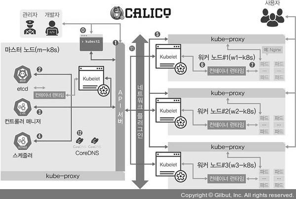
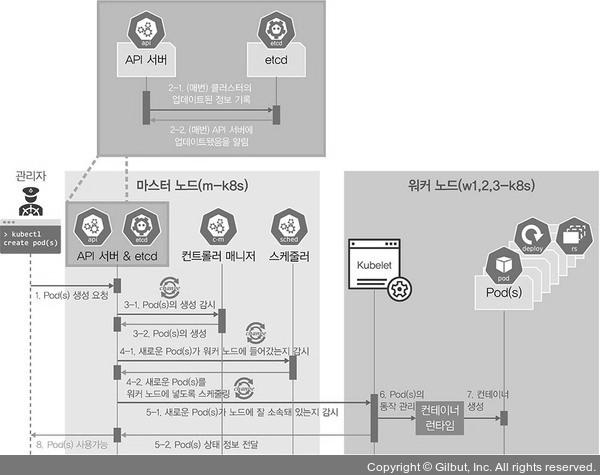
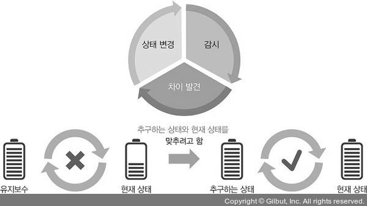

# 1장 새로운 인프라 환경이 온다
- 온프레미스 (on-premises) : 엔지니어가 개발환경을 만들어 제공하면 사용자는 그에 맞는 도구를 모두 설치해야 하는 환경
  - 이는 이제 고전적인 인프라 환경
- 서비스로서의 인프라 (IaaS, Infrastructure as a Service) : 자판기에서 미리 준비된 상품이 나오듯이 이미 구성된 환경을 조합하여 사용할수 있게 제공하는 환경
- 애자일 방법론에 따라 인프라는 또 한번 변화하고 있다
- 사용자 요구 인프라를 즉각 제공하는 주요 기능을 유지하면서, 사용자마다 독립적인 환경에서 개발해도 모두 동일한 결과를 얻을 수 있고, 소프트웨어 성능을 보장하며 인프라 가용 리소스를 최대한 확보 가능한 환경이 필요함
- 이를 만족하는 새로운 **컨테이너 인프라 환경** 을 살펴본다

## 1.1 컨테이너 인프라 환경이란
- 컨테이너 인프라 환경 : 컨테이너를 중심으로 구성된 인프라 환경
- 컨테이너 (Container) : 하나의 운영 체제 커널에서 다른 프로세스에 영향을 받지 않고 독립적으로 실행되는 프로세스 상태를 의미
  - 이는 가상화 상태에서 동작하는 프로세스보다 가볍고 빠르게 동작한다

### 모놀리식 아키텍쳐
- 모놀리식 아키텍쳐 는 하나의 큰 목적이 있는 서비스 또는 애플리케이션에 여러 기능이 통합된 구조를 의미
- 장점 
  - 소프트웨어가 하나의 결합된 코드로 구성되기 때문에 초기 단계 설계가 용이하며 개발자 단순하고 코드 관리가 단순함
- 단점
  - 서비스 운영과정에서 변화가 생길 경우 다른 서비스에 영향을 미칠 가능성이 커짐
  - 서비스가 성장할수록 서비스간 관계가 복잡해 질 수 있다

- 서비스 사용량이 증가하여 서버 증설시 IaaS 덕분에 인프라 증설은 크게 얼벼지 않다
- 하지만 서비스 사용량이 늘었다고 하여 뉴스, 블로그 등의 다른 서비스가 포함 된 애플리케이션까지 확장하는 것은 상당히 비효율적임
- 특정 서비스 수정과정에서 에러 발생시 전체 서비스에 영향이 가게 될 수 있다
- 이에 대한 해결방한으로 마이크로서비스 아키텍쳐가 등장

### 마이크로서비스 아키텍쳐
- 마이크로서비스 아키텍쳐 (MSA) 는 시스템 전체가 하나의 목적을 지향하는 바는 모놀리틱과 동일
  - 개별 기능을 하는 작은 서비스를 각각 개발해 이를 연결하는 구성
- 장점
  - 개발된 서비스를 재사용하기 쉽다
  - 서비스 변경시 다른 서비스에 영향을 미칠 가능성이 적음
  - 고가용성에 적합 IaaS
- 단점
  - 모놀리틱 보다 복잡도가 높음
  - 네트워크 콜을 통해 서로 통신하기에 성능에 영향이 큼

- 각 서비스는 API 게이트웨이와 REST API 를 통해 서로 통신하며, 서비스 개수는 고정되어있지 않기에 이를 위해 서비스 디스커버리를 사용한다
  - 내부통신을 이벤트로 일원화하고 효과적으로 관리하기 위해 이벤트 버스를 서비스로 구성함

### 컨테이너 인프라 환경에 적합한 아키텍쳐
- 컨테이너 인프라 환경에 적합한 아키텍쳐는 정답이 없으며, 주어진 상황에 적합한 기술만 있을 뿐이다
- 컨테이너 인프라 환경은 마이크로 서비스 아키텍쳐로 구현하기에 적합하다
  - 컨테이너를 서비스 단위로 포장하여 손쉽게 배포 및 확장이 가능함

## 1.2 컨테이너 인프라 환경을 지원하는 도구
- 컨테이너 인프라 환경 : 컨테이너, 컨테이너 관리, 개발 환경 구성 및 배포 자동화 모니터링으로 구성됨

### 도커
- 도커는 컨테이너 환경에서 독립적으로 애플리케이션 실행이 가능하도록 컨테이너를 만들고 관리하는 것을 도와주는 도구
- 운ㅇㅇ체제 환경에 관곙벗이 독립적인 환경에서 일관된 결과를 보장한다

### 쿠버네티스
- 쿠버네티스는 다수의 컨테이너를 관리하는데 상요한다
- 컨테이너 자동 배포와 배포된 컨테이너에 대한 동작 보증, 부하에 따른 동적 확장 등의 기능을 제공한다
- 최초 다수의 컨테이너만 관리하는 도구였지만 지금은 컨테이너 인프라 필요한 기능을 통합/관리 솔루션으로 발전했다

### 젠킨스
- 젠킨스는 CI/CD 를 지원한다
- 이는 빌드, 테스트, 패키징, 배포 를 모두 자동화하여 개발 단계를 표준화 한다
- 개발된 코드의 빠른 적용과 효과적 관리를 통해 개발 생산성을 높이는데 초점이 맞춰져있다
- 컨테이너 인프라환경처럼 단일 기능을 빠르게 개발해 적용해야 하는 환경에 매우 적합한 도구

### 프로메테우스와 그라파나
- 프로메테우스와 그라파나는 모니터링을 위한 도구
- 프로메테우스는 상태를 수집하고 그라파나는 이를 기반으로 시각화 하는 도구이다

# 2장 설치
- 생략

# 3장 컨테이너를 다루는 표준 아키텍처, 쿠버네티스
- 컨테이너 인프라 환경
  - 리눅스 OS 의 커널 하나에서 여러 개의 컨테이너가 **격리된 상태** 로 실행되는 인프라 환경
- 컨테이너
  - 하나 이상의 목적을 위해 독립적으로 동작하는 **프로세스**
- 컨테이너 인프라 환경 구축시 **눈송이 서버** 를 방지하는데 효과적이다
  - 눈송이 서버 : 여러 사람이 만져 설정의 일관성이 떨어진 경우

## 3.1 쿠버네티스 이해
- 쿠버네티스 
  - 컨테이너 오케스트레이션 을 위한 솔루션
- 오케스트레이션
  - 복잡한 단계를 관리하고 요소들의 유기적인 관계를 미리 정의해 손쉽게 사용하도록 서비스를 제공하는 것을 의미
  - 다수의 컨테이너를 유기적으로 연결, 실행, 종료 뿐 아닌 상태 추적 및 보존등 컨테이너를 안정적으로 상용할 수 있게 만들어주는 것

### 3.1.1 왜 쿠버네티스 일까 
- 컨테이너 오케스트레이션을 제공하는 대표적인 솔루션들을 살펴보자
- 도커 스웜
  - 설치가 간단하며 사용하기도 용이하다
  - 하지만 그만큼 기능이 다양하지 않다
  - 소규모 환경에서는 많이 사용하지만 대규모 환경에서 적합하지 않다
- 메소스
  - 아파치의 오픈소스이며 트위터, 에어비앤드, 애플 등 에서 많이 사용하여 검증된 솔루션
  - 기능을 충분히 활용하려면 분산 관리 시스템과 연동해야 한다
  - 여러 가지 솔루션을 유기적으로 구성해야 하는 부담이 있음
- 노매드
  - 베이그런트를 만든 해시코프 사의 컨테이너 오케스트레이션
  - 베이그런트 처럼 간단한 구성으로 컨테이너 오케스트레이션 환경을 제공한다
  - 도커 스웜과 마찬가지로 기능이 부족하다
  - Consul, Vault 와 연동이 원할하다
- 쿠버네티스
  - 다른 솔루션보다 진입장벽이 있찌만, 쉽게 사용하게끔 도와주는 도구들이 많아 쉬워지는 추세
  - 다양한 형태로 발전하고 있어 컨테이너 오케스트레이션을 넘어 IT 인프라 자체를 컨테이너화 하고 이를 쿠버네티스위에서 동작할 수 있게 만든다

### 3.1.2 쿠버네티스 구성 방법
- 쿠버네티스 구성방법은 크게 3가지 이다
- 01. 퍼블릭 클라우드에서 제공하는 EKS, AKS, GKE 등을 사용한다. 구성이 이미 다 갖추어져있고 마스터 노드를 업체에서 관리하므로 학습용으로는 적합하지 않음
- 02. 수세의 Rancher, 레드햇의 OpenShift 와 같은 설치형을 사용한다. (유료)
- 03. 사용하는 시스템에 쿠버네티스 클러스터를 자동으로 구성해주는 솔루션을 사용한다.
  - kubeadm, kops, KRIB, kubespray 가 있음
  - kubeadm 이 가장 널리 알라져 있고, 온프레미스와 클라우드 환경을 모두 지원한다
  - 이런 솔루션들을 구성형 쿠버네티스라고 한다

### 3.1.3 쿠버네티스 구성하기
- 설치 생략

### 3.1.4 파드 배포를 중심으로 쿠버네티스 구성요소 살펴 보기
- 쿠버네티스의 구성 요소의 유기적인 연결관계를 표현하면 다음과 같다.

- 파드를 배포하는 순서에 따라 요소들의 역할을 정리하면 다음과 같다

`마스터 노드`
- [0] kubectl : 쿠버네티스 클러스터에 명령을 내리는 역할
  - 다른 구성 요소들과 다르게 바로 실행되는 명령 형태인 **바이너리로 배포되기에 마스터 노드에 있을 필요는 없다*8
  - 통상적으로 API 서버와 주로 통신하기에 예제에서는 API 서버가 위칳나 마스터 노드에 구성함
- [1] API 서버 : 쿠버네티스 클러스터의 중심 역할을 하는 통로
  - 주로 상태 값을 저장하는 etcd 와 통신하지만, 그 외 요소들 또한 API 서버를 중심에 두고 통신하므로 API 서버의 역할을 매우 중요함
- [2] etcd : 구성 요소들의 상태 값이 모두 저장되는 곳
  - etcd 외의 다른 구성 요소는 상태 값을 관리하지 않는다
  - etcd 만 백업되어 있다면 장애 상황에서도 클러스터 복구가 가능하다
  - 분산 저장 가능한 key-value 저장소이므로 시스템 가용성 확보가 가능함
- [3] 컨트롤러 매니저 : 쿠버네티스 클러스터의 오브젝트 상태를 관리함 
  - 워커 노드에서 통신이 안된다면 상태 체크/복구는 컨트롤러 매니저에 속한 노드 컨트롤러에서 이루어 진다
  - 서비스와 파드를 연결하는 역할을 하는 엔드 포인트 컨트롤러 또한 컨트롤러 매니저
- [4] 스케줄러 : 노드의 상태와 자원, 레이블, 요구 조건 등을 고려해 파드를 어떤 워커 노드에 생성 할 것인지를 결정하고 할당함
  - 파드를 조건에 맞는 워커 노드에 지정하고, 파드가 워커 노드에 할당되는 일정을 관리하는 역할을 담당

`워커 노드`
- [5] kubelet : 파드의 구성 내용을 받아 컨테이너 런타임으로 전달하고, 파드 안의 컨테이너 들이 정상적으로 동작하는지 모니터링 함
- [6] 컨테이너 런타임 : 파드를 이루는 컨테이너의 실행을 담당
  - 파드 안에서 다양한 종류의 컨테이너가 문제 없이 작동하게 만드는 표준 인터페이스
- [7] 파드 : 한 개 이상의 컨테이너로 단일 목적의 일을 하기 위해 모인 단위
  - 웹 서버의 역할을 할 수도 있고, 로그나 데이터 분석도 가능하다
  - 파드 => 언제라도 죽을 수 있는 존재 라는 점이 중요하다

`선택 가능한 구성 요소`
- [11] 네트워크 플러그인 : 쿠버네티스 클러스터 통신을 위해 네트워크 플러그인을 구성해야 한다
  - 일반적으로 CNI 로 구성하는데 주로 사용하는 CNI 는 캘리코, 프래널, 실리움, 큐브 라우터, 로마나, 위브넷, Canal
- [12] CoreDNS : 클라우드 네이티브 컴퓨팅 재단에서 보증하는 프로젝트. 빠르고 유연한 DNS 서버
  - 쿠버네티스 클러스터에서 도메인 일므을 이용해 통신하는데 사용한다
  - 실부에서는 IP 보다 CoreDNS 를 사용하는 것이 일반적

### 3.1.5 파드의 생명주기로 쿠버네티스 구성 요소 살펴보기
- 생명주기 는 파드가 생성, 수정, 삭제되는 과정을 나타낸다

- 1. kubectl 을 통해 API 서버에 파드 생성 요청
- 2. API 서버에 전달된 내용이 있으면 API 서버는 etcd 에 전달된 내용을 모두 기록하여 클러스터의 상태 값을 최신으로 유지한다.
  - 각 요소가 상태를 업데이트할 때마다 모두 API 서버를 통해 etcd 에 기록된다
- 3. API 서버에 파드 생성이 요청된 것을 컨트롤러 매니저가 인지하면 컨트롤러 매니저는 파드를 생성하고, 이상태를 API 서버에 전달한다
  - 아직 **어떤 워커 노드에 파드를 적용할지는 결정되지 않은 상태로 파드만 생성함**
- 4. API 서버에 파드가 생성됐다는 정보를 스케줄러가 인지한다
  - 스케줄러는 생성된 파드를 어떤 워커 노드에 적용할지 조건을 고려해 결정하고 해당 워커 노드에 파드를 띄우도록 요청한다
- 5. API 서버에 전달된 정보대로 지정한 워커 노드에 파드가 속해 있는지 스케줄러가 kubelet 으로 확인한다
- 6. kubelet 에서 컨테이너 런타임으로 파드 생성을 요청한다
- 7. 파드가 생성된다
- 8. 파드가 사용가능한 상태가 된다
- 쿠버네티스는 워크플로우가 아닌 **선언적인** 시스템 구조를 가지고 있다
  - 각 요소가 추구하는 상태를 선언하면, 현재 상태와 맞는지 점검하고 그것에 맞추려고 하는 구조로 되어 있음
- API 서버와 etcd 는 거의 한몸처럼 움직이도록 설계되어 있음
- 워커 노드는 워크플로 구조에 따라 설계됨
  - 쿠버네티스가 kubelet 과 컨테이너 런타임을 통해 파드를 새로 생성하고 제거해야 하는 구조기이기 때문에
  - 선언적 방식으로 구조화하기 힘들다
  - 명렁 전달에 있어서 절차적인 방식은 시스템 성능을 높이는데 효율적
- 반면 마스터 노드는 이미 생성된 파드들을 유기적으로 연결하므로 선언적인 시스템이 더 낫다

### 3.1.6 쿠버네티스 구성 요소의 기능

`kubectl`
- 꼭 마스터 노드에 위치할 필요는 없다
- 실제 쿠버네티스 클러스터 외부에서 쿠버네티스 클러스터에 명령을 내릴 수도 있음
- kubectl 이 어디에 있더라도 **API 서버의 접속정보** 만 존재한다면 클러스터에 명령을 내릴 수 있다

`kubelet`
- 쿠버네티스에서 파드의 생성과 상태관리 및 복구를 담당하는 중요한 구성요소
- kubelet 에 문제가 생기면 파드가 정상적으로 관리되지 않는다

`kube-proxy`
- 파드의 통신을 담당한다