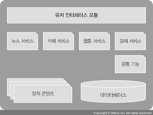
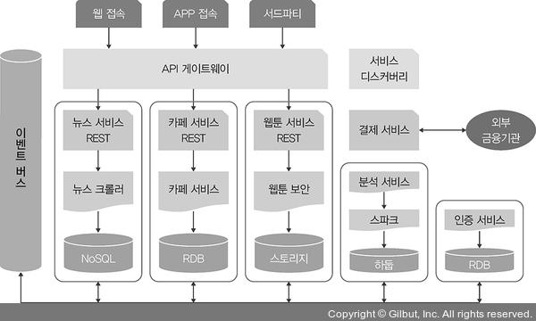

# 1장 새로운 인프라 환경이 온다
- 온프레미스 (on-premises) : 엔지니어가 개발환경을 만들어 제공하면 사용자는 그에 맞는 도구를 모두 설치해야 하는 환경
  - 이는 이제 고전적인 인프라 환경
- 서비스로서의 인프라 (IaaS, Infrastructure as a Service) : 자판기에서 미리 준비된 상품이 나오듯이 이미 구성된 환경을 조합하여 사용할수 있게 제공하는 환경
- 애자일 방법론에 따라 인프라는 또 한번 변화하고 있다
- 사용자 요구 인프라를 즉각 제공하는 주요 기능을 유지하면서, 사용자마다 독립적인 환경에서 개발해도 모두 동일한 결과를 얻을 수 있고, 소프트웨어 성능을 보장하며 인프라 가용 리소스를 최대한 확보 가능한 환경이 필요함
- 이를 만족하는 새로운 **컨테이너 인프라 환경** 을 살펴본다

## 1.1 컨테이너 인프라 환경이란
- 컨테이너 인프라 환경 : 컨테이너를 중심으로 구성된 인프라 환경
- 컨테이너 (Container) : 하나의 운영 체제 커널에서 다른 프로세스에 영향을 받지 않고 독립적으로 실행되는 프로세스 상태를 의미
  - 이는 가상화 상태에서 동작하는 프로세스보다 가볍고 빠르게 동작한다

### 모놀리식 아키텍쳐
- 모놀리식 아키텍쳐 는 하나의 큰 목적이 있는 서비스 또는 애플리케이션에 여러 기능이 통합된 구조를 의미
- 장점 
  - 소프트웨어가 하나의 결합된 코드로 구성되기 때문에 초기 단계 설계가 용이하며 개발자 단순하고 코드 관리가 단순함
- 단점
  - 서비스 운영과정에서 변화가 생길 경우 다른 서비스에 영향을 미칠 가능성이 커짐
  - 서비스가 성장할수록 서비스간 관계가 복잡해 질 수 있다

- 서비스 사용량이 증가하여 서버 증설시 IaaS 덕분에 인프라 증설은 크게 얼벼지 않다
- 하지만 서비스 사용량이 늘었다고 하여 뉴스, 블로그 등의 다른 서비스가 포함 된 애플리케이션까지 확장하는 것은 상당히 비효율적임
- 특정 서비스 수정과정에서 에러 발생시 전체 서비스에 영향이 가게 될 수 있다
- 이에 대한 해결방한으로 마이크로서비스 아키텍쳐가 등장

### 마이크로서비스 아키텍쳐
- 마이크로서비스 아키텍쳐 (MSA) 는 시스템 전체가 하나의 목적을 지향하는 바는 모놀리틱과 동일
  - 개별 기능을 하는 작은 서비스를 각각 개발해 이를 연결하는 구성
- 장점
  - 개발된 서비스를 재사용하기 쉽다
  - 서비스 변경시 다른 서비스에 영향을 미칠 가능성이 적음
  - 고가용성에 적합 IaaS
- 단점
  - 모놀리틱 보다 복잡도가 높음
  - 네트워크 콜을 통해 서로 통신하기에 성능에 영향이 큼

- 각 서비스는 API 게이트웨이와 REST API 를 통해 서로 통신하며, 서비스 개수는 고정되어있지 않기에 이를 위해 서비스 디스커버리를 사용한다
  - 내부통신을 이벤트로 일원화하고 효과적으로 관리하기 위해 이벤트 버스를 서비스로 구성함

### 컨테이너 인프라 환경에 적합한 아키텍쳐
- 컨테이너 인프라 환경에 적합한 아키텍쳐는 정답이 없으며, 주어진 상황에 적합한 기술만 있을 뿐이다
- 컨테이너 인프라 환경은 마이크로 서비스 아키텍쳐로 구현하기에 적합하다
  - 컨테이너를 서비스 단위로 포장하여 손쉽게 배포 및 확장이 가능함

## 1.2 컨테이너 인프라 환경을 지원하는 도구
- 컨테이너 인프라 환경 : 컨테이너, 컨테이너 관리, 개발 환경 구성 및 배포 자동화 모니터링으로 구성됨

### 도커
- 도커는 컨테이너 환경에서 독립적으로 애플리케이션 실행이 가능하도록 컨테이너를 만들고 관리하는 것을 도와주는 도구
- 운ㅇㅇ체제 환경에 관곙벗이 독립적인 환경에서 일관된 결과를 보장한다

### 쿠버네티스
- 쿠버네티스는 다수의 컨테이너를 관리하는데 상요한다
- 컨테이너 자동 배포와 배포된 컨테이너에 대한 동작 보증, 부하에 따른 동적 확장 등의 기능을 제공한다
- 최초 다수의 컨테이너만 관리하는 도구였지만 지금은 컨테이너 인프라 필요한 기능을 통합/관리 솔루션으로 발전했다

### 젠킨스
- 젠킨스는 CI/CD 를 지원한다
- 이는 빌드, 테스트, 패키징, 배포 를 모두 자동화하여 개발 단계를 표준화 한다
- 개발된 코드의 빠른 적용과 효과적 관리를 통해 개발 생산성을 높이는데 초점이 맞춰져있다
- 컨테이너 인프라환경처럼 단일 기능을 빠르게 개발해 적용해야 하는 환경에 매우 적합한 도구

### 프로메테우스와 그라파나
- 프로메테우스와 그라파나는 모니터링을 위한 도구
- 프로메테우스는 상태를 수집하고 그라파나는 이를 기반으로 시각화 하는 도구이다