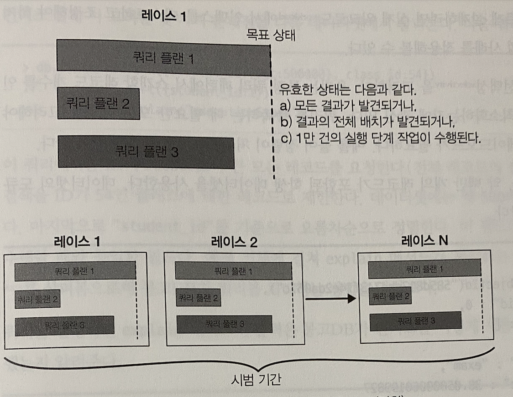

# 5장 인덱스

## 5.1 인덱싱 소개
- 데이터베이스 인덱스는 책의 인덱스와 유사하다
- 특정 내용을 가리키는 정렬된 리스트를 확인하기 때문에 더 빠르게 쿼리할 수 있다
- 인덱스를 사용하지 않는 쿼리 > **컬렉션 스캔 (collection scan)** 이라 한다
  - 서버가 쿼리 결과를 찾기위해 전체 컬렉션을 뒤져야 함
- explain 함수를 이용해 쿼리가 실행될 때 몽고 DB 가 무엇을 하는지 확인할 수 있다
- explain 명령을 감싸는 커서 보자자 메소드 와 사용하면 좋다
  - 다양한 CRUD 작업의 실행 정보를 제공함
- executionStats 모드는 인덱스를 이용한 쿼리의 효과를 이해하는데 도움이 된다

```shell
> db.test.find({ class: "A"}).explain("executionStats")
...
"executionStats" : {
  "executionSuccess" : true,
  "nReturned" : 10,
  "executionTimeMillis" : 0,
  "totalKeysExamined" : 0,
  "totalDocsExamined" : 20,
  "executionStages" : {
    "stage" : "COLLSCAN",
    "filter" : {
      "class" : {
        "$eq" : "A"
      }
    },
    "nReturned" : 10,
    "executionTimeMillisEstimate" : 0,
    "works" : 22,
    "advanced" : 10,
    "needTime" : 11,
    "needYield" : 0,
    "saveState" : 0,
    "restoreState" : 0,
    "isEOF" : 1,
    "direction" : "forward",
    "docsExamined" : 20
  }
}
```
- totalDocsExamined : 참조된 document 수
- executionStages : 쿼리 수행 상세 정보
- executionStages 에는 여러 단계에 나눠 진행되는 쿼리의 상세 정보가 나와있다
- `stage` 필드를 통해 어떤 작업을 했는지 알 수 있다
  - COLLSCAN : 전체 스캔
  - IXSCAN : 인덱스 스캔
- 위 플랜을 살펴보면 전체 20개의 docs 중 class:'A' 를 찾기 위해 totalDocsExamined:'20' 20개 모두를 탐색했다는 것을 알 수 있다
- `nReturned` 필드는 반환받은 결과의 개수를 나타낸다
- 몽고 DB 가 쿼리에 효율적으로 응답하게 하려면 애플리케이션의 모든 쿼리 패턴에 인덱스를 사용해야 한다
  - 쿼리 패턴 : 단순히 애플리케이션이 데이터베이스에 요구하는 다양한 유형의 질문을 의미
- 많은 애플리케이션에서 단일 인덱스가 여러 쿼리 패턴을 지원한다

### 인덱스 생성
- 인덱스를 생성하려면 createIndex 메소드를 사용한다

```shell
db.users.createIndex({"class" : 1})
{
  "createdCollectionAutomatically" : false,
  "numIndexesBefore" : 1,
  "numIndexesAfter" : 2,
  "ok" : 1
}
```
- 컬렉션의 크기가 크지않는 한 인덱스를 생성하는데는 몇초면 충분하다
- db.currentOp() or mongod 로그를 확인해 인덱스 구축의 진행률을 체크할 수 있다
- 인덱스 생성 이후 다시 쿼리 플랜을 살펴보자

```shell
> db.test.find({ class: "A"}).explain("executionStats")
...
"executionStats" : {
  "executionSuccess" : true,
  "nReturned" : 10,
  "executionTimeMillis" : 0,
  "totalKeysExamined" : 10,
  "totalDocsExamined" : 10,
  "executionStages" : {
    "stage" : "FETCH",
    "nReturned" : 10,
    "docsExamined" : 10,
    "inputStage" : {
      "stage" : "IXSCAN",
      "nReturned" : 10,
      "indexName" : "class_1"
    }
  }
}
```
- 더 많은 정보들이 추가되었지만 차이점만 살펴보자
- stage: "IXSCAN" 으로 인덱스 스캔을 했다
- "indexName" : "class_1" = 방금 생성된 "class_1" 이라는 인덱스 명을 사용했다. 
- 전체 doc 참조 개수는 "totalDocsExamined" : 10 으로 필요한 doc 를 참조했음을 확인할 수 있다
- 보다싶이 인덱스는 쿼리시간에 놀랑누 차이를 만든다.
- 단점 = 인덱싱된 필드는 변경하는 작업은 더 오래 걸린다.
  - 데이터 변경시 마다 도큐먼트 뿐 아닌 모든 인덱스를 갱신해야 하기 때문이다

### 복합 인덱스
- 인덱스는 가능한 효율적으로 쿼리하려는 목적으로 사용한다
- 상당수의 쿼리 패턴은 두 개 이상의 키를 기반으로 인덱스를 작성해야 한다
- 인덱스는 모든 값을 정렬된 순서로 보관하기 때문에 인덱스 키로 도큐먼트를 정렬하는 작업이 훨씬 빨라지게 한다
  - 인덱스가 앞부분에 있을때문 유효함

```shell
db.users.find().sort({"age" : 1, "username" : 1}) // username 인덱스는 이와 같은 정렬쿼리에는 도움이 되지 않는다
db.users.createIndex({"age": 1, "username" : 1}) // 정렬 최적화를 위해 age, username 를 생성
```
- 위와 같은 인덱스를 복합 인덱스라 한다
- 쿼리에서 정렬 방향이 여러 개 이거나 검색 조건에 여러 키가 있는때 유용하다
- 복합 인덱스는 2개 이상의 필드로 구성된 인덱스이다

```shell
{ "username" : "user0", "age" : 1}
{ "username" : "user1", "age" : 2}
{ "username" : "user2", "age" : 3}
{ "username" : "user3", "age" : 4}
{ "username" : "user4", "age" : 5}
{ "username" : "user5", "age" : 6}
{ "username" : "user6", "age" : 7}
{ "username" : "user7", "age" : 8}
// ...
```
- 위와 같은 컬렉션이 있다고 가정하고, {"age" : 1, "username" : 1} 로 인덱스를 만들면 다음과 같은 형태로 표현된다

```shell
[0, "user10020"] -> 8623423414
[0, "user1002"] -> 8593912039123
[0, "user100388"] -> 85325823908
```
- 각 인덱스 항목은 나이와 사용자 명을 포함하고 레코드 식별자를 가리킨다.
- 레코드 식별자는 내부에서 스토리지 엔진에 의해 사용되며 도큐먼트 데이터를 찾는다
- 몽고 DB 가 실행되는 쿼리 종류에 따라 인덱스 사용방법이 다르다

`db.users.find({"age": 21}).sort({"usenname" : -1})`
- 단일 값을 찾는 동등 쿼리이다
- 결과값으로 여러 도큐먼트가 있을 수 있다
- 인덱스 두 번째 필드로 인해 결과는 이미 적절한 순서로 정렬된다
- "age" : 21 과 일치하는 마지막 항목부터 순서대로 인덱스를 탐색한다
- 이런 쿼리는 매우 효율적이다

`db.users.find({"age" : {"$gte" : 21, "$lte" : 30}})`
- 범위 쿼리이며 여러 값이 일치하는 도큐먼트를 찾는다
- 인덱스의 첫 번째 키인 age 를 사용해 일치하는 도큐먼트를 반환 받는다

`db.users.find({"age" : {"$gte" : 21, "$lte" : 30}}).sort({"username" : 1})`
- 다중값 쿼리 지만 이번에는 정렬을 포함한다
- 검색 조건에 맞는 인덱스를 사용한다
- 하지만 사용자 명을 정렬된 순서로 반환하지 않으며, 쿼리는 사용자명에 따라 정렬된 결과를 원한다
- 이는 결과 반환 전 메모리에서 정렬해야 함을 의미한다
- 일반적으로 이전 쿼리보다 비효율 적이다
- 결과가 32메가 이상이라면 데이터가 너무 많아 정렬 거부 에러를 내보낸다

### 몽고 DB 가 인덱스를 선택하는 방법
- 쿼리가 들어오면 몽고 DB 는 **쿼리 모양 (query shape)** 을 확인한다
- 이는 검색할 필드와 정렬 여부 등 추가 정보와 관련 있다
- 이 정보를 기반으로 쿼리를 충족하는데 사용할 인덱스 후보 집합을 식별한다
- 인덱스 5개중 3개가 쿼리 후보로 식별됬다면, 각 인덱스 후보에 하나씩 총 3개의 쿼리 플랜을 만든다
- 그후 각각 다른 인덱스를 사용하는 3개의 병렬 스레드에서 쿼리를 실행한다
  - 가장 빠른 결과를 반환하는 인덱스를 확인하기 위함
- 가장 먼저 목표 상태에 도달하는 쿼리 플랜이 선정 된다


- 쿼리 스레드가 레이스에서 이기려면 모든 쿼리 결과를 가장 먼저 반환 or 결과에 대한 시범 횟수를 정렬 순서로 가장 먼저 반환해야 한다
  - 인메모리 정렬을 비하면 비용이 많이 들기때문에 정렬 순서는 중요한 부분이다
- 서버는 쿼리 플랜의 캐시를 유지하며, 컬렉션 or 인덱스가 변경되면 캐시에서 제거되고 다시 가능한 쿼리 플랜을 실험해 적합한 플랜을 찾는다
- 인덱스 추가/삭제시 캐시엣 되며, 명시적으로 지우거나 mongod 프로세스를 재시작할때 도 삭제된다

### 복합 인덱스 사용
- 복합 인덱스는 단일 키 인덱스보다 복잡하지만 매우 강력하다
- 인덱스를 올바르게 설계하려면 실제 워크로드에서 인덱스를 테스트하고 조정해야하지만, 몇 가지 모범 사례를 적용할 수 있다.
- 모든 상황은 아니지만 대부분의 상황에 적용되므로 복합 인덱스 구성시 가장 먼저 고려하자.
  - 동등 필터에 대한 키를 맨 앞에 표시
  - 정렬에 사용되는 키는 다중값 필드 앞에 표시
  - 다중값 필터에 대한 키는 마지막에 표시

### 키 방향 선택하기
- 두 개 이상의 검색조건으로 정렬할 때는 인덱스 키의 방향이 서로 달라야 한다
- users 컬렉션 예시로 나이가 적은 사용자 부터 많은 사용자순, 사용자 명은 Z-A 로 정렬한다고 하면 
- 복합 정렬을 {"age" : 1, "username" : -1 } 같이 인덱스를 생성해 최적화 해야한다
- 애플리케이션이 {"age" : 1, "username" : 1} 을 이용해 정렬을 최적화 해야한다면 해당 방향으로 두 번째 인덱스를 생성한다
- 역방향 인덱스는 서로 동듬함을 알아 두자
  - {"age" : 1, "username" : -1 } == {"age" : -1, "username" : 1 }
- 인덱스의 방향은 다중 조건에 따라 정렬할 때만 문제가 되며, 단일 키로 정렬하면 인덱스를 쉽게 역순으로 읽을 수 있다
  - {"age": 1} 인덱스로 {"age" : -1} 정렬을 최적화 할 수 있다
- 다중 키로 정렬시에만 문제가 된다.

### 커버드 쿼리 사용하기
- 쿼리가 단지 인덱스에 포함된 필드를 찾는 중이라면, 도큐먼트를 가져올 필요가 없다
- 인덱스가 쿼리가 요구하는 값을 모두 포함하는 경우 **쿼리가 커버드 된다** 고 한다.
- 실무에서는 도큐먼트로 돌아가지 말고 항상 커버드 쿼리를 사용하자
- 이 방법으로 작업 셋을 훨씬 작게 만들 수 있다
- 커버드 쿼리에 explain 을 실행하면 결과에 FETCH 단계의 하위 단계가 아닌 IXSCAN 단계가 있고
- executionStats 에서 totalDocsExamined 의 값이 0이 된다

### 암시적 인덱스
- 복합 인덱슨느 "이중 임무" 를 수행할 수 있으며 쿼리마다 다른 인덱스철머 동작할 수 있다
- {"age" 1, "username" : 1} 인덱스를 가지면 "age" 필드는 {"age" : 1} 만 인덱스를 가질 때와 동일한 방법으로 정렬 된다
- 인덱스가 N 개의 키를 가진다면 키의 앞부분은 공짜 인덱스가 된다
  - {"a": 1, "b": 1, "c" : 1, "d": 1 ...} 인덱스가 있다면..
  - {"a" : 1}
  - {"a" : 1, "b" : 1}
  - {"a" : 1, "b" : 1, "c" : 1} 등으로 인덱스를 가진다
- 인덱스의 접두사를 이용하는 쿼리에만 적용할 수 있음을 기억해야 한다.

### $연산자의 인덱스 사용법

### 비효율적인 연산자
- 일반적으로 부정 조건은 비효율적
- $ne 는 인덱스를 사용하긴 하지만 잘 활용하지 못함
  - $ne 로 지정된 항목을 제외한 모든 인덱스를 살펴봐야한다
  - 일반적으로 전체 인덱스를 스캔해야함
- $not 은 종종 인덱스를 사용하지만 어떻게 사용해야할지 모르는 경욱 ㅏ많다
  - $not 은 기초적인 범위와 정규 표현식을 반대로 뒤집을 수 있다
  - $not 을 사용하는 쿼리는 대부분 테이블 스캔을 수행한다
- $nin 은 항상 테이블 스캔을 수행한다

### OR 쿼리
- 현재 몽고 DB 는 쿼리당 하나의 인덱스만 사용할 수 있다
- {"x" : 1 }, {"y": 1 } 인덱스가 각각 하나씩 있다고 가정하고, {"x" : 123, "y" : 456} 으로 쿼리를 실행하면 둘중 하나의 인덱스만 사용한다
  - 유일한 예외는 $or 연산자
- $or 는 두 개의 쿼리를 수행하고 결과를 합치기 때문에 $or 절 마다 하나의 인덱스를 사용할 수 있다
- 일반적으로 두 번 쿼리해서 결과를 병합하면 한 번 쿼리할 때 보다 훨씬 비효율 적이다
- 가능하면 $or 보다는 $in 을 사용하자

### 객체 및 배열 인덱싱
- 몽고 DB 는 도큐먼트 내부에 도달해 내장 필드와 배열에 인덱스를 사용하도록 허용한다
- 내장 객체와 배열 필드는 복합 인덱스에서 최상위 필드와 결합될 수 있으며, 다소 특수한 경우를 제외하면 대부분 "일반적인" 인덱스 필드와 같은 방식으로 동작한다

### 내장 도큐먼트 인덱싱하기
- 인덱스는 일반적인 키에 생성될 때와 동일한 방식으로 내장 도큐먼트 키에 생성될 수 있다

```shell
{
  "username" : "sid",
  "loc" : {
    "ip" : "1.2.3.4",
    "city" : "Springfield",
    "state" : "NY"
  }
}
```
- loc.city 에 인덱스를 생성해 해당 필드를 이용하는 쿼리의 속도를 높일 수 있다
- 내장 도큐 먼트 자체에 loc 를 인덱싱 하면 내장 도큐먼트 필드 loc.city 를 인ㄷ게싱 할 때와는 매우 다르게 동작한다.
- 서브 도큐먼트 전체를 인덱싱 하는 경우, 서브 도큐먼트 전체에 쿼리 할 때만 도움이 된다
- 도큐먼트 전체가 올바른 필드 순서로 기술된 쿼리에만 loc 인덱스를 사용할 수 있다

### 배열 인덱싱하기
- 배열에도 인덱스를 생성할 수 있다
- 인덱스를 사용하면 배열의 특정 요소를 효율적으로 찾을 수 있다
- 배열을 인덱싱하면 배열의 각 요소에 인덱스 항목을 생성하므로, 한 게시물에 20개 댓글이 있다면, 도큐먼트는 20개의 인덱스를 가진다
- 입력, 갱신, 제거 작업을 하려면 모든 배열 요소가 갱신되어야 하므로 배열 인덱스를 단일 인덱스보다 부담스럽게 만든다
- 배열 전체를 단일 개체처럼 인덱싱 할 수 없다
- 배열 필드 인덱싱은 배열 자체가 아니라 배열의 각 요소를 인덱싱하기 때문이다
- 배열 요소에 대한 인덱스에는 위치 개념이 없다.
  - comments.4 와 같이 특정 배열 요소를 찾는 쿼리에는 인덱스를 사용할 수없다
- 배열의 **특정 항목** 에 대해 인덱스를 생성할 수는 있지만, 정확히 N 번째 요소를 쿼리할 때만 유용하다

```shell
> db.blog.createIndex({"comments.10.votes" : 1})
```

### 다중키 인덱스가 미치는 영향
- 도큐먼트가 배열 필드를 인덱스로 가지면 인덱스는 즉시 다중키 인덱스로 표시된다
- 인덱스는 일반 다중키로 표시되면 필드 내 배열을 포함하는 도큐먼트가 모두 제거되더라도 비 다중키가 될 수 없다
  - 비 다중키가 되려면 인덱스를 삭제하고 재생성 해야 함
- 다중키 인덱스는 비다중키 인덱스보다 느릴 수 있다

### 인덱스 카디널리티
- 카디널리티 = 컬렉션의 한 필드에 대해 고유값이 얼마나 많은지 여부
- ex) gender = 매우 낮은 카디널리티 (값을 두개 뿐..)
- ex) username, email = 각 도큐먼트마다 유일한 키 값을 가지며 높은 카디널리티 
- ex) age, zip code = 카디널리티가 중간 쯤..
- 필드의 카디널리티가 높을수록 인덱싱이 도움이 된다
- 인덱스로 검색 범위를 훨씬 작은 결과 셋으로 빠르게 좁힐 수 있다
- 카디널리티가 높은 키를 생성하면 좋고, 복합인덱스에서 카디널리티가 높은 키를 앞에 두면 좋다

## explain 출력
- 쿼리에 대한 많은 정보를 제공하며, 느린 쿼리를 위한 중요한 진단 도구이다
- 이를 사용하면 어떤 인덱스가 어떻게 사용되는지 알 수 있다
- 어떤 쿼리든 마지막에 explain 을 추가할 수 있음
- 쿼리가 COLLSACN 을 사용한다면 인덱스를 사용하지 않는 쿼리이다
- 각 필드 설명 생략.. 위에서 대략 살펴봄..

## 인덱스를 생성하지 않는 경우
- 인덱스는 데이터 일부를 조회할 때 가장 효율적이며, 어떤 쿼리는 인덱스가 없는게 더 빠르다
- 인덱스는 컬렉션에서 가져와야 하는 부분이 많을수록 비효율적이다
  - 인덱스 하나를 사용하려면 두 번 조회해야 하기 때문
- 반면 컬렉션 스캔을 할 때는 도큐먼트만 살펴보면 된다
- 최악의 경우 인덱스를 사용한다면 두배 많은 조회를 수행해야하며 컬렉션 스캔보다 느리다
  - 전체 도큐먼트를 반환 하는 등..
- 대체로 쿼리가 컬렉션의 30% 이상을 반환하는 경우 인덱스는 종종 쿼리 속도를 높인다

`인덱스의 효과에 영향을 미치는 속성`

| 인덱스가 적합한 경우 | 컬렉션 스캔이 적합한 경우 |
| --- | --- |
| 큰 컬렉션 | 작은 컬렉션 |
| 큰 도큐먼트 | 작은 도큐먼트 |
| 선택적 쿼리 | 비선택적 쿼리 |

## 인덱스 종류
- 인덱스 구축시 옵션을 지정해 동작 방식을 바꿀 수 있다

### 고유 인덱스
- 고유 인덱스는 각 값이 인덱스에 최대 한 번 나타나도록 보장한다
- 여러 도큐먼트에서 firstname 키에 동일한 값을 가질 수 없도록 하려면 firstname 필드가 있는 도큐먼트에 대해서만 partialFilterExpression 으로 고유 인덱스를 만들면 된다
  - _id의 인덱스는 컬렉션 생성시 항상 자동 생성된다
- 다른 고유 인덱스와 달리 삭제할 수 없다
- 인덱스 버킷은 크기 제한이 있으며, 제한을 넘는 경우 인덱스에 포함되지 않는다
  - 4.2 이전 버전에서는 1024 바이트 미만이어야 함
  - 4.2 이후부터는 이런 제약이 사라졌다

### 복합 고유 인덱스
- 복합 고유 인덱스를 만들 수도 있다
- 개별 키는 같은 값을 가질 수 있지만 인덱스 항목의 모든 키에 걸친 값의 조합은 인덱스에서 최대 한 번만 나타난다
- GridFS 는 몽고 DB 에 큰 파일을 저장하는 표준 방식으로 복합 고유 인덱스를 사용한다

### 중복 제거하기
- 기존 컬렉션에 고유 인덱스를 구축할 때 중복된 값이 있으며 실패한다
- 일반적으로 데이터 처리를 한 후 중복이 발생한 부분을 파악하고 어떻게 처리할지 알아내야 한다

### 부분 인덱스
- 고유 인덱스는 null 을 값으로 취급하므로, 키가 없는 도큐먼트가 여러 개인 고유 인덱스를 만들 수 없다
- 오직 키가 존재할 때만 고유 인덱스가 적용되도록 할 때가 많다
- 고유한 필드가 존재하거나 필드가 아예 없다면 unique 와 partial 을 결합 할 수 있다
- 부분 인덱스를 만들려면 `partialFilterExpression` 옵션을 포함시킨다
  - 부분 인덱스는 반드시 고유할 필요는 없다
- 고유하지 않은 고유 인덱스를 만드려면 unique 옵션을 제외하기만 하면 된다

```shell
// email 인덱스는 선택항목이지만, 고유해야하는 경우 다음과 같이 생성할 수 있음
db.users.ensureIndex({"email" : 1}, {"unique" : true, "partialFilterExpression" : .. {"email" : {"$exist" : true}}})
```

## 인덱스 관리
- createIndex 를 사용해 인덱스르 생성할 수 있다
- 인덱스는 컬렉션당 한 번 만들어야 하며 동일한 인덱스를 다시 생성하면 아무일도 일어나지 않는다
- 인덱스 정보는 모두 system.indexes 컬렉션에 저장된다
  - 컬렉션의 도큐먼트를 수정/제거할 수 없으며 createIndex, createIndexes 와 같은 데이터베이스 명령으로만 조작할 수 있다
- 특정 컬렉션의 모든 인덱스 정보를 확인하려면 db.컬렉션명.getIndexes() 를 실행하면 된다

### 인덱스 식별
- 컬렉션 내 각 인덱스는 고유하게 식별하는 이름이 있다
- 인덱스명은 서버에서 인덱스를 삭제하거나 조작하는데 사용된다
- 인덱스명은 기본적으로 키명1_방향1_키명2_방향2... 이다
- 인덱스 키가 두개 이상이면 인덱스명이 길어지므로 createIndex 옵션으로 지정가능하다.

```shell
db.soup.createIndex({...}, {"name" : "alpha"})
```
- 인덱스명은 글자수 제한이 있기 때문에 별도 이름 지정이 필요할 수 있다
- getLastError 호출은 인덱스 생성의 성공 여부 혹은 실패 원인을 보여준다

### 인덱스 변경
- dropIndex 명령을 사용해 불필요한 인덱스를 제거할 수 있다

```shell
db.people.dropIndex("x_1_y_1")
```
- 인덱스의 name 필드를 사용해 삭제할 인덱스를 지정하자
- 4.2 이후에는 인덱스 삭제시 빠른 처리를 위해 완료시 까지 모든 읽기/쓰기를 중단한다
  - background 옵션을 읽기/쓰기 요청 처리가 가능함
  - 백그라운드 인덱싱은 포그라운드 인덱싱보다 느리다
- 4.2 부터는 하이브리드 구축이라는 새로운 방식을 도입했다
  - 구축 프로세스 시작과 끝에만 락을 가지며 나머지 부분은 읽기 및 쓰기 작업을 인터리빙 한다
  - 포그라운드/백그라운드 인덱싱 두가지 방식을 모두 대체한다