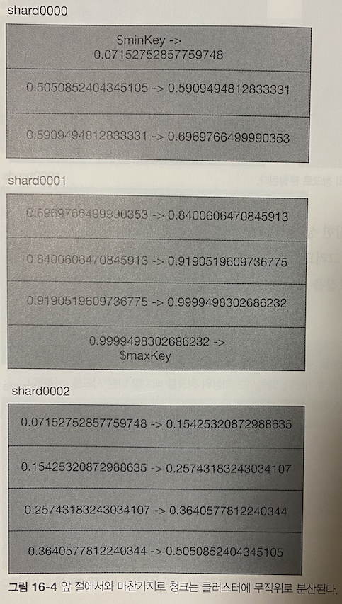
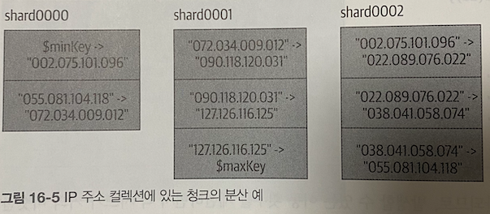

# 16장 샤드 키 선정
- 여러 샤드 키중 결정하는 방법
- 샤드 키 사용 사례
- 샤드 키로 사용할 수 없는 것
- 사용자 정의 형태로 데이터를 분산할 때 전략
- 데이터를 수동으로 샤딩하는 방법

## 용도 평가
- 컬렉션 샤딩시 데이터 분할에 사용할 1 ~ 2개 의 필드를 선정하며, 이 키를 **샤드 키** 라고한다.
  - 샤딩 이후 샤드키는 변경할 수 없으므로 신중하게 선택
- 좋은 샤드키 선정 ?
  - 샤드 키가 애플리케이션의 요청을 분산하는 방법과 작업량을 이해해야함
- 샤딩할 컬렉션에 다음과 같은 질문을 해보자
  - 샤드를 얼마나 많이 늘릴것인가 ?
    - 샤드가 세 개인 클러스터가 천개인 클러스터보다 유연하다
    - 클러스터가 점점 커질때 쿼리가 모든 샤드를 방문해야하는 쿼리를 피하려면, 모든 쿼리가 샤드 키를 포함해야 한다
  - 읽기 혹은 쓰기 응답 대기시간을 줄이려고 샤딩하는가 ?
    - 쓰기 응답 대기 시간을 줄이는 것은 일반적으로 지리적으로 더 가까운곳 or 좋은 장비로 보내는 것과 관련 있다
  - 읽기 혹은 쓰기 처리량을 늘릴려고 샤딩하는가 ?
    - 처리량을 늘리는 일은, 더 많은 병렬 처리 기능을 추가하고 클러스터에 요청을 균일하게 분산하는 작업과 관련 있다
  - 시스템 리소스를 늘릴려고 샤딩하는가 ?
    - 1 기가 바이트당 몽고 DB 에 더 많은 메모리를 제공하려고 하는가 ? => 만약 그렇다면 작업 셋의 크기를 가능한 작게 유지해야 한다
- 이 답변을 이용해 샤드 키 특징을 평가하고, 주어진 상황에서 샤드 키가 잘 작동하는지 판단해야 한다
  - 샤드 키가 필요한 타겟 쿼리를 제공하는가 ?
  - 샤드 키가 시스템의 처리량이나 응답 대기 시간을 의도한 대로 변경하는가 ?
  - 작은 작업 셋이 필요하면 샤드 키가 그것을 제공하는가 ?

## 샤딩 구상
- 데이터 분할시 오름차순, 무작위, 위치 기반 키를 일반적으로 사용하며, 다양한 분산 유형을 살펴보자

### 오름차순 샤드 키
- 오름차순 키는 일반적으로 date, ObjectId 처럼 시간에 따라 꾸준히 증가하는 것이라면 무엇이는 된다
  - 자동 증가하는 PK 또한 샤드 키의 예
- ObjectId 를 사용하는 컬렉션을 _id 필드로 샤딩한다고 하면 다음과 같다


- 새 도큐먼트를 생성한다고 가정하면, 범위가 $maxKey 인 청크로 들어가게 된다.
- 이를 **최대 청크** 라고 하는데, 이는 $maxKey 를 포함하는 청크이기 때문이다
- 뒤이어 일어나는 입력은 모두 최대 청크에 들어가게 되며, 최대 청크는 계속 커져 여러 개의 청크로 분할되게 된다
- 이 패턴은 몽고 DB 가 청크를 균형잡힌 상태로 유지하기 어려운 경우가 많다
- 모든 청크는 **하나의 샤드에서 생성** 되기 때문이다
- 때문에 몽고 DB 는 지속적으로 청크를 다른샤드로 옮겨야 한다

> 몽고 4.2 에서 autosplit 기능을 샤드 프라이머리로 이동함으로써 올므차순 샤드 키 패턴 문제를 해결하는 최상위 청크 최적화가 추가되었다. <br/>
> 새 청크가 모두 단 하나의 샤드에서 생성되는 상황을 방지해준다

### 무작위 분산 샤드 키
- 오름차순 키와 대조되는 무작위 분산 샤드 키가 있다
- 사용자명, 이메일주소, UUID, MD5 등 데이터 셋에서 고유하지 않은 키는 모두 무작위 분산 샤드키가 될 수 있다
- 샤드 키가 0 과 1 사이의 임의의 숫자라고 가정하면 다음과 같이 여러 샤드에 청크가 무작위로 분산된다


- 쓰기가 무작위로 분산되기 때문에 발생할 수 있는 이동 횟수를 제한하며 각 샤드가 거의 비슷한 비율로 커진다
- 무작위 분산 샤드 키의 유일한 단점은, 몽고 DB 가 메모리 크기를 넘어서는 데이터를 임의로 접근하는 데 효율적이지 않다는 점
- 하지만 가용 메모리가 있거나 성능이 저하되도 문제없다면 무작위 키는 클러스터에 부하를 분산하는 훌륭한 방법이다

### 위치 기반 샤드 키
- 위치 기반 샤드 키는 사용자 IP, 경도와 위도, 주소 등이 될 수 있다
- 물리적 위치 필드와 관련된 필요는 없으며, "위치" 는 데이터를 그룹화하는 추상적인 방법이다
- 어떤 경우든 위치 기반 키는, 유사성을 갖는 도큐먼트가 해당 필드 기반의 범위에 포함되는 키다
- 데이터를 사용자와 가까운 곳에 위치하거나 관계 있는 데이터를 함께 보관하는 데 편리하다
- IP 주소로 샤딩된 도큐먼트의 컬렉션이 있다고 가정하면, 다음과 같이 IP 기반 청크로 구성되어 클러스터에 무작위로 분산된다


- 특정 청크 범위를 특정 샤드와 연결하려면, 샤드를 영역화하고 청크 범위를 각 영역에 할당해야 한다
- 영역을 설정해 밸런서가 이를 수행하도록 처리한다

```shell
sh.addShardToZone("shard0000", "USPS")
sh.addShardToZone("shard0000", "Apple")
sh.addShardToZone("shard0002", "Apple")

// 규칙 생성
sh.updateZoneKeyRange("test.ips", {"ip" : "056.000.000.000"}, {"ip", "057.000.000.000"}, "USPS")
```

## 샤드 키 전략

## 해시 샤드 키
- 데이터를 가능한 빠르게 로드하려면 해시 샤드키가 최선의 선택이다
- 해시 샤드키는 어떤 필드라도 무작위로 분산하게 된다
- 많은 쿼리에서 오름차순 키를 사용하지만, 쓰기는 무작위로 분산하고자할 때 해시 샤드키를 사용하면 좋다
- 단점 => 범위 쿼리를 할 수 없다

```shell
// 해시 인덱스 생성
db.users.createIndex({"username" : "hashed"})

// 다음 명령으로 컬렉션을 샤딩한다
sh.shardCollection("app.users", {"username" : "hashed"})
```
- 존재하지 않는 컬렉션에서 해시 샤드 키를 생성하려 하면 다음과 같이 동작한다
- 사용자가 고르게 분산된 청크를 원한다고 가정하고, 즉시 한 무더기의 빈 청크를 생성해 클러스터에 분산한다
- 컬렉션에는 아직 도큐먼트가 존재하지 않지만, 도큐먼트에 쓰기를 시작하면 처음부터 샤드 간에 분등하게 분산된다

### GridFS 를 위한 해시 샤드 키
- 일반적으로 GridFS 컬렉션은 방대한 양의 파일 데이터를 포함하므로 샤딩 후보로 적합하다
- 하지만 fs.chunks 에 자동 생성된 두 가지 인덱스는 그다지 좋은 샤드 키가 아니다
  - 두가지 모두 오름차순 키
- 필드에 해시 인덱스를 생성하면, 각 파일은 클러스터에 무작위로 분산되고, 하나의 파일은 항상 하나의 청크에 포함된다
- 이를 설정하려면 {"field_name" : "hashed"} 에 새로운 인덱스를 생성해야 한다.

```shell
db.fs.chunks.ensureIndex({"files_id" : "hashed"})
sh.shardCollection("test.fs.chunks", {"files_id" : "hashed"})
```

### 파이어호스 전략
- 다른서버들 보다 성능이 좋은 서버가 있다면 더 많은 부하를 감당하게 할 수 있다
- 모든 입력이 성능이 더 좋은 샤드로 가도록 강제할 수 있고, 밸런서는 오래된 청크를 다른 샤드로 보낼 수 있다
- 이런 방식은 쓰기 응답 대기시간을 줄일 수 있다

```shell
// 샤드 영역화
sh.addShardToZone("<shard-name>", "10x")

// 오름차순 키의 현재 값 부터 무한대 까지 샤드에 고정 
// 새로운 쓰기 요청은 모두 해당 샤드로 가게 됨
sh.updateZoneKeyRange("<dbName.collName>", {"_id" : ObjectId()}, "10x")
```
- 현재 부터 무한대까지의 범위는 영역 범위를 수정하지 않는 한 이 샤드에 갇히게 된다
- 이 문제를 해결하기 위해 하루에 한 번 씩 키 범위를 갱신하는 잡을 설정한다
- 이로 인해 이전 날짜의 모든 청크를 다른 샤드로 옮길 수 있게 된다
```shell
use config
var zone = db.tags.fineOne({"ns" : "<dbName.collName>"}, ... "max" : {"<shardKey>" : MaxKey})
zone.min.<shardKey> = ObjectId()
db.tags.save(zone)
```
- 이 전략은 확장을 위해 변경이 필요하다는 단점이 있다
- 가장 성능이 좋은 서버가 쓰기 처리를 더이상 처리하지 못한다면, 부하를 분산할 방법이 없다
- 파이어호스를 끼워넣을 고성능 서버가 없거나 영역 샤딩을 사용하지 않는다면, 오름차순 키를 샤드키로 사용하지 말아야 한다
- 오름차순 키를 사용할 경우, 모든 쓰기가 하나의 샤드로 몰리게 된다

### 다중 핫스팟
- 독립 실행헝 mongod 는 오름차순 쓰기 수행시 가장 효율적이다
  - 쓰기를 클러스터에 분산할 때 샤딩이 가장 효율적이라는 점과 상충
- 살펴볼 기법은 기본적으로 다중 핫스팟을 생성한다 (각 샤드에 여러 핫스팟이 있따면 최선). 쓰기가 클러스터에 고르게 분산되고, 샤드 내에서는 오름차순이 되도록 한다
- 복합 키 (state, _id) 에서 첫 번째 값은 카디널리티가 낮은 임의의값다. 데이터를 더 입력할수록 결국에는 고르게 배분된다
- 키의 두번째 값은 오름차순 키이다. 청크내에서는 값이 항상 증가한다. 샤드마다 하나의 청크가 있다면, 모든 샤드에 오름차순의 쓰기를 하는 완벽한 설정이 된다
- n개의 샤드에 분산된 n 개의 핫스팟을 갖는 n 개의 청크가 있다면 확장성이 아주 좋지는않음
  - 새 샤드를 추가하면 쓰기가 발생하지 않는다 (샤드에 놓은 핫스팟 청크가 없기 때문)
- 각 샤드에 핫스팟 청크가 있으면 좋은데, 너무 많으면 좋지 않다.
- 핫스팟 청크가 적을수록 효율이 좋고, 많아질수록 결국 무작위 쓰기와 동일해진다

## 샤드 키 규칙 및 지침
- 샤드 키를 결정하고 생성하는 작업 => 인덱싱과 개념이 비슷하다
- 샤드키 => 가장 자주 사용하는 인덱스

### 샤드 키의 한계
- 샤드 키는 배열이 될 수 없다
- 값이 배열이 키가 있다면, sh.shardCollections() 가 실패하며, 그 필드에 배열을 입력하도록 허용되지 않는다
- 도큐먼트의 샤드 키값은 입력 후 수정할 수 있다 (_id 제외). 
  - 4.2 이전에서는 불가능 했음
- 특이한 형태의 인덱스는 대부분 샤드키로 사용할 수 없음 (위치 인덱스 등..)

### 샤드 키 카디널리티
- 샤드 키 증가 값과 상관없이 고르게 입력될 값으로 키를 선택해야 한다
- 인덱스와 마찬가지로 샤딩은, 카디널리티가 높은 필드에 더 효율적으로 동작한다
- 다양성이 거의 없는 키를 샤드키로 사용하려면, 다양성 있는 키와 함께 복합 샤드키를 생성해서 사용하자.

## 데이터 분산 제어
- 여기서 살펴볼 방법은 클러스터가 크고 분주할수록 덜 실용적이다
- 작은 규모의 클러스터에는 더 많이 제어하는 것이 바람직 하다

### 다중 데이터베이스와 컬렉션을 위한 클러스터 사용
- 몽고 DB 는 컬렉션을 클러스트의 모든 샤드에 균당하게 분산하는데, 성질이 같은 데이터를 저장할 때는 잘 동작한다
- 로그성 데이터는 상대적으로 성능이 떨어지는 샤드에 위치하는 등.. 특정 데이터를 넣고 싶은 위치에 대한 구체적인 지시를 내릴 수 있다

```shell
// 샤드 영역 생성
sh.addShardToZone("shard0000", "high")
sh.addShardToZone("shard0004", "low")
sh.addShardToZone("shard0005", "low")

// 컬렉션별 샤드 할당
sh.updateZoneKeyRange("super.important", {"<shardKey>" : MinKey}, ... "high")
```
- 영역 키 범위를 컬렉션에 할당한 뒤 즉시 영향을 미치지 않는다
- 해당 샤드들이 컬렉션을 옮길 목적지라고 밸런서에 알려주고, 실제 이동하는데 약간의 시간이 걸린다

```shell
// 샤드 영역 제거
sh.removeShardFromZone("shard0005", "whatever")

// 컬렉션 별 샤드 할당 제거
sh.removeRangeFromZone("some.logs", {"<shardKey>"} : MinKey ...)
```
- 여역 키 범위로 설정된 영역에서 모든 샤드를 제거하면, 유효한 위치로 나열되지 않았기 때문에 밸런서는 데이터를 어디로도 분산하지 않는다
- 모든 데이터는 조회/쓰기가 가능하지만 태그나 태그범위 변경전까지는 이동할 수 없다

### 수동 샤딩
- 특수한 상황에서는 데이터를 분산할 위치를 완전히 제어하고 싶을 수 있음
- 데이터가 자동 분산되지 않도록 밸런서를 끄고, moveChunk 명령으로 수동으로 분산이 가능하다

```shell
// 밸런서 끄기
sh.stopBalancer()
// 밸런서 끄기 이후 동작중인 청크 이동 확인
use config
while (sh.isBalancerRunning()) {
  // ...
}
// 청크 위치 확인
db.chunks.find()

// 칭크 이동
sh.moveChunk(
  "test.manual.stuff",
  {user_id : NumberLong("-154124144")},
  "test-rs1"
)
```
- 특수한 상황이 아니라면 수동으로 하지말고, 자동 샤딩을 활용하자
- 예상치 못한 샤드에 핫스팟이 생기면 해당 샤드에 대부분의 데이터가 들어가게 된다
- 특히 수동으로 분산하면서 동시에 밸런서를 실행해서는 안된다
- 밸런서가 불균형한 청크를 감지하면 다시 수동 작업한것을 뒤섞게 된다