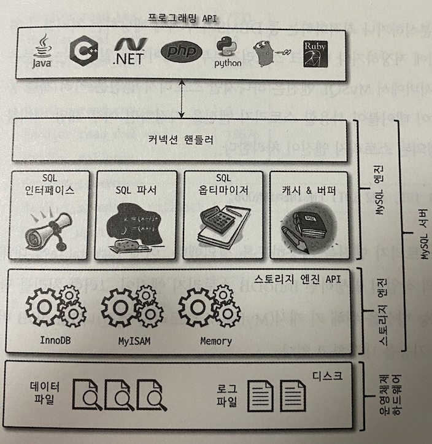
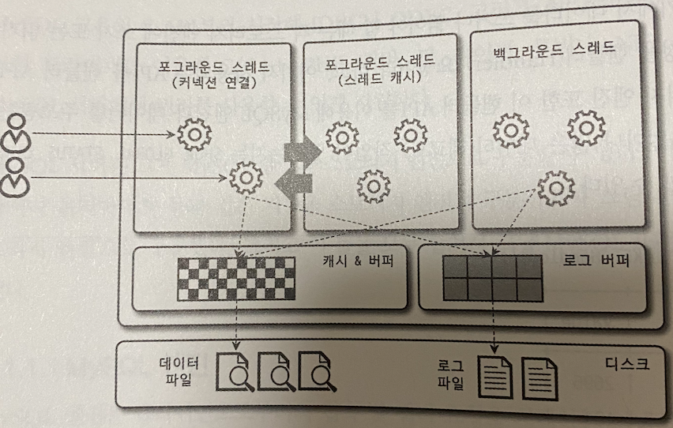
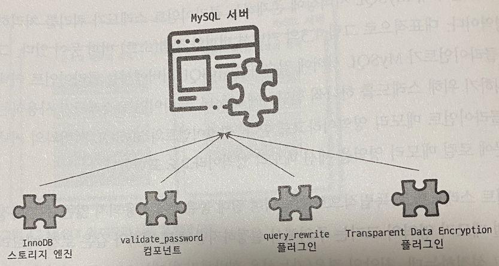
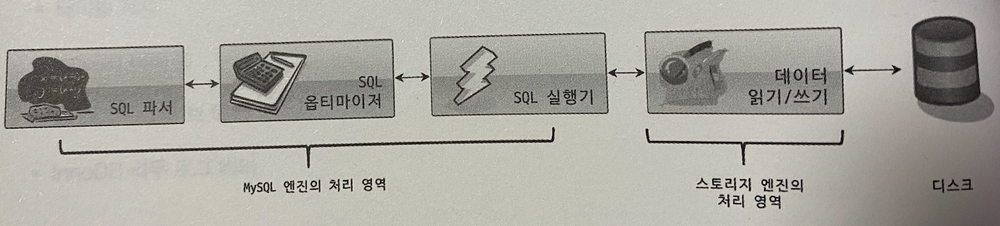
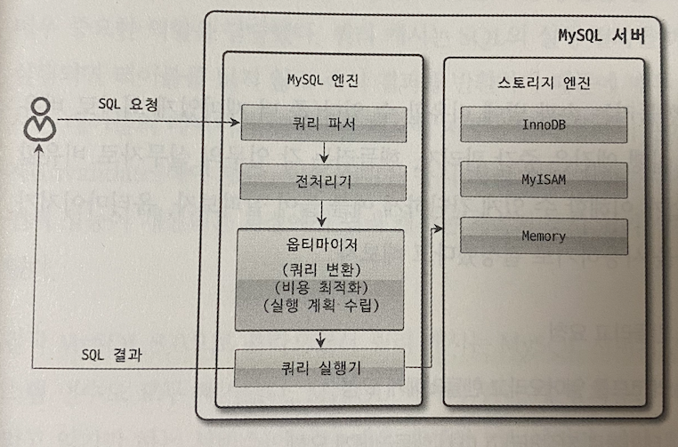
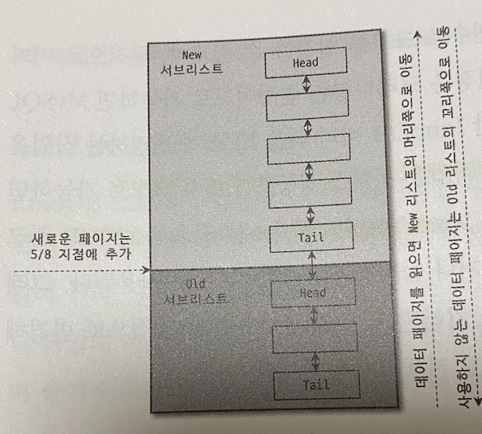
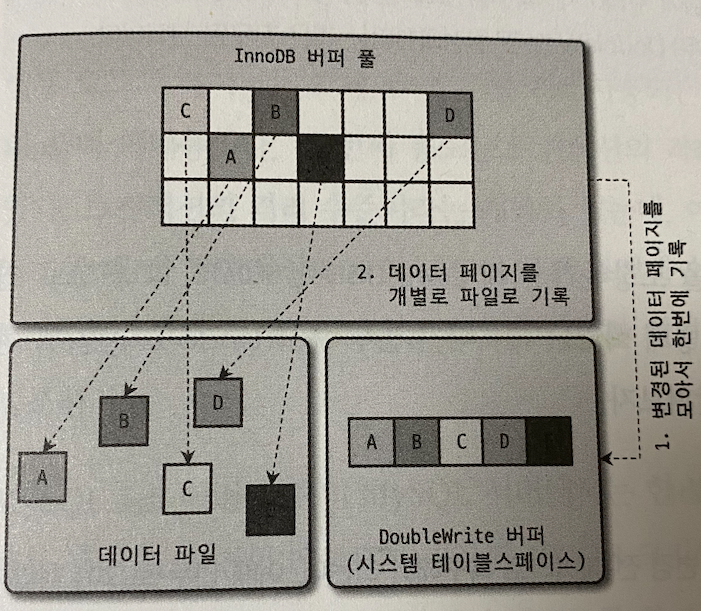
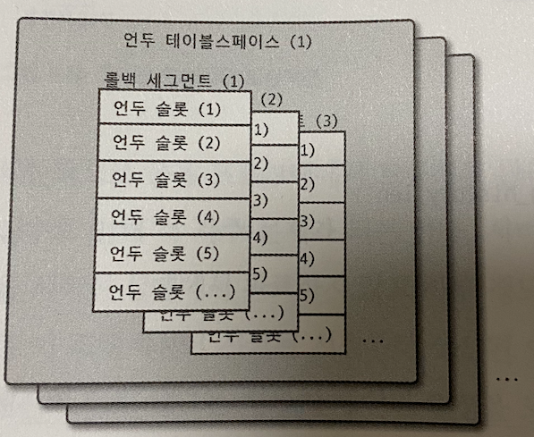
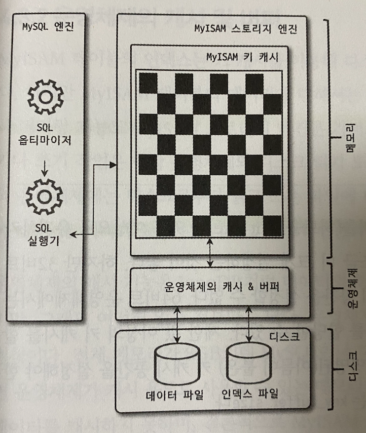

# 지옥 스터디 - 03 아키텍쳐
- MySQL 서버는 머리 역할을 하는 **MySQL 엔진** 과, 손발 을 담당하는 **스토리지 엔진** 으로 구분할 수 있다.
- 스토리지 엔진은 핸들러 API 를 만족하면 누구든 구현해 추가한 뒤 사용이 가능하다.

## MySQL 엔진 아키텍쳐
- 기본적인 MySQL 엔진 구조
- 사용자 입장에선 거의 차이가 없지만 독특한 구조 덕에 다른 DBMS 에서는 누릴 수 없는 혜택을 누리기도 한다.



- 대부분의 프로그래밍 언어로부터 접근 방법을 제공
- MySQL 엔진과 스토리지 엔진 두 가지로 구분 가능

### MySQL 엔진
- MySQL 엔진은 SQL 문장 분석, 최적화 등 DBMS 의 **두뇌** 에 해당하는 처리를 수행
- 구성요소는 다음과 같다.
  - 클라이언트 접속 및 쿼리 요청을 수행하는 **커넥션 핸들러** 
  - **SQL 파서** 및 **전 처리기**
  - 쿼리 최적화를 위한 **옵티마이저** 로 구성됨
- ANSI 표준 문법 지원

### 스토리지 엔진
- 데이터를 디스크에 저장 혹은 데이터를 읽어오는 역할을 담당
- MySQL 엔진은 하나이지만 스토리지 엔진은 **여러 개를 동시에 사용 가능**
- 특정 테이블이 사용할 스토리지 엔진을 지정하면, 해당 테이블의 읽기/쓰기 작업은 해당 스토리지 엔진이 처리하게 된다
- 각 스토리지 엔진들은 성능 향상을 위해 키 캐시나 InnoDB 버퍼 풀 과 같은 기능을 내장하고 있다

```sql
CREATE TABLE test_table(
    fd1 INT,
    fd2 INT
) ENGINE=INNODB;
```

### 핸들러 API
- MySQL 엔진 쿼리 실행기에서 **데이터를 쓰거나 읽어야 할 때** 각 스토리지 엔진에 쓰기/읽기 요청을 한다
- 이런 요청을 **핸들러 (Handler)** 요청이라 하며 이때 사용하는 API 를 핸들러 API 라고 한다
- 핸들러 API 를 통해 얼마나 많은 데이터 작업이 있었는지 확인하기 위해 `SHOW GLOBAL STATUS LIKE 'Handler%';` 로 확인 가능하다

```sql
SHOW GLOBAL STATUS LIKE 'Handler%';

+----------------------------+-------+
| Variable_name              | Value |
+----------------------------+-------+
| Handler_commit             | 1041  |
| Handler_delete             | 84    |
| Handler_discover           | 0     |
| Handler_external_lock      | 12183 |
| Handler_mrr_init           | 0     |
| Handler_prepare            | 66    |
| Handler_read_first         | 223   |
| Handler_read_key           | 7890  |
| Handler_read_last          | 0     |
| Handler_read_next          | 10883 |
| Handler_read_prev          | 0     |
| Handler_read_rnd           | 2645  |
| Handler_read_rnd_next      | 14917 |
| Handler_rollback           | 5     |
| Handler_savepoint          | 0     |
| Handler_savepoint_rollback | 0     |
| Handler_update             | 412   |
| Handler_write              | 4706  |
+----------------------------+-------+
```

### MySQL 스레드 구조



- MySQL 은 **스레드** 기반 으로 동작
- 포그라운드 (Foreground) 와 백그라운드 (Background) 스레드로 구분한다
- 실행중인 스레드 목록은 `performance_schema.threads` 테이블로 확인 가능

```sql
SELECT thread_id,
       name,
       type,
       processlist_user,
       processlist_host
FROM performance_schema.threads
ORDER BY type, thread_id;

+-----------+---------------------------------------------+------------+------------------+------------------+
| thread_id | name                                        | type       | processlist_user | processlist_host |
+-----------+---------------------------------------------+------------+------------------+------------------+
|         1 | thread/sql/main                             | BACKGROUND | NULL             | NULL             |
|         3 | thread/innodb/io_ibuf_thread                | BACKGROUND | NULL             | NULL             |
|         4 | thread/innodb/io_log_thread                 | BACKGROUND | NULL             | NULL             |
|         5 | thread/innodb/io_read_thread                | BACKGROUND | NULL             | NULL             |
|         6 | thread/innodb/io_read_thread                | BACKGROUND | NULL             | NULL             |
|         7 | thread/innodb/io_read_thread                | BACKGROUND | NULL             | NULL             |
|         8 | thread/innodb/io_read_thread                | BACKGROUND | NULL             | NULL             |
|         9 | thread/innodb/io_write_thread               | BACKGROUND | NULL             | NULL             |
|        10 | thread/innodb/io_write_thread               | BACKGROUND | NULL             | NULL             |
|        11 | thread/innodb/io_write_thread               | BACKGROUND | NULL             | NULL             |
|        12 | thread/innodb/io_write_thread               | BACKGROUND | NULL             | NULL             |
|        13 | thread/innodb/page_flush_coordinator_thread | BACKGROUND | NULL             | NULL             |
|        14 | thread/innodb/log_checkpointer_thread       | BACKGROUND | NULL             | NULL             |
|        15 | thread/innodb/log_flush_notifier_thread     | BACKGROUND | NULL             | NULL             |
|        16 | thread/innodb/log_flusher_thread            | BACKGROUND | NULL             | NULL             |
|        17 | thread/innodb/log_write_notifier_thread     | BACKGROUND | NULL             | NULL             |
|        18 | thread/innodb/log_writer_thread             | BACKGROUND | NULL             | NULL             |
|        19 | thread/innodb/srv_lock_timeout_thread       | BACKGROUND | NULL             | NULL             |
|        20 | thread/innodb/srv_error_monitor_thread      | BACKGROUND | NULL             | NULL             |
|        21 | thread/innodb/srv_monitor_thread            | BACKGROUND | NULL             | NULL             |
|        22 | thread/innodb/buf_resize_thread             | BACKGROUND | NULL             | NULL             |
|        23 | thread/innodb/srv_master_thread             | BACKGROUND | NULL             | NULL             |
|        24 | thread/innodb/dict_stats_thread             | BACKGROUND | NULL             | NULL             |
|        25 | thread/innodb/fts_optimize_thread           | BACKGROUND | NULL             | NULL             |
|        26 | thread/mysqlx/worker                        | BACKGROUND | NULL             | NULL             |
|        27 | thread/mysqlx/worker                        | BACKGROUND | NULL             | NULL             |
|        28 | thread/mysqlx/acceptor_network              | BACKGROUND | NULL             | NULL             |
|        32 | thread/innodb/buf_dump_thread               | BACKGROUND | NULL             | NULL             |
|        33 | thread/innodb/clone_gtid_thread             | BACKGROUND | NULL             | NULL             |
|        34 | thread/innodb/srv_purge_thread              | BACKGROUND | NULL             | NULL             |
|        35 | thread/innodb/srv_worker_thread             | BACKGROUND | NULL             | NULL             |
|        36 | thread/innodb/srv_worker_thread             | BACKGROUND | NULL             | NULL             |
|        37 | thread/innodb/srv_purge_thread              | BACKGROUND | NULL             | NULL             |
|        38 | thread/innodb/srv_worker_thread             | BACKGROUND | NULL             | NULL             |
|        39 | thread/innodb/srv_worker_thread             | BACKGROUND | NULL             | NULL             |
|        40 | thread/innodb/srv_worker_thread             | BACKGROUND | NULL             | NULL             |
|        41 | thread/innodb/srv_worker_thread             | BACKGROUND | NULL             | NULL             |
|        43 | thread/sql/signal_handler                   | BACKGROUND | NULL             | NULL             |
|        44 | thread/mysqlx/acceptor_network              | BACKGROUND | NULL             | NULL             |
|        42 | thread/sql/event_scheduler                  | FOREGROUND | event_scheduler  | localhost        |
|        46 | thread/sql/compress_gtid_table              | FOREGROUND | NULL             | NULL             |
|       110 | thread/sql/one_connection                   | FOREGROUND | root             | 172.17.0.1       |
|       112 | thread/sql/one_connection                   | FOREGROUND | root             | localhost        |
+-----------+---------------------------------------------+------------+------------------+------------------+
```
- `thread/sql/one_connection` 스레드만 실제 사용자 요청을 처리하는 스레드이다

> 지금 살펴본 스레드 모델은 MySQL 서버의 전통적인 스레드 모델 (커뮤니티 에디션에서 사용) <br/>
> 엔터프라이즈 에서는 스레드풀 모델을 사용할 수 있다. <br/>
> 스레드 풀 모델은 **포그라운드와 커넥션** 과의 관계가 차이가 난다.
> 전통 스레드 모델은 커넥션 별로 하나씩 생성되지만 스레드 풀은 **하나의 스레드가 여러 커넥션의 요청을 담당** 한다

### 포그라운드 스레드 (클라이언트 스레드)
- 포그라운드 스레드는 최소한 MySQL 에 **접속한 클라이언트 수 만큼 존재**
- 주로 클라이언트가 요청한 쿼리 문장을 처리한다
- 작업을 마치고 커넥션을 종료하면 해당 스레드는 **스레드 캐시 (Thread Cache)** 로 되돌아간다
- 스레드 캐시에 일정 개수의 대기 스레드가 있다면, 스레드를 소멸시켜 **일정 개수의 스레드를 유지** 한다
  - `thread_cache_size` 시스템 변수로 조절 가능
- 포그라운드 스레드는 데이터를 데이터 버퍼/캐시로부터 가져오거나 디스크/인덱스 파일로 부터 데이를 읽어와 작업을 수행한다
  - MyISAM 은 데이터 쓰기까지 포그라운드 스레드가 수행
  - InnoDB 는 데이터 버퍼/캐시 까지만 포그라운드가 처리 쓰기 작업은 백그라운드가 수행

### 백그라운드 스레드
- InnoDB 기준 다음 작업들이 백그라운드 스레드에 의해 처리된다
  - 인서트 버퍼 (Insert Buffer)를 병합
  - 로그를 디스크에 기록
  - InnoDB 버퍼 풀의 데이터를 디스크에 기록
  - 데이터를 버퍼로 읽음
  - 잠금/데드락 모니터링
- 이중 중요한 것은 **로그 와 버퍼의 데이터를 디스크에 기록하는 작업**
  - 5.5 버전 부터는 쓰기/읽기 스레드를 개 이상 지정할 수 있다
  - `innodb_write_io_threads` , `innodb_read_io_threads` 시스템 변수로 지정
- 읽기 작업은 주로 포그라운드가 처리하기 때문에 많이 설정할 필요는 없다
- 쓰기 작업은 작업량이 상당하기 때문에 내장 디스크 사용시 2 ~ 4, DAS 나 SAN 스토리지라면 최적으로 사용할 만큼 충분히 설정할것

> 쓰기 작업은 지연 처리가 가능하지만, 읽기 작업은 절대 지연될 수 없다

- 대부분 쓰기 작업을 버퍼링해서 처리하는 기능이 내장되어 있다
- InnoDB 는 버퍼링 기능을 제공하지만 **MyISAM 에서 일반적인 쿼리는 쓰기 버퍼링 기능을 사용할 수 없음**

### 메모리 할당 및 구조


- MySQL 메모리 영역은 **글로벌 메모리** 와 **로컬 메모리** 로 구분
- 글로벌 메모리는, MySQL 서버 시작시 **운영 체제로 부터 할당** 됨
  - 운영체제 종류에 따라 할당하는 방식이 다르기 때문에 정확한 메모리양 측정이 쉽지 않음
  - 단순하게 MySQL 시스템 변수 만큼 할당받는다고 생각하는게 좋다

> 글로벌 메모리와 로컬 메모리는 **스레드 공유 여부** 에 따라 구분된다

### 글로벌 메모리 영역
- 클라이언트 스레두 수와 관계없이 하나의 메모리 공간만 할당된다
  - 필요시 2개 이상의 공간을 할당받을 수도 있으나, 클라이언드 스레드 수와 무관
  - 모든 스레드가 공유하는 영역
- 대표적인 글로벌 메모리 영역은 다음과 같다
  - 테이블 캐시
  - InnoDB 버퍼 풀
  - InnoDB 어댑티브 해시 인덱스
  - InnoDB 리두 로그 버퍼

### 로컬 메모리 영역
- **세션 메모리 영역** 이라고 표현
  - 클라이언트와 커넥션을 세션이라고 하기에 세션 메모리 영역이라고도 함
- 클라이언트 스레드가 쿼리 처리를 위해 사용
- 클라이언트로 부터 요청을 처리하기 위한 영역이기에 클라이언트 메모리 영역이라고도 함
- **스레드 별로 독립적 할당** 절대 공유되선 안됨
- 각 쿼리 용도별로 필요시에만 할당된다
  - 필요하지 않은경우 할당조차 되지 않을 수 있다
  - 소트 버퍼나 조인 버퍼
- 대표적인 로컬 메모리 영역은 다음과 같다
  - 소트 버퍼
  - 조인 버퍼
  - 바이너리 로그 캐시
  - 네트워크 버퍼

### 플러그인 스토리지 엔진 모델



- MySQL 의 독특한 구조중 대표적인 것 => 플러그인 모델
- 플러그인으로 사용가능한 것은 스토리지 엔진 만이 아니다
  - 전문 검색을 위한 검색어 파서
  - 사용자 인증을 위한 것들도 모두 플러그인으로 제공
- 다른 개발회사 또는 사용자가 직접 스토리지 엔진을 개발하는 것도 가능하다

`MySQL 쿼리가 실행되는 과정`



- MySQL 쿼리 실행과정은 위와 같은데, 대부분의 작업이 MySQL 엔진에서 실행되고, 데이터 읽기/쓰기 작업만 스토리지 엔진에 의해 처리된다
- 스토리지 엔진을 만든다 => DBMS 의 일부분의 기능을 수행하는 엔진을 만든다 와 동일하다

> 데이터 읽기/쓰기 작업은 대부분 1건의 레코드 단위로 처리된다.

`MySQL Handler`
- MySQL 엔진에 스토리지 엔진을 조정하기 위해 핸들러 라는것을 사용하게 된다
  - 데이터를 읽어오거나 저장하도록 명령하려면 반드시 핸들러를 통해야 한다

- 스토리지 엔진이 다르다는 것은 **읽기/쓰기 작업에 대한 처리** 만 다를뿐 실제 쿼리를 실행하더라도 대부분 동일하다

`MySQL 지원 스토리지 엔진 목록`

```sql
mysql> show engines;
+--------------------+---------+----------------------------------------------------------------+--------------+------+------------+
| Engine             | Support | Comment                                                        | Transactions | XA   | Savepoints |
+--------------------+---------+----------------------------------------------------------------+--------------+------+------------+
| FEDERATED          | NO      | Federated MySQL storage engine                                 | NULL         | NULL | NULL       |
| MEMORY             | YES     | Hash based, stored in memory, useful for temporary tables      | NO           | NO   | NO         |
| InnoDB             | DEFAULT | Supports transactions, row-level locking, and foreign keys     | YES          | YES  | YES        |
| PERFORMANCE_SCHEMA | YES     | Performance Schema                                             | NO           | NO   | NO         |
| MyISAM             | YES     | MyISAM storage engine                                          | NO           | NO   | NO         |
| MRG_MYISAM         | YES     | Collection of identical MyISAM tables                          | NO           | NO   | NO         |
| BLACKHOLE          | YES     | /dev/null storage engine (anything you write to it disappears) | NO           | NO   | NO         |
| CSV                | YES     | CSV storage engine                                             | NO           | NO   | NO         |
| ARCHIVE            | YES     | Archive storage engine                                         | NO           | NO   | NO         |
+--------------------+---------+----------------------------------------------------------------+--------------+------+------------+
9 rows in set (0.00 sec)
```
- Support 칼럼에 표시 가능한 값
  - YES
    - MySQL 서버에 해당 엔진이 포함되어 있고, 활성화된 상태
  - DEFAULT
    - YES 와 동일하지만 필수 스토리지 엔진
  - NO
    - MySQL 서버에 포함되지 않음
  - DISABLED
    - MySQL 서버에는 포함되지만 비활성화된 상태

`MySQL 지원 플러그인 목록`

```sql
mysql> show plugins;
+---------------------------------+----------+--------------------+---------+---------+
| Name                            | Status   | Type               | Library | License |
+---------------------------------+----------+--------------------+---------+---------+
| binlog                          | ACTIVE   | STORAGE ENGINE     | NULL    | GPL     |
| mysql_native_password           | ACTIVE   | AUTHENTICATION     | NULL    | GPL     |
| sha256_password                 | ACTIVE   | AUTHENTICATION     | NULL    | GPL     |
| caching_sha2_password           | ACTIVE   | AUTHENTICATION     | NULL    | GPL     |
| sha2_cache_cleaner              | ACTIVE   | AUDIT              | NULL    | GPL     |
| CSV                             | ACTIVE   | STORAGE ENGINE     | NULL    | GPL     |
| MEMORY                          | ACTIVE   | STORAGE ENGINE     | NULL    | GPL     |
| InnoDB                          | ACTIVE   | STORAGE ENGINE     | NULL    | GPL     |
| INNODB_TRX                      | ACTIVE   | INFORMATION SCHEMA | NULL    | GPL     |
| INNODB_CMP                      | ACTIVE   | INFORMATION SCHEMA | NULL    | GPL     |
| INNODB_CMP_RESET                | ACTIVE   | INFORMATION SCHEMA | NULL    | GPL     |
| INNODB_CMPMEM                   | ACTIVE   | INFORMATION SCHEMA | NULL    | GPL     |
| INNODB_CMPMEM_RESET             | ACTIVE   | INFORMATION SCHEMA | NULL    | GPL     |
| INNODB_CMP_PER_INDEX            | ACTIVE   | INFORMATION SCHEMA | NULL    | GPL     |
| INNODB_CMP_PER_INDEX_RESET      | ACTIVE   | INFORMATION SCHEMA | NULL    | GPL     |
| INNODB_BUFFER_PAGE              | ACTIVE   | INFORMATION SCHEMA | NULL    | GPL     |
| INNODB_BUFFER_PAGE_LRU          | ACTIVE   | INFORMATION SCHEMA | NULL    | GPL     |
| INNODB_BUFFER_POOL_STATS        | ACTIVE   | INFORMATION SCHEMA | NULL    | GPL     |
| INNODB_TEMP_TABLE_INFO          | ACTIVE   | INFORMATION SCHEMA | NULL    | GPL     |
| INNODB_METRICS                  | ACTIVE   | INFORMATION SCHEMA | NULL    | GPL     |
| INNODB_FT_DEFAULT_STOPWORD      | ACTIVE   | INFORMATION SCHEMA | NULL    | GPL     |
| INNODB_FT_DELETED               | ACTIVE   | INFORMATION SCHEMA | NULL    | GPL     |
| INNODB_FT_BEING_DELETED         | ACTIVE   | INFORMATION SCHEMA | NULL    | GPL     |
| INNODB_FT_CONFIG                | ACTIVE   | INFORMATION SCHEMA | NULL    | GPL     |
| INNODB_FT_INDEX_CACHE           | ACTIVE   | INFORMATION SCHEMA | NULL    | GPL     |
| INNODB_FT_INDEX_TABLE           | ACTIVE   | INFORMATION SCHEMA | NULL    | GPL     |
| INNODB_TABLES                   | ACTIVE   | INFORMATION SCHEMA | NULL    | GPL     |
| INNODB_TABLESTATS               | ACTIVE   | INFORMATION SCHEMA | NULL    | GPL     |
| INNODB_INDEXES                  | ACTIVE   | INFORMATION SCHEMA | NULL    | GPL     |
| INNODB_TABLESPACES              | ACTIVE   | INFORMATION SCHEMA | NULL    | GPL     |
| INNODB_COLUMNS                  | ACTIVE   | INFORMATION SCHEMA | NULL    | GPL     |
| INNODB_VIRTUAL                  | ACTIVE   | INFORMATION SCHEMA | NULL    | GPL     |
| INNODB_CACHED_INDEXES           | ACTIVE   | INFORMATION SCHEMA | NULL    | GPL     |
| INNODB_SESSION_TEMP_TABLESPACES | ACTIVE   | INFORMATION SCHEMA | NULL    | GPL     |
| MyISAM                          | ACTIVE   | STORAGE ENGINE     | NULL    | GPL     |
| MRG_MYISAM                      | ACTIVE   | STORAGE ENGINE     | NULL    | GPL     |
| PERFORMANCE_SCHEMA              | ACTIVE   | STORAGE ENGINE     | NULL    | GPL     |
| TempTable                       | ACTIVE   | STORAGE ENGINE     | NULL    | GPL     |
| ARCHIVE                         | ACTIVE   | STORAGE ENGINE     | NULL    | GPL     |
| BLACKHOLE                       | ACTIVE   | STORAGE ENGINE     | NULL    | GPL     |
| FEDERATED                       | DISABLED | STORAGE ENGINE     | NULL    | GPL     |
| ngram                           | ACTIVE   | FTPARSER           | NULL    | GPL     |
| mysqlx_cache_cleaner            | ACTIVE   | AUDIT              | NULL    | GPL     |
| mysqlx                          | ACTIVE   | DAEMON             | NULL    | GPL     |
+---------------------------------+----------+--------------------+---------+---------+
```

> MySQL 은 스토리지 엔진 뿐 아닌 다양한 기능을 플러그인으로 지원한다

### 컴포넌트
- 8.0 부터 기존 플러그인 아키텍쳐를 대체하기 위한 아키텍쳐
- MySQL 플러그인은 몇 가지 단점이 존재하는데 이를 보완하기 위함
  - 플러그인은 MySQL 서버와 인터페이스 할 수 만 있으며 **플러그인 끼리 통신 불가**
  - 플러그인은 MySQL 서버의 변수나 함수를 직접 호출하기에 안전하지 않음
  - 플러그인은 의존관계 설정이 불가능해 초기화가 어려움

### 쿼리 실행 구조



- MySQL 을 **쿼리를 실행하는 관점** 에서 나눠보면 그림과 같이 구분이 가능하다

### 쿼리 파서
- 사용자 요청으로 들어온 **쿼리 문장을 토큰화** 한다
  - 토큰 : MySQL 이 다루는 최소 단위의 어휘나 기호를 의미
  - 토큰화 : 토큰으로 분리해 트리 형태 구조로 만들어내는 작업

> 쿼리 문장의 기본 문법 오류는 이 단계에서 발견됨

### 전 처리기
- 파서 트리를 기반으로 **쿼리 문장에 구조적 문제점을 확인**
- 객체의 존재여부, 접근 권한등을 확인하는 과정이 수행됨

### 옵티마이저
- 쿼리 문장을 **저렴한 비용** 으로 처리할 방법을 결정
  - DBMS 의 두뇌에 해당
- 옵티마이저의 역할은 중요하고, 영향 범위 또한 매우 넓기 때문에 반드시 기억해야 함

### 실행 엔진
- 옵티마이저가 두뇌라면, 실행 엔진과 핸들러는 손과 발이다
- 옵티마이저가 경영진, 실행 엔진은 중간 관리자, 핸들러는 실무자에 비유할 수 있다

`GROUP BY 처리 과정 의 예시`
- 실행 엔진은 핸들러에게 임시 테이블을 만들라 요청
- 실행 엔진은 WHERE 절에 일치하는 레코드를 읽으라 핸들러에게 요청
- 읽어온 레코드들을 임시 테이블로 저장하라고 핸들러에게 요청
- 데이터가 준비된 임시 테이블에서 필요한 방식으로 데이터를 읽으라 핸들러에게 요청
- 최종적으로 실행 엔진은 결과를 사용자 또는 다른 모듈에게 전달

> 실행 엔진은, 계획대로 각 핸들러에게 요청해 받은 결과를 또 다른 핸들러의 요청 으로 연결하는 역할을 수행

### 핸들러 (스토리지 엔진)
- MySQL 서버의 가장 밑단에서, 실행 엔진의 요청에 따라 데이터를 읽고/쓰는 역할을 수행한다
- 핸들러 -> 스토리지 엔진을 의미
- InnoDB 테이블을 조작한다면 핸들러 -> InnoDB 스토리지 엔진

### 복제
- MySQL 에서 복제 (Replication) 은 매우 중요한 역할
- 기본적ㅇ니 복제 아키텍쳐는 16장에서 살펴봄

### 쿼리 캐시
- 쿼리 캐시는 빠른 응답을 필요로 하는 애플리케이션에서 매우 중요한 역할을 수행 했었다
- SQL 실행 결과를 메모리에 캐시해, 동일 쿼리가 실행되면 즉시 결과를 반환해 성능이 좋음
- 반면에 쿼리 캐시는, 테이블의 **데이터가 변경되면 캐시에 저장된 결과중 관련된 것을 모두 만료 시켜야함**
  - 때문에 심각한 **동시 처리 성능 저하** 를 유발
  - 이는 많은 버그의 원인이 되기도함
- 8.0 부터 쿼리 캐시는 완전히 제거되었다

### 스레드 풀
- 엔터프라이즈 에디션에서만 제공하는 기능
- 대신 **Percona Server 에서 제공하는 기능** 을 살펴봄
- Percona Server 의 스레드풀은 플러그인으로 동작한다
  - 엔터프라이즈는 내장되어 있음
- 스레드 풀의 목적
  - MySQL 서버의 CPU 가 **제한된 개수의 스레드 처리에만 집중 하도록 해 서버 자원 소모를 줄이는 것**

> 스레드 풀이 실제 서비스에서 눈에 띄는 성능 향상을 보이는 경우는 드물다 <br/>
> 오히려 스레드 스케쥴링 때문에 더 느려지는 사례도 발생한다

- Percona 는 기본적으로 **CPU 코어의 갯수 만큼 스레드 그룹을 생성**
  - `thread_pool_size` 시스템 변수로 조정
  - 일반적으로 코어 갯수와 맞추는 것이 좋음
- 스레드 풀의 갯수 보다 많은 요청이 들어온다면 `thread_pool_oversubscribe` 시스템 변수의 값 만큼 추가로 더 받아 처맇나다
  - 해당 값이 너무 크다면, 스케쥴링 할 스레드가 많아져 비효율적일 수 있다
- 스레드 그룹의 스레드가 모두 작업중이라면, 새로운 스레들르 추가할지, 대기할지 판단한다
- 스레드 풀의 **타이머 스레드** 가 주기적으로 스레드 그룹의 상태를 체크함
  - `thread_pool_stall_limit` 시스템 변수의 밀리초 만큼 대기하다가 새로운 스레드를 생성해 추가한다
  - thread_pool_stall_limit 만큼 대기하기 때문에 **응답 시간에 민감한 서비스** 라면 적절히 낮춰 사용해야함
  - 0에 가까운 값으로 설정하는 것은 권장하지 않음, 차라리 스레드풀을 사용하지 않는 것이 낫다
- **전체 스레드 개수는, `thread_pool_max_threads` 시스템 변수의 값을 넘을 수 없다**
- Percona 의 스레드 풀은 **선 순위 큐** 와 **후 순위 큐** 를 이용해 특정 트랜잭션/쿼리를 우선적으로 처리하도록 기능을 제공
  - 이를 통해 기존에 시작된 트랜잭션의 SQL 을 빨리 수행해 **락 타임을 줄여 전체적인 성능이 향상됨**

### 트랜잭션 지원 메타데이터
- 테이블 구조 정보와 스토어드 프로그램 등의 정보 => 데이터 딕셔너리/메타데이터 라고함
- 5.7 버전까지는 테이블 구조를 **FRM 파일** 로 저장하고, 스토어드 프로그램 또한 파일 기반 (TRN, TRG, PAR...)으로 관리했다
  - 파일 기반의 한계인 트랜잭션을 지원하지 않기 때문에 비정상 종료등 이슈 발생시 테이블이 꺠지는 현상이 발생
- 8.0 부터는 관련 정보를 모두 **InnoDB 테이블에 저장** 하도록 변경됨
- 시스템 테이블과 데이터 딕셔너리 정보를 모두 모아 mysql DB 에 저장하고, mysql.ibd 테이블 스페이스에 저장된다
  - 시스템 테이블 : 서버 동작시 기본적으로 필요한 테이블
    - 인증/권한 등..

> 데이터 딕셔너리를 저장하는 테이블은 볼 수 없다. (임의로 수정하지 못하게 하기 위함) <br/>
> 대신 조회가 가능하도록 뷰를 통해 제공한다.

- InnoDB 이외의 스토리지 엔진은 **SDI (Serialized Dictionary Information)** 파일을 사용한다 (기존 FRM 파일과 동일한 역할)

## InnoDB 스토리지 엔진 아키텍쳐


- MySQL 에서 사용 가능한 스토리지 엔진 중 가장 많이 사용되고, 유일하게 **레코드 기반 잠금** 을 제공한다
- 높은 동시성 처리가 가능하고 안정적이며 성능 또한 뛰어남

### 프라이머리 키에 의한 클러스터링
- InnoDB 의 **모든 테이블은 프라이머리 키를 기준으로 클러스터링 되 저장됨**
- 모든 세컨더리 인덱스는 레코드 주소 대신 **프라이머리 키의 주소를 논리 주소로 사용** 한다
  - 프라이머리키 -> 클러스터링 인덱스 이기 때문에 프라이머리 키를 이용한 레인지 스캔은 상당히 빠르다
  - 때문에 기본적으로 PK 가 옵티마이저 실행 계획에서 높은 비중을 갖도록 설정된다
- MyISAM 엔진은 클러스터링 키를 지원하지 않기 때문에 PK 와 세컨더리 인덱스는 구조적으로 차이가 없다
- MyISAM 의 PK 를 포함한 모든 인덱스는 물리적인 레코드 주소 (ROWID) 를 가진다

### 외래키 지원
- InnoDB 엔진에서만 지원하는 기능
- 외래키는 서비스시 에는 설정을 잘 하지 않는 경우가 많다
  - 변경시 데이터 락이 전파되어 데드락이 발생하는 경우가 많음
- `foreign_key_checks` 시스템 변수를 OFF 로 지정하면 외래 키 관계에 대한 체크를 일시적으로 중단할 수 있다
  - 때문에 데이터 마이그레이션을 한다거나, 보정 작업시 좀 더 편리함

```sql
SET foreign_key_checks=OFF;
SET foreign_key_checks=ON;
```
- 작업 완료후 다시 활성화 하기전 일관성을 맞춰주어야 한다
- 위 옵션이 비활성화 되면 `CASCADE` 관련 작업도 무시하게 됨

> `foreign_key_checks` 는 GLOBAL/SESSION 모두 설정이 가능하다. <br/>
> 기본적으로 SESSION 변수로써 동작함

`외래키를 사용하지 않는 이유`
- 요구사항이 변경되어 Table 을 변경해야 한다면 ?
- 전체 테이블에 락이 잡힘
- 예전 버전에서는 테이블을 새롭게 생성해 데이터를 복사하고, 정상 완료 처리되면 기존 테이블을 대체하는 방식으로 동작했다
- 5.6 부터는 InnoDB 에서 **Online DDL** 기능이 추가되었다
  - https://jsonobject.tistory.com/515

`Online DDL`
- 5.6 버전부터 추가 된 기능
- 각 버전별 지원 범위가 다르므로 메뉴얼 참조 필요 
- InnoDB 에서 지원하는 OnlineDDL 알고리즘
  - COPY
  - INPLACE
  - INSTANT (8.0)
- **COPY**
  - 변경된 스키마가 적용된 **임시 테이블** 을 생성, 기존 테이블 데이터 복사 후 이름을 변경하는 방식
  - ALGORITHM 구문을 사용하지 않는다면 INPLACE > COPY 순으로 처리한다
  - DDL 작업 일시중지, 작업 중 I/O, CPU 사용 제한 없음
  - 작업중 롤백이 발생할 수 있으며 많은 비용이 소모됨
  - ALTER 수행 동안 Concurrent DML (inserts, updates, deletes) 차단
  - 복제 지연 발생 가능성 존재
- **INPLACE**
  - 원본 테이블에 직접 변경작업을 적용
  - 작업 준비, 실행 단계에서 테이블에 대한 베타적 메타데이터 잠금이 일시적으로 수행될 수 있음
  - 일반적으로 Concurrent DML 지원
  - 지원하지 않는 DML 구문이 있따
  - 테이블 수정하는 동안 변경된 데이터 양이 `innodb_online_alter_log_max_size` 를 초과한다면 online ddl 은 실패하고 변경된 데이터를 롤백됨
  - 장기간 실행되는 작업은 슬레이브에 복제 지연 유발
  - 동시성 높은 서버의 테이블에 대해 높은 I/O 유발
- **INSTANT**
  - 8.0 에 추가됨
  - 메타 정보만 수정하여 변경사항 반영
  - 메타 데이터 잠금을 획득하지 않고 테이블의 데이터 파일도 건드리지 않음
  - ALGORITHM 구문 미사용시 INSTANT > INPLACE > COPY 순으로 처리
  - 컬럼 추가시 테이블 마지막 열로만 추가 가능 (위치 지정 불가)
  - ROW_FORMAT=COMPRESSED 에는 컬럼 추가 불가
  - FULLTEXT 인덱스를 포함하는 테이블은 컬럼 추가 불가
  - 임시 테이블 컬럼 추가 불가
    - COPY 만 지원
  - 데이터 딕셔너리 테이블 스페이스에 있는 테이블에는 컬럼 추가 불가

### MVCC (Multi Version Concurrency Control)
- 레코드 레벨의 트랜잭션을 지원하는 DBMS 가 제공하는 기능
- **락을 사용하지 않는 일관된 읽기** 를 제공하는 것이 가장 큰 목적
- InnoDB 는 **언두 로그 (Undo Log)** 를 통해 이를 구현
  - 하나의 레코드에 대해 여러 개의 버전이 동시에 관리됨
- 격리 레벨이 READ_UNCOMMITTED 인 경우 버퍼 풀이나 데이터 파일로 부터 **변경되지 않은 데이터를 읽어 반환**
- READ_COMMITTED 이상의 레벨이라면 커밋 되지 않은 경우 **언두 영역의 데이터를 읽어 반환**
- 이를 MVCC 라고 표현함

> 동시에 진행되는 트랜잭션의 수에 따라 버전은 무수히 많아질 수 있다. <br/>
> 트랜잭션이 길어질 수록 언두의 데이터가 오랫동안 관리되어야 한다 <br/>
> 커밋이후 바로 삭제된다고 이해해선 안된다. 해당 데이터를 참조하는 트랜잭션이 있다면 지속적으로 존재하게 됨

### 잠금 없는 읽관된 읽기 (Non-Locking)
- InnoDB 는 MVCC 를 이용해 락을 걸지 않고 읽기 작업을 수행함
- 변경되기 전의 데이터를 읽기 위해 언두 로그를 활용
- 긴 트랜잭션 때문에 서버가 느려지거나 문제가 되는 경우가 간간히 발생하는데, 이는 **언두 로그를 삭제하지 못해 발생하는 문제**

> 트랜잭션 타임을 최대한 짧게 가져가는 것이 핵심

### 자동 데드락 감지
- InnoDB 는 내부적으로 데드락을 체크하기 위해 락 대기 목록을 **그래프 (Wait-For List)** 형태로 관리
- 데드락 감지 스레드를 가지고 있어 주기적으로 잠금 대기 그래프를 검사해 그 중 하나를 강제 종료한다
  - 강제 종료 기준 : 언두 로그의 양
  - **언두 로그 양이 적을수록 강제 종료 대상** 이 됨
    - 롤백 처리 부하가 적다
- MySQL 엔진에서 관리되는 테이블 잠금은 볼 수 없어 데드락 감지가 불확실할 수 있다
  - `innodb_table_locks` 시스템 변수 활성화 시 감지 가능
- 동시처리 스레드가 많거나 트랜잭션이 가지는 락의 갯수가 많아지면 데드락 감지 스레드가 느려짐
  - 데드락 감지 스레드는 잠금 목록을 검사할때 락을 걸고 찾게 된다
  - 데드락 감지 스레드가 느려지면서 서비스에 악영향을 미칠 수 있다
  - 동시 처리 스레드가 많을수록 CPU 자원을 더 많이 소모할 수 있따
- `innodb_deadlock_detect` 시스템 변수를 OFF 로 설정하면 데드락 감지 스레드를 사용하지 않음
  - 이를 사용하지 않으면 데드락이 발생해도 무한정 대기하게 도ㅚㄴ다
- `innodb_lock_wait_timeout` 시스템 변수를 활성화 하면 일정 시간이 지나면 자동으로 실패하게 된다
  - detect 옵션을 비활성화 환다면 wait_timeout 을 50초 보다 낮은 시간으로 사용할 것을 권장

> PK 혹은 세컨더리 인덱스 기반으로 매우 높은 동시성 처리를 한다면 `innodb_deadlock_detect` 를 활용해 성능 비교 권장

### 자동화된 장애 복구
- 장애로부터 데이터를 보호하기 위한 여러 메커니즘이 탑재되어 있음
- MySQL 서버가 시작될 때 완료되지 못한 트랜잭션이나 디스크에 일부만 기록된 (Partial Write) 데이터 페이지 에 대한 복구 작업이 자동을오 진행됨
  - 데이터 파일 손상, MySQL 서버 시작 불가 와 같은 경우는 거의 발생하지 않음
  - 하드웨어 이슈로 인해 자동복구를 못하는 경우는 존재할 수 있다
  - 복구하지 못한다면 MySQL 서버는 종료되어 버림
- 이 때는 `innodb_force_recovery` 시스템 변수를 설정해 MySQL 서버를 시작해야 한다
  - 로그파일 손상시 6 으로 설정
  - 테이블의 데이터 파일 손상시 1로 설정
  - 문제 파악이 안된다면 1 ~ 6 까지 변경하며 재시작 해야함

> InnoDB 테이블이 인식된다면 mysqldump 로 백업 후 다시 생성하는 것이 좋음

`innodb_force_recovery 적용 가능한 옵션`
- 1 (SRV_FORCE_IGNORE_CORRUPT)
  - 테이블스페이스의 데이터나 인덱스 페이지의 손상된 부분이 발견되도 무시하고 시작한다
  - `Database page corruption on disk or a failed` 메세지 출력이 대부분 이경우에 해당
  - mysqldump/SELECT INTO OUTFILE... 로 다시 구축하는 경우가 좋음
- 2 (SRV_FORCE_NO_BACKGROUND)
  - 백그라운드 메인 스레드를 시작하지 않고 시작
  - 언두 데이터를 삭제하는 과정에서 장애가 발생한 경우 이 경우에 해당
- 3 (SRV_FORCE_NO_TRX_UNDO)
  - 커밋되지 않고 종료된 트랜잭션은 그대로 유지하는 상태로 시작
  - mysqldump 로 다시 구축하는것이 좋음
- 4 (SRV_FORCE_NO_IBUF_MERGE)
  - 인서트 버퍼의 손상 감지시 MySQL 시작 불가능
  - 인서트 버퍼의 내용을 무시하고 시작하게 됨
  - 인덱스 관련 내용이기에 tabledump 후 재구축 하는 것이 좋음
- 5 (SRV_FORCE_NO_UNDO_LOG_SCAN)
  - 언두로그 사용 불가능 한경우 사용
  - 언두로그를 무시하고 MySQL 를 시작함
  - 장애시점 커밋되지 않은 작업도 모두 커밋된 것으로 처리된다
  - mysqldump 로 백업 후 새로 구축해야함
- 6 (SRV_FORCE_NO_LOG_REDO)
  - 리두 로그 손상시 MySQL 서버 시작 불가능
  - 리두로그를 무시하고 MySQL 을 시작함
  - mysqldump 를 이용해 백업해 재구축 하는 것이 좋음

### InnoDB 버퍼 풀
- 스토리지 엔진의 가장 핵심
- 디스크의 **데이터 파일/인덱스 정보를 메모리에 캐시하는 공간**
- 쓰기 작업을 지연 시켜 일괄 처리를 위한 버퍼역할도 수행

#### 버퍼 풀 크기 설정
- 일반적으로 전체 물리 메모리 80% 르 잡으라는 게시물도 있지만 단순하게 설정해선 안되는 값
- 운영체제와 각 클라이언트 스레드의 메모리를 충분히 고려해 설정해야 함
- MySQL 서버내에서 메모리를 필요로하는 부분은 크게 없지만 **독특한 케이스에 레코드 버퍼가 상당힌 메모리를 사용**
- 레코드 버퍼는 각 클라이언트 **세션에서 테이블 레코드를 읽고 쓸때 사용하는 버퍼**
  - 커넥션이 많고 사용 테이블도 많다면 버퍼로 사용하는 메모리가 꽤 많이 필요하다
  - 레코드 버퍼 공간은 별도 설정 불가능
  - 전체 커넥션개수/커넥션에서 읽고 쓰는 테이블 개수에 따라 결정됨

> 이 공간은 동적 해제 되기도 하므로 정확히 필요한 메모리 공간의 크기를 계산 할 수 없다

- 5.7 부터는 버퍼 풀 크기를 동적으로 조절할 수 있다
  - 작은 값으로 설정해 서서히 늘려가는 것이 좋음
  - 전체 메모리가 8G 미만이라면 50% 정도만 설정
  - 그 이상이라면 50% 에서 시작해 서서히 늘린느 것이 좋음
- `innodb_buffer_pool_size` 시스템 변수로 설정 가능
  - 늘리는 것은 영항이 적지만, **줄이는 것은 영향이 매우 크다**
  - 내부적으로 **128MB 청크 단위** 로 쪼개어 관리된다
  - 버퍼 풀은 전체 관리 잠금 (세마포어) 로 락 경합을 유발해 왔다
  - 이를 줄이기 위해 청크 단위로 쪼개어 관리할 수 있게 개선됨
- `innodb_buffer_pool_instances` 시스템 변수로 버퍼 풀을 여러개 분리해 관리할 수 있음
  - 각 버퍼풀은 버퍼풀 인스턴스 라고 표현
  - 기본적으로 8개로 초기화 됨
  - 전체 버퍼풀의 메모리가 1G 미만일 경우 풀 인스턴스는 1개만 생성됨

> 버퍼풀 메모리가 40G 미만이라면 기본값 8 을 유지, 메모리가 크다면 인스턴스당 5G 로 설정하는 것이 좋음

#### 버퍼 풀 구조
- 스토리지 엔진은 버퍼 풀이라는 공간을 페이지 크기 (`innodb_page_size` 시스템 변수) 의 조각으로 쪼개 해당 페이지를 읽어 각 조각에 저장한다
- 버퍼 풀 페이지 크기 조각을 관리하기 위해 **LRU 리스트** 와 **플러시 리스트** **프리 리스트** 의 3개 자료구조를 사용

`프리 리스트`
- 버퍼 풀에서 실제 사용자 데이터로 채워지지않은 비어있는 페이지
- 사용자 쿼리가 새롭게 디스크의 페이지를 읽어야 할 경우 사용

`LRU 리스트`



- 엄밀히 말하면 LRU/MRU 의 결합된 형태
- 디스크로 읽어온 페이지를 최대한 오랫동안 유지해 디스크 엑세스 최소화가 목적

`스토리지 엔진이 데이터를 찾는 과정`
- 레코드가 저장된페이지가 버퍼 풀에 있는지 확인
  - InnoDB 어댑티브 해시 인덱스로 페이지검색
  - 해당 테이블 인덱스로 버퍼 풀에서 페이지 검색
  - 버퍼 풀이 데이터 페이지가 있다면 해당 페이지의 포인터를 MRU 로 승급
- 디스크에 필요한 페이지를 버퍼 풀에 적재, 적재된 페이지의 포인터를 LRU 헤더에 추가
- LRU 헤더에 적제된 데이터가 실제로 읽히면 MRU 헤더로 이동
- 버퍼풀에 상주하는 페이지는 사용자가 **얼마나 최근에 접근한지에 따라 나이가 부여됨**
  - 오랫동안 사용되지 않으면 나이가 오래되고 해당 페이지는 버퍼풀에서 제거됨
  - 쿼리에 의해 사용되면 나이가 초기화되고 MRU 헤더로 옮겨짐
- 자주 접근된다면 해당 페이지의 인덱스 키를 어댑티드 해시 인덱스에 추가

`플러시 리스트`
- **디스크로 동기화 되지 않은 데이터를 가진 페이지 (더티 페이지)** 의 목록
- 데이터 변경시 InnoDB 는 리두 로그에 기록, 버퍼풀의 데이터 페이지에도 이를 반영

> 리두 로그가 디스크에 기록되었다 해서 데이터 페이지가 디스크로 기록된 것을 항상 보장하지 않음 <br/>
> 때문에 체크포인트를 만들어 둘의 상태를 동기화 한다

### 버퍼 풀과 리두 로그
- 버퍼풀과 리두로그는 매우 밀접환 관계를 가지고 있다
- 버퍼 풀은, 서버 메모리 허용만큼 크게 설정할 수록 쿼리 성능이 좋아진다
- 이는 데이터 캐시와 쓰기 버퍼링 이라는 두 가지 용도가 있다
  - 메모리 공간만 늘리면 데이터 캐시 기능만 향상됨
- 버퍼 풀은 디스크로 부터 읽은 후 **변경되지 않은 페이지 (클린 페이지)** 와 **변경된 데이터를 가진 페이지 (더티 페이지)** 를 함께 가지고 있다
- 더티 페이지는 버퍼 풀에 무한정 머무를 수 없다
- 리두 로그 파일의 로그 엔트리는 계속 **순환되어 재사용 된다**
  - 새로운 로그 엔트리로 덮어 쓰임
  - 때문에 재사용 가능한 공간, 당장 재사용 불가능한 공간을 구분할 필요가 있음
  - 재사용 불가능한 공간 : 활성 리두 로그 (Active Redo Log)
- 매번 기록시 마다 로그포지션 값은 계속 증가 된다.
  - 이를 LSN (Log Sequence Number) 라고 함
  - 주기적으로 체크포인트 이벤트를 발생시켜 리두 로그와 버퍼풀의 더티 페이지를 디스크에 동기화 한다
- 최근 체크 포인트의 LSN 과 마지막 리두 로그 엔트리 LSN 의 차이를 **체크 포인트 에이지 (CheckPoint Age)** 라고 한다
  - 이는 활성 리두 공간의 크기

> 버퍼 풀 크기가 100G 미만이라면 리두 로그 파일을 5 ~ 10 G 로 설정하고 조금씩 늘려가면 최적화 하는 것이 좋음

### 리두 로그
- DB 장애시 복구에 사용되는 로그

> 버퍼 풀크기 100G 라고 해서 리두 로그가 100G 일 필요는 없다. <br/>
> 리두 로그는 변경 분만 가지고 있고, 버퍼 풀은 통째로 가지고 있기에 훨씬 작은 공간만 가지면 됨

### 버퍼 풀 플러시 (Buffer Pool Flush)
- 5.6 까지는 더티 페이지 플러시 기능이 부드럽게 처리되지 않았음
- 디스크 기록 폭증하고 쿼리 성능에 영향을 주는 경우가 많았다
- 5.7 을 지나 8.0 부터는 대부분의 경우 성능 문제는 발생하지 않음
- 버퍼 풀에서 디스크에 기록되지 않은 더티 페이지를 성능 영향 없이 동기화 하기 위해 **백그라운드로 플러시 기능을 수행함**
  - 플러시 리스트 플러시
  - LRU 리스트 플러시

### 플러시 리스트 플러시
- 리두 로그 공간 재활용을 위해 주기적으로 오래된 리두 로그 엔트리를 비워야 함
- 이를 위해 반드시 버퍼 풀 더티 페이지가 디스크로 먼저 동기화 되어야함
- 주기적으로 플러시 리스트의 플러시 함수를 호출해 **오래전 데이터 페이지 순서대로 디스크에 동기화** 한다

> 언제부터 얼마나 많은 더티 페이지를 한 번에 디스크로 기록하냐에 따라 성능 이슈가 존재함

- 이를 위한 다양한 시스템 변수들을 제공한다
  - innodb_page_cleaners
  - innodb_max_dirty_pages_pct_lwm
  - innodb_max_dirty_pages_pct
  - innodb_io_capacity
  - innodb_io_capacity_max
  - innodb_flush_neighbors
  - innodb_adaptive_flushing
  - innodb_adaptive_flushing_lwm

`innodb_page_cleaners`
- 더티 페이지를 디스크에 동기화 하는 스레드를 **클리너 스레드 (Cleaner Thread)** 라고 함
- 클리너 스레드를 조정할 수 있는 시스템 변수
- 스토리지 엔진은 여러 버퍼 풀 인스턴스를 사용할 수 있다
- innodb_page_cleaners 값이 버퍼 풀 인스턴스 보다 많다면 `innodb_buffer_pool_instances` 값으로 자동 변경됨
  - 값보다 적은 경우 하나의 클리너 스레드가 여러 버퍼 풀 인스턴스를 처리
  
> 하나의 클리너 스레드가 하나의 버퍼 풀 인스턴스를 처리하도록 자동으로 맞춰줌 <br/>
> 가능하면 버퍼 풀 인스턴스와 동일하게 설정

`innodb_max_dirty_pages_pct`
- 스토리지 엔진은 전체 버퍼풀의 90% 까지 더티 페이지를 가질 수 있다
- `innodb_max_dirty_pages_pct` 시스템 변수로 이를 조정할 수 있다
- 더티 페이지가 많을 수록 디스크 엑세스 횟수를 줄일 수 있다
- 때문에 가능하면 기본값을 유지하는 것이 좋다

`innodb_io_capacity`
- `innodb_io_capcity` 시스템 변수의 값을 기준으로 더티페이지 쓰기를 실행함

`innodb_io_max_dirty_page_pct_lwm`
- 더티페이지 비율이 90% 를 넘어가면 급작스럽게 디스크 쓰기 폭증 현상이 발생한다
- 이를 완화 하기 위해 `innodb_io_max_dirty_page_pct_lwm` 시스템 변수로 일정 수준의 더티 페이지 발생시 조금씩 디스크로 기록하게 한다
- 기본값은 10% 
- 더티페이지 비율이 낮은데 쓰기가 많이 발생하고, 더티 페이지 비율이 낮은 상태로 유지된다면 이를 높은 값으로 조정 하는 것이 좋다

`innodb_io_capacity/innodb_io_capacity_max`
- 각 데이터베이스 서버에서 어느정도 디스크 읽기/쓰기 가 가능한지 설정하는 값
- `innodb_io_capacity` 는 일반적인 상황에서 디스크가 적절히 처리할 수 있는 수준의 값
- `innodb_io_capacity_max` 는 최대 성능을 발휘 했을때 처리할 수 있는 수준의 값
- 여기서의 작업은 백그라운드 스레드가 수행하는 디스크 작업
- 디스크 성능이 1000 IOPS 가 가능하다고 해서 이 값을 그대로 설정 해선 안된다
  - 쿼리를 처리하기 위해 읽기 작업도 수행해야 하기 때문

> 위 값을 1000으로 설정한다고 해서 초당 1000 번의 디스크 쓰기를 보장하지는 않는다. <br/>
> 내부 알고리즘으로 인해 설정된 값들을 기준으로 쓰기 작업을 수행함

`innodb_adaptive_flushing/innodb_adaptive_flushing_lwm`
- 일일히 트래픽을 보면서 위 값들을 설정하는 것은 쉽지 않다
- 때문에 InnoDB 는 **어댑티브 플러시 (Adaptive Flush)** 기능을 제공
- `innodb_adaptive_flushing` 시스템 변수로 활성화 가능
- 기본적으로 활성화 되어 있다
- 이를 활성화 화면 위 설정값들을 참조하지 않고 새로운 알고리즘을 사용함
- 더티페이지 생성속도 == 리두로그 생성 속도
- 때문에 어댑티프 플러시 알고리즘은 리두로그 증가 속도를 분석해 디스크 쓰기를 실행함
  - 적정 수준의 비율이 유지되도록 함
- `innodb_adaptive_flushing_lwm` 는 기본값이 10%
- 전체 리두 로그 중 활성 리두가 10% 미만이면 어댑티브 플러시가 동작하지 않다가 이를 넘어서면 동작한다

`innodb_flush_neighbors`
- `innodb_flush_neighbors` 는 더티 페이지 기록시 디스크에 근접한 페이지에 더티페이지가 있다면 함께 기록하는 기능 활성 여부
- HDD 이 경우 디스크 엑세스가 매우 고비용이기에 이를 위한 옵션
- SSD 는 기본값인 비활성 모드로 유지하는 것이 좋다

### LRU 리스트 플러시
- LRU 리스트에서 사용 빈도가 낮은 페이지를 제거해 공간을 확보해야 한다
- 이를 위해 LRU 리스트 의 플러시 함수를 사용함
- LRU 리스트 끝부터 `innodb_lru_scan_depth` 변수의 설정 갯수 만큼 페이지를 스캔함
  - 더티 페이지는 디스크에 동기화
  - 클린 페이지는 즉시 프리 리스트로 이동
- 버퍼풀 인스턴스 별로 `innodb_lru_scan_depth` 만큼 스캔한다
- 때문에 실질적으로 `innodb_buffer_poo_instances` * `innodb_lru_scan_depth` 만큼 수행하게 됨

### 버퍼 풀 상태 백업 및 복구
- InnoDB 버퍼 풀은 **쿼리 성능** 에 매우 밀접하게 관련이 있다
- 쿼리 요청이 빈번한 서버를 셧다운 후 재시작 하면 평소 보다 떨어지는 것이 대부분일 것이다
  - 버퍼 풀에 데이터가 준비되지 않았기 때문
- 디스크의 데이터가 버퍼 풀에 적제된 상태를 **워밍 업 (Warming Up)** 이라고 표현한다
  - 버퍼 풀이 잘 워밍업 된 상태라면 몇십 배의 쿼리 속도를 보이는 것이 일반적
- 5.5 버전 까지는 셧다운 후 재시작 하면 서비스 오픈 전 주요 쿼리를 강제로 워밍업 하고 서비스를 오픈했었다
- 5.6 버전 부터는 **버퍼 풀 덤프 및 적재 기능** 이 도웁 되었다
  - 셧다운 전 `innodb_buffer_pool_dump_now` 시스템 변수로 현재 버퍼 풀 상태를 백업 가능
  - 재시작 후 `innodb_buffer_pool_load_now` 시스템 변수로 다시 복구 가능
  - 백업 파일은 데이터 디렉터리의 ib_buffer_pool 이라는 파일로 생성됨
    - 이는 메타 정보만 백업하기에 백업은 매우 빨리 수행됨
    - 하지만 복구 과정은 버퍼 풀의 크기에 따라 오래걸릴 수 있다
  - 버퍼 풀 로드 작업 이 너무 오래 걸려 중단하고자 하면 `innodb_buffer_pool_load_abort` 시스템 변수를 사용
- 이 과정을 매번 수동으로 하는 것은 매우 번거로운 일
  - 이를 자동화 하기 위한 옵션 `innodb_buffer_pool_dump_at_shutdown` `innodb_buffer_pool_load_at_startup` 을 설정 파일에 지정하면 됨

```sql
// 버퍼 풀 백업
SET GLOBAL innodb_buffer_pool_dump_now=ON;
// 버퍼 풀 로드
SET GLOBAL innodb_buffer_pool_load_now=ON;
// 버퍼 풀 복구 상태 확인
SHOW STATUS LIKE 'Innodb_buffer_pool_dump_status'
// 버퍼 풀 로드 중단
SET GLOBAL innodb_buffer_pool_load_abort=ON;
```

> 버퍼 풀 백업을 반드시 셧다운 직전에 할 필요는 없다. <br/>
> 백업된 버퍼 풀을 로드한느 과정에서 데이터 페이지 목록중 실제 존재하지 않는 페이지라면 무시하기 때문에 무관

### 버퍼 풀 적재 내용 확인
- 5.6 버전부터 information_schema.innodb_buffer_page 테이블을 이용해 확인이 가능하다
  - 하지만 버퍼 풀이 큰 경우 조회가 큰 부하가 있어 사실상 거의 사용이 불가능 했다
- 8.0 부터는 이를 해결하기 위해 innodb_cached_indexes 테이블이 추가됨
  - 이는 테이블의 인덱스 별로 데이터 페이지가 얼마나 버퍼 풀에 적재되었는지 알 수 있다

### Double Writer Buffer
- 리두 로그는 리두 공간 낭비를 막기 위해 **변경된 내용** 만 기록한다
- 때문에 더티 페이지를 디스크로 플러시 할 때 일부만 기록되는 문제가 발생하면 복구할 수 없을 수도 있다
- 이런 현상을 **파셜 페이지 (Partial-Page)** 또는 **톤 페이지 (Torn-Page)** 라고 한다
  - 하드웨어 문제 또는 비정상 종료 등으로 발생이 가능
- InnoDB 에선 이를 막기 위해 Double-Write 기법을 활용 한다



- Double Write 기법은 실제 데이터 파일에 변경 내용을 기록하기 전, 더티 페이지를 묶어 디스크 쓰기로 시스템 테이블 스페이스의 Double Write Buffer 에 기록한다
- 그리고 각 더티 페이지를 적당한 위치에 쓰기를 실행
- Double Write Buffer 에 기록된 데이터는 파일 쓰기가 실패한 경우에만 사용됨
- 위 기능의 사용 여부는 `innodb_doublewrite` 시스템 변수로 설정 가능
- Double Write Buffer 는 **데이터 안정성** 을 위해 자주 사용되나, HDD 의 경우에는 별 부담이 없다
- 하지만 SSD 의 경우 랜덤 IO/순차 IO 비용이 비슷한 경우 부담이 됨
  - 데이터 무결성이 중요하다면 활성화 하는 것이 좋음
- 만약 성능을 위해 리두 로그 동기화 설정 `innodb_flush_log_at_trx_commit` 을 1이 아닌 값으로 설정했다면 이 또한 비활성화 하는 것이 좋다

> 리두 로그는 동기화 하지 않으면서 Double Write Buffer 는 활성화 한다는 것은 잘못된 설정

### 언두 로그
- 트랜잭션과 격리 레벨을 보장하기 위해 DML (INSERT, UPDATE, DELETE) 로 변경되기 이전 데이터를 별도로 관리한다
- 이를 언두 로그 하고 함
- 언두 로그가 어떻게 사용되는지 간단히 살펴보면 다음과 같다
  - 트랜잭션 보장
    - 트랜잭션 롤백시 언두 로그에 남아 있는 데이터를 이용해 복구
  - 격리 레벨 보장
    - 트랜잭션 격리 레벨에 맞춰 변경중인 레코드를 읽지 않고 언두 로그에 백업해 둔 데이터를 읽어 반환함
    
> 언두 로그는 InnoDB 에서 매우 중요한 역할을 담당하지만 관리 비용도 많이 필요하다

### 언두 로그 레코드 모니터링
- INSERT, UPDATE, DELETE 같은 문장으로 데이터를 변경 했을 때, 변경이전의 데이터를 보관하는 장소이다
- 언두 로그의 데이터는 크게 두가지 용도로 사용 된다
  - 트랜잭션 롤백 대비
  - 격리 수준을 유지하면서 높은 동시성 제공
- 5.5 이전버전 에서는 한 번 증가한 언두 로그 공간은 다시 줄어들지 않는 문제가 있었다
- 대용량 데이터 처리 뿐만 아니라 롱 트랜잭션 일 경우 언두 로그의 양은 급격히 증가할 수 있다
  - 트랜잭션이 완료된다고 해서 바로 삭제 가능한 것이 아님
- 5.7, 8.0 부터 언두로그의 공간 문제는 완전히 해결됨
  - 8.0 에서는 언두 로그를 돌아가며 순차적으로 사용해 디스크 공간을 줄이는 것도 가능함
  - MySQL 서버가 필요한 시점에 사용 공간을 자동으로 줄이기도 함
- 하지만 여전히 트랜잭션이 장시간 유지되는 것은 성능상 좋지 않다
- 때문에 지속적인 모니터링이 필요하다

```sql
SHOW ENGINE INNODB STATUS
```

### 언두 테이블 스페이스 관리
- 언두 로그가 저장되는 공간 = 언두 테이블 스페이스 (Undo Tablespace)
- 5.6 이전 까지는 언두 로그가 모두 시스템 테이블 스페이스에 저장됨 (ibdata.idb)
  - 시스템 테이블 스페이스는 서버 초기화기 생성되기 때문에 확장의 한계가 존재
- 5.6 부터 `innodb_undo_tablespaces` 시스템 변수가 도입됨
  - 2 보다 큰 값 설정시 별도의 언두 로그 파일을 사용함
  - 8.0 부터 2 그 이하는 0 이 기본
- 8.0 부터 언두 로그는 항상 별도 로그파일에 기록되도록 변경



- 언두 테이블스페이스는 1개 이상 128개 이하의 롤백 세그먼트를 가진다
- 롤백 세그먼트는 1개 이상의 언두 슬롯을 가진다
- 롤백 세그먼트는 InnoDB **페이지 크기를 16 바이트로 나눈 값의 갯수 만큼 언두 슬롯** 을 가진다
  - 페이지 크기가 16KB 라면 1024 개의 언두 슬롯을 갖게 됨
- 한 트랜잭션이 필요한 언두 슬롯의 갯수는 실행 문장의 특성에 따라 최대 4개의 슬롯을 사용하게 됨
  - 일반적으로 임시 테이블을 사용하지 않으므로 대략 2개의 슬롯을 필요로 한다
- 최대 동시에 처리 가능한 트랜잭션 수는 다음 수식으로 예측 가능

```text
최대 동시 트랜잭션수 = (Innodb 페이지 크기) / 16 * (롤백 세그먼트 개수) * (언두 테이블스페이스 개수)
```

- 가장 일반적인 InnoDB 기본 설정에서는 대략 20097152 개 정도 트랜잭션이 동시 처리가 가능하다
  - `innodb_undo_tablespaces=2` `innodb_rollback_segments=128`
- 일반적으로 기본 값으로 크게 문제가 없으므로 기본값을 유지 하자

> 언두 로그 공간이 남는건 문제가 안되지만 언두 **로그 슬롯이 부족하면 트랜잭션을 시작할 수 없다**

- 8.0 이전 까지는 생성된 언두 로그는 변경되지 않았지만 8.0 부터는 새로운 언두 테이블스페이스를 동적으로 추가 가능하다
  - CREATE UNDO TABLESPACE
  - DROP UNDO TABLESPACE
- 언두 테이블 스페이스의 공간을 필요한 만큼만 남기고, 불필요한 공간을 운영체제로 반납하는 과정 = Undo tablespace truncate
  - 자동/수정 두 가지방법이 존재
  - 8.0 부터 지원
- 자동 모드
  - 데이터 변경시 이전 버전의 데이터가 언두로그로 기록됨
  - 트랜잭션 커밋이후 언두로그의 값은 불필요해 진다
  - InnoDB 의 **퍼지 스레드 (Purge Thread)** 가 주기적으로 이를 삭제하는데 **언두 퍼지 (Undo Purge)** 라고함
  - `innodb_undo_log_truncate` 시스템 변수로 설정 가능
  - 해당 작업의 빈도를 조절하려면 `innodb_purge_rseg_truncate_frenquency` 시스템 변수 값 조절
- 수동 모드
  - 자동모드로 실행하지 않거나 테이블스페이스 공간 반납이 부진한 경우 언두 테이블페이스를 비활성화 해 더이상 사용하지 않도록 설정하면
  - 퍼지 스레드는 비활성화된 언두 테이블스페이스를 찾아 불필요한 자원을 운영체제로 반납한다
  - 반납 완료 후 다시 활성화 하는데 수동모드는 언두 테이블스펭시ㅡ가 최소 3개는 되어야 동작한다

### 체인지 버퍼
- RDBMS 는 INSERT/UPDATE 외에 **테이블의 인덱스** 를 업데이트 하는 작업도 필요하다
  - 이는 랜덤 엑세스 작업이 많아 인덱스가 많다면 비용이 상당함
- 때문에 변경할 인덱스 페이지가 버퍼 풀에 있다면 바로 업데이트를 수행
- 아니면 디스크로 읽어와 **임시 공간에 저장해 두고 이를 사용자에게 반환하는 형태로 성능을 향상** 시킴
  - 이 임시 메모리 공간이 체인지 버퍼
  - 유니크 인덱스는 체인지 버퍼를 사용할 수 없음
- 체인지 버퍼에 임시 저장된 인덱스 레코드는 백그라운드 스레드에 의해 병합
  - 이를 체인지 버퍼 머지 스레드 라고함
- 5.5 이전 버전까지는 INSERT 작업에 대해서만 버퍼링이 가능
  - 8.0부터는 INSERT, UPDATE, DELETE 모두 가능하다
- 5.5 이전 버전까지는 기본적으로 활성화됨
  - 이후 부터 `innodb_change_buffering` 시스템 변수로 활성화
  - all : 모든 인덱스 관련 작업 버퍼링
  - none : 버퍼링 하지 않음
  - inserts : 추가 작업만 버퍼링
  - deletes : 삭제 작업만 버퍼링
  - changes : 추가/삭제 작업만 버퍼링
  - purges : 인덱스 영구 삭제 작업만 버퍼링

> 기본적으로 InnoDB 버퍼풀의 25% 까지 사용, 필요시 50% 까지 설정 가능 `innodb_change_buffer_max_size`

### 리두 로그와 로그 버퍼
- 리두 로그는 장애 상황 발생시 복구하기 위한 용도로 사용된다
  - 대부분의 데이터베이스 서버는 **데이터 변경시 로그로 먼저 기록 (WAL 로그 라고도함, Write AHead Log)**
- **모든 DBMS 의 데이터 파일은 읽기 성능을 고려한 자료구조로 구현되어 있다**
- 이로 인한 성능 저하를 막기 위해 쓰기에 비용이 낮은 리두 로그를 가지고 있음
- MySQL 비정상 종료시 데이터 파일은 두 가지 종류의 일관되지 않은 데이터를 가질 수 있음
  - 커밋 됬지만 데이터 파일에 기록되지 않은 데이터
    - 리두 로그로 해결이 가능함
    - 리두 로그에 저장된 데이터를 데이터 파일에 다시 복사
  - 롤백 됬지만 데이터 파일에 기록된 데이터
    - 리두 로그로 해결 불가
    - 언두 로그 내용을 가져와 데이터 파일에 복사해야함
    - 커밋/롤백/실행 도중 상태인지 알기 위해 리두로그도 필요
- 리두 로그는 **트랜잭션 커밋시 즉시 기록되도록 설정 하는 것을 권장**
  - 장애직전 시점까지 복구가 가능해짐
  - 이는 부하가 많은 작업이기에 `innodb_flush_log_at_trx_commit` 시스템 변수로 주기 설정 가능
- 리두 로그의 버퍼링에 사용되는 것 = 로그 버퍼
  - 로그 버퍼 크기는 기본 값인 16MB 수준에서 설정 하는 것이 좋음
  - BLOG/TEXT 와 같이 큰 데이터를 자주 변경한다면 더 크게 잡는 것이 좋음
- 리두 로그는 비정상 종료시 트랜잭션 복구를 위해 항상 활성화 되어있다
  - 항상 디스크로 기록됨
  - 8.0 부터 활성/비활성화 가능

### 어댑티브 해시 인덱스
- InnoDB 에서 사용자가 자주 요청하는 데이터에 대해 자동으로 생성하는 인덱스
  - `innodb_daptive_hash_index` 시스템 변수로 설정 가능
- B-Tree 인덱스의 검색 시간을 줄이기 위해 도입된 기능
- 자주 읽히는 데이터 페이지의 키 값을 이용해 해시 인덱스를 만듦
  - 인덱스 키값과 인덱스 키값이 저장된 데이터 페이지의 주소의 쌍
- 어댑티브 해시 인덱스 는 반드시 하나씩만 존재한다
- 모든 B-Tree 인덱스에 대한 어댑티브 해시 인덱스가 하나의 해시 인덱스에 저장됨
- 버퍼 풀에 존재하는데이터 페이지에 대해서만 관리됨
- 8.0 이전까지는 경합이 상당히 심했고, 8.0 이후부터 파티션 기능을 제공
  - 기본값은 8
- 어댑티브 해시 인덱스를 의도적으로 비활성화 하는 경우도 많다
  - 디스크 읽기가 많거나, 특정 패턴의 쿼리가 많고 (조인 또는 LIKE) 매우 큰 데이터를 가진 테이블을 폭 넓게 읽는 경우 성능에 크게 도움이 안됨
  - 디스크 읽기가 많지 않고, eq 검색이 많고, 일부 데이터에 집중되는 경우 성능이 크게 향상된다

> 어댑티브 해시 인덱스는 버퍼풀 내에서 접근을 빠르게 하는 것이 주 목적

- 데이터 삭제시에도 성능에 영향을 미치기 때문에 잘 고려해서 선택해야 함
  - 서비스 패턴에 잘 드러맞는지.. 불필요한 오버헤드만 만드는 것은 아닌가..
- 기본적으로 활성화 되어 있음

### InnoDB MyISAM MEMORY 스토리지 엔진
- 5.5 이전까지는 MyISAM 이 기본 엔진
- 5.5 이후부터는 InnoDB 가 기본 엔진이지만 시스템 테이블은 MyISAM 을 사용
- 8.0부터는 모든 시스템 테이블이 InnoDB 로 변경됨
- 5.7버전 까지 MEMORY 는 내부 임시 테이블 용도로 사용되었다
- 8.0 부터 TempTable 엔진이 이를 대체
  - `internal_temp_mem_storage_engine` 시스템 변수로 설정 가능

## MyISAM 스토리지 엔진 아키텍쳐



### 키 캐시
- InnoDB 버퍼 풀과 비슷한 역할을 수행한다
- MyISAM 키캐시는, **인덱스를 대상으로만 동작** 하고 인덱스의 **디스크 쓰기 작업에 대해 부분적으로 버퍼링 역할** 을 한다

`키 캐시 히트율 수식`

```text
키 캐시 히트율 (Hit rate) = 100 - (Key_reads / Key_read_requests * 100)
```
- Key_reads : 인덱스를 디스크에서 읽은 횟수
- Key_read_requests : 키 캐시로 부터 인덱스를 읽은 횟수
- 일반적으로 키 캐시를 이용한 쿼리 히트율을 99% 이상으로 유지 하는 것을 권장
  - 99% 미만이라면 키 캐시를 조금 더 크게 잡을 것
  - 32 비트 운영체제에서는 4G 이상 설정 불가
  - 64 비트 운영체제는 OS_PER_PROCESS_LIMIT 의 크기만큼 할당 가능

### 운영체제의 캐시 및 버퍼
- MyISAM 테이블의 데이터는 디스크 I/O 에 대한 캐시나 버퍼 기능을 제공하지 않는다
- 운영체제의 캐시 기능을 활용함
- MyISAM 이 주로 사용되는 서버는 키 캐시가 최대 **물리메모리의 40% 가 넘지 않게 설정** 하고 나머지는 파일 시스템 캐시로 활용되도록 하는 것이 좋다

### 데이터 파일과 PK 구조
- MyISAM 테이블의 레코드는 PK 값과 무관하게 INSERT 순서대로 데이터 파일에 저장된다
- 저장되는 레코드 모두 ROWID 라는 주솟값을 가진다
- 이는 가변길이/고정길이 두 가지 방법으로 저장될 수 있다

## MySQL 로그 파일

### 에러 로그 파일
- 실행 도중 발생하는 에러나 경고 메세지가 출력된다
- my.cnf 설정파일에서 `log_error` 에 정의된 경로에 생성된다
  - .err 확장자 파일

### 제너럴 쿼리 로그 파일
- 제너럴 쿼리 로그는 MySQL 이 쿼리 요청을 받으면 바로 기록된다
- 쿼리 실행 중 에러가 발생해도 로그 파일에 기록된다

### 슬로 쿼리 로그
- 슬로 쿼리 로그는 `long_query_time` 시스템 변수에 설정된 시간보다 느릴 경우 모두 기록됨
- 또한 반드시 정상적으로 실행 완료되어야 기록된다
- `log_output` 옵션으로 파일/테이블 기록 여부 설정이 가능하다
  - slow_log/general_log 테이블은 CSV 스토리지엔진을 사용하기에 파일 저장과 동일하게 동작함
  
> MyISAM/MEMORY 엔진은 테이블 단위의 잠금을 사용하고, MVCC 를 지원하지 않아 SELECT 쿼리도 1초 이상 락타임이 걸릴 수 있음

## 참고

- https://dev.mysql.com/doc/refman/5.6/en/innodb-online-ddl.html
- https://dev.mysql.com/doc/refman/5.7/en/innodb-online-ddl.html
- https://dev.mysql.com/doc/refman/8.0/en/innodb-online-ddl.html
- https://iamwhat.tistory.com/entry/online-ddl-%EC%95%8C%EA%B3%A0%EB%A6%AC%EC%A6%98