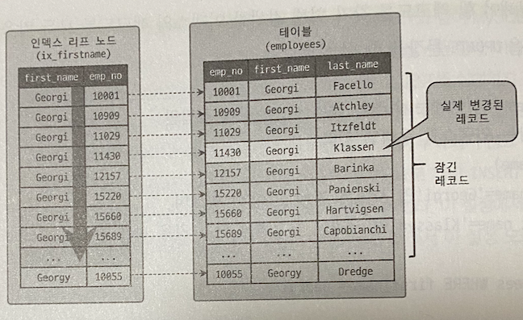
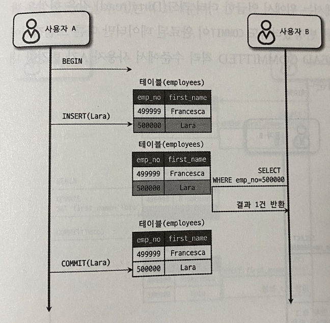
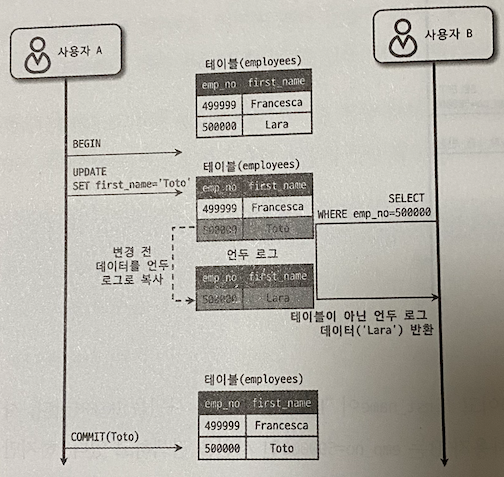
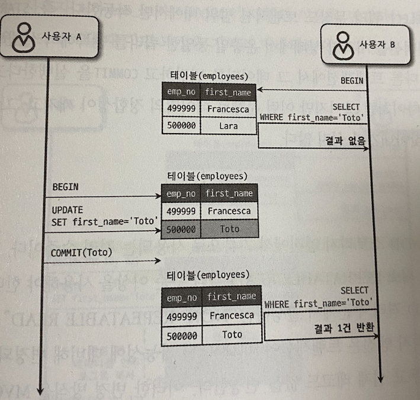
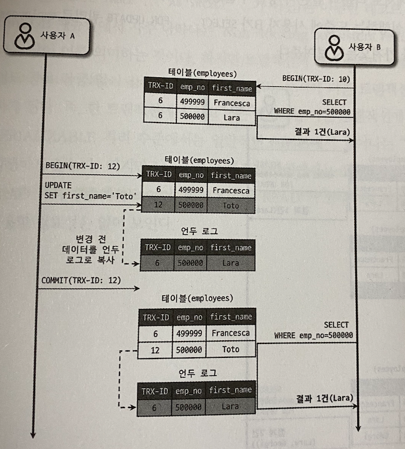
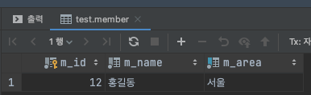
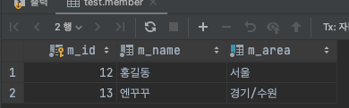

# 지옥 스터디 - 04 트랜잭션과 잠금
- 잠금과 트랜잭션은 비슷한 개념 같아 보인다
- 하지만 이는 명백히 다른 목적을 위한 것
  - 잠금은 동시성을 제어가 목적
  - 트랜잭션의 데이터 정합성을 보장하는 것이 목적

## 트랜잭션

### MySQL 의 트랜잭션
- MyISAM 은 트랜잭션을 지원하지 않지만, InnoDB 는 트랜잭션을 지원한다
  - 스토리지 엔진 레벨에서 지원
- 트랜잭션을 지원하지 않을 경우 **부분 업데이트 (Partial Update)** 가 발생할 수 있기 때문에
- 애플리케이션 코드 레벨에서 **보상 트랜잭션 (Compensating Transaction)** 을 직접 구현해야 하는 번거로움이 있다
  - 이로 인해 코드 복잡도도 증가하고, 핵심 트랜잭션 로직을 보기가 어렵다
- 트랜잭션은 애플리케이션 개발에서 고민해야할 문제를 줄여주는 필수적인 DBMS 기능

### 트랜잭션 사용시 주의사항
- 트랜잭션은 **반드시 필요한 최소한의 코드** 에만 적용하는 것이 좋다
  - 최근에 이와 비슷한 사례가 있었음
- 작업시간이 얼마 걸리지 않는다고 해서 통으로 트랜잭션으로 묶어버리는 경우가 많다
  - 이는 매우 잘못된 생각
- 서비스 장애는 **평시에 발생하지 않는다** 대부분 **트래픽이 치솟을때** 발생함
- 평시에는 문제가 없더라도, 1ms 하나하나가 쌓여 **장애 포인트** 가 될 수 있다는 생각을 가져야 한다

> 커넥션 고갈로 인한 장애 상황이 발생할 수 있음을 늘 인지해야 함

## MySQL 엔진의 잠금
- MySQL 의 락은 **스토리지 엔진** 과 **MySQL 엔진** 레벨 두 가지로 분류할 수 있다
  - MySQL 엔진 레벨은 스토리지 엔진 을 제외한 모든 부분 이라 생각하면 됨
- MySQL 엔진 레벨의 락은 **모든 스토리지 엔진** 에 영향을 미친다
- 스토리지 엔진 레벨의 락은 **스토리지 엔진 간의 영향을 미치지 않음**

### 글로벌 락
- 글로벌 락 (Global Lock) 은 `FLUSH TABLE WITH READ LOCK` 명령으로 획득 가능
  - MySQL 에서 제공하는 락 중 범위가 가장 크다
- 특정 세션에서 **글로벌 락을 획득하면, 다른 세션에서 SELECT 를 제외한 대분의 DDL/DML 실행시 해당 락이 해제될 때 까지 대기해야 한다**
- 글로벌 락은 MySQL 서버 전체에 영향을 미침
  - 대상 테이블/데이터베이스가 다르더라도 동일함
- MyISAM/MEMORY 테이블 덤프시 글로벌 락을 사용해야 함

`FLUSH TABLE WITH READ LOCK`
- FLUSH TABLE WITH READ LOCK 은 실행과 동시에 **MySQL 의 모든 테이블에 락을 건다**
- 해당 명령 실행전 Write 에 대한 락이 실행 되었다면, 해당 작업이 완료되기까지 대기해야함
- 또한 테이블에 읽기 잠금을 걸기 전 테이블을 플러시 해야 하기 때문에 해당 테이블에 대한 모든 실행 쿼리가 완료되어야 한다
  - 때문에 심각한 경우 모든 테이블에 대한 INSERT UPDATE DELETE 쿼리가 실행되지 못하는 상태가 될 수 있음

`BACKUP LOCK`
- 8.0 부터는 InnoDB 가 기본 스토리지 엔진으로 채택 되며 Xtrabackup/Enterprise Backup 과 같은 툴들을 위한 백업락이 도입되었다

```sql
LOCK INSTANCE FOR BACKUP;
UNLOCK INSTANCE;
```
- 특정 세션에서 백업 락을 획득시, 모든 세션에서 테이블 스키마나 사용자 인증 정보를 변경할 수 없다
  - 데이터베이스 및 테이블 등 모든 객체 생성 및 변경 삭제 불가
  - REPAIR TABLE / OPTIMISE TABLE 명령 불가
  - 사용자 관리 및 비밀번호 변경 불가
- 하지만 **일반적인 테이블의 데이터 변경은 허용** 한다
- 레플리카 구성시, 주로 **레플리카 서버 에서 실행**
  - 글로벌 락 획득시 그만큼 복제 시간은 지연됨
- 6 ~ 7시간 동안 백업 진행 도중 DDL 문장 하나로 인해 시간이 날아갈 수도 있다.
  - 이를 위해 백업 락이 존재함

> MySQL 백업 락은 정상적으로 복제는 실행 되지만, 백업 실패를 막기 위해 DDL 명령 실행시 복제를 일시 중지하는 역할을 수행

### 테이블 락
- 테이블 락 (Table LOck) 은 **테이블 단위** 로 설정되는 락이며, 명시적/묵시적 으로 획득이 가능하다
  - `LOCK TABLES table_name [READ | WRITE]`
  - `UNLOCK TABLES ..`
  - 특별한 상황이 아니면 애플리케이션 에서 거의 사용하지 않음
- MyISAM/InnoDB 모두 동일하게 설정 가능
- 묵시적 락은 MyISAM/MEMORY 테이블에 데이터 변경 쿼리 실행시 발생 한다
  - 쿼리 실행 동안 자동으로 획득 했따가 쿼리 완료시 자동 해제
- InnoDB 의 경우, 레코드 기반의 잠금을 지원하기 때문에 단순 데이터 변경으로 인한 묵시적 테이블락은 발생하지 않음
  - 스키마 변경 (DDL) 에만 발생

### 네임드 락
- `GET_LOCK()` 함수로 **임의의 문자열** 에 대한 락 설정이 가능하다
  - 락의 대상이 테이블이나 레코드와 같은 데이터베이스 객체가 아니다
- 자주 사용되지는 않는다
- DB 1대 WAS 5 대 인 경우 특정 정보 동기화시 활용 하는 정도 이다
  - 이 또한 다른 대안이 많음

```sql
## mylock 이라는 문자열에 대한 락을 획득 (2초까지만 대기)
SELECT GET_LOCK('mylock', 2);
## mylock 이라는 문자열에 대한 락 확인
SELECT IS_FREE_LOCK('mylock');
## mylock 이라는 문자열에 대한 락 해제
SELECT RELEASE_LOCK('mylock');
```

> 정상적으로 수행되었다면 1을 반환하며 아니라면 NULL/0 을 반환한다

- MySQL 8.0 부터는 네임드 락을 중첩해서 사용할 수 있으며, 한번에 모두 해제도 가능하다

```sql
SELECT GET_LOCK('mylock_1', 10);
SELECT GET_LOCK('mylock_2', 10);

SELECT RELEASE_LOCK('mylock_2');
SELECT RELEASE_LOCK('mylock_1');

SELECT RELEASE_ALL_LOCK();
```

### 메타데이터 락
- 메타데이터 락 (Metadata Lock) 은 데이터베이스 객체의 이름/구조 변경시 획득하는 락
  - 테이블/뷰
- 명시적으로 획득하거나 해제할 수 없다 (묵시적)
- `RENAME_TABLE` 의 경우 A 와 B 에 대하 한번에 락을 설정한다
  - A : 원본
  - B : 변경될 이름

## InnoDB 스토리지 엔진 잠금
- InnoDB 스토리지 엔진은 **레코드 기반 락** 을 제공한다
  - 때문에 MyISAM 에 비해 뛰어난 동시성 처리를 제공
- 예전 버전에서는 락에 대한 정보를 보기가 힘들 었다
- 최신 버전에서는 `information_schama` 데이터베이스에 존재하는 테이블들을 활용해 락에 대한 정보를 획득할 수 있다
  - INNODB_TRX
  - INNODB_LOCKS
  - INNODB_LOCK_WAITS
- `Performance Schema` 를 이용한 내부 잠금에 대한 모니터링도 추가됨

### InnoDB 스토리지 엔진의 잠금


- 레코드 기반의 락을 제공하며, **상당히 작은 공간 으로 관리** 되기 때문에 락 에스컬레이션이 발생하지 않는다
  - 레코드락 > 페이지락 > 테이블락 으로 레벨업 되는 경우가 없다
- 다른 DBMS 와는 다르게 레코드와 레코드 사이를 잠그는 **갭 락** 이 존재한다 

### 레코드 락
- **레코드 자체 만을 잠그는 것** 을 레코드 락 이라고 한다
- 다른 DBMS 와의 차이는 MySQL 은 **인덱스의 레코드** 에 대해 동작한다
  - 인덱스가 없더라도, 자동생성된 클러스터 인덱스를 사용함
- **PK 또는 유니크 인덱스에 대한 변경 작업** 에서는 레코드 락 을 사용한다

### 갭 락
- **레코드와 바로 인접한 레코드 사이의 간격을 잠그는 것** 을 갭 락 이라고 한다
- 레코드와 레코드 사이에 새로운 레코드가 생성되는 것을 막는 역할
  - 넥스트 키 락의 일부로 자주 사용됨

### 넥스트 키 락
- **레코드 락과 갭 락을 합친 형태** 의 락을 넥스트 키 락 이라고 한다
  - 바이너리 로그에 기록되는 쿼리가 레플리카에 복제될 때 동일한 결과를 만들도록 보장하는 것이 목적
- STATEMENT 바이너리 로그를 사용한다면 REPEATABLE READ 격리 레벨을 사용해야 한다
- 넥스트 키락/갭 락으로 인한 데드락이나 성능저하가 빈번하다는 점을 유의

### 자동 증가 락
- AUTO-INCREMENT 컬럼이 사용된 테이블에 대해 순서를 보장하기 위해 AUTO_INCREMENT 락 을 제공한다
  - 테이블 레벨의 락
- 새로운 레코드를 저장하는 쿼리 에서만 사용된다
- 트랜잭션과 관계 없이 AUTO_INCREMENT 값을 가져오는 순간에만 락이 걸렸다 해제된다
- 명시적으로 획득/해제 하는 방법 없음
- 5.1 버전 부터는 `innodb_autoinc_lock_mode` 시스템 변수로 동작 방식 변경이 가능하다

`innodb_autoinc_lock_mode`
- innodb_autoinc_lock_mode=0
  - MySQL 5.0 까지 동일한 방식
  - 모든 INSERT 문장이 락을 사용
- innodb_autoinc_lock_mode=1
  - 단순 1건 또는 여러건 INSERT 시 MySQL 서버가 레코드 건수를 정확히 캐치할 수 있다면 락을 사용하지 않고 뮤텍스를 사용함 (래치)
  - 레코드 건수를 캐치할 수 없다면 5.0 과 동일한 락을 사용한다
    - 이 경우 INSERT 문장 완료시 까지 락이 해제 되지 않는다
  - 대량 INSERT 의 경우 한 번에 할당 받아 사용함
  - 단 실패 할 경우 해당 값 만큼 누락되는 문제도 발생한다
- innodb_autoinc_lock_mode=2
  - 뮤텍스 (래치) 만을 사용한다
  - 동시성 처리 성능은 높아진다
  - 하지만 STATEMENT 기반 레플리케이션 사용시 해당 값이 일치한다는 보장이 없음

> 8.0 버전 부터 기본값은 0 이므로 레플리케이션 설정에 따라 옵션을 조절해야 함

`알아두면 좋은 내용..`
- MySQL 은 `REPEATABLE READ` 를 주로 사용해야 함
- 왜 ?
  - 일반적으로 Replication Mode 는 STATEMENT 기반으로 사용
  - 흔히 알고 있는 SQL 문장 복제 방식
- READ-COMMITTED 의 경우 ROW-BASED 만 지원한다
  - 레플리카 간에 트래픽이 많이 발생하고 문제 발생시 분석이 어려움
- UNDO 영역으로 인한 I/O 오버 헤드는 사실상 미미한 수준이다
  - LOCK TIME 으로 인한 오버 헤드가 더 중요

### 인덱스와 잠금
- InnoDB 의 락은 **인덱스를 잠그는 방식**
- **변경할 레코드를 찾기 위해 검색한 인덱스의 레코드에 모두 락** 을 건다
- 이해를 돕기 위해 아래 예시를 살펴보자

```sql
employees {
    id,
    first_name,
    last_name
    KEY ix_firstname
}
// employees 테이블에는 `first_name` 에만 인덱스가 걸려있음
UPDATE employees SET ... WHERE first_name = 'Georgi' AND last_name = 'asdf'
```
- 위 UPDATE 문 실행시 1 건의 레코드가 업데이트 된다
- WHERE 절에서 사용가능한 인덱스는 `first_name` 뿐이고 `last_name` 은 인덱스가 존재하지 않는다
- 따라서 `first_name = 'Georgi` 에 해당하는 레코드가 모두 락이 걸린다
  - 1,000건 이라면 1,000건이 모두 락이 걸림



- 위 그림처럼 MySQL 은 `실제 UPDATE 되는 레코드와 락이 잡히는 레코드가 다르다`
- 만약 인덱스가 하나도 존재하지 않는다면, **테이블 풀 스캔이 발생해 모든 데이터가 락** 이 걸림

### 레코드 레벨 잠금 확인 및 해제
- InnoDB 엔진을 사용하는 테이블의 레코드 레벨 락은 테이블 레벨 락 보다 복잡함
- 레코드 레벨의 락은 **테이블의 레코드 각각에 잡혀** 오랫동인 락이 걸려있어도 발견되지 않는 경우도 존재함
- 5.1 버전 부터 레코드 레벨 락과 락 대기에 에 대한 조회가 가능해짐
  - 각 트랜잭션이 어떤 락을 대기하고 있는지 확인 가능
  - information_schema.INNODB_TRX
  - information_schema.INNODB_LOCKS
  - information_schema.INNODB_LOCK_WAITS
- 8.0 버전 부터는 조금 변경됨
  - performance_schema.data_locks
  - performance_schema.data_lock_waits
- KILL 명령어를 통해 해당 프로세스를 킬하면 강제로 락이 종료된다

`락 조회 QUERY`

```sql
SELECT r.trx_id              waiting_trx_id,
       r.trx_mysql_thread_id waiting_thread,
       r.trx_query           waiting_query,
       b.trx_id              blocking_trx_id,
       b.trx_mysql_thread_id blocking_thread,
       b.trx_query           blocking_query
FROM performance_schema.data_lock_waits w
JOIN information_schema.innodb_trx b
    ON b.trx_id = w.BLOCKING_ENGINE_TRANSACTION_ID
JOIN information_schema.innodb_trx r
    ON r.trx_id = w.REQUESTING_ENGINE_TRANSACTION_ID
```

## MySQL 격리 수준
- 트랜잭션 격리 레벨 (isolation level) 은 여러 트랜잭션이 동시에 진행될 때 특정 트랜젹션이, 다른 트랜잭션에서 변경/조회 하는 데이터를 볼 수 있냐 없냐를 결정 하는 것
- 각 레벨은 4가지로 구분할 수 있다

| - | DIRTY READ | NON-REPEATABLE READ | PHANTOM READ |
| --- | --- | --- | --- |
| READ UNCOMMITTED | 발생 | 발생 | 발생 |
| READ COMMITTED | 없음 | 발생 | 발생 |
| REPEATABLE READ | 없음 | 없음 | 발생 (InnoDB 는 발생하지 않음) |
| SERIALIZABLE | 없음 | 없음 | 없음 |

> 오라클에서는 주로 READ COMMITTED 를 MySQL 에서는 주로 REPEATABLE READ 를 사용한다

### READ UNCOMMITTED
- 각 트랜잭션의 변경 내용이 COMMIT/ROLLBACK 여부와 관계 없이 다른 트랜잭션에서 볼 수 있다
- 일명 `DIRTY READ` 가 발생하며, 거의 사용하지 않는 격리 레벨이다



### READ COMMITTED
- 오라클에서 기본으로 사용되는 격리 레벨이며, 가장 많이 사용되는 격리 레벨
- COMMIT 이 완료된 데이터만 다른 트랜잭션에서 조회가 가능하기 때문에 더티 리드가 발생하지 않는다
- 다른 트랜잭션에서 SELECT 조회시 실제 데이터가 아닌, **언두영역** 에 존재하는 데이터를 읽어온다
  


- READ COMMITTED 에서도 발생하는 문제는 `NON-REPEATABLE READ` 이다
- B 트랜잭션 진행중 특정 테이블을 **조회할 때 마다 다른 데이터가 조회 될 수 있다**



### REPEATABLE READ
- MySQL InnoDB 엔진에서 기본으로 사용되는 격리 레벨, MySQL 서버라면 **REPEATABLE READ 격리 레벨 사용을 권장** 함
- NON-REPEATABLE READ 가 발생하지 않는다
  - MVCC 를 활용
- READ COMMITTED 도 MVCC 를 활용하지만 차이점은 **언두 영역에 백업된 레코드의 여러 버전 중 몇 번째 이전 까지 찾아 가느냐** 이다
  - 트랜잭션은 고유 번호를 가지고 있고, 언두 영역에 백업된 데이터는 트랜잭션 번호를 포함하고 있다
  - REPEATABLE READ 에서는, **실행 중인 트랜잭션 중 가장 오래된 트랜잭션 보다 이전 언두 영역의 데이터는 삭제할 수 없다**
  - 때문에 **트랜잭션 타임이 길어질 수록 언두 로그양이 증가** 하게 되는것
- MySQL InnoDB 의 경우 `PHANTOM READ` 가 발생하지 않는다 (정확히는 특정 상황에서만 발생한다)
  - PHANTOM READ 는 다른 트랜잭션에서 수행한 변경작업에 의해 레코드가 보였다가 안보였다 하는 현상을 말함
  - SELECT FOR UPDATE 와 같은 `Locking Read` 는 레코드에 락을 걸어야 한다, 하지만 **언두 레코드에는 락을 걸 수 없기 때문에 현재 레코드에 대해 처리한다**

> 트랜잭션 시작 이후 첫 번째 READ OPERATION 수행 시점을 기준으로 스냅샷이 생성됨..!



#### REPEATABLE READ 와 Locking Read
- **Locking Read** 는 자신이 갱신하고자 하는 행에 대해 **잠그는 SELECT** 를 말한다
  - SELECT FOR UPDATE...
  - LOCK IN SHARE MODE...
- UPDATE/DELETE 문은 기본적으로 **Locking Read 로 동작** 한다
  - 현재 레코드에 대해 처리하게 됨

#### Consistent READ 의 문제
- 제약 조건
  - 트랜잭션 내에서 SELECT 실행시 다른 트랜잭션 내에서 변경이 발생해도 항상 동일한 결과를 반환
- 트랜잭션 제약 조건
  - 현재 트랜잭션 내에서 수행한 변경사항(INSERT/DELETE/UPDATE)에 대한 결과가 트랜잭션 내에서는 항상 보여야 한다.
- 문제 상황
  - 트랜잭션 내에서 특정 ROW UPDATE 한 후 해당 ROW 에 대해 SELECT 실행 하면 최신 데이터를 불러온다. (UPDATE 된 ROW 를 제외한 나머지 ROW 는 스냅샷에서 불러옴)
  - 해당 ROW 에 대해서만 최신 데이터를 불러오다보니 이 데이터는 다른 트랜잭션에서 변경한 사항이 포함된 데이터일 가능성이 있다. (REPEATABLE READ 깨짐) 
- ex)
  - Tx1, Tx2 시작
  - Tx2 에서 SELECT 실행 => 결과 return 0 rows (스냅샷 생성됨)
  - Tx1 INSERT INTO table (pk, value) VALUES (1, 'A'); 실행 후 COMMIT;
  - Tx2 에서 SELECT 실행 => 결과 return 0 rows (여기까지는 정상)
  - Tx2 에서 UPDATE SET .. table WHERE pk = 1... (1 row affected)
  - Tx2 에서 SELECT 실행 => 결과 return 1 rows

```sql
start transaction ; // tx1
start transaction ; // tx2

select * from member; // tx2
```



```sql
insert into member values (13, '엔꾸꾸', '수원'); // tx1
commit; // tx1

select * from member; // tx2 위 이미지와 결과 동일

update member set m_area = '경기/수원' where m_id = 13; // 1개 row 수정됨

select * from member;
```



### SERIALIZABLE
- 가장 단순하면서 가장 엄격한 격리 수준
- 읽기 작업 또한 읽기 잠금을 획득 해서 처리한다
- InnoDB REPEATABLE READ 에서는 갭락과 넥스트 키 락 덕분에 **일반적인 상황** 에서는 팬텀 리드가 발생하지 않는다

## 참고
- https://m.blog.naver.com/PostView.naver?isHttpsRedirect=true&blogId=parkjy76&logNo=220015135826
- https://jupiny.com/2018/11/30/mysql-transaction-isolation-levels/
- https://www.letmecompile.com/mysql-innodb-transaction-model/