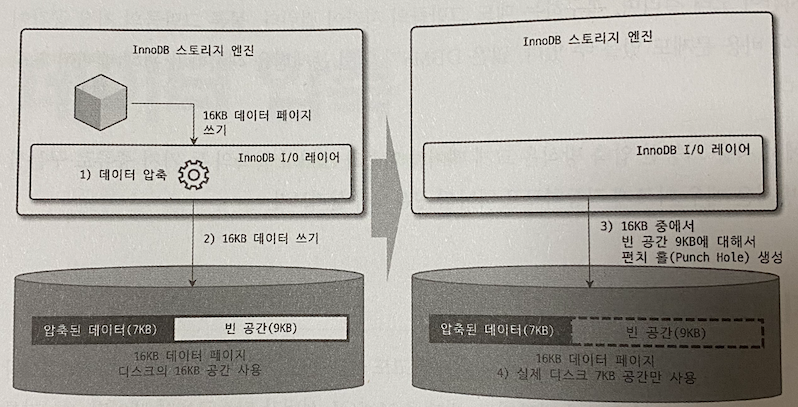
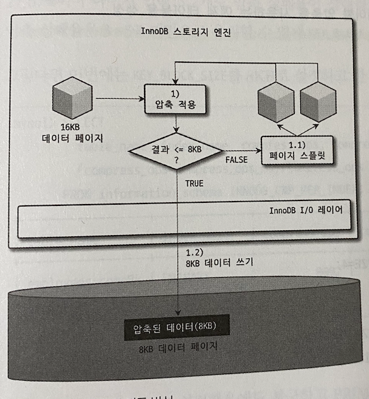

# 지옥 스터디 - 05 데이터 압축
- MySQL 서버에서 디스크에 저장된 **데이터 파일의 크기는 쿼리 성능과 직결** 된다
  - 백업 및 복구 시간과도 밀접한 연관
- 데이터 파일이 클수록 쿼리 처리를 위해 많은 데이터 페이지를 버퍼 풀로 읽고 이를 처리해야 한다
  - 백업/복구도 그만큼 시간이 오래걸림
- 이를 해결하기 위해 **데이터 압축** 기능을 제공
  - MySQL 은 테이블 압축/페이지 압축 두가지 기능을 제공한다

## 페이지 압축
- 페이지 압축은 Transparent Page Compression 이라고도 한다
  - 디스크 저장 시점에 데이터 페이지를 압축
  - 읽어오는 시점에 압축 해제 되기 때문
- 버퍼 풀에 데이터 페이지가 적재 되면 **압축이 해제된 상태로만 관리**
- MySQL 서버는 **압축 여부와 관계없이 투명하게 동작** 한다
  - 이 때문에 Transparent Page Compression..
- 이로 인해 문제가 하나 있음
  - 16KB 페이지를 압축한 결과가 얼마나 될지 예측이 불가능
  - 하나의 테이블은 동일한 크기의 페이지로 통일되어야 함
- 운영체제 별로 **특정 버전의 파일 시스템 에서만 지원하는 펀치홀 기능** 을 사용한다

`운영체제 블록 사이즈가 512 바이트인 경우 페이지 압축 동작 방식`



1. 16KB 페이지 압축 (결과 : 7KB)
2. MySQL 서버는 **디스크에 압축된 결과인 7KB 기록**
   1. MySQL 서버는 빈 데이터인 9KB 를 기록
3. 디스크에 데이터 기록 후 빈 공간 9KB 에 대한 펀치 홀 생성
4. 나머지 9KB (펀치홀) 공간은 운영체제로 반납

> 요악하면, 16KB 페이지에 대해 7KB 로 압축하고 9KB 만큼의 펀치홀이 생성되면, 생성된 펀치홀 만큼 운영체제로 반납 한다

- MySQL 페이지 압축의 가장 큰 문제는 **운영체제 뿐 아니라 하드웨어 에서도 해당 기능(펀치홀) 을 지원** 해야 한다
- 또 하나는, 파일 시스템 관련 명령어가 펀치홀을 지원하지 못함
- 여러가지 이유로 페이지 압축은 많이 사용되지 않는다..

`페이지 압축 사용 방법`

```sql
## 테이블 생성시
CREATE TABLE t1 (c1 INT) COMPRESSION='zlib';
## 테이블 수정시
ALTER TABLE t1 COMPRESSION='zlib';
OPTIMIZE TABLE t1;
```
- ZLIB, LZ4, NONE 3가지 옵션중 하나 사용 가능

## 테이블 압축
- 테이블 압축은 **운영체제/하드웨어 제약 없이 사용** 가능하다
- 하지만 이 또한 단점이 있다
  - 버퍼 풀 공간 활용률 낮음
  - 쿼리 처리 성능 낮음
  - 빈번한 데이터 수정시 압축률 저하

### 압축 테이블 생성
- 테이블 압축 사용을 위해서는, 해당 테이블이 **별도 테이블 스페이스** 를 사용해야 함
  - `innodb_file_per_table` 시스템 변수 설정
- 테이블 생성시 `ROW_FORMAT=COMPRESSED` 옵션 사용
- `KEY_BLOCK_SIZE` 옵션으로 페이지 크기 설정
  - 2n 으로만 설정 가능
  - InnoDB 페이지 크기가 16KB 라면 4또는 8KB 만 가능
  - 32/64 KB 인 경우 압축 적용 불가

```sql
SET GLOBAL innodb_file_per_table=ON;
CREATE TABLE compressed_table(
    c1 INT PRIMIARY KEY
)
ROW_FORMAT=COMPRESSED 
KEY_BLOCK_SIZE=8; // KEY_BLOCK_SIZE 생략시 innodb_page_size 의 절반

CREATE TABLE compressed_table (
    c1 INT PRIMARY KEY
)
KEY_BLOCK_SIZE=8; // ROW_FORMAT=COMPRESSED 생략 가능
```

`참고`
- `innodb_file_per_table` 시스템 변수가 0 (OFF) 인 상태에서 **제너럴 테이블 스페이스** 에 생성되는 테이블에도 압축 사용 가능
  - innodb 전역에서 공유 하는 테이블 스페이스
- 하지만 FILE_BLOCK_SIZE 로 압축을 사용할 수 없을 수도 있음

`InnoDB 테이블 압축 방식`



1. 16KB 데이터 페이지 압축
   1. 압축 결과 8KB 이하면 그대로 저장 (압축 완료)
   2. 압축 결과 8KB 초과, **원본 페이지를 스플릿 해 2개의 페이지에 8KB 씩 저장**
2. 나눈 페이지에 대해 1번을 반복 실행

> 테이블 압축시 InnoDB I/O 레이어 에서는 아무런 역할도 수행하지 않음 <br/>
> 원본 데이터 페이지의 압축 결과가 KEY_BLOCK_SIZE 이하 될때까지 계속해서 스플릿 (오버헤드 발생) 을 수행한다는 것이 중요 <br/>
> SSD 에서 유용

### KEY_BLOCK_SIZE 결정
- 테이블 압축에서 가장 중요한 것이 적절한 KEY_BLOCK_SIZE 를 지정하는 것
  - 적용 전 4KB/8KB 로 테이블을 생성해 샘플 데이터를 저장해보고 판단하는 것을 권장
  - 최소한 테이블의 데이터 페이지가 10개는 생성되도록 데이터 삽입 필요

> 일반적으로 압축 실패율을 3 ~ 5 % 미만을 유지하도록 KEY_BLOCK_SIZE 를 설정할 것

- 압축 실패율이 높다고 해서 실제 디스크의 데이터 파일 크기가 줄지 않는다는 것은 아님.
- 테이블 데이터가 빈번하고 조회되고 변경된다면 압축을 사용하지 않는 것을 권장
  - zlib 을 사용해 압축을 시도하는데 이는 CPU 자원을 많이 소모함

### 압축된 페이지의 버퍼 풀 적재 및 사용
- InnoDB 스토리지 엔진은 압축된 테이블의 데이터 페이즈를 버퍼 풀에 적재하면, **압축된 상태/ 압축 해제된 상태** 2가지 버전을 관리함
  - LRU 리스트 (압축된 상태)
  - Unzip_LRU 리스트 (압축 해제된 상태)
- 압축된 테이블에 대해 버퍼 풀 공간을 이중으로 사용해 메모리를 낭비하는 단점도 존재
- 압축된 페이지에서 데이터 조회/변경시 압축을 해제 해야 함
- 이를 위해 Unzip_LRU 리스트를 별도로 관리하다가 요청 패턴에 따라 적절한 처리를 수행
  - **InnoDB 버퍼 풀 공간이 필요한 경우**, LRU (압축된 형태) 는 유지하고 Unzip_LRU (압축 해제된 형태) 를 제거해서 버퍼 풀 확보
  - **압축된 페이지가 자주 사용되는 경우**, Unzip_LRU 를 유지하면서 압축/압축해제 작업을 최소화
  - **압축된 페이지가 사용되지 않아 LRU 리스트에서 제거되는 경우**, Unzip_LRU 에서도 제거
- InnoDB 엔진은 페이지를 적절한 수준으로 유지하기 위해 어댑티브 알고리즘 활용
  - CPU 사용량이 높다면 Unzip_LRU 비율을 높여 유지함으로써 압축/압축 해제를 최소화
  - Disk IO 가 높다면 Unzip_LRU 리스트 비율을 낮춤으로써 InnoDB 버퍼 풀 공간을 확보

### 테이블 압축 관련 설정
- MySQL 은 페이지 압축 실패율을 낮추기 위핸 튜닝 포인트를 제공

`innodb_cmp_per_index_enabled`
- 테이블 압축이 사용된 테이블의 모든 인덱스의 압축 성공 및 실행 횟수를 수집하는 옵션
- 비활성화시 테이블 단위의 압축 성공 및 압축 실행횟수만 수집한다
- 테이블 정보는 `information_schema.INNODB_CMP` 에 기록되고, 인덱스 정보는 `information_schema.INNODB_CMP_PER_INDEX` 에 기록된다

`innodb_compression_level`
- InnoDB 테이블 압축은 zlib 알고리즘을 사용한다
- `compression_level` 시스템 변수를 활용해 압축률 설정 가능
  - 0 ~ 9 까지 설정 가능
  - 값이 작을 수록 압축속도는 빠르지만 압축률이 낮고, 클수록 속도는 느리지만 압축율이 높아짐
- 압축율이 높을수록 CPU 자원 소모가 커짐

`innodb_compression_failure_threshold_pct 와 innodb_compression_pad_pct_max`
- 테이블 단위 압축 실패율이 `innodb_compression_failure_threshold_pct` 설정값 보다 크다면, 압축 실행 전 원본 데이터 페이지의 끝에 일정 크기의 빈 공간을 추가한다
  - 빈 공간을 추가함으로 써 압축률을 높혀 압축 결과를 `KEY_BLOCK_SIZE` 보다 작게 만들고자 하는 목적
  - 이 빈 공간을 **패딩 (Padding)** 이라고 한다
  - 패딩은, 압축 실패율이 높아질 수록 증가하게 되는데, 최대 패딩의 크기는 `innodb_compression_pad_pct_max` 보다 커질 수 없음

`innodb_log_compressed_pages`
- MySQL 서버가 비정상 종료후 재시작시 압축 알고리즘의 버전 차이가 있떠라도 복구가 실패하지 않도록 InnoDB 엔진은 압축된 데이터 페이지를 리두 로그에 그대로 기록한다
  - 압축 알고리즘 업그레이드시 도움이 됨
  - 하지만 리두로그 증가에 상당한 영향을 미친다
- 압축 적용 이후 리두 로그가 빠르게 증가하거나 버퍼 풀로부터 더티 페이지가 한번에 많이 기록된다면 `innodb_log_compressed_pages` 를 OFF 로 변경후 모니터링을 하는 것을 권장
- `innodb_log_compressed_pages` 기본값은 ON 이고, 특별한 이유가 없다면 이를 유지할 것을 권장

## 참고
- https://dev.mysql.com/doc/refman/5.7/en/general-tablespaces.html
- https://myinfrabox.tistory.com/56?category=804723
- https://hoing.io/archives/1420