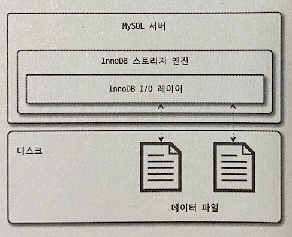
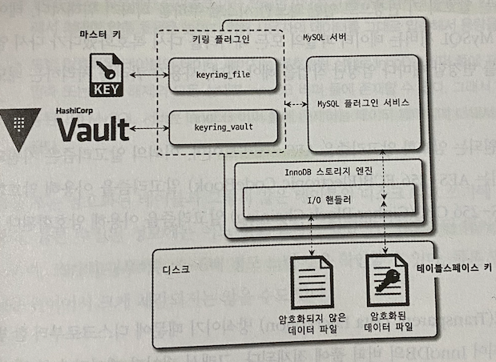

# 지옥 스터디 - 06 데이터 암호화
- 5.7버전 부터 지원하기 시작한 데이터 암호화 기능은, 첨은에는 데이터 파일 (테이블 스페이스) 에 대해서만 지원 했다.
- 8.0부터는 리두로그, 언두로그 바이너리 로그 등 모두 암호화 기능을 지원함

## MySQL 서버의 데이터 암호화
- MySQL 의 암호화 기능은, DB 서버와 디스크 사이의 읽고 쓰는 지점에서 암복호화를 수행한다.
  - **I/O 레이어** 에서만 암복호화 과정이 일어난다.
- 사용자 쿼리 과정에서 암호화 여부를 식별할 필요가 없다.
- TDE (Transparent DAta Encryption) 이라고 한다.
  - Data At Rest Encryption 이라고도 한다.
  - 디스크에 저장된 단계에서만 암호화 된다는 의미



### 2단계 키 관리
- TDE 에서는 키링 플러그인에 의해 암호화 키가 관리된다.
- 8.0 버전 기준 지원하는 플러그인은 4가지
  - keyring_file
  - keyring_encrypted_file
  - keyring_okv
  - keyring_aws
- 각 플러그인 들은 마스터 키 관리 방법만 다를 뿐 내부 동작은 모두 동일하다
- 키링 플러그인은 2단계 (2-Tier) 키 관리 방식을 사용한다.



- **마스터 키** 와 **테이블 스페이스 키** 두 가지 종류의 키를 가지고 있다.
  - 테이블 스페이스 키는 프라이빗 키라고도 함
- 테이블 스페이스 키는, Vault 와 같은 솔루션 또는 디스크 파일 기반 방식으로 관리되고, **암호화된 테이블 생성시점에 매번 임의의 테이블 스페이스 키를 발급** 한다.
- 그 후 **마스터 키를 활용해 테이블스페이스 키를 암호화 해서 테이블의 데이터 파일 헤더에 저장** 한다.
  - 테이블 별로 테이블 스페이스 키가 별도로 존재하게 됨

> 테이블 스페이스 키는 절대 외부로 노출되지 않기 때문에 보안성 취약점이 되지 않지만, 마스터 키는 주기적으로 변경해 주어야 함

`마스터 키 변경`
```sql
ALTER INSTANCE ROTATE INNODB MASTER KEY;
```

- 마스터 키 변경시 기존 마스터키를 활용해 테이블 스페이스를 복호화 한 후, 새로운 마스터 키로 다시 암호화 한다.
  - 마스터 키가 변경되는 동안, 테이블 스페이스 키와 데이터 파일의 데이터는 변경되지 않음
- TDE 에서는 AES 256 을 지원하고, 그외 알고리즘은 지원하지 않음
  - 테이블 스페이스 키는 AES-256 ECB, 데이터 파일은 AES-256 CBC 를 활용한다.

`2단계 암호화 방식을 사용하는 이유`
- 키 변경으로 인한 시스템 부하를 막기 위해서 이다.
- 테이블 스페이스 키로만 관리하게 되면, 키가 변경될 때 마다 데이터파일의 모든 데이터에 대해 암복화를 진행 해야 하며 이는 서비스 장애로 이어질 수 있다.

### 암호화와 성능
- MySQL 암호화는 TDE 방식이기 때문에 디스크로 **한번 읽은 데이터는 평문 상태로 버퍼풀에 적재** 된다.
  - 때문에 한번 적재된 데이터는 암호화 되지 않은 테이블과 동일한 성능을 보임
  - 디스크 엑세스가 많아질 수록 성능 문제가 발생함
- AES 는 **평문의 길이가 짧은 경우** 키의 크기에 따라 데이터가 커질 수도 있다.
- 하지만 MySQL 의 데이터 페이지는 암호화 키 보다 크기 때문에 **암호화 결과는 평문과 동일한 결과를 반환** 한다.

`암호화와 압축이 동시에 적용되는 경우`
- MySQL 서버는 **압축을 먼저 실행하고, 암호화를 적용** 한다
  - 암호화된 결과는 랜덤한 바이트 배열을 갖게되는데, 이는 압축률을 떨어뜨리는 원인. (압축 효율을 높이기 위함)
  - 압축된 데이터 페이즈는 압축/압축해제 상태로 버퍼 풀에 존재할 수 있음.
  - 암호화가 먼저 실행된다면, 버퍼 풀에 존재하는 모든 데이터 페이지에 대해 암복호화 작업을 수행해야 함

> 암호화된 테이블의 경우 읽기는 3~5배, 쓰기는 5~6배 정도 느리다. <br/>
> performance_schema.file_summary_by_instance 테이블을 활용해 측정 가능

```sql
SELECT (SUM(SUM_TIMER_READ) / SUM(COUNT_READ) / 1000000000) as avg_read_latency_ms,
    (SUM(SUM_TIMER_WRITER) / SUM(COUNT_WRITER) / 100000000) as avg_write_latency_ms
FROM performance_schema.file_summary_by_instance
WHERE file_name LIKE '%DB_NAME/TABLE_NAME%';
```

### 암호화와 복제
- 레플리카 구성시, 소스 서버의 모든 데이터를 동기화 한다.
  - TDE 를 활용한 암호화 사용시 마스터 키와 테이블 스페이스 키는 그렇지 않음
  - 기본적으로 모든 노드는 각자의 마스터 키를 관리함
  - 마스터 키가 별개기 때문에 테이블스페이스 키 또한 별개로 관리됨
- 마스터 키 변경 명령은 레플리카 서버로 복제되지만, **실제 마스터 키 자체가 전달되는 것이 아님**
  - 소스 서버와 레플리카 서버가 각각 새로운 마스터 키를 발급 받는다.
- MySQL 서버 백업시, TDE 의 키링 파일을 백업하지 않는 경우, **키링 파일을 찾지 못한다면 데이터 복구를 할 수 없음**
  - 백업시 마다 키링 파일의 백업도 함께 고려해야함

### keyring_file 플러그인 설치
- TDE 플러그인은 MySQL 서버 시작시 **가장 빨리 초기화 되어야 함**
  - my.cnf 에서 설정
- keyring_file_data 파일은 오직 하나의 MySQL 서버만 참조해야 한다.

`my.cnf`

```text
early-plugin-load=keyring_file.so
keyring_file_data=/very/secure/directory/tde_master.key
```

- 플러그인 초기화 여부는 다음과 같이 확인 가능

```sql
SHOW PLUGINS;
```
- 플러그인이 초기화 된 이후, 암호화 기능을 사용하는 테이블을 생성하거나 마스터 로테이션시 키링 파일의 마스터 키가 초기화 된다.

## 테이블 암호화
- 키링 플러그인은, 마스터 키를 생성하고, 관리하는 부분만 담당한다
- 어떤 플러그인을 사용하든 암호화된 테입르을 생성/활용 하는 방식을 동일하다.

### 암호화 테이블 생성
- 일반적인 테이블 생성구문과 동일하며, `ENCRYPTION='Y'` 옵션만 추가하면 된다.

```sql
CREATE TABLE tab_enc(
    id INT
) ENCRYPTION='Y';
```

- 암호화된 테이블만 검색하고 싶다면, `information_schema.TABLES` 뷰를 활용
- 모든 테이블에 대해 암호화를 적용하고 싶다면 `default_table_encryption` 시스템 변수를 ON 으로 설정할 것

### 응용 프로그램 암호화와 비교
- 응용 프로그램에서 암호화한 컬럼은 인덱스를 생성하더라도, 인덱스 기능을 100% 활용할 수 없다.
- 이미 암호화된 값을 기준으로 정렬을 수행했기 때문에, 암호화 이전의 값 기준으로 정렬을 하는등 작업이 불가능
- TDE 를 활용한다면 **인덱스 관련 작업까지 모두 수행한 이후 데이터 페이지 저장시 암호화를 수행** 하기 때문에 제약이 없음

> 응용 프로그램 암호화와 TDE 중 고민한다면, TDE 를 권장함 <br/>
> 암호화 기능은 서비의 요건과 성능을 고려해서 선택해야 한다.

### 테이블스페이스 이동
- 테이블을 다른 서버로 복사해야 하는 경우 / 특정 테이블의 데이터 파일만 백업 후 복구하는 경우
- 테이블 스페이스 이동 기능이 덤프 보다 훨씬 효율적이고 빠르다.
  - TDE 가 적용된 경우 마스터 키가 다르기 때문에 FLUSH TABLES 명령으로 테이블 스페이스를 익스포트 해야 한다.
  
```sql
FLUSH TABLES source_table FOR EXPORT;
```
- 위 명령 실행시 source_table 에 저장되지 않은 사항을 모두 디스크에 기록한 뒤 source_table 에 접근 하지 못하도록 락을 건다.
  - source_table 의 구조를 source_table.cfg 파일로도 기록
- source_table.ibd / source_table.cfg 파일을 모두 복사한 후 UNLOCK TABLES 명령으로 복원하면 된다. (여기까지가 암호화 되지 않은 테이블 스페이스 복사)
- TDE 적용 테이블에 대해 위 명령 실행시, **임시로 사용할 마스터 키를 발급해 source_table.cfp 파일로 기록** 한다.
- 이후 암호화된 테이블의 테이블스페이스 키를 기존 마스터 키로 복호화 하고, 발급한 마스터 키로 다시 암호화 한 뒤 데이터 파일의 헤더에 저장한다.
  - 마스터 키를 새로 발급해 교체하는 과정이 수행됨
- 임시 마스터키가 저장된 *.cfp 파일을 함께 복사하면 된다. (여기까지가 암호화된 테이블 스페이스 복사)
  - cfp 파일은 존재하지 없다면 복구가 불가능 하다.

## 언두 로그 와 리두 로그 암호화
- 테이블 암호화를 적용해도 리두 로그, 언두 로그, 바이너리 로그는 평문으로 저장된다.
- MySQL 8.0.16 버전 부터는 이들 또한 암호화된 상태로 저장이 가능하다
  - `innodb_undo_lo_encrypt`
  - `innodb_redo_log_encrypt`
- 단 주의할 점은, 리두 로그, 언두 로그 는 암호화를 활성화 한다고 해서 이전에 생성된 로그 까지 모두 암호화 되는 것이 아니다.
  - 활성화 이후 생성되는 로그에 대해서만 암호화가 수행됨
- 또한 비활성화 한디고 해서 키가 바로 사라지는 것이 아님
  - 기존에 존재하는 로그가 암호화 되어있다면 해당 로그를 위해 키가 유지된다
- 리두/언두 로그 데이터 모두 각각의 프라이빗 키로 암호화 되고 프라이빗 키는 다시 마스터키로 암호화 되고, 이는 파일 헤더에 저장됨
  - 테이블 암호화에 사용된 테이블 스페이스 키가 아님에 유의

## 바이너리 로그 암호화
- 언두/리두 로그는 길지 않은 시간동안만 가지고 있지만, 바이너리 로그는 의도적으로 긴 시간 보관하는 서비스도 있고, **증분 백업** 을 위해 이를 보관하기도 한다.
- 바이너리 로그와 릴레이 로그 파일 암호화 기능은, **디스크에 저장된 로그 파일에 대해서만** 암호화를 제공한다
  - 네트워크 구간에서는 암호화 하지 않음
  - 이가 필요하다면 MySQL 복제 계정이 SSL 을 사용하도록 설정할 것

> 키 관리의 경우 테이블 암호화와 동일한 방식을 사용함

