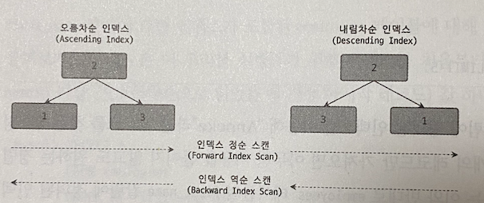
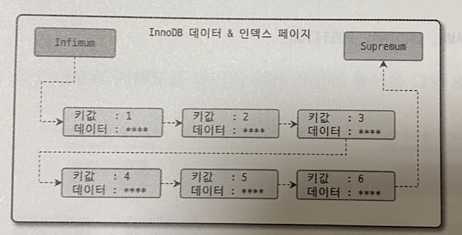
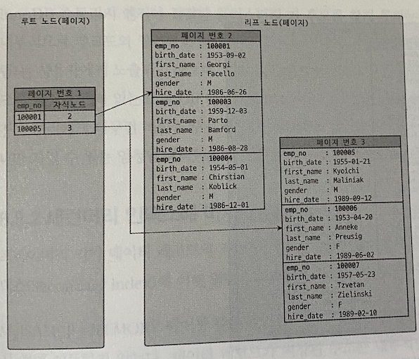

# 지옥 스터디 - 07 인덱스
- 인덱스의 특성과 차이는 중요하며, 물리수준의 모델링시 에도 매우 중요한 요소
- 8.0 버전부터 InnoDB 스토리지 엔진에서도 전문검색/위치기반 검색 기능도 모두 사용이 가능해짐

## 디스크 읽기 방식
- 데이터베이스의 성능 튜닝의 핵심은 **디스크 I/O 를 줄이는 것**

### HDD 와 SDD
- CPU와 메모리같은 주요 장치는 대부분 전자식 장치지만, 하드 디스크는 기계식 장치이다.
- 때문에 데이터베이스 서버에서 항상 디스크가 병목 지점이 됨
- 디스크 헤더를 움직이지 않고 한번에 많은 데이터를 읽는 **순차 I/O 에서는 SSD 와 HDD 의 성능 차이는 미미한 수준** 이다
- 하지만 랜덤 I/O 에서는 SSD 가 훨씬 빠르다
  - 이는 SSD 의 장점
- 랜덤 I/O 를 통해 읽고 쓰는 작업이 주인 데이터베이스 에서는 SSD 가 우세

### 랜덤 I/O 와 순차 I/O
- 랜덤 I/O 는 HDD 기준 플래터 (원판) 을 움직여 **디스크 헤더를 이동** 시킨 뒤 데이터를 읽는 것을 의미한다.
  - 순차 I/O 또한 과정은 동일
- 순차 I/O 와 랜덤 I/O 의 가장 큰 차이는 **디스크 헤더를 움직이는 횟수** 이다
  - 헤더를 움직여 위치를 움직이는 시간이 병목 지점 (성능)
  - 헤더 이동 없이 얼마나 많은 데이터를 한번에 읽고 쓰느냐가 관건임
- 때문에 랜덤 I/O 가 부하가 더 심하다.
- SSD 에서도 랜덤 I/O 는 순차 I/O 보다 스루풋이떨어지지만 HDD 에 비해서는 높은 성능을 보여준다.

> 쿼리를 튜닝하는 작업은, 랜덤 I/O 를 줄이는 것이 목적 이라고 생각하면 된다. <br/>
> 반드시 필요한 데이터만 읽도록 쿼리를 개선

## 인덱스란 ?
- 인덱스는 책에 비유하자면 목차에 해당한다.
  - 원하는 결과를 빨리 찾기 위함이 목적
- 또 중요한 것은 바로 **정렬** 이다.
- 칼럼의 값을 주어진 순서대로 미리 정렬해 보관한다.

`자료구조와 비교`
- SortedList 는 인덱스와 같은 자료 구조
- ArrayList 는 데이터 파일과 같은 자료구조

> DBMS 의 인덱스는, 데이터 조작 (INSERT, UPDATE, DELETE) 성능을 희생하고 데이터 읽기 속돌르 높이는 기능이다. <br/>
> WHERE 조건에 사용된다고 해서 모두 인덱스로 생성한다면 인덱스의 크기가 커져 오히려 역효과를 부를 수 있다.

`역할별로 구분`
- 프라이머리키 (Primary Key)
  - 레코드를 식별하는 기준 값
  - NULL/중복 을 허용하지 않는다
- 보조키 (Secondary Key)
  - PK 를 제외한 모든 인덱스
  - 유니크 인덱스의 경우 PK 를 대체할 수 있다고 해서 대체키 라고도 한다

`저장방식 으로 구분`
- B-Tree 인덱스
  - 일반적으로 가장 많이 사용
  - 컬럼의 값을 변형하지 않고 원래 값을 활용하는 방식
- Hash 인덱스
  - 컬럼의 값으로 해시값을 만들어 활용하는 방식
  - 매우 빠른 검색 지원
  - like 검색, 범위검색 등에서 사용할 수 없다
  - 주로 메모리 디비에서 사용

`중복 여부로 구분`
- 유니크 인덱스
- 논 유니크 인덱스
- 단순히 값이 1개만 존재하는지 여부 이지만, DBMS 의 옵티마이저 에게는 상당히 중요한 문제가 됨
- 유니크 인덱스로 인해 1개의 레코드만 찾을 것인지, 또한 MySQL 처리 방식등 차이점이 상당하다.

## B-Tree 인덱스
- 가장 많이 사용되고, 가장 범용적인 인덱스 알고리즘
  - 주로 B+-Tree, B*-Tree 가 사용됨
- **Balanced Tree 의 약자** 임을 기억할 것
  - Binary Tree 가 아니다
- 컬럼의 원래 값을 변형 하지 않고, 인덱스 구조체 내에서 항상 정렬된 상태로 유지한다.
- 대부분의 인덱스는 B-Tree 를 사용한다.

### 구조 및 특성
- B-Tree 는 트리구조의 최상위 **루트 노드** 하나, 그 하위에 자식 노드가 존재하는 형태
- 최하위에 있는 노드를 **리프 (leaf) 노드** 라고 한다.
- 루트와 노드 둘중에 속하지 않는 노드를 **브랜치 (branch) 노드** 라고 한다.

> 인덱스와 실제 데이터는 따로 관리 된다. <br/>
> 리프 노드는 항상 실제 데이터의 레코드 주소를 가지고 있다.


- 위 처럼 인덱스 키 값은 모두 정렬되어 잇지만, 데이터 파일의 레코드는 정렬되어 있지 않다.
- DBMS 는 저장공간을 재활용 하도록 설계되기 때문에 INSERT 순서대로 저장됨을 보장하지 않음
- MyISAM 과 InnoDB 의 가장 큰 차이는 리프노드가 어떤 값을 참조하고 있냐 이다
  - MyISAM 은 실제 레코드의 주소 (ROWID)
  - InnoDB 는 PK 값
- InnoDB 의 경우 프라이머리 키를 주소 처럼 사용하기 때문에 논리적인 주소라 표현함
  - 인덱스에 저장된 PK 값을 이용해 PK 인덱스에 접근한 뒤 실제 레코드에 접근한다

### 인덱스 키 추가 및 삭제
- 키가 추가될 때 스토리지 엔진 종류에 따라 즉시 반영될수도 그렇지 않을 수도 있다
- 우선 B-Tree 인덱스에 **저장시** 키값을 이용해 적절한 위치를 탐색한다.
- 그 후 레코드 키 값과 주소 정보를 리프노드에 저장하는데, 리프노드가 꽉찬경우 리프 노드를 분리해야 한다.
  - 이런 작업 덕분에 쓰기작업의 비용이 많이 듦
- 테이블에 인덱스가 하나도 없는 경우 작업비용은 1
- 3개인 경우 5.5 정도의 비용 (1.5 * 3 + 1) 정도로 예측한다
  - 비용의 대부분은 디스크 I/O
- InnoDB 는 기본적으로 인덱스 변경시 **체인지 버퍼** 를 활용해서 지연 처리한다.
- 하지만 PK 나 유니크 인덱스의 경우 중복 체크가 필요해 즉시 처리함
- 인덱스 **삭제의 경우** 해당 값의 리프노드를 찾아 삭제 마킹만 하면 안료된다
  - 이는 방치되고나 재활용 될 수 있다
  - 이 작업도 체인지 버퍼에 의해 지연 처리 될 수 있음

### 인덱스 키 변경
- B-Tree 인덱스의 키 값 변경은 삭제 -> 추가 형태로 처리 된다.
- 모두 체인지 버퍼를 활용해 지연처리 될 수 있음

### 인덱스 키 검색
- 인덱스를 구축하는 이유는 **빠른 검색** 을 위함
- B-Tree 루트 노드부터 리프노드 까지 이동하며 비교작업을 하는데 이를 트리 탐색 이라고 함
- 인덱스 트리 탐색은 SELECT 뿐 아닌 UPDATE/DELETE 시에도 해당 레코드를 찾기 위해 사용된다
- B-Tree 인덱스를 이용한 검색은 100% 일치 또는 Prefix 만 일치하는 경우 사용이 가능하다
  - 키 값의 뒷 부분 검색시에는 인덱스를 활용할 수 없다
- 인덱스의 키 값에 변형이 가해진 후 비교 되는 경우 인덱스가 활용되지 않는다
  - 함수나 연산을 수행한 결과를 의미
- InnoDB 에서 지원하는 레코드 락이나 넥스트 키락은 검색을 수행한 **인덱스를 잠근 뒤 테이블의 레코드를 잠근다**
  - 인덱스 기반으로 구현되어 있다고 이해하면 됨
- 적절한 인덱스가 없다면 불필요하게 많은 레코드를 잠그므로 인덱스 설계가 중요하다

### B-Tree 인덱스 사용에 영향을 미치는 요소
- 컬럼의 크기, 레코드 건수, 유니크 인덱스 키값의 개수 등이 성능에 영향을 받는다.

### 인덱스 키 값의 크기
- InnoDB 에서 디스크에 저장하는 가장 기본 단위를 페이지 (Page) 라고 한다.
  - 디스크의 읽기/쓰기 작업의 최소 작업 단위
  - 버퍼 풀에서 데이터를 다루는 기본 단위 이기도 함
- 인덱스 또한 페이지 단위로 관리 된다
- B-Tree 인덱스는 자식 노드의 개수가 가변적인 구조
  - 인덱스 페이지의 크기 (기본 값은 16KB) 와 키 값의 크기에 따라 결정됨
- 인덱스를 구성하는 키 값의 크기가 커지면 디스크 I/O 횟수가 늘어나고 성능에 영향을 미친다
- 인덱스 키값의 길이가 늘어난다는 것은 전체적인 인덱스가 커진다는 것을 의미한다

### B-Tree 의 깊이
- B-Tree 인덱스의 깊이는 중요하지만 직접 제어할 수 없다
  - 이 깊이는 MySQL 에서 값 검색시 랜덤 I/O 횟수와 직결되는 문제
- 키값의 크기가 커질수록 노드의 갯수가 줄어들고, 그만큼 깊이가 깊어져 I/O 가 많아진다
- 인덱스 키 값의 크기는 가능하면 작게 만드는 것이 좋다.
- 하지만 대용량 데이터베이스라도 B-Tree 의 깊이가 5 이상 가는 경우는 드물다

### 선택도
- 인덱스 설계시 선택도 를 높혀야 한다
  - 이는 인덱스 키 값 가운데 유니크한 값의 수를 의미
- 선택도가 높을수록 검색 대상이 줄어들기 때문에 성능이 좋아진다
- 선택도가 좋지 않아도 정렬/그루핑 과 같은 작업을 위해 인덱스를 만드는 것이 더 나은 경우도 많다.

### 읽어야 할 레코드의 건수
- 인덱스를 통해 레코드를 읽는 것은, 바로 테이블의 레코드를 읽는것 보다 비용이 크다
- 인덱스를 이용한 읽기의 **손익 분기점** 이 존재한다
- 일반적인 옵티마이저의 경우 인덱스를 통한 레코드를 읽는 것이 4 ~ 5 배 더 비용이 높은 것으로 판단한다
- 전체 테이블의 레코드의 20 ~ 25 % 를 넘어서면 테이블의 레코드를 직접 읽어 필터링 하는방식이 더 효율적이다

### 인덱스 레인지 스캔
- 인덱스의 접근 방법 가운데 가장 대표적인 방식
- 인덱스 레인지 스캔은, 검색할 인덱스의 범위가 결정된 경우 사용하는 방식
- 검색하려는 값의 수나 검색 결과 레코드 건수와 관계없이 레인지 스캔 이라고 한다


- 필요한 레코드의 시작지점을 먼저 찾고 그때 부터 리프노드의 레코드를 순서대로 읽어 나가는 방식이다
- 어떤 방식이든 해당 인덱스를 구성하는 칼럼의 정순/역순 으로 정렬된 상태의 레코드를 가져 온다
- 중요한 것은 리프 노드에서 검색 조건에 일치하는 건들을 **데이터 파일에서 읽어오는 과정** 이 필요하다
  - 여기서 랜덤 I/O 가 건마다 발생한다
  - 3건이라면 3번 발생
  - 이런 특성 때문에 비용이 많이 든다
- 쿼리에서 필요로 하는 데이터에 따라 3번 과정을 필요하지 않을 수도 있는데, 이를 커버링 인덱스 라고 한다
  - 이는 디스크의 레코드를 읽지 않아도 되므로 랜덤 I/O 가 줄고 성능은 그만큼 빨라진다

### 인덱스 풀 스캔
- 인덱스를 사용하지만, 인덱스의 처음 부터 끝까지 모두 읽는 방식
- 쿼리 조건절에 사용된 컬럼이 인덱스의 첫 번째 칼럼이 아닌경우 이 방식이 사용됨
- 레인지 스캔보단 느리지만, 테이블 풀 스캔보단 효율적이다

### 루스 인덱스 스캔
- 인덱스 스킨 스캔을 MySQL 에서는 루스 인덱스 스캔 이라고 한다
- 5.7 버전까지는 제한적인 기능을 제공했으나 8.0 부터는 다른 DBMS 와 같은 최적화를 지원하기 시작했다
- 이는 말그대로 느슨하게, 듬성듬성하게 인덱스를 읽는것을 의미한다


- 레인지 스캔과 유사하게 동작하지만, 필요하지 않은 인덱스 키는 무시하고 다음으로 넘어가는 형태로 처리한다
  - GROUP BY 또는 MAX(), MIN() 함수 최적화시 사용된다

### 인덱스 스킵 스캔
- 인덱스의 핵심은 값이 정렬되어 있으며, 인덱스를 구성하는 칼럼의 순서가 매우 중요하다
- 8.0 버전 부터는 앞선 칼럼을 건너뛰어 두번째 칼럼으로도 인덱스 검색이 가능한 인덱스 스킵 스캔 최적화 기능이 도입 되었다
- 8.0 에 도입된 인덱스 스킵 스캔은 WHERE 조건절 검색을 위해 사용하도록 용도가 강화된 것
- 하지만 제약사항이 존재한다
  - WHERE 조건절에 조건이 없는 인덱스 선행 칼럼의 유니크한 값의 개수가 적어야 함
  - 인덱스에 존재하는 칼럼만으로 처리가 가능해야 함 (커버링 인덱스)

### 멀티 칼럼 인덱스
- 두 개이상의 칼럼으로 구성된 인덱스
  - Concatenated Index 라고도 함
- 중요한 것은 인덱스의 두 번째 칼럼은 첫 번째 칼럼에 의존해 정렬되어 있다
- 다중 칼럼 인덱스에서는 인덱스 내에 각 칼럼의 순서가 매우 중요하다


### B-Tree 인덱스의 정렬 및 스캔 방향
- 인덱스의 키 값은 항상 오름차순이거나 내림차순으로 정렬되어 젖아된다
- 인덱스를 어느 방향으로 읽을 지는 쿼리에 따라 옵티마이저가 실시간으로 만드는 실행 계획에 따라 결정된다

`인덱스의 정렬`
- 5.7 버전까지는 컬럼 단위로 정렬 순서를 혼합해서 생성할 수 없었다.
  - 때문에 숫자 컬럼의 경우 -1 을 곱한 값을 저장하는 우회 방법을 사용함
- 하지만 8.0 부터는 다음과 같은 정렬 순서를 혼합한 인덱스도 생성이 가능해짐

```sql
CREATE INDEX ix_teamname_userscore ON employees (team_name ASC, user_score DESC);
```

`인덱스 스캔 방향`
- 인덱스 생성 시점에 오른차순 또는 내림차순으로 정렬이 결정되지만, 인덱스 사용 시점에 인덱스를 읽는 방향에 따라 오름차순 또는 내림차순 정렬 효과를 얻을 수 있다
- ORDER BY, MIN()/MAX() 함수등의 최적화 시에도 인덱스 읽기 방향을 전환해 사용하도록 처리한다




`내림차순 인덱스`
- 오름차순 인덱스 : 작은 값의 인덱스가 왼쪽으로 정렬
- 내림차순 인덱스 : 큰 값의 인덱스가 왼쪽으로 정렬
- 인덱스 정순 스캔 : 리프 노드의 왼쪽부터 오른쪽으로 스캔
- 인덱스 역순 스캔 : 리프 노드의 오른쪽부터 왼쪽으로 스캔

> 인덱스 역순 스캔은 정순 스캔에 비해 느린데, 느릴 수 밖에 없는 두 가지 이유가 있다.

1. 페이지 잠금이 인덱스 정순 스캔에 적합한 구조
2. 인덱스 레코드는 단방향으로만 연결된 구조 



- 쿼리에서 자주 사용되는 정렬 순서대로 인덱스를 생성하는 것이 중요함

### B-Tree 인덱스의 가용성과 효율성

`비교조건의 종류와 효율성`
- 다중 칼럼 인덱스에서 각 **칼럼의 순서** 와 **동등 조건** 인지, **범위 조건** 인지에 따라 활용형태가 달라지고 효율도 달라진다.
- 인덱스에서의 조건 (dept_no=d002 와 emp_no > 10144) 와 같이 작업 의 범위를 결정하는 조건을 **작업 범위 결정 조건** 잉라고 한다
- 작업 범위 결정 조건이 많을수록 쿼리 성능을 높이지만, 체크 조건은 많다고 해서 쿼리 처리 성능을 높이지는 못한다

#### 인덱스의 가용성
- B-Tree 인덱스의 특징은 왼쪽 값에 기준해 오른쪽 값이 정렬되어 있다
- 다중칼럼 인덱스에도 함께 적용된다
- 다중칼럼 인덱스 에서도 왼쪽 칼럼 값을 모르면 인덱스 레인지 스캔을 적용할 수 없다

### 가용성과 효율성 판단
- 다음 조건에서는 인덱스를 사용할 수 없다
  - 이는 작업 범위 결정조건으로 사용할 수 없음을 의미
1. NOT-EQUAL (<>, NOT IN NOT BETWEEN, IS NOT NULL)
2. LIKE '%??' (뒷부분 일치 문자열 패턴 비교)
3. 스토어드 함수 또는 인덱스 칼럼이 변형된 후 비교된 경우
4. NOT-DETERMINISTIC 속성 스토어드 함수가 사용된 경우
5. 데이터 타입이 서로 다른 비교
6. 문자열 데이터 타입의 콜레이션이 다른 경우

> MySQL 은 NULL 도 인덱스에 저장되며, 작업 범위 결정조건으로 인덱스를 사용한다

## R-Tree 인덱스
- R-Tree 인덱스 알고리즘을 활용해 2차원 데이터를 인덱싱하고 검색하는 목적의 인덱스
  - 내부 매커니즘은 B-Tree 와 흡사
- 위치기반 서비스 구현시 MySQL 의 공간확장 기능을 활용하면 간단하게 구현이 가능하다
- MySQL 공간확장은 다음 3가지 기능을 제공한다
  - 공간 데이터를 저장할 수 있는 데이터 타입
  - 공간 데이터 검색을 위한 공간 인덱스
  - 공간 데이터의 연산 함수

## 전문 검색 인덱스
- B-Tree 인덱스는 실제 칼럼 값이 1MB 라 전체를 인덱스키로 사용하지 않고, 1,000 (MyISAM) 또는 3072 (InnoDB) 바이트까지 잘라서 키로 사용한다
  - InnoDB 의 로우 포맷이 DYNAMIC or COMPRESSED 인 경우 3072 바이트
  - REDUNDANT 또는 COMPACT 인 경우 767 바이트 까지만 가능하다
  - 8.0 기준 기본값은 DYNAMIC
- 전문 검색 (Full-Text Search) 에는 B-Tree 인덱스를 사용할 수 없다

### 인덱스 알고리즘
- 전문 검색에서는 빠른 검색을 위해 검색할 키워드를 기반으로 인덱스를 구축한다
- 인덱싱 기법에 따라 크게 단어 어근분석과 n-gram 알고리즘으로 구분이 가능하다

### 어근 분석 알고릴즘
- 전문 검색 인덱스는 두 가지 중요한 과정을 거쳐 색인 작업이 수행된다
  - 불용어 처리 (Stop Word) : 불필요한 단어를 필터링 처리
  - 어근 분석 (Stemming) : 검색어로 선정된 단어의 뿌리인 원형을 찾는 작업

### n-gram 알고리즘
- 단순히 키워드를 검색해내기 위한 인덱싱 알고리즘
- 본문을 무조건 몇 글자씩 잘라서 인덱싱 하는 방법
- 일반적으로 2글자 단위로 잘라 인덱싱하는 2-gram (Bi-gram) 방식이 많이 사용된다

### 전문 검색 인덱스의 가용성
- 전문 검색 인덱스 사용시 반드시 두가지 조건을 만족해야 한다
  - 쿼리 문장이 전문 검색을 위한 문법을 사용해야함 (MATCH ... AGINST ...)
  - 대상 칼럼에 대해 전문 인덱스가 있어야 함

```sql
CREATE TABLE tb_text(
    doc_id INT PRIMARY KEY,
    doc_body TEXT,
    FULLTEXT KEY fx_docbody (doc_body) WITH PARSER ngram
) ENGINE = InnoDB;

SELECT * FROM tb_test
WHERE MATCH(doc_body) AGINST('애플', IN BOOLEAN_MODE);
```

## 함수 기반 인덱스
- 칼럼의 값을 변형해 만들어진 값에 대해 인덱스를 구축해야 하는 경우도 있다
- 이런 경우 함수기반 인덱스를 사용하면 됨
- 8.0 버전부터 함수기반 인덱스 기능을 지원했으며 두 가지 방법이 있다
  - 가상 칼럼을 이용한 인덱스
  - 함수를 이용한 인덱스
- 함수 기반 인덱스는 계산 과정에만 차이가 있고 실제 구조는 B-Tree 인덱스와 동일하다

### 가상 칼럼을 이용한 인덱스
- 5.7버전 에도 사용 가능

```sql
ALTER TABLE user ADD full_name VARCHAR(30) AS (CONCAT(first_name, '', last_name)) VIRTUAL,
ADD INDEX ix_fullname (full_name);
```
- 가상 칼럼은 테이블에 새로운 칼럼을 추가하는 것과 동일한 효과를 낸다.
- 때문에 실제 테이블 구조가 변경된다는 단점이 존재한다

### 함수를 이용한 인덱스
- 8.0 부터 사용 가능
- 테이블 구조를 변경하지 않고 함수를 직접 사용하는 인덱스 생성이 가능하다

```sql
CREATE TABLE user (
    user_id BIGINT PRIMARY KEY,
    first_name VARCHAR(10),
    last_name VARCHAR(10),
    INDEX ix_fullname ((CONCAT(first_name, '', last_name)))
)
```
- 반드시 조건절에 함수를 기반한 인덱스에 명시된 표현식이 그대로 사용되어야 한다는 제약사항이 존재한다

## 멀티 밸류 인덱스
- 멀티 밸류 인덱스는 **하나의 데이터 레코드가 여러 개의 키 값을 가질 수 있는 형태의 인덱스**
- JSON 포맷으로 데이터를 저장하는 경우 배열 타입의 필드에 저장된 원소에 대해 인덱스가 필요해져 추가된 기능
- 일반적인 조건방식은 사용할 수 없고 반드시 다음 함수를 이용해 검색해야 한다
  - MEMBER_OF()
  - JSON_CONTAINS()
  - JSON_OVERLAPS()
  
```sql
CREATE TABLE user (
    user_id BIGINT AUTO_INCREMENT PRIMARY KEY,
    first_name VARCHAR(10),
    last_name VARCHAR(10),
    credit_info JSON
                  INDEX mx_creditscores ( (CAST(creidt_info -> '$.credit_scores' AS UNSIGNED ARRAY)))
);

SELECT * FROM user WHERE 360 MEMBER OF (credit_info -> '$.credit_scores');
```

## 클러스터링 인덱스
- 테이블의 레코드를 비슷한 것 (PK 기준) 들 끼리 묵어서 형태
- InnoDB 스토리지 엔진에서만 지원한다
- PK 에 대해서만 적용되는 내용이며, 중요한 점은 **PK 값에 의해 레코드 저장위치가 결정된다는 것**
  - 인덱스 알고리즘보다는 테이블 레코드 저장방식



- 클러스터링 인덱스는 B-Tree 와 비슷하지만, 클러스터링 인덱스의 리프노드에는 레코드의 모든 칼럼이 같이 저장되어 있다
- 클러스터링 테이블은 그 자체가 하나의 거대한 인덱스 구조로 관리 된다
- PK 가 없다면 PK 를 내부적으로 대체할 컬럼을 선택한다
  - PK 를 우선 선택
  - NOT NULL 유니크 인덱스 중 첫번째를 선택
  - 내부적으로 AUTO_INC 컬럼을 생성한뒤 선택
> 자동으로 추가된 PK 는 사용자에게 노출되지 않고, 쿼리 문장에 사용할 수 없다.

### 세컨더리 인덱스에 미치는 영향
- MyISAM/MEMORY 테입르은 INSERT 시 처음 저장된 공간에서 절대 이동하지 않는다
  - 내부적인 레코드 주소 (ROWID) 를 활용함
  - 때문에 PK와 세컨더리 인덱스는 구조적으로 아무런 차이가 없음
- InnoDB 에서는 실제 레코드 주소를 가지고 있게 되면 문제가 발생한다
  - 클러스터링 키 값이 변경될 때 마다 모든 인덱스의 주소 값을 변경해야 하는 일이 발생한다
  - 때문에 세컨더리 인덱스는 PK 값을 가지고 있도록 구현되어 있다

> 세컨더리 인덱스로 검색후 PK 값 확인, PK 인덱스를 활용해 최종 레코드를 가져오는 방식

### 클러스터링 인덱스의 장단점
- 검색 처리 성능이 매우 빠르다
  - 특히 범위 검색시 매우 빠름
- 모든 세컨더리 인덱스가 PK 를 가지고 있기에 인덱스 만으로 처리가능한 경우가 많음 (커버링 인덱스)
- 클러스터링 키 값이 클경우 전체적인 인덱스 크기가 커짐
- PK 를 거쳐 레코드에 접근하기 때문에 성능이 느림
- 데이터 저장시 PK 에 의해 레코드 저장위치가 결정되므로 느림
- PK 변경시 레코드 삭제/등록 작업이 필요하기에 성능이 느림

> 장점은 빠른 조회, 단점은 느린 쓰기

### 클러스터링 테이블 사용시 주의사항
- 프라이머리 키의 크기가 커지면, 세컨더리 인덱스의 크기도 자동으로 커지므로 주의
- 가능하다면 업무적인 컬럼으로 생성할 것 (업무상 조회하는 컬럼)
- 프라이머리 키는 반드시 생성할 것
- 복합키 크기가 크다면 AUTO_INCREMENT 컬럼을 사용할 것

## 유니크 인덱스
- 유니크는 인덱스 보단 제약조건에 가깝다
- NULL 도 저장이 가능하며, 2개 이상 저장될 수 있음을 유의

### 세컨더리 인덱스와의 비교
- 인덱스 구조상 아무런 차이가 없다
- 유니크 인덱스가 빠르다고 생각하지만 사실이 아님.
- 인덱스 자체의 특성보다는, 데이터 분포때문에 성능 차이가 나는 것이다
- 읽어야할 레코드 건수가 동일하다면 성능차이는 없다고 봐도 무방
- 쓰기의 경우 중복 값 체크가 과정이 필요하기 때문에 느리다
  - 중복값 체크시 읽기잠금
  - 쓰기시 쓰기 잠금
  - 데드락이 빈번하게 발생함

### 주의사항
- 불필요하게 유니크 인덱스를 생성하지 말것
- 성능 향상을 위해 생성한다는 생각을 하지 말것

## 외래키
- InnoDB 에서만 지원하는 기능
- 외래키 관리시 중요한 특징이 있다
  - 테이블 변경시에만 잠금 경합 이 발생한다
  - 외래키와 관련없다면 최대한 잠금 경합을 발생시키지 않는다