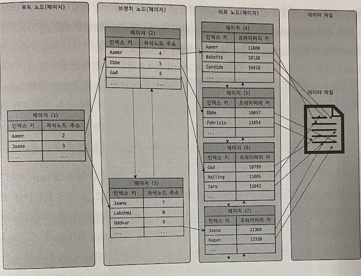
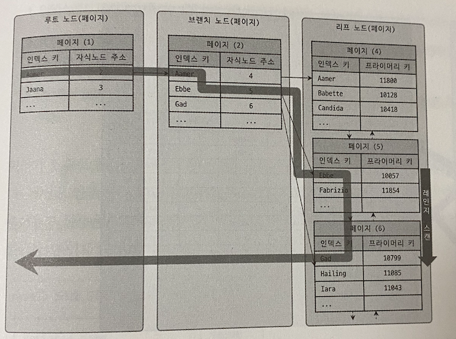
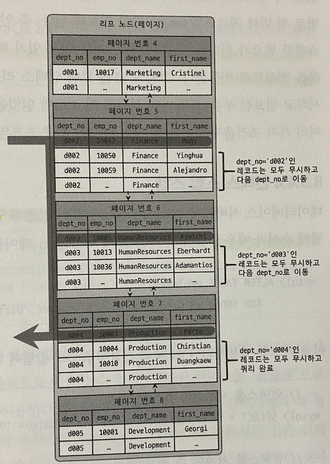
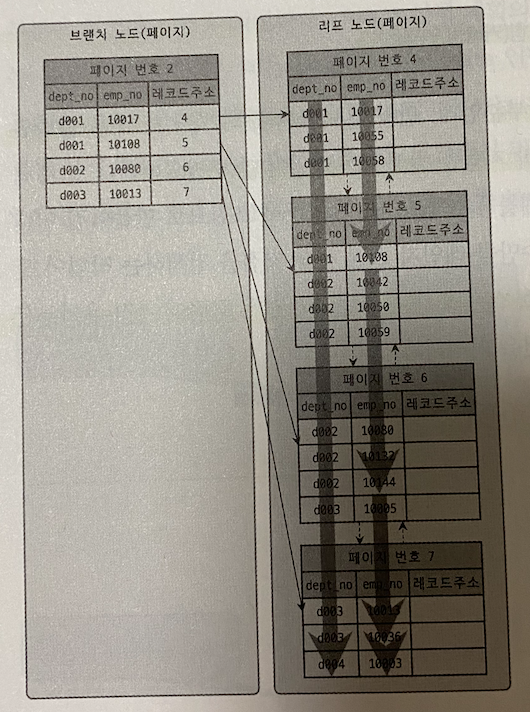

# 지옥 스터디 - 07 인덱스
- 인덱스의 특성과 차이는 중요하며, 물리수준의 모델링시 에도 매우 중요한 요소
- 8.0 버전부터 InnoDB 스토리지 엔진에서도 전문검색/위치기반 검색 기능도 모두 사용이 가능해짐

## 디스크 읽기 방식
- 데이터베이스의 성능 튜닝의 핵심은 **디스크 I/O 를 줄이는 것**

### HDD 와 SDD
- CPU와 메모리같은 주요 장치는 대부분 전자식 장치지만, 하드 디스크는 기계식 장치이다.
- 때문에 데이터베이스 서버에서 항상 디스크가 병목 지점이 됨
- 디스크 헤더를 움직이지 않고 한번에 많은 데이터를 읽는 **순차 I/O 에서는 SSD 와 HDD 의 성능 차이는 미미한 수준** 이다
- 하지만 랜덤 I/O 에서는 SSD 가 훨씬 빠르다
  - 이는 SSD 의 장점
- 랜덤 I/O 를 통해 읽고 쓰는 작업이 주인 데이터베이스 에서는 SSD 가 우세

### 랜덤 I/O 와 순차 I/O
- 랜덤 I/O 는 HDD 기준 플래터 (원판) 을 움직여 **디스크 헤더를 이동** 시킨 뒤 데이터를 읽는 것을 의미한다.
  - 순차 I/O 또한 과정은 동일
- 순차 I/O 와 랜덤 I/O 의 가장 큰 차이는 **디스크 헤더를 움직이는 횟수** 이다
  - 헤더를 움직여 위치를 움직이는 시간이 병목 지점 (성능)
  - 헤더 이동 없이 얼마나 많은 데이터를 한번에 읽고 쓰느냐가 관건임
- 때문에 랜덤 I/O 가 부하가 더 심하다.
- SSD 에서도 랜덤 I/O 는 순차 I/O 보다 스루풋이떨어지지만 HDD 에 비해서는 높은 성능을 보여준다.

> 쿼리를 튜닝하는 작업은, 랜덤 I/O 를 줄이는 것이 목적 이라고 생각하면 된다.  
> 반드시 필요한 데이터만 읽도록 쿼리를 개선

## 인덱스란 ?
- 인덱스는 책에 비유하자면 목차에 해당한다.
  - 원하는 결과를 빨리 찾기 위함이 목적
- 또 중요한 것은 바로 **정렬** 이다.
- 칼럼의 값을 주어진 순서대로 미리 정렬해 보관한다.

`자료구조와 비교`
- SortedList 는 인덱스와 같은 자료 구조
- ArrayList 는 데이터 파일과 같은 자료구조

> DBMS 의 인덱스는, 데이터 조작 (INSERT, UPDATE, DELETE) 성능을 희생하고 데이터 읽기 속돌르 높이는 기능이다.  
> WHERE 조건에 사용된다고 해서 모두 인덱스로 생성한다면 인덱스의 크기가 커져 오히려 역효과를 부를 수 있다.

`역할별로 구분`
- 프라이머리키 (Primary Key)
  - 레코드를 식별하는 기준 값
  - NULL/중복 을 허용하지 않는다
- 보조키 (Secondary Key)
  - PK 를 제외한 모든 인덱스
  - 유니크 인덱스의 경우 PK 를 대체할 수 있다고 해서 대체키 라고도 한다

`저장방식 으로 구분`
- B-Tree 인덱스
  - 일반적으로 가장 많이 사용
  - 컬럼의 값을 변형하지 않고 원래 값을 활용하는 방식
- Hash 인덱스
  - 컬럼의 값으로 해시값을 만들어 활용하는 방식
  - 매우 빠른 검색 지원
  - like 검색, 범위검색 등에서 사용할 수 없다
  - 주로 메모리 디비에서 사용

`중복 여부로 구분`
- 유니크 인덱스
- 논 유니크 인덱스
- 단순히 값이 1개만 존재하는지 여부 이지만, DBMS 의 옵티마이저 에게는 상당히 중요한 문제가 됨
- 유니크 인덱스로 인해 1개의 레코드만 찾을 것인지, 또한 MySQL 처리 방식등 차이점이 상당하다.

## B-Tree 인덱스
- 가장 많이 사용되고, 가장 범용적인 인덱스 알고리즘
  - 주로 B+-Tree, B*-Tree 가 사용됨
- **Balanced Tree 의 약자** 임을 기억할 것
  - Binary Tree 가 아니다
- 컬럼의 원래 값을 변형 하지 않고, 인덱스 구조체 내에서 항상 정렬된 상태로 유지한다.
- 대부분의 인덱스는 B-Tree 를 사용한다.

### 구조 및 특성
- B-Tree 는 트리구조의 최상위 **루트 노드** 하나, 그 하위에 자식 노드가 존재하는 형태
- 최하위에 있는 노드를 **리프 (leaf) 노드** 라고 한다.
- 루트와 노드 둘중에 속하지 않는 노드를 **브랜치 (branch) 노드** 라고 한다.

> 인덱스와 실제 데이터는 따로 관리 된다.  
> 리프 노드는 항상 실제 데이터의 레코드 주소를 가지고 있다.

- 위 처럼 인덱스 키 값은 모두 정렬되어 잇지만, 데이터 파일의 레코드는 정렬되어 있지 않다.
- DBMS 는 저장공간을 재활용 하도록 설계되기 때문에 INSERT 순서대로 저장됨을 보장하지 않음
- MyISAM 과 InnoDB 의 가장 큰 차이는 리프노드가 어떤 값을 참조하고 있냐 이다
  - MyISAM 은 실제 레코드의 주소 (ROWID)
  - InnoDB 는 PK 값
- InnoDB 의 경우 프라이머리 키를 주소 처럼 사용하기 때문에 논리적인 주소라 표현함
  - 인덱스에 저장된 PK 값을 이용해 PK 인덱스에 접근한 뒤 실제 레코드에 접근한다

### 인덱스 키 추가 및 삭제
- 키가 추가될 때 스토리지 엔진 종류에 따라 즉시 반영될수도 그렇지 않을 수도 있다
- 우선 B-Tree 인덱스에 **저장시** 키값을 이용해 적절한 위치를 탐색한다.
- 그 후 레코드 키 값과 주소 정보를 리프노드에 저장하는데, 리프노드가 꽉찬경우 리프 노드를 분리해야 한다.
  - 이런 작업 덕분에 쓰기작업의 비용이 많이 듦
- 테이블에 인덱스가 하나도 없는 경우 작업비용은 1
- 3개인 경우 5.5 정도의 비용 (1.5 * 3 + 1) 정도로 예측한다
  - 비용의 대부분은 디스크 I/O
- InnoDB 는 기본적으로 인덱스 변경시 **체인지 버퍼** 를 활용해서 지연 처리한다.
- 하지만 PK 나 유니크 인덱스의 경우 중복 체크가 필요해 즉시 처리함
- 인덱스 **삭제의 경우** 해당 값의 리프노드를 찾아 삭제 마킹만 하면 안료된다
  - 이는 방치되고나 재활용 될 수 있다
  - 이 작업도 체인지 버퍼에 의해 지연 처리 될 수 있음

### 인덱스 키 변경
- B-Tree 인덱스의 키 값 변경은 삭제 -> 추가 형태로 처리 된다.
- 모두 체인지 버퍼를 활용해 지연처리 될 수 있음

### 인덱스 키 검색
- 인덱스를 구축하는 이유는 **빠른 검색** 을 위함
- B-Tree 루트 노드부터 리프노드 까지 이동하며 비교작업을 하는데 이를 트리 탐색 이라고 함
- 인덱스 트리 탐색은 SELECT 뿐 아닌 UPDATE/DELETE 시에도 해당 레코드를 찾기 위해 사용된다
- B-Tree 인덱스를 이용한 검색은 100% 일치 또는 Prefix 만 일치하는 경우 사용이 가능하다
  - 키 값의 뒷 부분 검색시에는 인덱스를 활용할 수 없다
- 인덱스의 키 값에 변형이 가해진 후 비교 되는 경우 인덱스가 활용되지 않는다
  - 함수나 연산을 수행한 결과를 의미
- InnoDB 에서 지원하는 레코드 락이나 넥스트 키락은 검색을 수행한 **인덱스를 잠근 뒤 테이블의 레코드를 잠근다**
  - 인덱스 기반으로 구현되어 있다고 이해하면 됨
- 적절한 인덱스가 없다면 불필요하게 많은 레코드를 잠그므로 인덱스 설계가 중요하다

### B-Tree 인덱스 사용에 영향을 미치는 요소
- 컬럼의 크기, 레코드 건수, 유니크 인덱스 키값의 개수 등이 성능에 영향을 받는다.

### 인덱스 키 값의 크기
- InnoDB 에서 디스크에 저장하는 가장 기본 단위를 페이지 (Page) 라고 한다.
  - 디스크의 읽기/쓰기 작업의 최소 작업 단위
  - 버퍼 풀에서 데이터를 다루는 기본 단위 이기도 함
- 인덱스 또한 페이지 단위로 관리 된다
- B-Tree 인덱스는 자식 노드의 개수가 가변적인 구조
  - 인덱스 페이지의 크기 (기본 값은 16KB) 와 키 값의 크기에 따라 결정됨
- 인덱스를 구성하는 키 값의 크기가 커지면 디스크 I/O 횟수가 늘어나고 성능에 영향을 미친다
- 인덱스 키값의 길이가 늘어난다는 것은 전체적인 인덱스가 커진다는 것을 의미한다

### B-Tree 의 깊이
- B-Tree 인덱스의 깊이는 중요하지만 직접 제어할 수 없다
  - 이 깊이는 MySQL 에서 값 검색시 랜덤 I/O 횟수와 직결되는 문제
- 키값의 크기가 커질수록 노드의 갯수가 줄어들고, 그만큼 깊이가 깊어져 I/O 가 많아진다
- 인덱스 키 값의 크기는 가능하면 작게 만드는 것이 좋다.
- 하지만 대용량 데이터베이스라도 B-Tree 의 깊이가 5 이상 가는 경우는 드물다

### 선택도
- 인덱스 설계시 선택도 를 높혀야 한다
  - 이는 인덱스 키 값 가운데 유니크한 값의 수를 의미
- 선택도가 높을수록 검색 대상이 줄어들기 때문에 성능이 좋아진다
- 선택도가 좋지 않아도 정렬/그루핑 과 같은 작업을 위해 인덱스를 만드는 것이 더 나은 경우도 많다.

### 읽어야 할 레코드의 건수
- 인덱스를 통해 레코드를 읽는 것은, 바로 테이블의 레코드를 읽는것 보다 비용이 크다
- 인덱스를 이용한 읽기의 **손익 분기점** 이 존재한다
- 일반적인 옵티마이저의 경우 인덱스를 통한 레코드를 읽는 것이 4 ~ 5 배 더 비용이 높은 것으로 판단한다
- 전체 테이블의 레코드의 20 ~ 25 % 를 넘어서면 테이블의 레코드를 직접 읽어 필터링 하는방식이 더 효율적이다

### 인덱스 레인지 스캔
- 인덱스의 접근 방법 가운데 가장 대표적인 방식
- 인덱스 레인지 스캔은, 검색할 인덱스의 범위가 결정된 경우 사용하는 방식
- 검색하려는 값의 수나 검색 결과 레코드 건수와 관계없이 레인지 스캔 이라고 한다

- 필요한 레코드의 시작지점을 먼저 찾고 그때 부터 리프노드의 레코드를 순서대로 읽어 나가는 방식이다
- 어떤 방식이든 해당 인덱스를 구성하는 칼럼의 정순/역순 으로 정렬된 상태의 레코드를 가져 온다
- 중요한 것은 리프 노드에서 검색 조건에 일치하는 건들을 **데이터 파일에서 읽어오는 과정** 이 필요하다
  - 여기서 랜덤 I/O 가 건마다 발생한다
  - 3건이라면 3번 발생
  - 이런 특성 때문에 비용이 많이 든다
- 쿼리에서 필요로 하는 데이터에 따라 3번 과정을 필요하지 않을 수도 있는데, 이를 커버링 인덱스 라고 한다
  - 이는 디스크의 레코드를 읽지 않아도 되므로 랜덤 I/O 가 줄고 성능은 그만큼 빨라진다

### 인덱스 풀 스캔
- 인덱스를 사용하지만, 인덱스의 처음 부터 끝까지 모두 읽는 방식
- 쿼리 조건절에 사용된 컬럼이 인덱스의 첫 번째 칼럼이 아닌경우 이 방식이 사용됨
- 레인지 스캔보단 느리지만, 테이블 풀 스캔보단 효율적이다

### 루스 인덱스 스캔
- 인덱스 스킨 스캔을 MySQL 에서는 루스 인덱스 스캔 이라고 한다
- 5.7 버전까지는 제한적인 기능을 제공했으나 8.0 부터는 다른 DBMS 와 같은 최적화를 지원하기 시작했다
- 이는 말그대로 느슨하게, 듬성듬성하게 인덱스를 읽는것을 의미한다

- 레인지 스캔과 유사하게 동작하지만, 필요하지 않은 인덱스 키는 무시하고 다음으로 넘어가는 형태로 처리한다
  - GROUP BY 또는 MAX(), MIN() 함수 최적화시 사용된다

### 인덱스 스킵 스캔
- 인덱스의 핵심은 값이 정렬되어 있으며, 인덱스를 구성하는 칼럼의 순서가 매우 중요하다
- 8.0 버전 부터는 앞선 칼럼을 건너뛰어 두번째 칼럼으로도 인덱스 검색이 가능한 인덱스 스킵 스캔 최적화 기능이 도입 되었다
- 8.0 에 도입된 인덱스 스킵 스캔은 WHERE 조건절 검색을 위해 사용하도록 용도가 강화된 것
- 하지만 제약사항이 존재한다
  - WHERE 조건절에 조건이 없는 인덱스 선행 칼럼의 유니크한 값의 개수가 적어야 함
  - 인덱스에 존재하는 칼럼만으로 처리가 가능해야 함 (커버링 인덱스)

### 멀티 칼럼 인덱스
- 두 개이상의 칼럼으로 구성된 인덱스
  - Concatenated Index 라고도 함
- 중요한 것은 인덱스의 두 번째 칼럼은 첫 번째 칼럼에 의존해 정렬되어 있다
- 다중 칼럼 인덱스에서는 인덱스 내에 각 칼럼의 순서가 매우 중요하다

레인지 스킨은 주로 랜덤 I/O 사용
풀테이블 스캔은 순차 I/O 사용

