# 지옥 스터디 - 08 옵티마이저와 힌트
- MySQL 에서 explain 명령으로 **쿼리 실행 계획** 을 확인할 수 있다.
- 실행계획에 표시되는 내용을 제대로 이해하기 위해 옵티마이저가 실행하는 최적화에 대한 지식이 필요

## 개요
- 실행 계획을 살펴보기 전 먼저 알고 있어야할 **몇 가지 사항** 에 대해 살펴보자

### 쿼리 실행 절차
- MySQL 이 쿼리를 실행하는 절차는 크게 3가지
1. SQL 파싱
   - 요청받은 SQL 문장을 잘게 쪼개 MySQL 이 이해할 수 있는 형태로 만듦 (파스 트리)
   - MySQL 서버의 **SQL 파서** 모듈로 처리
   - SQL 문법이 잘못 되었다면 이 단계에서 발견됨
2. 최적화 및 실행계획 수립
   - 파스 트리를 확인하면서 어떤 테이블을 어떤 인덱스를 사용해 읽을 것인지 선택
   - MySQL 서버의 **옵티마이저** 가 처리
   - 불필요한 조건을 제거하고, 복잡한 연산의 **단순화** 가 진행
   - 여러 테이블을 조인하고 있다면, **어떤 순서로 읽을지 결정**
   - 각 테이블의 조건과 인덱스 통계 정보를 활용해 **사용할 인덱스 결정**
   - 가져온 레코드를 임시 테이블에 넣어 **가공해야 하는지 결정**
   - 이 단계가 완료되면 **쿼리 실행 계획** 이 완성됨
3. 스토리지 엔진으로 부터 데이터 읽기
    - 2번에서 선택된 방법을 통해 스토리지 엔진으로 부터 데이터를 읽음
    - 레코드 **조인/정렬 작업 수행**

> 1/2 번 단계는 MySQL 엔진이, 3번 단계는 MySQL 엔진과 스토리지 엔진이 함께 처리한다

`SELECT 실행 순서`
- FROM (해당 데이터가 있는 곳을 찾아)
- WHERE (조건에 맞는 데이터만 가져와)
- GROUP BY (원하는 데이터로 가공 하고)
- HAVING (가공한 데이터 중 조건에 맞는 것만)
- SELECT (뽑아내)
- ORDER BY (정렬한다)

> 위 실행 순서는, 문법, 권한 검사 순서이기도 하고, Alias 등록 순서이기도 함

### 옵티마이저의 종류
- 옵티마이저는, 데이터베이스 서버의 **두뇌** 역할을 한다
- 옵티마이저는 크게, 비용 기반 최적화와 규칙 기반 최적화 둘로 나눌 수 있다

`비용 기반 최적화 (Cost-based optimizer, CBO)`
- 쿼리를 처리가능한 방법을 여러 가지로 만들어 놓고, 각 단위의 비용과 예측 통계정보를 통해 실행 계획별로 비용을 산출한다.
- 그 중 최소비용을 선택해 쿼리를 실행하는 방법

`규칙 기반 최적화 (Rule-based optimizer, RBO)`
- 레코드 건수나 선택도 등을 고려하지 않고 옵티마이저에 내장된 우선순위에 따라 실행계획을 수립하는 방식
  - 통계정보 등의 데이터는 고려하지 않는다
- 동일한 쿼리에 대해 항상 거의 동일한 결과를 만들어 낸다.

> 현재는 대부분 RDBMS 가 비용 기반의 옵티마이저를 사용한다.

## 기본 데이터 처리
- 결과물은 동일하더라도 RDBMS 별로 결과를 만드는 방법은 천자만별이다.
- 이런 기본적인 가공을 위해 MySQL 서버는, 어떤 알고리즘을 사용하는지 살펴봄

### 풀 테이블 스캔/풀 인덱스 스캔

`풀 테이블 스캔`
- **인덱스를 사용하지 않고 테이블의 데이터를 처음부터 끝까지 읽어 처리하는 방식**
- 아래 조건이 일치할때 주로 풀 테이블스캔을 사용한다
  - 레코드 건수가 너무 작아 **인덱스를 사용하는 것이 비용이 더 클경우**
  - WHERE, ON 절에 **인덱스가 없는 경우**
  - 인덱스 레인지 스캔이 가능하더라도, 조건일치 **레코드 건수가 너무 많은 경우** (20 ~ 25 %가 마지노선, 그 이상일 경우 인덱스 사용하는 것이 비용이 더 큶)
- 대부분의 DBMS 는 풀 테이블 스캔 실행시 한꺼번에 여러 블록이나 페이지를 읽어오는 기능을 내장하고 있음 (어느정도 최적화가 되어있다)
  - MyISAM 에서는 맞지만, InnoDB 에서는 다른 이야기..

`InnoDB 의 풀 테이블 스캔`
- InnoDB 엔진은 특정 테이블의 **연속된 데이터 페이지** 가 읽히면, 백그라운드 스레드가 리드 어헤드 작업을 수행한다 
  - 어떤 영역의 데이터가 앞으로 필요할 것이라 예측하여 요청전에 **미리 InnoDB 버퍼 풀에 읽어 두는것**
- 정리하면, 풀 테이블 스캔이 시작되었을때 몇 개 데이터 페이지는 포그라운드 스레드가 페이지를 읽어오지만, 특정 시점부터 읽기 작업은 백그라운드 스레드로 넘어간다. (리드 어헤드 작업)
  - 4 ~ 8 개 페이지 부터 읽기 시작해 최대 64 개 페이지 까지 읽어 버퍼풀에 저장
- `innodb_read_ahead_thredshold` 시스템 변수로 리드 어헤드 임계값을 설정할 수 있다.
- 리드 어헤드는, 풀 인덱스 스캔에서도 동일하게 사용된다.

### 병렬 처리
- MySQL 8.0 버전부터 한정되어 있긴하지만, 쿼리의 병렬처리가 가능하다.
  - 하나의 쿼리를 여러 스레드가 작업을 나눠 처리하는 것을 의미
  - 동시에 여러 쿼리를 처리한다는 것을 의미하는게 아님
- `innodb_parallel_read_threads` 시스템 변수로 스레드 수를 지정할 수 있다.
- 병렬처리를 유도하는 힌트나 옵션은 아직 존재하지 않는다.
- MySQL 8.0 기준 아래 쿼리와 같이 아무런 조건 없이 단순히 테이블 전체건수를 가져오는 경우에만 병렬로 처리가 가능하다.

```sql
SET SESSION innodb_parallel_read_threads=4;
SELECT COUNT(*) FROM salaries;
```
- 병렬 처리용 스레드는, CPU 코어 개수가 넘어 선다면 오히려 성능이 떨어질 수 있다.
  - I/O 가 발생하기 때문에... 당연한 이야기

### ORDER BY 처리 (Using filesort)
- explain 을 이용해 실행계획을 한번이라도 떠봤다면 한번쯤 봤을법한 실행 계획중 하나
  - 실행계획 Extra 컬럼에 Using filesort
- 정렬을 처리하는 방법은 인덱스를 이용하는 방법 과 Filesort 처리를 이용하는 방법 으로 나눌 수 있음

| - | 장점 | 단점 |
| --- | --- | --- |
| 인덱스 사용 | 인덱스가 정렬되어 있어 순서대로 읽기만 하면되므로 매우 빠름 | INSERT, UPDATE, DELETE 작업시 인덱스 때문에 속도가 느림, 인덱스 때문에 디스크/메모리 공간을 더 사용한다. |
| Filesort 사용 | 인덱스를 생성하지 않아도 된다, 레코드가 적다면 Filesort 가 메모리에서 처리되므로 빠르다 | 레코드 건수가 많아질수록 쿼리 응답속도가 느림 |

> 대용량 트래픽을 받는 서비스라면, 매 쿼리때 마다 정렬이라는 작업은 CPU 자원 소모가 크기 때문에 가능하면 피하는 것이 좋음.. (실제 이때문에 CPU 100% 친적 있음 ..)

#### 소트 버퍼
- 소트 버퍼란, **정렬을 수행하기 위해 할당 받아 사용하는 별도의 메모리 공간**
  - 세션 메모리 영역
- 정렬이 필요한 경우에만 할당되고, 크기는 가변적이다.
  - 최대 사용 공간은 `sort_buffer_size` 시스템 변수로 설정
- 실행 완료 후 즉시 반납된다.

`정렬이 문제되는 경우 ?`
- 정렬할 레코드가 매우 소량이라면 문제가 없다.
- 하지만 정렬할 레코드 건수가 소트 버퍼 공간보다 크다면 ?...
- 이런 경우 정렬할 레코드를 여러 조각으로 나눠서 처리하는데, 임시 저장을 위해 **디스크를 사용** 한다.
- 메모리의 소트버퍼에서 정렬하고, 임시로 디스크에 기록하고 ... 이 과정의 반복
- 각 버퍼의 크기만큼 정렬된 레코드를 다시 병합하면서 정렬을 수행해야하는데, 이를 **멀티 머지 (Multi-merge)** 라고 한다.
- 이 작업들은 모두 DISK I/O 가 발생하며, 레코드 건수가 많을수록 작업횟수도 늘어나기 때문에 부하가 크다.

> 일반적인 트랜잭션 처리용 MySQL 서버의 경우 56KB ~ 1MB 가 적당하다.

#### 정렬 알고리즘
- 레코드 정렬시, 싱글 패스 (Single-pass) 와 투 패스 (Two-pass) 2 가지 정렬 모드로 나눌 수 있다.
- 정렬 수행시 어떤 모드를 사용하는 지는, 옵티마이저 트레이스 기능으로 확인 가능하다.

```sql
SET OPTIMIZER TRACE="enabled=on" ,END_MARKERS_IN_JSON=on;
SET OPTIMIZER TRACE_MAX_MEM_SIZE=1000000;
```

- 옵티마이저 트레이스 기능을 사용하면 "sort_mode" 필드에 사용한 정렬 모드를 확인할 수 있다.

```json
// ...
"sort_mode": "<fixed_sort_key, packed_additional_fields>",
// ...
```

- MySQL 서버 정렬 방식은 세분화 하면 3가지 방식으로 구분이 가능하다.
1. <sort_key, rowid> : 정렬 키와, 레코드의 로우 아이디만 가져와서 정렬
2. <sort_key, additional_fields> : 정렬 키와 레코드 전체를 가져와 정렬, 칼럼들을 고정 사이즈 메모리로 저장한다.
3. <sort_key, packed_addtional_fields> : 정렬 키와 레코드 전체를 가져와 정렬, 칼럼들을 가변 사이즈 메모리로 저장한다.

- 1번 방식을, 투 패스 정렬 방식, 2/3번 방식을 싱글패스 방식이 라고 한다.

`싱글 패스 정렬 방식`
- 소트버퍼에 **정렬 기준 컬럼과 SELECT 대상이 되는 컬럼 모두를 담아 정렬을 수행하는 방식**

```sql
SELECT emp_no, fisrt_name, last_name
    FROM employees
    ORDER BY first_name;
```
- 위 쿼리를 싱글 패스 방식으로 정렬한다면, 정렬에 필요하지 않은 last_name 컬럼까지 전부 읽어 소트 버퍼에 담아 정렬을 수행한다.
- 그 후 정렬된 결과를 그대로 클라이언트에게 전달한다.

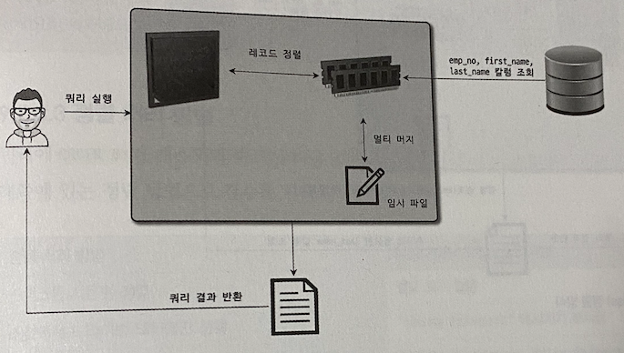

> 최신 버전 기준 일반적으로 싱글패스 정렬 방식을 주로 사용한다.

`투 패스 정렬 방식`
- 소트버퍼에 **정렬 기준 컬럼과 프라이머리 키 값만 담에 정렬을 수행하는 방식**

```sql
SELECT emp_no, fisrt_name, last_name
    FROM employees
    ORDER BY first_name;
```
- 정렬 수행이후 프라이머키로 다시 테이블을 읽어 SELECT 대상 컬럼을 가져와 클라이언트 에게 전달한다.
- 싱글패스 도입 이전부터 사용하던 방식이고, 8.0 기준 특정 조건에서는 투 패스 정렬 방식을 사용한다.

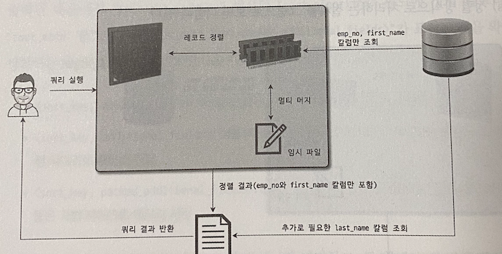

- 투 패스 방식을 사용하는 경우는 다음과 같다.
  1. 레코드의 크기가 `max_length_for_sort_data` 값 보다 클 경우
  2. BLOB/TEXT 타입 컬럼이 SELECT 대상에 존재하는 경우

> 싱글 패스 방식은, 정렬 대상 레코드 크기가 건수가 적은 경우 빠르고, 투 패스 방식은 정렬 대상 레코드 크기나 건수가 많은 경우 효율적이다.

`알아두면 좋은 내용`
- SELECT 쿼리에서 꼭 필요한 컬럼을 가져오도록 권장하는 이유가 위와 같은 이유때문이다.
- 정렬 버퍼를 몇 배 ~ 몇십 배 까지 비효율적으로 사용할 가능 성이 큼... 
- SELECT * (와일드카드) 는 가능하면 피할것..

#### 정렬 처리 방법
- 쿼리에 **ORDER BY** 가 사용되면, 반드시 아래 3가지 방법중 하나로 처리 된다.

| 정렬 처리 방법 | Extra 컬럼 내용 |
| --- | --- |
| 인덱스 사용 | 별도 표기 없음 |
| 조인에서 드라이빙 테이블만 정렬 | Using filesort |
| 조인에서 조인 결과를 임시 테이블로 저장 후 정렬 | Using temporary; Using filesort |

- 옵티마이저는, 정렬 버퍼를 활용한 정렬 (인덱스를 이용한 정렬을 할 수 없을 때) 을 할때 레코드를 최소화 하기 위해 2가지 방법중 하나를 선택한다.
  - 조인의 드라이빙 테이블만 정렬 후 조인
  - 조인이 끝나고 일치하는 레코드를 모두 가져온 뒤 정렬
- 가능하면 드라이빙 테이블만 정렬후 조인하는 것이 레코드 수가 적기 때문에 효율적이다.

`인덱스를 이용한 정렬`
- 인덱스를 활용하기 위한 제약 조건
  - ORDER BY 에 명시된 컬럼이 드라이빙 테이블에 속해야 한다.
  - ORDER BY 순서대로 생성된 인덱스가 존재해야 한다
  - WHERE 절에 첫 번째로 읽는 테이블의 칼럼에 대한 **조건이 있다면 해당 조건과 ORDER BY 는 같은 인덱스를 사용할 수 있어야 한다.**
  - B-Tree 인덱스 계열이 아니라면 사용할 수 없다
  - 여러 테이블이 조인되는 경우라면, NL 조인에서만 사용할 수 있다.
- 인덱스를 통해 정렬이 처리된다면, 별도로 정렬을 위한 추가작업을 수행하지 않는다.

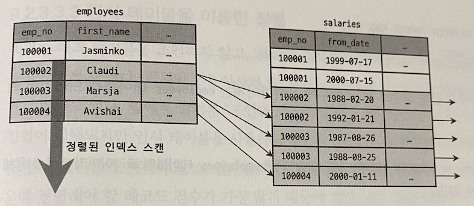

`조인의 드라이빙 테이블만 정렬`
- 일반적으로 조인이 수행되면, 레코드 건수와 크기가 몇배로 불어나게 된다.
- 때문에 조인을 수행하기 전, 드라이빙 테이블을 먼저 정렬한 뒤 조인을 실행하는 것이 차선책
- 이 방법을 사용하려면 드라이빙 테이블의 컬럼만으로 ORDER BY 를 작성해야 한다.

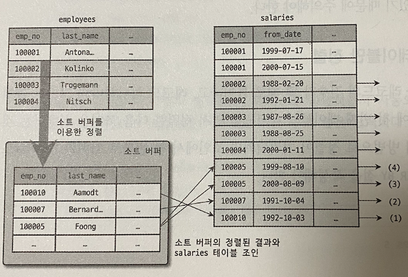

`임시 테이블을 이용한 정렬`
- 2개 이상의 테이블을 조인해서 정렬해야 한다면, 임시 테이블이 필요할 수 있다.
- 앞서 살펴본 방식 외의 패턴의 쿼리에서는 **항상 조인의 결과를 임시테이블에 저장하고, 그 결과를 다시 정렬** 한다.
  - 정렬 3가지 방법중 가장 느린 방식
  - 레코드 건수와 크기가 가장 많기 때문...


#### 정렬 처리 방법의 성능 비교
- WHERE 절을 아무리 인덱스를 잘 타도록 튜닝해도, ORDER BY / GROUP BY 때문에 쿼리가 느려지는 경우가 자주 발생한다.
- 인덱스를 사용하지 못하는 정렬/그루핑의 경우 왜 느릴수 없는지 살펴보자.
- 쿼리가 처리되는 방식을 스트리밍/버퍼링 2가지 방식으로 구분할 수 있다.

#### 스트리밍 방식
- 조건에 일치하는 레코드가 검색될 때 마다 바로바로 클라이언트로 전송해주는 방식
- 쿼리가 얼마나 많은 레코드를 조회하냐와 관계 없이 빠른 응답 시간을 보장해준다.
- LIMIT 과 같이 결과 건수를 제한하는 조건들은 전체 실행 시간을 상당히 줄여준다.

#### 버퍼링 방식
- ORDER BY / GROUP BY 는 스트리밍 처리를 불가능하게 한다.
  - 정렬/그루핑 처리가 필요하기 때문...
- 결과를 모아 MySQL 서버에서 일괄 가공해야하기 때문에 모든 결과를 스토리지 엔진으로 부터 받을동안 대기해야 한다.

> ORDER BY 3가지 정렬방식 중 **인덱스를 사용한 방법은 스트리밍 방식** 이고 나머지는 버퍼링 방식으로 처리된다. <br/>
> 가능하면 인덱스를 사용하되 최소한 드라이빙 테이블만이라도 정렬하도록 튜닝하는 것도 좋은 방법이다.

#### 정렬 관련 상태 변수
- MySQL 서버는 주요 작업에 대해 해당 작업의 실행 횟수를 상태 변수로 저장한다.

| Variables | Value |
| --- | --- |
| Sort_merge_passes | 0 |
| Sort_range | 0 |
| Sort_rows | 0 |
| Sort_scan | 0 |

- Sort_merge_passes : 멀티 머지 처리 횟수
- Sort_range : 인덱스 레인지 스캔을 통해 검색된 결과에 대한 정렬 횟수
- Sort_rows : 지금까지 정렬한 전체 레코드 건수
- Sort_scan : 풀 테이블 스캔을 통해 검색된 결과에 대한 정렬 작업 횟수

### GROUP BY 처리
- ORDER BY 와 같이 스트리밍 처리를 할 수 없게 한다.
- **GROUP BY 에 사용된 조건은 인덱스를 통해 처리할 수 없다.**
  - HAVING 절을 튜닝하려고 인덱스 생성등 고민할 필요가 없음 (이미 사용된 인덱스 재사용이 안된다는 의미 인듯)
- GROUP BY 도 인덱스를 사용하는 경우, 사용하지 않는 경우로 나눌 수 있다.
  - 인덱스를 사용한다면 인덱스 스캔/루스 인덱스 스캔으로 나뉨
  - 사용하지 않는다면 임시 테이블을 사용

#### 인덱스 스캔 방식
- 조인과 마찬가지로 드라이빙 테이블에 속한 컬럼만으로 그루핑 할때 인덱스가 존재한다면 해당 인덱스를 차례로 읽으면서 그루핑 작업을 수행하고 이어서 조인을 처리한다.
- GROUP BY 가 인덱스를 통해 처리된다면 추가 정렬 작업이나 임시 테이블을 사용하지 않는다.
  - 인덱스를 통해 처리되더라도 그룹 함수등을 사용하는 경우 임시 테이블이 필요한 경우도 있음
- Extra 컬럼에 group by/임시 테이블/정렬 관련 표기가 되지 않는다.

#### 루스 인덱스 스캔 방식
- Extra 컬럼에 `Using Index for group-by` 가 표기된다.
- MySQL 루스 인덱스 스캔은 단일 테이블에 대해 수행되는 GROUP BY 처리에만 사용할 수 있다.
  - Prefix Index 에는 사용 불가
- 별도 임시 테이블이 필요하지 않음

```sql
// 인덱스 : (emp_no, from_date)
explain select emp_no
from salaries
where from_date = '1985-03-01'
group by emp_no;
```
- salaries 의 인덱스를 살펴보면 인덱스 레인지 스캔을 사용할 수 없다.

#### 임시 테이블 방식
- GROUP BY 의 기준 칼럼이 인덱스를 전혀 사용하지 못할 경우 사용되는 방식
- Extra 컬럼에 `Using temporary` 가 표기된다.
- MySQL 8.0 이전 버전까지는 GROUP BY 가 사용된 쿼리는 그루핑 칼럼 기준으로 **묵시적 정렬** 까지 수행했다.
- 8.0 버전부터는 GROUP BY 사용시 **유니크 인덱스를 가진 임시 테이블믄 만들어 중복제거/집합함수 연산을 수행** 한다.
  - 별도 정렬 작업 없이 GROUP BY 가 처리됨
  - 8.0 에서도 **GROUP BY ORDER BY 가 같이 사용되면 명시적인 정렬 작업을 실행** 한다.

`참고`
- MySQL 5.7 까지는 GROUP BY 사용시 묵시적 정렬을 수행하기 때문에 정렬이 필요하지 않은 경우 ORDER BY NULL 을 사용해 정렬 수행을 하지 않도록 했다.
- 8.0 부터는 묵시적 정렬을 수행하지 않으므로 불필요해 짐

### DISTINCT 처리
- 특정 칼럼의 유니크한 값만 조회하는 방법
- DISTINCT 는 **집합 함수와 함께 사용되는 경우** 와 **집합 함수를 사용하지 않는 경우** 2가지로 구분해 살펴보아야 한다.

#### 집합 함수를 사용하지 않는 경우
- 단순히 유니크한 레코드를 가져오고자 할때 사용하는 방법
- GROUP BY 와 동일한 방식으로 처리 된다.

#### 집합 함수와 함께 사용되는 경우
- 집합 함수 내에서 DISTINCT 키워드가 사용될 수 있다.
- 그 집합 **함수의 인자로 전달된 칼럼 값이 유니크한 것** 들을 가져오게 된다.

```sql
explain select count(distinct s.salary)
from employees e, salaries s
where e.emp_no = s.emp_no
and e.emp_no between 100001 and 100100;
```
- 위 쿼리는 `count(distinct s.salary)` 를 처리하기 위해 임시 테이블을 생성한다.
- employees, salaries 테이블을 조인한 결과에서 salary 칼럼의 값만 저장하기 위한 임시 테이블을 생성함
- salary 칼럼의 유니크 인덱스가 생성되기 때문에 레코드 건수가 많다면 상당히 느려질 수 있음
- `count(distinct ...)` 를 하나 더 추가한다면 해당 값을 저장하는 임시 테이블이 하나 더 필요하게 된다.
  - 집계 함수 + distinct 조합을 사용할 때 마다 임시 테이블이 생성된다고 이해하면 쉽다.
- 지금 까지는 **인덱스를 사용할 수 없는 경우** 의 예시
- 인덱스를 사용할 수 있다면, 인덱스 풀스캔/레인지 스캔 하면서 임시 테이블 없이 최적화가 가능해 진다.

### 내부 임시 테이블 활용
- MySQL 엔진이 스토리지 엔진으로 부터 받은 레코드를 정렬/그루핑 시 내부 임시 테이블을 사용한다
  - CREATE TEMPORARY TABLE 명령으로 만든 임시테이블과 다름
- 일반적으로 MySQL 엔진이 사용하는 임시테이블은 메모리에 생성됬다가 크기가 커지면 디스크로 옮겨짐
- 내부적인 가공을 위해 생성하는 임시테이블은 다른 세션/쿼리에서 접근이 불가능하고, 쿼리 처리 완료시 자동으로 제거된다.

#### 메모리 임시 테이블과 디스크 임시 테이블
- 8.0 이전 까지는 메모리 임시테이블의 경우 MEMORY 스토리지 엔진을, 디스크에 저장되는 경우 MyISAM 스토리지 엔진을 사용 했다.
- 8.0 버전 부터는 메모리의 경우 TempTable 스토리지 엔진을, 디스크의 경우 InnoDB 스토리지 엔진을 사용하도록 변경되었다.
- MEMORY 엔진의 경우 VARBINARY, VARCHAR 같은 가변길이 타입을 지원하지 못했기 때문에, 최대 길이만큼 메모리를 할당하는 문제가 있었음
  - 메모리 낭비가 심함
- MyISAM 엔진의 경우 트랜잭션을 지원하지 못하는 문제가 있었음
- 8.0 버전부터 `internal_tmp_mem_sotrage_engine` 시스템 변수로 메모리 임시테이블을 선택할 수 있다
  - 기본값은 TempTable
- `temptable_max_ram` 시스템 변수로 최대 메모리 공간 크기를 설정할 수 있음
  - 기본값은 1GB
- 임시 테이블의 크기가 최대 크기를 넘어서는 경우 디스크에 기록하게 되는데, 2가지 방식중 하나를 선택한다.
  - MMAP 파일 사용
  - InnoDB 테이블 사용
- `temptable_use_mmap` 시스템 변수로 둘 중 하나의 방식 으로 선택이 가능하다.
  - 기본 값은 ON (MMAP)
  - MMAP 파일로 전환하는 것이 InnoDB 전환 보다 오버헤드가 적기 때문
  - tmpdir 시스템 변수에 정의된 디렉터리에 저장된다.
- 내부 임시 테이블이 처음부터 디스크에 생성되는 경우도 존재한다.
  - `internal_tmp_disk_storage_engine` 시스템 변수로 설정
  - 기본값은 InnoDB

#### 임시 테이블이 필요한 쿼리
- 다음 아래 패턴의 쿼리는, 대표적으로 내부 임시 테이블을 생성하는 케이스 이다.
1. ORDER BY 와 GROUP BY 에 명시된 컬럼이 다른 경우
2. ORDER BY 나 GROUP BY 에 명시된 컬럼이 드라이빙 테이블이 아닌 경우
3. DISTINCT 와 ORDER BY 가 동시에 존재하거나 DISTINCT 가 인덱스로 처리하지 못하는 경우
4. UNION 이나 UNION DISTINCT 가 사용된 경우 (select_type 이 UNION RESULT)
5. select_type 이 DERIVED 인 경우

- 임시 테이블 사용 여부는 Extra 컬럼에 `Using temporary` 메세지를 확인하면 된다.
- 3,4,5 번의 경우에는 위 메세지가 표시되지 않으므로 주의
- 1,2,3,4 번은 유니크 인덱스가 존재하는 임시테이블이 생성되고, 5번은 유니크 인덱스가 없는 임시 테이블이 만들어진다.

> 유니크 인덱스가 존재하면 처리 성능이 상당히 느리므로 주의

`참고`
- 8.0 이전 버전까지는 `UNION ALL` 쿼리도 항상 내부 임시테이블을 생성했다
- 8.0 부터는 사용하지 않도록 개선됨

#### 임시 테이블이 디스크에 생성되는 경우
- UNION, UNION ALL 의 SELECT 컬럼 중 512 바이트 이상 크기가 존재하는 경우
- GROUP BY 나 DISTINCT 컬럼중 512 바이트 이상 크기가 존재하는 경우
- 메모리 임시 테이블 크기가 지정한 시스템 변수보다 큰 경우

`참고`
- 8.0.13 버전 이전까지는 BLOB/TEXT 컬럼의 경우 디스크 생성했었다.
- 이후에는 메모리 에 생성하도록 개선됨 (TempTable 인 경우)
  - MEMORY 스토리지 엔진이라면 디스크에 생성되므로 유의

#### 임시 테이블 관련 상태 변수
- 임시 테이블이 디스크에 생성됬는지 확인하려면 MySQL 서버의 상태 변수를 활용하면 된다

```sql
SHOW SESSION STATUS LIKE 'Created_tmp%';
```

| Variables | Value |
| --- | --- | 
| Created_tmp_disk_tables | 0 |
| Created_tmp_tables | 1 |

- Created_tmp_tables : 내부 임시 테이블이 만들어진 개수를 누적
- Created_tmp_disk_tables : 디스크에 내부 임시 테이블이 만들어진 개수를 누적

## 고급 최적화
- 옵티마이저는 통계 정보와 옵티마이저 옵션을 결합해 최적의 실행 계획을 수립한다.
- 옵티마이저 옵션은 **조인 관련 옵티마이저 옵션**과 **옵티마이저 스위치** 로 구분한다.

### 옵티마이저 스위치 옵션
- `optimizer_switch` 시스템 변수로 설정하는데, 여러 옵션을 세트로 묶어 설정하는 방식이다.

| 옵티마이저 스위치 이름 | 기본값 | 설명 |
| --- | --- | --- |
| batched_key_access | off | BKA 조인 알고리즘 사용 여부 |
| block_nested_loop | on | Block NL 조인 알고리즘 사용 여부 |
| engine_condition_pushdown | on | Engine Condition Pushdown 사용 여부 |
| index_condition_pushdown | on | Index Condition Pushdown 사용 여부 |
| use_index_extensions | on | Index Extension 최적화 사용 여부 |
| index_merge | on | Index Merge 최적화 사용 여부 |
| index_merge_intersection | on | Index Merge Intersection 최적화 사용 여부 |
| index_merge_sort_union | on | Index Merge Sort Union 최적화 사용 여부 |
| index_merge_union | on | Index Merge Union 최적화 사용 여부 |
| mrr | on | MRR 최적화 사용 여부 |
| mrr_cost_based | on | 비용기반 MRR 최적화 사용 여부 |
| semijoin | on | 세미조인 최적화 사용 여부 |
| firstmatch | on | FirstMatch 세미조인 최적화 사용 여부 |
| loosescan | on | LooseScan 세미조인 최적화 사용 여부 |
| materialization | on | Materialization 최적화 사용 여부 |
| subquery_materialization_cost_based | on | 비용기반 Materialization 최적화 사용 여부 |

- 각 옵션은 default, on, off 중 설정이 가능하다.
- 옵티마이저 스위치 옵션은 글로벌/세션 모두 설정가능한 시스템 변수
    - SER_VAR 를 통해 현재 쿼리에만 설정도 가능하다.
  
```sql
SET GLOBAL optimizer_switch='index_merge=on';
SET SESSION optimizer_switch='index_merge=on';

SELECT /*+ SET_VAR(optimizer_switch='index_merge=on')*/
...
FROM ...
```

#### MRR 과 BKA 조인 알고리즘
- MRR (Multi-Range Read) 은 DS-MRR (Disk Sweep Multi-Range Read) 라고도 한다.
- 기본적으로 지원하던 조인 방식은 NL 조인 방식 을 사용했다.
- MySQL 구조상 조인 처리는 MySQL 엔진이 처리하지만, 레코드를 검색하고 읽는 부분은 스토리지 엔진이 담당한다.
  - 드라이빙 테이블의 레코드 건별로 드리븐 테이블의 레코드를 찾으면 스토리지 엔진 레벨에서 최적화는 아무것도 할 수 없음
- 최적화를 위해 조인 대상 테이블중 레코드 하나를 읽어 조인 버퍼에 버퍼링 해둔다
  - 버퍼가 가득차면 스토리지 엔진을 통해 한번에 레코드를 읽어 들임
- 이러한 방식은 MRR 이라고하고, MRR 을 응용한 조인 방식은 BKA (Batched Key Access) 조인 이라고 한다.
  - BKA 이 무작정 좋은것은 아니다.
  - 부가적인 정렬이 필요하면 오히려 역효과를 볼때도 있음
  - 기본값은 OFF

#### 블록 네스티드 루프 조인
- MySQL 에서 사용되는 대부분의 조인은 NL 조인
  - 조인 조건이 되는 컬럼에 모두 인덱스가 있는 경우 사용되는 방식
- 버퍼를 사용하지 않고 즉시 레코드를 찾아 반환한다
- 블록 네스티드 루프 조인은, 조인 버퍼 사용여부/드라이빙, 드리븐 테이블이 어떤 순서로 조인되느냐에 차이가 있다
- 한 가지 재밌는 점은, 조인 버퍼가 사용되는 쿼리에서는 조인 순서가 반대인것 처럼 동작한다.
  - A -> B 순으로 조인이 되었다면, B -> A 순 인것처럼 동작
  - 드라이빙 테이블의 결과를 버퍼에 담아두고, 드리븐 테이블을 먼저 읽어 조인 버퍼에서 조인을 수행

> 이러한 이유 탓에 조인 버퍼가 사용되는 조인에서는 결과의 정렬 순서가 흐트러질 수 있다.

#### 인덱스 컨디션 푸시다운
- 5.6 버전부터 추가된 기능
- 인덱스를 범위제한 조건으로 사용하지 못하더라도 인덱스에 포함된 칼럼의 조건이 존재한다면 스토리지 엔진으로 전달하는 방식

```sql
// ix_lastname_fisrtname
SELECT * FROM employees WHERE last_name = 'Action' AND first_name LIKE '%sal';
```
- 위 쿼리의 경우 last_name 은 인덱스를 사용할 수 있지만 first_name 은 인덱스를 사용할 수 없음
- 때문에 last_name = 'Action' 인 레코드에 대해서 풀스캔을 해야할 수도 있는 상황
- ICP 의 경우 이런 인덱스 컬럼까지 활용가능하게 스토리지 엔진으로 내려보낸다.
- 스토리지 엔진에서 전달받은 **first_name 인덱스 컬럼** 을 평가해 %sal 에 해당하는 레코드만 읽어 들이게 됨
  - 실질적인 I/O 횟수가 줄어듦
  
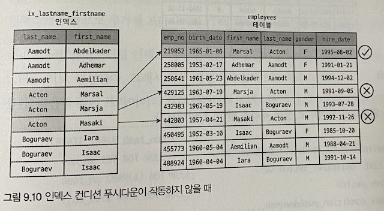

#### 인덱스 확장 (use_index_extension)
- `use_index_extension` 옵션은 InnoDB 스토리지 엔진을 사용하는 테이블에서 세컨더리 인덱스에 자동으로 추가된 PK 를 활용할 수 있게 해주는 옵션이다.
  - 모든 세컨더리 인덱스는 리프 노드에 프라이머리 키 값을 가짐
- MySQL 이전 버전에서는 아래 쿼리와 같은 경우 프라이머리 키를 잘활용하지 못했으나 이 옵션을 통해 개선됨
  
```sql
SELECT COUNT(*) FROM dept_emp WHERE from_date = '1987-07-25' AND dept_no='d001';
```

#### 인덱스 머지 (index_merge)
- 인덱스를 이용한 쿼리의 경우 대부분의 옵티마이저는 **테이블 별 인덱스 하나만 사용하도록 실행계획을 수립** 한다
- 인덱스 머지를 사용하면 하나의 테이블에 대해 **2개 이상의 인덱스를 이용해 처리** 할 수 있게 됨
- 인덱스 머지는 다음 3가지 세부 계획으로 나눠 볼 수 있다
  - index_merge_intersection
  - index_merge_sort_union
  - index_merge_union

> 하나의 인덱스로 작업 범위를 충분히 줄일수 있다면 인덱스 머지를 사용하지 않는다. <br/>
> 쿼리에 사용된 각 조건이 서로 다른 인덱스가 사용가능 하고 해당 조건을 만족하는 레코드가 많은 경우 인덱스 머지를 사용함

`인덱스 머지 - 교집합 (index_merge_intersection)`
- 여러 개의 인덱스를 각각 검색해 그 결과의 **교집합** 을 반환하는 방식
- Extra 컬럼에 Using intersect 라고 표기됨

`인덱스 머지 - 합집합 (index_merge_union)`
- WHERE 절에 사용된 2개 이상의 조건이 각각의 인덱스를 사용하되, OR 연산으로 연결된 경우 사용되는 최적화
- Union 알고리즘을 사용
  - 인덱스를 사용하기 때문에 PK 키로 정렬되어 있음
  - 이를 활용해 중복 레코드를 필터링
  - 이 때 우선순위 큐 알고리즘을 사용한다.
- Extra 컬럼에 Using union 라고 표기됨

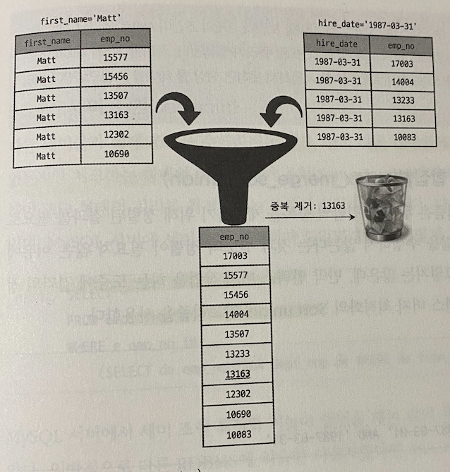

`인덱스 머지 - 정렬 후 합집합 (index_merge_sort_union)`
- 인덱스 머지 작업중 결과의 정렬이 필요한 경우도 있는데, 이럴 때 Sort Union 알고리즘을 사용한다.
- 이 방식에서는 중복 제거를 위해 우선순위 큐를 사용하는 것이 불가능
- 각 집합을 pk 로 정렬 한 뒤 중복 제거를 수행하는 방식
- Extra 컬럼에 Using sort_union 라고 표기됨

#### 세미 조인
- 세미조인 은, 다른 테이블과 조인을 수행하지 않고, **조건이 일치하는 레코드가 있는지 체크** 만 하는 쿼리 이다.
- 5.7 버전은 세미 조인 쿼리 최적화가 상당히 취약했다.

```sql
SELECT * FROM employees e
WHERE e.emp_no IN (SELECT de.emp_no FROM dept_no de WHERE de.from_date='1995-01-01');
```
- 일반적인 DBMS 라면 위 쿼리가 수행될때 서브 쿼리가 먼저 실행되고, employees 테이블에서 일치하는 레코드만 검색할 것이다.
- 하지만 MySQL 5.7 버전의 경우 employees 테이블을 풀 스캔해 한건 한건 서브쿼리 조건과 비교하는 식으로 동작하는 문제가 있었음
- 세미 조인 쿼리와 안티 세미 조인 쿼리는 최적화 방법이 다양하다.

`세미 조인 쿼리 최적화 (=, IN)`
- 세미 조인 최적화
- IN-to-EXISTS 최적화
- MATERIALIZATION 최적화

`안티 세미 조인 쿼리 최적화 (<>, NOT IN)`
- IN-to-EXISTS 최적화
- MATERIALIZATION 최적화

- 세미 조인 최적화는 다시 5가지로 구분이 가능한데, 이들을 하나씩 살펴보자
  - Table Pull-out
  - Duplicate Weed-out
  - First Match
  - Loose Scan
  - Materialization

#### 테이블 풀-아웃 (Table Pull-out)
- 세미 조인의 서브 쿼리에 사용된 테이블을 **아우터 쿼리로 끄집어 내 조인 쿼리로 풀어내는 최적화 방식**
- Table Pull-out 은 사용 가능하면 항상 세미조인 보다 좋은 성능을 낸다.
- Extra 칼럼에 Using Table Pullout 라고 표기됨

```sql
SELECT * FROM employees e
WHERE e.emp_no IN (SELECT de.emp_no FROM dept_emp de WHERE de.dept_no='d009');
```
- 위 쿼리를 옵티마이저 테이블 풀-아웃 형태로 최적화 한 결과는 다음과 같다

```sql
SELECT * FROM employees e
JOIN dept_emp de
WHERE e.emp_no = de.emp_no
AND de.dept_no='d009';
```
- 서브 쿼리가 사라지고, JOIN 으로 재작성 된 것을 확인할 수 있다
- 모든 서브쿼리에 사용할 수 있는것은 아니며, 제약사항이 존재한다

`Table pullout 최적화의 제약사항 과 특징`
- 세미 조인 서브쿼리에서만 사용 가능
- 서브쿼리가 UNIQUE 인덱스나 프라이머리 키 룩업으로 결과가 1건인 경우에만 사용 가능
- 서브쿼리의 모든 테이블을 아우터 쿼리로 끄집어내 조인으로 풀 수 있다면 서브 쿼리는 사라진다
- "서브쿼리는 최대한 조인으로 풀어라" 와 같은 튜닝가이드가 많다. 이는 이 가이드를 그대로 실행하는 것

#### 퍼스트매치 (firstmatch)
- IN 형태의 서브쿼리를 EXISTS 형태로 튜닝한 것과 비슷하게 동작한다
- Extra 컬럼에 FirstMatch(e) 라고 표기됨

```sql
SELECT *
FROM employees e WHERE e.first_name='Matt'
AND e.emp_no IN (
    SELECT t.emp_no FROM titles t
    WHERE t.from_date BETWEEN '1995-01-01' AND '1995-01-30'
)
```
- FirstMatch 는 **조인** 으로 처리된다
- 위 쿼리를 기준으로 title 테이블의 조건에 일치하는 레코드 1건만 찾으면 됨
- 조인으로 풀어서 실행하면서 일치하는 첫번째 레코드만 검색하는 최적화

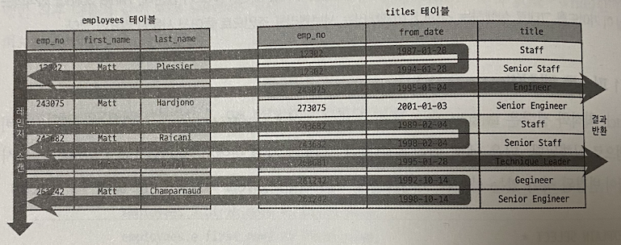

- MySQL 5.5 에서 수행했던 IN-to-EXISTS 최적화와 거의 비슷한 처리 로직을 수행한다

`Firstmatch 의 장점`
- In-to-EXISTS 에서는 **동등 조건 전파** 가 서브 쿼리 내에서만 가능했지만, 아우터 쿼리까지 전파가 가능하다
  - 기존 쿼리에 없던 동등 조건을 자동으로 추가하는 형태의 최적화
- 최종적으로 더 많은 조건이 주어지기 때문에 더 나은 실행 계획 수립이 가능
- In-to-EXISTS 에서 아무런 조건없이 변환가능한 경우 무조건 수행했음
- Firstmatch 의 경우 모든 테이블에 대해 수행할지, 일부 테이블에만 수행할지 선택 가능

`Firstmatch 의 제약사항과 특성`
- 하나의 레코드만 검색되면 검색을 멈추는 단축 실행경로 (Short-cut path) 이기 때문에 아우터가 먼조 조회되고 실행됨
- Extra 칼럼에 FirstMatch(table-N) 문구 표시
- 상관 서브쿼리에도 사용됨
- GROUP BY 나 집합함수가 사용시 최적화 안됨

#### 루스 스캔 (loosescan)
- GROUP BY 최적화의 루스 인덱스 스캔과 비슷한 방식
- LooseScan 최적화는 루스 인덱스 스캔으로 서브 쿼리 테이블을 읽고, 아우터 테이블을 드리븐 테이블로 사용해 조인을 수행하는 방식
- Extra 컬럼에 LooseScan 라고 표기됨

```sql
SELECT * FROM departments d WHERE d.dept_no IN (
    SELECT de.dept_no FROM dept_emp de
);
```

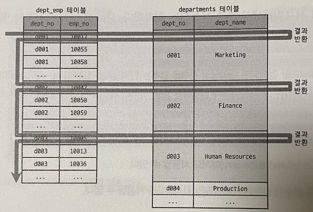

#### 구체화 (Materialization)
- 세미조인에 사용된 서브쿼리를 통으로 구체화해 쿼리를 최적화 한다는 의미
  - 내부 임시테이블을 생성함

```sql
SELECT *
FROM employees e
WHERE e.emp_no IN
    (SELECT de.emp_no FROM dept_emp de
      WHERE de.from_date='1995-01-01'
    );
```
- 위 쿼리는 FirstMatch 최적화 사용시 테이블 풀스캔이 발생한다.
- 이런 경우를 위해 서비쿼리 구체화 최적화 기능이 추가됨
- dept_emp 테이블을 먼저 읽어 임시 테이블을 생성하고, 해당 임시 테이블과 employees 테이블을 조인해 결과를 만들어 낸다
  - 서브 쿼리를 구체화 (임시테이블로) 한다고 이해하면 쉬울듯..
- 서브쿼리에 GROUP BY 가 존재하더라도 사용할 수 있다

`Materialization 의 제약사항과 특성`
- IN 서브쿼리에서는 상관 서브쿼리가 아니여야함
- 서브쿼리에 GROUP BY/집합함수가 사용되도 사용 가능
- 내부 임시 테이블이 사용됨
- `optimizer_swtich` 시스템 변수의 `semijoin` 과 `materialization` 이 활성화 되어있어야 한다.
- 기본적으로 둘다 활성화 되어 있음

#### 중복 제거 (Duplicated Weed-out)
- 세미조인 서브 쿼리를 일반적인 INNER JOIN 으로 바꾼뒤 실행하고 마지막에 중복된 레코드를 제거하는 방식

```sql
SELECT * FROM employees s
WHERE e.emp_no IN (SELECT s.emp_no FROM salaries s WHERE s.salaries > 150000);
```
- 위 쿼리는 중복된 emp_no 가 발생할 수 있는데 이를 GROUP BY 를 활용해 재작성 하면 다음과 같다.

```sql
SELECT * FROM employees s, salaries s
WHERE e.emp_no = s.emp_no AND s.salary > 150000
GROUP BY e.emp_no;
```
- 중복 제거 최적화는 위와 같이 INNER JOIN + GROUP BY 로 변경해 최적화 하는 방식이다
  - 조인 결과를 임시테이블에 저장함
- Extra 칼럼에 Start temporary End temporary 라고 표기됨
  - 조인이 수행되는 과정과 임시 테이블로 저장하는 과정이 반복적으로 실행된다

`Duplicated Weed-out 의 제약사항과 특성`
- 서브쿼리가 상관 서브쿼리여도 사용 가능
- 서브쿼리가 GROUP BY/집합 함수가 사용되면 사용 불가
- 서브쿼리의 테이블을 조인으로 처리하기에 최적화 가능한 방법이 많음

#### 컨디션 팬 아웃 (condition_fanout_filter)
- 조인을 수행할 때 테이블의 순서는 쿼리 성능에 매우 큰 영향을 미친다.
- 때문에 여러 테이블이 조인되는 경우 가능하다면 레코드 건수가 적은 순서대로 조인을 실행하게 됨
- 컨디션 팬 아웃은 explain 의 filtered 컬럼과 관련이 있다
- 인덱스를 사용할 수 있는 칼럼 외에도 나머지 조건에 대해서 얼마나 조건을 충족할지 고려한다.
- 조건을 만족하는 레코드 건수를 정확히 예측할 수 있다면 그만큼 더 빠른 실행 계획이 만들어 진다

`condition_fanout_filter 의 예측`
- 해당 옵션이 활성화 되면 다음 조건을 만족하는 컬럼의 조건들에 대해 조건을 만족하는 레코드 비율 계산이 가능하다
  - WHERE 조건 절에 인덱스가 존재하는 경우
  - WHERE 조건 절에 히스토그램이 존재하는 경우

`옵티마이저의 실행계획 수립`
- 옵티마이저는 테이블/인덱스의 통계정보만 활용해서 실행 계획을 수립하지 않는다.
- 다음 아래 4가지 방식순서대로 사용 가능한 방식을 활용한다.
  - 레인지 옵티마이저 (실제 쿼리 실행전 소량의 데이터를 빠르게 읽어 보는 방법)
  - 히스토그램
  - 인덱스 통계
  - 추측에 기반한 예측

#### 파생 테이블 머지 (derived_merge)
- 이전 버전에는 FROM 절 서브쿼리를 임시 테이블로 만든 뒤 외부 쿼리를 처리했다.
- 이렇게 FROM 절에 사용된 서브 쿼리를 파생 테이블 이라고 한다
  - 임시테이블을 생성하고 데이터를 넣는 과정에서 오버 헤드가 발생한다
  - 데이터가 많아지면 디스크까지 활용해야 하는 경우도 발생함
- 5.7 버전 부터 파생 테이블 을 외부 쿼리와 병합해 서브 쿼리를 제거하는 최적화가 도입됨
- `dervied_merge` 옵션은 이를 활성화 할지 여부를 결정한다
  - 예전에는 이런 작업을 DBA 가 수작업으로 많이 했었음

`서브쿼리를 외부 쿼리로 수동 병합하면 좋은 경우`
- 집계함수/윈도우 함수가 사용된 서브 쿼리
- DISTINCT 가 사용된 서브 쿼리
- GROUP BY/HAVING 이 사용된 서브 쿼리
- LIMIT 이 사용된 서브 쿼리
- UNION / UNION ALL 을 포함하는 서브 쿼리
- SELECT 절에 사용된 서브 쿼리
- 값이 변경되는 사용자 변수가 사용된 서브 쿼리

#### 인비저블 인덱스 (use_invisible_indexes)
- 8.0 버전 부터 인덱스의 가용 상태를 제어할 수 있는 기능이 추가되었다
- 8.0 이전에는 항상 해당 인덱스를 사용했지만 8.0 부터는 인덱스를 삭제하지 않아도 비활성화 가 가능하다

```sql
ALTER TABLE employees ALTER INDEX ix_hiredate INVISIBLE;
ALTER TABLE employees ALTER INDEX ix_hiredate VISIBLE;

SET optimizer_switch='use_invisible_indexes=on';
```

#### 스킵 스캔 (skip_scan)
- 인덱스의 핵심은 값이 정렬되어 있다는 점이다.
- 때문에 인덱스를 **구성하는 컬럼의 순서** 는 매우 중요
- 인덱스 스킵 스캔은 제한적이지만 인덱스의 제약 사항을 넘을 수 있는 최적화 기법
- 8.0 버전 부터 도입되었으며, 인덱스의 선행 칼럼이 조건절에 사용되지 않아도 후행 칼럼 조건만으로 인덱스가 사용 가능
  - 선행 칼럼의 소수의 유니크한 값으 가질 때만 사용한다.

```sql
SET optimizer_swtich='skip_scan=on';
```

#### 해시 조인 (hash_join)
- 8.0.18 버전 부터 추가된 기능
- 많은 사람들이 NL 조인 보다 해시조인이 빠르다고 생각하지만 항상 그렇지는 않다.

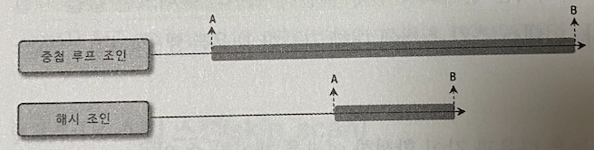

- 해시 조인은 첫 번째 레코드를 찾는게 느리지만 최종 레코드를 찾는 시간은 빠르다.
- NL 조인은 첫 번째 레코드를 찾는게 빠르지만 최종 레코드를 찾는 시간은 느리다.
- 이 둘의 특성을 고려하면 해시조인은 **최고 스루풋** 전략에 적합하고, NL 조인은 **최고 응답속도** 전략에 적합하다.
- MySQL 은 대부분의 경우 OLTP 용도로 사용하기에 최고 응답속도를 더 중요시 하도록 설계되었다.
- 주로 조인 조건의 칼럼의 인덱스가 없다거나, 조인 대상 테이블중 레코드 건수가 매우 적은 경우 등 에서만 해시 조인 알고리즘을 사용한다.
  - NL 조인이 적합하지 않은 경우에 대한 차선책 이라고 기억하면 좋다
- 8.0.17 버전 까지는 해시 조인이 없어 Block NL 조인을 사용 했다
- 8.0.18 과 8.0.19 버전에서는 equal join 시에만 해시 조인을 사용하고 안티조인이나 세미 조인은 Block NL 조인을 사용 했다
- 8.0.20 버전 부터는 Block NL 조인은 더이상 사용하지 않고 해시 조인으로 대체되었다
  - 때문에 BNL, NO_BNL 과 같은 힌트가 해시 조인을 유도하는 목적으로 사용된다

`해시 조인 처리 과정`
- 빌드 단계와 (Build-Phase) 프로브(Probe-Phase) 단계로 나눠 처리된다
- 빌드 단계
  - 조인 대상 테이블 중 레코드 건수가 적어 해시 테이블로 만들기 좋은 테이블을 선택해 해시 테이블을 생성한다
  - 이때 사용되는 원본 테이블을 **빌드 테이블** 이라고 한다
- 프로브 단계
  - 그외 나머지 테이블의 레코드를 읽어 해시 테이블의 일치 레코드를 찾는 과정
  - 이떄 사용되는 나머지 테이블을 **프로브 테이블** 이라고 한다

- 해시 테이블을 메모리에 저장할 때 조인 버퍼를 사용한다
  - 기본 크기는 256KB
- 해시 테이블을 생성한 뒤 프로브 테이블을 스캔하면서 레코드를 찾아 조인을 수행한다
- 조인 버퍼의 공간이 부족한 경우 빌드 테이블과 프로브 테이블을 적당한 청크 단위로 분리한 뒤 처리한다

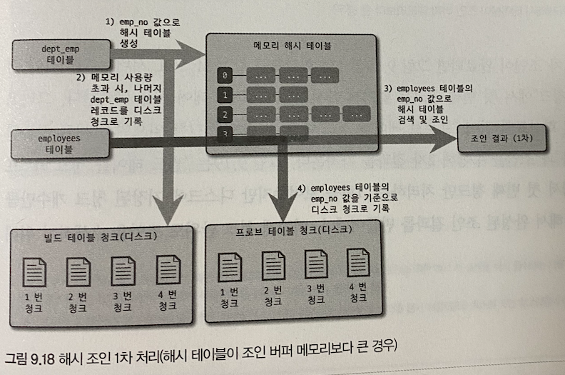
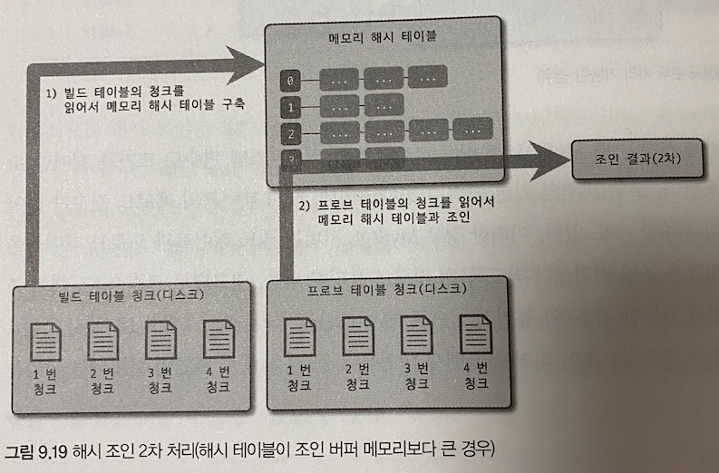

> 옵티마이저는 빌드 테이블의 크기에 따라 클래식 해시 조인/그레이스 해시 조인 알고리즘을 하이브리드 하게 활용하도록 구현되어 있다

#### 인덱스 정렬 선호 (prefer_ordering_index)
- 옵티마이저는 ORDER BY / GROUP BY 를 인덱스를 사용해 처리가 가능하다면 실행계획에서 인덱스의 가중치를 높게 설정한다.
- 이런 경우는 상황에 따라 오히려 비효율적일 수 있다.
- 때문에 8.0.21 버전 부터는 너무 가중치를 부여하지 않도록 `prefer_ordering_index` 옵션이 추가됬다.
  - 기본값은 ON

### 조인 최적화 알고리즘

#### Exhaustive 검색 알고리즘

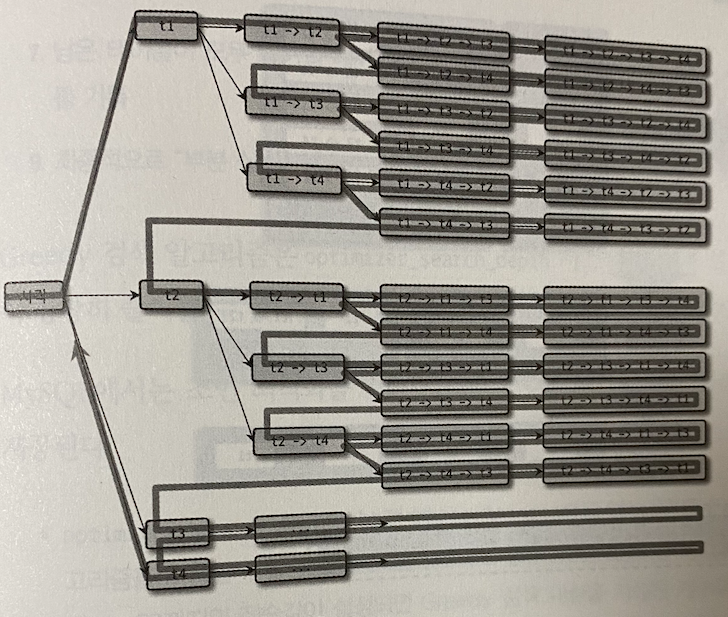

- 5.0 과 이전 버전에서 사용되던 최적화 알고리즘
- FROM 절에 명시된 모든 테이블의 조합에 대해 실행 계획 비용을 계산해 최적의 조합 하나를 찾는 방법
- 테이블 10개만 넘어도 실행 계획 수립시 몇 분이 걸린다.

#### Greedy 검색 알고리즘

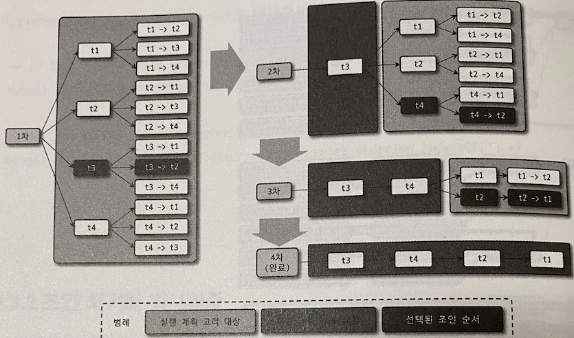

- Exhaustive 의 문제점을 해결하기 위해 도입된 방법

`최적화 과정`
1. 전체 테이블 중 `optimizer_search_depth` 시스템 변수의 정의된 갯수의 테이블로 가능한 `조인 조합을 생성` 한다
2. 1에서 생성된 조합을 최소 비용 계획을 선정 한다
3. 2번에서 선정된 계획의 첫 번째 테이블을 **부분 실행 계획** 의 첫 번째 테이블로 선정
4. 3번에서 선택된 테이블을 제외한 나머지 테이블로 1번 ~ 3 번 과정 진행
5. 4에서 선택된 테이블 제외하고... 이 과정의 반복
6. 부분 실행 계획의 조인 순서가 완서오디면 이를 사용하게 됨
- `optimizer_search_depth` 시스템 변수 값에 따라 최적화 비용은 상당히 줄어듦
  - 기본 값은 62

`optimizer_search_depth 와 optimizer_prune_level`
- optimizer_search_depth
  - Greedy/Exhaustive 알고리즘을 선택할 수 있는 변수
  - 0 ~ 62 사이 정수값 지정 가능
  - 0으로 지정되는 경우 최적의 테이블 갯수를 옵티마이저가 직접 산정한다
  - 이 설정 값과 테이블 개수에 따라 알고리즘이 결정됨
- optimizer_prune_level
  - 5.0 부터 추가된 Heuristic 검색 동작 방식을 제어
  - 이미 계산했던 조인 비용보다 크다면 중간에 포기한다
  - 이는 상당한 성능 차이를 냄
  - 1로 설정되면 활성화

## 쿼리 힌트
- 옵티마이저에게 쿼리 실행계획을 어떻게 수립해야 할지 알려주는 방법
- MySQL 의 쿼리 힌트는 2가지로 구분
  - 인덱스 힌트
    - 예전에 사용되던 `USE INDEX` 와 같은 것들 
  - 옵티마이저 힌트
    - 5.6 부터 새롭게 추가된 것들

### 인덱스 힌트
- SQL 문법에 맞춰 사용해야 하기 때문에 ANSI 표준을 준수하지 못한다는 단점
- SELECT 와 UPDATE 에만 사용가능 하며 인덱스 힌트보단 옵티마이저 힌트를 사용할 것을 권장

#### STRAIGHT_JOIN
- 옵티마이저 힌트와 동시에 종니 키워드
- 여러 테이블이 조인되는 경우 **조인 순서를 고정 하는 역할**
- 일반적으로 조인 컬럼의 인덱스 여부 와 레코드 적은 순으로 로 조인 순서가 결정된다
- FROM 절에 명시된 순서대로 조인 하도록 유도한다

```sql
SELECT /*! STRAIGHT_JOIN */
    e.first_name, e.last_name, d.dept_name
FROM employees e, dept_emp de, departments d
WHERE e.emp_no = de.emp_no
AND d.dept_no = de.dept_no;
```
- 이와 비슷한 역할을 하는 힌트는 다음 과 같다
  - JOIN_FIXED_ORDER
  - JOIN_ORDER
  - JOIN_PREFIX
  - JOIN_SUFFIX
- 첫번째를 제외한 3가지는 일부 테이블에 대해서만 순서를 제안하는 힌트이다

#### USE INDEX / FORCE INDEX / IGNORE INDEX
- 인덱스 힌트는 **인덱스를 가지고 있는 테이블 뒤에 힌트를 명시** 해야 한다
- 키워드 뒤에 사용할 인덱스 명을 괄호로 묶어서 사용하며, PK 는 PRIMARY 라고 명시하면 된다

`USE INDEX`
- 가장 자주 사용되는 힌트
- 특정 테이블의 인덱스를 사용하도록 권장
- 힌트를 준다고해서 항상 그 인덱스를 사용하는 것은 아니므로 주의

`FORCE INDEX`
- USE INDEX 와 차이는 없지만 옵티마이저에 영향이 더 크다
- USE INDEX 를 부여해도 그 인덱스를 사용하지 않는다면 FORCE INDEX 를 부여해도 사용하지 않았음
- 사용 하는 경우가 거의 없다고 보면 된다

`IGNORE INDEX`
- 특정 인덱스를 사용하지 못하게 하는 힌트
- 풀 테이블 스캔을 유도하는 용도로 사용


- 위 3가지 인덱스 모두 용도를 명시할 수 있는데, optional 하다.
- 힌트 용도가 명시되지 않으면 아래 3가지 용도로 사용한다
  - ... FOR JOIN : 테이블 조인 과 레코드 검색 용도로 사용
  - ... FOR ORDER BY : ORDER BY 용도로 사용
  - ... FOR GROUP BY : GROUP BY 용도로 사용

```sql
SELECT * FROM employees USE INDEX (primary) WHERE emp_no = 10001;
```
- 전문 검색 인덱스가 있따면 옵티마이저는 전문 검색 인덱스를 사용하는 경우가 많다.
  - PK 나 전문 검색 인덱스는 가중치를 줌
- 인덱스 사용이나 실행 계획 판단이 힘들다면 힌트를 사용하지 말것

> 가장 훌륭한 최적화는 쿼리를 없애거나, 튜닝할 필요가 없게 데이터를 최소화 하는것 <br/>
> 또는 데이터 모델의 단순화를 통해 쿼리를 간결하게 만드는 것이다.

#### SQL_CALC_FOUND_ROWS
- `SQL_CALC_FOUND_ROWS` 를 사용하면, LIMIT 을 만족하는 수만큼 레코드를 찾았더라도 끝까지 검색을 수행한다.
- 이 힌트가 사용된 쿼리 실행 후 `FOUND_ROWS()` 함수를 사용하면 조건을 만족하는 레코드가 전체 몇 건이었는지 알 수 있다.
- SQL_CALC_FOUND_ROWS 는 성능상 매우 안좋기 때문에 사용하지 않는 것이 좋다.
- 개발자 편의를 위해 만들어진 힌트

### 옵티마이저 힌트

#### 옵티마이저 힌트 종류
- 옵티마이저 힌트는 영향 범위에 따라 4개 그룹으로 분류가 가능
1. 인덱스 : 특정 인덱스 이름을 사용할 수 있는 힌트
2. 테이블 : 특정 테이블 이름을 사용할 수 있는 힌트
3. 쿼리 블록 : 특정 쿼리 블록에 사용 가능한 힌트 
4. 글로벌 (쿼리 전체) : 전체 쿼리에 영향을 미치는 힌트
- 위 구분으로 사용위치가 달라지는 것은 아니다
- 인덱스 이름이 명시되면 인덱스 수준 힌트
- 테이블 명이 명시되면 테이블 힌트

| 힌트 명 | 설명 | 범위 |
| --- | --- | --- |
| MAX_EXECUTION_TIME | 쿼리 실행시간 제한 | 글로벌 |
| RESOURCE_GROUP | 쿼리 실행의 리소스 그룹 설정 | 글로벌 |
| SET_VAR | 쿼리 실행을 위한 시스템 변수 제어 | 글로벌 |
| SUBQUERY | 서브 쿼리 세미조인 최적화 전략 제어 (MATERIALIZATION, INTOEXISTS) | 쿼리 블록 |
| BKA,NO_BKA | BKA 조인 사용 여부 제어 | 쿼리 블록, 테이블 |
| BNL, NO_BNL | Block NL 조인 사용 여부 제어 (해시조인) | 쿼리 블록, 테이블 |
| DERVIED_CONDITION_PUSHDOWN, NO_DERVIED_CONDITION_PUSHDOWN | 외부 쿼리 조건을 서브 쿼리로 옮기는 최적화 사용 여부 제어 | 쿼리 블록, 테이블 |
| HASH_JOIN, NO_HASH_JOIN | 해시조인 사용 여부 제어 | 쿼리 블록, 테이블 |
| JOIN_FIXED_ORDER | FROM 절 명시된 테이블 순으로 조인 실행 | 쿼리 블록 |
| JOIN_ORDER | 힌트에 명시된 순서대로 조인 실행 | 쿼리 블록 |
| JOIN_PREFIX | 힌트에 명시된 테이블을 조인 드라이빙 테이블로 조인 실행 | 쿼리 블록 |
| JOIN_SUFFIX | 힌트에 명시된 테이블을 조인 드리븐 테이블로 조인 실행 | 쿼리 블록 |
| SEMIJOIN, NO_SEMIJOIN | 서브쿼리의 세미조인 최적화 전략 제어 | 쿼리 블록 |
| MERGE, NO_MERGE | FROM 절 서브쿼리나 뷰를 외부 쿼리로 병합하는 최적화 수행 여부 제어 | 테이블 |
| INDEX_MERGE, NO_INDEX_MERGE | 인덱스 병합 실행계획 사용 여부 제어 | 테이블, 인덱스 |
| MRR, NO_MRR | Multi-Range-Read 사용 여부 제어 | 테이블, 인덱스 |
| NO_ICP | 인덱스 컨디션 푸시다운 최적화 전략 사용 여부 제어 | 테이블, 인덱스 |
| NO_RANGE_OPTIMIZATION | 인덱스 레인지 액세스 비활성화 (풀 테이블 스캔) | 테이블, 인덱스 |
| SKIP_SCAN, NO_SKIP_SCAN | 인덱스 스킵 스캔 사용 여부 제어 | 테이블, 인덱스 |
| INDEX, NO_INDEX | GROUP BY, ORDER BY, WHERE 절 처리를 위한 인덱스 사용 여부 제어 | 인덱스 |
| GROUP_INDEX, NO_GROUP_INDEX | GROUP BY 절 처리를 위한 인덱스 사용 여부 제어 | 인덱스 |
| JOIN_INDEX, NO_JOIN_INDEX | WHERE 절 처리를 위한 인덱스 사용 여부 제어 | 인덱스 |
| ORDER_INDEX, NO_ORDER_INDEX | ORDER BY 절 처리를 위한 인덱스 사용 여부 제어 | 인덱스 |

#### MAX_EXECUTION_TIME
- 옵티마이저 힌트 중 유일하게 실행 계획에 영향을 미치지 않는 힌트
- 쿼리 최대 실행 시간을 설정하는 힌트 밀리초 단위로 설정한다

```sql
SELECT /*+ MAX_EXECUTION_TIME(100) */
FROM employees 
ORDER BY last_name LIMIT 1;
```

#### SET_VAR
- 옵티마이저 힌트로 부족한 경우 `optimizer_switch` 시스템 변수를 제어 해야할 때가 있는데 해당 하는 경우 사용
- 조인버퍼나 소트버퍼를 일시적으로 늘려 대용량 처리 쿼리의 성능을 향상시키는 용도로도 사용한다.

```sql
SELECT /*+ SET_VAR(optimizer_switch='index_merge_intersection=off') */
FROM employees
WHERE first_name='Georgi' AND emp_no BETWEEN 10000 AND 20000; 
```

#### SEMIJOIN, NO_SEMIJOIN
- 세미 조인 힌트 종류는 다음과 같으며, 외부 쿼리가 아닌 서브 쿼리에 명시해야 한다.

| 최적화 전략 | 힌트 |
| --- | --- |
| Duplicate Weed-out | SEMIJOIN(DUPSWEEDOUT) |
| First Match | SEMIJOIN(FIRSTMATCH) |
| Loose Scan | SEMIJOIN(LOOSESCAN) |
| Materialization | SEMIJOIN(MATERIALIZATION) |
| Table Pull-put | 없음 |

#### SUBQUERY
- 세미 조인 최적화가 사용되지 못할 때 사용하는 최적화 방법
- 주로 IN 서브 쿼리에 사용되지만 안티 세미 조인 최적화시 사용할 수 없다

| 최적화 전략 | 힌트 |
| --- | --- |
| IN-to_EXISTS | SUBQUERY(INTOEXISTS) |
| Materialization | SUBQUERY(MATERIALIZATION) |

#### BNL, NO_BNL / HASHJOIN, NO_HASHJOIN
- MySQL 8.0.20 부터 BNL 이 더이상 사용되지 않음
- BNL 힌트를 사용하면 해시 조인을 사용하도록 힌트가 변경됬다

#### JOIN_FIXED_ORDER, JOIN_ORDER, JOIN_PREFIX, JOIN_SUFFIX
- STRAIGHT_JOIN 은 한번 사용 되면 FROM 절에 명시된 순서대로 조인의 순서가 결정되고, 일부는 강제하는 등 유연한 처리가 불가능 했다.
- 이를 보완하기 위한 4가지 힌트
  - JOIN_FIXED_ORDER : STRAIGHT_JOIN 과 동일
  - JOIN_ORDER : 힌트에 명시된 테이블 순으로 조인 실행
  - JOIN_PREFIX : 조인에서 드라이빙 테이블만 강제
  - JOIN_SUFFIX : 조인에서 드리븐 테이블만 강제

#### MERGE, NO_MERGE
- 예전 버전의 경우 MySQL 은 FROM 절 서브쿼리는 항상 내부 임시 테이블을 사용 했다
  - 이를 파생 테이블 이라고 함
- 5.7, 8.0 버전 부터 임시 테이블을 사용하지 않게 서브 쿼리를 외부 쿼리와 병합하는 최적화를 도입
- 이를 제어하는 힌트

#### INDEX_MERGE, NO_INDEX_MERGE
- MySQL 은 기본적으로 테이블당 하나의 인덱스만 이용해 쿼리를 처리한다.
- 검색 대상 범위를 충분히 좁히지 못하는 경우 여러 인덱스를 동시에 사용해서 처리하는데, 이를 인덱스 머지라고 한다
- 이를 제어하는 힌트

#### NO_ICP
- 옵티마이저는 가능하면 최대한 인덱스 컨디션 푸시다운 을 사용하는 방향으로 계획을 수립한다
- 하지만 이로 인해 잘못된 계획을 수립할 수도 있다
- 이를 제어하는 힌트

#### SKIP_SCAN, NO_SKIP_SCAN
- 인덱스 선행 컬럼에 대한 조건이 없더라도 옵티마이저가 해당 인덱스를 사용하게 해주는 최적화 기능
- 선행 칼럼의 유니크 값이 적을 수록 성능이 좋다
- 이를 제어하는 힌트

#### INDEX, NO_INDEX
- 예전 MySQL 에서 사용하던 인덱스 힌트를 대체하는 용도

| 인덱스 힌트 | 옵티마이저 힌트 |
| --- | --- |
| USE INDEX | INDEX |
| USE INDEX FOR GROUP BY | GROUP_INDEX |
| USE INDEX FOR ORDER BY | ORDER_INDEX |
| IGNORE INDEX |NO_INDEX |
| IGNORE INDEX FOR GROUP BY | NO_GROUP_INDEX |
| IGNORE INDEX FOR ORDER BY | NO_ORDER_INDEX |


## 참고
- https://ko.wikipedia.org/wiki/%ED%95%B4%EC%8B%9C_%EC%A1%B0%EC%9D%B8
