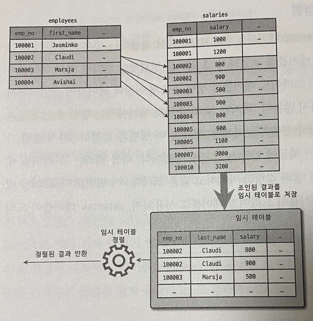

# 지옥 스터디 - 08 옵티마이저와 힌트
- MySQL 에서 explain 명령으로 **쿼리 실행 계획** 을 확인할 수 있다.
- 실행계획에 표시되는 내용을 제대로 이해하기 위해 옵티마이저가 실행하는 최적화에 대한 지식이 필요

## 개요
- 실행 계획을 살펴보기 전 먼저 알고 있어야할 몇 가지 사항에 대해 살펴보자

### 쿼리 실행 절차
- MySQL 이 쿼리를 실행하는 절차는 크게 3가지
1. SQL 파싱
   - 요청받은 SQL 문장을 잘게 쪼개 MySQL 이 이해할 수 있는 형태로 만듦 (파스 트리)
   - MySQL 서버의 **SQL 파서** 모듈로 처리
   - SQL 문법이 잘못 되었다면 이 단계에서 발견됨
2. 최적화 및 실행계획 수립
   - 파스 트리를 확인하면서 어떤 테이블을 어떤 인덱스를 사용해 테이블을 읽을 것인지 선택
   - MySQL 서버의 옵티마이저 에서 처리
   - 불필요한 조건을 제거하고, 복잡한 연산의 **단순화** 가 진행
   - 여러 테이블을 조인하고 있다면, **어떤 순서로 읽을지 결정**
   - 각 테이블의 조건과 인덱스 통계 정보를 활용해 **사용할 인덱스 결정**
   - 가져온 레코드를 임시 테이블에 넣어 **가공해야 하는지 결정**
   - 이 단계가 완료되면 **쿼리 실행 계획** 이 완성됨
3. 스토리지 엔진으로 부터 데이터 읽기
    - 2번에서 선택된 방법을 통해 스토리지 엔진으로 부터 데이터를 읽음
    - 레코드 **조인/정렬 작업 수행**

> 1/2 번 단계는 MySQL 엔진이, 3번 단계는 MySQL 엔진과 스토리지 엔진이 함께 처리한다

### 옵티마이저의 종류
- 옵티마이저는, 데이터베이스 서버의 **두뇌** 역할을 한다
- 옵티마이저는 크게, 비용 기반 최적화와 규칙 기반 최적화 둘로 나눌 수 있다

`비용 기반 최적화 (Cost-based optimizer, CBO)`
- 쿼리를 처리가능한 방법을 여러 가지로 만들어 놓고, 각 단위의 비용과 예측 통계정보를 통해 실행 계획별로 비용을 산출한다.
- 그 중 최소비용을 선택해 쿼리를 실행하는 방법

`규칙 기반 최적화 (Rule-based optimizer, RBO)`
- 레코드 건수나 선택도 등을 고려하지 않고 옵티마이저에 내장된 우선순위에 따라 실행계획을 수립하는 방식
  - 통계정보 등의 데이터는 고려하지 않는다
- 동일한 쿼리에 대해 항상 거의 동일한 결과를 만들어 낸다.

> 현재는 대부분 RDBMS 가 비용 기반의 옵티마이저를 사용한다.

## 기본 데이터 처리
- 결과물은 동일하더라도 RDBMS 별로 결과를 만드는 방법은 천자만별이다.
- 이런 기본적인 가공을 위해 MySQL 서버는, 어떤 알고리즘을 사용하는지 살펴봄

### 풀 테이블 스캔/풀 인덱스 스캔

`풀 테이블 스캔`
- **인덱스를 사용하지 않고 테이블의 데이터를 처음부터 끝까지 읽어 처리하는 방식**
- 아래 조건이 일치할때 주로 풀 테이블스캔을 사용한다
  - 레코드 건수가 너무 작아 **인덱스를 사용하는 것이 비용이 더 클경우**
  - WHERE, ON 절에 **인덱스가 없는 경우**
  - 인덱스 레인지 스캔이 가능하더라도, 조건일치 **레코드 건수가 너무 많은 경우** (20 ~ 25 %가 마지노선, 그 이상일 경우 인덱스 사용하는 것이 비용이 더 큶)
- 대부분의 DBMS 는 풀 테이블 스캔 실행시 한꺼번에 여러 블록이나 페이지를 읽어오는 기능을 내장하고 있음 (어느정도 최적화가 되어있다)
  - MyISAM 에서는 맞지만, InnoDB 에서는 다른 이야기..

`InnoDB 의 풀 테이블 스캔`
- InnoDB 엔진은 특정 테이블의 **연속된 데이터 페이지** 가 읽히면, 백그라운드 스레드가 리드 어헤드 작업을 수행한다 
  - 어떤 영역의 데이터가 앞으로 필요할 것이라 예측하여 요청전에 **미리 InnoDB 버퍼 풀에 읽어 두는것**
- 정리하면, 풀 테이블 스캔이 시작되었을때 몇 개 데이터 페이지는 포그라운드 스레드가 페이지를 읽어오지만, 특정 시점부터 읽기 작업은 백그라운드 스레드로 넘어간다. (리드 어헤드 작업)
  - 4 ~ 8 개 페이지 부터 읽기 시작해 최대 64 개 페이지 까지 읽어 버퍼풀에 저장
- `innodb_read_ahead_thredshold` 시스템 변수로 리드 어헤드 임계값을 설정할 수 있다.
- 리드 어헤드는, 풀 인덱스 스캔에서도 동일하게 사용된다.

### 병렬 처리
- MySQL 8.0 버전부터 한정되어 있긴하지만, 쿼리의 병렬처리가 가능하다.
  - 하나의 쿼리를 여러 스레드가 작업을 나눠 처리하는 것을 의미
  - 동시에 여러 쿼리를 처리한다는 것을 의미하는게 아님
- `innodb_parallel_read_threads` 시스템 변수로 스레드 수를 지정할 수 있다.
- 병렬처리를 유도하는 힌트나 옵션은 아직 존재하지 않는다.
- MySQL 8.0 기준 아래 쿼리와 같이 아무런 조건 없이 단순히 테이블 전체건수를 가져오는 경우에만 병렬로 처리가 가능하다.

```sql
SET SESSION innodb_parallel_read_threads=4;
SELECT COUNT(*) FROM salaries;
```
- 병렬 처리용 스레드는, CPU 코어 개수가 넘어 선다면 오히려 성능이 떨어질 수 있다.
  - I/O 가 발생하기 때문에... 당연한 이야기

### ORDER BY 처리 (Using filesort)
- explain 을 이용해 실행계획을 한번이라도 떠봤다면 한번쯤 봤을법한 실행 계획중 하나
  - 실행계획 Extra 컬럼에 Using filesort
- 정렬을 처리하는 방법은 인덱스를 이용하는 방법 과 Filesort 처리를 이용하는 방법 으로 나눌 수 있음

| - | 장점 | 단점 |
| --- | --- | --- |
| 인덱스 사용 | 인덱스가 정렬되어 있어 순서대로 읽기만 하면되므로 매우 빠름 | INSERT, UPDATE, DELETE 작업시 인덱스 때문에 속도가 느림, 인덱스 때문에 디스크/메모리 공간을 더 사용한다. |
| Filesort 사용 | 인덱스를 생성하지 않아도 된다, 레코드가 적다면 Filesort 가 메모리에서 처리되므로 빠르다 | 레코드 건수가 많아질수록 쿼리 응답속도가 느림 |

> 대용량 트래픽을 받는 서비스라면, 매 쿼리때 마다 정렬이라는 작업은 CPU 자원 소모가 크기 때문에 가능하면 피하는 것이 좋음.. (실제 이때문에 CPU 100% 친적 있음 ..)

#### 소트 버퍼
- 소트 버퍼란, **정렬을 수행하기 위해 할당 받아 사용하는 별도의 메모리 공간**
  - 세션 메모리 영역
- 정렬이 필요한 경우에만 할당되고, 크기는 가변적이다.
  - 최대 사용 공간은 `sort_buffer_size` 시스템 변수로 설정
- 실행 완료 후 즉시 반납된다.

`정렬이 문제되는 경우 ?`
- 정렬할 레코드가 매우 소량이라면 문제가 없다.
- 하지만 정렬할 레코드 건수가 소트 버퍼 공간보다 크다면 ?...
- 이런 경우 정렬할 레코드를 여러 조각으로 나눠서 처리하는데, 임시 저장을 위해 **디스크를 사용** 한다.
- 메모리의 소트버퍼에서 정렬하고, 임시로 디스크에 기록하고 ... 이 과정의 반복
- 각 버퍼의 크기만큼 정렬된 레코드를 다시 병합하면서 정렬을 수행해야하는데, 이를 **멀티 머지 (Multi-merge)** 라고 한다.
- 이 작업들은 모두 DISK I/O 가 발생하며, 레코드 건수가 많을수록 작업횟수도 늘어나기 때문에 부하가 크다.

> 일반적인 트랜잭션 처리용 MySQL 서버의 경우 56KB ~ 1MB 가 적당하다.

#### 정렬 알고리즘
- 레코드 정렬시, 싱글 패스 (Single-pass) 와 투 패스 (Two-pass) 2 가지 정렬 모드로 나눌 수 있다.
- 정렬 수행시 어떤 모드를 사용하는 지는, 옵티마이저 트레이스 기능으로 확인 가능하다.

```sql
SET OPTIMIZER TRACE="enabled=on" ,END_MARKERS_IN_JSON=on;
SET OPTIMIZER TRACE_MAX_MEM_SIZE=1000000;
```

- 옵티마이저 트레이스 기능을 사용하면 "sort_mode" 필드에 사용한 정렬 모드를 확인할 수 있다.

```json
// ...
"sort_mode": "<fixed_sort_key, packed_additional_fields>",
// ...
```

- MySQL 서버 정렬 방식은 세분화 하면 3가지 방식으로 구분이 가능하다.
1. <sort_key, rowid> : 정렬 키와, 레코드의 로우 아이디만 가져와서 정렬
2. <sort_key, additional_fields> : 정렬 키와 레코드 전체를 가져와 정렬, 칼럼들을 고정 사이즈 메모리로 저장한다.
3. <sort_key, packed_addtional_fields> : 정렬 키와 레코드 전체를 가져와 정렬, 칼럼들을 가변 사이즈 메모리로 저장한다.

- 1번 방식을, 투 패스 정렬 방식, 2/3번 방식을 싱글패스 방식이 라고 한다.

`싱글 패스 정렬 방식`
- 소트버퍼에 **정렬 기준 컬럼과 SELECT 대상이 되는 컬럼 모두를 담아 정렬을 수행하는 방식**

```sql
SELECT emp_no, fisrt_name, last_name
    FROM employees
    ORDER BY first_name;
```
- 위 쿼리를 싱글 패스 방식으로 정렬한다면, 정렬에 필요하지 않은 last_name 컬럼까지 전부 읽어 소트 버퍼에 담아 정렬을 수행한다.
- 그 후 정렬된 결과를 그대로 클라이언트에게 전달한다.


> 최신 버전 기준 일반적으로 싱글패스 정렬 방식을 주로 사용한다.

`투 패스 정렬 방식`
- 소트버퍼에 **정렬 기준 컬럼과 프라이머리 키 값만 담에 정렬을 수행하는 방식**

```sql
SELECT emp_no, fisrt_name, last_name
    FROM employees
    ORDER BY first_name;
```
- 정렬 수행이후 프라이머키로 다시 테이블을 읽어 SELECT 대상 컬럼을 가져와 클라이언트 에게 전달한다.
- 싱글패스 도입 이전부터 사용하던 방식이고, 8.0 기준 특정 조건에서는 투 패스 정렬 방식을 사용한다.


- 싱글패스를 사용하는 경우는 다음과 같다.
  1. 레코드의 크기가 `max_length_for_sort_data` 값 보다 클 경우
  2. BLOB/TEXT 타입 컬럼이 SELECT 대상에 존재하는 경우

> 싱글 패스 방식은, 정렬 대상 레코드 크기가 건수가 적은 경우 빠르고, 투 패스 방식은 정렬 대상 레코드 크기나 건수가 많은 경우 효율적이다.

`알아두면 좋은 내용`
- SELECT 쿼리에서 꼭 필요한 컬럼을 가져오도록 권장하는 이유가 위와 같은 이유때문이다.
- 정렬 버퍼를 몇 배 ~ 몇십 배 까지 비효율적으로 사용할 가능 성이 큼... 
- SELECT * (와일드카드) 는 가능하면 피할것..

#### 정렬 처리 방법
- 쿼리에 **ORDER BY** 가 사용되면, 반드시 아래 3가지 방법중 하나로 처리 된다.

| 정렬 처리 방법 | Extra 컬럼 내용 |
| --- | --- |
| 인덱스 사용 | 별도 표기 없음 |
| 조인에서 드라이빙 테이블만 정렬 | Using filesort |
| 조인에서 조인 결과를 임시 테이블로 저장 후 정렬 | Using temporary; Using filesort |

- 옵티마이저는, 정렬 버퍼를 활용한 정렬 (인덱스를 이용한 정렬을 할 수 없을 때) 을 할때 레코드를 최소화 하기 위해 2가지 방법중 하나를 선택한다.
  - 조인의 드라이빙 테이블만 정렬 후 조인
  - 조인이 끝나고 일치하는 레코드를 모두 가져온 뒤 정렬
- 가능하면 드라이빙 테이블만 정렬후 조인하는 것이 레코드 수가 적기 때문에 효율적이다.

`인덱스를 이용한 정렬`
- 인덱스를 활용하기 위한 제약 조건
  - ORDER BY 에 명시된 컬럼이 드라이빙 테이블에 속해야 한다.
  - ORDER BY 순서대로 생성된 인덱스가 존재해야 한다
  - WHERE 절에 첫 번째로 읽는 테이블의 칼럼에 대한 **조건이 있다면 해당 조건과 ORDER BY 는 같은 인덱스를 사용할 수 있어야 한다.**
  - B-Tree 인덱스 계열이 아니라면 사용할 수 없다
  - 여러 테이블이 조인되는 경우라면, NL 조인에서만 사용할 수 있다.
- 인덱스를 통해 정렬이 처리된다면, 별도로 정렬을 위한 추가작업을 수행하지 않는다.


`조인의 드라이빙 테이블만 정렬`
- 일반적으로 조인이 수행되면, 레코드 건수와 크기가 몇배로 불어나게 된다.
- 때문에 조인을 수행하기 전, 드라이빙 테이블을 먼저 정렬한 뒤 조인을 실행하는 것이 차선책
- 이 방법을 사용하려면 드라이빙 테이블의 컬럼만으로 ORDER BY 를 작성해야 한다.


`임시 테이블을 이용한 정렬`
- 2개 이상의 테이블을 조인해서 정렬해야 한다면, 임시 테이블이 필요할 수 있다.
- 앞서 살펴본 방식 외의 패턴의 쿼리에서는 **항상 조인의 결과를 임시테이블에 저장하고, 그 결과를 다시 정렬** 한다.
  - 정렬 3가지 방법중 가장 느린 방식
  - 레코드 건수와 크기가 가장 많기 때문...



#### 정렬 처리 방법의 성능 비교
- WHERE 절을 아무리 인덱스를 잘 타도록 튜닝해도, ORDER BY / GROUP BY 때문에 쿼리가 느려지는 경우가 자주 발생한다.
- 인덱스를 사용하지 못하는 정렬/그루핑의 경우 왜 느릴수 없는지 살펴보자.
- 쿼리가 처리되는 방식을 스트리밍/버퍼링 2가지 방식으로 구분할 수 있다.

#### 스트리밍 방식
- 조건에 일치하는 레코드가 검색될 때 마다 바로바로 클라이언트로 전송해주는 방식
- 쿼리가 얼마나 많은 레코드를 조회하냐와 관계 없이 빠른 응답 시간을 보장해준다.
- LIMIT 과 같이 결과 건수를 제한하는 조건들은 전체 실행 시간을 상당히 줄여준다.

#### 버퍼링 방식
- ORDER BY / GROUP BY 는 스트리밍 처리를 불가능하게 한다.
  - 정렬/그루핑 처리가 필요하기 때문...
- 결과를 모아 MySQL 서버에서 일괄 가공해야하기 때문에 모든 결과를 스토리지 엔진으로 부터 받을동안 대기해야 한다.

> ORDER BY 3가지 정렬방식 중 **인덱스를 사용한 방법은 스트리밍 방식** 이고 나머지는 버퍼링 방식으로 처리된다. <br/>
> 가능하면 인덱스를 사용하되 최소한 드라이빙 테이블만이라도 정렬하도록 튜닝하는 것도 좋은 방법이다.

#### 정렬 관련 상태 변수
- MySQL 서버는 주요 작업에 대해 해당 작업의 실행 횟수를 상태 변수로 저장한다.

| Variables | Value |
| --- | --- |
| Sort_merge_passes | 0 |
| Sort_range | 0 |
| Sort_rows | 0 |
| Sort_scan | 0 |

- Sort_merge_passes : 멀티 머지 처리 횟수
- Sort_range : 인덱스 레인지 스캔을 통해 검색된 결과에 대한 정렬 횟수
- Sort_rows : 지금까지 정렬한 전체 레코드 건수
- Sort_scan : 풀 테이블 스캔을 통해 검색된 결과에 대한 정렬 작업 횟수

### GROUP BY 처리
- ORDER BY 와 같이 스트리밍 처리를 할 수 없게 한다.
- **GROUP BY 에 사용된 조건은 인덱스를 통해 처리할 수 없다.**
  - HAVING 절을 튜닝하려고 인덱스 생성등 고민할 필요가 없음 (이미 사용된 인덱스 재사용이 안된다는 의미 인듯)
- GROUP BY 도 인덱스를 사용하는 경우, 사용하지 않는 경우로 나눌 수 있다.
  - 인덱스를 사용한다면 인덱스 스캔/루스 인덱스 스캔으로 나뉨
  - 사용하지 않는다면 임시 테이블을 사용

#### 인덱스 스캔 방식
- 조인과 마찬가지로 드라이빙 테이블에 속한 컬럼만으로 그루핑 할때 인덱스가 존재한다면 해당 인덱스를 차례로 읽으면서 그루핑 작업을 수행하고 이어서 조인을 처리한다.
- GROUP BY 가 인덱스를 통해 처리된다면 추가 정렬 작업이나 임시 테이블을 사용하지 않는다.
  - 인덱스를 통해 처리되더라도 그룹 함수등을 사용하는 경우 임시 테이블이 필요한 경우도 있음
- Extra 컬럼에 group by/임시 테이블/정렬 관련 표기가 되지 않는다.

#### 루스 인덱스 스캔 방식
- Extra 컬럼에 `Using Index for group-by` 가 표기된다.
- MySQL 루스 인덱스 스캔은 단일 테이블에 대해 수행되는 GROUP BY 처리에만 사용할 수 있다.
  - Prefix Index 에는 사용 불가
- 별도 임시 테이블이 필요하지 않음

```sql
// 인덱스 : (emp_no, from_date)
explain select emp_no
from salaries
where from_date = '1985-03-01'
group by emp_no;
```
- salaries 의 인덱스를 살펴보면 인덱스 레인지 스캔을 사용할 수 없다.

#### 임시 테이블 방식
- GROUP BY 의 기준 칼럼이 인덱스를 전혀 사용하지 못할 경우 사용되는 방식
- Extra 컬럼에 `Using temporary` 가 표기된다.
- MySQL 8.0 이전 버전까지는 GROUP BY 가 사용된 쿼리는 그루핑 칼럼 기준으로 **묵시적 정렬** 까지 수행했다.
- 8.0 버전부터는 GROUP BY 사용시 **유니크 인덱스를 가진 임시 테이블믄 만들어 중복제거/집합함수 연산을 수행** 한다.
  - 별도 정렬 작업 없이 GROUP BY 가 처리됨
  - 8.0 에서도 **GROUP BY ORDER BY 가 같이 사용되면 명시적인 정렬 작업을 실행** 한다.

`참고`
- MySQL 5.7 까지는 GROUP BY 사용시 묵시적 정렬을 수행하기 때문에 정렬이 필요하지 않은 경우 ORDER BY NULL 을 사용해 정렬 수행을 하지 않도록 했다.
- 8.0 부터는 묵시적 정렬을 수행하지 않으므로 불필요해 짐

### DISTINCT 처리
- 특정 칼럼의 유니크한 값만 조회하는 방법
- DISTINCT 는 **집합 함수와 함께 사용되는 경우** 와 **집합 함수를 사용하지 않는 경우** 2가지로 구분해 살펴보아야 한다.

#### 집합 함수를 사용하지 않는 경우
- 단순히 유니크한 레코드를 가져오고자 할때 사용하는 방법
- GROUP BY 와 동일한 방식으로 처리 된다.

#### 집합 함수와 함께 사용되는 경우
- 집합 함수 내에서 DISTINCT 키워드가 사용될 수 있다.
- 그 집합 **함수의 인자로 전달된 칼럼 값이 유니크한 것** 들을 가져오게 된다.

```sql
explain select count(distinct s.salary)
from employees e, salaries s
where e.emp_no = s.emp_no
and e.emp_no between 100001 and 100100;
```
- 위 쿼리는 `count(distinct s.salary)` 를 처리하기 위해 임시 테이블을 생성한다.
- employees, salaries 테이블을 조인한 결과에서 salary 칼럼의 값만 저장하기 위한 임시 테이블을 생성함
- salary 칼럼의 유니크 인덱스가 생성되기 때문에 레코드 건수가 많다면 상당히 느려질 수 있음
- `count(distinct ...)` 를 하나 더 추가한다면 해당 값을 저장하는 임시 테이블이 하나 더 필요하게 된다.
  - 집계 함수 + distinct 조합을 사용할 때 마다 임시 테이블이 생성된다고 이해하면 쉽다.
- 지금 까지는 **인덱스를 사용할 수 없는 경우** 의 예시
- 인덱스를 사용할 수 있다면, 인덱스 풀스캔/레인지 스캔 하면서 임시 테이블 없이 최적화가 가능해 진다.

### 내부 임시 테이블 활용
- MySQL 엔진이 스토리지 엔진으로 부터 받은 레코드를 정렬/그루핑 시 내부 임시 테이블을 사용한다
  - CREATE TEMPORARY TABLE 명령으로 만든 임시테이블과 다름
- 일반적으로 MySQL 엔진이 사용하는 임시테이블은 메모리에 생성됬다가 크기가 커지면 디스크로 옮겨짐
- 내부적인 가공을 위해 생성하는 임시테이블은 다른 세션/쿼리에서 접근이 불가능하고, 쿼리 처리 완료시 자동으로 제거된다.

#### 메모리 임시 테이블과 디스크 임시 테이블
- 8.0 이전 까지는 메모리 임시테이블의 경우 MEMORY 스토리지 엔진을, 디스크에 저장되는 경우 MyISAM 스토리지 엔진을 사용 했다.
- 8.0 버전 부터는 메모리의 경우 TempTable 스토리지 엔진을, 디스크의 경우 InnoDB 스토리지 엔진을 사용하도록 변경되었다.
- MEMORY 엔진의 경우 VARBINARY, VARCHAR 같은 가변길이 타입을 지원하지 못했기 때문에, 최대 길이만큼 메모리를 할당하는 문제가 있었음
  - 메모리 낭비가 심함
- MyISAM 엔진의 경우 트랜잭션을 지원하지 못하는 문제가 있었음
- 8.0 버전부터 `internal_tmp_mem_sotrage_engine` 시스템 변수로 메모리 임시테이블을 선택할 수 있다
  - 기본값은 TempTable
- `temptable_max_ram` 시스템 변수로 최대 메모리 공간 크기를 설정할 수 있음
  - 기본값은 1GB
- 임시 테이블의 크기가 최대 크기를 넘어서는 경우 디스크에 기록하게 되는데, 2가지 방식중 하나를 선택한다.
  - MMAP 파일 사용
  - InnoDB 테이블 사용
- `temptable_use_mmap` 시스템 변수로 둘 중 하나의 방식 으로 선택이 가능하다.
  - 기본 값은 ON (MMAP)
  - MMAP 파일로 전환하는 것이 InnoDB 전환 보다 오버헤드가 적기 때문
  - tmpdir 시스템 변수에 정의된 디렉터리에 저장된다.
- 내부 임시 테이블이 처음부터 디스크에 생성되는 경우도 존재한다.
  - `internal_tmp_disk_storage_engine` 시스템 변수로 설정
  - 기본값은 InnoDB

#### 임시 테이블이 필요한 쿼리
- 다음 아래 패턴의 쿼리는, 대표적으로 내부 임시 테이블을 생성하는 케이스 이다.
1. ORDER BY 와 GROUP BY 에 명시된 컬럼이 다른 경우
2. ORDER BY 나 GROUP BY 에 명시된 컬럼이 드라이빙 테이블이 아닌 경우
3. DISTINCT 와 ORDER BY 가 동시에 존재하거나 DISTINCT 가 인덱스로 처리하지 못하는 경우
4. UNION 이나 UNION DISTINCT 가 사용된 경우 (select_type 이 UNION RESULT)
5. select_type 이 DERIVED 인 경우

- 임시 테이블 사용 여부는 Extra 컬럼에 `Using temporary` 메세지를 확인하면 된다.
- 3,4,5 번의 경우에는 위 메세지가 표시되지 않으므로 주의
- 1,2,3,4 번은 유니크 인덱스가 존재하는 임시테이블이 생성되고, 5번은 유니크 인덱스가 없는 임시 테이블이 만들어진다.

> 유니크 인덱스가 존재하면 처리 성능이 상당히 느리므로 주의

`참고`
- 8.0 이전 버전까지는 `UNION ALL` 쿼리도 항상 내부 임시테이블을 생성했다
- 8.0 부터는 사용하지 않도록 개선됨

#### 임시 테이블이 디스크에 생성되는 경우
- UNION, UNION ALL 의 SELECT 컬럼 중 512 바이트 이상 크기가 존재하는 경우
- GROUP BY 나 DISTINCT 컬럼중 512 바이트 이상 크기가 존재하는 경우
- 메모리 임시 테이블 크기가 지정한 시스템 변수보다 큰 경우

`참고`
- 8.0.13 버전 이전까지는 BLOB/TEXT 컬럼의 경우 디스크 생성했었다.
- 이후에는 메모리 에 생성하도록 개선됨 (TempTable 인 경우)
  - MEMORY 스토리지 엔진이라면 디스크에 생성되므로 유의

#### 임시 테이블 관련 상태 변수
- 임시 테이블이 디스크에 생성됬는지 확인하려면 MySQL 서버의 상태 변수를 활용하면 된다

```sql
SHOW SESSION STATUS LIKE 'Created_tmp%';
```

| Variables | Value |
| --- | --- | 
| Created_tmp_disk_tables | 0 |
| Created_tmp_tables | 1 |

- Created_tmp_tables : 내부 임시 테이블이 만들어진 개수를 누적
- Created_tmp_disk_tables : 디스크에 내부 임시 테이블이 만들어진 개수를 누적

## 고급 최적화
- 