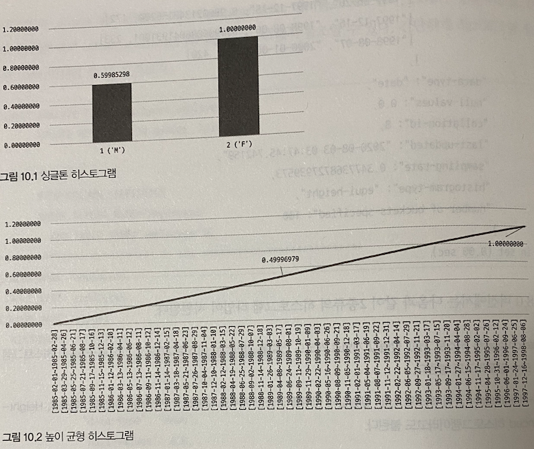
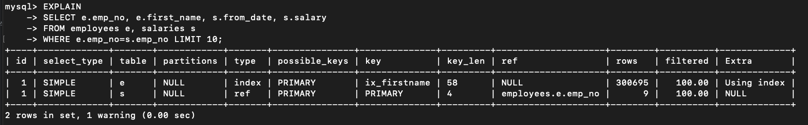
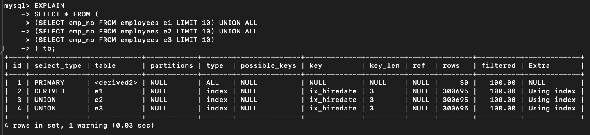
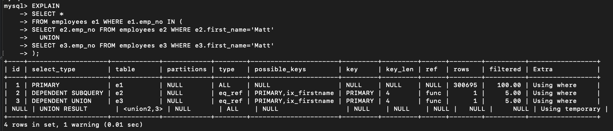
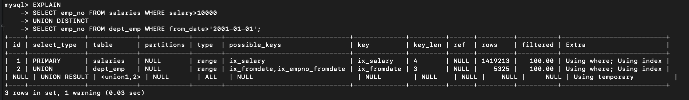
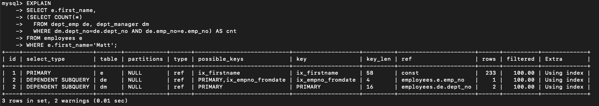
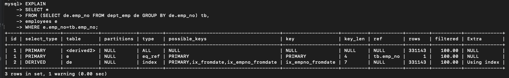
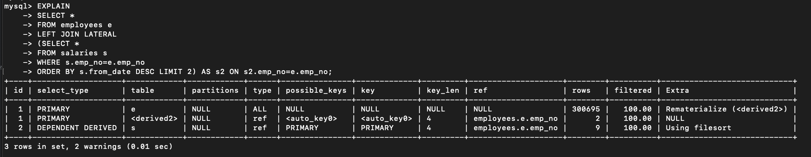
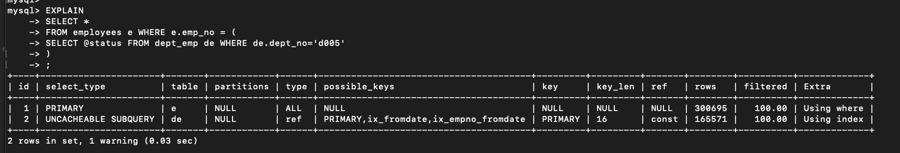
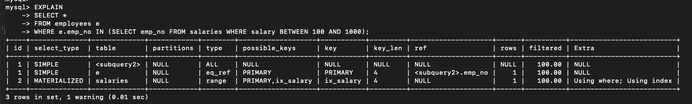

# 지옥 스터디 - 09 실행 계획

## 통계 정보
- 5.7 버전까지는 테이블/인덱스에 대한 개괄적인 정보 를 가지고 실행 계획을 수립함
  - 실제 데이터 분포를 고려하지 않기 때문에 정확도가 떨어짐
- 8.0 부터는 인덱싱 되지 않은 컬럼들에 대해 히스토그램을 수집해 이를 함께 활용 한다.

### 테이블 및 인덱스 통계 정보
- 비용 기반 최적화에서 가장 중요한것 -> 통계 정보
- MySQL 은 다른 DBMS 에 비해 통계 정보가 정확도가 떨어지고 **휘발성** 이 강했음
  - 때문에 실제 테이블 데이터를 일부 분석하는 방식으로 보완

#### MySQL 서버의 통계 정보
- 5.6 버전부터 InnoDB 스토리지 엔진을 사용한다면 테이블에 대한 통계 정보를 **영구적** 으로 관리할 수 있다.
  - `innodb_index_stats` `innodb_table_stats` 테이블로 관리
  - 5.5 버전까지는 메모리 에서만 관리
  - SHOW INDEX 명령으로만 인덱스 컬럼 분포도 확인 가능
  - 서버 재시작시, 통계 정보가 사라짐
- 테이블 생성시 `STATS_PERSISTENT` 옵션으로 설정 가능

```sql
CREATE TABLE tab_test (fd1 INT PRIMARY KEY, fd2 VARCHAR(20))
ENGINE=InnoDB
STATS_PERSISTENT={ DEFAULT | 0 | 1 }
```
- STATS_PERSISTENT=0
  - 5.5 이전 방식으로 관리 (메모리)
- STATS_PERSISTENT=1
  - `innodb_index_stats` `innodb_table_stats` 테이블로 관리
- STATS_PERSISTENT=DEFAULT
  - 테이블 생성시 STATS_PERSISTENT 옵션을 주지않은 것과 동일
  - `innodb_stats_persistent` 시스템 변수로 결정
  - 기본 값은 1

통계 정보 조회시 각 컬럼은 다음과 같은값을 저장하고 있다
- innodb_index_stats.stat_name='n_diff_pfx%'
  - 인덱스가 가진 유니크한 값의 개수
- innodb_index_stats.stat_name='n_leaf_pages'
  - 인덱스의 리프 노드 페이지 개수
- innodb_index_stats.stats_name='size'
  - 인덱스 트리의 전체 피이지 개수
- innodb_table.stats.n_rows
  - 테이블 전체 레코드 수
- innodb_table.stats.clustered_index_size
  - 프라이머리 키 크기
- innodb_table.stats.sum_of_other_index_sizes
  - 프라이머리 키를 제외한 인덱스 크기

또한 사용자, 관리자가 알지 못하는 순간에 **이벤트** 발생시 자동으로 갱신 되었다
- 테이블이 새로 오픈되는 경우
- 테이블 레코드가 대량 변경되는 경우 (전체 레코드의 1/16 정도)
- ANALYZE TABLE 명령이 실행되는 경우
- SHOW TABLE STATUS / SHOW INDEX FROM 명령이 실행되는 경우
- InnoDB 모니터가 활성화되는 경우
- `innodb_stats_on_metadata` 시스템 설정이 ON 이고 SHOW TABLE STATUS 명령이 실행되는 경우

테이블 통계 정보가 자주 갱신된다면, 인덱스 레인지 스캔으로 잘 처리되다가 의도치 않게 풀스캔으로 변경될 수도 있다 <br/>
- `innodb_stats_auto_recalc` 시스템 변수로 제어 가능 (기본 값 : ON)

통계 정보 수집을 위한 옵션을 테이블 생성시 추가할 수도 있다 (테이블 단위)
- STATS_AUTO_RECALC=1
  - 테이블 통계정보를 5.5 이전 방식대로 자동 수집
- STATS_AUTO_RECALC=0
  - ANALYZE TABLE 명령 실행시에만 수집
- STATS_AUTO_RECALC=DEFAULT
  - STATS_AUTO_RECALC 옵션을 설정하지 않은 것과 동일
  - `innodb_stats_auto_recalc` 시스템 변수 값으로 결정

5.5 버전 까지는 테이블 통계 정보 수집시, 몇 개의 InnoDB 테이블 블록을 샘플링 할지 `innodb_stats_sample_pages` 시스템 변수를 제공했다.

5.6 버전부터는 2개의 시스템 변수로 분리됨
- `innodb_stats_transient_sample_pages`
  - 기본값 8
  - 자동으로 통계 수집시 해당 페이지만큼만 임의로 샘플링
- `innodb_stats_persistent_sample_pages`
  - 기본값 20
  - ANALYZE TABLE 명령 실행시 임의로 해당 페이지 만큼만 샘플링후 분석한뒤 영구적인 통계 테이블에 저장및 활용

> 정확한 통계를 위해 innodb_stats_persistent_sample_pages 를 높은 값으로 설정하면 되지만, 통계 수집 시간이 길어질 수 있으므로 주의해야 한다.

### 히스토그램
- 5.7까지 통계정보는 인덱스 컬럼의 유니크한 값의 개수 정도만 가지고 있었음
  - 이를 활용해 최적의 실행 계획을 만들기엔 부족
  - 때문에 실제 인덱스의 일부 페이지를 가져와 참조하는 방식으로 보완함
- 8.0 부터는 컬럼의 데이터 분포도를 참조할 수 있는 **히스토그램 (Histogram)** 이 제공

### 히스토그램 정보 수집 및 삭제
- 8.0 버전에서 히스토그램은 **컬럼 단위** 로 관리됨
  - 자동으로 수집되지 않음
  - ANALYZE TABLE ... UPDATE HISTOGRAM 명령으로 수동으로 수집/관리 된다
  - 시스템 딕셔너리에 저장됨
- 서버 시작시 `information_schema.column_statistics` 테이블로 로드

```sql
ANALYZE TABLE employees
UPDATE HISTOGRAM ON gender, hire_date;
```

8.0 에서는 2가지 종류의 히스토그램 지원
- Singleton
  - 칼럼 값 개별로 레코드 건수를 관리
  - Value-Based 히스토그램, 도수 분포
- Equi-Height
  - 칼럼 값 범위를 균등한 개수로 구분해 관리
  - Height-Balanced 히스토그램

히스토그램은 **버킷 (Bucket)** 단위로 구분되어 레코드 건수/칼럼값의 범위가 관리됨
- 싱글톤 히스토그램은 버킷당 **칼럼의 값과 발생 빈도** 의 비율을 가짐
- 높이 균형 히스토그램은 버킷당 **범위 시작값, 마지막값, 발생 빈도율, 유니크한 값의 개수** 를 가짐



`information_schema.column_statistics` 테이블의 HISTOGRAM 컬럼이 가진 나머지 필드는 다음과 같은 의미를 가지고 있음
- sampling-rate
  - 히스토그램 수집을 위해 스캔한 페이지의 비율
  - 비율이 높을수록 정확도는 올라가지만 부하가 커진다
  - `historgram_generation_max_mem_size` 시스템 변수에 맞게 적절히 샘플링 하며 기본값은 20MB
- histogram-type
  - 히스토그램 종류
- number-of-buckets-specified
  - 히스토그램 생성시 설정한 버킷의 개수 저장
  - 기본값은 100개로 사용됨
  - 최대 1024개 설정 가능
  - 일반적으로 100개면 충분

> 8.0.19 버전 미만까지는 위 설정값을 무시하고 풀 스캔을 통해 샘플링 했다

`히스토그램 삭제`

```sql
ANALYZE TABLE employees
DROP HISTOGRAM ON gender, hire_date;
```

`히스토그램 비활성화`
- 히스토그램을 삭제하지 않고 옵티마이저가 참조하지 않도록 설정
  - 이 설정은 condition_fanout_filter 옵션에 영향받은 최적화가 실행되지 않을 수 있으니 유의
  
```sql
SET GLOBAL optimizer_switch='condition_fanout_filter=off';
```

#### 히스토그램 용도
- 히스토그램은 **특정 칼럼이 가지는 각 범위 (버킷) 별 레코드 건수/유니크한 값의 개수 정보** 를 가진다
- 단순 통계 정보만 이용한 경우와 히스토그램을 이용한 실행 계획의 차이가 매우 큶
- 히스토그램이 없다면 옵티마이저는 데이터가 균등하게 분포되어 있을거라 예측한다.
- 때문에 쿼리 성능이 10배정도 차이를 보일 수 있으며, 버퍼풀에 데이터가 없어 DISK I/O 가 발생한다면 몇 배의 차이가 발생할 수도 있음

#### 히스토그램과 인덱스
- 옵티마이저는 실행 계획 수립시 조건절에 일치하는 레코드 건수 예측을 위해 실제 인덱스의 B-Tree 를 샘플링해 살펴 본다
  - 이를 인덱스 다이브 (Index Dive) 라고 함
- 8.0 기준 인덱싱된 컬럼이 있다면 인덱스 다이브로 수집한 정보를 활용한다
  - 실제 데이터에 대한 샘플링이 정확도가 더 높기 때문
- 8.0 기준 히스토그램은, 주로 **인덱싱되지 않은 컬럼에 대한 데이터 분포도를 참조하는 용도** 로 사용됨

> 인덱스 다이브는 실행 계획 수립만으로도 상당한 비용을 소모하므로 유의

### 코스트 모델 (Cost Model)
- MySQL 서버가 쿼리를 처리하려면 다음과 같은 다양한 작업을 필요로 한다
  - 디스크로 부터 데이터 페이지 읽기
  - 메모리 (버퍼 풀) 로 부터 데이터 페이지 읽기
  - 인덱스 키 비교
  - 레코드 평가
  - 메모리 임시 테이블 작업
  - 디스크 임시 테이블 작업
- 전체 쿼리 비용을 계산하는데 필요한 단위 작업의 비용을 **코스트 모델 (Cost Model)** 이라고 함
- 5.7 이전 버전까지는 이런 작업들의 비용을 MySQL 서버 소스코드에 상수화 해 사용했음
  - 하지만 이는 하드웨어 스펙과 같은 요인에 따라 달라질 수 있는 유동적인 요소
  - 5.7 부터 이를 보완하기 위해 DBMS 관리자가 설정할 수 있게 개선됨
- 8.0 부터 칼럼의 데이터 분포를 위한 히스토그램과 인덱스 별 적재된 페이지 비율이 관리되고 실행계획 수립게 사용되기 시작

8.0 서버의 코스트 모델은 다음 2개 테이블에 저장된 설정 값을 사용
- server_cost : 인덱스를 찾고 레코드를 비교하고 임시 테이블 처리에 대한 비용 관리
- engine_cost : 레코드를 가진 데이터 페이지를 가져오는 데 필요한 비용 관리

`두 테이블의 공통 컬럼`
- cost_name : 코스트 모델의 각 단위 작업
- default_value : 각 단위 작업의 비용 (기본 값이며, 이 값은 MySQL 서버 소스코드에 설정된 값)
- cost_value : DBMS 관리자가 설정한 값 (NULL 일 경우 default_value 값 사용)
- last_updated : 단위 작업 비용이 변경된 시점
- comment : 설명

`server_cost 테이블 컬럼`
- engine_name : 비용이 적용된 스토리지 엔진
- device_type : 디스크 타입
  - 8.0 에서는 활용하지 않음
  - 0으로만 설정 가능

`8.0 버전 코스트 모델에서 지원하는 단위 작업`

| - | cost_name | default_value | 설명 |
| --- | --- | --- |
| engine_cost | io_block_read_cost | 1.00 |  디스크 데이터 페이지 읽기 |
| engine_cost | memory_block_read_cost | 0.25 | 메모리 데이터 페이지 읽기 |
| server_cost | disk_temptable_create_cost | 20.00 | 디스크 임시 테이블 생성 |
| server_cost | disk_temptable_row_cost | 0.50 | 디스크 임시 테이블 레코드 읽기 |
| server_cost | key_compare_cost | 0.05 | 인덱스 키 비교 |
| server_cost | memory_temptable_create_cost | 1.00 | 메모리 임시 테이블 생성 |
| server_cost | memory_temptable_row_cost | 0.10 | 메모리 임시 테이블의 레코드 읽기 |
| server_cost | row_evaluate_cost | 0.10 | 레코드 비교 |

`각 실행 계획의 코스트 확인`

```sql
EXPLAIN FORMAT=TREE
    SELECT *
    FROM employees WHERE first_name='Matt' \G
```

코스트 모델에서 중요한 것은, **각 단위 작업에 설정되는 비용 이 커지면 어떤 실행 계획이 고비용으로 바뀌고 저비용으로 바뀌는지 파악하는 것**
- key_compare_cost : 가능하면 정렬을 수행하지 않는 방향으로 실행 계획 수립
- row_evaluate_cost : 풀스캔 쿼리의 비용이 커지고, 가능하면 인덱스 레인지 스캔을 사용 하는 실행 계획 수립
- disk_temptable_create_cost, disk_temptable_row_cost : 디스크에 임시 테이블을 만들지 않는 실행 계획 수립
- memory_temptable_create_cost, memory_temptable_row_cost : 메모리 임시 테이블을 만들지 않는 실행 계획 수립
- io_block_read_cost : InnoDB 버퍼 풀에 데이터 페이지가 많이 적재된 인덱스를 사용하는 실행 계획 수립
- memory_block_read_cost : InnoDB 버퍼 풀에 적재된 데이터 페이지가 적더라도 인덱스를 사용하는 실행 계획 수립

> 기본 값으로도 20년 넘는 시간 동안 수많은 응용프로그램에서 잘 사용됐기 때문에 함부로 변경하지 않는 것이 좋음

## 실행 계획 확인
- 실행 계획은 DESC, EXPLAIN 명령으로 확인 가능
- 8.0 버전부터 EXPLAIN 에 사용 가능한 옵션이 추가 됨

### 실행 계획 출력 포맷
- 이전 버전 까지는 EXPLAIN EXTENDED / EXPLAIN PARTITIONS 명령이 구분돼어 있었지만 8.0 부터 모든 내용이 통합되어 보이도록 변경됨
  - 해당 옵션들이 문법에서 제거됨
- 8.0 부터 FORMAT 옵션을 통해 JSON 또는 TREE, 테이블 형태로 확인 가능

```sql
EXPLAIN
SELECT *
FROM employees e
	INNER JOIN salaries s ON s.emp_no=e.emp_no
WHERE first_name='ABC'\G

*************************** 1. row ***************************
           id: 1
  select_type: SIMPLE
        table: e
   partitions: NULL
         type: ref
possible_keys: PRIMARY,ix_firstname
          key: ix_firstname
      key_len: 58
          ref: const
         rows: 1
     filtered: 100.00
        Extra: NULL
*************************** 2. row ***************************
           id: 1
  select_type: SIMPLE
        table: s
   partitions: NULL
         type: ref
possible_keys: PRIMARY
          key: PRIMARY
      key_len: 4
          ref: employees.e.emp_no
         rows: 9
     filtered: 100.00
        Extra: NULL
        
EXPLAIN FORMAT=TREE
SELECT *
FROM employees e
       INNER JOIN salaries s ON s.emp_no=e.emp_no
WHERE first_name='ABC'\G

*************************** 1. row ***************************
EXPLAIN: -> Nested loop inner join  (cost=2.71 rows=9)
    -> Index lookup on e using ix_firstname (first_name='ABC')  (cost=0.76 rows=1)
  -> Index lookup on s using PRIMARY (emp_no=e.emp_no)  (cost=1.95 rows=9)

  1 row in set (0.00 sec)

    EXPLAIN FORMAT=JSON
SELECT *
FROM employees e
       INNER JOIN salaries s ON s.emp_no=e.emp_no
WHERE first_name='ABC'\G


*************************** 1. row ***************************
EXPLAIN: {
  "query_block": {
    "select_id": 1,
    "cost_info": {
      "query_cost": "2.71"
    },
    "nested_loop": [
      {
        "table": {
          "table_name": "e",
          "access_type": "ref",
          "possible_keys": [
            "PRIMARY",
            "ix_firstname"
          ],
          "key": "ix_firstname",
          "used_key_parts": [
            "first_name"
          ],
          "key_length": "58",
          "ref": [
            "const"
          ],
          "rows_examined_per_scan": 1,
          "rows_produced_per_join": 1,
          "filtered": "100.00",
          "cost_info": {
            "read_cost": "0.66",
            "eval_cost": "0.10",
            "prefix_cost": "0.76",
            "data_read_per_join": "136"
          },
          "used_columns": [
            "emp_no",
            "birth_date",
            "first_name",
            "last_name",
            "gender",
            "hire_date"
          ]
        }
      },
      {
        "table": {
          "table_name": "s",
          "access_type": "ref",
          "possible_keys": [
            "PRIMARY"
          ],
          "key": "PRIMARY",
          "used_key_parts": [
            "emp_no"
          ],
          "key_length": "4",
          "ref": [
            "employees.e.emp_no"
          ],
          "rows_examined_per_scan": 9,
          "rows_produced_per_join": 9,
          "filtered": "100.00",
          "cost_info": {
            "read_cost": "1.01",
            "eval_cost": "0.94",
            "prefix_cost": "2.71",
            "data_read_per_join": "150"
          },
          "used_columns": [
            "emp_no",
            "salary",
            "from_date",
            "to_date"
          ]
        }
      }
    ]
  }
}

1 row in set (0.00 sec)
```

### 쿼리의 실행 시간 확인
- 8.0.18 버전 부터 쿼리 실행 계획과 단계별 소요 시간 정보를 확인할 수 있는 EXPLAIN ANALYZE 기능이 추가됨
  - SHOW PROFILE 은 실행 계획의 **단계 별 소요 시간** 을 보여주진 않음
- 항상 TREE 포맷으로 결과를 보여주기 때문에 FORMAT 옵션을 사용할 수 없음
- 명령의 결과에는 단계별 실제 요소된 시간 (actual time) 과 처리한 레코드 건수 (rows), 반복 횟수 (loops) 가 표시된다

```sql
EXPLAIN ANALYZE
SELECT e.emp_no, avg(s.salary)
FROM employees e
	INNER JOIN salaries s ON s.emp_no=e.emp_no
		AND s.salary>50000
		AND s.from_date<='1990-01-01'
		AND s.to_date>'1990-01-01'
WHERE e.first_name='Matt'
GROUP BY e.hire_date \G
```
- EXPLAIN ANALYZE 는 실행 계획 뿐 아니라 실제 쿼리를 실행하기 때문에 쿼리 수행시간이 오래 걸릴수록 확인도 늦어진다
- 실행 계획이 아주 나쁜 경우라면 EXPLAIN 으로 확인후 튜닝을 먼저 하는게 낫다

## 실행 계획 분석

### id 컬럼
- 실행 계획에서 가장 왼쪽에 표시되는 `id` 컬럼은 SELECT 쿼리 별로 부여되는 식별자
- 테이블을 조인하는 경우 테이블 개수 만큼 실행 계획 레코드가 출력 되지만 동일한 id 값이 부여 된다
- id 컬럼이 **테이블 접근 순서를 의미 하지 않으므로 유의** 해야 한다



### select_type 컬럼
- 각 SELECT 쿼리가 어떤 타입의 쿼리인지 표시되는 컬럼

#### SIMPLE
- UNION 이나 서브쿼리를 사용하지 않은 단순한 쿼리인 경우 표시되는 값
  - 조인이 포함된 경우라도 동일
- 쿼리 문장이 아무리 복잡하더라도 SIMPLE 쿼리는 하나만 존재한다
- 일반적으로 가장 바깥의 SELECT 쿼리가 SIMPLE 로 표시됨

#### PRIMARY
- UNION 이나 서브쿼리를 가지는 SELECT 쿼리의 가장 바깥쪽에 있는 쿼리인 경우 표시되는 값
- PRIMARY 인 쿼리는 하나만 존재하고, 쿼리의 제일 바깥에 있는 쿼리가 PRIMARY 로 표시됨

#### UNION
- UNION 으로 결합되는 SELECT 쿼리 중 첫 번째를 제외한, 두번 째 이후 단위의 SELECT 쿼리인 경우 표시되는 값
- UNION 의 첫 번째 SELECT 쿼리는 쿼리 결과를 저장하는 임시 테이블 (DERIVED) 로 표시됨



#### DEPENDENT UNION
- UNION 이나 UNION ALL 로 결합하는 쿼리에서 표시 됨
- DEPENDENT UNION 은 결합된 단위 쿼리가 외부 쿼리에 영향 받는다는 것을 의미


- 위 쿼리의 경우 IN 절의 서브 쿼리를 먼저 처리하지 않고, employees 테이블을 먼저 읽은 뒤 서브쿼리를 실행한다
- 이때 employees 컬럼값이 서브 쿼리에 영향을 주게 된다
- 내부 쿼리가 이처럼 외부 쿼리의 값을 참조할 때 DEPENDENT 키워드가 표시된다

#### UNION RESULT
- UNION RESULT 는 **UNION 결과를 담아두는 테이블**
- 8.0 이전에는 UNION ALL, UNION (UNION DISTINCT) 모두 임시 테이블 을 사용했으나 8.0 부터 UNION ALL 은 임시테이블을 사용하지 않게 되었다
- UNION RESULT 는 실제 쿼리에서 단위 쿼리가 아니므로 id 값이 부여되지 않는다



#### SUBQUERY
- select_type 의 서브쿼리는 **FROM 절 이외에 사용되는 서브쿼리 만을 의미**
- FROM 절에 사용된 서브 쿼리는 DERIVED 로 표시되고, 이외 위치에서 사용된 경우 모두 SUBQUERY 라고 표시 된다

`서브쿼리 사용 위치에 따른 명칭`
- 중첩된 쿼리 (Nested Query)
  - SELECT 에 사용된 서브 쿼리
- 서브 쿼리 (Subquery)
  - WHERE 절에 사용된 경우
- 파생 테이블 (Derived Table)
  - FROM 절에 사용된 서브 쿼리
  - 일반적으로 인라인 뷰 라고도 많이 함

`서브쿼리가 반환하는 값의 특성에 따른 명칭`
- 스칼라 서브쿼리 (Scalar Subquery)
  - 하나의 값만 반환하는 서브쿼리 (컬럼이 단 하나인 레코드)
- 로우 서브쿼리 (Row Subquery)
  - 컬럼 개수와 관계 없이 하나의 레코드만 반환하는 쿼리

#### DEPENDENT SUBQUERY
- 서브쿼리가 바깥쪽 SELECT 쿼리에서 정의된 컬럼을 사용하는 경우 DEPENDENT SUBQUERY 라고 표시됨
- 안쪽 서브 쿼리 결과가 바깥 SELECT 쿼리 컬럼에 의존적이기 때문
  - 외부 쿼리가 실행된 후 내부 쿼리가 실행되어야 함
  - 일반 쿼리에 비해 처리 속도가 느린 경우가 많다



#### DERIVED
- 5.5 까지는 FROM 절에 사용된 서브쿼리가 있다면 항상 DERIVED 인 실행 계획을 만듦
- 5.6 버전 부터 옵티마이저 옵션에 따라 서브쿼리와 외부 쿼리를 병합하는 최적화가 수행되기도 한다
- DERVIED 는 단위 쿼리의 실행 결과로 메모리나 디스크에 임시 테이블을 생성하는 것을 의미
  - 파생 테이블 이라고도 한다
- 5.5 버전 까지는 파생 테이블에 인덱스가 없었으나 5.6 부터 옵티마이저 옵션에 따라 적절한 인덱스를 추가할 수 있게 최적화 되었다


- 위 쿼리는 조인으로 변경할 수 있는데, 해당 쿼리를 조인으로 풀 수 있도록 쿼리를 개선하는 것이 좋음
- 8.0 버전 부터 FROM 절 서브 쿼리에 대한 최적화를 많이 지원한다
  - 불필요한 경우 조인으로 재작성 해버림
- 옵티마이저에 의존하기 보단 직접 최적화된 쿼리를 작성하는 것이 중요
- 서브쿼리 를 조인으로 처리할 수 있다면 반드시 조인을 사용할 것

#### DEPENDENT DERIVED
- 8.0 이전에는 FROM 절 서브 쿼리는 외부 컬럼을 사용할 수 없었다
- 8.0 부터 **레터럴 조인 (LATERAL JOIN)** 기능이 추가되면서 FROM 절 서브쿼리도 외부 칼럼을 참조할 수 있게 변경됨
- 래터럴 조인은 LATERAL 키워드를 사용해야 하며 해당 키워드가 없다면 오류가 발생한다



#### UNCACHEABLE SUBQUERY
- 하나의 쿼리에 서브 쿼리가 하나만 있더라도 해당 쿼리는 여러번 실행될 수 있다
- 조건이 동일한 서브쿼리가 실행될 때는 결과를 캐시해 두었다가 재사용한다
  - 이는 쿼리 캐시나 파생 테이블과는 전혀 관계가 없는 기능
- UNCACHEABLE SUBQUERY 는 SUBQUERY 가 캐시를 사용할 수 없는 경우 표시된다
- SUBQUERY 는 외부 영향을 받지 않으므로 최초 실행후 결과를 캐시한 뒤 재사용 한다
- DEPENDENT SUBQUERY 는 **바깥쪽 쿼리의 칼럼 값 단위로 캐시** 한 뒤 재사용 한다



`서브쿼리가 캐시를 사용하지 못하는 경우`
- 사용자 변수가 서브쿼리에 사용된 경우
- NOT-DETERMINISTIC 속성 스토어드 루틴이 서브쿼리 내에 사용된 경우
- UUID() RAND() 같이 매번 결과가 달라지는 함수가 사용된 경우

#### UNCACHEABLE UNION
- UNCACHEABLE SUBQUERY 와 같이 UNION 에 적용된 경우를 의미

#### MATERIALIZED
- 5.6 버전 부터 도입된 타입
- FROM, IN 서브쿼리 최적화를 위해 사용

```sql
EXPLAIN
SELECT * 
FROM employees e
WHERE e.emp_no IN (SELECT emp_no FROM salaries WHERE salary BETWEEN 100 AND 1000);
```
- 5.6 버전 까지는 위 쿼리 실행시 employees 를 읽어 매 레코드마다 IN 절의 서브쿼리를 실행하는 형태로 처리되었다
  - 성능상 좋지 못함
- 5.7 버전부터 서브 쿼리를 임시 테이블로 **구체화** 한 뒤 임시 테이블고 employees 테이블을 조인하는 형태로 최적화 되어 처리됨


