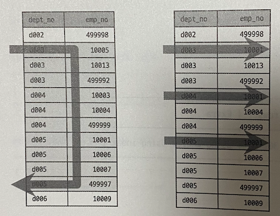
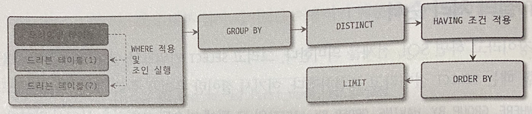
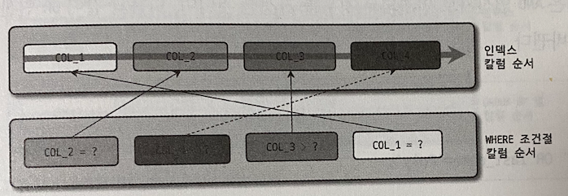
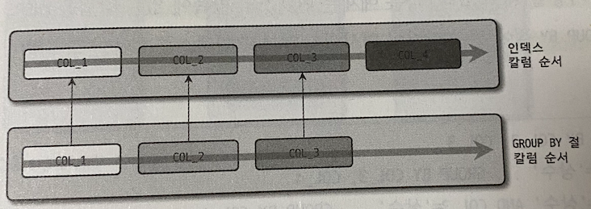
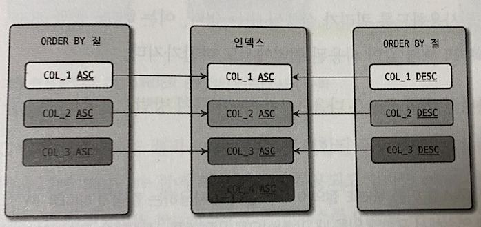
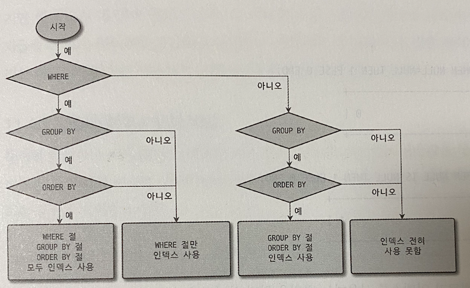
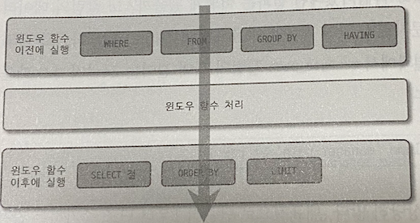

# 지옥 스터디 - 10 쿼리 작성 및 최적화
- 애플리케이션 코드를 튜닝해 2배의 성능 향상을 한다는 건 쉽지 않은 일이다.
- 하지만 DBMS 에서 몇배 ~ 몇십배 성능 향상이 이뤄지는 것은 흔한일
- 때문에 SQL 처리에서 **어떻게 (How) 를 이해** 하고 쿼리를 작성하는 것이 중요하다. 

## 쿼리 작성과 관련된 시스템 변수
- 대소문자 구분과 같은 SQL 작성 규칙은 **MySQL 서버 시스템 설정** 에 따라 달라짐

### SQL 모드
- MySQL 서버의 `sql_mode` 설정은 여러 값이 동시에 설정될 수 있음
- SQL 문서 작성 규칙 뿐 아니라 자동으로 실행되는 데이터 타입 변환 및 기본값 제어 등과 관련된 옵션도 가지고 있다
- 사용자 테이블을 생성하고 데이터를 저장하기 시작했다면 옵션을 변경하지 않는 것이 좋음
- MySQL 8.0 기준 sql_mode 의 기본값은 다음과 같다
  - ONLY_FULL_GROUP_BY
  - STRICT_TRANS_TABLES
  - NO_ZERO_IN_DATE
  - NO_ZERO_DATE
  - ERROR_FOR_DIVISION_BY_ZERO
  - NO_ENGINE_SUBSTITUTION

`sql_mode options`

| 옵션 명 | 설명 |
| --- | --- |
| STRICT_ALL_TABLES & STRICT_TRANS_TABLES  | INSERT/UPDATE 문 수행시 저장되는 타입이 다른 경우 자동으로 타입 변경을 수행 <br/> `STRICT_TRANS_TABLES` 는 트랜잭션을 지원하는 스토리지 엔진에만 엄격한 모드를 적용하고, `STRICT_ALL_TABLES` 는 이와 관계없이 모든 스토리지 엔진에 엄격한 모드를 적용한다 <br/> MySQL을 서비스 투입전 반드시 활성화 할 것을 권장 |
| ANTI_QUOTES | MySQL 은 문자열을 표현하기 위해 홑따옴표/쌍따옴표를 동시에 사용할 수 있음 <br/> 옵션 활성화시 홑따옴표만 문자열 값 표기로 사용할 수 있다. |
| ONLY_FULL_GROUP_BY | GROUP BY 절이 사용된 문장의 SELECT 절에는 GROUP BY 에 사용된 컬럼과 집계함수만 사용할 수 있다. 5.7 기준 기본값 비활성화, 8.0 기준 기본값 활성화 |
| PIPE_AS_CONCAT | MySQL 에서 &#124;&#124; 는 OR 연산자와 동일함. 옵션 활성화시 오라클과 동일하게 문자 연결 연산사로 사용할 수 있다 |
| PAD_CHAR_TO_FULL_LENGTH | MySQL 에서는 CHAR 타입이더라도 VARCHAR 와 같이 문자열 뒤의 공백문자는 제거되어 반환됨. 옵션 활성화시 문자 뒤의 공백문자가 제거되지 않고 반환됨 |
| NO_BACKSLASH_ESCAPES | 역슬래시를 이스케이프 문자로 사용할 수 있음. 옵션 활성화시 이스케이프 용도로 사용하지 못한다 |
| IGNORE_SPACE | 스토어드 프로시저나 함수명 사이 공백까지도 해당 이름으로 간주함. 옵션 활성화시 사이의 공백을 무시한다. 이는 **내장 함수에만 적용** 됨 |
| REAL_AS_FLOAT | MySQL 에서 부동소수점 타입은 FLOAT/DOUBLE 을 지원함. REAL 타입은 DOUBLE 타입의 동의어이다. 옵션 활성화시 FLOAT 타입의 동의어로 변경됨 |
| NO_ZERO_IN_DATE & NO_ZERO_DATE | 두 옵션 활성화 시 DATE/DATETIME 타입에 2020-00-00 과 같은 잘못된 날짜를 입력하지 못함 |
| ANSI | MySQL 서버가 최대한 ANSI 표준에 맞게 동작하게끔 만들어 준다. `REAL_AS_FLOAT`, `PIPES_AS_CONCAT`, `ANSI_QUOTES`, `IGNORE_SPACE`, `ONLY_FULL_GROUP_BY` 로 조합됨 |
| TRADITIONAL | STRICT_TRANS_TABLE/STRICT_ALL_TABLES 보다 더 엄격한 방법으로 동작을 제어함. `STRICT_TRANS_TABLES`, `STRICT_ALL_TABLES`, `NO_ZERO_IN_DATE`, `NO_ZERO_DATE`, `ERROR_FOR_DIVISION_BY_ZERO`, `NO_ENGINE_SUBSTITUTION` 로 조합됨 |

### 영문 대소문자 구분
- MySQL 서버는 기본적으로 **설치된 운영체제에 따라 테이블명의 대소문자를 구분** 한다.
  - DB 나 테이블은 디스크의 디렉터리/파일 로 매핑되기 때문
  - 유닉스 계열 운영체제에서 대소문자를 구분
  - 윈도우는 구분하지 않음
- `lower_case_table_names=1` 설정시 모두 소문자로만 저장하고, 대소문자를 구분하지 않게 동작한다.
  - 기본값 = 0
- 설정 자체를 떠나 가능하면 DB 생성시 대문자 혹은 소문자로만 통일해 사용하는 것이 좋음.

### MySQL 예약어
- 예약어를 사용하면 해당 칼럼이나 테이블을 SQL 에서 사용하기 위해 항상 백틱이나 쌍따옴표로 감싸주어야 한다.
- 테이블 생성시에는 항상 백틱으로 둘러싸지 않은 상태로 생성하길 권장
  - 에러나 경고가 무시될 수 있기 때문

## 메뉴얼의 SQL 문법 표기를 읽는 방법

```sql
 INSERT [LOW_PRIORITY | DELAYED | HIGH{PRIORITY ] [IGNORE]  
    [INTO] tbl_name
    SET col_name  = {expr | DEFAULT} ...
    [ON DUPLICATE  KEY UPDATE
        col_name = expr
        [, col_name = expr]....]
```

## MySQL 연산자와 내장함수
- 기본적인 연산자는 MySQL 에서도 비슷하게 사용되지만 MySQL 에서만 사용되는 연산자/표기법이 존재한다.
- ANSI 표준 형태가 아닌 것들이 많음
- 가능하면 SQL 작성시 ANSI 표준 연산자를 사용할 것을 권장한다.

### 리터럴 문자열 표기법

#### 문자열
- SQL 표준에서 문자열은 항상 홑따옴표를 사용해 표기하지만, MySQL 에서는 쌍따옴표를 사용해 표기할 수도 있다.
- 예약어의 경우 백틱을 사용해 충돌을 피할 수 있다.

```sql
SELECT * FROM departments WHERE dept_no = "d001";
```
- sql_mode 옵션에 `ANSI_QUOTES` 설정시 문자열 리터럴에 쌍따옴표를 사용할 수 없고, 예약어 충돌을 피하기 위해 쌍따옴표를 사용해야 한다.

#### 숫자
- 숫자 상수 값을 사용하려면 따옴표 없이 숫자를 입력하면 된다.
- 문자열 형태 따옴표를 사용하더라도, 타입이 일치하지 않는다면 자동 변환한다.

```sql
SELECT * FROM tab_test WHERE string_column = 10001;
```
- 두 비교대상이 문자열과 숫자 타입으로 다를 경우 자동변환이 발생한다.
- 숫자 타입과 문자타입 비교시 **숫자 타입을 우선** 하므로 문자열을 숫자로 변경한 뒤 비교를 수행한다.
- 위 쿼리의 경우 인덱스를 제대로 활용하지 못한다.
  - 문자컬럼과 숫자 상수의 비교
  - 문자컬럼의 값을 숫자로 변환한 뒤 비교를 수행하기 때문

> 주로 코드나 타입과 같은 값을 저장하는 컬럼에서 위와 같은 문제가 자주발생하므로 주의해야 함

#### 날짜
- MySQL 에서는 정해진 날짜 포맷으로 표기한다면 DATE/DATETIME 값으로 자동 변환하기 떄문에 STR_TO_DATE() 같은 함수를 사용하지 않아도 된다.

#### 불리언
- BOOL/BOOLEAN 이라는 타입이 존재하지만 사실 **TINYINT 타입의 동의어** 이다
- TRUE/FALSE 형태로 비교하거나 값을 저장할 수 있다.

### MySQL 연산자

#### 동등 비교
- 다른 DBMS 와 동일하게 "=" 기호로 비교를 수행하면 됨
- 추가적응로 동등 비교를 위해 "<=>" 연산자도 제공한다. 이는 "=" 와 동일하지만 부가적으로 NULL 값에 대한 비교까지 수행한다.
- 이를 **NULL-Safe 연산자** 라고 한다.
- NULL 은 기본적으로 IS NULL 연산자 외에는 비교할 방법이 없다
- Null-Safe 비교 연산자를 사용하면 양쪽 비교 대상모두 NULL 인 경우 TRUE, 한쪽만 NULL 인 경우 FALSE 를 반환한다.
- "<=>" 연산자는 NULL 을 하나의 값으로 인식하고 비교하는 방법

#### 부정 비교
- 같지 않다 비교를 위한 연산자는 "<>" 를 일반적으로 많이 사용한다.
  - != 도 사용 가능
- SQL 작성시 어느쪽을 사용해도 상관없지만 가독성을 위해 둘중 한가지 방법으로 통일해서 작성해야 한다

#### NOT 연산자
- TRUE/FALSE 연산의 결과를 부정하기 위해 NOT 을 사용한다.
  - ! 도 사용 가능
- 이는 불리언 뿐이 아닌 숫자나 문자에서도 사용할 수 있지만 결과를 정확히 예측할 수 없는경우 사용하지 않는 것을 권장한다.

#### AND OR 연산자
- MySQL 에서는 AND OR 뿐 아닌 && 과 || 도 허용한다
- sql_mode 옵션에 PIPE_AS_CONCAT 을 설정하면, 오라클과 동일하게 변경됨
- SQL 작성시 다른 용도로 사용될 수 있는 && 와 || 는 사용하지 않는 것이 좋다

#### 나누기와 나머지 연산자
- 나누기의 경우 일반적으로 알려진 "/" 연산자를 사용한다
- 나머지를 가져오는 연산자의 경우 "%" 또는 MOD 연산자를 사용한다

#### REGEXP 연산자
- 문자열 값이 어떤 패턴을 만족하는지 확인하는 연산자
- `RLIKE` 는 `REGEXP` 와 동일한 비교를 수행한다.
- REGEXP 연산자의 정규표현식은 POSIX 표준으로 구현되어 있다
- REGEXP 를 단독으로 사용하는 경우 인덱스 레인지 스캔을 사용할 수 없다.

#### LIKE 연산자
- DBMS 에서는 단순 문자열 패턴 비교시 LIKE 연산자를 더 많이 사용한다
- LIKE 연산자를 인덱스를 활용할 수 있다
- 와일드카드 패턴을 지원함
  - %
  - _
- REGEXP 와 차이는, LIKE 의 경우 항상 비교 대상 문자열의 처음부터 끝까지 일치하는 경우에만 TRUE 를 반환한다
- 와일드카드가 검색어의 앞쪽에 위치한다면 **인덱스 레인지 스캔을 활용할 수 없다**

#### BETWEEN 연산자
- "크거나 같다" 와 "작거나 같다" 두 개의 연산자를 하나로 합친 연산자
- 다른 비교 조건과 결합해 하나의 인덱스를 사용할 때 주의해야한다

```sql
SELECT * FROM dept_emp
WHERE dept_no BETWEEN 'd003' AND 'd005' AND emp_no = 10001;
```
- BETWEEN 의 경우 d003 보다 크고 d005 보다 작은 레코드를 모두 스캔해야 한다.
- BETWEEN 과 IN 을 동일하게 생각하는 경우도 있는데, 이는 잘못된 생각
- IN 연산자의 경우 동등 비교 연산자와 비슷하다.
  - 여러 개의 동등 비교를 하나로 묶은 것과 같은 연산자
- 둘의 동작방식에는 차이가 있다



- BETWEEN 은 선형으로 인덱스를 검색하는 반면, IN 은 동등 비교를 여러번 수행한다.
- 때문에 인덱스 앞쪽 컬럼의 선택도가 떨어지는 경우 IN 으로 변경해 성능을 개선하는 방법도 존재함

```sql
SELECT * FROM dept_emp
WHERE dept_no BETWEEN 'd003' AND 'd005' AND emp_no = 10001;

SELECT * FROM dept_emp
WHERE dept_no IN ('d003', 'd004', 'd005') AND emp_no = 10001;
```
- 위 두 쿼리 모두 인덱스 레인지 스캔을 하지만, 실행 계획 떠보면 rows 의 레코드 건수는 큰 차이가 있음
- 8.0 버전 이전에는 BETWEEN 을 위와 같이 IN 쿼리로 변경하려면 해당 부서코드들을 조회한 뒤 직접 조건을 만들어 주어야 했다
- 하지만 8.0 버전 부터 IN (subquery) 형태로 자겅하면 세미조인 최적화를 사용해 더 빠른 쿼리로 변환해 준다

```sql
SELECT * dept_emp
WHERE dept_no IN (
    SELECT dept_no
    FROM departments
    WHERE dept_no BETWEEN 'd003' AND 'd005'
) AND emp_no = 10001;
```

#### IN 연산자
- IN 연산자는 여러 개의 값에 대해 동등 비교 연산을 수행하는 연산자
- 범위 검색이 아닌, 여러 번의 동등비교를 수행하기 때문에 일반적으로 빠륵 ㅔ처리된다.
- 8.0 이전까지는 IN 절에 튜플 (레코드) 를 사용하면 항상 풀 테이블 스캔을 사용했다
  - 8.0 이후 개선됨
- NOT IN 의 경우 인덱스 풀 스캔이 일어난다.
  - 동등이 아닌 부정 비교이기 때문에 인덱스를 이용해 범위조건을 줄일 수 없다

### MySQL 내장 함수
- 기본적인 기능의 함수는 대부분 동일하게 제공된다
- **함수명이나 사용법은 표준이 없기 때문에 DBMS 별로 호환되지 않음**
- MySQL 의 함수는 기본적으로 제공하는 **내장 함수** 와 **사용자 정의 함수 (UDF User Defined Function)** 으로 구분된다

#### NULL 값 비교 및 대체 (IFNULL, ISNULL)
- `IFNULL()` 함수는 칼럼이나 표현식의 값이 NULL 인지 비교하고, NULL 인 경우 다른 값으로 대체한다
  - 첫번째 인자가 NULL 이아니면 첫번째 인자의 값을, 아니라면 두번째 인자의 값을 반환
- `ISNULL()` 함수는 칼럼이나 표현식의 값이 NULL 인지 비교하는 한다

#### 현재 시각 조회 (NOW, SYSDATE)
- 현재의 시간을 반환하는 함수
- 하나의 SQL 에서 모든 NOW() 함수는 항상 같은 값을 가진다
- 하지만 SYSDATE() 함수는 호출 시점에 따라 결괏 값이 달라지므로 유의해야한다
  - `sysdate_is_now` 시스템 변수를 활성화 하면 NOW() 와 동일하게 동작

> 레플리카 서버에서 안정적으로 복제되지 않기 때문에 유의

#### 날짜와 시간의 포맷 (DATE_FORMAT, STR_TO_DATE)
- DATETIME 타입의 컬럼이나 값을 원하는 형태의 문자열로 변환하려면 `DATE_FORMAT()` 함수를 사용
- 날짜 포맷변경을 위한 지정자는 모두 **대소문자를 구분** 하므로 유의
- SQL 표준 형태 (년-월-일 시:분:초) 인 문자열을 필요시 자동으로 타입변환이 일어난다
  - DATETIME 타입

#### 날짜와 시간의 연산 (DATE_ADD, DATE_SUB)
- 특정 날짜에서 연도나 월일 또는 시간 등을 더하거나 뺄때 `DATE_ADD()`, `DATE_SUB()` 함수를 사용
  - DATE_SUB() 은 크게 쓸일이 없음
  - DATE_ADD() 로 모든 처리가 가능함
- 첫 번째 인자는 연사를 수행할 날짜, 두번 째는 더하거나 빼고자하는 월/일의 수

#### 타임스탬프 연산 (UNIX_TIMESTAMP, FROM_UNIXTIME)
- `UNIX_TIMESTAMP()` 함수는 '1970-01-01 00:00:00' 으로부터 경과된 초를 반환하는 함수
- 함수 인자가 없는 경우 현재 날짜와 시간의 타임스탬프 값을 반환하고, 특정 날짜를 입력하면 해당 날짜와 시간의 타임스탬프를 반환한다

> TIMESTAMP 타입은 4바이트 숫자 타입으로 저장된다. <br/>
> 때문에 실제 값의 범위는 1970-01-01 00:00:01 ~ 2038-01-09 03:14:07 까지 날짜값만 가능하다

#### 문자열 처리 (RPAD, LPAD / RTRIM, LTRIM, TRIM)
- `RPAD()`, `LPAD()` 함수는 문자열 좌측 혹은 우측에 문자를 덧붙여 지정된 길이의 문자열로 만드는 함수
  - 첫번째 인자는 패딩 처리를할 문자열
  - 두번째 인자는 몇 바이트까지 패딩할 것인지
  - 세번째 인자는 어떤 문자를 패딩할 것인지를 의미
- `RTRIM()`, `LTRIM()` 함수는 문자열 우측 혹은 좌측에 연속된 공백 문자를 제거하는 함수
- `TRIM()` 함수는 위 두 함수의 처리를 동시에 수행하는 함수

#### 문자열 결합 (CONCAT)
- 여러 문자열을 연결해 하나의 문자열로 반환하는 함수
- 숫자를 인자로 전달하면 문자열 타입으로 변환한 후 처리한다
- 명시적으로 `CAST()` 함수를 이용해 타입을 문자열로 변환하는 것이 안전함
- 유사한 함수로 `CONCAT_WS()` 함수가 있다

#### GROUP BY 문자열 결합 (GROUP_CONCAT)
- COUNT(), MAX(), MIN(), AVG() 등과 같이 그룹 함수 중 하나이다
- `GROUP_CONCAT()` 함수는 값을 먼저 정렬한 후 연결하거나 각 값의 구분자 설정도 가능하며, 여러 값 중 중복을 제거하고 연결하는 것도 가능하다.
  - 주로 GROUP BY 와 함께 사용한다
- 지정한 값들을 연결하기 위한 메모리 버퍼 공간을 사용한다.
  - `group_concat_max_len` 시스템 변수
  - 해당 크기를 초과할 경우 경고 메세지가 발생한다
  - 기본값은 1KB

#### 값의 비교와 대체 (CASE WHEN.. THEN.. END)
- CASE WHEN 은 프로그래밍 언어에서 제공하는 `SWITCH` 구문과 같은 역할을 수행한다.

#### 타입의 변환 (CAST, CONVERT)
- **프리페어 스테이트먼트 (Prepared Statement)** 를 제외하면 SQL 은 문자열 기반으로 동작하기 때문에 모든 입력값은 문자열 처럼 취급된다.
- 명시적인 타입 변환이 필요한 경우 `CAST()` 함수를 사용하면 된다.
  - `CONVERT()` 도 이와 비슷하다.
- 변환 가능한 데이터 타입은, **DATE, TIME, DATETIME, BINARY, CHAR, DECIMAL, SIGNED INTEGER, UNSIGNED INTEGER** 이다.
- MySQL 의 자동변환중 SIGNED, UNSIGNED 같이 부호가 있거나 없는 정수 값의 변환은 자동으로 이뤄지지 못하는 경우가 많음
- 그런 경우 명시적인 타입 변환을 해야함
- `CONVERT()` 는 타입 변환 외에도 **문자 집합을 변환하는 용도** 로도 사용할 수 있다.

#### 이진값과 16진수 문자열 (Hex String) 변환 (HEX UNHEX)
- `HEX()` 함수는 이진값을 사람이 읽을 수 있는 16진수 문자열로 변환하는 함수
- `UNHEX()` 는 16진수 문자열을 이진값으로 변환하는 함수
- 여기서의 이진값은 바이너리 값이다.

#### 암호화 및 해시함수 (MD5, SHA, SHA2)
- `SHA()` 함수는 SHA-1 암호화 알고리즘을 사용
- `SHA2()` 함수는 SHA 알고리즘 보다 강력한 224 ~ 512 비트 알고리즘을 사용
- `MD5()` 함수는 메세지 다이제스트 알고리즘을 사용해 128 비트 해시값을 반환한다.
  - MD5 는 문자열 길이를 줄이는 용도
- 위 3가지 함수는 모두 중복 가능성이 매우 낮기 때문에 긴 데이터의 크기를 줄여 인덱싱 하는 용도로도 사용된다.

#### 처리 대기 (SLEEP)
- `SLEEP()` 함수는 프로그래밍 언어나 셸 스크립트에서 제공하는 SLEEP 기능을 제공
- SQL 개발이나 디버깅 용도로 사용한다

#### 벤치마크 (BENCHMARK)
- `BENCHMARK()` 함수는 디버깅이나 간단한 함수 성능 테스트용으로 유용한 함수이다.
  - 첫 번째 인자는 반복해서 수행할 횟수
  - 두 번째 인자는 반드시 스칼라 값을 반환하는 쿼리
- 쿼리를 직접 수행하는것과 벤치마크 함수를 사용하는 것은 큰 차이가 있음
- 벤치마크함수를 사용하면, 벤치마크 횟수와 관계없이 단 1번의 네트워크, 쿼리 파싱 및 최적화 비용이 소요된다.

> 벤치마크 함수로 얻은 성능은 큰 의미가 없다. 두 개의 동일한 기능을 상대적으로 비교 분석하는 용도로 사용할 것을 권장한다.

#### IP 주소 변환 (INET_ATON, INET_NTOA)
- `INET_ATON()`, `INET_NTOA()` 함수로 IPv4 주소를 문자열이 아닌 부호 없는 정수 타입에 저장가능하게 제공한다.
  - INET_ATON() 함수는 IPv4 주소를 정수형으로 변환하는함수
  - INET_NTOA() 함수는 정수형의 IPv4 주소를 . 으로 구분된 문자열로 변환하는 함수
- `INET6_ATON()`, `INET6_NTOA()` 함수로 IPv6 주소도 지원한다
  - 위 두 함수로 저장시 바이너리 값을 저장할 수 있는 타입을 사용해야 함

#### JSON 포맷 (JSON_PRETTY)
- `JSON_PRETTY()` 함수를 이용하면 JSON 컬럼의 값을 읽기 쉬운 포맷으로 변환해 준다.

#### JSON 필드 크기 (JSON_STORAGE_SIZE)
- MySQL 서버는 JSON 데이터 저장시 **BSON (Binary JSON)** 포맷을 사용한다
  - 디스크 저장공간 절약을 위함
- `JSON_STORAGE_SIZE()` 함수는 BSON 으로 변환시 크기를 확인을 위함

#### JSON 필드 추출 (JSON_EXTRACT)
- `JSON_EXTRACT()` 함수는 JSON 도큐먼트에서 특정 필드 값을 가져오는 방법중 가장 일반적인 방법
  - 첫 번째 인자는 JSON 데이터
  - 두 번째 인자는 JSON 경로
- `JSON_EXTRACT()` 의 결과는 따옴표가 붙은 상태로 반환된다. `JSON_UNQUOTE()` 를 사용하면 따옴표가 제거된 값만 가져올 수 있음
- 또한 사용자 편의를 위한 연산자를 추가적으로 제공한다.

```sql
SELECT emp_no, doc->>"$.first_name" FROM employee_docs LIMIT 2;
```
- `->` 연산자는 JSON_EXTRACT() 와 동일
- `->>` 연산자는 JSON_UNQUOTE() 와 JSON_EXTRACT() 를 조합한 것과 동일

#### JSON 오브젝트 포함 여부 확인 (JSON_CONTAINS)
- JSON 도큐먼트 또는 지정된 JSON 경로에 JSON 필드를 포함하고 있는지 확인하는 함수

#### JSON 오브젝트 생성 (JSON_OBJECT)
- RDBMS 컬럼 값을 이용해 JSON 오브젝트를 생성하는 함수

#### JSON 컬럼으로 집계 (JSON_OBJECTAGG & JSON_ARRAYAGG)
- GROUP BY 절과 함께 사용되는 집계 함수
- RDBMS 칼럼 값들을 모아 JSON 배열이나 도큐먼트를 생성하는 함수이다.

#### JSON 데이터를 테이블로 변환 (JSON_TABLE)
- JSON 데이터 값들을 모아 RDBMS 테이블로 만들어 반환하는 함수
- 해당 함수가 반환하는 테이블의 레코드 건수는 원본 테이블과 동일한 레코드 건수를 가짐
- 이는 **항상 내부 임시테이블을 사용** 하기 때문에 유의

## SELECT
- 일반적인 온라인 트랜잭션 처리환경의 경우 INSERT/UPDATE 는 레코드 단위로 발생하기 때문에 성능상 문제가 되는 경우는 드물다.
- 하지만 SELECT 쿼리의 비율은 높음 이에 관련해서 성능 위주로 살펴봄

### SELECT 절 처리 순서


- 대부분의 경우 위 순서가 바뀌어 실행되는 쿼리는 거의 없다.
- SQL 에 ORDER BY, GROUP BY 가 있더라도 인덱스 를 이용해 처리한다면 불필요한 단계가 되므로 생략됨


- 위 경우는 예외적인 순서로 실행되는 경우이다
- 첫 번째 테이블만 읽어 정렬이후 나머지 테이블을 읽는데, 주로 GROUP BY 없이 ORDER BY 만 사용된 쿼리에서 보이는 순서

### WHERE, GROUP BY, ORDER BY 의 인덱스 사용
- WHERE 절 뿐만 아니라 GROUP BY, ORDER BY 에서도 인덱스를 사용해 빠른 처리가 가능하다.

#### 인덱스 사용을 위한 기본 규칙
- WHERE, GROUP BY, ORDER BY 가 인덱스를 사용하려면 **인덱스된 칼럼의 값을 변환하지 않고 그대로 사용** 해야한다.
- WHERE 절에 사용되는 비교 조건에서 연산자 양쪽의 두 비교대상 값은 **데이터 타입이 일치** 해야 한다.
- 저장하고자 하는 값의 타입에 맞춰 칼럼 타입을 선정하고, SQL 작성시 데이터 타입에 맞춰 비교 조건을 사용하는 것을 권장한다.

#### WHERE 절의 인덱스 사용
- WHERE 조건이 인덱스를 사용하는 방법은 **작업 범위 결정 조건** 과 **체크 조건** 두 가지로 구분할 수 있다.
- 작업 범위 결정 조건은, 동등 비교조건이나 IN 으로 구성된 조건에서 칼럼들이 인덱스 칼럼 구성과 좌측부터 비교했을때 얼마나 일치하는지에 따라 달라진다.


- 각 조건이 AND 로 연결되어 있다면 레코드 건수를 줄이는 역할을 하지만, OR 로 연결되어 있다면 비교할 레코드가 더 늘어나기 때문에 주의해야 함

#### GROUP BY 절의 인덱스 사용
- GROUP BY 절의 각 칼럼은 비교 연산자를 가지지 않으므로 작업범위 결정 조건 등을 생각할 필요가 없다.
- 명시된 칼럼의 순서가 인덱스를 구성하는 순서와 동일하다면 인덱스를 사용할 수 있다.



#### ORDER BY 절의 인덱스 사용
- GROUP BY 와 ORDER BY 의 처리는 상당히 비슷하다.
- 인덱스 사용여부도 거의 흡사하지만 추가적인 조건이 하나 더 있다.
- 각 컬럼의 **오름차순 및 내림차순 옵션이 인덱스와 같거나 정 반대인 경우에만 사용** 할 수 있다.
- MySQL 은 모든 칼럼이 오름차순으로 정렬되어 있기 때문에 ORDER BY 절의 모든 컬럼이 오른차순이거나 내림차순 일때만 인덱스를 사용할 수 있다.



#### WHERE 조건과 ORDER BY (GROUP BY) 절의 인덱스 사용
- SQL 문이 WHERE, ORDER BY 절이 가지고 있다고 가정했을때, WHERE 는 A 인덱스를 사용하고, ORDER BY 는 B 인덱스를 사용하도록 쿼리가 실행될 수는 없다.
- 같이 사용된 하나의 쿼리의 문장은 다음 3가지 중 한가지 방법으로만 인덱스를 사용한다.

`WHERE 절과 ORDER BY 절이 동시에 같은 인덱스 사용`
- 두 가지가 하나의 인덱스를 사용한다.
- 나머지 두 방식보다 빠른 성능을 보이기에 가능하면 이 방식을 사용하도록 튜닝하는 것이 좋음

`WHERE 절만 인덱스 사용`
- ORDER BY 는 인덱스를 사용해 정렬이 불가능 하다.
- 검색 결과 렠도르르 별도의 정렬을 통해 정렬을 수행한다.
- WHERE 조건에 일치하는 레코드가 적은 경우 효율적이다.

`ORDER BY 절만 인덱스 사용`
- ORDER BY 순서대로 인덱스를 읽으며 레코드를 한건씩 WHERE 조건에 비교하고 버리는 형태로 처리한다.
- 주로 아주 많은 레코드를 읽어 정렬해야 하는경우 선택하는 방법

#### GROUP BY 절과 ORDER BY 절의 인덱스 사용
- GROUP BY 와 ORDER BY 가 동시에 사용된 쿼리에서 모두 하나의 인덱스를 사용해 처리하려면 두 가지모두 순서와 내용이 같아야한다.
- 5.7 버전까지는 GROUP BY 의 경우 GROUP BY 컬럼에 대한 정렬까지 수행하는 것이 기본 동작방식 이었다.
- 8.0 버전부터는 정렬까지는 보장하지 않는 형태로 바뀌었다.
  - 그루핑과 정렬을 모두 수행하기 위해서는 두가지 절 모두 명시해야 함

#### WHERE 조건과 ORDER BY, GROUP BY 의 인덱스 사용
- WHERE, GROUP BY, ORDER BY 가 모두 포함된 쿼리가 인덱스를 사용하는지 판단하는 방법
1. WHERE 절이 인덱스를 사용할 수 있는가 ?
2. GROUP BY 절이 인덱스를 사용할 수 있는가 ?
3. GROUP BY, ORDER BY 가 동시에 인덱스를 사용할 수 있는가 ?



### WHERE 절의 비교 조건 사용시 주의사항

#### NULL 비교
- MySQL 에서는 NULL 이 포함된 레코드도 인덱스로 관리됨
  - 인덱스에서는 NULL 도 하나의 값으로 인정한다는 의미
- 쿼리에서 NULL 인지 비교하려면 `IS NULL 또는 <=> 연산자` 를 활용해야 함
- `ISNULL()` 함수도 제공하는데 이는 주의할 점이 있다.

```sql
SELECT * FROM titles WHERE to_date IS NULL;
SELECT * FROM titles WHERE ISNULL(to_date);
SELECT * FROM titles WHERE ISNULL(to_date)=1;
SELECT * FROM titles WHERE ISNULL(to_date)=true;
```
- 위 쿼리는 모두 NULL 인지 판별해 내는 쿼리
- 하지만 3/4번 째 의 경우 인덱스를 활용하지 못한다
- NULL 비교시 가급적 IS NULL 연산자 사용을 권장

#### 문자열이나 숫자 비교
- 문자열 이나 숫자를 비교할 때는 반드시 타입에 맞는 상수 사용을 권장
- 옵티마이저가 어떤 경우에 어떻게 타입변환을 유도하는지 아는것도 중요하지만, 칼럼 타입에 맞게 상수 리터럴 비교를 사용하는 것이 중요

#### 날짜 비교
- MySQL 에는 날짜만 저장하는 DATE 타입과 날짜와 시간을 함께 저장하는 DATETIME/TIMSTAMP 가 있고, 시간만 저장하는 TIME 타입도 있다.

`DATE 또는 DATETIME 과 문자열 비교`
- 문자열 값을 자동으로 DATETIME 타입 값으로 변환해 비교를 수행한다.
- 인덱스를 효율적으로 사용하려면 **컬럼 원본 값을 변형해서는 안됨**

`DATE 와 DATETIME 의 비교`
- DATETIME 과 DATE 의 비교에서 타입 변환은 인덱스 사용 여부에 영향을 미치지 않는다.
- 때문에 성능보단 쿼리의 결과에 주의할 것

`DATETIME 과 TIMESTAMP 의 비교`
- DATE/DATETIME 과 TIMESTAMP 비교시 잘 동작하고, 실행 계획도 **인덱스 레인지 스캔을 사용하는 것 같지만 사실은 그렇지 않음**
- 반드시 비교값으로 사용되는 상수 리터럴을 비교 대상 칼럼의 타입에 맞게 변환해 사용해야 ㅏㄴ다
- 칼럼이 DATETIME 이라면 FROM_UNIXTIME() 함수로 TIMESTAMP 를 DATETIME 으로 변환한 뒤 비교해야 한다.

#### Short-Circuit Evaluation
- 여러 개의 표현식이 AND/OR 처럼 논리연산자로 이어진 경우
- 선행 표현식의 결과에 따라 후행 표현식을 평가할지 말것인지 결정하는 최적화 이다.
- 일반적인 프로그래밍 언어처럼 MySQL 에서도 동일하게 동작한다.
- 단, WHERE 절의 조건중 인덱스 사용 가능한 조건이 있다면 이와 무관하게 그 조건을 최우선으로 사용한다.
- WHERE 절에 나열된 순서에 인덱스 사용여부를 결정짓지 않음.
- MySQL 에서 쿼리 작성시 가능하면 복잡한 연산이나 다른 테이블을 읽어야 하는 서브쿼리 등은 WHERE 의 뒤쪽에 배치하는 것이 성능상 도움이 됨

### DISTINCT
- DISTINCT 를 남발하는 것은 성능적인 문제도 있지만, 쿼리의 결과도 의도한 것과 달라질 수 있으므로 주의해야 한다.

### LIMIT n
- MySQL 의 LIMIT 은 WHERE 조건이 아니기 때문에 **항상 쿼리의 마지막에 실행** 된다.
- 중요한 특성은, 필요한 레코드 건수만 준비된다면 즉시 쿼리를 종료한다.
- 정렬이 필요한 쿼리에서 모든 레코드의 정렬이 끝나지 않더라도 상위 n 건 까지만 정렬된다면 작업을 멈춘다.
> DISTINCT 가 인덱스를 이용해 처리할 수 있다면, LIMIT 은 쿼리 작업량을 상당히 줄여줆
- LIMIT 의 제한 사항은 인자로 표현식이나 서브쿼리를 사용할 수 없다는 점
- 실제 쿼리 성능은 레코드 가 몇건 출력되느냐 보다 그 **결과를 만들기 위해 어떤 작업을 했는지가 중요** 하다.

### COUNT()
- `COUNT()` 함수는 결과 레코드 건수를 반환하는 함수
- `*` 를 사용하는 경우도 잇는데 이는 모든 컬럼을 가져오라는 의미가 아닌 그냥 레코드 자체를 의미한다.
- COUNT(1) 과 같이 처리하지 않아도 동일한 처리 성능을 보여준다.
- COUNT 쿼리에서 가장 많이하는 실수는 ORDER BY 나 LEFT JOIN 같은 레코드 건수를 가져오는 것과는 무관한 작업을 포함하는 것이다.
- COUNT 함수에 칼럼이나 표현식이 인자로 사용되는 경우 NULL 이 아닌 레코드 건수만 반환하므로 유의할 것

> MySQL 8.0 부터는 COUNT 쿼리에 포함된 ORDER BY 는 무시하도록 개선됨

### JOIN

#### JOIN 순서와 인덱스
- 인덱스 레인지 스캔은 **인덱스 탐색 (Index Seek)** 과 **인덱스 스캔 (Index Scan)** 과정으로 구분할 수 있다.
- 인덱스 스캔 작업은 부하가 작지만, 특정 인덱스 키를 찾는 탐색 작업은 상대적인 부하가 큰 편이다.
- 드라이빙 테이블과 드리븐 테이블이 1:1 조인되더라도, 드리븐 테이블을 읽는 것이 더 큰 부하를 차지함
  - 드리븐 테이블은 드라이빙 테이블에서 읽은 레코드 건수 * (인덱스 탐색 + 스캔 작업) 을 수행함. 
  - 때문에 항상 드리븐 테이블을 최적으로 읽을 수 있게 실행 계획을 수립한다.

#### JOIN 칼럼의 데이터 타입
- WHERE 절에 사용되는 조건에서 비교 대상 칼럼과 표현식의 데이터 타입을 반드시 동일하게 사용해야 한다.
- 이는 테이블 조언에서도 동일하다.
- 인덱스를 사용하려면, 양쪽항의 데이터 타입을 일치시켜야 한다.
- 단 영향을 미치지 않는 타입 도 존재한다.
  - CHAR 와 VARCHAR
  - INT 와 BIGINT
  - DATE 와 DATETIME

#### OUTER JOIN 의 성능과 주의사항
- 이너 조인은 **조인 대상 테이블에 모두 존재하는 레코드만 결과 집합으로 반환** 한다.
- MySQL 옵티마이저는 절대로 **아우터 조인되는 테이블을 드라이빙 테이블로 선택하지 못한다.**
  - 최적화 기회를 놓치는 경우가 될 수 있음
- 반드시에 필요한 경우에만 사용할 것을 권장함.
- 또 다른 문제는 아우터 조인 되는 테이블에 대한 조건을 WHERE 절에 함께 명시하는 것

```sql
SELECT *
FROM employees e
LEFT JOIN dept_manager mgr ON mrg.emp_no = e.emp_no
WHERE mgr.dept_no = 'd001';
```
- 이는 잘못된 조인 방법
- 옵티마이저는 WHERE 절 조건때문에 LEFT JOIN 을 INNER JOIN 으로 변환해 실행해 버린다.
- 예외적으로 이런 조인이 필요한 경우가 있는데, 이는 **안티 조인** 효과를 기대하는 경우이다.

```sql
SELECT * 
FROM employees e
LEFT JOIN dept_manager dm ON dm_emp_no = e.emp_no
WEHRE dm.emp_no IS NULL 
LIMIT 10;
```
- 위와 같은 형태만이 유일한 경우이므로 주의 할 것.

#### JOIN 과 외래키
- 외래키는 조인과 아무런 관련이 없다.
- 외래키 생성의 주 목적은 데이터 무결성을 보장하기 위함
- 외래키와 연관된 무결성을 참조 무결성 이라고 한다.

#### 지연된 조인 (Delayed Join)
- 조인을 사용하는 쿼리에서 인덱스를 사용하지 못한다면, 우선 모든 조인을 실행하고, GROUP BY 나 ORDER BY 를 실행한다.
- 지연된 조인은 조인 실행이전 GROUP BY / ORDER BY 를 실행 시키는 방식을 말한다.
- 주로 LIMIT 을 사용한 쿼리에서 더 큰 효과를 얻을 수 있음

```sql
SELECT e.*
FROM salaries s, employees e
WHERE e.emp_no = s.emp_no
AND s.emp_no BETWEEN 10001 AND 13000
GROUP BY s.emp_no
ORDER BY SUM(s.salary) DESC
LIMIT 10;
```
- 위 쿼리는 레코드 3천건을 읽고, 조인을 수행한다.
  - 수행 횟수는 12,000 번  (3000 * 4)
- 조인 결과를 임시테이블에 저장한 뒤 GROUP BY 로 3천건으로 줄이고 ORDER BY 로 상위 10건만 반환한다.

```sql
SELECT e.*
FROM (
     SELECT s.emp_no
     FROM salaries s
     WHERE s.emp_no BETWEEN 10001 AND 13000
     GROUP BY s.emp_no
     ORDER BY SUM(s.salary) DESC
     LIMIT 10) x,
     employees e
WHERE e.emp_no = x.emp_no;
```
- 위 쿼리는 지연된 조인으로 변경한 쿼리이다.
- 모든 처리를 salaries 테이블에서만 수행하고, 최종 10건만 employees 테이블과 조인하도록 변경 했다.
  - 10건을 읽어 조인을 10번만 수행함
- 조인 횟수를 비교해 보면 지연된 조인으로 변경된 쿼리보다 조인 횟수가 훨씬 적다.
- 잘 튜닝된 지연 쿼리는 기존 쿼리보다 몇십배 몇백배 더 나은 성능을 보일 수도 있다.
- 지연 쿼리는 다음 과 같은 조건이 갖춰져야만 사용이 가능하다
1. LEFT JOIN 인 경우 드라이빙/드리븐 테이블은 1:1 혹은 M:1 관계여야 한다.
2. INNER JOIN 인 경우 드라이빙/드리븐 테이블은 1:1 또는 M:N 인 동시에 드라이빙 테이블에 존재하는 레코드는 모두 드리븐 테이블에도 존재해야 한다.

#### 래터럴 조인
- 8.0 버전부터는 래터럴 조인 기능이 추가되 **특정 그룹별로 서브쿼리를 실행해 그 결과와 조인이 가능** 해 졌다.

```sql
SELECT *
FROm employees e
LEFT JOIN LATERAL (
    SELECT * FROM salaries s
    WHERE s.emp_no = e.emp_no
    ORDER BY s.from_date DESC LIMIT 2) s2
ON s2.emp_no = e.emp_no
WHERE e.first_name = 'Matt';
```
- 래터럴 조인에서 가장 중요한 부분은 **FROM 절에 사용된 서브 쿼리가 외부 쿼리의 FROM 절에 정의된 테이블의 칼럼을 참조할 수 있다는 것**
- LATERAL 키워드를 가진 서브 쿼리는 조인 순서상 **후순위** 로 밀리고 외부 쿼리 결과 레코드 단위로 **임시테이블이 생성** 되기 때문에 반드시 필요한 경우에만 사용해야 함

#### 실행 계획으로 인한 정렬 흐트러짐
- 8.0버전 부터는 해시조인 방식이 도입됨
- 해시 조인이 사용되면 쿼리 결과의 레코드 정렬 순서가 달라진다.

### GROUP BY

#### WITH ROLLUP
- GROUP BY 가 사용된 쿼리에서 그루핑된 그룹별로 소계를 가져올 수 있는 기능
- 엑셀의 피벗 테이블과 거의 동일한 기능이다.
- WITH ROLLUP 과 함께 사용된 GROUP BY 쿼리 결과는 그룹별 소계를 출력하는 레코드가 추가되어 표시된다.
- 소계 레코드의 칼럼값은 항상 NULL 로 표시되므로 주의해야 함

```sql
SEELCT dept_no, COUNT(*)
FROM dept_emp
GROUP BY dept_no WITH ROLLUP;
```

| dept_no | COUNT(*) |
| --- | --- |
| d001 | 20211 |
| d002 | 17346 |
| NULL | 331603 |

- 8.0 버전 부터는 그룹에 표시되는 NULL 을 사용자가 변경 가능하도록 `GROUPING()` 함수를 제공한다.

### ORDER BY
- ORDER BY 절이 사용되지 않으면 SELECT 쿼리는 어떤 순서로 정렬되는가 ?
  - 인덱스를 사용한 경우라면 인덱스에 정렬된 순서대로 레코드를 가져온다.
  - 풀테이블 스캔의 경우 기본적으로 PK 순서대로 레코드를 가져온다.
  - 임시 테이블을 거쳐 처리되면 조회되는 순서를 예측하기 어렵다.
- ORDER BY 절이 없는 SELECT 쿼리 결과의 순서는 처리 절차에 따라 달라질 수 있다.
- 어떤 DBMS 도 ORDER BY 절이 없는 쿼리에 대해서는 어떠한 정렬도 보장하지 않는다.
- ORDER BY 가 인덱스를 사용하지 못하면 Extra "Using filesort" 코멘트가 표시되며 MySQL 서버가 명시적인 정렬을 수행했다는 의미

#### ORDER BY 사용법 및 주의사항
- ORDER BY 는 1개 또는 그 이상의 여러 칼럼으로 정렬을 수행할 수 있고, 정렬 순서대로 제각각 명시가 가능하다.
- ORDER BY 2 와 같이 명시하면 SELECT 컬럼 중 2번째 칼럼으로 정렬하라는 의미가 된다.
- 하지만 ORDER BY 뒤에 숫자 값이 아닌 문자열 상수가 사용되는 경우 옵티마이저는 ORDER BY 절 자체를 무시하므로 주의해야 한다.

```sql
SELECT firat_name, last_name 
FROM employees
ORDER BY 'last_name';
```

#### 여러 방향으로 동시 정렬
- MySQL 8.0 이전까지는 각 컬럼의 정렬 순서가 오름차순/내림차순 혼용되면 인덱스 사용이 불가능 했다.
- 8.0버전 부터는 이를 혼용해 인덱스 생성이 가능하도록 개선 되었다.

```sql
ALTER TABLE salaries ADD INDEX ix_salary_fromdate (salary DESC, from_date ASC);
```

#### 함수나 표현식을 이용한 정렬
- 8.0 이전까지는 연산의 결과를 기준으로 정렬하기 위해 **가상 칼럼** 을 추가하고 인덱스를 생성해야 했다.
- 8.0 버전 부터는 함수 기반 인덱스를 지원한다.

### 서브쿼리
- 5.6 버전까지는 서브쿼리를 최적으로 실행하지 못할 때가 많았지만 8.0 버전부터는 서브쿼리 처리가 많이 개선되었다.

#### SELECT 절에 사용된 서브쿼리
- SELECT 절의 서브쿼리는 임시테이블을 생성하거나 쿼리를 비효율적으로 실행하진 않는다.
- 때문에 서브쿼리가 인덱스를 사용한다면 크게 주의할 사항은 없다.
- 일반적으로 SELECT 절의 서브쿼리는 **항상 칼럼과 레코드가 하나인 결과를 반환** 해야 한다.
- SELECT 절에서는 로우 서브쿼리를 사용할 수 없고, 스칼라 서브쿼리만 사용할 수 있다.

#### FROM 절에 사용된 서브쿼리
- MySQL 은 FROM 절 서브쿼리가 사용되면 항상 서브쿼리 결과를 임시테이블에 저장했다.
- 하지만 5.7 버전부터는 옵티마이저가 외부 쿼리로 병합하는 최적화룰 수행하도록 개선되었다.
- FROM 절의 모든 서브쿼리를 병합할 수 있는것은 아니며 대표적으로 다음 기능들은 병합하지 못한다.
  - 집합 함수가 사용된 경우
  - DISTINCT
  - GROUP BY / HAVING
  - LIMIt
  - UNION / UNION ALL
  - SELECT 절에 서브쿼리가 사용된 경우
  - 사용자 변수 사용

#### WHERE 절에 사용된 서브쿼리
- WHERE 절 서브쿼리는 다양한 형태로 사용될 수 있는데 크게 3가지로 구분해 살펴 본다.

`동등 또는 크다 작다 비교`
- 5.5 이전까지는 서브쿼리 외부의 조건으로 쿼리를 실행하고, 서브쿼리를 체크조건으로 사용했다
- 때문에 풀 테이블스캔이 많이 발생해 성능 저하가 심각했음
- 5.5 버전부터는 이전과 반대로 실행되도록 개선되었다.
- 서브쿼리를 먼저 실행항 후 상수 변환해 나머지를 처리한다.

> 단일 값 비교가 아닌 튜플 비교의 경우 외부 쿼리 인덱스를 사용하지 못하는 문제가 있다. (풀 테이블 스캔 발생)

`IN 비교`
- 조인은 아니지만 다른 테이블의 레코드를 이용한 표현식과 일치하는지 체크하는 방식을 **세미 조인** 이라고 한다.
  - WHERE IN (subquery) 도 세미 조인
- 5.5 버전까지는 세미조인 최적화가 미흡해 대부분 풀 테이블스캔을 사용했다.
- 5.6 버전부터 8.0 까지 세미 조인 최적화가 많이 개선되었다.
- 세미 조인 최적화는 다음 5개 최적화 전략을 사용한다
  - 테이블 풀 아웃
  - 퍼스트 매치
  - 루스 스캔
  - 구체화
  - 중복 제거

`NOT IN 비교`
- IN (subquery) 와 비슷하지만 이를 **안티 세미 조인** 이라고 한다.
- 일반적으로 <> 연산자는 인덱스를 활용할 수 없듯이 이 또한 최적화 가능한 방법이 별로 없다.
  - NOT EXISTS
  - 구체화
- 위 두가지 방식 모두 성능향상에 그닥 도움이 되지 않으므로 최대한 다른 조건을 사용하는 것이 좋음
- WHERE 절에 단독으로 안티 세미 조인이 사용되면 풀 테이블 스캔을 피할수 없으므로 주의

### CTE (Common Table Expression)
- CTE 는 이름을 가지는 임시 테이블이다.
- SQL 문이 종료되면 자동으로 제거되고 재귀호출도 가능하다.

#### 비재귀적 CTE (Non-Recursive CTE)
- MySQL 은 ANSI 표준을 이용해 WITH 절을 사용한 CTE 를 정의한다.

```sql
WITH cte1 AS (SELECT * FROM departments)
SELECT * FROM cte1;
```
- CTE 로 생성된 임시테이블은 다른 CTE 쿼리에서도 참조할 수 있다.

#### 재귀적 CTE (Recursive CTE)
- 재귀적 CTE 쿼리는, **비 재귀적 파트** 와 **재귀적 파트** 로 구분된다.
- 이 둘을 UNION / UNION ALL 로 연결하는 쿼리를 반드시 작성해야만 한다.

```sql
WITH RECURSIVE cte (no) AS (
    SELECT 1
    UNION ALL 
    SELECT (no + 1) FROM cte WHERE no < 5
)
SELECT * FROM cte;
```
- 위 쿼리가 동작하는 방식은 다음과 같다.
1. CTE 쿼리의 비재귀적 파트 실행
2. 1 의 결과를 이용해 cte 라는 이름을 가진 임시테이블 생성
3. 1 의 결과를 cte 임시테이블에 저장
4. 1 의 결과를 입력으로 사용한 CTE 쿼리의 재귀 파트 실행
5. 4 의 결과를 cte 임시테이블에 저장 (UNION 연산 실행)
6. 전 단계의 결과를 입력으로 사용해 CTE 쿼리의 재귀파트 실행
7. 6 의 쿼리 결과가 없다면 CTE 쿼리 종료
8. 6 의 결과를 cte 임시테이블에 저장
9. 6 으로 돌아가 반복 실행

1 번 과정이 매우 중요한데 이때 **임시테이블의 구조가 결정** 된다.
- 임시 테이블의 구조는 CTE 쿼리의 비재귀적 파트에서 결정됨
- 재귀적 파트는 데이터를 생성하는 역할
- 또한 재귀적 파트는, **직전 단계의 결과만 입력으로 사용** 된다.
- 반복 종료조건이 사용되었지만 실제 재귀쿼리가 반복을 멈추는 조건은 **재귀 파트 쿼리 결과가 0건일때 까지** 이다.

CTE 가 종료조건을 만족하지 못해 발생하는 무한 반복을 막기 위해 `cte_max_recursive_max` 시스템 변수를 제공한다.

### 윈도우 함수 (Window Function)
- 윈도우 함수는, **조회하는 현재 레코드를 기준으로 연관된 레코드의 집합 연산을 수행** 한다.
- 집계함수의 경우 주어진 그룹 별로 하나의 레코드로 묶어서 출력한다.
- 윈도우 함수의 경우 **조건에 일치하는 레코드 건수는 변하지 않고 그대로 유지** 하는 것이 차이점 이다.

#### 쿼리 각 절의 실행 순서
- 윈도우 함수를 사용하는 쿼리의 과에 보여지는 레코드는 **FROM, WHERE, GROUP BY, HAVING** 에 의해 결정되고 그 이후 윈도우 함수가 실행된다.
- 그리고 마지막으로 SELECT, ORDER BY, LIMIT 이 실행되며 최종 결과가 반환된다.



#### 윈도우 함수 기본 사용법
- 윈도우 함수의 기본 사용법은 다음과 같다.

```sql
AGGREGATE_FUNC() OVER (<partition><order>) AS window_func_column
```
- 윈도우 함수는 용도별로 다양한 함수를 사용할 수 있다.
- 집계 함수와 달리 함수뒤에 `OVER` 절을 이용해 연산 대산을 파티션하기 위한 옵션을 명시할 수 있다.
- OVER 절에 의해 만들어진 그룹을 파티션 또는 윈도우 라고 한다.

```sql
SELECT e.*,
    RANK() OVER (ORDER BY e.hire_date) AS hire_date_rank
FROM employees e;
```
- 소그룹 파티션이나 정렬이 필요하지 않은 경우 PARTITION / ORDER BY 없이 비어 있는 OVER() 절을 사용하면 된다.
- 각 파티션 내에서도 연산 대상 레코드 별로 연산을 수행할 **소그룹** 이 사용된다.
  - 이를 프레임 이라고 함
- 프레임은 레코드 순서대로 현재 레코드 기준 앞뒤 몇 건을 **연산 범위로 제한하는 역할**
- MySQL 은 상황에 맞게 프레임을 묵시적으로 선택한다.

```sql
AGGREGATE_FUNC() OVER (<partition><order><frame>) AS window_func_column
```

`프레임을 만드는 기준`
- ROWS : 레코드의 위치를 기준으로 생성
- RANGE : ORDER BY 절에 명시된 칼럼을 기준으로 값의 범위로 생성

`프레임의 시작과 끝을 의미하는 키워드`
- CURRENT ROW : 현재 레코드
- UNBOUNDED PRECEDING : 파티션의 첫 번째 레코드
- UNBOUNDED FOLLOWING : 파티션의 마지막 레코드
- expr PRECEDING : 현재 레코드에서 n 번째 이전 레코드
- expr FOLLOWING : 현재 레코드에서 n 번째 이후 레코드

> 프레임이 ROWS 라면 expr 에는 레코드 위치가 명시되고, RANGE 라면 칼럼과 비교할 값이 명시되어야 한다.

일부 윈도우함수들은 프레임이 이미 고정되어 있는데, SQL 에서 프레임을 별도로 명시하더라도 아래 함수들에서는 프레임이 모두 무시된다.
- CUME_DIST()
- DENSE_RANK()
- LAG()
- LEAD()
- NTILE()
- PRECENT_RANK()
- RANK()
- ROW_NUMBER()

#### 윈도우 함수
- 윈도우 함수에는 집계 함수와 비 집계 함수 모두 사용이 가능하다.
- 집계 함수는 `OVER()` 절 없이 단독 사용이 가능하고, 비 집계 함수는 반드시 `OVER()` 절이 존재해야 한다.

| 함수 명 | 설명 |
| --- | --- |
| AVG() | 평균 값 반환 |
| BIT_AND() | AND 비트 연산 |
| BIT_OR() | OR 비트 연산 |
| BIT_XOR() | XOR 비트 연산 |
| COUNT() | 레코드 건수 |
| JSON_ARRAYAGG() | 결과를 JSON 배열로 반환 |
| JSON_OBJECTAGG() | 결과를 JSON OBJECT 배열로 반환 |
| MAX() | 최댓값 반환 |
| MIN() | 최솟값 반환 |
| STDEV_POP(), STDDEV(), STD() | 표준 편차 값 반환 |
| STDDEV_SAMP() | 표본 표준 편차 값 반환 |
| SUM() | 합계 값 반환 |
| VAR_POP(), VARIANCE() | 표준 분산 값 반환 |
| VAR_SAMP() | 표본 분산 값 반환 |
| CUME_DIST() | 누적 분포 값 반환 |
| DENSE_RANK() | 랭킹 값 반환 |
| FIRST_VALUE() | 파티션의 첫 번째 레코드 값 반환 |
| LAG() | 파티션 내에서 N 을 이용해 N 번째 이전 레코드 값 반환 |
| LAST_VALUE() | 파티션의 마지막 레코드 값 반환 |
| LEAD() | 파티션 내에서 N 을 이용해 N 번째 이후 레코드 값 반환 |
| NTH_VALUE() | 파티션의 N 번째 값 반환 |
| NTILE() | 파티션별 전첸 건수를 파라미터로 N 등분한 값 반환 |
| PRECENT_RANK() | 퍼센트 랭킹 값 반환 |
| RANK() | 랭킹 값 반환 |
| ROW_NUMBER() | 파티션의 레코드 순번 반환 |

#### DENSE_RANK(), RANK(), ROW_NUMBER()
- DENSE_RANK(), RANK() 모두 ORDER BY 기준으로 매겨진 순위를 반환한다.
- RANK() 는 동점 레코드가 두 건이상이라면, 그 다음 레코드를 동점인 레코드 수만큼 순위를 증가시킴
- DENSE_RANK() 는 동점 레코드를 1건으로 가정하고 순위를 매긴다
- ROW_NUMBER() 는 각 레코드의 고유 순번을 반환한다.

#### LAG(), LEAD()
- LAG() 는 파티션 내에서 현재 레코드를 기준으로 N 번째 이전 레코드를 반환한다.
- LEAD() 함수는 반대로 N 번쨰 이후 레코드를 반환한다.

#### 윈도우 함수와 성능
- 윈도우 함수는 8.0에 처음 도입되어 인덱스 최적화가 부족한 부분도 있다.
- 쿼리 요건에 따라 ORDER BY 나 다른 기존 기능으로 윈도우 함수를 대체할 수 없겠지만, 가능하면 윈도우 함수에 너무 의존하지 않는 것이 좋다.

### 잠금을 사용하는 SELECT
- InnoDB 는 레코드를 SELECT 할 때 레코드에 아무런 잠금을 걸지 않음
  - 이를 **잠금 없는 읽기 (Non Locking Consistent Read)** 라고 함
- 레코드를 읽으면서 강제로 잠금이 필요할 때가 있다.
- 이때 사용하는 옵션 = FOR SHARE / FOR UPDATE
  - FOR SHARE : 레코드에 대해 읽기 잠금
  - FOR UPDATE : 레코드에 대해 쓰기 잠금

```sql
SELECT * FROM employees WHERE emp_no = 10001 FOR SHARE;
SELECT * FROM employees WHERE emp_no = 10001 FOR UPDATE;
```
- 위 두가지 옵션은 자동커밋이 OFF 인 경우 또는 BEGIN 이나 START TRANSACTION 명령으로 트랜잭션이 시작된 상태에서만 잠금이 유지됨

> 8.0 이전 버전에서는 읽기 잠금을 위해 LOCK IN SHARE MODE 를 사용 했지만 FOR SHARE 로 변경됨

#### 잠금 테이블 선택
- MySQL 8.0 버전 부터는 잠금을 걸 테이블을 선택할 수 있는 기능이 추가되었다.
- FOR UPDATE 뒤에 OF 테이블 절을 추가하면 된다
- FOR UPDATE / FOR SHARE 모두 사용 가능하다.
  
```sql
SELECT * FROM employees e
INNER JOIN dept_emp de ON de.emp_no = e.emp_no
INNER JOIN departments d ON d.dept_no = de.dept_no
WHERE e. emp_no = 10001
FOR UPDATE OF e;
```

> 이전 버전에서는 조인할 경우 3개 테이블 모두 잠금이 걸림

#### NOWAIT & SKIP LOCKED
- 8.0 버전부터 NOWAIT 와 SKIP LOCKED 옵션이 추가되었다.
- NOWAIT
  - 레코드가 다른 트랜잭션에 의해 잠긴 상태라면 에러를 반환하며 쿼리가 즉시 종료됨
- SKIP LOCKED
  - 다른 트랜잭션에 의해 잠긴 레코드를 무시하고 잠금이 걸리지 않은 레코드만 가져옴
  - 확정적이지 않은 쿼리 (NOT-DETERMINISTIC)
- NOWAIT 나 SKIP LOCKED 는 큐와 같은 기능을 MySQL 서버에서 구현하고자 할때 유용하다
  - ex) 선착순 쿠폰 등..

```sql
CREATE TABLE coupon (
    coupon_id BIGINT NOT NULL,
    owned_user_id BIGINT NULL DEFAULT 0,
    coupon_code VARCHAR(15) NOT NULL,
    PRIMARY KEY (coupon_id),
    INDEX ix_owneduserid (owned_user_id)
);

BEGIN;
SELECT * FROM COUPON
WHERE owned_user_id = 0 ORDER BY coupon_id ASC LIMIT 1 FOR UPDATE SKIP LOCKED;

UPDATE coupon SET owned_user_id=? WHERE coupon_id=?;
COMMIT;
```
- 8.0 이전 버전에서는 이런 문제를 해결하기 위해 레디스나 멤캐시 같은 캐시 솔루션을 별도로 구축해 구현했다.
- NOWAIT SKIP LOCKED 는 SELECT ... FOR UPDATE 구문에서만 사용 가능하다.

`UPDATE/DELETE 에서 사용불가능한 이유 ?`
- 쿼리 자체를 비확정적으로 만들기 때문에 실행할대 마다 데이터베이스 상태를 다른 결과로 만든다.
- 사용자들에게 혼란을 야기하고 복제에 있어서 더 큰 문제를 일으킬 수 있다.

## INSERT
- 일반적인 온라인 트랜잭션 환경에서 INSERT 는 대부분 1건 또는 소량의 레코드를 INSERT 하기 때문에 성능에 대해 고려할 부분이 많지 않다.
- INSERT 문 보다는 **테이블 구조** 가 성능에 더 큰 영향을 미침
- 때문에 INSERT/SELECT 성능을 어느정도 타협하면서 테이블 구졸르 설계해야 한다.

### 고급 옵션
- INSERT IGNORE, INSERT ... ON DUPLICATE KEY UPDATE 옵션 두가지가 대표적
- 두 옵션 모두 유니크 인덱스나 PK 에 대해 중복 레코드 처리에 대한 것

`INSERT IGNORE`
- 레코드의 프라이머리 키나 유니크 인덱스 칼럼 값이 이미 테이블에 존재하는 경우, 레코드 칼럼이 테이블 칼럼과 호환되지 않는 경우
- 모두 **무시하고 다음 레코드를 처리** 하도록 한다.
- 데이터 중복 이외에 에러가 발생할 여지가 없는지 면밀히 확인하고 적용할 것을 권장한다.

`INSERT ... ON DUPLICATE KEY UPDATE`
- 프라이머리 키나 유니크 인덱스의 **중복이 발생하면 UPDATE 문장의 역할을 수행** 한다.
- MySQL REPLACE 문장도 비슷한 역할을 하지만, 내부적으로 DELETE/INSERT 조합으로 수행하게 된다.

```sql
INSERT INTO daily_statistic
SELECT DATE (visitied_at), 'VISIT', COUNT(*)
FROM access_log
GROUP BY DATE(visited_at)
ON DUPLICATE KEY UPDATE stat_value = stat_value + COUNT(*);
```
- ON DUPLICATE KEY UPDATE 절에서는 **GROUP BY 결과인 COUNT(*)** 를 참조할 수 없다.
- 이런경우 `VALUES()` 함수를 활용하면 됨
  - VALUES() 함수는 컬럼명을 인자로 사용하고, 인자로 주어진 칼럼에 INSERT 하고자 했던 값을 반환한다.
  - 8.0.20 버전부터는 해당 함수를 지원하지 않을 예정 (DEPRECATED)
  - 다음과 같이 변경해 사용할 것을 권장
  
```sql
INSERT INTO daily_statistic
    SELECT target_date, stat_name, stat_value
    FROM (
         SELECT DATE(visitied_at) target_date, 'VISIT' stat_name, COUNT(*) stat_value
         FROM access_log
         GROUP BY DATE(visited_at)
     ) stat
    ON DULPLICATE KEY UPDATE
    daily_statistic.stat_value = daily_statistic.stat_value + stat.stat_value;
```

### LOAD DATA 명령 주의사항
- MySQL 서버의 LOAD DATA 명령도 내부적으로 **MySQL 엔진과 스토리지 엔진 간의 호출 횟수를 최소화** 하고 스토리지 엔진이 데이터를 직접 데이터를 적재한다. (일반적인 INSERT 에 비해 빠름)
- 하지만 두가지 단점이 있음
  - 단일 스레드 실행
  - 단일 트랜잭션 실행
- 단일 스레드이기 때문에 데이터 파일이 크다면 처리시간도 늘어나고, INSERT 성능도 떨어진다.
- 단일 트랜잭잭션 이기 때문에 시작시점 부터 언두로그가 삭제되지 못하고 유지되어야 한다.

### 성능을 위한 테이블 구조
- INSERT 문의 성능은 쿼리 문장 자체보단 테이블의 구조에 의해 결정됨

#### 대량 INSERT 성능
- 하나의 INSERT 문으로 수백, 수천건의 레코드를 INSERT 한다면 **PK 값을 기준으로 미리 정렬** 한 뒤 INSERT 문을 구성하는 것이 성능에 도움이 될 수 있다.
- 각 레코드 들이 너무 다른값을 가지고 있다면, 스토리지 엔진이 저장할 때 마다 B-Tree 랜덤 액세스가 발생한다.
- INSERT 성능은 PK 정렬 여부로 대부분 결정되지만 PK 가 전부는 아니다.
- 세컨더리 인덱스는, SELECT 성능을 높이지만 INSERT 성능을 떨어뜨린다.
  - 체인지 버퍼에 의해 일괄처리 되긴 하지만, 너무 많은 경우 백그라운드 스레드의 부하를 일으킴.
  
> 세컨더리 인덱스가 많을수록, 테이블이 클수록 INSERT 성능이 떨어짐.

#### PK 선정
- PK 의 선정은 INSERT 와 SELECT 성능 두 가지 요소중 하나를 선택해야 함을 의미한다.
- 두 마리 토끼 모두를 잡을 수 있으면 좋겠지만 그런경우는 매우 드물다.
- INSERT 가 많이 실행되는 테이블이라면 PK 를 단조증가/감소 하는 값을 선택하는 것이 좋다.
  - 로그성 테이블이 이런류에 속함
- 또한 INSERT 가 많은 테이블은 인덱스를 최소화 할 것을 권장한다.

> 서비스 개발을 하면서 수많은 테이블을 설계하고 관리하게 될텐데, 이 모든 테이블에 대해 성능을 고려해 설계한다는 것은 매우 어려운 작업이다. <br/>
> 그 중에서 대량의 레코드를 가질 것으로 예상되는 테이블에 시간을 투자하는 것이 좋음

#### Auto-Increment 칼럼
- INSERT 에 최적화된 테이블 생성을 위한 요소는 다음 두가지
  - 단조 증가/감소 값으로 PK 선정
  - 세컨더리 인덱스 최소화
- InnoDB 의 PK 는 기본적으로 클러스터링 된다.
- 하지만 Auto-Increment 칼럼을 이용하면 **클러스터링 되지 않는 테이블의 효과** 를 얻을 수 있다.
- 자동 증가값으로 PK 로 생성하는 것은 **MySQL 에서 가장 빠른 INSERT 를 보장하는 방법** 이다.

```sql
CREATE TABLE access_log (
    id BIGINT NOT NULL AUTO_INCREMENT,
    ip_address INT UNSIGNED,
    uri VARCHAR(200) ...
    PRIMARY KEY (id)
);
```
- 자동 증가값 채번을 위해 잠금이 필요한데, 이를 **AUTO-INC 잠금** 이라고 한다.
  - `innodb_autoinc_lock_mode` 시스템 변수로 잠금 방식 제어 가능

`AUTO-INC 잠금 방식`

| 설정 값 | 설명 |
| --- | --- |
| innodb_autoinc_lock_mode=0 | 항상 AUTO-INC 잠금을 설고 한번에 1씩 증가된 값을 가져온다. MySQL 5.1 버전의 채번 방식 |
| innodb_autoinc_lock_mode=1 | 단순히 한건씩 INSERT 하는 경우 뮤텍스를 사용해 더 가볍게 빠르게 처리한다. 여러 레코드나 LOAD DATA 의 경우 AUTO-INC 잠금을 사용 |
| innodb_autoinc_lock_mode=2 | LOAD DATA, Bulk INSERT 를 포함한 INSERT 문사용시 AUTO-INC 잠금을 사용하지 않음. 자동 증가값을 미리 채번받아 처리하는 가장 빠른 방식. MySQL 의 경우 소스서버와 레플리카 서버 값이 동기화되지 않을 수 있으므로 주의 (STATEMENT 기반 복제) |

> 5.7 버전까지는 기본값이 1이었지만, 8.0 부터는 기본값이 2로 변경되었다. (8.0 부터 복제 로그포맷 기본값이 ROW 로 변경됬기 때문)

`LAST_INSERT_ID()`
- MySQL 에서 현재 커넥션의 가장 마지막에 증가된 AUTO_INCREMENT 값을 조회할 수 있게 제공하는 함수

## UPDATE 와 DELETE
- MySQL 에서는 여러 테이블을 종니해 한 개 이상의 테이블의 레코드를 변경한다거나 삭제하는 기능도 제공한다.
- 특히 데이터 보정용도로 많이 레코드에 변경및 삭제 처리를 하는 경우 **JOIN UPDATE/JOIN DELETE** 기능은 매우 유용하다.

### UPDATE ... ORDER BY ... LIMIT n
- MySQL 에서는 UPDATE/DELETE 문장에 **ORDER BY 와 LIMIT** 을 이용해 특정 컬럼으로 정렬해 상위 몇 건만 삭제하는 것도 가능하다.
- STATEMENT 기반 복제의 경우 문제가 될 수 있기 때문에 주의가 필요하다.
  - 경고 메시지가 발생됨.

### JOIN UPDATE
- 두 개 이상의 테이블을 조인해 조인된 결과 레코드를 변경 및 삭제하는 쿼리
- 일반적으로 **조인되는 모든 테이블에 대해 읽기 참조만 되는 테이블을 읽기 잠금, 칼럼이 변경되는 테이블은 쓰기 잠금** 이 걸린다.
- OLTP 환경에서는 데드락을 유발할 가능성이 높으므로 사용하지 말것.
- 또한 조인을 수행하기 때문에 테이블 **조인 순서** 에따라 성능이 달라질 수 있다.
- JOIN UPDATE 문장에는 GROUP BY/GROUP BY 절을 사용할 수 없는데, 이는 서브쿼리를 이용한 파생 테이블을 이용해야 한다.

```sql
UPDATE departments d,
    (SELECT de.dept_no, COUNT(*) AS emp_count
    FROM dempt_emp de
    GROUP BY de.dept_no) dc
SET d.emp_count = dc.emp_count
WHERE dc.dept_no = d.dept_no;
```

### 여러 레코드 UPDATE
- 하나의 UPDATE 문장으로 여러 레코드를 업데이트 하는 경우 모든 레코드를 **동일한 값** 으로만 업데이트 가능했다.
- 하지만 8.0 버전 부터 **레코드 생성 (Row Constructor)** 문법을 이용해 레코드를 서로 다른 값으로 업데이트 할 수 있다.

```sql
UPDATE user_level ul
INNER JOIN (
    VALUES ROW(1, 1), ROW(2, 4)) new user_level (user_id, user_lv) ON new_user_level.user_id = ul.user_id
SET ul.user_lv = ul.user_lv + new_user_level.user_lv;
```
- `VALUES ROW (...), ROW(...) ...` 문법을 사용하면 임시 테이블을 생성하는 효과를 낼 수 있다.

### JOIN DELETE
- JOIN DELETE 문장을 사용하려면 단일 테이블 DELETE 문장 과는 조금 다르다.
- 다음 예시는 3개 테이블을 조인해 하나의 테이블에서만 레코드를 삭제하는 예시

```sql
DELETE e
FROM employees e, dept_emp de, departments d
WHERE e.emp_no = de.emp_no AND de.dept_no = d.dept_no AND d.dept_no = 'd001';
```
- DELETE 문과 같은 문법이지만 JOIN DELETE 문은 DELETE 와 FROM 사이에 삭제할 테이블을 명시해야 함

## 스키마 조작 (DDL)
- DBMS 서버의 모든 오브젝트를 생성/변경 하는 쿼리를 **DDL (Daa Definition Language)** 이라고 한다.
- MySQL 서버가 업그레이드 되면서 많은 DDL 이 온라인 모드로 처리될 수 있게 되었지만, 여전히 **스키마 변경 작업은 오래 걸리고 많은 부하** 를 준다.

### 온라인 DDL
- 5.5 이전버전 까지는 테이블 구조를 변경하는 동안 다른 커넥션에서 DML 실행이 불가능 했다.
  - 이를 해결하기 위해 Percona 에서 개발한 pt-online-schema-change 라는 툴을 사용함
  - 5.5 버전 부터도 성능/안정성 이슈로 이를 많이 사용
- 8.0 부터는 대부분의 스키마 변경작업이 온라인 DDL 로 처리가 가능해졌음

#### 온라인 DDL 알고리즘
- 온라인 DDL 은 스키마 변경작업 중 다른 커넥션에서 해당 테이블의 데이터를 변경하거나 조회가 가능하게 한다.
- 온라인 DDL 은 ALGORITHM 과 LOCK 옵션을 이용해 특정 모드로 스키마 변경을 실행할 수 있게 제어할 수 있음

`ALOGRITHM`
- 알고리즘의 **우선순위가 낮을수록** 스키마 변경을 위해 더 큰 잠금과 많은 작업을 유발하고 서버의 부하도 크다.

| 알고리즘 | 설명 |
| --- | --- |
| INSTANT | 데이터를 변형하지 않고 **메타데이터만 변경** 후 작업을 완료 |
| INPLACE | 임시 테이블로 데이터를 복사하지 않고 스키마 변경. 변경중에도 테이블 읽기/쓰기가 가능하다. |
| COPY | 변경된 스키마를 적용한 **임시테이블을 생성**, 테이블의 레코드를 모두 이로 복사 한 뒤 최종적응로 RENAME 해 스키마 변경을 완료함. 테이블 읽기만 가능하다 |

> `old_alter_table` 시스템 변수로 온라인 DDL 을 사용할지, 예전 방식(읽기/쓰기를 막고 스키마를 변경) 을 사용할지 결정할 수 있다. <br/>
> 8.0 기준 기본값 OFF

```sql
ALTER TABLE salaries CHANGE to_date end_date DATE NOT NULL,
ALGORITHM=INPLACE, LOCK=NONE;
```
- 온라인 DDL 사용시 알고리즘과 잠금 레벨도 명시가 가능하다.
- ALGORITHM, LOCK 옵션이 생략되면 적절한 수준을 선택함

INSTANT 알고리즘의 경우 메타데이터만 변경하기에 LOCK 옵션을 사용할 수 없다.

INPLACE/COPY 의 경우에만 사용가능한데, 이 때 다음 3가지중 하나를 명시가능 하다.

`LOCK`

| 락 이름 | 설명 |
| --- | --- |
| NONE | 아무런 잠금을 걸지 않음 |
| SHARED | 읽기 잠금을 걸고 스키마 변경을 실행한다. |
| EXCLUSIVE | 쓰기 잠금을 걸고 스키마 변경을 실행한다. |

온라인 DDL 이 INPLACE 알고리즘을 사용하더라도, 내부적으로 **테이블 리빌드** 가 필요할 수도 있다.
- 대표적으로 PK 를 추가하는 작업은 데이터 파일의 레코드 저장위치가 바뀌기 때문에 필요함.
- 이런 경우를 Data Reorganizing 또는 Table Rebuild 라고 한다.

#### 온라인 처리 가능한 스키마 변경

`인덱스 변경`

| 변경 작업 | INSTANT | INPLACE | REBUILD 테이블 | DML 허용 | 메타데이터만 변경 |
| --- | --- | --- | --- | --- | --- |
| PK 추가 | X | O | O | O | X |
| PK 삭제 | X | X | O | X | X |
| PK 삭제 + 추가 | X | O | O | O | X |
| 세컨더리 인덱스 추가 | X | O | X | O | X |
| 세컨더리 인덱스 삭제 | X | O | X | O | O |
| 세컨더리 인덱스명 변경 | X | O | X | O | O |
| 전문검색 인덱스 추가 | X | O | X | X | X |
| 공간검색 인덱스 추가 | X | O | X | X | X |
| 인덱스 타입 변경 | O | O | X | O | O | 

`컬럼 변경`

| 변경 작업 | INSTANT | INPLACE | REBUILD 테이블 | DML 허용 | 메타데이터만 변경 |
| --- | --- | --- | --- | --- | --- |
| 컬럼 추가 | O | O | X | O | X |
| 컬럼 삭제 | X | O | O | O | X |
| 컬럼명 변경 | X | O | X | O | O |
| 컬럼 순서 변경 | X | O | O | O | X |
| 컬럼 기본값 설정 | O | O | X | O | O |
| 컬럼 데이터 타입 변경 | X | X | O | X | X |
| VARCHAR 타입 길이 확장 | X | O | X | O | O |
| 컬럼 기본값 제거 | O | O | X | O | O |
| 자동증가 값 변경 | X | O | X | O | X |
| 컬럼 NULLABLE 로 변경 | X | O | O | O | X |
| 컬럼 NOT NULL 로 변경 | X | O | O | O | X |
| ENUM/SET 정의 변경 | O | O | X | O | O |

`가상 컬럼 변경`

| 변경 작업 | INSTANT | INPLACE | REBUILD 테이블 | DML 허용 | 메타데이터만 변경 |
| --- | --- | --- | --- | --- | --- |
| 가상컬럼(STORED) 추가 | X | X | O | X | X |
| 가상컬럼(STORED) 순서 변경 | X | X | O | X | X |
| 가상컬럼(STORED) 삭제 | X | O | O | O | X |
| 가상컬럼(VIRTUAL) 추가 | O | O | X | O | O |
| 가상컬럼(VIRTUAL) 순서 변경 | X | X | O | X | X |
| 가상컬럼(VIRTUAL) 삭제 | O | O | X | O | O |

`외래키 변경`

| 변경 작업 | INSTANT | INPLACE | REBUILD 테이블 | DML 허용 | 메타데이터만 변경 |
| --- | --- | --- | --- | --- | --- |
| 외래키 생성 | X | O | X | O | O |
| 외래키 삭제 | X | O | X | O | O |

`테이블 변경`

| 변경 작업 | INSTANT | INPLACE | REBUILD 테이블 | DML 허용 | 메타데이터만 변경 |
| --- | --- | --- | --- | --- | --- |
| ROW_FORMAT 변경 | X | O | O | O | X |
| KEY_BLOCK_SIZE 변경 | X  O | O | O | X |
| STATS_PERSISTENT 설정 | X | O | X | O | O |
| CHARACTER SET 설정 | X | O | O | X | X |
| CHARACTER SET 변경 | X | X | O | X | X |
| 테이블 최적화 | X | O | O | O | X |
| 테이블 리빌드 | X | O | O | O | X |
| 테이블명 변경 | O | O | X | O | O |

`테이블 스페이스 변경`

| 변경 작업 | INSTANT | INPLACE | REBUILD 테이블 | DML 허용 | 메타데이터만 변경 |
| --- | --- | --- | --- | --- | --- |
| 제너럴 테이블스페이스 이름 변경 | X | O | X | O | O |
| 제너럴 테이블스페이스 암호화 옵션 변경 | X | O | X | O | X |
| 테이블별 테이블스페이스 암호화 옵션 변경 | X | X | O | X | X |

`파티션 변경`

| 변경 작업 | INSTANT | INPLACE | REBUILD 테이블 | DML 허용 | 메타데이터만 변경 |
| --- | --- | --- | --- | --- | --- |
| 파티션 적용 (PARTITION BY) | X | X | O | X | X |
| 파티션 추가 (ADD PARTITION) | X | O | O | O (LIST,RANGE), X (KEY, HASH) | X |
| 파티션 삭제 (DROP PARTITION) | X | O | O | O (LIST,RANGE), X (KEY, HASH) | X |
| 파티션 테이블스페이스 삭제 | X | X | X | X | X |
| 파티션 테이블스페이스 IMPORT | X | X | X | X | X |
| 테이블 TRUNCATE | X | O | O | O | X |

#### INPLACE 알고리즘
- INPLACE 알고리즘은 임시 테이블을 사용하지 않아도, 내부적으로 **테이블의 모든 레코드를 리빌드해야하는 경우** 가 많다.

`리빌드 하는 경우 처리 순서`
1. INPLACE 스키마 변경을 지원하는 스토리지 엔진 테이블 여부 확인
2. INPLACE 스키마 변경 준비 (온라인 DDL 수행 도중 변경되는 데이터추적 준비)
3. 스키마 변경 및 DML 로깅
4. 로그 적용 (수집된 DML 로그를 적용)
5. INPLACE 스키마 변경 완료
- 2번과 4번 단계에서는 잠깐의 **배타 잠금** 이 필요하다.
  - 이 시점에 다른 커넥션의 DML 이 대기함
- 온라인 DDL 진행중 DML 쿼리는 **온라인 변경 로그** 라는 메모리 공간에 쌓아두었다가 일괄 적용한다.
  - 이는 메모리에만 설정되므로 유의
  - `innodb_online_alter_log_max_size` 시스템 변수로 설정
  - 기본 값은 128MB

#### 온라인 DDL 시패 케이스
- INSTANT 알고리즘의 경우 거의 즉시완료되기 때문에 실패할 가능성이 거의 없음.
- INPLACE 알고리즘은 테이블 리블드와 최종 로그적용 과정때문에 실패할 가능성이 상대적으로 높다.
- 다음 케이스들은 실패할 가능성이 존재하는 케이스들
1. ALTER TABLE 명령이 장시간 실행되고, 동시에 DML 이 많이 실행되거나, 온라인 변경 로그의 공간이 부족한 경우
2. ALTER TABLE 명령 실행중 ALTER TABLE 이후의 구조에 맞지 않는 DML 이 유입됬다면 마지막 과정에 실패함
3. 스키마 변경을 위하 필요한 잠금 레벨보다 낮은 레벨이 적용된 경우
4. 스키마 변경은 변경 작업의 처음과 마지막에 잠금이 필요함 (LOCK=NONE 일경우에도..)
   - 이때 락을 획득하지 못하고 타임아웃이 발생한다면 실패함
5. 온라인으로 인덱스를 생성하는 작업의 경우 임시 정렬을 위해 `tmpdir` 시스템변수 지정된 임시 디렉터리를 사용함
   - 해당 공간이 부족한 경우 실패함

#### 온라인 DDL 진행상황 모니터링
- 온라인 DDL 을 포함한 모든 ALTER TABLE 명령은 `performance_schema` 를 통해 진행상황 모니터링이 가능하다.
  - Instrument/Consumer 옵션이 활성화 되어야함.

```sql
SET GLOBAL performance_schema=ON;

// Instrument 활성화
UPDATE performance_schema.setup_instruments
SET ENABLED = 'YES', TIMED = 'YES'
WHERE NAME LIKE = 'stage/innodb/alter%';

// Consumer 활성화

UPDATE performance_schema.setup_consumers
SET ENABLED = 'YES'
WHERE NAME LIKE = '%stages%';
```
- 스키마 변경의 진행 상황은 `events_stages_current` 테이블을 통해 확인할 수 있다.

### 데이터베이스 변경
- MySQL 에서 하나의 인스턴스는 1개 이상의 데이터베이스를 가질 수 있음
- MySQL 에서 스키마와 데이터베이스는 동격의 개념

#### 데이터베이스 생성

```sql
CREATE DATABASE [IF NOT EXISTS] employees;
CREATE DATABASE [IF NOT EXISTS] employees CHARACTER SET utf8mb4;
CREATE DATABASE [IF NOT EXISTS] employees CHARACTER SET utf8mb4 COLLATE utf8mb4_general_ci;
```
- 데이터베이스를 생성하는 명령

#### 데이터베이스 목록

```sql
SHOW DATABASES;
SHOW DATABASES LIKE '%emp%';
```
- 데이터베이스 목록을 조회하는 명령

#### 데이터베이스 선택

```sql
USE employees;
```
- 기본 데이터베이스를 선택하는 명령

#### 데이터베이스 속성 변경

```sql
ALTER DATABASE employees CHARCATER SET=euckr;
ALTER DATABASE employees CHARCATER SET=euckr COLLCATE=euckr_korean_ci;
```
- 지정한 문자 집합이나 콜레이션 변경

#### 데이터베이스 삭제

```sql
DROP DATABASE [IF EXISTS] employees;
```
- 데이터베이스를 삭제

### 테이블 스페이스 변경
- 전통적으로 테이블별로 전용 테입르스페이스를 사용 했었다.
  - InnoDB 의 시스템 테입르 스페이스만 제너럴 테이블스페이스 사용
- **제네럴 테이블스페이스** 란, 여러 테이블의 데이터를 한꺼번에 저장하는 테이블 스페이스
- 8.0 버전이 되면서 사용자 테이블을 제너럴 테이블스페이스로 저장하는 기능이 추가되었다.
  - 여러 가지 제약사항이 존재

`제너럴 테이블스페이스 제약사항`
- 파티션 테이블은 제너럴 테이블스페이스를 사용하지 못한다.
- 복제 소스와 레플리카 서버가 동일 호스트에서 실행되는 경우 ADD DATAFILE 문장을 사용하지 못한다.
- 테이블 암호화 (TDE) 는 테이블스페이스 단위로 설정된다.
- 테이블 압축 가능 여부는 테이블스페이스의 블록 사이즈와 InnoDB 페이지 사이즈에 의해 결정된다.
- 특정 테이블을 드랍해도 디스크 공간이 운영체제로 반납되지 않는다.

`제너럴 테이블스페이스 장점`
- 파일 핸들러 (Open file descriptor) 를 최소화
- 테이블스페이스 관리에 필요한 메모리 최소화

> 위 장점들은 테이블 개수가 매우 많은 경우에 유용하다. <br/>
> 일반적인 환경에서는 장점들을 취하기 어려움.

`innodb_file_per_table` 시스템 변수로 제너럴 테이블스페이스 사용여부를 제어할 수 있음 (8.0 기준 기본값 ON)

### 테이블 변경

#### 테이블 생성

```sql
CREATE [TEMPORARY] TABLE [IF NOT EXISTS] tb_test (
    member_id BIGINT [UNSGINED] [AUTO_INCREMENT],
    nickname CHAR(20) [CHARACTER SET 'utf8'] [COLLATE 'utf8_general_ci'] [NOT_NULL],
    birth_year SMALLINT [(4)] [UNSIGNED] [ZEROFILL],
    member_point INT [NOT NULL] [DEFAULT 0],
    modified_ts TIMESTAMP [NOT NULL] [DEFAULT CURRENT_TIMESTAMP],
    gender ENUM('Female', 'Male') [NOT NULL],
    hobby SET('Reading', 'Game', 'Sports'),
);
```
- TEMPORARY 키워드 사용시 해당 데이터베이스 커넥션 에서만 사용가능한 임시 테이블을 생성한다.
- 별도 ENGINE 이 정의되지 않으면 8.0 기준 InnoDB 를 기본으로 사용하게 된다.
- 문자열 타입은 반드시 칼럼에 **최대 저장가능한 문자수를 명시** 해야 한다.
- 숫자타입은 **저장될 길이가 아닌 값을 표시할때 보여줄 길이를 지정하는 것** 이다.

#### 테이블 구조 조회
- 테이블 구조를 확인하는 방법은 두가지로 나뉜다.
- SHOW CREATE TABLE
  - CREATE TABLE 문장을 표시해 준다.
  - 테이블의 메타정보를 읽어 이를 CREATE TABLE 명령으로 재작성해 보여주는 것
- DESC
  - 칼럼 목록과 인덱스, 외래키 정보를 보여준다
  - SQL 튜닝, 테이블 구조확인시 주로 사용

#### 테이블 구조 변경
- 테이블 구조 변경시 `ALTER TABLE` 명령을 사용한다.
  - 인덱스 추가/삭제, 컬럼 추가/삭제 시에도 사용

```sql
ALTER TABLE employees
COVERT TO CHARACTER SET UTF8MB4 COLLATE UTF8MB4_GENERAL_CI;

ALTER TABLE employees
ENGINE=InnoDB, ALGORITHM=INPLACE, LOCK=NONE;
```
- 스토리지 엔진을 변경하는 경우, 내부적인 테이블 저장소를 변경하는 작업이다.
- 때문에 **항상 테이블의 모든 레코드를 복사하는 작업** 이 필요하다.
- 이는 테이블 데이터를 리빌드 하는 목적으로도 사용하게 된다.
  - 테이블 리빌드는, 주로 레코드 삭제가 빈번하게 일어나는 테이블에서 데이터가 저장되지 않은 빈 공간을 제거해 디스크 사용공간을 줄이는 것

#### 테이블 명 변경
- 테이블명 변경의 경우 `RENAME TABLE` 명령을 이용한다.
- 이는 단순히 테이블명 변경 뿐 아니라 다른 데이터베이스로 테이블을 이동할 때도 사용한다.

```sql
RENAME TABLE table1 TO table2;
RENAME TABLE db1.table1 TO db2.table2;
```
- 동일 데이터베이스 내에서 테이블 이름만 변경하는 작업은 메타정보만 변경하기 때문에 빠르게 처리된다.
- 데이터베이스를 변경하는 경우 서로 다른 운영체제의 파일 시스템을 사용하고 있었다면, 데이터 파일의 복사가 필요하기 때문에 데이터 파일 크기에 비례한 작업 시간이 사요된다.

`테이블 SWAP`

```sql
RENAME TABLE batch TO batch_old;
RENAME TABLE batch_new TO batch;
```
- batch 와 같이 일정 주기로 테이블 스왑이 필요한 경우가 있다.
- 위와 같은 방식으로 처리할 경우 첫번째와 두번째 명령 사이에 존재하는 **갭이 있어 해당 시점에 테이블을 찾지 못하는 경우가 발생** 할 수 있음
- 이런 문제를 막기 위해 RENAME TABLE 명령으로 하나루 묶어 실행할 수 있다.

```sql
RENAME TABLE batch TO batch_old,
    batch_new TO batch;
```
- 하나의 문장으로 묶을경우 명시된 테이블에 모두 잠금을 걸고 이름 변경 작업을 실행한다.

#### 테이블 상태 조회
- MySQL 의 모든 테이블은 **만들어진 시간**, 대략의 **레코드 건수**, **데이터 파일의 크기** 등의 정보를 가지고 있다.
- `SHOW TABLE STATUS ...` 명령을 통해  이런 정보를 조회할 수 있다.

#### 테이블 구조 복사
- 테이블의 구조는 같지만, 이름만 다른 테이블 생성시 `SHOW CREATE TABLE` 명령을 이용해, 조금 변경해 만들 수도 있다.
  - `CREATE TABLE .... AS SELECT ... LIMIT 0` 도 가능하지만 이는 인덱스가 생성되지 않음.
- 데이터는 복사하지 않고, 테이블 구조만 동일하게 복사하려면 `CREATE TABLE ... LIKE` 명령을 사용하면 손쉽게 가능하다.

```sql
CREATE TABLE temp_employees LIKE employees;
```

#### 테이블 삭제
- MySQL 8.0 버전에서는 특정 테이블을 삭제하는 작업이, 다른 테이블의 DML 이나 쿼리를 직접 방해하지 않는다.

```sql
DROP TABLE [IF EXISTS] table1;
```
- 용량이 매우 큰 테이블은 부하가 크기 때문에 서비스 도중 삭제하는 것은 피하는게 좋다.
- 테이블 삭제시 주의할 점은, **어댑티브 해시 인덱스**
  - 어댑티브 해시 인덱스가 활성화되어 있다면 테이블 삭제후에 관련 정보도 삭제해야 한다.
  - 때문에 부하가 커질 수 있으므로 유의해야 한다.

### 칼럼 변경

#### 칼럼 추가
- 8.0 기준 칼럼추가 작업은 대부분 INPLACE 알고리즘을 사용하는 것으로 처리가 가능하다.

```sql
ALTER TABLE employees ADD COLUMN emp_telno VARCHAR(20), ALGORITHM=INSTANT;
```

#### 칼럼 삭제
- 칼럼을 삭제하는 작업은 **항상 테이블 리빌드가 발생** 한다.
- 때문에 INSTANT 알고리즘을 사용할 수 없다.
- 항상 INPLACE 알고리즘만 사용 가능.

```sql
ALTER TABLE employees DROP COLUMN emp_telno;
```

#### 칼럼 이름 및 타입 변경

```sql
ALTER TABLE salaries CHANGE to_date end_date DATE NOT NULL;
```
- 칼럼의 이름만 변경하는 경우 테이블 리빌드 작업은 필요하지 않음.
- 데이터 타입이 변경되는 경우 COPY 알고리즘이 필요함.
- VARCHAR 타입의 길이를 확장한다면, 길이의 관계에 따라 리빌드가 필요 할 수도 있다.
  - 길이를 축소하는 경우 COPY 알고리즘 필요

### 인덱스 변경
- 8.0 기준 대부분의 인덱스 변경작업은 온라인 DDL 로 처리가 가능하다.

#### 인덱스 추가

```sql
ALTER TABLE employees ADD PRIMARY KEY (emp_no);
```
- 전문검색 인덱스와 공간검색 인덱스는 INPLACE 알고리즘으로 가능하지만, SHARED 잠금이 필요하다.
- 나머지 B-Tree 자료구조를 사용하는 인덱스는 PK 라고 해도 INPLACE 알고리즘에, 잠금없이 온라인으로 생성이 가능하다.

#### 인덱스 조회
- `SHOW INDEXES` 또는 `SHOW CREATE TABLE` 명령으로 인덱스 목록 조회가 가능하다.

```sql
SHOW INDEX FROM employees;
```

#### 인덱스 이름 변경
- MySQL 5.7 까지 인덱스 이름을 변경할 방법이 없었다.
- 5.7 버전부터는 인덱스 이름 변경이 가능해졌다.
- INPLACE 알고리즘을 사용하지만 테이블 리빌드는 필요하지 않다.

```sql
ALTER TABLE salaries RENAME INDEX ix_salary TO ix_salary2;
```

#### 인덱스 가시성 변경
- `ALTER TABLE DROP INDEX` 명령을 사용하면 인덱스 삭제작업이 즉시 완료된다.
- 삭제된 인덱스를 새로 생성하는 것은 매우 많은 시간이 소요될 수 있다.
- 8.0 버전부터 **인덱스 가시성** 을 제어하는 기능이 추가되었다.

```sql
ALTER TABLE employees ADD INDEX ix_firstname INVISIBLE;
```
- 해당 옵션은 특정 인덱스가 쿼리에서 사용하지 못하게 하는 것이다
- `optimizer_switch` 시스템변수에 `use_invisible_indexes` 옵션이 ON 이라면 INVISIBLE 상태 인덱스도 사용하게 된다.
  - 기본값은 OFF

#### 인덱스 삭제
- `ALTER TABLE ... DROP INDEX ...` 명령으로 인덱스 삭제가 가능하다.
- 세컨더리 인덱스 삭제는 INPLACE 알고리즘을 사용하지만 테이블 리빌드가 발생하지 않는다.
- PK 삭제의 경우 테이블 재구축이 필요

### 테이블 변경 묶음 실행

```sql
ALTER TABLE employees
    ADD INDEX ix_lastname (last_name, first_name),
    ADD INDEX ix_birthdate (birth_date),
    ALGORITHM=INPLACE, LOCK=NONE;
```
- 스키마 변경 작업을 하나로 묶어서 실행할 수 있다.
- 가능하면 같은 알고리즘을 사용하는 스키마 변경 작업은 묶어서 실행하는 것이 효율적임.

### 프로세스 조회 및 강제 종료
- `SOW PROCESSLIST` 명령은, 접속된 사용자의 목록이나 각 클라이언트가 어떤 쿼리를 실행하고 있는지 알 수 있다.

`SHOW PROCESSLIST 각 컬럼의 의미`

| 컬럼 명 | 설명 |
| --- | --- |
| Id | 쓰레드 아이디이며 칼럼 값을 식별자로 사용한다. |
| User | 접속시 인증에 사용한 사용자 계정 |
| Host | 클라이언트의 호스트 |
| db | 클라이언트가 기본으로 사용하는 데이터베이스 이름 |
| Command | 현재 어떤 작업을 처리하고 있는지 표시 |
| Time | 해당 작업이 얼마나 실행되고 있는지 표시 |
| State | 작업에 대한 소분류 작업 내용 표시 |
| Info | 실행중인 쿼리문장 표시 |

일반적으로 쾌적한 상태로 서비스되는 경우 Command 칼럼이 Sleep 상태로 표시된다.

Command 칼럼이 "Query" 이면서 Time 이 큰 값이라면 상당히 오랜시간 실행되고 있다는 의미이다.

> State 칼럼의 값이 Copying..., Sorting... 으로 시작하는 경우 주의 깊게 살펴봐야 함.

### 활성 트랜잭션 조회
- `information_schema.innodb_trx` 테이블을 통해 트랜잭션 목록을 살펴볼 수 있음.

## 쿼리 성능 테스트
- 쿼리 성능테스트시 **방해 요소를 간과하고 판단하는 것은 매우 위험** 하다.

### 쿼리 성능에 미치는 요소
- 가장 큰 변수는 MySQL 서버가 가지고 있는 여러 종류의 캐시나 버퍼

`운영체제의 캐시`
- 대부분의 운영체제는 한 번 읽은 데이터는 운영체제가 관리하는 별도의 캐시 영역에 보관했다가, 해당 데이터가 재요청되면 디스크를 읽지 않고 캐시 내용을 바로 MySQL 서버로 반환한다.
- InnoDB 는 일반적으로 Direct I/O 이기 때문에 운영체제 캐시가 큰 영향을 미치지 않는다.
  - MyISAM 의 경우 운영체제 캐시 의존도가 높음.

`MySQL 서버의 버퍼 풀`
- InnoDB 가 제공하는 캐시를 **버퍼 풀** 이라고 한다.
- 인덱스 페이지는 물론 데이터 페이지 및 쓰기 작업을 위한 버퍼링 작업까지 처리한다.
- InnoDB 버퍼풀을 강제로 퍼지하는 방법은 없다.
- 초기화가 필요하다면 서버를 재시작 하는 수 밖에 없음.
- 특히 InnoDB 는 서버 종료시 덤프해 두었다가 재시작시 다시 적재한다.
  - `innodb_buffer_pool_load_at_startup`, `innodb_buffer_pool_dump_at_shutdown` 시스템 변수로 제어 가능
  - 8.0 기준 기본값은 ON

`쿼리 테스트 횟수`
- 쿼리 성능 테스트시 MySQL 서버가 워밍업/콜드 상태 중 고려해야 한다.
- 일반적으로 워밍업 상태를 가정하고 테스트를 진행함.
- 6~7번 정도 실행한 후 처음 한 두번결과는 버리고 나머지 결과의 평균값을 기준으로 비교하는 것이 좋다.