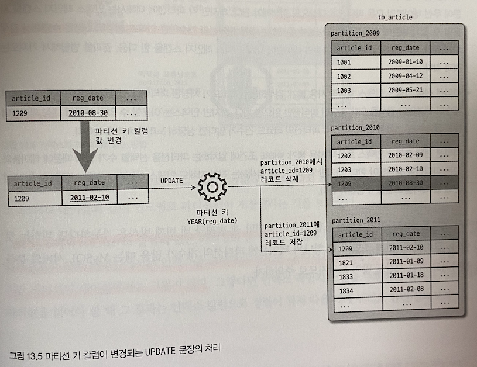
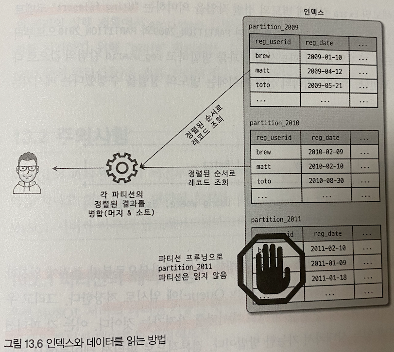
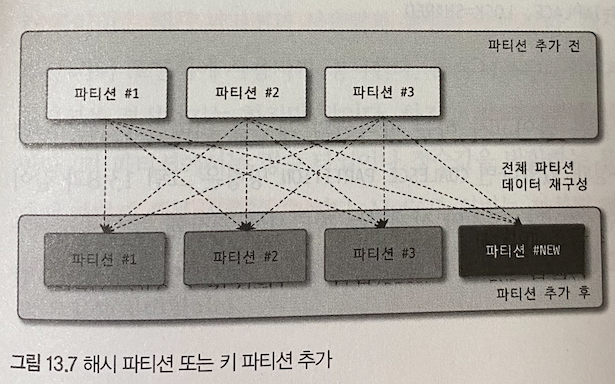
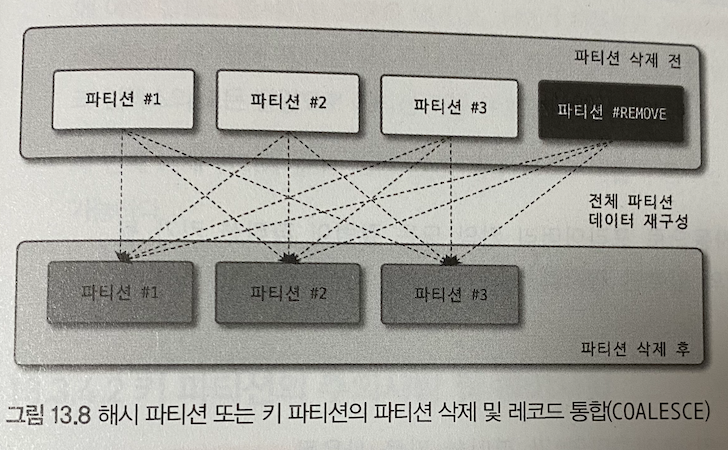

# 지옥 스터디 - 12 파티션
- 파티션 이란 ? **테이블이 논리적으론 하나 이지만, 물리적으로 여러 테이블로 분리** 해 관리할 수 있게 해주는 기법
- 주로 대용량 테이블을 물리적으로 분산하는 것이 목적
- 하지만 만병통치약이 아니므로 잘 고민후 적용해야 한다.

> 은탄환은 없다, 오히려 파티션 적용이 오버헤드를 부르는 경우도 있으므로 주의

## 개요

### 파티션을 사용하는 이유
- 데이터가 많다고 무조건 파티션을 적용하는 것은 좋지 않다.
- 테이블이 너무 커서 **인덱스 크기가 물리적인 메모리보다 훨씬 크거나**, 데이터 특성상 **주기적인 삭제가 필요한 경우** 등이 파티션이 필요한 경우라고 할 수 있다.

#### 단일 INSERT 와 단일 또는 범위 SELECT 의 빠른 처리
- 인덱스는 일반적으로 SELECT 를 위한 것이지만 UPDATE/DELETE 쿼리를 위해 필요한 경우도 많다.
- UPDATE/DELETE 처리를 위하 대상 레코드를 **검색** 해야 하기 때문에 인덱스가 필수적
- 인덱스가 커질수록 SELECT 는 물론 UPDATE/DELETE 작업도 함께 느려진다는 것을 알아야함.
- 인덱스의 **워킹셋 (Working Set)** 이 물리메모리 보다 크다면 쿼리 처리성능은 상당히 느려진다.


- 위 그림은 파티션을 하는경우와 파티션 하지 않는 경우 인덱스의 워킹셋이 미치는 영향을 보여주는 그림.
- 파티션을 하지않는다면, 인덱스도 커지고 그만큼 물리적인 메모리공간도 더 필요해진다.
- 결론적으로 파티션은 **데이터와 인덱스를 조각화** 해 물리적 메모리를 효율적으로 사용할 수 있게 해준다.

`워킹셋 (Working Set)`
- 전체데이터가 100만건이라고 해서 그 데이터가 모두 빈번하게 사용되는 것은 아니다.
- 전체의 2~30 % 가 대부분의 트래픽을 차지할 것
- 이중 활발하게 사용되는 데이터를 **워킹셋** 이라고 한다.

> 파레토의 법칙..

#### 데이터의 물리적인 저장소를 분리
- 데이터 파일이나 인덱스 파일의 크기가 크다면 백업이나 관리 차원에서 비용이 커진다.
- 이를 위해 MySQL 은 파티션을 통해 파일의 크기를 조절하거나, 파티션 별 파일들이 저장될 위치, 디스크를 구분해 지정하는 방법도 지원한다.
- 하지만 테이블의 **파티션 별 인덱스를 생성하거나, 파티션 별 다른 인덱스를 가지는 방식을 지원하지 않는다.**

#### 이력 데이터의 효율적인 관리
- 로그 데이터는 시간이 지나면 별도로 아카이빙 하거나, 백업 후 삭제하는 것이 일반적이다.
- 다른 데이터에 비해 라이프 사이크링 상당히 짧은 것이 특징.
- 하지만 로그 테이블에서 데이터를 삭제하거나 백업하는 작업은 일반적인 테이블에 비해 상당히 부하가 큼.
- 이를 파티셔닝해 관리한다면 상당히 빠르고 쉽게 해결할 수 있음.


### MySQL 파티션의 내부 처리

```sql
CREATE TABLE tb_article(
    article_id INT NOT NULL,
    reg_date DATETIME NOT NULL,
    PRIMARY KEY (article_id, reg_date)
) PARTITION BY RANGE (YEAR(reg_date)) (
    PARTITION p2009 VALUES LESS THAN (2010),
    PARTITION p2010 VALUES LESS THAN (2011),
    PARTITION p2011 VALUES LESS THAN (2012),
    PARTITION p9999 VALUES LESS THAN MAXVALUE ,
);
```
- 위 예제에서 `reg_date` 컬럼을 **파티션 키** 로 지정했다.
- 이는 해당 레코드가 어느 파티션에 저장될지 결정하는 역할을 담당.

#### 파티션 테이블의 레코드 INSERT
- INSERT 쿼리 실행시 파티션 키의 값을 이용해 **파티션 표현식을 평가** 한다.
- 해당 결과를 이용해 저장될 적절한 파티션을 결정.
- 파티션이 결정된 후, 나머지 과정은 일반 테이블과 동일한 처리과정으로 진행됨.


#### 파티션 테이블의 UPDATE
- UPDATE 쿼리를 실행하려면 해당 레코드가 **어느 파티션에 존재하는지** 찾아야 한다.
- WHERE 조건에 파티션 키 칼럼이 존재한다면, 해당 값을 이용해 **특정 파티션** 에서 검색을 수행한다.
- 하지만 파티션 키가 조건에 존재하지 않는다면 **모든 파티션** 을 검색해야 한다.
- 실제 레코드 변경작업 또한 UPDATE 쿼리가 어떤 컬럼을 변경하냐에 따라 처리가 달라짐.
  - 파티션 키 컬럼을 변경한다면, 기존 파티션에서 해당 레코드를 삭제하고, 새로운 파티션에 새롭게 레코드를 저장 (DELETE & INSERT)
  - 파티션 키를 제외한 컬럼을 변경한다면 일반 테이블과 동일하게 처리



#### 파티션 테이블의 검색
- 파티션 테이블을 검색할때 **성능에 큰 영향을 미치는 조건** 은 다음과 가탇.
  - WHERE 절 조건으로 검색할 파티션을 찾을 수 있는가 ?
  - WHERE 절 조건이 인덱스를 효율적으로 사용할 수 있는가 ?

`파티션 선택 가능 + 인덱스 효율적 선택 가능` 
- 쿼리가 가장 효율적으로 처리된다.
- 파티션 개수와 상관없이 꼭 필요한 파티션만 인덱스 레인지 스캔한다.

`파티션 선택 불가 + 인덱스 효율적 선택 가능`
- 파티션을 찾을 수 없기 때문에 모든 파티션을 대상으로 인덱스 레인지 스캔한다.
- 파티션 개수만큼 인덱스 레인지스캔을 한 후 결과를 병합해 가져옴.

`파티션 선택 가능 + 인덱스 선택 불가`
- 특정 파티션을 대상으로 풀 테이블 스캔한다.
- 각 파티션의 레코드가 많을수록 성능이 느려짐.

`파티션 선택 불가 + 인덱스 효율적 선택 불가`
- 가장 최악의 경우
- 파티션 개수만큼 풀 테입르 스캔함.

> 3/4번 방식은 가능하면 피하는 것이 좋음.

#### 파티션 테이블의 인덱스 스캔과 정렬
- MySQL 파티션 테이블의 인덱스는 모두 로컬 인덱스
- 파티션과 관계없이 글로벌한 인덱스를 지원하지 않는다.
- 파티션 테이블의 인덱스의 특징은, 파티션 순서대로 정렬되어 있지 않다는 점이다.
- 일반적인 테이블이라면 인덱스 순서대로 읽을시 정렬되어 있다.
- 하지만 파티션 테이블의 경우 그렇지 않음에 유의할 것.



- MySQL 은 여러 파티션에 대해 인덱스 스캔 수행시, 각 파티션으로 부터 조건에 일치하는 레코드를 순서대로 읽으며 **우선순위 큐** 에 임시로 저장한다.
- 그리고, 다시 필요한 순서대로 데이터를 가져옴 **인덱스의 정렬 순서)**
  - 각 파티션에서 읽은 데이터가 이미 정렬된 상태라 가능한 것.
- 파티션 테이블에서 인덱스 스캔을 통해 레코드를 읽을 때 MySQL 서버가 별도의 정렬 작업을 수행하지 않는다.

#### 파티션 프루닝
- 옵티마이저의 최적화 단계에서 필요한 파티션만 골라내고, 불필요한 것들은 제외하는 것을 **파티션 프루닝 (Partition pruning)** 이라고 한다.
- 파티션 프루닝 정보는 실행 계획을 떠보면 partitions 컬럼을 통해 알 수 있다.

## 주의사항

#### 파티션의 제약 사항
1. 스토어드 루틴, UDF, 사용자 변수 등을 파티션 표현식에 사용할 수 없음.
2. 파티션 표현식은 컬럼 또는 MySQL 내장함수를 사용할 수 있다. 하지만 일부 함수들은 파티션 프루닝을 지원하지 않을 수 있음.
3. PK 를 포함한 모든 유니크 인덱스는 **파티션 키 컬럼을 포함** 해야 한다.
4. 파티션된 테이블의 인덱스는 모두 로컬 인덱스이고, 모두 동일한 구조를 가져야 한다. 파티션 개별로 변경하거나 추가할 수 없다.
5. 동일 테이블에 속한 모든 파티션은 동일한 스토리지 엔진만 가질 수 있다.
6. 최대 (서브 포함) 8192 개 파티션을 가질 수 있다.
7. 파티션 생성이후 `sql_mode` 시스템 변수 변경은 데이터 파티션의 일관성을 깨뜨릴 수 있다.
8. 파티션 테이블에서 **외래키** 를 사용할 수 없다.
9. 파티션 테이블은 **전문 검색 인덱스 생성 또는 전문 검색 쿼리** 를 사용할 수 없다.
10. 공간 데이터를 저장하는 컬럼은 사용할 수 없다.
11. 임시 테이블은 사용할 수 없다.

파티션 표현식에서 기본적인 산술연산자를 사용할 수 잇고, 다음 내장함수들을 사용할 수 있다.

```sql
ABS(), CEILING(), EXTRACT(), FLOOR(), MOD(),
DATEDIFF(), DAY(), DAYOFMONTH(), DATYOFWEEK(), DAYOFYEAR(), HOUR(), MICROSECOND(), MINUTE(),
MONTH(), QUARTER(), SECOND(), TIME_TO_SEC(), TO_DAYS(), TO_SECONDS(), UNIX_TIMESTAMP(),
WEEKDAY(), YEAR(), YEARWEEK()
```
- 표현식에 사용가능하다고 해서, 모두 파티션 프루닝 기능을 지원하지 않으므로 유의할 것.

### 파티션 사용시 주의사항
- 파티션의 목적은 **작업 범위를 줄이는 것** 이다.
- 유니크 인덱스는 **중복 레코드에 대한 체크 작업** 때문에 범위가 좁혀지지 않는다.

#### 파티션과 유니크 키 (프라이머리 키 포함)
- 테이블에 유니크 인덱스 (PK 포함) 가 있다면 파티션 키는 모든 유니크 인덱스의 일부 또는 모든 컬럼을 포함해야 한다.

`잘못된 예시`

```sql
-- 1
CREATE TABLE tb_partition(
    fd1 INT NOT NULL,
    fd2 INT NOT NULL,
    fd3 INT NOT NULL,
    UNIQUE KEY (fd1, fd2)
) PARTITION BY HASH (fd3)
PARTITIONS 4;

-- 2
CREATE TABLE tb_partition(
    fd1 INT NOT NULL,
    fd2 INT NOT NULL,
    fd3 INT NOT NULL,
    UNIQUE KEY (fd1),
    UNIQUE KEY (fd2)
) PARTITION BY HASH (fd1 + fd2)
PARTITIONS 4;

-- 3
CREATE TABLE tb_partition(
    fd1 INT NOT NULL,
    fd2 INT NOT NULL,
    fd3 INT NOT NULL,
    PRIMARY KEY (fd1),
    UNIQUE KEY (fd2, fd3)
) PARTITION BY HASH (fd1 + fd2)
PARTITIONS 4;
```
- 위 예제들은 모두 잘못된 파티션 테이블 생성 방법이다.
  - 1번의 경우, 유니크 키와 파티션 키가 전혀 관계가 없으므로 불가능.
  - 2번의 경우 fd1 만으로 파티션 결정이 나지 않는다.
    - fd2 도 함께 있어야 파티션 위치 판단 가능
  - 3번의 경우 PK 만으로 파티션 결정이 나지 않는다. fd2, fd3 으로도 파티션 위치 판단이 불가능.

`올바른 예시`

```sql
-- 1
CREATE TABLE tb_partition(
    fd1 INT NOT NULL,
    fd2 INT NOT NULL,
    fd3 INT NOT NULL,
    UNIQUE KEY (fd1, fd2, fd3)
) PARTITION BY HASH (fd1)
PARTITIONS 4;

-- 2
CREATE TABLE tb_partition(
    fd1 INT NOT NULL,
    fd2 INT NOT NULL,
    fd3 INT NOT NULL,
    UNIQUE KEY (fd1, fd2)
) PARTITION BY HASH (fd1 + fd2)
PARTITIONS 4;

-- 3
CREATE TABLE tb_partition(
    fd1 INT NOT NULL,
    fd2 INT NOT NULL,
    fd3 INT NOT NULL,
    UNIQUE KEY (fd1, fd2, f3),
    UNIQUE KEY (f3),
) PARTITION BY HASH (fd3)
PARTITIONS 4;
```

#### 파티션과 `open_files_limit` 시스템 변수
- MySQL은 일반적으로 테이블을 **파일 단위** 로 관리한다.
- 때문에 동시에 오픈된 파일수가 많아질 수 있는데, 이를 제한하기 위한 `open_files_limit` 시스템 변수를 제공한다.
- 일반적인 테이블은 테이블당 오픈된 파일수가 2 ~ 3 개 수준이다.
- 파티션 테이블의 경우 파티션 개수만큼 늘어남 (파티션 수 * 2 ~ 3)
- 쿼리가 적절히 파티션 프루닝으로 최적화 되었다고 해도, 동시에 **모든 파티션의 데이터 파일을 오픈** 해야 한다.
- 때문에 파티션을 많이 사용한다면 위 옵션으로 조절해 주어야함.

## MySQL 파티션 종류
- 다른 DBMS 와 동일한 **기본 파티션 기법** 을 제공하고 있고, 해시와 키 파티션에 대해 추가적인 기법도 제공한다.
  - 레인지 파티션
  - 리스트 파티션
  - 해시 파티션
  - 키 파티션

### 레인지 파티션
- 파티션 키의 **연속된 범위** 로 파티션을 정의하는 방법.
- 가장 일반적으로 사용되는 파티션 방법 중 하나이다.

#### 레인지 파티션의 용도
- 날짜를 기반 데이터가 누적되고, 연도나 월/일 단위로 분석 및 삭제해야할 때
- 범위 기반 데이터를 여러 파티션에 균등하게 나눌 수 있을 때
- 파티션 키 위주로 검색이 자주 실행될 때

`파티션의 장점`
- 큰 테이블을 작은 크기의 파티션으로 분리
- 필요한 파티션만 접근 (R/W)

#### 레인지 파티션 테이블 생성

```sql
CREATE TABLE employees (
    id INT NOT NULL,
    first_name VARCHAR(30),
    last_name VARCHAR(30),
    hired DATE NOT NULL DEFAULT '1970-01-01'
) PARTITION BY RANGE (YEAR(hired)) (
    PARTITION p0 VALUES LESS THAN (1991),
    PARTITION p1 VALUES LESS THAN (1996),
    PARTITION p2 VALUES LESS THAN (2001),
    PARTITION p3 VALUES LESS THAN MAXVALUE 
);
```
- `PARTITION BY RANGE` 키워드를 통해 레인지 파티션을 정의
- `PARTITION BY RANGE` 키워드 이후 컬럼이나 내장함수를 이용해 **파티션 키를 명시**
- `VALUE LESS THAN` 으로 명시된 값보다 **작은 값** 만 파티션에 저장한다.
  - 해당 값은 포함되지 않으므로 유의
- `VALUE LESS THAN MAXVALUE` 로 명시되지 않은 레코드를 저장할 파티션 지정
  - RANGE 파티션의 특징 중 하나.
- `VALUE LESS THAN MAXVALUE` 가 없다면 2001 보다 큰 값이 저장될 때 에러가 발생함.

#### 레인지 파티션의 분리와 병합

`단순 파티션 추가`

```sql
ALTER TABLE employees
ADD PARTITION (PARTITION p4 VALUES LESS THAN (2011));
```
- 이미 `LESS THAN MAXVALUE` 파티션이 존재하는 경우라면 에러가 발생할 수 있따.
- 이런 경우 `ALTER TABLE REORGANIZE PARTITION` 명령을 통해 재배치 해주어야 한다.

```sql
ALTER TABLE employees ALGORITHM=INPLACE, LOCK=SHARED,
    REORGANIZE PARTITION p3 INTO (
    PARTITION p3 VALUES LESS THAN (2011),
    PARTITION p4 VALUES LESS THAN MAXVALUE
  );
```
- `REORGANIZE PARTITION` 명령은 파티션의 레코드를 모두 복사하는 작업을 필요로 한다.
- 만약 p3 의 레코드가 매우 많다면 부하가 상당할 것..
- 일반적으로 `LESS THAN MAXVALUE` 보단 미래에 사용된 파티션을 2 ~ 3 개 정도 미리 만들어주는 형태를 사용하기도 한다.

#### 파티션 삭제
- 파티션 삭제의 경우 `DROP PARTITION` 명령을 사용하면 된다.
- 레인지 파티션/리스트 파티션의 경우 파티션 삭제 작업은 매우 빠르게 처리된다.
- 주로 오래된 데이터를 삭제하는 용도로 자주 사용됨.

```sql
ALTER TABLE employees DROP PARTITION p0;
```
- 레인지 파티션 기준 파티션 삭제시 **항상 가장 오래된 파티션 순서** 로만 삭제가 가능하다.
- 중간에 있는 파티션을 먼저 삭제할 수 없다.
- 추가 또한 가장 마지막 파티션만 추가할 수 있다.

#### 기존 파티션의 분리
- 하나의 파티션을 두 개 이상의 파티션으로 분리할 때 `REORGANIZE PARTITION` 명령을 사용한다.

```sql
ALTER TABLE employees ALGORITHM=INPLACE, LOCK=SHARED,
    REORGANIZE PARTITION p3 INTO (
    PARTITION p3 VALUES LESS THAN (2011),
    PARTITION p4 VALUES LESS THAN MAXVALUE
  );
```
- 이는 기존 파티션의 레코드를 새로운 파티션으로 복사하는 작업이 필요하다.
- 온라인 DDL 사용시 INPLACE 알고리즘을 사용할 수 있지만, 최소한의 읽기 잠금이 필요함.
- 파티션 재구성 동안 테이블 쓰기가 불가능해짐..

#### 기존 파티션의 병합
- 여러 파티션을 하나로 병합하는 경우에도 `REORGANIZE PARTITION` 명령을 사용한다.

```sql
ALTER TABLE employees ALGORITHM=INPLACE, LOCK=SHARED,
  REORGANIZE PARTITION p2, p3 INTO (
  PARTITION p23 VALUES LESS THAN (2011),
  );
```
- 병합의 경우에도 파티션 재구성이 필요하며, 테이블에 대한 읽기 잠금이 필요하다.

### 리스트 파티션
- 리스트 파티션은 레인지 파티션과 매우 유사하게 동작한다.
- 큰 차이는 레인지 파티션은 **파티션 키의 범위** 로 구성하지만, 리스트 파티션은 **파티션 키 하나하나를 리스트로 나열** 한다.
- 때문에 MAXVALUE 와 같은 범위 지정이 불가능하다.

#### 리스트 파티션의 용도
- 파티션 키 값이 코드나 카테고리 처럼 고정적인 경우
- 키 값이 연속되지 않고 정렬 순서와 관계없이 파티션을 해야할 경우
- 파티션 키 값을 기준으로 레코드 건수가 균일하고, 검색 조건에 파티션 키가 자주 사용될 경우

#### 리스트 파티션 테이블 생성

```sql
CREATE TABLE product(
    id INT NOT NULL,
    name VARCHAR(30),
    category_id INT NOT NULL
) PARTITION BY LIST(category_id) (
    PARTITION p_appliance VALUES IN (3),
    PARTITION p_computer VALUES IN (1, 9)
);
```
- `PARTITION BY LIST` 키워드로 리스트 파티션을 명시한다.
- `PARTITION BY LIST` 키워드 뒤에 파티션 키를 정의하는데, 해당 컬럼의 값을 그대로 사용한다.
- `VALUES IN` 을 통해 파티션 별로 저장할 키 값을 정의 한다
- 파티션 별 저장할 키 를 NULL 로 명시할 수도 있다.
- MAXVALUE 는 정의할 수 없다.

> 파티션 타입이 문자열 타입일 경우엥도 사용 가능하다.

#### 리스트 파티션 분리와 병합
- `VALUES LESS THAN` 이 아닌 `VALUES IN` 을 사용한다는 것 외에는 레인지 파티션과 동일하다.

#### 리스트 파티션 주의사항
- 명시되지 않은 나머지 값을 저장하는 `MAXVALUE` 정의가 불가능하다.
- 레인지 파티션과 달리 NULL 을 저장하는 파티션도 생성 가능하다.

### 해시 파티션
- MySQL 에서 정의한 해시 함수를 사용한 파티션 방법
- 이는 복잡한 알고리즘이 아닌, 파티션 표현식의 결과값을 파티션 개수로 나눈 나머지로 저장될 파티션을 결정하는 방법이다.
- 때문에 파티션 키는 항상 정수 타입이거나 정수를 반환하는 표현식이어야 한다.
- 파티션 개수가 알고리즘과 연관되어 있기 때문에 파티션 추가/삭제 작업시 파티션 전체를 재분배하는 작업이 필요하다.

#### 해시 파티션의 용도
- 레인지/리스트 파티션으로 데이터를 균등하게 나누는것이 어려울 경우
- 테이블의 모든 레코드가 비슷한 사용빈도를 보이지만 테이블이 너무 커 파티션을 적용해야 하는 경우

> 대표적인 경우가 회원 테이블

#### 해시 파티션 테이블 생성

```sql
CREATE TABLE employees (
    id INT NOT NULL,
    first_name VARHCAR(30),
    last_name VARCHAR(30),
    hired DATE NOT NULL DEFAULT '1970-01-01'
) PARTITION BY HASH (id) PARTITIONS 4;
```
- `PARTITION BY HASH` 키워드로 해시 파티션으로 지정
- `PARTITION BY HASH` 키워드 뒤에 파티션 키를 명시
- 해시 파티션의 파티션 키나 표현식은 반드시 정수타입 이어야 한다.
- 해시나 키 파티션에서는 특정 파티션을 삭제/병합 하는 작업이 거의 불필요하다.
- 때문에 파티션 이름을 지정하는 경우가 적음
- 각 파티션명은 기본적으로 p0, p1, p2.. 순으로 생성된다.

#### 해시 파티션의 분리와 병합
- 해시 파티션의 분리와 병합은 대상 테이블의 **모든 파티션을 대상** 으로 재분배 작업이 필요하다.
- 파티션 수가 변경된다는것 => 해시함수 알고리즘을 변경하는 것이기 때문에 이를 피할 수 없다.

#### 해시 파티션 추가
- 해시 파티션은, 특정 파티션 키 값을 파티션 개수 로 `MOD` 연산한 결과에 의해 파티션이 결정된다.
- 즉 테이블에 존재하는 파티션 개수에 따라 알고리즘이 결정된다.
- 해시 파티션을 추가할 때 몇개의 파티션을 더 추가할 것인지만 지정하면 된다.

```sql
ALTER TABLE employees ALGORITHM=INPLACE, LOCK=SHARED,
ADD PARTITION PARTITIONS 6;
```
- 해시 파티션에서 파티션 추가작업은 `INPLACE` 알고리즘으로 실행되더라도 재분배 작업이 필요하며, **읽기 잠금** 이 필요하다.
- 때문에 많은 부하가 발생하며 테이블 쓰기가 불가능 해짐



#### 해시 파티션 삭제
- 해시나 키 파티션은 **파티션 단위로 삭제 기능이 없다**
- 각 파티션에 저장된 레코드가 어떤 부류의 데이터인지 예측할 수 없다.
- 해시 파티션이나 키 파티션에서 파티션 단위로 데이터를 삭제하는 작업은 의미도 없으며 해서도 안되는 작업.

#### 해시 파티션 분할
- 해시 파티션이나 키 파티션에서 특정 파티션을 2개 이상을 분할하는 기능은 없다.

#### 해시 파티션 병합
- 분할과 마찬가지로 통합하는 기능은 없다.
- **파티션 개수를 줄이는 것** 만 가능하다.
- `COALESCE PARTITION` 명령을 사용하면 된다.

```sql
ALTER TABLE employees ALGORITHM=INPLACE, LOCK=SHARED
COALESCE PARTITION1;
```
- 이 또한 모든 레코드가 재배치 되는 작업이 필요하다.
- INPLACE 알고리즘으로 실행되지만 테이블 쓰기가 불가능해지낟.



#### 해시 파티션 주의사항
- 특정 파티션만 삭제하는 기능은 없다.
- 파티션 추가의 경우 기존 모든 데이터의 재배치가 필요하다.
- 레인지나 리스트 파티션과 다른 방식으로 관리되므로 꼭 필요한 지 확인이 필요하다.
- 일반적인 파티션 조작이나 특성은 대부분 리스트나 레인지 파티션이다.
- 해시나 키 파티션을 사용한다면 주의가 필요하다.

### 키 파티션
- 키 파티션은, 해시 파티션과 거의 비슷하다.
- 키 파티션은 **해시 값의 계산도 MySQL 서버가 수행** 한다는 것이 차이점이다.
- 때문에 정수뿐 아닌 대부분의 데이터 타입에 사용할 수 있다.
- `MD5()` 함수를 이용해 해시를 계산하고 `MOD` 연산을 이용해 파티션을 결정한다. 

#### 키 파티션의 생성

```sql
-- PK 가 존재한다면 자동으로 PK 가 파티션 키로 지정
CREATE TABLE k1(
    id INT NOT NULL,
    name VARCHAR(20),
    PRIMARY KEY (id)
)
-- 괄호가 비어있다면 자동으로 PK 의 모든 컬럼이 파티션 키가 된다.
PARTITION BY KEY()
PARTITIONS 2;

-- PK 가 없다면 유니크 키가 파티션 키로 사용됨
CREATE TABLE k1(
     id INT NOT NULL,
     name VARCHAR(20),
     UNIQUE KEY (id)
)
PARTITION BY KEY()
PARTITIONS 2;

-- PK 나 유니크 키의 일부를 파티션 키로 지정
CREATE TABLE dept_emp(
     emp_no INT NOT NULL,
     dept_no CHAR(4),
     PRIMARY KEY (emp_no, dept_no)
)
PARTITION BY KEY(dept_no)
PARTITIONS 2;
```
- `PARTITION BY KEY` 키워드로 키 파티션을 정의
- `PARTITION BY KEY` 키워드 뒤 키 컬럼을 명시한다. 아무런 컬럼도 명시하지 않으면 PK 나 유니크키의 모든 컬럼을 파티션 키로 선택함.
- PK 나 유니크 키 중 일부만 파티션 키로 명시할 수 있다.

#### 키 파티션의 주의사항 및 특이사항
- 키파티션은 MySQL 서버가 `MD5()` 함수로 파티션하기 때문에 모든 타입에 대해 적용이 가능하다.
- PK 나 유니크 키 중 일부만으로도 파티션이 가능하다.
- 유니크 키를 파티션키로 사용한다면 반드시 NOT NULL 이어야 한다.
- 해시 파티션에 비해 레코드를 더 균등하게 분배할 수 있다.

### 리니어 해시 파티션/리니어 키 파티션
- 해시/키 파티션의 경우 파티션 추가 병합시 전체 레코드의 재분배 작업이 필요하다.
- 이를 최소화 하기 위해 **리니어 (Linear)** 알고리즘이 공나된 것
- 각 레코드 분배를 위해 **Power of two (2의 승수)** 알고리즘을 이용한다.
- 이는 파티션 추가/병합시 다른 파티션에 미치는 영향을 최소화 한다.

#### 리니어 해시 파티션/리니어 키 파티션의 추가 및 통합
- Power of two 분배방식을 사용하기에 **특정 파티션의 데이터에 대해서만 이동 작업을 수행** 한다.
- 나머지 파티션들은 재분배 대상이 되지 않는다.

#### 리니어 해시 파티션/리니어 키 파티션과 관련된 주의사항
- Power of two 알고리즘을 사용하기 때문에 작업 범위를 최소화 하는대신, 각 파티션이 가지는 레코드 건수는 일반 해시/키 파티션에 비해 덜 균등해 질 수 있음..
- 파티션 조정이 빈번하다면, 리니어 해시/키 파티션을, 조정이 필요없다면 해시/키 파티션을 사용하는 것이 좋다.

### 파티션 테이블의 쿼리 성능
- 파티션 테이블의 쿼리 성능은 **얼마나 많은 파티션을 프루닝 할 수 있는가** 가 관건
- 테이블을 10개로 파티션해 10개 중 1 ~3 개만 주로 사용한다며 성능향상에 도움이 된다.
- 하지만 10개로 나눠 10개를 균등하게 사용한다면 오히려 오버헤드만 심해지는 결과를 초례할 수 있음.
- 이런 경우 샤딩을 적용할 경우 매우 효율적이다.
- MySQL 서버 파티션은 샤딩이 아니다.
- 파티션 적용시 반드시 파티션 프루닝이 얼마나 도움이 될지 예측후 적용하자.
- 레인지 파티션 이외의 파티션 적용시 파티션 프루닝을 더 많이 고민해 보아야 한다.

## 참고
- https://ko.wikipedia.org/wiki/%ED%8C%8C%EB%A0%88%ED%86%A0_%EB%B2%95%EC%B9%99