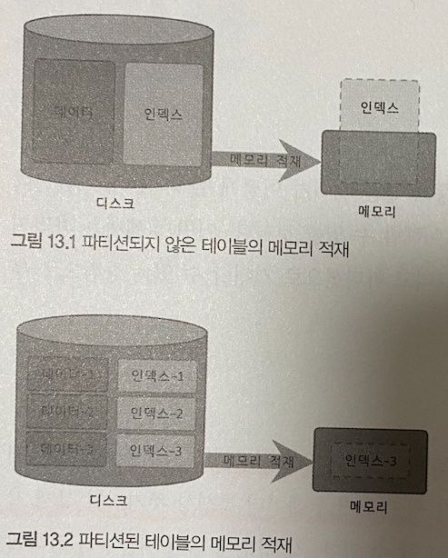

# 지옥 스터디 - 12 파티션
- 파티션 이란 ? **테이블이 논리적으론 하나 이지만, 물리적으로 여러 테이블로 분리** 해 관리할 수 있게 해주는 기법
- 주로 대용량 테이블을 물리적으로 분산하는 것이 목적
- 하지만 만병통치약이 아니므로 잘 고민후 적용해야 한다.

> 은탄환은 없다, 오히려 파티션 적용이 오버헤드를 부르는 경우도 있으므로 주의

## 개요

### 파티션을 사용하는 이유
- 데이터가 많다고 무조건 파티션을 적용하는 것은 좋지 않다.
- 테이블이 너무 커서 **인덱스 크기가 물리적인 메모리보다 훨씬 크거나**, 데이터 특성상 **주기적인 삭제가 필요한 경우** 등이 파티션이 필요한 경우라고 할 수 있다.

#### 단일 INSERT 와 단일 또는 범위 SELECT 의 빠른 처리
- 인덱스는 일반적으로 SELECT 를 위한 것이지만 UPDATE/DELETE 쿼리를 위해 필요한 경우도 많다.
- UPDATE/DELETE 처리를 위하 대상 레코드를 **검색** 해야 하기 때문에 인덱스가 필수적
- 인덱스가 커질수록 SELECT 는 물론 UPDATE/DELETE 작업도 함께 느려진다는 것을 알아야함.
- 인덱스의 **워킹셋 (Working Set)** 이 물리메모리 보다 크다면 쿼리 처리성능은 상당히 느려진다.


- 위 그림은 파티션을 하는경우와 파티션 하지 않는 경우 인덱스의 워킹셋이 미치는 영향을 보여주는 그림.
- 파티션을 하지않는다면, 인덱스도 커지고 그만큼 물리적인 메모리공간도 더 필요해진다.
- 결론적으로 파티션은 **데이터와 인덱스를 조각화** 해 물리적 메모리를 효율적으로 사용할 수 있게 해준다.

`워킹셋 (Working Set)`
- 전체데이터가 100만건이라고 해서 그 데이터가 모두 빈번하게 사용되는 것은 아니다.
- 전체의 2~30 % 가 대부분의 트래픽을 차지할 것
- 이중 활발하게 사용되는 데이터를 **워킹셋** 이라고 한다.

> 파레토의 법칙..

#### 데이터의 물리적인 저장소를 분리
- 데이터 파일이나 인덱스 파일의 크기가 크다면 백업이나 관리 차원에서 비용이 커진다.
- 이를 위해 MySQL 은 파티션을 통해 파일의 크기를 조절하거나, 파티션 별 파일들이 저장될 위치, 디스크를 구분해 지정하는 방법도 지원한다.
- 하지만 테이블의 **파티션 별 인덱스를 생성하거나, 파티션 별 다른 인덱스를 가지는 방식을 지원하지 않는다.**

#### 이력 데이터의 효율적인 관리
- 로그 데이터는 시간이 지나면 별도로 아카이빙 하거나, 백업 후 삭제하는 것이 일반적이다.
- 다른 데이터에 비해 라이프 사이크링 상당히 짧은 것이 특징.
- 하지만 로그 테이블에서 데이터를 삭제하거나 백업하는 작업은 일반적인 테이블에 비해 상당히 부하가 큼.
- 이를 파티셔닝해 관리한다면 상당히 빠르고 쉽게 해결할 수 있음.


### MySQL 파티션의 내부 처리

```sql
CREATE TABLE tb_article(
    article_id INT NOT NULL,
    reg_date DATETIME NOT NULL,
    PRIMARY KEY (article_id, reg_date)
) PARTITION BY RANGE (YEAR(reg_date)) (
    PARTITION p2009 VALUES LESS THAN (2010),
    PARTITION p2010 VALUES LESS THAN (2011),
    PARTITION p2011 VALUES LESS THAN (2012),
    PARTITION p9999 VALUES LESS THAN MAXVALUE ,
);
```
- 위 예제에서 `reg_date` 컬럼을 **파티션 키** 로 지정했다.
- 이는 해당 레코드가 어느 파티션에 저장될지 결정하는 역할을 담당.

#### 파티션 테이블의 레코드 INSERT
- INSERT 쿼리 실행시 파티션 키의 값을 이용해 **파티션 표현식을 평가** 한다.
- 해당 결과를 이용해 저장될 적절한 파티션을 결정.
- 파티션이 결정된 후, 나머지 과정은 일반 테이블과 동일한 처리과정으로 진행됨.


## 참고
- https://ko.wikipedia.org/wiki/%ED%8C%8C%EB%A0%88%ED%86%A0_%EB%B2%95%EC%B9%99