# 지옥 스터디 - 15 복제
- 데이터베이스 운영시 가장 중요한 두 가지 요소 ?
  - **확장성 (Scalability)** 과 가용성 **(Availability)**
- 대용량 트래픽을 안정적으로 처리하기 위한 필수 요소.
- 이를 위해 일반적으로 사용되는 기술이 바로 **복제 (Replication)**

## 개요
- 복제는, 한 서버에서 다른 서버로 데이터가 **동기화** 되는 것을 말한다.
- **원본 데이터** 를 가진 서버를 **소스 (Source) 서버**
- **복제된 데이터** 를 가진 서버를 **레플리카 (Replica) 서버** 라고 한다.
- 일반적으로 서비스에서 사용할 DB 서버 구축시 메인으로 사용할 소스서버 한대와 레플리카 서버를 한대 이상 함께 구축한다.

`레플리카 서버 구축의 목적`
1. 스케일 아웃 (Scale out)
   - 트래픽이 증가해 부하를 감당하기 위해 서버의 사양을 높이는 방법을 **스케일 업 (Scale-up)** 이라고 하고
   - 서버 대수를 늘려 부하를 감당하는 방법을 **스케일 아웃 (Scale-out)** 이라고 한다.
   - 스케일 아웃은 스케일 업 보다 **갑자기 늘어나는 트래픽을 대응하기에 더 유연한 구조**
2. 데이터 백업
   - 사용자 실수로 데이터 삭제시 서비스 운영에 치명적일 수 있다.
   - 이를 위해 주기적으로 백업하는 것이 필수적
   - 하지만 이런 백업을 소스 서버에서 처리한다면 서비스 쿼리들이 영향을 받을 수 있음
   - 때문에 주로 레플리카 서버를 구축하고, 데이터 백업은 레플리카 서버에서 실행한다.
3. 데이터 분석
   - 서비스 운영을 하다보면 BM 을 개발하기 위한 인사이트를 얻기 위해 분석용 쿼리를 실행하기도 한다.
   - 이런 경우 위와 같은 이유로 서비스 쿼리들이 영향을 받을 수 있음
   - 때문에 레플리카를 구축해 분석용 쿼리 전용으로 사용하기도 한다.
4. 데이터의 지리적 분산
   - 사용자에게 빠른 응답을 제공하기 위해 애플리케이션 서버와 DB 서버는 지리적으로 가깝게 위치하는 것이 좋다.
   - DB 서버의 위치를 이동하지 못하는 경우 레플리카를 구축해 이를 활용한다.

## 복제 아키텍쳐
- MySQL 에서 발생하는 **모든 변경사항은 별도의 로그파일에 순서대로 기록** 된다.
  - 이를 바이너리 로그 (Binary Log), Bin Log 라고 한다.
- 데이터베이스나 테이블의 구조 변경, 계정 또는 권한 변경정보까지 모두 저장된다.
- 바이너리 로그에 기록된 각 변경 정보들을 **이벤트 (Event)** 라고도 한다.
- MySQL 의 복제는 바이너리 로그 기반으로 구현되어 있다.
- 소스 서버에서 생성된 바이너리 로그를 생성하고, 레플리카 서버에서 소스 서버의 바이너리 로그를 읽어 별도로 저장하는데 이를 **릴레이 로그 (Relay log)** 라고 한다.


- MySQL 은 세 개의 쓰레드에 의해 복제가 진행된다.
- 이중 하나는 소스서버에, 나머지는 레플리카 서버에 존재하며, 각 스레드 들의 역할은 다음과 같다.

`바이너리 로그 덤프 스레드 (Binary Log Dump Thread)`
- 레플리카 서버는 데이터 동기화를 위해 **소스 서버에 접속** 해 바이너리 로그 정보를 요청한다.
- 소스 서버는 **레플리카 서버가 연결될 때 내부적으로 바이너리 로그 덤프 스레드를 생성** 해 바이너리 로그를 레플리카 서버로 전송한다.
- 이 스레드는 레플리카 서버로 보낼 각 이벤트를 읽을때 바이너리 로그에 일시적인 락을 수행하며, 읽은 뒤 바로 해제 한다.

`레플리케이션 I/O 스레드 (Replication I/O Thread)`
- 복제가 시작 (`START REPLICA` or `START SLAVE` 명령) 될 때 레플리카 서버는 **I/O 스레드를 생성** 하고 복제가 멈추면 (`STOP REPLICA` or `STOP SLAVE` 명령) I/O 스레드는 종료된다.
- 이 스레드는 소스 서버의 바이너리 로그 이벤트를 읽어와 **릴레이 로그에 저장하는 역할** 을 수행한다.
- 바이너리 로그는 읽어 쓰는 역할만 수행하기 떄문에 I/O 스레드 라고 한다.

`레플리케이션 SQL 스레드 (Replication SQL Thread)`
- I/O 스레드에 의해 작성된 릴레이 로그 파일을 읽어 실행하는 역할을 수행한다.

레플리카 서버에서 I/O 스레드와 SQL 스레드는 서로 독립적으로 동작한다.

때문에 각 스레드에서 처리하는 것이 느리더라도 영향을 미치지 않는다.

하지만 **소스 서버에서 문제** 가 생겨 I/O 스레드가 정상 동작하지 못한다면 복제는 중단 된다. (복제 기능만 중단됨)

복제가 시작되면 레플리카 서버는 기본적으로 **세 가지 유형의 복제 관련 데이터** 를 생성 및 관리한다.

`릴레이 로그 (Relay log)`
- I/O 스레드에서 생성되는 파일이며 바이너리 로그에서 읽어온 **이벤트 (트랜잭션 정보)** 가 저장된다.

`커넥션 메타 데이터 (Connection Meta Data)`
- I/O 스레드가 소스 서버에 연결할때 사용하는 DB 계정 정보와 현재 읽고 있는 소스 서버의 바이너리 로그 파일명, 파일내 위치 값 등이 담겨 있다.
- 기본적으로 `mysql.slave_master_info` 테이블에 저장됨

`어플라이어 메타데이터 (Applier Metadata)`
- SQL 스레드에서 릴레이 로그에 저장된 소스 서버의 이벤트들을 레플리카 서버에 **적용 (Replay)** 하는 컴포넌트를 **어플라이어 (Applier)** 라고 한다.
- 어플라이어 메타데이터는 최근 적용된 이벤트에 대해 해당 이벤트가 저장된 릴레이 로그 파일명과 파일내 위치 정보 등을 담고 있다.
- SQL 스레드는 이 정보들을 바탕으로 레플리카 서버에 나머지 이벤트들을 적용한다.
- 기본적으로 `mysql.slave_relay_log_info` 테이블에 저장됨

커넥션 및 어플라이어 메타데이터는 `master_info_repository` 와 `relay_log_info_repository` 시스템 변수를 통해 **어떤형태의 데이터로 관리** 할 것인지 설정할 수 있다.
- FILE : MySQL 의 데이터 디렉터리에서 `master.info` 와 `relay-log.info` 파일로 관리 된다.
  - 각 파일의 경로는 `--master-info-file` 옵션과 `relay_log_info_file` 시스템 변수로 설정 가능
- TABLE : `mysql.slave_master_info` 와 `mysql.slave_relay_log_info` 테이블에 각각 저장된다.

> 위 시스템 변수들은 MySQL 8.0.2 버전 부터 기본 값이 TABLE

FILE 로 설정하는 경우 I/O 스레드와 SQL 스레드 동작시 두 파일이 내용이 동기화 되지 않는 경우가 빈번하겍 발생ㅎㅆ다
- 8.0.2 버전 이후 Deprecated

MySQL 이 갑자기 종료 되더라도 `TABLE` 로 설정한 경우 SQL 스레드가 트랜잭션 적용시 아토믹하게 업데이트 되기 때문에 문제 없이 복제가 진행된다.
- 이를 **크래시 세이프 복제 (Crash-safe replication)** 이라고 함.

## 복제 타입
- MySQL 의 복제는 바이너리 로그에 기록된 변경 내역들을 **식별하는 방식** 에 따라 **바이너리 로그 파일 위치 기반 복제 (Binary Log File Position Based Replication)** 와 **글로벌 트랜잭션 ID 기반 복제 (Global Transaction Identifiers Based Replication)** 으로 나뉜다.

### 바이너리 로그 파일 위치 기반 복제
- 바이너리 로그 파일 위치 기반 복제는 MySQL 복제 기능이 처음 도입됬을때 제공되던 방식이다.
- 레플리카 서버에서 **소스 서버의 바이너리 로그 파일명** 과 **파일 내의 위치 (Offset or Position)** 로 개별 바이너리 로그 이벤트를 식별해 복제가 진행되는 형태
- 최초 구축시 레플리카 서버에 **소스 서버의 어떤 이벤트 부터 동기화를 수행할 것인가** 에 대한 정보를 설정해야 한다.
- 복제가 설정된 레플리카 서버는 **소스 서버의 어느 이벤트까지 로컬로 가져왔고, 적용했는지에 대한 정보를 관리** 한다.
- 소스 서버에 해당 정보를 전달해 그 이후의 이벤트 들을 가져오게 되기 때문에 각 이벤트에 대한 식별이 반드시 필요하다.
- 바이너리 로그 파일 위치 기반 복제는 이런 이벤트 하나하나를 **소스 서버의 바이너리 로그 파일명과 파일 내에서 위치 값 (File Offset) 의 조합으로 식별** 한다.
- 때문에 복제를 일시 중단할 수 있고 재개할 때도 자신이 마지막으로 적용했던 이벤트 이후의 이벤트들 부터 다시 읽을 수 있음.
- 중요한 부분은 복제에 참여한 MySQL 서버들이 모두 고유한 **service_id** 값을 가지고 있어야 한다는 점.
  - MySQL 서버마다 설정이 가능한데 기본 값은 1
- 바이너리 로그에 기록된 service_id 와 레플리카 서버의 server_id 가 동일하다면 해당 이벤트를 무시하게 되기 때문에 복제가 정상동작 하지않을 수 있다.
  - 자신의 서버에서 발생한 이벤트로 간주하게 됨

#### 바이너리 로그 파일 위치 기반의 복제 구축
- 복제 설정시 각 서버에 데이터가 이미 존재하는지 여부, 복제를 어떻게 활용할 것인지 등에 따라 복제 설정 과정 및 구축 방법이 달라진다.

`설정 준비`
- 기본적으로 MySQL 복제를 사용하려면 **소스 서버에서 반드시 바이너리 로그가 활성화 되어야 함**
  - MySQL 8.0 기준 바이너리 로그가 기본적으로 활성화 되어 있음
  - 서버 시작시 데이터 디렉터리 하위에 `binlog` 라는 이름으로 생성됨
- 바이너리 로그 파일 위치 기반 복제를 사용하는 경우 각 MySQL 서버가 고유한 server_id 를 가지고 있어야 한다.

```shell
## 소스 서버 설정
[mysqld]
server_id=1
log_bin=/binary-log-dir-path/binary-log-name
sync_binlog=1
binlog_cache_size=5M
max_binlog_size=512M
binlog_expire_logs_seconds=1209600
// ...
```
- `SHOW MASTER STATUS` 명령으로 바이너리 로그가 정상 기록중인지 확인이 가능하다.
- 레플리카 서버도 소스 서버와 동일하게 데이터 디렉터리 하위에 릴레이 로그 파일이 자동 생성 된다.
  - `relay_log` 시스템 변수를 사용해 로그 파일 위치나 파일명을 설정할 수 있음.
- 릴레이 로그에 기록된 이벤트는 레플리카 서버에 적용후 자동 삭제되는데, 이를 유지하고자 한다면 `relay_log_purge` 시스템 변수를 OFF 로 설정하면 됨.
- 일반적으로 읽기전용으로 사용하므로 `read_only` 설정도 함께 사용하는 편이 좋다.
- 추후 소스 서버로 승격됨을 고려하면 `log_slave_updates` 시스템 변수도 명시하는 것이 좋음
  - 기본적으로 레플리카는 복제에 의한 데이터변경은 기록하지 않는다.
  - 이 변수를 설정하면 복제에 의한 데이터 변경도 자신의 바이너리 로그에 기록하게 됨

```shell
## 레플리카 서버 설정
[mysqld]
server_id=2
relay_log=/relay-log-dir-path/relay-log-name
relay_log_purge=ON
readonly
log_slave_updates
// ...
```

`복제 계정 준비`
- 레플리카 서버가 바이너리 로그를 가져오려면 **소스 서버에 접속할 계정이 필요** 하다.
- 이를 복제용 계정이라고 함.
- 새로운 계정을 만들 필요 없이 기존 계정에 복제 관련 권한을 추가하는 것 보단 보안적 측면을 고려해 별도로 생성하는 것이 좋다.
- 이는 복제를 시작하기전 미리 준비돼어 있어야 하며 반드시 `REPLICATION SLAVE` 권한을 가지고 있어야 한다.

```shell
CREATE USER 'repl_user'@'%' IDENTIFIED BY 'repl_user_password';
GRANT REPLICATION SLAVE ON *.* TO 'repl_user'@'%';
```

`데이터 복사`
- 소스 서버의 데이터를 `mysqldump` 로 복사하는 경우 `--single-transaction` 과 `--master-data` 옵션을 반드시 사용해야 한다.
  - `--single-transaction` 옵션은 데이터 덤프시 하나의 트랜잭션 을 사용해 덤프가 진행되게 하므로 락을 사용하지 않는다.
  - `--master-data` 옵션은 덤프 시작 시점의 소스 서버의 바이너리 로그 파일명과 위치 정보를 포함한느 복제 설정 구문 (CHANGE REPLICATION SOURCE TO or CHANGE MASTER TO) 이 덤프 파일 헤더에 기록되게 하는 옵션이므로 반드시 필요함.
- `--master-data` 옵션 사용시 `FLUSH TABLES WITH READ LOCK` 명령을 사용해 글로벌 락을 거는데, 이는 바이너리 로그의 위치를 순간적으로 고정시키기 위함이다.
  - 1 또는 2로 설정이 가능하다.
  - 1 : 덤프 파일 내의 복제 설정 구문이 실제 실행 가능한 형태로 기록됨.
  - 2 : 해당 구문이 주석으로 처리되어 참조만 할 수 있는 형태로 기록됨.

```shell
mysqldump -uroot -p --single-transaction --master-data=2 \
--opt --routines --triggers --hex-blob --all-databases > source_data.sql
```

`복제 시작`
- 복제를 설정하는 명령은 `CREATE REPLICATION SOURCE TO (CHANGE MASTER TO)` 명령으로 mysqldump 로 받은 파일의 헤더에서 참조가 가능하다.
- 백업 받은 파일은 크기가 크기 떄문에 less 같은 페이지 단위 뷰어로 파일을 여는 것이 좋음.

```shell
-- // MySQL 8.0.23 이상
CHANGE REPLICATION SOURCE TO
  SOURCE_HOST='source_server_host',
  SOURCE_PORT=3306,
  SOURCE_USER='repl_user',
  SOURCE_PASSWORD='repl_user_password',
  SOURCE_LOG_FILE='binary-log.00002',
  SOURCE_LOG_POST=2708,
  GET_SOURCE_PUBLIC_KEY=1;

-- // MySQL 8.0.23 미만
CHANGE MASTER TO
  MASTER_HOST='source_server_host',
  MASTER_PORT=3306,
  MASTER_USER='repl_user',
  MASTER_PASSWORD='repl_user_password',
  MASTER_LOG_FILE='binary-log.00002',
  MASTER_LOG_POST=2708,
  GET_MASTER_PUBLIC_KEY=1;
```
- SOURCE_HOST (MASTER_HOST) : 레플리카 서버에서 복제 연결할 소스 서버
- SOURCE_POST (MASTER_PORT) : 소스 서버에서 구동중인 MySQL 서버의 포트번호
- SOURCE_USER (MASTER_USER), SOURCE_PASSWORD (MASTER_PASSWORD) : 복제용 계정 정보
- SOURCE_LOG_FILE (MASTER_LOG_FILE), SOURCE_LOG_POST (MASTER_LOG_POS) : 복제를 시작하고자 하는 바이너리 로그 파일 명과 위치 값
- GET_SOURCE_PUBLIC_KEY (GET_MASTER_PUBLIC_KEY) : RSA 키 기반 공개 키를 소스서버에 요청할 것인지 여부

명령 실행 이후 `SHOW REPLICA STATUS (SHOW SLAVE STATUS)` 명령 실행시 복제 관련 정보고 레플리카 서버에 등록된 것을 확인할 수 있다.

하지만 `Replica_IO_Running (Slave_IO_Running)` 과 `Replica_SQL_Running (Slave_SQL_Running)` 칼럼값은 NO 인데 복제 관련 정보만 등록되었을 뿐 동기화는 시작되지 않았음을 의미한다.

`START REPLICA (START SLAVE)` 명령을 실행한 이후에나 YES 로 바뀌며 복제가 시작된다.

`Seconds_Behind_Source (Seconds_Behind_Master)` 의 값이 0이 되면 소스 서버와 레플리카 서버의 데이터가 완전히 동기화 되었음을 의미한다.

#### 바이너리 로그 파일 위치 기반 복제에서 트랜잭션 건너뛰기
- 복제로 구성된 서버들을 운영하다 보면 레플리카에서 종종 소스서버에서 읽어온 트랜잭션이 제대로 실행되지 못하고 멈추는 현상이 발생하기도 한다.
- 이는 대부분 사용자의 실수로 인해 발생하는데, 대표적인 에러가 중복 키 에러임.
- 경우에 따라 레플리카에서 문제가 되는 소스 서버의 트랜잭션을 무시하고 처리할 경우 `sql_slave_skip_counter` 시스템 변수를 이용해 조치가 가능하다.

```shell
// -- MySQL 8.0.22 미만
STOP SLAVE SQL_THREAD;
SET GLOBAL sql_slave_skip_counter=1;
START SLAVE SQL_THREAD;

// -- MySQL 8.0.22 이상
STOP REPLICA SQL_THREAD;
SET GLOBAL sql_slave_skip_counter=1;
START REPLICA SQL_THREAD;
```
- 복제를 중단 후 `sql_slave_skip_counter` 의 값을 1로 지정해 재시작 하면 에러가 발생한 SQL 을 건너뛰고 복제를 재개한다.
  - 적용하지 않고 건너뛸 **바이너리 로그 이벤트 그룹 수** 를 지정한다.
  - 로그 이벤트 1개가 아닌 현재 이벤트를 포함한 이벤트 그룹을 무시하는 것.
- 단순하게 하나의 트랜잭션에 DML 쿼리가 하나라면 곧 쿼리의 개수가 될 것이다.

### 글로벌 트랜잭션 아이디 (GTID) 기반 복제
- MySQL 5.5 버전 까지는 복제 설정시 **바이너리 로그 파일 위치 기반 복제** 만 가능했다.
- 하지만 이 방식의 문제는 소스 서버에서만 유효하다는 것.
  - 레플리카에서도 동일한 파일명 + 동일한 위치에 저장된다는 보장이 없음.
- 때문에 복제 토폴로지를 변경하는 작업은 거의 불가능 할 때도 많았음.
  - 이는 복제 참여한 서버중 일부 서버에 장애가 발생햇을때 필요하다.
  - 하지만 변경이 어렵다는건 복구가 어렵다는 것을 의미한다.
- 복제에 참여한 전체 MySQL 서버들에서 고유하도록 각 이벤트에 부여된 식별 값을 **글로벌 트랜잭션 아이디 (Global Transaction Identifier GTID)** 라고 하며, 이를 기반으로 복제가 진행되는 형태를 GTID 기반 복제라고 한다.
  - MySQL 5.6 버전에서 처음 도입 되었다.

#### 글로벌 트른잭션 아이디
- GTID 는 논리적인 의미로서 물리적인 파일명이나 위치와는 전혀 무관하게 생성된다.
- GTID 는 서버에서 커밋된 각 트랜잭션과 연결된 **고유 식별자** 로, 서버에 속한 복제 토폴로지 내에서 고유하다.
- 이는 커밋되어 바이너리 로그에 기록된 트랜잭션에 한해서만 할당되며 SELECT 쿼리나 `sql_log_bin` 이 비활성화된 경우 할당되지 않는다.
- GTID 는 소스 아이디와 트랜잭션 아이디 값의 조합으로 생성되며 콜론 (:) 으로 구분된다.

```shell
GTID = [source_id]:[transaction_id]
```
- 소스 아이디는 트랜잭션이 발생된 소스 서버를 식별하기 위한 값
  - MySQL 의 server_uuid 시스템 변수를 사용한다.
  - 서버가 시작되며 자동부여 되며 MySQL 서버 시작시 데이터 디렉터리에 `auto.cnf` 파일 내에 존재한다.
- 트랜잭션 아이디는 서버에서 커밋된 트랜잭션 순으로 부여되며 1부터 1씩 단조 증가하는 형태이다.
- GTID 값은 `mysql.gtid_executed` 테이블이나 `gtid_executed` 시스템 변수로 확인이 가능하다.
  - `SHOW MASTER STATUS` 명령으로 도 가능함.
- GTID 는 하나씩 개별로 보이거나 연속된 값들의 범위로 보여질 수도 있고 그 밖에 다양한 형태로 보여질 수 있는데 하나 이상의 GTID 로 구성된 것을 GTID Sets 라고 한다.
- GTID Sets 에서는 기본적으로 동일한 서버에서 생성하는 연속된 GTID 는 축소 시켜 범위로 보여지고, 범위 값과 단일 값이 하나의 표현식으로 나타날 수도 있다.
- `mysql.gtid_executed` 테이블은 레플리카 서버에서 바이너리 로그가 비활성화 되있는 상태에서 GTID 기반 복제를 사용할 수 있게 하고 바이너리 로그가 손실됬을때 GTID 값이 보존될 수 있게 한다.
- 이는 5.7.5 버전에 도입되었으며 8.0.17 버전이상을 사용중이라면 매 트랜잭션이 커밋될 때 마다 GTID 값이 바로 저장된다.
- MySQL 서버는 주기적으로 `mysql.gtid_exectued` 테이블의 데이터를 하나의 데이터로 압축한다.
  - 이는 파일 압축이 아닌 여러 레코드를 `interval_start` 와 `interval_end` 를 연속된 것들 끼리 모아 1건으로 레코드로 압축함.
- 이는 바이너리 로그 활성화 여부에 따라 압축 수행 조건이 달라진다.
  - 활성화 된 경우, 바이너리 로그 파일이 로테이션될 때 마다 자동 압축된다.
  - 비활성화 된 경우, `thread/sql/compress_gtid_table` 이라는 별도 포그라운드 스레드에 의해 수행된다.
  - `gtid_executed_compression_period` 시스템 변수에 지정한 수 만큼 실행된 트랜잭션 수가 도달하며 압축을 수행한다.

#### 글로벌 트른잭션 아이디 기반의 복제 구축
- MySQL 서버에서 GTID 를 활성화 하는 것과 GTID 기반 복제를 사용하는 것은 별개 이다.
  - GTID 활성화는 GTID 기반 복제를 위한 하나의 조건
  - GTID 가 활성화 되어있더라도 바이너리 로그 파일 위치 기반을 사용할 수도 있다.

`설정 준비`

```shell
## 소스 서버 설정
[mysqld]
gtid_mode=ON
enforce_gtid_consistency=ON
server_id=1111
log_bin=/binary-log-dir-path/binary-log-name

## 레플리카 서버 설정
[mysqld]
gtid_mode=ON
enforce_gtid_consistency=ON
server_id=2222
replay_log=/reply-log-dir-path/relay-log-name
relay_log_purge=ON
read_only
log_slave_updates
```
- 설정 파일에는 반드시 `gtid_mode=ON` 과 `enforce_gtid_consistency=ON` 을 함께 명시해야 한다.
- 그러지 않을 경우 에러가 발생하며 서버가 시작되지 않음.

`복제 계정 준비`

```shell
CREATE USER 'repl_user'@'%' IDENTIFIED BY 'repl_user_password';
GRANT REPLICATION SLAVE ON *.* TO 'repl_user'@'%';
```

`데이터 복사`

```shell
mysqldump -uroot -p --single-transaction --master-data=2 --set-gtid-purged=ON \
--pot --routines --trigggers --hex-blob --all-databases > source_data.sql
```
- MySQL 은 GTID 복제와 관련된 2개 시스템 변수를 가지고 있다.
- `gtid_executed` : 바이너리 로그파일에 기록된 모든 트랜잭션 들의 GTID Sets
- `gtid_purged` : 현재 MySQL 서버의 바이너리 로그 파일에 존재하지 않는 모든 트랜잭션 들의 GTID Sets
- GTID 기반 복제는 `gtid_executed` 를 기반으로 다음 복제 이벤트를 소스 서버에서 가져 온다.
  - 이는 읽기 전용
- gtid_purged 를 사용자가 지정하면 gtid_executed 에도 동일하게 지정된다.
- 복제를 시작하기 위해 데이터 덤프가 시작된 소스 서버의 GTID 값을 레플리카의 `gtid_purged` 변수에 지정 해야 함.
- 이를 위해 `--set-gtid-purged` 옵션을 제공한다.

| 옵션 | 설명 |
| --- | --- |
| AUTO | 덤프 시작지점의 GTID 값과 `sql_log_bin` 비활성화 구문을 덤프 파일에 기록 하며, GTID 가 비활성화 상태라면 기록하지 않음 |
| OFF | 덤프 시작시점의 GTID 값 및 sql_log_bin 비활성화 구문을 덤프 파일에 기록하지 않음 |
| ON | 덤프 시작시점의 GTID 값 및 sql_log_bin 비활성화 구문을 덤프 파일에 기록하지 않음 |
| COMMENTED | 8.0.17 이상 버전에서 사용 가능. ON 과 동일하게 동작하되, 덤프 시작 시점의 GTID 값이 주석처리되 기록됨 |
- 옵션 생략시 자동으로 AUTO 로 설정됨.

`복제 시작`

```shell
-- // MySQL 8.0.23 이상
CHANGE REPLICATION SOURCE TO
  SOURCE_HOST='source_server_host',
  SOURCE_PORT=3306,
  SOURCE_USER='repl_user',
  SOURCE_PASSWORD='repl_user_password',
  SOURCE_AUTO_POSITION=1,
  GET_SOSURCE_PUBLIC_KEY=1;

-- // MySQL 8.0.23 미만
CHANGE MASTER TO
  MASTER_HOST='source_server_host',
  MASTER_PORT=3306,
  MASTER_USER='repl_user',
  MASTER_PASSWORD='repl_user_password',
  MASTER_AUTO_POSITION=1,
  GET_MASTER_PUBLIC_KEY=1;
```
- 바이너리 로그 파일 위치 기반 복제와 다른점 => SOURCE_LOG_FILE 과 SOURCE_LOG_POS 옵션이 아닌 `SOURCE_AUTO_POSITION` 옵션이 존재함.
- 이로 인해 레플리카 서버는 자신의 `gtid_executed` 값을 참조해 소스 서버와 복제 서버를 연결해 데이터 통기화를 한다.

#### 글로벌 트랜잭션 아이디 기반 복제에서 트랜잭션 건너 뛰기
- GTID 기반 복제에서는 기본적으로 자신의 GTID 값과 소스 서버의 GTID 값을 비교해 변경 이벤트를 가져온다.
- 소스 서버에서 넘어온 트랜잭션을 무시 하고 건너뛰려면 수동으로 빈 트랜잭션 을 생성해 GTID 값을 만들어야 한다.

```shell
-- // 복제 중단
STOP REPLICA;

-- // 문제가 발생한 트랜잭션 GTID 로 설정
SET gtid_next = 'af995-3123sdf:8';

-- // 빈 트랜잭션 생성
BEGIN; COMMIT;

-- gtid_next 변수가 자동 초기화 되도록 설정
SET gtid_next='AUTOMATIC';

-- // 복제 시작
START REPLICA;
```

#### Non-GTID 기반 복제에서 GTID 기반 복제로 온라인 변경
- MySQL 8.0 에서는 서비스가 동작중인 상태에서 GTID 사용/비사용 하도록 온라인으로 전환할 수 있는 기능을 제공한다.
- 5.7.6 버전부터 가능하며, 이전 버전에서는 반드시 서버 재시작이 필요 했다.
- GTID 모드 전환시 사용하는 시스템 변수는 `enforce_gtid_consistency` 와 `gtid_mode` 인데 두 변수 모두 재시작 없이 동적인 변경이 가능하다.

`enforce_gtid_consistency`
- 소스 서버와 레플리카 서버 간 데이터 일관성을 해칠 수 있는 쿼리들을 허용할 것인지 제어하는 변수
- GTID 가 활성화 된 경우 반드시 ON 으로 설정해야 한다.
- GTID 복제 환경에서는 다음 패턴의 쿼리는 안전하지 않다.
  - 트랜잭션을 지원하는 테이블 과 지원하지 않는 테이블을 함께 변경하는 쿼리나 트랜잭션
  - CREATE TABLE ... SELECT
  - CREATE TEMPORARY TABLE DROP TEMPORARY TABLE 사용
  - 복제되어 적용시 단일 트랜잭션으로 처리되지 않을 수 있는 쿼리 들...

| 옵션 | 설명 |
| --- | --- |
| OFF | 허용 |
| ON | 비허용 |
| WARN | 허용하지만 경고 메세지 발생 |

`gtid_mode`
- 바이너리 로그에 트랜잭션들이 GTID 기반 로깅 가능 여부와 트랜잭션 유형 별 MySQL 서버에서의 처리 가능 여부를 제어.
- 트랜잭션 유형은 **익명 트랜잭션** 과 **GTID 트랜잭션** 이 있다.
  - 익명 트랜잭션은 GTID 가 부여되지 않은 트랜잭션. 바이너리 로그 파일 명과 위치로 식별된다.

| - | 신규 트랜잭션 | 복제된 트랜잭션 |
| --- | --- | --- |
| OFF | 익명 트랜잭션으로 기록 | 익명 트랜잭션만 처리 |
| OFF_PERMISSIVE | 익명 트랜잭션으로 기록 | 모두 처리 가능 |
| ON_PERMISSIVE | GTID 트랜잭션으로 기록 | 모두 처리 가능 |
| ON | GTID 트랜잭션으로 기록 | GTID 트랜잭션만 처리 |
- gtid_mode 는 위 값 순서를 기준으로 한 번에 한 단계씩만 변경이 가능하다.

#### GTID 기반 복제 제약 사항
- GTID 가 활성화 된 MySQL 서버에서는 `enforce_gtid_consistency=ON` 옵션으로 인해 일부 유형의 쿼리를 실행할 수 없다.
- GTID 기반 복제가 설정된 레플리카서버에서는 `sql_slave_skip_counter` 시스템 변수로 트랜잭션ㅇ르 건너뛸수 없다.
- GTID 기반 복제에서는 `CHANGE REPLICATION SOURCE TO` 구문의 `IGNORE_SERVER_IDS` 옵션이 더 이상 사용되지 않는다.

## 복제 데이터 포맷
- 바이너리 로그에 이벤트가 **어떤 포맷으로 기록되는지** 는 복제 처리 과정에도 영향을 준다.
  - 레플리카 서버가 소스 서버의 바이너리 로그 이벤트를 가공하지 않고 그대로 실행하기에 어떤 로그 포맷을 사용하는 지는 중요한 부분임.
- MySQL 에서는 실행된 SQL 문을 바이너리 로그에 기록하는 `Statement 방식` 과 변경된 데이터 자체를 기록하는 `Row 방식` 2 가지를 제공한다.
  - `binlog_format` 시스템 변수로 제어가 가능하며 혼합된 형태도 사용이 가능

### Statement 기반 바이너리 로그 포맷
- 이벤트를 발생시킨 **SQL 문을 바이너리 로그에 기록** 하는 방식.
- 실행된 SQL 문이 그대로 바이너리 로그에 저장되어 있다.
- 하나의 SQL 문은 여러 데이터를 수정할 수 있는데, 이 경우 하나의 SQL 만 기록된다.
- 때문에 용량이 작아지므로 젖아 공간에 대한 부담을 덜 수 있고, 복제시에도 좀 더 빠르게 처리될 수 있다.
- 변경 내역이 모두 저장되기에 **감사 등의 목적** 으로도 활용이 가능하다.
- 대표적인 단점은 **비확정적 (Non-Deterministic)** 으로 처리될 수 있는 쿼리는 레플리카 서버와 데이터가 달라질 수 있다.
- 다음은 비확정적인 쿼리 유형의 예
  - DELETE/UPDATE 에서 ORDER BY 없이 LIMIT 사용
  - SELECT ... FOR UPDATE 및 SELECT ... FOR SHARE 쿼리에서 NOWAIT 이나 SKIP LOCKED 옵션 사용
  - LOAD_FILE(), UUID(), RAND() 와 같은 함수를 사용하는 쿼리
  - 동일한 파라미터를 입력하더라도 결과가 달라질 수 있는 사용자 정의 함수나 스토어드 프로시저를 사용하는 쿼리
- 또 다른 단점은 Row 포맷으로 복제될 때 보다 **데이터에 락을 더 많이 사용한다**
- 한 가지 제약사항도 존재하는데, 트랜잭션 격리 수준이 반드시 `REPEATABLE-READ` 이상이어야 한다.

### Row 기반 바이너리 로그 포맷
- 데이터 변경시 **변경된 값 자체가 바이너리 로그에 기록** 되는 방식
- 복제시 데이터를 일관되게 하는 가장 안전한 방식이다.
- 5.7.7 버전 부터는 기본 포맷으로 지정됨.
- 가장 큰 단점은, 실행된 쿼리가 굉장히 많은 데이터를 변경한 경우 변경된 데이터가 모두 기록되어 바이너리 로그가 폭증할 수 있다는 점이다.
- 레플리카 서버의 MySQL 에서 어떤 쿼리들이 넘어왔고 실행중인지 육안으로 확인이 불가능하다.
- 모든 트랜잭션 격리 수준에서 사용이 가능하다.
- DDL 문은 모두 Statement 포맷으로 기록됨. 

### Mixed 포맷
- 두 가지 바이너리 로그 포맷을 혼합해 사용하도록 설정할 수 있다.
  - `binlog_format=MIXED` 로 지정
- 기본적으로 `Statement` 포맷을 사용하며 실행된 쿼리와 스토리지 엔진에 따라 필요시 자동으로 `Row` 포맷으로 전환해 기록한다.

`스토리지 엔진별 지원하는 포맷 종류`

| 스토리지 엔진 | Row 포맷 지원 여부 | Statement 포맷 지원 여부 |
| --- | --- | --- |
| ARCHIVE | O | O |
| BLACKHOLE | O | O |
| CSV | O | O |
| EXAMPLE | O | X |
| FEDERATED | O | O |
| HEAP | O | O |
| InnoDB | O | O |
| MyISAM | O | O |
| MERGE | O | O |
| NDB | O | X |

> 자신이 사용하는 쿼리 형태에 제일 적합한 방식이 어떤 방식인지 고려해 설정하는 것이 좋음.

### Row 포맷의 용량 최적화
- 사용자 들이 Row 바이너리 포맷을 사용할지 망설이는 대표적인 이유는 **로그 파일의 용량** 때문이다.
- MySQL 에서는 이런 문제를 보완 하도록 두 가지 방법을 제공한다.

#### 바이너리 로그 Row 이미지
- Row 포맷을 사용하는 경우 Statement 포맷 보다 더 많은 용량과 네트워크 트래픽을 유발할 가능성이 있다.
- MIXED 로 설정하더라도 이런 가능성이 존재함.
- Row 포맷의 로그 용량을 최소화 하기 위해 저장되는 변경 데이터의 컬럼 구성을 제어하는 `binlog_row_image` 시스템 변수를 제공한다.
- Row 포맷을 사용하면 각 변경 데이터마다 **변경전 레코드 (Before-Image)** 와 **변경 후 레코드 (After-Image)** 가 함께 저장된다.
- 이 시스템 변수는 각 변경 전후 레코드에 대해 테이블의 어떤 칼럼 들을 기록할지 결정한다.

| 옵션 명 | 설명 |
| --- | --- |
| full | 변경이 발생할 레코드의 모든 칼럼들의 값을 기록함 |
| minimal | 꼭 필요한 칼럼들의 값만 기록함 |
| noblob | full 과 동일하게 동작하지만 BLOB/TEXT 컬럼이 변경되지 않은 경우 이는 기록하지 않음 |

`minimal 로 설정된 경우 기록되는 내용`

| 이벤트 종류 | 변경 전 | 변경 후 |
| --- | --- | --- |
| INSERT | - | INSERT 시 명시된 모든 값과 Auto-Increment 값 |
| UPDATE | PKE | UPDATE 시 값이 명시된 모든 컬럼 |
| DELETE | PKE | - |
- PKE (Primary KEy Equivalent) 는 테이블의 PK 또는 PK 역할을 하는 컬럼의 조합을 의미 한다.
- PKE 는 다음과 같이 결정된다.
  - PK 가 존재하는 테이블 : 해당 테이블의 PK 가 선정
  - PK 가 없는 테이블 : NOT NULL 로 정의된 유니크 인덱스를 사용, 만약 없다면 모든 컬럼의 조합

#### 바이너리 로그 트랜잭션 압축
- 일반적으로 MySQL 서버의 바이너리 로그는 **안정적인 복제를 위해 일정 기간 동안 보관 되도록 설정** 한다.
  - 시점 복구를 고려하는 경우 원격 스토리지에 바이너리 로그들을 백업해 두기도 한다.
- `Row` 포맷을 사용중인 경우 Row 이미지를 조정하더라도 유입되는 DML 이 많은 경우 바이너리 로그 파일이 커질 수 밖에 없다.
- MySQL 8.0.20 버전에서 Row 포맷으로 기록되는 트랜잭션에 대해 트랜잭션에서 변경한 데이터를 압축해 기록하는 기능이 도입되었다.

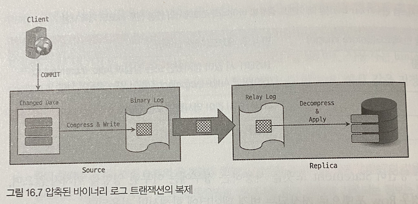

- MySQL 서버는 바이너리 로그 트랜잭션 압축 기능이 활성화 되어 있다면 zstd 알고리즘을 활용해 압축한 뒤 `Transaction_payload_event` 라는 하나의 이벤트로 기록한다.
- 압축된 데이터는 레플리카 서버로 복제시에도 압축된 상태를 유지해 릴레이 로그에 기록된다.
- 주의할 점은 레플리카 서버도 반드시 바이너리 로그 압축을 지원하는 8.0.20 버전 이상을 사용해야 한다는 점이다.
- `binlog_transaction_compression` 시스템 변수로 압축 기능 활성화가 가능하며, `binlog_transaction_compression_level_zstd` 시스템 변수로 알고리즘 레벨을 설정할 수도 있다.
- 위 시스템 변수들은 세션 별 적용이 가능해서, 세션 에서 트랜잭션 별로 압축 기능 적용이 가능하다.
  - 바이너리 로그에 압축된 데이터와 압축되지 않은 데이터가 혼재됨
  - 이런 경우에서도 문제 없이 처리가 가능함.
- 바이너리 로그 트랜잭션 압축은 **모든 경우에 대해 압축을 적용하지 않으며** 대표적으로 다음 이벤트 타입들은 기능이 활성화되어있더라도 압축하지 않는다.
  - GTID 설정 관련 이벤트
  - 그룹 복제에서 발생하는 View Change 이벤트 또는 소스 서버에서 레플리카 서버에 살아있음을 알리는 Heartbeat 이벤트
  - 복제 실패 및 소스 서버와 레플리카 서버 간 데이터 불일치를 발생시킬 수 있는 Incident 타입의 이벤트
  - 트랜잭션을 지원하지 않는 스토리지 엔진에 대한 이벤트 및 그런 이벤트를 포함중인 트랜잭션 이벤트
  - Statement 포맷으로 기록되는 트랜잭션 이벤트
- 압축된 트랜잭션 데이터는 **트랜잭션 개별 이벤트 들의 내용이 어떤 것인지 실제로 확인이 필요할 때 압축이 해제** 된다.
  - 레플리카 서버에서 레플리케이션 SQL 스레드에 의해 복제된 트랜잭션이 적용될 때
  - `mysqlbinlog` 를 사용해 트랜잭션을 재실행할 때
  - `SHOW BINLOG EVENTS` 혹은 `SHOW RELAYLOG EVENTS` 구문이 사용될 때
- 사용자는 Performance 스키마를 통해 **압축된 트랜잭션들의 통계 정보와 압축 성능을 확인** 할 수 있다.
  - `performance.binary_log_transaction_compression_stats` 테이블에 바이너리 로그와 릴레이 로그에 기록된 트랜잭션들에 대한 압축 통계 정보가 저장됨.
- 일반적으로 소스 서버에서는 해당 테이블에 바이너리 로그에 대한 통계 정보만 표시되고 레플리카 서버에서는 릴레이 로그에 대한 통계 정보가 표시된다.
  - 레플리카 서버에서 바이너리 로그 및 `log_slave_updates` 설정이 활성화 된 경우 바이너리 로그에 대한 통계 정보도 함께 표시됨.

> 바이너리 로그 트랜잭션 압축 기능을 사용하면 압축 처리로 인한 **오버 헤드** 가 존재한다. <br/>
> 압축 기능을 사용하고자 할 때는 MySQL 서버의 리소스 사용 현황과 서비스 요건을 충족시키는 쿼리 응답 속도등을 팡가한 뒤 테스트 환경에서 확인후 적용하는 것이 좋다.

## 복제 동기화 방식
- MySQL 에서는 소스 서버와 레플리카 서버 간의 **복제 동기화 에 대해 두 가지 방식** 을 제공한다.
- 하나는 **비동기 복제 (Asynchronous replication)** 방식이며, 다른 하나는 **반동기 복제 (Semi-synchronous replication)** 방식

### 비동기 복제 (Asynchronous replication)
- MySQL 의 복제는 기본적으로 비동기 방식으로 동작한다.
- 소스 서버가 자신과 연결된 레플리카 서버에서 변경 이벤트가 정상적으로 적용되었는지 확인하지 않는 방식 이다.

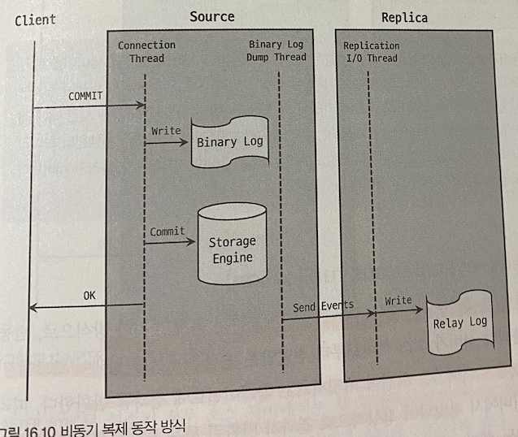
- 비동기 복제 방식에서 소스 서버는 레플리카 서버로 변경 이벤트가 잘 전달 됐는지, 실제로 적용 됐는지 알지 못하며 이에 대한 어떤 보장도 하지 않는다.
  - 누락된 트랜잭션이 존재하게 됨.
- 동기화 여부를 보장하지 않지만, 그만큼 트랜잭션 처리에 있어 좀 더 빠른 성능을 보이고, 레플리카 서버에 문제가 생겨도 소스 서버에는 영향이 없다.
- 소스 서버에 레플리카 서버를 여러대 연결하더라도 큰 성능 저하가 없으므로 (10대 이상 연결하는 경우 성능 저하가 있을 수 있음) **읽기 트래픽을 분산하는 용도** 로 많이 사용한다.

### 반동기 복제 (Semi-synchronous replication)
- 비동기 복제보다 좀 더 향상된 데이터 무결성을 제공하는 복제 동기화 방식
- 소스서버는 레플리카가 소스 서버로 부터 받은 변경이벤트를 릴레이 로그에 기록후 **응답 (ACK)** 을 보내면 그때 트랜잭션을 커밋하고 클라잉너트에 결과를 반환 한다.
- 즉 커밋되어 정상 결과가 반환된 모든 트랜잭션에 대해 하나 의 레플리카 서버에는 해당 트랜잭션이 전송돼었음을 보장함.
  - 하지만 전송 됐음을 보장할 뿐이지 적용 되었다는 의미는 아님.
- 트랜잭션 처리중 어느 지점에서 레플리카에 응답을 기다리냐에 따라 소스 서버 장애 발생시 문제 상황이 조금 다를 수 있다.
- `rpl_semi_sync_master_wait_point` 시스템 변수를 통해 소스 서버가 레플리카 서버의 응답을 기다리는 지점을 제어할 수 있다.
  - AFTER_SYNC, AFTER_COMMIT 중 설정이 가능
- AFTER_SYNC 의 경우 각 트랜잭션을 바이너리 로그에 기록하고 난 후 스토리지 엔진에 커밋하기 전 응답을 기다린다.
- AFTER_COMMIT 의 경우 트랜잭션을 바이너리 로그에 기록하고 스토리지 엔진에 커밋도 진행 한 뒤, 클라이언트에 결과 반환 전 응답을 기다린다.

`After Sync`
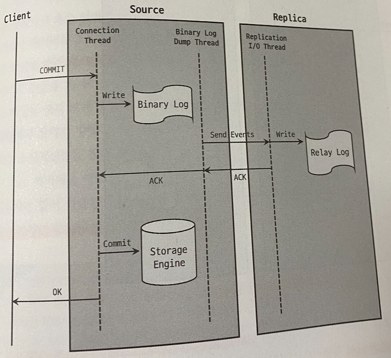

`After Commit`
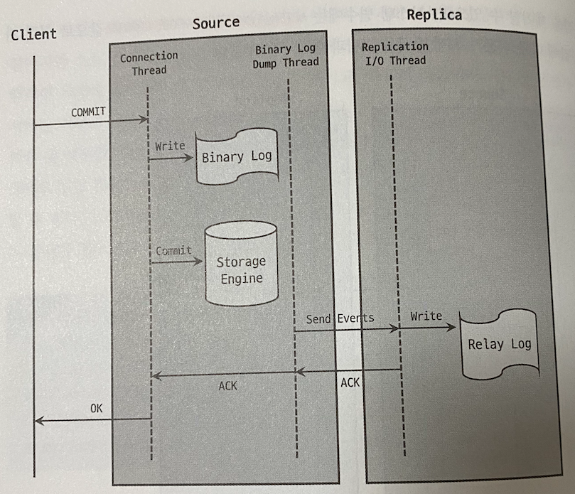

- 최초 반동기 복제 동기 도입시 AFTER_COMMIT 방식으로만 동작했지만 5.7 버전 이후 AFTER_SYNC 방식이 새롭게 도입되었고, 8.0 버전 기준 기본 동작은 AFTER_SYNC 이다.

`AFTER_SYNC`
- 소스 서버 장애 발생시 **팬텀 리드 (Phantom Read)** 가 발생하지 않음.
- 장애가 발생한 소스 서버에 대해 좀 더 수월한 복구 처리 가능.

`AFTER_COMMIT`
- 소스 서버 장애 발생시 팬텀 리드가 발생한다.
- 장애가 발생한 소스 서버를 재사용 하는 경우 사용자가 수동으로 롤백 시켜야 함.

> AFTER_SYNC 는 AFTER_COMMIT 보다 무결성이 강화된 방식

`참고`
- 반동기 복제라 하더라도 가능하면 장애가 발생한 소스 서버는 바로 재사용 하지 않는 것이 좋다.
- 안전하게 사용하기 위해서는 장애가 발생한 시점에 유입된 트랜잭션들에 대해 반영 여부를 수동으로 확인 해야하는데, 유입된 수가 많다면 사실 거의 불가능에 가까움.
- 때문에 백업된 데이터를 기반으로 새로 구축하는 것이 좋음.
- 반동기 복제는 비동기 방식과 비교했을때 네트워크 지연이 발생할 수 있다.
- 때문에 물리적으로 가깝게 위치한 레플리카 서버와의 복제에 더 적합하다.

> 소스 서버에서 응답을 무기한 기다리는 것은 아니며 타임 아웃 설정이 가능하다.

`반동기 복제 설정 방법`
- MySQL 서버에서 반동기 복제 기능은 **플러그인** 형태로 구현되어 있어 관련 플러그인을 먼저 설치해야 한다.

```shell
-- // 소스 서버
INSTALL PLUGIN rpl_semi_sync_master SONAME 'semisync_master.so';

-- // 레플리카 서버
INSTALL PLUGIN rpl_semi_sync_master SONAME 'semisync_slave.so';
```
- 플러그인 정상 설치 여부는 `information_schema.PLUGINS` 테이블을 조회하거나 `SHOW PLUGINS` 명령으로 확인 가능하다.
- 플러그인이 설치됬다고 해서 자동으로 활성화 되는 것은 아니며, 관련 시스템 변수를 설정해 주어야 하낟.
  - 시스템 변수들은 플러그인 정상 설치 이후 `SHOW GLOBAL VARIABLES` 명령으로 확인 가능.

| 변수 명 | 설명 |
| --- | --- |
| rpl_semi_sync_master_enabled | 소스 서버에서 반동기 복제의 활성화 여부 제어 |
| rpl_semi_sync_master_timeout | 소스 서버에서 레플리카 서버의 응답이 올 떄까지 대기하기 시간 으로 밀리초 단위로 설정 가능하다. 기본값 10초 |
| rpl_semi_sync_master_trace_level | 소스 서버에서 반동기 복제에 대해 디버깅 시 어느정도 수준으로 디버그 로그가 출력되게 할 것인지 레벨 지정. 1/16/32/64 값으로 설정 가능 |
| rpl_semi_sync_master_wait_for_slave_count | 소스 서버에서 반드시 응답을 받아야 하는 레플리카 수를 설정, 기본값 1 최대 65535 |
| rpl_semi_sync_master_wait_no_slave | 지정한 타임아웃 동안 반동기 복제로 연결된 레플리카 서버 수가 지정된 수 보다 적어졌을 때 어찌 처리할 것인지 결정 한다. ON 일 경우 레플리카 수가 적어져도 반동기 복제를 유지, OFF 인 경우 즉시 비동기로 복제한다. 기본값은 ON |
| rpl_semi_sync_master_wait_point | 소스 서버가 트랜잭션 처리 단계 중 레플리카 서버의 응답을 대기하는 지점을 설정하는 옵션. AFTER_SYNC/AFTER_COMMIT 중 설정가능 기본값 AFTER_SYNC |
| rpl_semi_sync_slave_enabled | 레플리카 서버에서 반동기 복제의 활성화 여부를 제어 ON/OFF 로 설정 가능 |
| rpl_semi_sync_slave_trace_level | 레플리카 서버에서 반동기 복제에 대해 디버깅 시 어느정도 수준으로 디버그 로그가 출력되게 할 것인지 지정. 1/16/32/64 로 설정 가능 |

```shell
-- // 소스 서버
SET GLOBAL rpl_semi_sync_master_enabled = 1;
SET GLOBAL rpl_semi_sync_master_timeout = 5000;

-- // 레플리카 서버
SET GLOBAL rpl_semi_sync_slave_enabled = 1;
```
- 만약 기존에 복제가 실행중인 상태라면 반동기 복제 적용을 위해 레플리카 서버에서 I/O 스레드를 재시작 해야 한다.

```shell
-- // MySQL 8.0.22 미만
STOP SLAVE IO_THREAD;
START SLAVE IO_THREAD;

-- // MySQL 8.0.22 이상
STOP REPLICA IO_THREAD;
START REPLICA IO_THREAD;
```

## 복제 토폴로지
- 기존에는 하나의 레플리카 서버는 둘이상의 소스 서버를 가질수 없었지만, MySQL 5.7 버전 부터 멀티 소스 복제 기능이 도입되었다.
- 가장 일반적인 복제 구성을 살펴 보면서 용도와 주의점을 알아본다.

### 싱글 레플리카 복제 구성

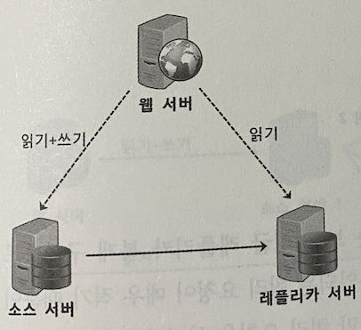

- 싱글 레플리카 복제 => 하나의 소스 서버에 하나의 레플리카 서버만 연결되어 있는 복제
- 가장 기본적인 복제 형태이며, 제일 많이 사용되는 형태이다.
- 레플리카 서버는 소스 서버에서 장애가 발생했을때 사용할 예비 서버 및 데이터 백업을 위한 용도로 많이 사용한다.

### 멀티 레플리카 복제 구성

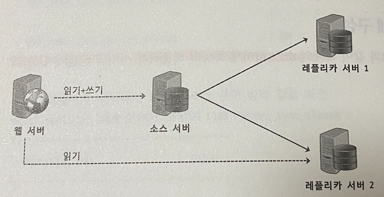

- 멀티 레플리카 복제 => 하나의 소스 서버에 2개 이상의 레필르키 서버를 연결한 복제
- 싱글 레플리카 복제구성에서 추가적인 용도를 위해 여분의 레플리카 서버가 더필요할때 자주 사용되는 형태이다.
- 읽기 요청 처리를 분산 시키기 위해 많이 사용한다.
- 레플리카 서버 한대는 예비용으로 남겨 두는 것이 좋다.
  - 서버 및 백업 수행 용도

### 체인 복제 구성

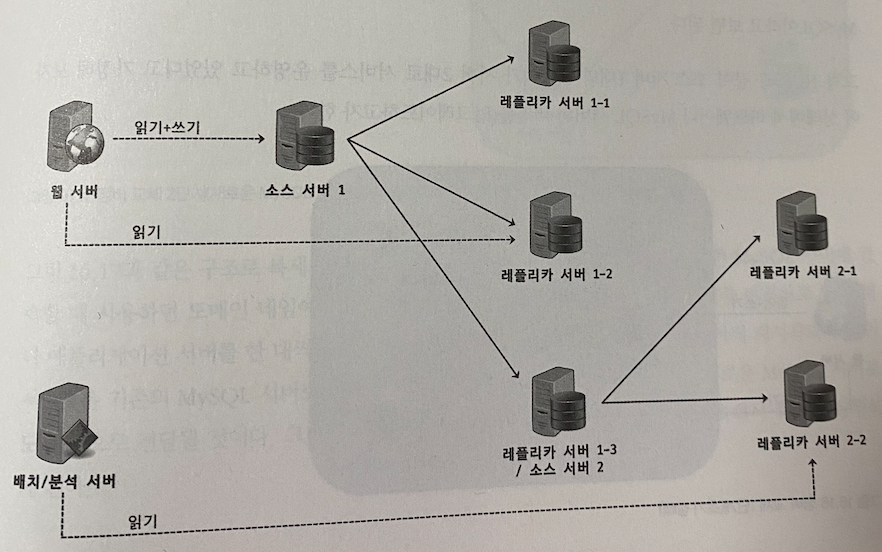

- 멀티 레플리카 복제 구성에서 레플리카 서버가 너무 많아 소스 서버의 성능에 악영향이 예상되는 경우 1:M:M 구조의 체인 복제 구성을 고려해 볼 수 있다.
- 위 그림을 보면 1차 복제 그룹과 2차 복제 그룹으로 구성되어 있다.
  - 1차 복제 그룹의 경우 변경이 빠르게 반영되므로 OLTP 서비스 용도로 사용하고, 2차 복제 그룹은 통계나 배치, 백업 용도로 구분해 사용할 수 있다.
- MySQL 서벌르 업그레이드 하거나 장비를 일괄 교체 할 때도 많이 사용한다.

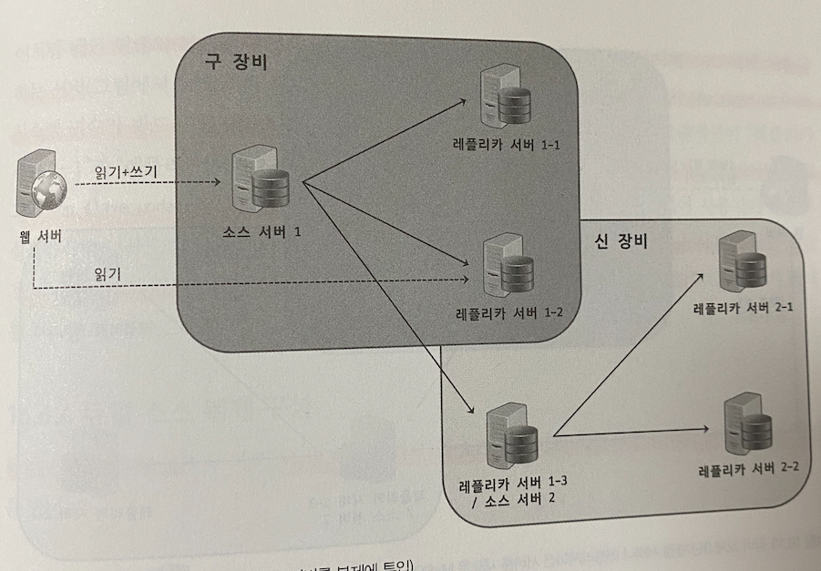
1. 업그레이드 된 장비를 기존 복제에 투입해 복제 동기화
2. 복제 완료되면 기존 서버에 사용하돈 네임 서버를 새로운 MySQL 서버들을 보게끔 변경 후 애플리케이션을 Rolling Restart
3. 그후 기존 장비 3대를 모두 제거한다.

- 체인 형태 복제를 구성하려면, **중간 계층** 에서 레플리카 서버이면서 동시에 소스 서버 역할을 하는 서버에서 **바이너리 로그** 와 **log_slave_updates** 시스템 변수가 반드시 활성화 되어 있어야 함.
  - MySQL 8.0.2 버전 부터는 기본적으로 활성화
- 체인 복제 구성시 주의할 점은 중간 계층에서 장애 발생시 하위 계층의 서버 들도 복제가 중단됨에 유의해야 함.

### 듀얼 소스 복제 구성

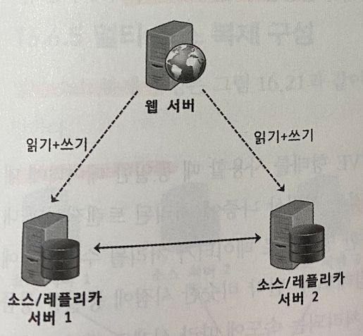

- 듀얼 소스 복제 구성 => 두 개의 MySQL 서버가 서로 소스 서버이자 레플리카 서버로 구성된 형태
- 두 MySQL 서버 모두 쓰기가 가능하다는 것이 큰 특징이다.
  - 각 서버에서 변경한 데이터는 복제를 통해 각 서버에 적용된다.
- 목적에 따라 ACTIVE-PASSIVE / ACTIVE-ACTIVE 형태로 사용한다.

`ACTIVE-PASSIVE`
- 하나의 MySQL 서버에서만 쓰기를 수행하는 형태.
- 싱글 레플리카와 비슷해보일수 있지만 다른 예비서버가 바로 쓰기작업이 가능하기 떄문에 문제가 생기면 바로 전환이 가능하다.

`ACTIVE-ACTIVE`
- 두 서버 모두에 쓰기 작업을 수행하는 형태
- 지리적으로 매우 떨어진 위치에서 유입되는 쓰기 요청도 원할하게 처리하기 위해 주로 사용함.

`듀얼 소스 복제 구성시 주의점`
- 듀얼 소스 복제구성시 다음 부분에서 문제가 발생할 수 있다.
  - 동일한 데이터를 각 서버에서 변경
  - 테이블에서 Auto-Increment 사용
- ACTIVE-ACTIVE 구성에서 동일한 데이터에 대해 동시에 변경 트랜잭션 발생시 의도치 않은 데이터로 업데이트 될 수 있음.
- Auto-Increment 를 사용하는 경우 동일한 키 값을 가질 수 있다.
- 때문에 동시점에 동일 데이터를 변경하는 트랜잭션이 존재해서는 안되며 Auto-Increment 보다 글로벌한 키 값을 생성하는 것이 좋음.
- 반드시 사용해야 한다면, `auto_increment_offset`, `auto_increment_increment` 시스템 변수의 값을 적절히 설정한 후 사용해야 한다.

> 듀얼 소스 복제 구성을 한다고 해서 쓰기 확장 효과는 크지 않다. <br/>
> 만약 쓰기 성능 확장이 필요하다먄 샤딩을 추천함.

### 멀티 소스 복제 구성

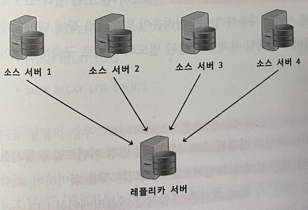

- 멀티 소스 복제 구성 => 하나의 레플리카 서버가 둘 이상의 소스 서벌르 갖는 형태
- 5.7.6 버전에 최초 도입됨.
- 멀티 소스 복제 구성은 주로 다음과 같은 목적으로 사용된다.
  - 여러 MySQL 서버에 존재하는 데이터를 하나의 서버로 통합
  - 여러 MySQL 서버에 샤딩된 데이터를 하나의 테이블로 통합
  - 여러 MySQL 서버의 데이터를 모아 하나의 MySQL 서버에서 백업 수행
- 샤드형태로 구성했으나 예상만큼 트래픽 유입이 많지 않아 데이터를 통합해 서버 수를 줄이는 용도로도 사용한다.

> 각 소스 서버로 부터 유입되는 변경 이벤트 들이 레플리카 서보로 복제 됐을때 서로 충돌을 일으키는 부분이 있는지 사전에 충분한 검토가 필요함.

`멀티 소스 복제 동작`

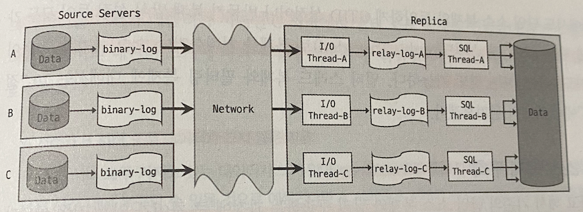

- MySQL 멀티 소스 복제에서 레플리카 서버는, 자신과 연결된 소스 서버들의 변경 이벤트들을 동시점에 **병렬로 동기화** 한다.
- 각 소브 서버들에 대해 복제가 **독립적으로 처리** 되며, 각각의 독립된 복제 처리를 **채널 (Channel)** 이라고 한다.
- 각 복제 채널은 레플리케이션 I/O 스레드, 릴레이 로그, 레플리케이션 SQL 스레드를 가지고 있고, 채널의 이름으로 소스 서버와의 연결인지 식별한다.
- 멀티 소스 복제의 레플리카 서버는 최대 256개의 복제 채널을 생성할 수 있다.
- `CHANGE REPLICATION SOURCE TO (CHANGE MASTER TO)` 명령에서 `FOR CHANNEL` 구문으로 복제 채널명을 지정할 수 있다.

```shell
CHANGE REPLICATION SOURCE TO ... FOR CHANNEL ["channel_name"]
START REPLICATION IO_THREAD FOR CHANNEL ["channel_name"]
// ... 
```

- 다음 명령의 경우 `FOR CHANNEL` 절을 명시하지 않은 채 실행하면 전체 복제 채널에 대해 명령이 수행 된다.
```shell
START [REPLICA | SLAVE] [IO_THREAD | SQL_THREAD]
STOP [REPLICA | SLAVE] [IO_THREAD | SQL_THREAD]
SHOW [REPLICA | SLAVE] STATUS
FLUSH REPLAY LOGS
```
- 멀티 소스 복제에서도 GTID/반동기 복제 방식 모두 가능하며, 각 복제 채널별 멀티스레드로 복제 처리하거나 소스 서버의 변경 이벤트를 필터링 하는것도 가능함.

`멀티 소스 복제 구축`
- 멀티 소스 복제라 해서 단일 소스 복제와 구축에 큰 차이가 있는것은 아님.
- 복제를 연결하기 위해 소스 서버들의 백업 데이터를 레플리카 서버로 적재하는데, 이 과정이 조금 까다로울 뿐이다.
- 두 개 이상의 소스 서버에서 데이터를 가져와야 한다면 `mysql` 데이터베이스와 같이 공통 데이터베이스와 InnoDB 시스템 테이블 스페이스의 ㅊ우돌과 병합을 고려해야 하낟.

`mysqldump 같은 논리 수준 백업도구 사용`
- mysqldump 를 사용하는 경우 InnoDB 의 시스테 테이블스페이스를 물리적으로 백업하는 것이 아니므로 데이터 적재시 병합과 관련된 문제가 발생하지 않는다.
- 백업된 데이터가 매우 크다면 mysqldump 로는 상당히 오랜 시간이 소요될 수 있음.

`XtraBackup 같은 물리 수준 백업도구 사용`
- XtraBackup 같은 물리 수준의 백업은 시스템 테이블 스페이스를 포함해 MySQL 서버의 모든 데이터 파일들을 그대로 복사해 복구한다.
- 두 소스 서버에서 데이터를 가져와야 한다면 시스템 테이블 스페이스를 문제 없이 하나로 병합하는 방법은 없다.

또한 멀티 소스 복제 연결시 A 서버와 B 서버의 **데이터 크기** 에 따라 사용하는 방법이 다르다. 어떻게 적절히 백업도구를 혼합해 사용하는지 경우 별로 살펴보자.

`A 와 B 모두 데이터가 크지 않은 경우`
- mysqldump 로 충분히 백업 가능하기에 A/B 서버 차례대로 백업을 수행한다.

`A 는 크지만 B 는 데이터가 작은 경우`
- 데이터가 큰 쪽을 XtraBackUp 을 이용해 백업하고 복구한 뒤 B 서버를 mysqldump 로 백업해 적재한다.

`A 와 B 모두 데이터가 큰 경우`
- 두 서버 모두 XtraBackUp 을 이용해 백업을 수행하며, 테이블 개수가 많은 쪽을 먼저 레플리카 서버에 복구한다.
- 남은 백업 에서 InnoDB 테이블들의 idb 파일을 InnoDB 익스포트를 이용해 내보내고 다시 임포트 하는 형태로 수행한다.

복제 연결전 주의할 점은 반드시 레플리카 서버에서 `master_info_repository` `replay_log_info_repository` 시스템 변수가 TABLE 로 설정되어야 한다.

## 복제 고급 설정

### 지연된 복제 (Delayed Replication)
- 복제의 본래 목적 ? => 최대한 빠르게 동기화 해 소스 서버와 레플리카 서버간의 데이터를 동일한 상태로 만드는 것
- 동기화 지연이 없을수록 레플리카 서버를 이용한 장애 복구가 용이해 진다.
- 하지만 의도적으로 복제를 지연시켜야 할 때도 있다.
  - 개발자나 DBA 가 실수로 삭제한 경우 백업 용도
  - 데이터 반영에 지연이 있을 경우 어떻게 동작하지는 테스트 하는 용도
  - 서버 부하가 심할때 쿼리 지연이 발생하는데 손쉽게 이런 상황을 시뮬레이션 할 수 있음
- 지연 복제 기능은 MySQL 5.6 에 처음 도입되었으며 `CHANGE REPLICATION SOURCE TO` 구문에 `SOURCE_DELAY (MASTER_DELAY)` 옵션을 사용해 얼마나 지연 시킬지 설정할 수 있다.

```shell
-- // MySQL 8.0.23 미만
CHANGE MASTER TO MASTER_DELAY=86400;

-- // MySQL 8.0.23 이상
CHANGE REPLICATION SOURCE TO SOURCE_DELAY=86400; 
```
- MySQL 8.0 부터 바이너리에 `original_commit_timestamp` 와 `immediate_commit_timestamp` 가 추가 되었다.
  - original_commit_timestamp : 트랜잭션이 원본 소스에 커밋된 시간
  - immediate_commit_timestamp : 트랜잭션이 직계 소스 서버에 커밋된 시간
- OCT 값은 복제 구성에서 해당 트랜잭션이 복제되는 모든 레플리카 서버가 동일한 값을 가진다.
- 두 타임 스탬프 값은 소스 서버의 바이너리 로그에 긹되어 레플리카 서버로 그대로 복제되어 릴레이 로그에 저장된다.
- 레플리카 서버에서 `SOURCE_DELAY` 옵션에 값이 지정되면 ICT 타임 스탬프 값을 참조해 각 트랜잯녀 별로 실행을 지연시킬 것인지 아니면 바로 실행할 것인지를 결정한다.
- MySQL 8.0 미만 버전에서는 이벤트 그룹 단위가 아닌 개별 이벤트 단위로 지연 실행 여부를 확인 했다.
  - 때문에 동일 트랜잭션 내에서도 지연이 발생
- 원본 소스 서버의 바이너리 로그의 값이 그대로 복제되므로 최하위 계층 레플리카가 직계 소스 소버가 아닌 원본 소스 서버 기준으로 지연 계산 되었기에 문제가 되었음
- MySQL 8.0 부터 ICT 타임스탬프 값을 사용함에 따라 이런 문제점들이 모두 사라졌다.


