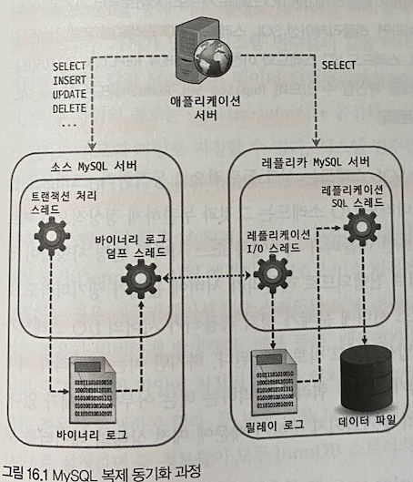

# 지옥 스터디 - 15 복제
- 데이터베이스 운영시 가장 중요한 두 가지 요소 ?
  - **확장성 (Scalability)** 과 가용성 **(Availability)**
- 대용량 트래픽을 안정적으로 처리하기 위한 필수 요소.
- 이를 위해 일반적으로 사용되는 기술이 바로 **복제 (Replication)**

## 개요
- 복제는, 한 서버에서 다른 서버로 데이터가 **동기화** 되는 것을 말한다.
- **원본 데이터** 를 가진 서버를 **소스 (Source) 서버**
- **복제된 데이터** 를 가진 서버를 **레플리카 (Replica) 서버** 라고 한다.
- 일반적으로 서비스에서 사용할 DB 서버 구축시 메인으로 사용할 소스서버 한대와 레플리카 서버를 한대 이상 함께 구축한다.

`레플리카 서버 구축의 목적`
1. 스케일 아웃 (Scale out)
   - 트래픽이 증가해 부하를 감당하기 위해 서버의 사양을 높이는 방법을 **스케일 업 (Scale-up)** 이라고 하고
   - 서버 대수를 늘려 부하를 감당하는 방법을 **스케일 아웃 (Scale-out)** 이라고 한다.
   - 스케일 아웃은 스케일 업 보다 **갑자기 늘어나는 트래픽을 대응하기에 더 유연한 구조**
2. 데이터 백업
   - 사용자 실수로 데이터 삭제시 서비스 운영에 치명적일 수 있다.
   - 이를 위해 주기적으로 백업하는 것이 필수적
   - 하지만 이런 백업을 소스 서버에서 처리한다면 서비스 쿼리들이 영향을 받을 수 있음
   - 때문에 주로 레플리카 서버를 구축하고, 데이터 백업은 레플리카 서버에서 실행한다.
3. 데이터 분석
   - 서비스 운영을 하다보면 BM 을 개발하기 위한 인사이트를 얻기 위해 분석용 쿼리를 실행하기도 한다.
   - 이런 경우 위와 같은 이유로 서비스 쿼리들이 영향을 받을 수 있음
   - 때문에 레플리카를 구축해 분석용 쿼리 전용으로 사용하기도 한다.
4. 데이터의 지리적 분산
   - 사용자에게 빠른 응답을 제공하기 위해 애플리케이션 서버와 DB 서버는 지리적으로 가깝게 위치하는 것이 좋다.
   - DB 서버의 위치를 이동하지 못하는 경우 레플리카를 구축해 이를 활용한다.

## 복제 아키텍쳐
- MySQL 에서 발생하는 **모든 변경사항은 별도의 로그파일에 순서대로 기록** 된다.
  - 이를 바이너리 로그 (Binary Log), Bin Log 라고 한다.
- 데이터베이스나 테이블의 구조 변경, 계정 또는 권한 변경정보까지 모두 저장된다.
- 바이너리 로그에 기록된 각 변경 정보들을 **이벤트 (Event)** 라고도 한다.
- MySQL 의 복제는 바이너리 로그 기반으로 구현되어 있다.
- 소스 서버에서 생성된 바이너리 로그를 생성하고, 레플리카 서버에서 소스 서버의 바이너리 로그를 읽어 별도로 저장하는데 이를 **릴레이 로그 (Relay log)** 라고 한다.


- MySQL 은 세 개의 쓰레드에 의해 복제가 진행된다.
- 이중 하나는 소스서버에, 나머지는 레플리카 서버에 존재하며, 각 스레드 들의 역할은 다음과 같다.

`바이너리 로그 덤프 스레드 (Binary Log Dump Thread)`
- 레플리카 서버는 데이터 동기화를 위해 **소스 서버에 접속** 해 바이너리 로그 정보를 요청한다.
- 소스 서버는 **레플리카 서버가 연결될 때 내부적으로 바이너리 로그 덤프 스레드를 생성** 해 바이너리 로그를 레플리카 서버로 전송한다.
- 이 스레드는 레플리카 서버로 보낼 각 이벤트를 읽을때 바이너리 로그에 일시적인 락을 수행하며, 읽은 뒤 바로 해제 한다.

`레플리케이션 I/O 스레드 (Replication I/O Thread)`
- 복제가 시작 (`START REPLICA` or `START SLAVE` 명령) 될 때 레플리카 서버는 **I/O 스레드를 생성** 하고 복제가 멈추면 (`STOP REPLICA` or `STOP SLAVE` 명령) I/O 스레드는 종료된다.
- 이 스레드는 소스 서버의 바이너리 로그 이벤트를 읽어와 **릴레이 로그에 저장하는 역할** 을 수행한다.
- 바이너리 로그는 읽어 쓰는 역할만 수행하기 떄문에 I/O 스레드 라고 한다.

`레플리케이션 SQL 스레드 (Replication SQL Thread)`
- I/O 스레드에 의해 작성된 릴레이 로그 파일을 읽어 실행하는 역할을 수행한다.

레플리카 서버에서 I/O 스레드와 SQL 스레드는 서로 독립적으로 동작한다.

때문에 각 스레드에서 처리하는 것이 느리더라도 영향을 미치지 않는다.

하지만 **소스 서버에서 문제** 가 생겨 I/O 스레드가 정상 동작하지 못한다면 복제는 중단 된다. (복제 기능만 중단됨)

복제가 시작되면 레플리카 서버는 기본적으로 **세 가지 유형의 복제 관련 데이터** 를 생성 및 관리한다.

`릴레이 로그 (Relay log)`
- I/O 스레드에서 생성되는 파일이며 바이너리 로그에서 읽어온 **이벤트 (트랜잭션 정보)** 가 저장된다.

`커넥션 메타 데이터 (Connection Meta Data)`
- I/O 스레드가 소스 서버에 연결할때 사용하는 DB 계정 정보와 현재 읽고 있는 소스 서버의 바이너리 로그 파일명, 파일내 위치 값 등이 담겨 있다.
- 기본적으로 `mysql.slave_master_info` 테이블에 저장됨

`어플라이어 메타데이터 (Applier Metadata)`
- SQL 스레드에서 릴레이 로그에 저장된 소스 서버의 이벤트들을 레플리카 서버에 **적용 (Replay)** 하는 컴포넌트를 **어플라이어 (Applier)** 라고 한다.
- 어플라이어 메타데이터는 최근 적용된 이벤트에 대해 해당 이벤트가 저장된 릴레이 로그 파일명과 파일내 위치 정보 등을 담고 있다.
- SQL 스레드는 이 정보들을 바탕으로 레플리카 서버에 나머지 이벤트들을 적용한다.
- 기본적으로 `mysql.slave_relay_log_info` 테이블에 저장됨

커넥션 및 어플라이어 메타데이터는 `master_info_repository` 와 `relay_log_info_repository` 시스템 변수를 통해 **어떤형태의 데이터로 관리** 할 것인지 설정할 수 있다.
- FILE : MySQL 의 데이터 디렉터리에서 `master.info` 와 `relay-log.info` 파일로 관리 된다.
  - 각 파일의 경로는 `--master-info-file` 옵션과 `relay_log_info_file` 시스템 변수로 설정 가능
- TABLE : `mysql.slave_master_info` 와 `mysql.slave_relay_log_info` 테이블에 각각 저장된다.

> 위 시스템 변수들은 MySQL 8.0.2 버전 부터 기본 값이 TABLE

FILE 로 설정하는 경우 I/O 스레드와 SQL 스레드 동작시 두 파일이 내용이 동기화 되지 않는 경우가 빈번하겍 발생ㅎㅆ다
- 8.0.2 버전 이후 Deprecated

MySQL 이 갑자기 종료 되더라도 `TABLE` 로 설정한 경우 SQL 스레드가 트랜잭션 적용시 아토믹하게 업데이트 되기 때문에 문제 없이 복제가 진행된다.
- 이를 **크래시 세이프 복제 (Crash-safe replication)** 이라고 함.

## 복제 타입
- MySQL 의 복제는 바이너리 로그에 기록된 변경 내역들을 **식별하는 방식** 에 따라 **바이너리 로그 파일 위치 기반 복제 (Binary Log File Position Based Replication)** 와 **글로벌 트랜잭션 ID 기반 복제 (Global Transaction Identifiers Based Replication)** 으로 나뉜다.

### 바이너리 로그 파일 위치 기반 복제
- 바이너리 로그 파일 위치 기반 복제는 MySQL 복제 기능이 처음 도입됬을때 제공되던 방식이다.
- 레플리카 서버에서 **소스 서버의 바이너리 로그 파일명** 과 **파일 내의 위치 (Offset or Position)** 로 개별 바이너리 로그 이벤트를 식별해 복제가 진행되는 형태
- 최초 구축시 레플리카 서버에 **소스 서버의 어떤 이벤트 부터 동기화를 수행할 것인가** 에 대한 정보를 설정해야 한다.
- 복제가 설정된 레플리카 서버는 **소스 서버의 어느 이벤트까지 로컬로 가져왔고, 적용했는지에 대한 정보를 관리** 한다.
- 소스 서버에 해당 정보를 전달해 그 이후의 이벤트 들을 가져오게 되기 때문에 각 이벤트에 대한 식별이 반드시 필요하다.
- 바이너리 로그 파일 위치 기반 복제는 이런 이벤트 하나하나를 **소스 서버의 바이너리 로그 파일명과 파일 내에서 위치 값 (File Offset) 의 조합으로 식별** 한다.
- 때문에 복제를 일시 중단할 수 있고 재개할 때도 자신이 마지막으로 적용했던 이벤트 이후의 이벤트들 부터 다시 읽을 수 있음.
- 중요한 부분은 복제에 참여한 MySQL 서버들이 모두 고유한 **service_id** 값을 가지고 있어야 한다는 점.
  - MySQL 서버마다 설정이 가능한데 기본 값은 1
- 바이너리 로그에 기록된 service_id 와 레플리카 서버의 server_id 가 동일하다면 해당 이벤트를 무시하게 되기 때문에 복제가 정상동작 하지않을 수 있다.
  - 자신의 서버에서 발생한 이벤트로 간주하게 됨

#### 바이너리 로그 파일 위치 기반의 복제 구축
- 복제 설정시 각 서버에 데이터가 이미 존재하는지 여부, 복제를 어떻게 활용할 것인지 등에 따라 복제 설정 과정 및 구축 방법이 달라진다.

`설정 준비`
- 기본적으로 MySQL 복제를 사용하려면 **소스 서버에서 반드시 바이너리 로그가 활성화 되어야 함**
  - MySQL 8.0 기준 바이너리 로그가 기본적으로 활성화 되어 있음
  - 서버 시작시 데이터 디렉터리 하위에 `binlog` 라는 이름으로 생성됨
- 바이너리 로그 파일 위치 기반 복제를 사용하는 경우 각 MySQL 서버가 고유한 server_id 를 가지고 있어야 한다.

```shell
## 소스 서버 설정
[mysqld]
server_id=1
log_bin=/binary-log-dir-path/binary-log-name
sync_binlog=1
binlog_cache_size=5M
max_binlog_size=512M
binlog_expire_logs_seconds=1209600
// ...
```
- `SHOW MASTER STATUS` 명령으로 바이너리 로그가 정상 기록중인지 확인이 가능하다.
- 레플리카 서버도 소스 서버와 동일하게 데이터 디렉터리 하위에 릴레이 로그 파일이 자동 생성 된다.
  - `relay_log` 시스템 변수를 사용해 로그 파일 위치나 파일명을 설정할 수 있음.
- 릴레이 로그에 기록된 이벤트는 레플리카 서버에 적용후 자동 삭제되는데, 이를 유지하고자 한다면 `relay_log_purge` 시스템 변수를 OFF 로 설정하면 됨.
- 일반적으로 읽기전용으로 사용하므로 `read_only` 설정도 함께 사용하는 편이 좋다.
- 추후 소스 서버로 승격됨을 고려하면 `log_slave_updates` 시스템 변수도 명시하는 것이 좋음
  - 기본적으로 레플리카는 복제에 의한 데이터변경은 기록하지 않는다.
  - 이 변수를 설정하면 복제에 의한 데이터 변경도 자신의 바이너리 로그에 기록하게 됨

```shell
## 레플리카 서버 설정
[mysqld]
server_id=2
relay_log=/relay-log-dir-path/relay-log-name
relay_log_purge=ON
readonly
log_slave_updates
// ...
```

`복제 계정 준비`
- 레플리카 서버가 바이너리 로그를 가져오려면 **소스 서버에 접속할 계정이 필요** 하다.
- 이를 복제용 계정이라고 함.
- 새로운 계정을 만들 필요 없이 기존 계정에 복제 관련 권한을 추가하는 것 보단 보안적 측면을 고려해 별도로 생성하는 것이 좋다.
- 이는 복제를 시작하기전 미리 준비돼어 있어야 하며 반드시 `REPLICATION SLAVE` 권한을 가지고 있어야 한다.

```shell
CREATE USER 'repl_user'@'%' IDENTIFIED BY 'repl_user_password';
GRANT REPLICATION SLAVE ON *.* TO 'repl_user'@'%';
```

`데이터 복사`
- 소스 서버의 데이터를 `mysqldump` 로 복사하는 경우 `--single-transaction` 과 `--master-data` 옵션을 반드시 사용해야 한다.
  - `--single-transaction` 옵션은 데이터 덤프시 하나의 트랜잭션 을 사용해 덤프가 진행되게 하므로 락을 사용하지 않는다.
  - `--master-data` 옵션은 덤프 시작 시점의 소스 서버의 바이너리 로그 파일명과 위치 정보를 포함한느 복제 설정 구문 (CHANGE REPLICATION SOURCE TO or CHANGE MASTER TO) 이 덤프 파일 헤더에 기록되게 하는 옵션이므로 반드시 필요함.
- `--master-data` 옵션 사용시 `FLUSH TABLES WITH READ LOCK` 명령을 사용해 글로벌 락을 거는데, 이는 바이너리 로그의 위치를 순간적으로 고정시키기 위함이다.
  - 1 또는 2로 설정이 가능하다.
  - 1 : 덤프 파일 내의 복제 설정 구문이 실제 실행 가능한 형태로 기록됨.
  - 2 : 해당 구문이 주석으로 처리되어 참조만 할 수 있는 형태로 기록됨.

```shell
mysqldump -uroot -p --single-transaction --master-data=2 \
--opt --routines --triggers --hex-blob --all-databases > source_data.sql
```

`복제 시작`
- 복제를 설정하는 명령은 `CREATE REPLICATION SOURCE TO (CHANGE MASTER TO)` 명령으로 mysqldump 로 받은 파일의 헤더에서 참조가 가능하다.
- 백업 받은 파일은 크기가 크기 떄문에 less 같은 페이지 단위 뷰어로 파일을 여는 것이 좋음.

```shell
-- // MySQL 8.0.23 이상
CHANGE REPLICATION SOURCE TO
  SOURCE_HOST='source_server_host',
  SOURCE_PORT=3306,
  SOURCE_USER='repl_user',
  SOURCE_PASSWORD='repl_user_password',
  SOURCE_LOG_FILE='binary-log.00002',
  SOURCE_LOG_POST=2708,
  GET_SOURCE_PUBLIC_KEY=1;

-- // MySQL 8.0.23 미만
CHANGE MASTER TO
  MASTER_HOST='source_server_host',
  MASTER_PORT=3306,
  MASTER_USER='repl_user',
  MASTER_PASSWORD='repl_user_password',
  MASTER_LOG_FILE='binary-log.00002',
  MASTER_LOG_POST=2708,
  GET_MASTER_PUBLIC_KEY=1;
```
- SOURCE_HOST (MASTER_HOST) : 레플리카 서버에서 복제 연결할 소스 서버
- SOURCE_POST (MASTER_PORT) : 소스 서버에서 구동중인 MySQL 서버의 포트번호
- SOURCE_USER (MASTER_USER), SOURCE_PASSWORD (MASTER_PASSWORD) : 복제용 계정 정보
- SOURCE_LOG_FILE (MASTER_LOG_FILE), SOURCE_LOG_POST (MASTER_LOG_POS) : 복제를 시작하고자 하는 바이너리 로그 파일 명과 위치 값
- GET_SOURCE_PUBLIC_KEY (GET_MASTER_PUBLIC_KEY) : RSA 키 기반 공개 키를 소스서버에 요청할 것인지 여부

명령 실행 이후 `SHOW REPLICA STATUS (SHOW SLAVE STATUS)` 명령 실행시 복제 관련 정보고 레플리카 서버에 등록된 것을 확인할 수 있다.

하지만 `Replica_IO_Running (Slave_IO_Running)` 과 `Replica_SQL_Running (Slave_SQL_Running)` 칼럼값은 NO 인데 복제 관련 정보만 등록되었을 뿐 동기화는 시작되지 않았음을 의미한다.

`START REPLICA (START SLAVE)` 명령을 실행한 이후에나 YES 로 바뀌며 복제가 시작된다.

`Seconds_Behind_Source (Seconds_Behind_Master)` 의 값이 0이 되면 소스 서버와 레플리카 서버의 데이터가 완전히 동기화 되었음을 의미한다.

#### 바이너리 로그 파일 위치 기반 복제에서 트랜잭션 건너뛰기
- 복제로 구성된 서버들을 운영하다 보면 레플리카에서 종종 소스서버에서 읽어온 트랜잭션이 제대로 실행되지 못하고 멈추는 현상이 발생하기도 한다.
- 이는 대부분 사용자의 실수로 인해 발생하는데, 대표적인 에러가 중복 키 에러임.
- 경우에 따라 레플리카에서 문제가 되는 소스 서버의 트랜잭션을 무시하고 처리할 경우 `sql_slave_skip_counter` 시스템 변수를 이용해 조치가 가능하다.

```shell
// -- MySQL 8.0.22 미만
STOP SLAVE SQL_THREAD;
SET GLOBAL sql_slave_skip_counter=1;
START SLAVE SQL_THREAD;

// -- MySQL 8.0.22 이상
STOP REPLICA SQL_THREAD;
SET GLOBAL sql_slave_skip_counter=1;
START REPLICA SQL_THREAD;
```
- 복제를 중단 후 `sql_slave_skip_counter` 의 값을 1로 지정해 재시작 하면 에러가 발생한 SQL 을 건너뛰고 복제를 재개한다.
  - 적용하지 않고 건너뛸 **바이너리 로그 이벤트 그룹 수** 를 지정한다.
  - 로그 이벤트 1개가 아닌 현재 이벤트를 포함한 이벤트 그룹을 무시하는 것.
- 단순하게 하나의 트랜잭션에 DML 쿼리가 하나라면 곧 쿼리의 개수가 될 것이다.

### 글로벌 트랜잭션 아이디 (GTID) 기반 복제
- MySQL 5.5 버전 까지는 복제 설정시 **바이너리 로그 파일 위치 기반 복제** 만 가능했다.
- 하지만 이 방식의 문제는 소스 서버에서만 유효하다는 것.
  - 레플리카에서도 동일한 파일명 + 동일한 위치에 저장된다는 보장이 없음.
- 때문에 복제 토폴로지를 변경하는 작업은 거의 불가능 할 때도 많았음.
  - 이는 복제 참여한 서버중 일부 서버에 장애가 발생햇을때 필요하다.
  - 하지만 변경이 어렵다는건 복구가 어렵다는 것을 의미한다.
- 복제에 참여한 전체 MySQL 서버들에서 고유하도록 각 이벤트에 부여된 식별 값을 **글로벌 트랜잭션 아이디 (Global Transaction Identifier GTID)** 라고 하며, 이를 기반으로 복제가 진행되는 형태를 GTID 기반 복제라고 한다.
  - MySQL 5.6 버전에서 처음 도입 되었다.

#### 글로벌 트른잭션 아이디
- GTID 는 논리적인 의미로서 물리적인 파일명이나 위치와는 전혀 무관하게 생성된다.
- GTID 는 서버에서 커밋된 각 트랜잭션과 연결된 **고유 식별자** 로, 서버에 속한 복제 토폴로지 내에서 고유하다.
- 이는 커밋되어 바이너리 로그에 기록된 트랜잭션에 한해서만 할당되며 SELECT 쿼리나 `sql_log_bin` 이 비활성화된 경우 할당되지 않는다.
- GTID 는 소스 아이디와 트랜잭션 아이디 값의 조합으로 생성되며 콜론 (:) 으로 구분된다.

```shell
GTID = [source_id]:[transaction_id]
```
- 소스 아이디는 트랜잭션이 발생된 소스 서버를 식별하기 위한 값
  - MySQL 의 server_uuid 시스템 변수를 사용한다.
  - 서버가 시작되며 자동부여 되며 MySQL 서버 시작시 데이터 디렉터리에 `auto.cnf` 파일 내에 존재한다.
- 트랜잭션 아이디는 서버에서 커밋된 트랜잭션 순으로 부여되며 1부터 1씩 단조 증가하는 형태이다.
- GTID 값은 `mysql.gtid_executed` 테이블이나 `gtid_executed` 시스템 변수로 확인이 가능하다.
  - `SHOW MASTER STATUS` 명령으로 도 가능함.
- GTID 는 하나씩 개별로 보이거나 연속된 값들의 범위로 보여질 수도 있고 그 밖에 다양한 형태로 보여질 수 있는데 하나 이상의 GTID 로 구성된 것을 GTID Sets 라고 한다.
- GTID Sets 에서는 기본적으로 동일한 서버에서 생성하는 연속된 GTID 는 축소 시켜 범위로 보여지고, 범위 값과 단일 값이 하나의 표현식으로 나타날 수도 있다.
- `mysql.gtid_executed` 테이블은 레플리카 서버에서 바이너리 로그가 비활성화 되있는 상태에서 GTID 기반 복제를 사용할 수 있게 하고 바이너리 로그가 손실됬을때 GTID 값이 보존될 수 있게 한다.
- 이는 5.7.5 버전에 도입되었으며 8.0.17 버전이상을 사용중이라면 매 트랜잭션이 커밋될 때 마다 GTID 값이 바로 저장된다.
- MySQL 서버는 주기적으로 `mysql.gtid_exectued` 테이블의 데이터를 하나의 데이터로 압축한다.
  - 이는 파일 압축이 아닌 여러 레코드를 `interval_start` 와 `interval_end` 를 연속된 것들 끼리 모아 1건으로 레코드로 압축함.
- 이는 바이너리 로그 활성화 여부에 따라 압축 수행 조건이 달라진다.
  - 활성화 된 경우, 바이너리 로그 파일이 로테이션될 때 마다 자동 압축된다.
  - 비활성화 된 경우, `thread/sql/compress_gtid_table` 이라는 별도 포그라운드 스레드에 의해 수행된다.
  - `gtid_executed_compression_period` 시스템 변수에 지정한 수 만큼 실행된 트랜잭션 수가 도달하며 압축을 수행한다.

#### 글로벌 트른잭션 아이디 기반의 복제 구축
- MySQL 서버에서 GTID 를 활성화 하는 것과 GTID 기반 복제를 사용하는 것은 별개 이다.
  - GTID 활성화는 GTID 기반 복제를 위한 하나의 조건
  - GTID 가 활성화 되어있더라도 바이너리 로그 파일 위치 기반을 사용할 수도 있다.

`설정 준비`

```shell
## 소스 서버 설정
[mysqld]
gtid_mode=ON
enforce_gtid_consistency=ON
server_id=1111
log_bin=/binary-log-dir-path/binary-log-name

## 레플리카 서버 설정
[mysqld]
gtid_mode=ON
enforce_gtid_consistency=ON
server_id=2222
replay_log=/reply-log-dir-path/relay-log-name
relay_log_purge=ON
read_only
log_slave_updates
```
- 설정 파일에는 반드시 `gtid_mode=ON` 과 `enforce_gtid_consistency=ON` 을 함께 명시해야 한다.
- 그러지 않을 경우 에러가 발생하며 서버가 시작되지 않음.

`복제 계정 준비`

```shell
CREATE USER 'repl_user'@'%' IDENTIFIED BY 'repl_user_password';
GRANT REPLICATION SLAVE ON *.* TO 'repl_user'@'%';
```

`데이터 복사`

```shell
mysqldump -uroot -p --single-transaction --master-data=2 --set-gtid-purged=ON \
--pot --routines --trigggers --hex-blob --all-databases > source_data.sql
```
- MySQL 은 GTID 복제와 관련된 2개 시스템 변수를 가지고 있다.
- `gtid_executed` : 바이너리 로그파일에 기록된 모든 트랜잭션 들의 GTID Sets
- `gtid_purged` : 현재 MySQL 서버의 바이너리 로그 파일에 존재하지 않는 모든 트랜잭션 들의 GTID Sets
- GTID 기반 복제는 `gtid_executed` 를 기반으로 다음 복제 이벤트를 소스 서버에서 가져 온다.
  - 이는 읽기 전용
- gtid_purged 를 사용자가 지정하면 gtid_executed 에도 동일하게 지정된다.
- 복제를 시작하기 위해 데이터 덤프가 시작된 소스 서버의 GTID 값을 레플리카의 `gtid_purged` 변수에 지정 해야 함.
- 이를 위해 `--set-gtid-purged` 옵션을 제공한다.

| 옵션 | 설명 |
| --- | --- |
| AUTO | 덤프 시작지점의 GTID 값과 `sql_log_bin` 비활성화 구문을 덤프 파일에 기록 하며, GTID 가 비활성화 상태라면 기록하지 않음 |
| OFF | 덤프 시작시점의 GTID 값 및 sql_log_bin 비활성화 구문을 덤프 파일에 기록하지 않음 |
| ON | 덤프 시작시점의 GTID 값 및 sql_log_bin 비활성화 구문을 덤프 파일에 기록하지 않음 |
| COMMENTED | 8.0.17 이상 버전에서 사용 가능. ON 과 동일하게 동작하되, 덤프 시작 시점의 GTID 값이 주석처리되 기록됨 |
- 옵션 생략시 자동으로 AUTO 로 설정됨.

`복제 시작`

```shell
-- // MySQL 8.0.23 이상
CHANGE REPLICATION SOURCE TO
  SOURCE_HOST='source_server_host',
  SOURCE_PORT=3306,
  SOURCE_USER='repl_user',
  SOURCE_PASSWORD='repl_user_password',
  SOURCE_AUTO_POSITION=1,
  GET_SOSURCE_PUBLIC_KEY=1;

-- // MySQL 8.0.23 미만
CHANGE MASTER TO
  MASTER_HOST='source_server_host',
  MASTER_PORT=3306,
  MASTER_USER='repl_user',
  MASTER_PASSWORD='repl_user_password',
  MASTER_AUTO_POSITION=1,
  GET_MASTER_PUBLIC_KEY=1;
```
- 바이너리 로그 파일 위치 기반 복제와 다른점 => SOURCE_LOG_FILE 과 SOURCE_LOG_POS 옵션이 아닌 `SOURCE_AUTO_POSITION` 옵션이 존재함.
- 이로 인해 레플리카 서버는 자신의 `gtid_executed` 값을 참조해 소스 서버와 복제 서버를 연결해 데이터 통기화를 한다.

#### 글로벌 트랜잭션 아이디 기반 복제에서 트랜잭션 건너 뛰기
- GTID 기반 복제에서는 기본적으로 자신의 GTID 값과 소스 서버의 GTID 값을 비교해 변경 이벤트를 가져온다.
- 소스 서버에서 넘어온 트랜잭션을 무시 하고 건너뛰려면 수동으로 빈 트랜잭션 을 생성해 GTID 값을 만들어야 한다.

```shell
-- // 복제 중단
STOP REPLICA;

-- // 문제가 발생한 트랜잭션 GTID 로 설정
SET gtid_next = 'af995-3123sdf:8';

-- // 빈 트랜잭션 생성
BEGIN; COMMIT;

-- gtid_next 변수가 자동 초기화 되도록 설정
SET gtid_next='AUTOMATIC';

-- // 복제 시작
START REPLICA;
```

#### Non-GTID 기반 복제에서 GTID 기반 복제로 온라인 변경
- MySQL 8.0 에서는 서비스가 동작중인 상태에서 GTID 사용/비사용 하도록 온라인으로 전환할 수 있는 기능을 제공한다.
- 5.7.6 버전부터 가능하며, 이전 버전에서는 반드시 서버 재시작이 필요 했다.
- GTID 모드 전환시 사용하는 시스템 변수는 `enforce_gtid_consistency` 와 `gtid_mode` 인데 두 변수 모두 재시작 없이 동적인 변경이 가능하다.

`enforce_gtid_consistency`
- 소스 서버와 레플리카 서버 간 데이터 일관성을 해칠 수 있는 쿼리들을 허용할 것인지 제어하는 변수
- GTID 가 활성화 된 경우 반드시 ON 으로 설정해야 한다.
- GTID 복제 환경에서는 다음 패턴의 쿼리는 안전하지 않다.
  - 트랜잭션을 지원하는 테이블 과 지원하지 않는 테이블을 함께 변경하는 쿼리나 트랜잭션
  - CREATE TABLE ... SELECT
  - CREATE TEMPORARY TABLE DROP TEMPORARY TABLE 사용
  - 복제되어 적용시 단일 트랜잭션으로 처리되지 않을 수 있는 쿼리 들...

| 옵션 | 설명 |
| --- | --- |
| OFF | 허용 |
| ON | 비허용 |
| WARN | 허용하지만 경고 메세지 발생 |

`gtid_mode`
- 바이너리 로그에 트랜잭션들이 GTID 기반 로깅 가능 여부와 트랜잭션 유형 별 MySQL 서버에서의 처리 가능 여부를 제어.
- 트랜잭션 유형은 **익명 트랜잭션** 과 **GTID 트랜잭션** 이 있다.
  - 익명 트랜잭션은 GTID 가 부여되지 않은 트랜잭션. 바이너리 로그 파일 명과 위치로 식별된다.

| - | 신규 트랜잭션 | 복제된 트랜잭션 |
| --- | --- | --- |
| OFF | 익명 트랜잭션으로 기록 | 익명 트랜잭션만 처리 |
| OFF_PERMISSIVE | 익명 트랜잭션으로 기록 | 모두 처리 가능 |
| ON_PERMISSIVE | GTID 트랜잭션으로 기록 | 모두 처리 가능 |
| ON | GTID 트랜잭션으로 기록 | GTID 트랜잭션만 처리 |
- gtid_mode 는 위 값 순서를 기준으로 한 번에 한 단계씩만 변경이 가능하다.

#### GTID 기반 복제 제약 사항
- GTID 가 활성화 된 MySQL 서버에서는 `enforce_gtid_consistency=ON` 옵션으로 인해 일부 유형의 쿼리를 실행할 수 없다.
- GTID 기반 복제가 설정된 레플리카서버에서는 `sql_slave_skip_counter` 시스템 변수로 트랜잭션ㅇ르 건너뛸수 없다.
- GTID 기반 복제에서는 `CHANGE REPLICATION SOURCE TO` 구문의 `IGNORE_SERVER_IDS` 옵션이 더 이상 사용되지 않는다.
