# 지옥 스터디 - 16 InnoDB 클러스터
- MySQL 은 서버 자체적으로 페일오버 처리를 하는 기능을 제공하지 않는다.
  - 장애 발생시 일련의 작업들을 수행해야함.
- 어떤 서비스든 장애가 발생한 경우 장애 시간을 최소화 하는것이 제일 중요함.
  - 때문에 수동 처리보단 자동화 하는 것을 고려해야함.
- 대표적으로 MMM/MHA, Orchestrator 와 같은 HA 솔루션을 사용한다.
- MySQL 5.7.17 버전에서 빌트인 형태의 HA 솔루션인 **InnoDB 클러스터** 가 도입되면서 사용자가 좀 더 쉽고 편리하게 고가용성을 실현할 수 있게 됨.

## InnoDB 클러스터 아키텍쳐
- InnoDB 클러스터는 MySQL 내의 특정 기능이아닌, MySQL 고가용성 실현을 위해 만들어진 여러 구성요소들의 집합체.

`InnoDB 클러스터 구성요소`
- 그룹 복제 (Group Replication)
  - 소스 서버의 데이터를 동기화하는 기본적인 복제 뿐이 아닌, 복제에 참여하는 MySQL 서버들에 대한 **자동화된 멤버십 관리** 역할을 담당
- MySQL 라우터 (MySQL Router)
  - 애플리케이션과 MySQL 서버 사이에 동작하는 미들웨어
  - 애플리케이션이 실행한 쿼리를 적절한 MySQL 서버로 전달하는 **프록시 (Proxy)** 역할을 함.
- MySQL 셸 (MySQL Shell)
  - 기존 MySQL 클라이언트 보다 확장된 기능을 가진 클라언트 프로그램.
  - 기본 SQL 실행뿐 아닌 자바스크립트/파이썬 기반 스크립트 작성 기능과 클러스터 구성 등 Admin API 를 제공함.

`일반적인 InnoDB 클러스터 구성`


- 데이터가 저장되는 MySQL 서버들은 **그룹 복제** 형태로 복제가 구성되고, **프라이머리 (Primary)** 또는 **세컨더리 (Secondary)** 중 하나의 역할로 동작하게 된다.
  - 프라이머리 : R/W 가능. 기본 복제에서의 소스 서버
  - 세컨더리 : R 가능. 기존 복제에서의 레플리카 서버

> 프라이머리는 하나만 존재할 수도 있고, 여러 대가 존재할 수 있으며, 그룹복제에서 InnoDB 스토리지엔진만 사용하기 때문에 InnoDB 클러스터라고 명명되었음.

- 그룹 복제 구성시 **고가용성을 위해 MySQL 서버를 최소 3대 이상** 으로 구성한다.
  - 일명 매직넘버 3... 인프라 구성시 보편적으로 사용되는 숫자 
- InnoDB 클러스터는 **MySQL 라우터** 를 통해 쿼리를 실행한다.
- InnoDB 클러스터로 구성된 MySQL 서버들에 대한 메타데이터 정보를 가지고, 클라이언트로 부터 실행된 쿼리를 적절한 MySQL 서버로 전달함.
  - 클라이언트의 커넥션 정보는 MySQL 라우터 서버만 설정하면 됨.
- **MySQL 셸** 은 사용자가 쉽게 클러스터 생성 및 관리가 가능하도록 API 를 제공한다.
  - 클러스터와 관련된 작업은 직접 서버에 연결해야 하지만, 단순 쿼리 실행의 경우 라우터를 통해 처리할 수도 있음.

`InnoDB 클러스터의 장애 처리`
- MySQL 서버에 장애가 발생하면, 그룹복제가 먼저 이를 감지해 자동으로 해당 서버를 복제 그룹에서 제외시킨다.
- MySQL 라우터는 복제 토폴로지 변경을 인지하고, 메타데이터를 갱신해 정상동작하는 MySQL 서버로만 전달될 수 있도록 처리한다.

> 기존에 수동으로 장애복구 처리를 하던것들이 모두 자동화 되어 있음.

## 그룹 복제 (Group Replication)


- MySQL 5.7.17 버전에서 도입된 새로운 복제 방식.
- 기존 MySQL 복제 프레임워크 기반으로 구현되어 있다.
  - 내부적으로 Row 포맷 바이너리 로그와 릴레이로그, GTID 를 사용함.
  - 구조적으로 유사한 부분도 있지만, 복제 구성 형태와 트랜잭션 처리 방식에서는 완전히 다른 방식임.


`기존 복제 방식`
- 일반적으로 소스-레플리카 서버로 구성되어 **단방향** 으로만 복제가 이루어 진다.
- 복제 처리 방식을 데이터 동기화 측면에서 보았을때, **비동기 방식 (Asynchronous)** 과 **반동기 (Semi-Synchronous)** 방식으로 나눌 수 있음.
- 기본적으로 소스 서버에서 트랜잭션 커밋 처리가 레플리카 서버와 무관한 **비동기 방식** 으로 처리됨.
- 트랜잭션 커밋시 레플리카 서버로도 해당 트랜잭션이 잘 전달되었고, 잘 적용되었는지 확인하지 않는다.
- 반동기 방식은 레플리카 서버로 해당 트랜잭션이 잘 전달되었는지 만 확인하고, 최종적으로 커밋 처리를 한다.

`그룹 복제 방식`
- 복제에 참여하는 MySQL 서버들이 하나의 복제그룹으로 묶인 클러스터 형태를 띔.
- 그룹내 서버들은 **양방향 복제 처리** 가 가능하다.
- 때문에 프라이머리/세컨더리 라고 표현한다.
- 그룹 복제는 **반동기 복제 방식** 이지만 기존 반동기 방식과 동일한 방식으로 처리되는 것은 아님.
- 반동기 방식과 유사하게 그룹내에 다른 멤버들의 응답을 확인하는 단계가 존재한다.
- 한 서버에서 트랜잭션이 커밋될 준비가 되면, 트랜잭션 정보를 그룹의 다른 멤버들에게 전송해 **과반수 이상의 멤버** 로 부터 응답을 받으면 해당 트랜잭션을 **인증 (Certify)** 하고, 최종적으로 커밋을 완료한다.
  - 인증 : 인증 대상 트랜잭션이 이미 인증단계를 통과한 선행 트랜잭션과의 충돌 여부를 검사하는 과정..
- 과반수 이상의 멤버로 부터 응답을 받지 못하면 해당 트랜잭션은 그룹에 적용되지 않는다.
  - 트랜잭션 커밋 처리시 그룹의 다른 멤버들에 대한 응답을 확인하는 과정을 **합의 (Consensus)** 라고 한다.
  - 데이터를 **변경** 하는 트랜잭션에 대해서만 합의 과정이 필요함.
- 해당 트랜잭션이 실제로 적용했는지 까지 확인하지는 않는다. 
- 그룹내 멤버들의 응답에 따라 전체 복제 그룹에서 해당 트랜잭션 적용 여부가 결정되는것이 큰 차이점이다.

`그룹복제의 대표적인 기능`
- 그룹 멤버 관리
- 그룹 단위의 정렬된 트랜잭션 적용 및 트랜잭션 충돌 감지
- 자동 페일 오버
- 자동 분산 복구

### 그룹 복제 아키텍쳐

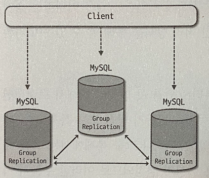

- 그룹 복제는 **별도 플러그인** 으로 구현되어 있음.
- 각 MySQL 서버들은 복제 플러그인을 통해 서로 통신하며 동기화 처리를 한다.
- 그룹 복제 설정시 `group_replication_applier` 라는 복제 채널이 생성됨.
- 이를 통해 그룹에서 실행된 모든 트랜잭션을 전달받아 적용한다.
- 새로운 서버가 참여해 최신 데이터 싱크 작업이 필요한 경우 `group_replication_recovery` 라는 복제 채널을 생성해 이를 처리한다.

`그룹 복제 플러그인의 구조`

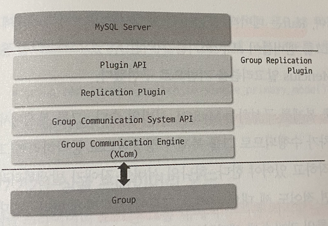
- 최상위 계층에는 MySQL 서버와 상호작용하기 위한 **인터페이스 플러그인 API** 가 있음.
  - 이를 통해 그룹 복제 플로그인과 통신하게 됨.
  - 서버 시작/복구 트랜잭션 커밋등 이벤트 등 처리..
- 그 아래에 그룹 복제의 실질적인 기능들이 구현된 **복제 플러그인 계층** 이 있음.
  - 내부에 여러 모듈로 세분화 되어 있고, 각 요청들이 적절한 모듈로 전달됨.
  - 로컬 및 그룹복제의 다른 MySQL 서버에서 실행된 원격 트랜잭션들이 처리 됨.
  - 트랜잭션들에 대한 충돌감지/그룹 내 전파 등이 수행된다.
  - 그룹 복제 분산 복구 작업도 여기서 처리됨.
- 마지막으로 **그룹 통신 시스템 API** 와 **그룹 통신 엔진** 이 있음.
  - 그룹 통신 엔진은 eXtendedCOMmunication 또는 XCom 이라고 한다.
  - 그룹 복제에 참여중인 서버들 간의 통신을 담당하는 핵심 구성 요소.
  - 일반적으로 33061 포트로 통신을 수행하며, 각 트랜잭션들이 복제 멤버들에게 동일한 순서로 전달되도록 **순서 보장** 을 해준다.
  - 토폴로지 변경과 멤버 장애 등을 감지함.
  - 트랜잭션 적용을 위한 멤버간의 **합의 처리** 도 담당하는데, 일반적으로 많이 사용되는 알고리즘으로 Paxos 와 Raft 가 있음.

`Paxos`
- 분산 시스템에서 데이터 변경이 발생하는 서버가 여러 대 존재하는 경우 주로 사용됨
- Google Chubby 에서 사용중.

`Raft`
- 데이터 변경이 한 대에서만 발생하는 경우 주로 사용됨.
- RAMCloud 에서 사용중.

> 그룹 복제에서 중요한 부분은 그룹 복제를 구성하는 MySQL 서버의 수 이다. <br/>
> 최소한 세 대 의 서버가 그룹에 존재해야 한다. (장애 발생시 문제없이 운용 하기 위함)

- 그룹 복제 구성시 허용 가능한 장애 서버수에 따른 전체 서버 수를 다음과 같이 계산해 그룹 복제로 구성해야 한다.

```shell
n = 2f + 1 (n: 전체 서버수, f: 허용하고자 하는 장애 서버 수)
```

### 그룹 복제 모드
- 그룹 복제에서는 쓰기를 처리할 수 있는 프라이머리 서버 수에 따라 싱글/멀티 프라이모드 두 가지 동작 모드가 있다.
  - `group_replication_single_primary_mode` 시스템 변수로 설정 가능.
  - 기본값은 ON
- 그룹 복제에 참여하는 MySQL 서버들은 모두 동일한 모드 값으로 설정되어 있어야 한다.
- MySQL 8.0.13 버전 이상인 경우 글부 복제 동작중인 상황에서도 변경이 가능함.
  - group_replication_switch_to_single_primary_mode()
  - group_replication_switch_to_multi_primary_mode()
- 8.0.13 미만인 경우 그룹 복제를 중단한 뒤 값을 변경해야함.

`싱글 프라이머리 모드`
- 싱글 프라이머리 모드는, 쓰기 처리가 가능한 프라이머리 서버가 한 대만 존재하는 형태
- 싱글 모드로 그룹 복제를 처음 구축하는 경우 구축을 진행한 서버가 프라이머리로 지정됨.
- 프라이머리가 아닌 서버들은 그룹에 참여하는 시점에 자동으로 `super_read_only` 가 ON 으로 설절되어 읽기 전용 모드로 동작함

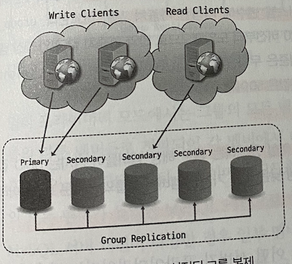

- 싱글 프라이머리로 동작중인 경우 다음 두가지 상황에서 프라이머리가 변경될 수 있음
  - 현재 프라이머리 서버가 그룹을 탈퇴하는 경우
  - group_replication_set_as_primary() UDF 를 사용해 그룹의 특정 멤버를 프라이머리로 지정한 경우
- UDF 를 사용하지 않은 경우 다음 기준을 따라 새로운 프라이머리를 선정하게 된다.

`프라이머리 선정 우선순위`
1. MySQL 서버 버전
   - 가장 우선시 되는 요소
   - 그룹 내에서 가장 낮은 MySQL 버전인 서버가 프라이머리가 된다.
   - 8.0.17 버전인 경우 **패치 버전** 을 기준으로, 그 미만인 경우 **메이저 버전** 을 기준으로 선정됨.
2. 각 멤버의 가중치 값
   - 가장 낮은 MySQL 버전인 서버가 둘 이상인 경우 `group_replication_member_weight` 에 지정된 가중치를 기준으로 선정한다.
   - 0 ~ 100 사이 값을 지정할 수 있고, 기본갑은 50.
3. UUID 값의 사전식 순서
   - 가중치를 기준으로 선정된 서버가 둘 이상인 경우 각 멤버들의 UUID 값중 가장 낮은 값을 선정한다.

`멀티 프라이머리 모드`
- 그룹 멤버들이 전부 프라이머리로 동작하는 형태

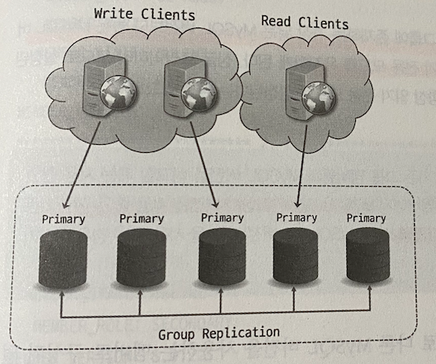
- 모든 멤버에서 쓰기가 발생할 수 있고, 각 멤버에게 전파 후 다시 처리되기 때문에 멤버간의 MySQL 버전 호환성이 중요하다.
  - 가능하다면 모두 같은 버전이면 좋음.
- MySQL 에는 그룹 복제 참여시 버전 호환성을 확인하는 기능이 구현되어 있음.
- 그룹 복제에 참여하는 멤버는 기존 멤버들과 호환성 검사를 수행하고, 호환 가능 기준에 따라 그룹 참여 가능여부/읽기 전용 모드 유지 여부를 결정한다.

`MySQL 호환 기준`
- 새로운 멤버가 **그룹에 존재하는 가장 낮은 MySQL 버전보다 낮은 MySQL 버전을 사용중인 경우** 참여할 수 없음.
- 새로운 멤버가 **그룹에 존재하는 가장 낮은 MySQL 버전과 동일한 버전을 사용중인 경우** 참여 가능.
- 멀티 프라이머리 모드 그룹에서는 **새로운 멤버가 그룹에 존재하는 가장 낮은 MySQL 버전 보다 높은 버전을 사용중이라면 참여는 가능하나, 읽기 전용 모드를 유지하게 됨.

### 그룹 멤버 관리 (Group Membership)
- 현재 어떤 서버들이 그룹에 참여하고 있는지 그룹 멤버들에 대한 목록과 상태 정보를 내부적으로 관리하고 있다.
- `performance_schema.replication_group_members` 테이블을 통해 확인 가능.
  - 그룹 멤버의 호스트명, 포트, UUID, MySQL 버전, Role 을 알수 있음.
  - MEMBER_STATE 컬럼을 통해 상태도 확인 가능
    - MEMBER_STATE.ONLINE : 정상 동작
    - MEMBER_STATE.RECOVERING : 복구 작업 진행중
    - MEMBER_STATE.OFFLINE : 복제 플러그인이 로딩되어 있으니, 복제엔 참여하지 않음.
    - MEMBER_STATE.ERROR : 복제에 참여중이나 복제가 정상적으로 동작하고 있지 않음.
    - MEMBER_STATE.UNREACHABLE : 통신 불가.

> 그룹 복제가 관리하는 멤버목록/상태 정보를 뷰 라고 한다. <br/>
> 뷰는 특정 시점의 그룹 멤버 목록 이라고 할 수 있음. 뷰 ID 라는 고유 식별자를 가지며 멤버가 변경될 때마다 새로운 아이디가 생성된다.

```shell
View ID = [Prefix value]:[Sequence value]
```
- 콜론 (:) 을 기준으로 접두사 부분은 그룹 복제 초기화시 생성되며, 그 시점의 타임스탬프를 기반으로 값이 만들어짐.
- 두번 째 부분은 단조 증가하는 정숫 값

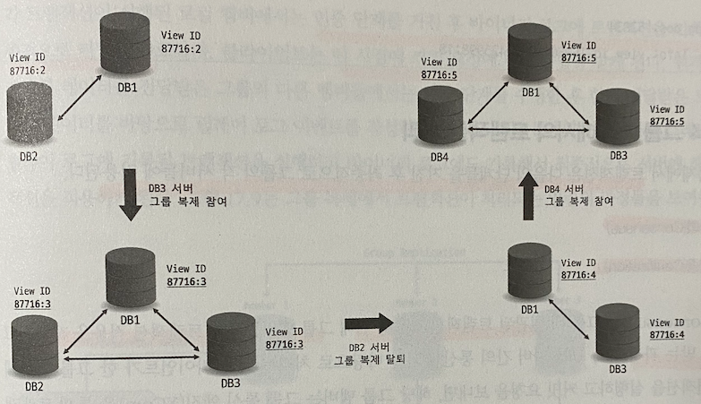

- 뷰 아이디가 변경되면 바이너리 로그에도 `View Change` 이벤트로 뷰 변경 내역이 기록된다.
- 모든 변경내역이 기록되는것은 아니며, 새로운 멤버가 추가되어 뷰가 변경되는 경우에만 기록된다.

### 그룹 복제에서의 트랜잭션 처리
- 그룹 복제에서 트랜잭션은 다음 두 단계를 거친 후 최종적으로 적용됨.
  - 합의 (Consensus)
  - 인증 (Certification)

`합의 (Consensus)`
- 그룹내 **일관된 트랜잭션 적용** 을 위해 트랜잭션 적용을 제안하고, 승낙을 받는 과정.
- 트랜잭션에서 변경한 데이터에 대한 `WriteSet` 과 커밋 당시의 `gtid_executed` 스냅숏 정보, 트랜잭션 이벤트 로그 데이터 등을 다른 멤버에게 전파한다.
  - `Paxos` 기반 프로토콜을 사용함.
- **과반수 이상에 해당하는 멤버들로 부터 응답** 을 받으면 다음 프로세스를 진행한다.

> 합의 단계를 거친후 글로벌하게 정렬되어, 각 멤버들에게 모두 동일한 순서로 인증 단계를 거친다.

`인증 (Certification)`
- 인증 단계에서는 전달받은 트랜잭션 `WriteSet` 데이터와 로컬에서 내부적으로 관리중인 `WriteSet` 히스토리 데이터를 바탕으로 해당 트랜잭션이 인증 단계를 거친 선행 트랜잭션과 충돌하는지 여부를 확인함.
- 트랜잭션 충돌은 멀티 프라이머리 모드에서만 발생할 수 있다.
- 충돌이 감지된 트랜잭션은 처리되지 못하고 롤백처리 됨.

> 인증 단계를 거친 후 바이너리 로그에 트랜잭션을 기룩한 뒤 최종적으로 커밋을 완료하며 이 시점에 커밋요청에 대한 응답을 클라이언트에게 전달한다.

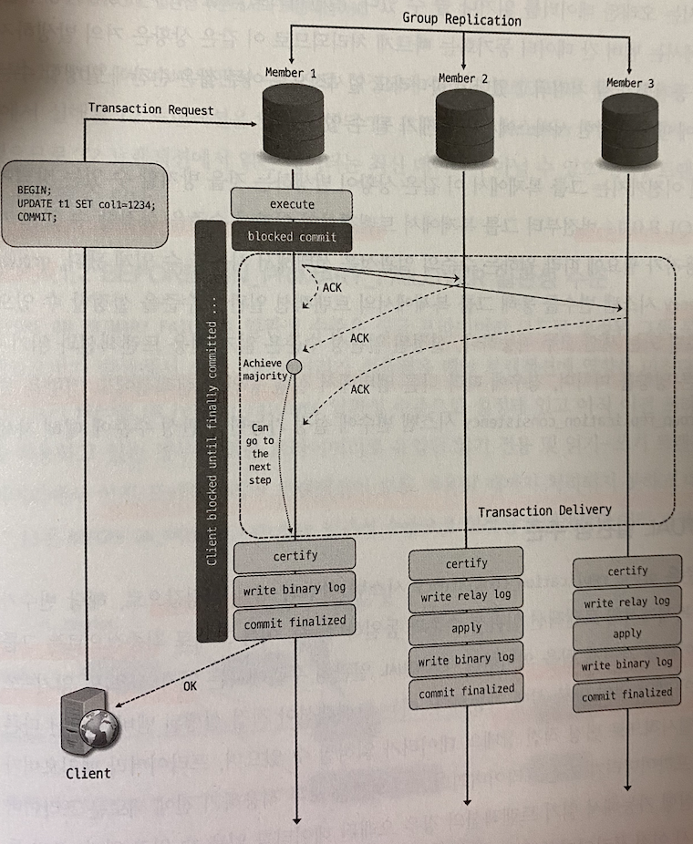

`트랜잭션 일관성 수준`
- 그룹 복제에서 각 멤버들은 동일한 트랜잭션을 적용하지만, **실제 적용 시점 까지 완전히 일치하지는 않음.**
- 쓰기 수행 이후 다른 멤버에서 해당 데이터를 읽으면 변경사항이 반영되지 않았을 수 있다.
  - 프라이머리 장애시 페일오버가 발생하는 경우에도 발생할 수 있음.
- MySQL 8.0.14 이전 버전까지는 그룹 복제에서 이런 상황이 발생하는 것을 방지할 방법이 없었음.
- 8.0.14 버전부터 트랜잭션 일관성 수준을 설정할 수 있는 기능이 도입되었다.
- `group_replication_consistency` 시스템 변수를 통해 그룹 복제에서의 트랜잭션 일관성 수준을 설정할 수 있음.
- 이는 읽기 전용과 읽기/쓰기 트랜잭션에 서로 다른 영향을 미친다.
- 경우에 따라 다른 멤버에서 실행중엔 트랜잭션에 영향을 줄수도 있음.

`EVENTUAL 일관성 수준`
- EVENTUAL 일관성 수준은 `group_replication_consistency` 의 기본 값
- 최종적 일관성을 갖게됨을 의미한다.
- 읽기 전용 및 읽기/쓰기 트랜잭션이 별도 제약 없이 바로 실행 가능.

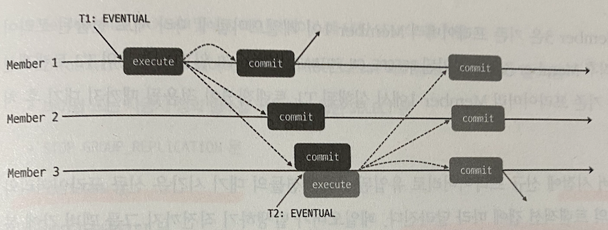

`BEFORE_ON_PRIMARY_FAILOVER 일관성 수준`
- 싱글 프라이머리 모드로 지정된 그룹 복제에서 **프라이머리 페일오버가 발생** 한 경우 트랜잭션에 영향을 미친다.
- 페일오버가 발생하고, 새롭게 선출된 프라이머리가 이전 프라이머리의 트랜잭션을 적용중인 경우 새로운 프라이머리로 유입된 트랜잭션은 적용되지 못하고, 앞선 트랜잭션이 모두 적용될 때까지 대기하게 된다.

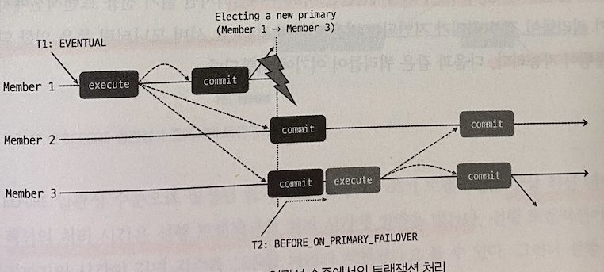

- 페일오버 시점에 새롭게 유입된 트랜잭션들의 대기시간은 **신규 프라이머리와 이전프라이머리의 트랜잭션 갭** 에 따라 달라짐.
- 무한정 대기하는 것은 아니며, `wait_timeout` 시스템 변수에 설정된 값만큼 대기하고, 초과 하는 경우 에러를 반환한다.
- 기본값은 8시간 (28,800 초)
- 이 일관성 수준에는 다음 부분들이 보장됨.
  - 신규 프라이머리로 유입된 트랜잭션 들은 최신 데이터를 바탕으로 동작하게 된다.
  - 신규 프라이머리로 유입된 트랜잭션 들은 충돌로 롤백될수 있는데 이런 롤백이 발생하지 않는다.
- MySQL 서버 모니터링 등을 위한 일부 쿼리는 바로 실행이 가능하다.

`BEFORE 일관성 수준`
- BEFORE 일관성 수준에서 읽기, 읽기/쓰기 트랜잭션은 모든 선행 트랜잭션이 완료될 때까지 대기 후 처리된다.
- BEFORE 일관성 수준에서는 항상 최신 데이터를 읽으며 트랜잭션 처리 시간은 선행 트랜잭션 처리 시간에 영향을 받게 된다.

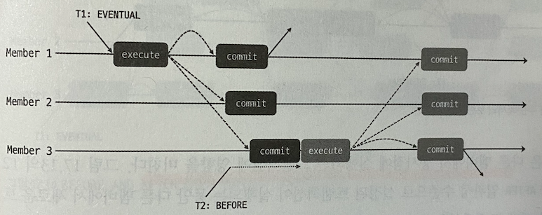
- DB 에서 읽기 요청은 적고, 쓰기 요청이 많은 경우 사용하는 것이 좋다.

`AFTER 일관성 수준`
- AFTER 일관성 수준은 트랜잭션이 적용되면 해당 시점에 그룹 멤버들이 모두 동기화된 데이터를 갖게 한다.
- 다른 모든 멤버들에서도 해당 트랜잭션을 커밋할 준비가 됬을때 까지 대기한 후 최종적으로 처리됨.
- AFTER 일관성 수준은 다른 멤버에서 동시점에 실행되는 트랜잭션에 영향을 미치게 된다.
- 그룹의 어떤 멤버에서든 일관된 최신 데이터를 얻을 수 있다.
- DB 에서 쓰기 요청보다 읽기 요청이 많고, 분산된 최신 읽기를 수행하고자 할 때 사용하는 것이 좋다.

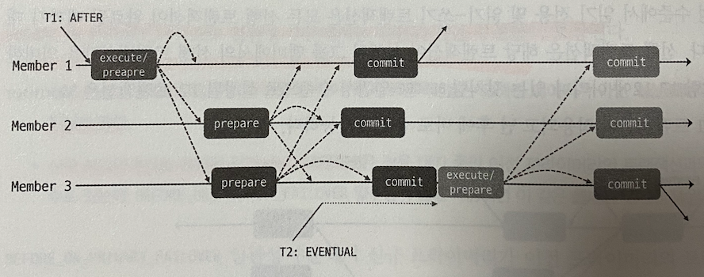

`BEFORE AND AFTER 일관성 수준`
- BEFORE AND AFTER 일관성 수준은 BEFORE/AFTER 가 결합된 형태
- 읽기/쓰기 트랜잭션은 모든 선행 트랜잭션이 적용되기 까지 기다린 후 실행되며, 다른 모든 멤버들에서도 커밋 준비되어 응답을 보내면 그때 최종적으로 커밋된다.

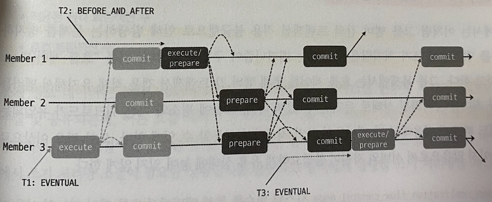
- 커밋이후 모든 후속 트랜잭션들은 그룹의 어떤 멤버에서든지 해당 트랜잭션의 변경사항을 포함하는 최신 데이터를 읽게 됨.

`흐름제어 (Flow Control)`
- 특정 멤버가 다른 멤버들 보다 트랜잭션 적용이 지연되는 상황이 있을 수 있음
  - 대역폭 문제나.. 부하를 더 많이 받거나..
- 지연된 멤버에서 트랜잭션이 실행되면 해당 트랜잭션은 최신 데이터가 아닌 오래된 데이터를 읽을 수 있으며, 적용되지 않은 트랜잭션과 충돌의 위험이 있다.
- 트랜잭션 일관성을 조정해, 문제를 방지할 수는 있지만 근본적인 해결책은 아님.
- 그룹 멤버간의 쓰기 처리량을 조절해 이를 방지하는 기능을 **흐름 제어 (Flow Control)** 라고 한다.
- 흐름 제어를 통해 각 멤버간의 트랜잭션 갭을 적게 유지해 최대한 동기화된 상태로 유지하는 것이다.
- `group_replication_flow_control_mode` 시스템 변수를 통해 흐름제어 기능 설정이 가능함.
  - QUOTA 모드 밖에 존재하지 않음. (기본값)
  - 그룹에서 쓰기처리멤버가 정해진 할당량 만큼만 처리하도록 제어하는 방식

`QUOTA 모드의 동작 방식`
- 모든 그룹 멤버들의 **쓰기 처리량과 대기중인 트랜잭션 통계를 수집** 해 처리량 조절이 필요한지 확인
- 처리량 조절이 필요한 경우, 수집된 데이터를 바탕으로 쓰기 처리량을 조절한다.

`흐름 제어의 통계 수집 정보`
- 인증 (Certification) 큐 크기
- 적용 (Application) 큐 크기
- 인증된 총 트랜잭션 수
- 적용된 원격 트랜잭션 수
- 로컬 트랜잭션 수

> 통계 데이터는 `group_replication_flow_control_period` 에 지정된 시간 (초단위) 마다 수집되며 이는 흐름제어 동작 주기를 의미함.

- 두 시스템 변수를 통해 흐름 제어가 처리량을 조절할 수 있는 임곗값 설정이 가능
  - group_replication_flow_control_certifier_threshold
    - 인증 큐에서 대기중인 트랜잭션 수에 대한 임곗값
    - 기본값 25_000
  - group_replication_flow_control_applier_threshold
    - 어플라이어 큐 에서 대기중인 트랜잭션 수에 대한 임곗값
    - 기본값 25_000

`흐름제어의 쓰기 처리량과 관련된 시스템 변수들`
- group_replication_flow_control_min_quota
  - 멤버에게 할당되어야 할 최소 쓰기 처리량
  - 기본값은 0
- group_replication_flow_control_max_recovery_quota
  - 그룹에서 복구상태 멤버가 존재하는 경우 `group_replication_flow_control_min_quota` 변수 대신 적용되는 시스템 변수, 기본값은 0
- group_replication_flow_control_max_quota
  - 흐름 제어에서 그룹에 할당가능한 최대 쓰기 처리량
  - 기본값은 0
- group_replication_flow_control_member_quota_percent
  - 멤버에게 할당할 쓰기 처리량에서 실제 어느정도를 멤버가 사용할지 백분율을 지정
  - 기본값은 0
  - 멀티 프라이머리 인 경우에만 유효
- group_replication_flow_control_hold_percent
  - 멤버에게 할당된 쓰기 처리량에서 사용하지 않고 남겨둘 백분율을 지정
  - 기본값은 10
- group_replication_flow_control_release_percent
  - 처리량을 제한할 필요가 없을때, 흐름 제어가 주기당 증가시킬 백분율
  - 0으로 설정시 다음 흐름제어에서 처리량 조절이 해제됨.

`흐름제어에서 쓰기 처리량을 계산하는 로직`
1. 통계 정보를 바탕으로 계산한 값과 `group_replication_flow_control_min_quota` 시스템 변수의 값 중 큰 값을 선택.
  - 복구중인 멤버가 있다면 `group_replication_flow_control_max_recovery_quota` 를 사용한다.
2. 앞에서 결정된 값에 100에서 `group_replication_flow_control_hold_percent` 시스템 변수에 설저된 백분율 을 뺀 나머지 백분율을 곱함.
3. `group_replication_flow_control_max_quota` 의 변수가 0보다 큰 경우 해당 변수의 값과 앞서 결정된 값 중 더 작은 값을 선택.
    - 그룹에서 쓰기처리를 하는 멤버가 둘 이상이라면 추가적인 계산을 한다.
      - `group_replication_flow_control_member_quota_percent` 가 0인 경우 3에서 선택한 값을 쓰기 멤버수만큼 나눔.
      - `group_replication_flow_control_member_quota_percent` 가 0이 아닌 경우 3에서 선택된 값에 `group_replication_flow_control_member_quota_percent` 를 곱함.

> 흐름 제어 관련 변수들은 동적 변경이 가능함. 복제 중단을 하지않더라도 즉시 반영된다.

### 그룹 복제의 자동 장애 감지 및 대응
- 일부 멤버에 장애가 발생해 응답 불능 상태에 빠지더라도 그룹이 정상적으로 동작 가능하도록 **장애 감지** 메커니즘이 구현되어 있다.
- 문제상태에 빠진 멤버를 식별하로 이를 제외 시킴으로써 클라이언트 요청에 문제가 없도록 한다.

`자동 장애 감지`
- 그룹 복제에서는 멤버간 주기적으로 통신 메세지를 주고받으며 서로의 상태를 확인한다.
- 멤버로부터 5초 내로 메시지를 받지 못하면 해당 멤버에 문제가 생긴것으로 의심하기 시작함.                                                                                                                                                        
- 5초 대기시간이 추가된 것은 `group_replication_member_expel_timeout` 시스템 변수의 기본값이 5로 변경되었기 때문임.
- 8.0.13 버전에서는 대기시간을 초단위로 설정 가능. 8.0.20 까지 기본값은 0임.
- 기본값을 사용한다면 5 ~ 10초후 멤버가 그룹에서 추방당하게 되는데, 이는 불필요한 추방 혹은 페일오버가 발생할 여지가 있다.
- 따라서 이런 경우 기본값 보단 좀 더 큰 적절한 값으로 설정하는 것이 좋음.
  - 일시적인 네트워크 중단 등...
- 멤버가 추방되면 그룹 뷰가 변경되므로 **새로운 뷰 ID** 를 갖게 된다.
- 추방된 멤버가 다시 그룹에 연결되면 뷰 ID 를 통해 추방되었음을 알게됨.
- 추방된 멤버는 자동으로 그룹에 재 가입을 시도할 수 있다.
  - `group_replication_autorejoin_tries`
  - 8.0.16 에 도입됨
  - 설정된 횟수만큼 재가입을 시도한다.
  - 8.0.20 까지 기본값 0
  - 8.0.21 부터 기본값 3
  - 각 시도당 5분의 텀을 둔다.
- 추방된 메버는 다른 멤버들과 통신되지 않는다면 추방됬음을 알지 못한다.
- 기본적으로 네트워크 단절로인한 분리의 경우 스스로 그룹을 탈퇴하지 않음.
- `group_replication_unreachable_majority_timeout` 시스템 변수를 이용해 일정 시간 후 스스로 탈퇴하도록 설정 가능함.
  - 기본값은 0, 탈퇴하지 않고 무한 대기.
- 지정한 시간이 초과되면 보류되어있던 모든 트랜잭션을 롤백하게 그룹에서 탈퇴한다.

`group_replication_exit_state_action`
- 멤버가 그룹에서 탈퇴하거나 자동 재가입에 실패하는 경우 `group_replication_exit_state_action` 시스템 변수에 설정된 작업을 수행한다.
- 이를 **종료 액션** 이라고 함.
  - 8.0.12 버전부터 사용 가능
- READ_ONLY
  - `super_read_only` 시스템 변수를 ON 으로 설정해 MySQL 서버를 슈퍼 읽기 전용 모드로 변경함.
  - 서버에서 데이터 변경을 수행할 수 없다.
- OFFLINE
  - `offline_mode` 시스템 변수를 ON 으로 설정해 MySQL 서벌르 오프라인 모드로 전환 시키고, `super_read_only` 도 ON 으로 변경한다.
  - 기존에 이미 연결된 세션의 경우 다음 요청에서 연결이 끊어지고 `CONNECTION_ADMIN` 권한을 가진 사용자를 제외한 연결이 허용되지 않음.
  - 8.0.18 버전부터 사용 가능
- ABORT_SERVER
  - MySQL 서버를 종료시킨다.
  - 8.0.12 ~ 8.0.15 까지의 기본값

`종료 액션이 수행되는 경우`
- 그룹 복제의 어플라이어 스레드에 에러가 발생한 경우
- 멤버가 그룹 복제의 분산 복구 프로세스를 정상 완료처리할 수 없는 경우
- group_replication_switch_to_single_primary_mode() 같은 UDF 를 사용해 그룹 전체 설정 변경중 에러가 발생한 경우
- 싱글 프라이머리 모드에서 새 프라이머리 선출중 에러가 발생한 경우
- 과반수 이상의 다른 멤버와 통신이 단절되고 `group_replication_unrechable_majority_timeout` 시스템 변수 설정값을 초과했으나 재시도 설정이 되어있지 않은 경우
- 멤버에 문제가 발생해 `group_replication_member_expel_timeout` 시스템 변수에 설정된 대기시간을 초과해 그룹에서 추방된 뒤 재가입 시도를 하지않도록 설정된 경우
- 멤버가 그룹에서 탈퇴한 후 `group_replication_autorejoin_tries` 의 횟수동안 그룹에 재가입하지 못한 경우

### 그룹 복제의 분산 복구
- 그룹 복제에서는 그룹 가입시 가입멤버가 다른 멤버와 동일한 최신 데이터를 가질수 있도록 복구 프로세스를 수행한다.
- 이를 **분산 복구** 라고 함.
- 본산 복구에서 가입 멤버의 복구 작업을 위해 선택한 기존 멤버를 **기증자 (Donor)** 라고 하며, 온라인 상태인 모든 멤버는 기증자가 될 수 있다.

`분산 복구 방식`
- 분산 복구시 먼저 가입 멤버에서 `group_replication_applier` 복제 채널의 **릴레이 로그** 를 확인한다.
  - 이전에 가입한적이 있다면 릴레이 로그에는 존재하지만 적용되지 않은 트랜잭션이 있을 수 있음.
- 적용되지 못한 트랜잭션을 먼저 확인하고, 이를 먼저 적용한 뒤 복구 작업을 수행한다.
- 본산 복구는 두 가지 방식을 적절히 조합해 작업을 진행한다.
  - 바이너리 로그 복제 방식
  - 원격 클론 방식

`바이너리 로그 복제 방식`
- MySQL의 기본 복제 방식인 비동기 복제를 기반으로 구현되었다.
- 기증자와 `group_replication_recovery` 라는 별도 채널로 연결해 해당 멤버의 바이너리 로그를 이용해 복구한다.

`원격 클론 방식`
- MySQL 8.0.17 버전에 도입된 **클론 플러그인 (Clone Plugin)** 을 사용하는 방식
- 다른 멤버의 InnoDB 스토리지 엔진에 저장된 모든 데이터와 메타데이터를 일관된 **스냅숏** 으로 가져와 가입 멤버를 재구축 한다.
- 그룹 멤버와 가입멤버 모두 클론 플러그인이 설치되어 있어야 함.
- 스냅숏 데이터로 복구 이후 복구작업 동안 적용된 트랜잭션을 추가로 적용하기 위해 바이너리 로그 복제방식으로 한번 더 복구를 진행함.
- `group_replication_clone_threshold` 시스템 변수에 지정한 임계값을 넘으면 원격 클론 방식을 사용하게 된다.

> 가입 멤버와 기존 멤버간의 트랜잭션 갭이 크거나 트랜잭션중 일부가 기존 멤버의 바이너리로그에 존재하지 않는 경우 원격 클론 방식을 사용하며, 그렇지 않은 경우 바이너리 로그 복제 방식으로만 진행한다.

`분산 복구 프로세스`
- 그룹 복제에서 수행되는 분산 복구 작업은 **세 단계** 로 구분이 가능하다.
1. 로컬 복구
   - 그룹에 가입하는 멤버가 이전에 가입한 이력이 존재하는 경우 적용하지 못한 트랜잭션이 존재할 수 있기 때문에 이전 트랜잭션들을 먼저 적용한다.
2. 글로벌 복구
   - 가입 멤버는 기존 멤버들중 기증자를 선발한 뒤 해당 멤버로 부터 데이터를 가져와 적용한데. 현재 그룹에서 처리되는 트랜잭션들은 내부적으로 캐싱 처리함. 
3. 캐시 트랜잭션 적용
   - 캐싱 되어있던 트랜잭션 들을 적용해 최종적으로 그룹에 가입 처리가 됨.
   
- 새로운 멤버가 그룹에 가입하면 그룹 뷰가 변경되어 **뷰 변경 로그 이벤트 (View Change Log Event)** 가 생성되어 멤버들의 바이너리 로그에 기록된다.

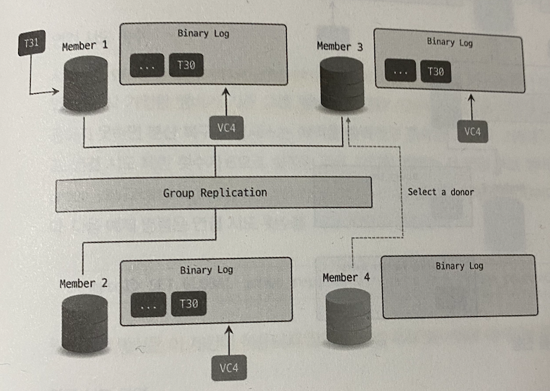
- 신규 멤버 참여

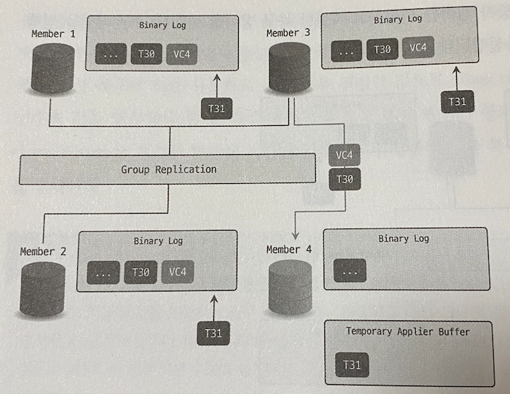
- 가입 멤버의 분산 복구 작업

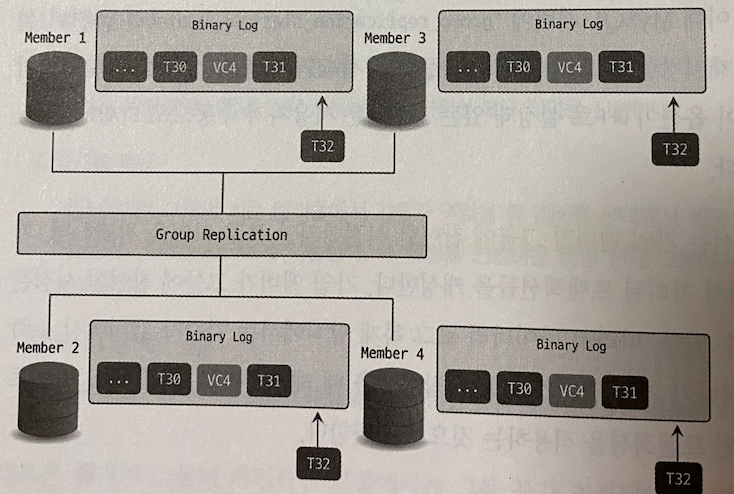
- 분산 복구 작업 완료 이후 공식 멤버가 됨.

`분산 복구 설정`
- 사용자는 글부 복제의 분산 복구에서 다음과 같은 부분들에 대해 설정이 가능함.
1. 연결 시도 횟수
   - `group_replication_recovery_retry_count` 시스템 변수를 통해 바이너리 복제 방식으로 복구 작업하는 경우 가입 멤버가 기존 멤버에 연결하는 시도를 제한할 수 있음.
   - 해당 횟수 내에 연결 실패시 분산 복구 프로세스는 종료됨.
   - 기본값은 10.
   - 원격 클론 방식은 이 설정이 적용되지 않는다.
2. 연결 시도 간격
   - group_replication_recovery_reconnect_interval` 시스템 변수를 통해 바이너리 로그 복제 방식으로 복구 작업하는 경우 기존 그룹 멤버들에 대해 연결 시도 사이의 대기시간 설정이 가능함.
   - 매 연결 시도마다 대기하는 것이 아닌. 연결 대상 멤버 별로 한번씩 연결 시도 후 대기한다. (연결 대상멤버가 5대 라면 5대 모두 연결시도 이후 대기함)
   - 기본 값은 60초.
   - 원격 클론 방식은 이 설정이 적용되지 않는다.
3. 가입 멤버를 온라인 (ONLINE) 상태로 표기하는 시점
   - 기본적으로 가입멤버가 본산 복구 완료시, (누락된 트랜잭션 모두 적용 이후) 그룹 뷰에서 ONLINE 으로 표기된다.
   - 누락된 트랜잭션의 인증 단계 까지 완료 후 ONLINE 으로 표기되도록 설정이 가능하다.
     - `group_replication_reocvery_complte_at=TRANSACTIONS_CERTIFIED` 로 지정
   - 기본 값은 `TRANSCATIONS_APPLIED`

`분산 복구 오류 처리`
- 그룹 복제의 분산 복구에는 복구 작업 도중 문제가 발생하더라도 가능한 경우 자동으로 다시 작업을 시도하는 **장애 감지 메커니즘** 이 구현되어 있다.
- 자동으로 **새로운 그룹 멤버로 연결을 전환해 재시도 하는 경우** 와, **더이상 진행되지 못하게 가입 멤버가 그룹을 탈퇴하는 경우** 로 나눠볼 수 있음.

`자동으로 새로운 그룹 멤버로 연결을 전환해 다시 작업을 시도하는 경우`
- 기증자로 선택한 그룹 멤버로의 연결이 인증 문제 등으로 인해 정상 처리가 되지 않는 경우
- 바이너리 로그 복제 방식으로 복구 작업 진행 도중 레플리케이션 I/O 스레드 또는 SQL 스레드에서 에러가 발생한 경우
- 원격 클론 작업이 실패하거나 혹은 완료되기 전 중단된 경우
- 복구 작업 동안 기증자 멤버에서 글부 복제가 중단된 경우
- `performance_schema.replication_connection_status` 테이블 혹은 `replication_applier_status_by_worker` 테이블에서 `LAST_ERROR_` 로 시작하는 컬럼들에 해당 에러를 확인이 가능함.
- `performance_schema.clone_progress` 및 `clone_status` 테이블을 통해 클론작업 진행 현황 및 상태 정보도 확인할 수 있다.

`분산 복구 프로세스가 진행되지 못하고 가입 멤버가 그룹을 탈퇴하는 경우`
- 가입 멤버가 `group_replication_recovery_retry_count` 시스템 변수에 저장한 재시도 횟수를 모두 소진한 경우
- 가입 멤버가 필요한 트랜잭션이 그룹 멤버들의 바이너리 로그에 존재하지 않으며, 원격 클론 방식으로도 복구 작업을 진행할 수 없는 경우
- 가입 멤버가 그룹에서는 존재하지 않는 트랜잭션을 가지고 있는 상태에서 바이너리 로그 복제 방식으로 복구 작업이 진행되는 경우
- 가입 멤버가 전체 그룹 멤버에 대해 원격 클론 방식과 바이너리 로그 복제 방식을 모두 시도해 봤지만 전부 실패해서 더이상 시도해볼 멤버가 존재하지 않는 경우
- 복구 작업이 진행되는 중에 가입 멤버에서 그룹 복제가 중단된 경우

> 가입 멤버가 복구 작업 도중 직접 탈퇴한 경우를 제외하면 최종적으로 `group_replication_exit_state_action` 에 지정된 작업을 수행하게 된다.

### 그룹 복제 요구사항
- 그룹 복제 사용시 MySQL 서버는 다음 요구사항을 충족해야 함.
1. InnoDB 스토리지 엔진 사용
2. 프라이머리 키 사용
3. 원활한 네트워크 통신 환경
4. 바이너리 로그 활성화
5. ROW 바이너리 로그 포맷
6. 바이너리 로그 체크섬 설정
7. log_slave_updates 활성화
8. GTID 사용
9. 고유한 server_id 값 사용
10. 복제 메타데이터 저장소 설정
11. 트랜잭션 WriteSet 설정
12. 테이블 스페이스 암호화 설정
13. lower_case_table_names 설정
14. 멀티 스레드 복제 설정

### 그룹 복제 제약 사항
- 그룹 복제는 GTID 를 사용하므로 GTID 에 의한 제약사항도 영향을 받는다.
- 그외 추가적인 제약사항들은 다음고 ㅏ가탇.
1. **갭 락 (Gap Lock)** 은, 갭 락을 발생시킨 트랜잭션이 실행된 멤버에서만 유효하며, 그룹 복제의 트랜잭션 인증 단계에서 해당 락 정보가 공유되지 않는다. 멀티 프리마이모드 인 경우 트랜잭션 충돌 감지를 일치시키기 위해 갭락을 사용하지 않는 **READ-COMMITTED** 격리 수준을 사용하는 것이 좋음.
2. **테이블 락 (Table Lock) 및 네임드 락 (Named Lock)** 도 그룹단위로 락 정보가 공유되지 않는다.
3. 바이너리 로그 체크섬 기능은 8.0.2 버전부터 지원한다.
4. 멀티 프라이머리모드로 동작중인 경우 `SERIALIZABLE` 격리 수준을 사용할 수 없다.
5. 멀티 프라이머리모드로 동작중인 경우 **동일한 테이블** 에 대해 서로 다른 멤버에서 동시에 실행되는 DDL/DML 은 지원하지 않는다.
6. 멀티 프라이머리모드로 동작중인 경우 **외래 키 (Foreign Key)** 가 존재하는 테이블 (특히 CASCADE 조건 사용된 테이블) 은 지원하지 않음.
7. 멀티 프라이머리모드로 동작중인 경우 `SELECT ... FOR UPDATE` 구문을 사용할 때 데드락이 발생할 수 있다.
8. 그룹 복제에서 복제 필터 기능은 사용할 수 없다.
9. 그룹 복제는 최대 9대의 서버까지 구성 가능하다.

## MySQL 셸
- MySQL 셸은 MySQL 을 위한 고급 클라이언트 툴이며, SQL 뿐 아닌 자바스크립트와 파이썬 모드를 지원한다.
- 기본적으로 자바스크립트 모드로 동작한다.

```shell
// 파이썬 모드 전환
\py
// sql 모드 전환
\sql
// 자바스크립트 모드 전환
\js
```
- MySQL 셸에서 제공하는 API 는 X 프로토콜을 이용해 MySQL 서버에서 관계형 데이터와 문서 기반 데이터를 모두 처리할 수 있게 하는 X Dev API 와 MySQL 서버의 설정을 변경하고 InnoDB 클러스터 및 InnoDB 레플리카 셋 을 구축할수 있게 AdminAPI 를 제공한다.
- 셸에 내장된 글로벌 객체와 메소드를 이용해 사용이 가능하며, 글로벌 겍체는 자바스크립트와 파이썬 모드에서만 사용이 가능하다.

`MySQL 셸 글로벌 객체`
- session
  - 셸에서 MySQL 서버에 연결했을 때 생성된 세션에 매핑되는 객체.
  - 트랜잭션 시작과 같이 세션 단위에서 사용가능한 기능을 제공
- dba
  - InnoDB 클러스터 및 InnoDB 레플리카 셋 구축과 관련된 기능을 제공.
  - 내부적으로 AdminAPI 를 사용함.
- cluster
  - InnoDB 클러스터에 매핑되는 객체.
  - 클러스터 설정 변경 등 클러스터와 관련된 기능을 제공.
- rs
  - InnoDB 레플리카셋에 매핑되는 객체.
  - 레플리카 셋 설정 변경등 레플리카 셋과 관련된 기능을 제공.
- db
  - X 프로토콜을 사용해 MySQL 서버에 연결한 경우 연결시 지정한 데이터베이스에 매핑되는 객체.
  - 데이터베이스와 관련된 기능을 제공.
- shell
  - MySQL 셸 설정 변경같이 셸과 관련된 기능을 제공.
- util
  - MySQL 서버 버전 업그레드 확인 등 유용한 작업 기능들을 제공.

## MySQL 라우터

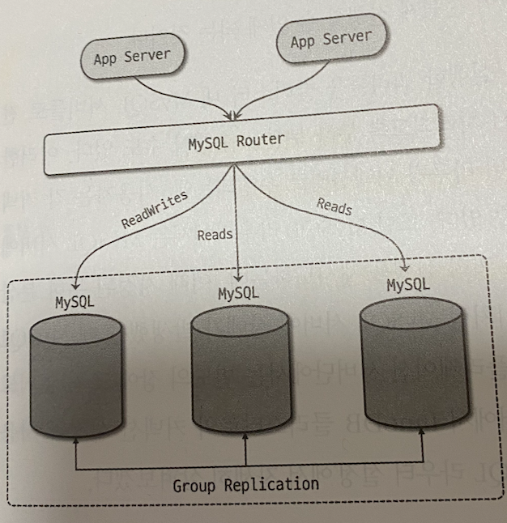

- MySQL 라우터는 InnoDB 클러스터에서 애플리케이션 서버로부터 유입된 쿼리 요청을 클러스터 내 적절한 MySQL 서버로 전달하고 MySQL 서버에서 반환된 쿼리 결과를 다시 전달하는 **프록시 (Proxy)** 역할을 수행한다.
- MySQL 라우터의 주요 기능은 다음 3가지
  - InnoDB 클러스터 구성 변경 자동 감지
  - 쿼리 부하 분산
  - 자동 페일 오버

