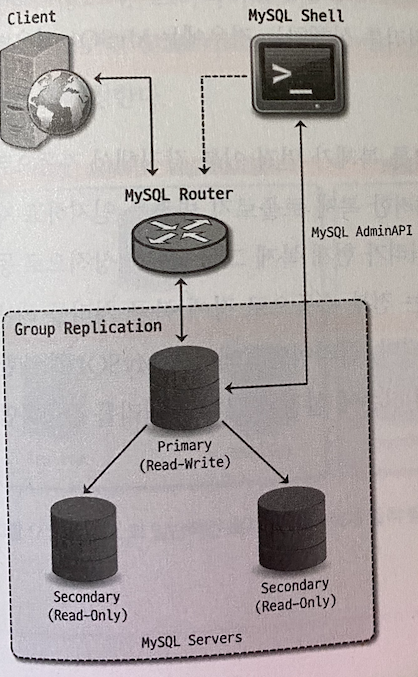
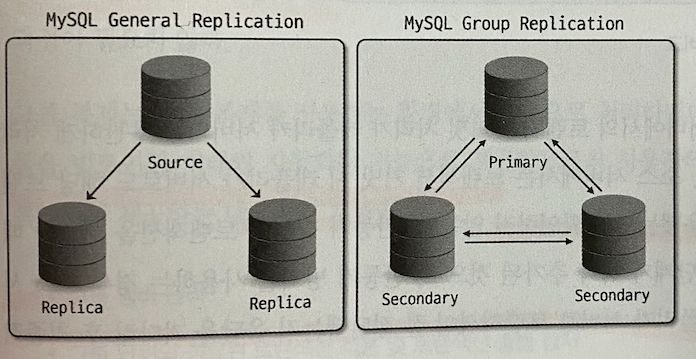
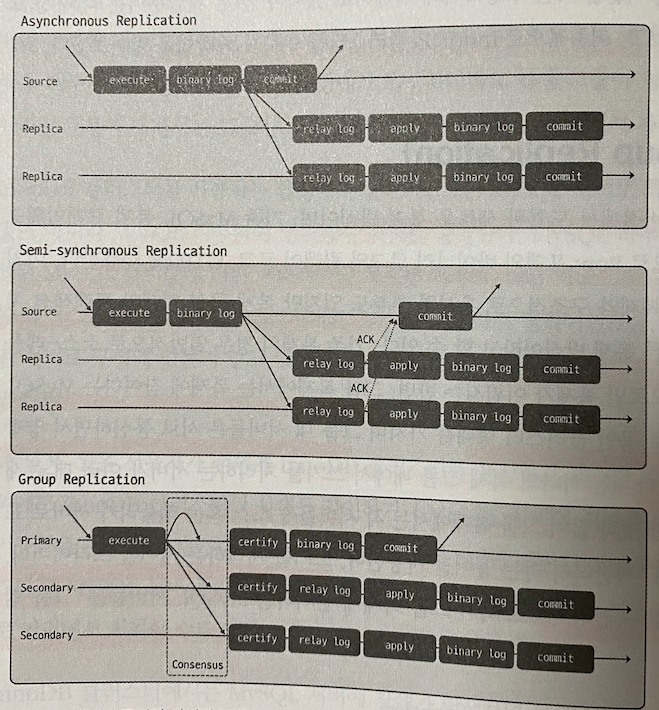

# 지옥 스터디 - 16 InnoDB 클러스터
- MySQL 은 서버 자체적으로 페일오버 처리를 하는 기능을 제공하지 않는다.
  - 장애 발생시 일련의 작업들을 수행해야함.
- 어떤 서비스든 장애가 발생한 경우 장애 시간을 최소화 하는것이 제일 중요함.
  - 때문에 수동 처리보단 자동화 하는 것을 고려해야함.
- 대표적으로 MMM/MHA, Orchestrator 와 같은 HA 솔루션을 사용한다.
- MySQL 5.7.17 버전에서 빌트인 형태의 HA 솔루션인 **InnoDB 클러스터** 가 도입되면서 사용자가 좀 더 쉽고 편리하게 고가용성을 실현할 수 있게 됨.

## InnoDB 클러스터 아키텍쳐
- InnoDB 클러스터는 MySQL 내의 특정 기능이아닌, MySQL 고가용성 실현을 위해 만들어진 여러 구성요소들의 집합체.

`InnoDB 클러스터 구성요소`
- 그룹 복제 (Group Replication)
  - 소스 서버의 데이터를 동기화하는 기본적인 복제 뿐이 아닌, 복제에 참여하는 MySQL 서버들에 대한 **자동화된 멤버십 관리** 역할을 담당
- MySQL 라우터 (MySQL Router)
  - 애플리케이션과 MySQL 서버 사이에 동작하는 미들웨어
  - 애플리케이션이 실행한 쿼리를 적절한 MySQL 서버로 전달하는 **프록시 (Proxy)** 역할을 함.
- MySQL 셸 (MySQL Shell)
  - 기존 MySQL 클라이언트 보다 확장된 기능을 가진 클라언트 프로그램.
  - 기본 SQL 실행뿐 아닌 자바스크립트/파이썬 기반 스크립트 작성 기능과 클러스터 구성 등 Admin API 를 제공함.

`일반적인 InnoDB 클러스터 구성`

- 데이터가 저장되는 MySQL 서버들은 **그룹 복제** 형태로 복제가 구성되고, **프라이머리 (Primary)** 또는 **세컨더리 (Secondary)** 중 하나의 역할로 동작하게 된다.
  - 프라이머리 : R/W 가능. 기본 복제에서의 소스 서버
  - 세컨더리 : R 가능. 기존 복제에서의 레플리카 서버

> 프라이머리는 하나만 존재할 수도 있고, 여러 대가 존재할 수 있으며, 그룹복제에서 InnoDB 스토리지엔진만 사용하기 때문에 InnoDB 클러스터라고 명명되었음.

- 그룹 복제 구성시 **고가용성을 위해 MySQL 서버를 최소 3대 이상** 으로 구성한다.
  - 일명 매직넘버 3... 인프라 구성시 보편적으로 사용되는 숫자 
- InnoDB 클러스터는 **MySQL 라우터** 를 통해 쿼리를 실행한다.
- InnoDB 클러스터로 구성된 MySQL 서버들에 대한 메타데이터 정보를 가지고, 클라이언트로 부터 실행된 쿼리를 적절한 MySQL 서버로 전달함.
  - 클라이언트의 커넥션 정보는 MySQL 라우터 서버만 설정하면 됨.
- **MySQL 셸** 은 사용자가 쉽게 클러스터 생성 및 관리가 가능하도록 API 를 제공한다.
  - 클러스터와 관련된 작업은 직접 서버에 연결해야 하지만, 단순 쿼리 실행의 경우 라우터를 통해 처리할 수도 있음.

`InnoDB 클러스터의 장애 처리`
- MySQL 서버에 장애가 발생하면, 그룹복제가 먼저 이를 감지해 자동으로 해당 서버를 복제 그룹에서 제외시킨다.
- MySQL 라우터는 복제 토폴로지 변경을 인지하고, 메타데이터를 갱신해 정상동작하는 MySQL 서버로만 전달될 수 있도록 처리한다.

> 기존에 수동으로 장애복구 처리를 하던것들이 모두 자동화 되어 있음.

## 그룹 복제 (Group Replication)

- MySQL 5.7.17 버전에서 도입된 새로운 복제 방식.
- 기존 MySQL 복제 프레임워크 기반으로 구현되어 있다.
  - 내부적으로 Row 포맷 바이너리 로그와 릴레이로그, GTID 를 사용함.
  - 구조적으로 유사한 부분도 있지만, 복제 구성 형태와 트랜잭션 처리 방식에서는 완전히 다른 방식임.

`기존 복제 방식`
- 일반적으로 소스-레플리카 서버로 구성되어 **단방향** 으로만 복제가 이루어 진다.
- 복제 처리 방식을 데이터 동기화 측면에서 보았을때, **비동기 방식 (Asynchronous)** 과 **반동기 (Semi-Synchronous)** 방식으로 나눌 수 있음.
- 기본적으로 소스 서버에서 트랜잭션 커밋 처리가 레플리카 서버와 무관한 **비동기 방식** 으로 처리됨.
- 트랜잭션 커밋시 레플리카 서버로도 해당 트랜잭션이 잘 전달되었고, 잘 적용되었는지 확인하지 않는다.
- 반동기 방식은 레플리카 서버로 해당 트랜잭션이 잘 전달되었는지 만 확인하고, 최종적으로 커밋 처리를 한다.

`그룹 복제 방식`
- 복제에 참여하는 MySQL 서버들이 하나의 복제그룹으로 묶인 클러스터 형태를 띔.
- 그룹내 서버들은 **양방향 복제 처리** 가 가능하다.
- 때문에 프라이머리/세컨더리 라고 표현한다.
- 그룹 복제는 **반동기 복제 방식** 이지만 기존 반동기 방식과 동일한 방식으로 처리되는 것은 아님.
- 반동기 방식과 유사하게 그룹내에 다른 멤버들의 응답을 확인하는 단계가 존재한다.
- 한 서버에서 트랜잭션이 커밋될 준비가 되면, 트랜잭션 정보를 그룹의 다른 멤버들에게 전송해 **과반수 이상의 멤버** 로 부터 응답을 받으면 해당 트랜잭션을 **인증 (Certify)** 하고, 최종적으로 커밋을 완료한다.
  - 인증 : 인증 대상 트랜잭션이 이미 인증단계를 통과한 선행 트랜잭션과의 충돌 여부를 검사하는 과정..
- 과반수 이상의 멤버로 부터 응답을 받지 못하면 해당 트랜잭션은 그룹에 적용되지 않는다.
  - 트랜잭션 커밋 처리시 그룹의 다른 멤버들에 대한 응답을 확인하는 과정을 **합의 (Consensus)** 라고 한다.
  - 데이터를 변경한느 트랜잭션에 대해서만 합의 과정이 필요함.
- 해당 트랜잭션이 실제로 적용했는지 까지 확인하지는 않는다. 
- 그룹내 멤버들의 응답에 따라 전체 복제 그룹에서 해당 트랜잭션 적용 여부가 결정되는것이 큰 차이점이다.

