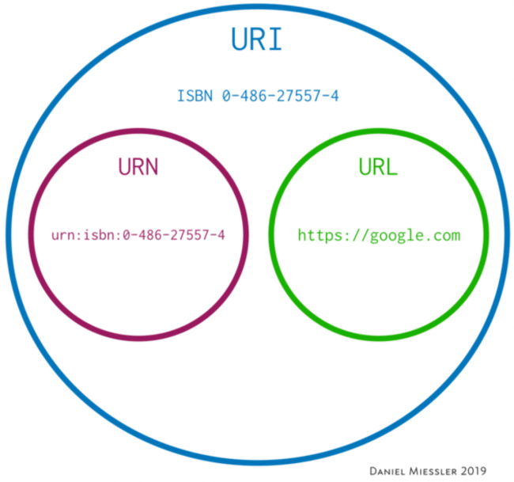
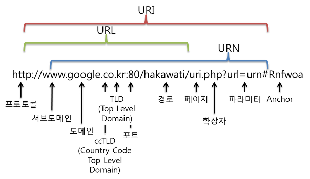

# 지옥 스터디 - 01 서블릿과 JSP

## 웹서버와 클라이언트
- 웹 서버 : 클라이언트로 부터 요청을 받아 응답
- 웹 클라이언트 : 사용자가 서버에 요청을 보낼수 있는 기능을 제공하고, 서버로 받은 응답을 출력

## HTTP 프로토콜
- TCP/IP 기반으로 동작하는 프로토콜
  - TCP/IP 는 점대점 통신을 지원
- 웹에서만 사용하는 프로토콜 이며 요청/응답 구조로 되어 있다.

## HTTP 메소드
- GET : 리소스 요청시 사용하며 Body 가 존재할 수 없다.
  - 정확하게 말하면 Body 를 실을 순 있으나, 요청을 받은 서버쪽에서 무시할 수 있다, 사용하지 않는 것을 권장
  - 캐싱이 가능하다
  - 브라우저에 히스토리가 기록된다
  - 북마크가 가능하다
  - 민감한 데이터를 보낼때 사용해서는 안된다.
  - 데이터 길이가 제한된다.
  - idempotent
- POST : 서버에 리소스를 새롭게 생성하거나 수정하는 등에 사용한다.
  - 캐싱이 불가능하다
  - 브라우저에서 히스토리가 남지 않는다
  - 북마크 할 수 없다
  - 데이터 길이 제한이 없다.
- PUT : URI 에 해당하는 데이터를 새롭게 생성하거나 수정시 사용한다.
  - POST 와의 차이는 URI 의 의미가 다르다
  - POST -> 보내는 데이터를 처리할 리소스
  - PUT -> 보내는 데이에 해당하는 리소스
  - idempotent
- PATCH : PUT 과 유사하지만 수정할 부분만 보낸다
  - 리소스의 일부분만 수정하고 싶은경우 사용한다
  - idempotent
- DELETE : 리소스를 삭제할 때 사용한다.
  - idempotent

## URL

- URI : Uniform Resource Identifier / 인터넷상 표현가능한 모든 리소스를 의미
- URL : Uniform Resource Locator / URI 에서 네트워상의 경로 / 어떤 자원 위치에 해당하는 절대 경로값을 지닌 문자열을 의미
- URN : Uniform Resource Name / 리소스에 고유한 이름을 부여 / 리소스를 식별하기만 할 뿐 얻을 수 있는 위치를 포함하지 않는다.

## 웹서버
- 웹서버는 **정적인 페이지 서비스** 를 수행한다.
- 동적인 컨텐츠 생성 / 서버상에 데이터 저장하기 등은 불가능하다.
  - 이를 위한 도우미 애플리케이션을 CGI (Common Gateway Interface) 이라고 한다.
- 대부분의 CGI 는 펄 스크립트로 작성되어 있고, 서블릿도 도우미 애플리케이션의 일종이다.

## 서블릿 과 JSP
- 서블릿을 이용하여 동적 페이지 처리가 가능하다.
- out.println() 과 같은 메소드로 **문자열 형태로 HTML 을 작성** 해야한다.
  - 문제가 상당히 많다.. 휴먼에러에 취약
- JSP 는 HTML 에 자바를 넣을 순 없을까 라는 고민에서 고안됨

## 참고
- https://mwoo526.tistory.com/17