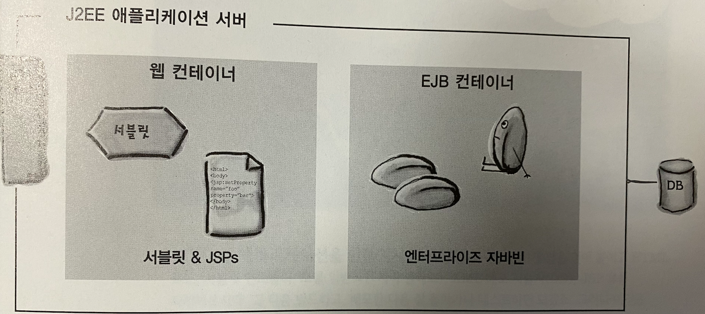

# 지옥 스터디 - 02 웹애플리케이션 아키텍쳐

## 컨테이너가 주는 혜택
- 통신 지원
  - 서블릿과 웹서버가 통신할 수 있는 손쉬운 환경을 제공
  - ServerSocket 을 만들고 리스닝 하고 스트림을 생성하는 등 일련의 과정을 대신 처리해준다.
- 생명주기 관리
  - 서블릿의 생성 및 제거를 관리한다
  - 서블릿을 인스턴스화 하고 초기화 메소드를 호출 / 요청에 따른 적절한 메소드 호출 등을 대신 처리해준다.
- 멀티스레딩 지원
  - 요청당 새로운 스레드를 생성하고 이를 이용해 적절한 메소드를 호출해준다.
  - 다중 요청에 대한 스레드 처리 믗 운영을 대신 처리해준다.
- 선언적인 보안관리
  - 배포서술자 (DD, XML) 을 이용해 보완과 관련된 처리를 자바 코드와 분리할 수 있다.
- JSP 지원

## 컨테이너가 요청을 처리하는 방식
1. 사용자가 서블릿과 연결된 링크에 요청
2. 컨테이너는 요청이 서블릿으로 요청이 들어온것을 감지하고 HttpServletRequest / HttpServletResponse 객체를 생성
3. URL 를 분석하여 어떤 서블릿에 대한 요청인지 알아내고 해당 서블릿 스레드를 생성하여 Request / Response 객체를 넘긴다.
4. 서블릿의 service() 메소드를 호출하고 HTTP Method 에 따라 doGet / doPost 중 호출하게 된다.
5. GET 요청이라면 doGet 메소드를 호출하고 동적인 페이지를 생성한 뒤 Response 객체에 실어 보낸다.
6. 스레드 작업이 종료된 이후 컨테이너는 Response 객체를 HTTP Response 로 전환하여 클라이언트로 보내고 Request / Response 객체를 소멸시킨다.

`HttpServlet.service()`

```java
protected void service(HttpServletRequest req, HttpServletResponse resp) throws ServletException, IOException {
    String method = req.getMethod();
    long lastModified;
    if (method.equals("GET")) {
        lastModified = this.getLastModified(req);
        if (lastModified == -1L) {
            this.doGet(req, resp);
        } else {
            long ifModifiedSince;
            try {
                ifModifiedSince = req.getDateHeader("If-Modified-Since");
            } catch (IllegalArgumentException var9) {
                ifModifiedSince = -1L;
            }

            if (ifModifiedSince < lastModified / 1000L * 1000L) {
                this.maybeSetLastModified(resp, lastModified);
                this.doGet(req, resp);
            } else {
                resp.setStatus(304);
            }
        }
    } else if (method.equals("HEAD")) {
        lastModified = this.getLastModified(req);
        this.maybeSetLastModified(resp, lastModified);
        this.doHead(req, resp);
    } else if (method.equals("POST")) {
        this.doPost(req, resp);
    } else if (method.equals("PUT")) {
        this.doPut(req, resp);
    } else if (method.equals("DELETE")) {
        this.doDelete(req, resp);
    } else if (method.equals("OPTIONS")) {
        this.doOptions(req, resp);
    } else if (method.equals("TRACE")) {
        this.doTrace(req, resp);
    } else {
        String errMsg = lStrings.getString("http.method_not_implemented");
        Object[] errArgs = new Object[]{method};
        errMsg = MessageFormat.format(errMsg, errArgs);
        resp.sendError(501, errMsg);
    }

}
```

## Servlet
- Servlet 을 구현할때 99.9% 는 **HttpServlet** 을 상속받는 형태로 구현한다.
    - 다음과 같이 기본적인 구현을 제공하고, 하위 클래스에서 doGet / doPost 와 같은 메소드를 override 하여 구현하는 형태

```java
public abstract class HttpServlet extends GenericServlet {
    private static final long serialVersionUID = 1L;
    private static final String METHOD_DELETE = "DELETE";
    private static final String METHOD_HEAD = "HEAD";
    private static final String METHOD_GET = "GET";
    private static final String METHOD_OPTIONS = "OPTIONS";
    private static final String METHOD_POST = "POST";
    private static final String METHOD_PUT = "PUT";
    private static final String METHOD_TRACE = "TRACE";
    private static final String HEADER_IFMODSINCE = "If-Modified-Since";
    private static final String HEADER_LASTMOD = "Last-Modified";
    private static final String LSTRING_FILE = "javax.servlet.http.LocalStrings";
    private static final ResourceBundle lStrings = ResourceBundle.getBundle("javax.servlet.http.LocalStrings");

    public HttpServlet() {
    }

    protected void doGet(HttpServletRequest req, HttpServletResponse resp) throws ServletException, IOException {
        String msg = lStrings.getString("http.method_get_not_supported");
        this.sendMethodNotAllowed(req, resp, msg);
    }

    protected long getLastModified(HttpServletRequest req) {
        return -1L;
    }

    protected void doHead(HttpServletRequest req, HttpServletResponse resp) throws ServletException, IOException {
        if (DispatcherType.INCLUDE.equals(req.getDispatcherType())) {
            this.doGet(req, resp);
        } else {
            NoBodyResponse response = new NoBodyResponse(resp);
            this.doGet(req, response);
            response.setContentLength();
        }

    }

    protected void doPost(HttpServletRequest req, HttpServletResponse resp) throws ServletException, IOException {
        String msg = lStrings.getString("http.method_post_not_supported");
        this.sendMethodNotAllowed(req, resp, msg);
    }

    protected void doPut(HttpServletRequest req, HttpServletResponse resp) throws ServletException, IOException {
        String msg = lStrings.getString("http.method_put_not_supported");
        this.sendMethodNotAllowed(req, resp, msg);
    }

    protected void doDelete(HttpServletRequest req, HttpServletResponse resp) throws ServletException, IOException {
        String msg = lStrings.getString("http.method_delete_not_supported");
        this.sendMethodNotAllowed(req, resp, msg);
    }
}
```

- 서블릿 은 **세가지 형태의 이름** 을 가질 수 있다.
  - 클라이언트에게 알려진 (public) 한 URL 이름
  - 배포자가 만든 내부적인 이름
  - 실제 파일 명

> 서블릿 이름을 다른 이름으로 매핑 할 수 있는데, 이는 애플리케이션의 유연성 과 보안성이 좋아진다.

`DD 에서 서블릿 매핑`

```xml

<web-app ...>
    <serlvet>
        <servlet-name>MyServlet</servlet-name>
        <servlet-class>foo.MyServlet</servlet-class>
    </serlvet>

    <servlet-mapping>
        <servlet-mapping>MyServlet</servlet-mapping>
        <url-pattern>/MyServlet</url-pattern>
    </servlet-mapping>
</web-app>
```

`DD (배포서술자) 로 가능한 일`
- 서블릿 매핑 외에도 다양한 역할이 가능하다.
- 보안 역할 (Security Role) 설정
- 에러 페이지 지정
- 초기화 구성 및 관련 정보 세팅 등..
- EJB 선언 및 접근에 관련된 내용도 DD 에서 이루어 진다.

## 결혼 정보 사이트 만들기
- 기능단위로 분리해서 개발 / 화면단은 JSP 로 포워딩
    - MVC 패턴 적용
```java
public class DatingServlet extends HttpServlet {

	@Override
	protected void doGet(HttpServletRequest req, HttpServletResponse resp) throws ServletException, IOException {
		// Biz Logic...
        
        // jsp forwarding...
	}
}
```

## MVC 패턴
- MVC (Model View Controller)
  - Model
    - 비즈니스 로직이 존재
    - 데이터베이스와 통신하는 영역
  - View
    - 프레젠테이션에 대한 책임을 가짐
  - Controller
    - Request 로 부터 정보를 가져와 모델에게 어떤 작업을 해야할지 판단 및 요청
- MVC 의 핵심은 비즈니스 로직과 프레젠테이션 로직의 분리

> 서블릿은 컨트롤러의 역할을, 비즈니스 로직은 새롭게 만든 모델을, JSP 는 뷰의 역할을 수행해야 한다.

## J2EE



- J2EE (Java 2 Enterprise Edition) 는 스펙들을 위한 정의, 슈퍼 스펙이라 할 수 있다.
- J2EE 는 서블릿 2.4 와 JSP 2.0 과 같은 스펙을 포함하고 있다.
  - 서블릿 과 JSP 스펙은 모두 웹 컨테이너를 위한 것
- J2EE1.4 에는 EJB 2.1 도 포함되어 있다.
- J2EE 에 완벽하게 부합되는 서버는 웹 컨테이너와 EJB 컨테이너 모두 포함되어야 한다
  - JNDI, JMS 구현도 포함
- 대표적으로 톰캣은 J2EE 의 웹 컨테이너만 구현것이지 J2EE 애플리케이션 서버는 아니라는 것에 유의
  - EJB 컨테이너가 존재하지 않음