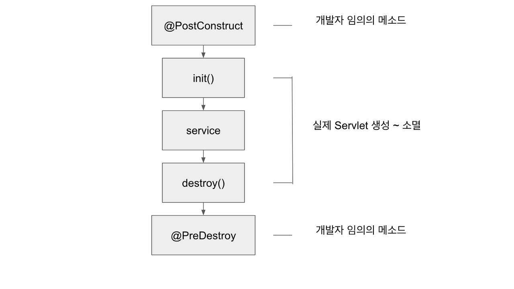

# 지옥 스터디 - 02 웹애플리케이션 아키텍쳐

## 서블릿 라이프 사이클



- constructor()
  - 서블릿 인스턴스가 **생성** 된 상태
  - 인스턴스가 생성만 되었을뿐 서블릿으로의 역할을 할 수 있는 상태는 아님
- @PostConstruct
  - 서블릿이 생성 (초기화) 되기 전 준비하는 단계
  - 애노테이션을 선언해서 별도의 메소드를 정의해야한다.
- init()
  - 서블릿 인스턴스가 생성된 후 서블릿을 **초기화**
  - 초기화 된 이후에서야 서블릿으로써의 역할을 수행할 수 있다.
    - 인스턴스가 생성된 직후에는 서블릿이라 할 수 없음
  - 사용자 요청을 처리하기전 사용할 리소스에 대한 초기화 작업을 수행하기 위함
    - ServletConfig 인스턴스를 컨테이너가 주입해준다.
    - ServletContext 에 접근에 설정 정보를 읽어오는 등의 작업이 가능해진다.
- service()
  - 사용자 요청 처리시 최초에 호출되며 HTTP Method 에 따라 doGet / doPost 등으로 처리를 위임한다.
  - 일반적으로 Override 할 일은 드물다.

```java
public void service(ServletRequest req, ServletResponse res) throws ServletException, IOException {
    HttpServletRequest request;
    HttpServletResponse response;
    try {
        request = (HttpServletRequest)req;
        response = (HttpServletResponse)res;
    } catch (ClassCastException var6) {
        throw new ServletException(lStrings.getString("http.non_http"));
    }
    
    this.service(request, response);
}

protected void service(HttpServletRequest req, HttpServletResponse resp) throws ServletException, IOException {
    String method = req.getMethod();
    long lastModified;
    if (method.equals("GET")) {
        lastModified = this.getLastModified(req);
        if (lastModified == -1L) {
            this.doGet(req, resp);
        } else {
            long ifModifiedSince;
            try {
                ifModifiedSince = req.getDateHeader("If-Modified-Since");
            } catch (IllegalArgumentException var9) {
                ifModifiedSince = -1L;
            }

            if (ifModifiedSince < lastModified / 1000L * 1000L) {
                this.maybeSetLastModified(resp, lastModified);
                this.doGet(req, resp);
            } else {
                resp.setStatus(304);
            }
        }
    } else if (method.equals("HEAD")) {
        lastModified = this.getLastModified(req);
        this.maybeSetLastModified(resp, lastModified);
        this.doHead(req, resp);
    } else if (method.equals("POST")) {
        this.doPost(req, resp);
    } else if (method.equals("PUT")) {
        this.doPut(req, resp);
    } else if (method.equals("DELETE")) {
        this.doDelete(req, resp);
    } else if (method.equals("OPTIONS")) {
        this.doOptions(req, resp);
    } else if (method.equals("TRACE")) {
        this.doTrace(req, resp);
    } else {
        String errMsg = lStrings.getString("http.method_not_implemented");
        Object[] errArgs = new Object[]{method};
        errMsg = MessageFormat.format(errMsg, errArgs);
        resp.sendError(501, errMsg);
    }

}
```
- 주의할 점은 HttpServlet 의 service 메소드와 GenericServlet (Servlet) 의 service 메소드가 다르다.
    - GenericServlet 에 정의된 service 메소드는 HttpServlet 에 정의된 service 를 호출하는 구조
    - Servlet 은 Http 요청 처리시 주로 사용할텐데 왜 GenericServlet 이 존재할까 ?
      - 본래 목적은 Http 외 (SMTP 라던가..) 요청도 핸들링 하기 위해 추상 계층을 두었으나 대부분 Http 요청 처리 목적으로 사용하게됨
- destroy()
    - 컨테이너로부터 서블릿 소멸 요청이 있을때 호출된다
    - 서블릿이 소멸되면서 정리되어야할 작업이 존재할때 사용한다.
- @PreDestroy
    - 서블릿 소멸 후 정리하는 단계
    - 애노테이션을 선언해서 별도의 메소드를 정의해야한다.

`ServletConfig`
- 서블릿당 ServletConfig 객체 하나씩 1:1 대응
- 서블릿 배포시 설정된 정보를 서블릿으로 주입하기 위함
  - 데이터베이스 관련 정보 등
- ServletContext 에 접근하기 위해 사용한다.
- 각 파라미터는 DD 를 통해서 설정 가능

`ServletContext`
- 웹 애플리케이션 하나당 ServletContext 객체 하나씩 1:1 대응 (일반적인 경우)
  - 경우에 따라 Hierarchy 구조로 구성가능
- 웹 애플리케이션의 파라미터 정보를 읽기 위해 사용한다.

## HTTP Method
- GET : 리소스 요청
- POST : 리소스 생성 (또는 특정 프로세스 시작의 의미)
- PUT : 리소스 수정 (전체)
- PATCH : 리소스 수정 (부분)
- DELETE : 리소스 삭제
- HEAD : 헤더 정보 요청 (GET 과 동일하지만 헤더정보만 가져온다)
- TRACE : 요청의 루프백 테스트 용도
- OPTIONS : 응답가능한 HTTP 메소드 확인 용도
- CONNECT : 터널링 목적

### Idempotent (멱등)
- 멱등성이란, 수학적 용어에서 유래한 것
- 연산을 여러번 적용하더라도 결과가 달라지지 않는 것을 의미한다.
- [RFC-2616](https://www.w3.org/Protocols/rfc2616/rfc2616-sec9.html)
- RESTAPI 에서 자주사용하는 GET, POST, PUT, DELETE 의 경우 예를 들면 POST 를 제외하고 모두 멱등성이 보장되어야 한다.
- 멱등성은 **요청의 효과** 를 보고 판단하게 된다.
- 멱등성이 유지되어야 하는 경우 같은 행위를 여러 번 반복하더라도 동일한 효과를 가져야 한다.
- GET, HEAD 와 같이 서버의 상태정보를 변경하지 않는 경우 **안전한 메소드** 라고 하며, 이는 멱등성과는 다른 의미이다.
- 멱등성을 지키는 메소드는 서버의 상태를 변경할 수도 있고, 변경하지 않을 수 있다.
- 하지만 요청의 결과가 에러가 나는 등 문제가 있지 않는한 요청에 대한 서버의 상태를 항상 동일해야 한다.

> 오류와 같은 상황이 발생하는 경우에는 **예외 상황이므로 멱등성 판별시 제외** 된다.

## HttpServletRequest
- ServletRequest 인터페이스를 상속받고 있고, HttpServletRequest 를 통해 주로 사용자의 요청정보 (Parameter/Body) 를 획득한다.

```java
public interface HttpServletRequest extends ServletRequest {
    String BASIC_AUTH = "BASIC";
    String FORM_AUTH = "FORM";
    String CLIENT_CERT_AUTH = "CLIENT_CERT";
    String DIGEST_AUTH = "DIGEST";

    String getAuthType();

    Cookie[] getCookies();

    long getDateHeader(String var1);

    String getHeader(String var1);

    Enumeration<String> getHeaders(String var1);

    Enumeration<String> getHeaderNames();

    int getIntHeader(String var1);

    default HttpServletMapping getHttpServletMapping() {
        return new HttpServletMapping() {
            public String getMatchValue() {
                return "";
            }

            public String getPattern() {
                return "";
            }

            public String getServletName() {
                return "";
            }

            public MappingMatch getMappingMatch() {
                return null;
            }
        };
    }

    String getMethod();

    String getPathInfo();

    String getPathTranslated();

    default PushBuilder newPushBuilder() {
        return null;
    }

    String getContextPath();

    String getQueryString();

    String getRemoteUser();

    boolean isUserInRole(String var1);

    Principal getUserPrincipal();

    String getRequestedSessionId();

    String getRequestURI();

    StringBuffer getRequestURL();

    String getServletPath();

    HttpSession getSession(boolean var1);

    HttpSession getSession();

    String changeSessionId();

    boolean isRequestedSessionIdValid();

    boolean isRequestedSessionIdFromCookie();

    boolean isRequestedSessionIdFromURL();

    /** @deprecated */
    @Deprecated
    boolean isRequestedSessionIdFromUrl();

    boolean authenticate(HttpServletResponse var1) throws IOException, ServletException;

    void login(String var1, String var2) throws ServletException;

    void logout() throws ServletException;

    Collection<Part> getParts() throws IOException, ServletException;

    Part getPart(String var1) throws IOException, ServletException;

    <T extends HttpUpgradeHandler> T upgrade(Class<T> var1) throws IOException, ServletException;

    default Map<String, String> getTrailerFields() {
        return Collections.emptyMap();
    }

    default boolean isTrailerFieldsReady() {
        return false;
    }
}
```

`요청 정보외에 자주사용하는 메소드`

```text
// 헤더정보
request.getHeader("User-Agent");
// 쿠키정보
request.getCookies();
// 세션
request.getSession();
// 요청메소드
request.getMethod();
// 입력스트림
request.getInputStream();
```

## HttpServletResponse
- ServletResponse 인터페이스를 상속받고 있고, HttpServletResponse 를 통해 주로 사용자에게 보낼 응답정보 를 세팅한다.
    - 헤더 정보를 세팅하거나, stream 을 통해 응답을 보낼때 사용한다.
```java
public interface HttpServletResponse extends ServletResponse {
    int SC_CONTINUE = 100;
    int SC_SWITCHING_PROTOCOLS = 101;
    int SC_OK = 200;
    int SC_CREATED = 201;
    int SC_ACCEPTED = 202;
    int SC_NON_AUTHORITATIVE_INFORMATION = 203;
    int SC_NO_CONTENT = 204;
    int SC_RESET_CONTENT = 205;
    int SC_PARTIAL_CONTENT = 206;
    int SC_MULTIPLE_CHOICES = 300;
    int SC_MOVED_PERMANENTLY = 301;
    int SC_MOVED_TEMPORARILY = 302;
    int SC_FOUND = 302;
    int SC_SEE_OTHER = 303;
    int SC_NOT_MODIFIED = 304;
    int SC_USE_PROXY = 305;
    int SC_TEMPORARY_REDIRECT = 307;
    int SC_BAD_REQUEST = 400;
    int SC_UNAUTHORIZED = 401;
    int SC_PAYMENT_REQUIRED = 402;
    int SC_FORBIDDEN = 403;
    int SC_NOT_FOUND = 404;
    int SC_METHOD_NOT_ALLOWED = 405;
    int SC_NOT_ACCEPTABLE = 406;
    int SC_PROXY_AUTHENTICATION_REQUIRED = 407;
    int SC_REQUEST_TIMEOUT = 408;
    int SC_CONFLICT = 409;
    int SC_GONE = 410;
    int SC_LENGTH_REQUIRED = 411;
    int SC_PRECONDITION_FAILED = 412;
    int SC_REQUEST_ENTITY_TOO_LARGE = 413;
    int SC_REQUEST_URI_TOO_LONG = 414;
    int SC_UNSUPPORTED_MEDIA_TYPE = 415;
    int SC_REQUESTED_RANGE_NOT_SATISFIABLE = 416;
    int SC_EXPECTATION_FAILED = 417;
    int SC_INTERNAL_SERVER_ERROR = 500;
    int SC_NOT_IMPLEMENTED = 501;
    int SC_BAD_GATEWAY = 502;
    int SC_SERVICE_UNAVAILABLE = 503;
    int SC_GATEWAY_TIMEOUT = 504;
    int SC_HTTP_VERSION_NOT_SUPPORTED = 505;

    void addCookie(Cookie var1);

    boolean containsHeader(String var1);

    String encodeURL(String var1);

    String encodeRedirectURL(String var1);

    /** @deprecated */
    @Deprecated
    String encodeUrl(String var1);

    /** @deprecated */
    @Deprecated
    String encodeRedirectUrl(String var1);

    void sendError(int var1, String var2) throws IOException;

    void sendError(int var1) throws IOException;

    void sendRedirect(String var1) throws IOException;

    void setDateHeader(String var1, long var2);

    void addDateHeader(String var1, long var2);

    void setHeader(String var1, String var2);

    void addHeader(String var1, String var2);

    void setIntHeader(String var1, int var2);

    void addIntHeader(String var1, int var2);

    void setStatus(int var1);

    /** @deprecated */
    @Deprecated
    void setStatus(int var1, String var2);

    int getStatus();

    String getHeader(String var1);

    Collection<String> getHeaders(String var1);

    Collection<String> getHeaderNames();

    default void setTrailerFields(Supplier<Map<String, String>> supplier) {
    }

    default Supplier<Map<String, String>> getTrailerFields() {
        return null;
    }
}
```

## 리다이렉트와 디스패치
- 요청을 받은 서블릿에서 해당 요청을 처리할 수 없는 경우가 있을 수 있다.
- 이런 상황에서 사용하는것이 리다이렉트 와 디스패치 이다.
- **리다이렉트** 는 요청을 처리할 수 없으니 다른곳으로 요청하라고 **클라이언트** 에게 지시하는 것
- **디스패치** 는 마찬가지로 요청을 처리할 수 없으나 서버측에서 다른곳으로 처리를 위임하는 것

> 리다이렉트의 경우에는 요청 처리자가 변경된것을 알 수 있지만 디스패치의 경우 알 수 없다.


## 참고
- https://www.w3.org/Protocols/rfc2616/rfc2616-sec9.html
- https://velog.io/@dion/HTTP-%EB%A9%94%EC%86%8C%EB%93%9C%EC%9D%98-%EB%A9%B1%EB%93%B1%EC%84%B1-%EA%B7%B8%EA%B2%8C-%EB%AD%94%EB%8D%B0