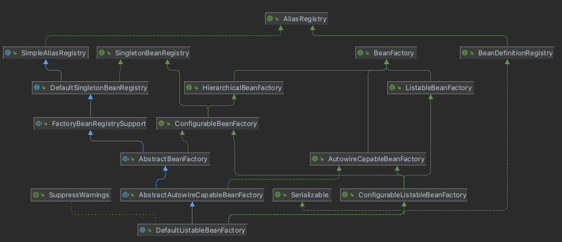

# 지옥 스터디 - 01 오브젝트와 의존관계

## 서론

- 스프링은 **자바를 기반** 으로 한 기술
- 스프링이 자바에서 가장 중요하게 가치를 둔 것은 **객체지향 언어** 라는 점이다.
- 객체지향 기술의 기본으로 돌아가자는 것이 스프링의 핵심철학
- 스프링을 이해하려면 **오브젝트** 에 깊은 관심을 가져야한다.
    - 이는 오브젝트 설계로 이어진다.
- 스프링은 객체지향 설계와 구현에 대한 특정 모델이나 기법을 강요하지 않지만 어떻게 효과적으로 설계할지 명쾌한 기준을 마련해준다.

> 오늘날 스프링은 사실상 자바 표준이라고도 불린다.

## 초난감 DAO

- 사용자 정보를 JDBC API 를 사용해 DB 에 저장 및 조회가능한 DAO 만들어보기

`DAO`

- **DAO (Data Access Object)** 는 DB 를 사용해 데이터를 조회/조작 하는 기능을 전담하도록 만든 오브젝트이다.

`DAO 와 Repository`

- 이를 과연 명쾌하게 설명할 수 있을까 ?..
- **Repository** 는 **DDD (Domain Driven Design)** 의 기본 구성중 하나로 **도메인 레이어** 에 속한다.
- 이는 객체지향적인 **컬렉션 관리 인터페이스** 를 제공하기 위해 사용된다.
    - 컬렉션 관리를 위한 인터페이스가 핵심이다.
- Repository 는 도메인 모델의 일부이며, 유비쿼터스랭기쥐의 한 요소이다.
- 변경에 대한 불변식을 유지하기 위해 하나의 단위로 취급되면서 변경의 빈도가 비슷한 단위 (쉽게 생각하면 라이프 사이클이 동일한 단위) 를 객체의 집합인 **Aggregate**
  으로 묶고, Aggregate 당 하나의 Repository 를 사용한다.
    - ex) Order 와 OrderItem 이 같은 라이프사이클을 지니기 때문에 OrderRepository 를 이용해 Order 와 OrderItem 을
      OrderRepository 를 통해 관리한다.
- Repository 자체는, 퍼시스턴스 기술에 대한 어떤 가정도 하지 않으며, Repository 를 사용할 때에는 모든 Order / OrderItem 객체가 메모리에
  로드되어 있다고 가정하고 이에 접근하기 위해 Repository 를 사용한다.
- Repository 는 도메인 레이어에 속하지만, 내부에서는 Aggregate 을 관리하기 위해 퍼시스턴스 매커니즘을 사용해야한다.
- 하지만 Repository 에서 **직접 퍼시스턴스 기술이 포함된다면 Repository 를 사용하는 도메인 객체 또한 퍼시스턴스 기술에 의존** 하게 된다.
- 이를 위해 Repository 는, **인터페이스와 구현부로 분리한 후 인터페이스는 도메인 레이어에, 구현부는 퍼시스턴스 레이어에 속하게 한다.**
- 이처럼 DIP (Dependency Inversion Principle) 에 기반해 인터페이스와 구현부의 계층을 분리하는 패턴을 **Separated Interface** 라고
  한다.
- DAO 와 Repository 모두 퍼시스턴스 로직에 대한 객체지향 인터페이스를 제공하고 **도메인 로직과 퍼시스턴스 로직을 분리하는 것이 목적** 이다.
    - 하지만 그렇다고 DAO 와 Repository 를 동일한 패턴으로 취급해서는 안된다.
- **DAO (Data Access Object)** 는 본래 퍼시스턴스 로직인 **EntityBean 을 대체하기 위해 만들어진 개념** 이고, **퍼시스턴스 레이어** 에
  속한다.
- DAO 가 Repository 와 동일하게 객체지향 인터페이스를 제공하려는 의도를 가지고 있지만, **DAO 는 하부 퍼시스턴스 기술이 데이터베이스라는 사실을 숨기지
  않는다.**
- DAO 는 데이터베이스의 CRUD 쿼리가 1:1 매칭되는 오퍼레이션을 제공한다.
    - Repository 가 제공하는 오퍼레이션 보다 더 세밀하다.
- DAO 는 CoreJ2EE Patterns 에서 언급하는 것 처럼 DB 뿐 아니라 LDAP 이나 레거시 시스템과 같이 다양한 종류의 시스템과 상호작용하기 위한 **Gateway
  역할** 을 수행하지만, Repository 는 객체 컬렉션 처리에대한 책임만 가지고 있다.
- DAO 는 대부분의 경우 **Table Data Gateway Pattern** 에 따라 테이블 별로 하나의 DAO 가 존재한다.
- DAO 는 **Transaction Script Pattern** 과 함께 사용되지만, Repository 는 **Domain Model Pattern** 과 함께 사용된다.

> 이 둘의 큰 차이를 정리하면, Repository 는 도메인 레이어에 속하며, Domain Model Pattern 과 함께 사용되고 AggregateRoot 를 식별하는 과정에서 도출된다. <br/>
> DAO 는 퍼시스턴스 레이어에 속하며, Transaction Script Pattern 과 함께 사용되고, 테이블당 하나의 DAO 형태로 도출된다. <br/>
> Repository 는 객체를 관리하기 위한 컬렉션 인터페이스를 제공하는 것이 목적이고, DAO 는 외부와 통신을 위한 Gateway 역할을 수행하는 것이 목적이다. <br/>
> Repository 내부에 DAO 가 속할 수 있지만, DAO 가 Repository 를 포함 할 수는 없다. <br/>
> 한줄 요약하자면... Repository 는 추상화, 포괄적인 개념이고, DAO 는 좀 더 세부 기술에 종속되는 개념이다. (썩 만족스러운 요약은 아니다... ㅜ)

`User 객체`

- 사용자 정보를 저장하기 위한 객체이며, 오브젝트 자바빈 규약을 따르도록 설계한다.

```java
/**
 * Java Beans 규약을 따르는 User Object.
 * 최근에는 디폴트 생성자와 프로퍼티 (getter setter) 를 가진 POJO 객체를 JavaBeans 라고 표현한다.
 */
public class User {

    String id;
    String name;
    String password;

    public String getId() {
        return id;
    }

    public void setId(String id) {
        this.id = id;
    }

    public String getName() {
        return name;
    }

    public void setName(String name) {
        this.name = name;
    }

    public String getPassword() {
        return password;
    }

    public void setPassword(String password) {
        this.password = password;
    }
}
```

`Java Beans`

- 자바빈즈(JavaBeans)는 자바로 작성된 소프트웨어 컴포넌트이다.
- 자바빈즈의 사양은 썬 마이크로시스템즈에서 다음과 같이 정의되었다. "빌더 형식의 개발도구에서 가시적으로 조작이 가능하고 또한 재사용이 가능한 소프트웨어 컴포넌트이다."
- 많은 측면에서 유사성을 보임에도 불구하고 자바빈즈는 엔터프라이즈 자바빈즈(EJB)와 혼동하지 말아야 한다. EJB는 자바 플랫폼, 엔터프라이즈 에디션(Java EE)의 일부로서
  서버 계열의 컴포넌트이다.
- 최근에는 디폴트 생성자와 프로퍼티를 가진 POJO 객체를 JavaBeans 라고 표현한다.

`Java Beans 의 관례`

- 클래스는 직렬화 되어야 한다.
- 클래스는 기본 생성자를 가지고 있어야 한다.
- 클래스의 속성들은 get, set 또는 표준 명명법을 따르는 메소드를 사용해 접근할 수 있어야 한다.
- 클래스는 필요한 이벤트를 처리가능한 메소드들을 포함하고 있어야 한다.

```java
class User implements Serializable {

    private String id;
    private String name;
    private String password;

    public String getId() {
        return id;
    }

    public void setId(String id) {
        this.id = id;
    }

    public String getName() {
        return name;
    }

    public void setName(String name) {
        this.name = name;
    }

    public String getPassword() {
        return password;
    }

    public void setPassword(String password) {
        this.password = password;
    }
}
```

`UserTable.sql`

- 사용자의 아이디, 이름, 패스워드를 가지는 간단한 users 테이블

```java
create table users(
    id varchar(10)primary key,
    name varchar(20)not null,
    password varchar(10)not null
    );
```

`UserDao`

- UserDAO 는 사용자 정보를 DB 에 넣고 관리하는 클래스이다.
- 우선 새로운 사용자를 등록하고, 아이디를 가지고 사용자 정보를 읽어오는 기능을 만들어본다.

```java
public class UserDao {

    public void add(User user) throws ClassNotFoundException, SQLException {
        Class.forName("com.mysql.jdbc.Driver");
        Connection conn = DriverManager.getConnection("jdbc:mysql://localhost/spring_batch",
            "root", "password");

        PreparedStatement ps = conn.prepareStatement(
            "insert into users (id, name, password) values (?, ?, ?)");
        ps.setString(1, user.getId());
        ps.setString(2, user.getName());
        ps.setString(3, user.getPassword());

        ps.executeUpdate();

        ps.close();
        conn.close();
    }

    public User get(String id) throws ClassNotFoundException, SQLException {
        Class.forName("com.mysql.jdbc.Driver");
        Connection conn = DriverManager.getConnection("jdbc:mysql://localhost/spring_batch",
            "root", "password");

        PreparedStatement ps = conn.prepareStatement(
            "select * from users where id = ?");
        ps.setString(1, id);

        ResultSet rs = ps.executeQuery();
        rs.next();

        User user = new User();
        user.setId(rs.getString("id"));
        user.setName(rs.getString("name"));
        user.setPassword(rs.getString("password"));

        rs.close();
        ps.close();
        conn.close();
        return user;
    }
}
```

`JDBC API 를 사용하는 일반적인 작업 순서`

1. DB 연결을 위한 Connection 을 얻어온다.
2. SQL 을 담은 Statement or PreparedStatement 를 생성한다.
3. 생성된 Statement 를 실행한다.
4. 조회 SQL 이라면 실행 결과를 ResultSet 으로 받아 정보를 저장할 오브젝트에 매핑한다.
5. 작업중 생성된 리소스는 반드시 정리해 주어야한다. (Connection, Statement 등..)
6. JDBC API 가 던지는 예외를 직접 처리하거나, throws 로 처리한다.

`Statement, PreparedStatement`

- Statement, PreparedStatement 의 차이점은 **Prepared (준비된)** 이라는 이름에서도 알 수 있듯이 캐싱 여부의 차이이다.
- 기본적으로 Statement 를 매번 쿼리를 수행할때 마다 3단계를 거쳐 수행한다.

1. 쿼리 분석
2. 컴파일
3. 실행

- 위 단계를 거치는데 PreparedStatement 를 사용하면 매 실행마다 이를 캐싱해서 쿼리 실행시간을 줄여준다.
- PreparedStatement 는 ClientSide 에서 수행할 것인지, ServerSide 에서 수행할 것인지 설정이 가능하다.

`ClientSide/ServerSide`

- ClientSide PreparedStatement
    - 초기 MySQL 서버가 PreparedStatement 를 지원하지 못하던 시절 Client JDBC Driver 에서 PreparedStatement 를 흉내낼 수
      있도록(표준 준수) ClientSide PreparedStatement 를 지원하던 방식
- ServerSide PreparedStatement
    - MySQL 서버에서 PreparedStatement 를 지원하게 되면서 실제 ClientSide 에서 PreparedStatement 가 아닌 타 RDBMS 와 동일한
      방식의 PreparedStatement 기능을 지원하기 시작

`PrepareStatement deep dive`

- 서버사이드에서 PreparedStatement 를 사용할 것인지 / 클라이언트에서 PreparedStatement 를 사용할 것인지 판단..
- dataSource 설정시 **useServerPrepStmts** property 를 이용해 지정한다.
    - 서버사이드로 지정할 경우 버그의 영향을 받을 수 있다. (**MySQL 5.7.18** 버전 기준 fix 됨!!)
    - MySQL 5.7.17 이하 버전 / Server-side PreparedStatement 를 사용하고, Statement 기반 Replication 설정일때,
      Datetime 컬럼에 밀리초 저장시 발생한다.
    - 조금 치명적인 버그다..
    - https://bugs.mysql.com/bug.php?id=74550

- [MySQL 에서 권장하는 HikariCP 옵션](https://github.com/brettwooldridge/HikariCP/wiki/MySQL-Configuration)

```java
class ConnectionImpl extends ConnectionPropertiesImpl implements MySQLConnection {

    // ....
    public java.sql.PreparedStatement prepareStatement(String sql, int resultSetType,
        int resultSetConcurrency) throws SQLException {
        synchronized (getConnectionMutex()) {
            checkClosed();

            //
            // FIXME: Create warnings if can't create results of the given type or concurrency
            //
            PreparedStatement pStmt = null;

            boolean canServerPrepare = true;

            String nativeSql = getProcessEscapeCodesForPrepStmts() ? nativeSQL(sql) : sql;

            if (this.useServerPreparedStmts && getEmulateUnsupportedPstmts()) {
                canServerPrepare = canHandleAsServerPreparedStatement(nativeSql);
            }

            if (this.useServerPreparedStmts && canServerPrepare) {
                if (this.getCachePreparedStatements()) {
                    synchronized (this.serverSideStatementCache) {
                        pStmt = this.serverSideStatementCache.remove(
                            new CompoundCacheKey(this.database, sql));

                        if (pStmt != null) {
                            ((com.mysql.jdbc.ServerPreparedStatement) pStmt).setClosed(false);
                            pStmt.clearParameters();
                        }

                        if (pStmt == null) {
                            try {
                                pStmt = ServerPreparedStatement.getInstance(getMultiHostSafeProxy(),
                                    nativeSql, this.database, resultSetType,
                                    resultSetConcurrency);
                                if (sql.length() < getPreparedStatementCacheSqlLimit()) {
                                    ((com.mysql.jdbc.ServerPreparedStatement) pStmt).isCached = true;
                                }

                                pStmt.setResultSetType(resultSetType);
                                pStmt.setResultSetConcurrency(resultSetConcurrency);
                            } catch (SQLException sqlEx) {
                                // Punt, if necessary
                                if (getEmulateUnsupportedPstmts()) {
                                    pStmt = (PreparedStatement) clientPrepareStatement(nativeSql,
                                        resultSetType, resultSetConcurrency, false);

                                    if (sql.length() < getPreparedStatementCacheSqlLimit()) {
                                        this.serverSideStatementCheckCache.put(sql, Boolean.FALSE);
                                    }
                                } else {
                                    throw sqlEx;
                                }
                            }
                        }
                    }
                } else {
                    try {
                        pStmt = ServerPreparedStatement.getInstance(getMultiHostSafeProxy(),
                            nativeSql, this.database, resultSetType, resultSetConcurrency);

                        pStmt.setResultSetType(resultSetType);
                        pStmt.setResultSetConcurrency(resultSetConcurrency);
                    } catch (SQLException sqlEx) {
                        // Punt, if necessary
                        if (getEmulateUnsupportedPstmts()) {
                            pStmt = (PreparedStatement) clientPrepareStatement(nativeSql,
                                resultSetType, resultSetConcurrency, false);
                        } else {
                            throw sqlEx;
                        }
                    }
                }
            } else {
                pStmt = (PreparedStatement) clientPrepareStatement(nativeSql, resultSetType,
                    resultSetConcurrency, false);
            }

            return pStmt;
        }
    }

    public java.sql.PreparedStatement clientPrepareStatement(String sql, int resultSetType,
        int resultSetConcurrency, boolean processEscapeCodesIfNeeded)
        throws SQLException {
        checkClosed();

        String nativeSql =
            processEscapeCodesIfNeeded && getProcessEscapeCodesForPrepStmts() ? nativeSQL(sql)
                : sql;

        PreparedStatement pStmt = null;

        if (getCachePreparedStatements()) {
            PreparedStatement.ParseInfo pStmtInfo = this.cachedPreparedStatementParams.get(
                nativeSql);

            if (pStmtInfo == null) {
                pStmt = com.mysql.jdbc.PreparedStatement.getInstance(getMultiHostSafeProxy(),
                    nativeSql, this.database);

                this.cachedPreparedStatementParams.put(nativeSql, pStmt.getParseInfo());
            } else {
                pStmt = com.mysql.jdbc.PreparedStatement.getInstance(getMultiHostSafeProxy(),
                    nativeSql, this.database, pStmtInfo);
            }
        } else {
            pStmt = com.mysql.jdbc.PreparedStatement.getInstance(getMultiHostSafeProxy(), nativeSql,
                this.database);
        }

        pStmt.setResultSetType(resultSetType);
        pStmt.setResultSetConcurrency(resultSetConcurrency);

        return pStmt;
    }
}
```

`UserDAO 테스트`

- 코드의 기능을 검증하기 위한 가장 간단한 방법은 **오브젝트 스스로 자신을 검증** 하는것
- main 메소드를 이용해 셀프 테스트를 만들어보자.

```java
public static void main(String[]args)throws SQLException,ClassNotFoundException{
    UserDao dao=new UserDao();

    User user=new User();
    user.setId("ncucu");
    user.setName("엔꾸꾸");
    user.setPassword("패스워드");

    dao.add(user);

    System.out.println(user.getId()+"등록 성공");

    User findUser=dao.get(user.getId());
    System.out.println(findUser.getName());
    }
```

## DAO 의 분리

`관심사의 분리`

- 객체지향의 세계에선 모든 것이 변한다.
    - 이는 단순 변수나 필드값이 아닌 설계와 구현 코드가 변한다는 의미
- 사용자의 비즈니스와 요구사항은 끊임없이 변한다.
- 개발자가 객체 설계시 가장 염두할 것은 **미래의 변화 에 대비** 가 되어야한다.
    - 가장 중요한 것은 변화에 어떻게 대비할 것인가 ?
    - **변화의 폭을 최소한으로 줄이는 것**
- **모든 변경과 발전은 한 번에 한 가지 관심사항에 집중해서 일어난다.**
    - 문제는 이에 따른 작업은 한 곳에 집중되어 있지 않은 경우가 많다.
- 이를 위해 필요한 것은 **관심이 한 군데에 집중되게 하는것** 이다.
    - 프로그래밍 기초 개념중 **관심사의 분리 (Separation of Concerns)**

`UserDao 의 관심사`

1. DB 연결을 위한 커넥션 맺기
2. 사용자 등록을 위한 DB 에 SQL 을 만들어 실행하기
3. 작업이 종료되면 리소스 정리하기

> 현재 가장 문제인 DB 연결을 위한 커넥션 맺기를 관심사 분리를 시도해보자.

`중복 코드 메소드 추출`

- 현재 구현의 가장 큰 문제 ? -> 모든 메서드마다 커넥션을 획득하기 위한 코드가 중복되어 있다.
- 가장 쉬운 STEP 부터 시작 -> 메소드로 추출하기

```java
public class UserDao {

    public void add(User user) throws ClassNotFoundException, SQLException {
        Connection conn = getConnection();

        PreparedStatement ps = conn.prepareStatement(
            "insert into users (id, name, password) values (?, ?, ?)");
        ps.setString(1, user.getId());
        ps.setString(2, user.getName());
        ps.setString(3, user.getPassword());

        ps.executeUpdate();

        ps.close();
        conn.close();
    }

    public User get(String id) throws ClassNotFoundException, SQLException {
        Connection conn = getConnection();

        PreparedStatement ps = conn.prepareStatement(
            "select * from users where id = ?");
        ps.setString(1, id);

        ResultSet rs = ps.executeQuery();
        rs.next();

        User user = new User();
        user.setId(rs.getString("id"));
        user.setName(rs.getString("name"));
        user.setPassword(rs.getString("password"));

        rs.close();
        ps.close();
        conn.close();
        return user;
    }

    private Connection getConnection() throws ClassNotFoundException, SQLException {
        Class.forName("com.mysql.jdbc.Driver");
        return DriverManager.getConnection("jdbc:mysql://localhost/spring_batch",
            "root", "password");
    }

    /**
     * Self-Test 용 Main 메소드
     */
    public static void main(String[] args) throws SQLException, ClassNotFoundException {
        UserDao dao = new UserDao();

        User user = new User();
        user.setId("ncucu");
        user.setName("엔꾸꾸");
        user.setPassword("패스워드");

        dao.add(user);

        System.out.println(user.getId() + "등록 성공");

        User findUser = dao.get(user.getId());
        System.out.println(findUser.getName());
    }
}
```

- 커넥션을 획득하기 위한 코드를 getConnection() 메소드로 추출했다.
- 이로 인해 커넥션을 획득하는 방법 (DB 변경, 접속정보 변경 등..) 이 변경되더라도 getConnection() 메소드 하나만 수정하면 된다.
- 이런 작업을 **리팩토링 (Refactoring)** 이라고 한다.
- 리팩토링은 객체지향 개발자라면 반드시 익혀야하는 기법 중 하나

`리팩토링 (Refactoring)`

- 리팩토링은 기존의 코드를 외부의 동작방식 변화없이 내부 구조를 변경해서 재구성하는 작업
- 코드 내부설계가 개선되어 이해하기 쉽고 변화에 효율적으로 대응할 수 있다.
- 리팩토링이 필요한 코드의 특징을 **나쁜 냄새, 냄새나는 코드** 라고 표현한다.
- 대표적으로 앞서 구현했던 초난감 DAO 의 중복코드가 있다.

`상속을 통한 확장`

- 만약 UserDao 가 업계에서 인기를 끌어 N 사와 D 사에서 구매한다는 요구사항이 생겼다고 가정해보자.
- 하지만 이를 납품하는 과정에서 문제가 발생한다.
    - N 사와 D 사가 서로 다른 DB를 사용하고 있고, DB 커넥션을 가져오는데 독립적인 방법을 사용한다.
    - UserDao 를 구매한 이후에도 DB 커넥션을 가져오는 방식이 종종 변경될 수 있다.
- UseDao 소스를 제공하지 않고도 고객 스스로 원하는 DB 커넥션 생성 방식을 적용할 순 없을까 ?


```java
public abstract class UserDao {

    // ...
    public abstract Connection getConnection() throws ClassNotFoundException, SQLException;
}

public class NUserDao extends UserDao {

    @Override
    public Connection getConnection() throws ClassNotFoundException, SQLException {
        Class.forName("com.mysql.jdbc.Driver");
        return DriverManager.getConnection("jdbc:mysql://localhost/spring_batch",
            "root", "password");
    }
}

public class DUserDao extends UserDao {

    @Override
    public Connection getConnection() throws ClassNotFoundException, SQLException {
        Class.forName("com.mysql.jdbc.Driver");
        return DriverManager.getConnection("jdbc:mysql://localhost/spring_batch",
            "root", "password");
    }
}
```

- DAO 의 핵심 기능인, **데이터를 어떻게 등록하고 가져올 것** 인가 에 대한 관심을 가진 UserDao
- **DB 연결 방법을 어떻게 할 것인가** 의 관심을 가진 NUserDao, DUserDao 가 클래스로서 분리되어 있다.
- 클래스 계층구조를 통해 **두 개의 관심이 독립적으로 분리** 되면서 변경 작업은 한층 용이해 졌다.
- 이제 UserDao 는 새로운 고객사가 생기더라도 UserDao 에는 변경 없이 확장이 가능해 진것이다.
- 이는 **템플릿 메소드 패턴 (Template Method Pattern)** / **팩토리 메소드 패턴 (Factory Method Pattern)** 을 사용해 개선한
  방식이다.

`템플릿 메소드 패턴 (Template Method Pattern)`

- 템플릿 메소드 패턴을 한 줄로 표현한다면, **상위 클래스의 템플릿 메소드에서 하위 클래스가 오버라이딩한 메소드를 호출하는 패턴** 이다.
- 상위 클래스에는 **공통 로직을 수행하는 템플릿 메소드** 와 **구현을 강제하는 추상 메소드**, 그리고 **선택적 오버라이딩이 가능한 훅 메소드가 존재** 한다.
- 강아지와 고양이가 있다고 가정하고, 각 동물들고 즐거운 시간을 보내는것을 코드로 표현하면 다음과 같을 것이다.

```java
public class Dog {

    public void play() {
        System.out.println("이리온");
        System.out.println("멍멍");
        System.out.println("살랑살랑 ~ ");
        System.out.println("잘했어 ");
    }
}

public class Cat {

    public void play() {
        System.out.println("이리온");
        System.out.println("야옹야옹");
        System.out.println("살랑살랑 ~ ");
        System.out.println("잘했어 ");
    }
}
```

- 강아지와 고양이 클래스를 살펴보면 중복되는 부분이 있다.
- "이리온" 하고 동물을 부르는 행동, 그리고 "살랑살랑 ~" 하고 동물이 행동하는 부분 마지막으로 "잘했어" 하고 칭찬하는 부분
- 여기에 템플릿 메소드패턴을 적용해보자면 다음과 같다.

```java
public abstract class Animal {

    public void play() {
        System.out.println("이리온");
        cry();
        doSomething();
        System.out.println("잘했어 ");
    }

    abstract void cry();

    void doSomething() {
        System.out.println("살랑살랑 ~ ");
    }
}

public class Dog extends Animal {

    @Override
    public void cry() {
        System.out.println("멍멍");
    }
}

public class Cat extends Animal {

    @Override
    public void cry() {
        System.out.println("야옹야옹");
    }
}
```

- 강아지와 고양이의 상위 클래스인 Animal 클래스를 정의하고 play 라는 **템플릿 메소드를 정의** 한다.
- 강아지와 고양이는 울음소리를 내는 방식이 다르기 때문에 구현을 강제하는 **cry 라는 추상메소드** 가 존재한다.
- 살랑살랑 ~ 이라는 동물의 행동은 선택적으로 오버라이딩 할 수 있는 **훅 메소드로 제공** 한다.

`팩토리 메소드 패턴 (Factory Method Pattern)`

- 팩토리는 공장을 의미한다. 객체지향에서의 팩토리는 **객체를 생성** 한다.
- 팩토리 메소드 패턴을 한줄로 표현하자면 **오버라이드한 메소드가 객체를 반환하는 패턴** 이라고 표현할 수 있다.
- 좀 더 쉽게 설명하면, **서브클래스에서 구체적인 오브젝트 생성 방법을 결정하는 패턴** 이라 할 수 있다.

```java
public abstract class Animal {

    // 추상 팩토리 메서드
    abstract AnimalToy getToy();
}

// 팩토리 메서드가 생성할 객체의 상위클래스
public abstract class AnimalToy {

    abstract void identify();
}

public class Dog extends Animal {

    // 팩토리 메서드 오버라이딩 
    @Override
    AnimalToy getToy() {
        return new DogToy();
    }
}

// 팩토리 메서드가 생성할 객체
public class DogToy extends AnimalToy {

    public void identify() {
        //구현부..
    }
}

public class Main {

    public static void main(String[] args) {
        // 팩토리 메서드 객체 생성
        Animal dog = new Dog();

        // 팩토리 메서드를 사용하여 객체 생성
        AnimalToy toy = dog.getToye();

        // 팩토리 메서드로 생성한 객체 사용
        toy.identify();
    }
}
```

> 이 두 디자인패턴은 장점도 있지만 **상속을 사용했다는 단점** 이 존재한다. <br/>
> 상속은 사용하기 편리하지만 많은 한계점이 존재한다. 다중 상속으로 인한 문제와 상속을 통한 상하위 클래스 간의 간계는 밀접하다는 문제..

`디자인 패턴`

- 디자인 패턴은 소프트웨어 설계시 특정 상황에서 자주만나는 문제들을 해결하기 위해 사용할 수 있는 재사용 가능한 솔루션
- 이는 **주로 객체지향 설계와 관련된 것** 이다.
- 대부분 객체지향 설계 원칙을 이용해 문제를 해결한다.
- 패턴의 설계 구조를 대부분 비슷한데, 이는 객체지향에서 확장성을 추구하는 방법이 두 가지 구조로 정리되기 때문이다.
- 하나는 클래스 상속이고, 하나는 오브젝트 합성이다.

> 템플릿 메소드 패턴은 스프링에서 애용되는 디자인 패턴이다. 반드시 알아두면 좋다. <br/>
> 이전 회사에서도 디자인 패턴을 적용해서 설계를 개선한 경험이 있는데, 최근에 회사에서 업무를 하면서 상품상세 개편을 진행했는데, 옵션쪽 개편을 하면서 설계를 개선했다.. 토비스프링을 보구나서 그때 구현했던 코드가 생각나서 봤더니 템플릿 메소드 패턴 + 팩토리 + 컴포짓 패턴을 적용 했더라.. <br/>
> 결국 좋은 설계를 향해 고민을 하다보면 이런 디자인 패턴 형태가 된다는게 신기했음 ㅎ

## DAO 의 확장

- 개선한 UserDao 는 썩 괜찮아보이지만, 관심사가 다른 두 개의 클래스가 밀접하게 연관되어 있다.
    - 데이터 처리를 어떻게 할것인가 ? 에 대한 관심사와 DB 연결을 어떻게 할것인가? 의 관심사
- 이 두 관심사는 변화의 성격이 다르다.
    - 이는 변화의 이유/ 시기/ 주기 가 다르다는 의미
    - 각 변화에 따라 영향을 주지 않고 독립적인 변경이 가능하게 되었지만, 상속을 사용했다는 점이 불편하다.

`클래스의 분리`

- 관심사가 다르고 변화의 성격이 다른 두 코드를 확실하게 분리해보자.

```java
public class SimpleConnectionMaker {

    public Connection makeNewConnection() throws ClassNotFoundException, SQLException {
        Class.forName("com.mysql.jdbc.Driver");
        return DriverManager.getConnection("jdbc:mysql://localhost/spring_batch",
            "root", "password");
    }
}

public class UserDao {

    private SimpleConnectionMaker simpleConnectionMaker;

    public UserDao() {
        simpleConnectionMaker = new SimpleConnectionMaker();
    }


    public void add(User user) throws ClassNotFoundException, SQLException {
        Connection conn = simpleConnectionMaker.makeNewConnection();

        PreparedStatement ps = conn.prepareStatement(
            "insert into users (id, name, password) values (?, ?, ?)");
        ps.setString(1, user.getId());
        ps.setString(2, user.getName());
        ps.setString(3, user.getPassword());

        ps.executeUpdate();

        ps.close();
        conn.close();
    }

    public User get(String id) throws ClassNotFoundException, SQLException {
        Connection conn = simpleConnectionMaker.makeNewConnection();

        PreparedStatement ps = conn.prepareStatement(
            "select * from users where id = ?");
        ps.setString(1, id);

        ResultSet rs = ps.executeQuery();
        rs.next();

        User user = new User();
        user.setId(rs.getString("id"));
        user.setName(rs.getString("name"));
        user.setPassword(rs.getString("password"));

        rs.close();
        ps.close();
        conn.close();
        return user;
    }
}
```

- 커넥션을 생성하는 관심사를 독립적으로 가진 SimpleConnectionMaker 클래스를 정의하고, UserDao 에서는 이를 사용하도록 변경했다.
- 하지만 이 방식은 N 사와 D 사에 UserDao 클래스만 공급하고 상속을 통해 커넥션을 확장하게 했던게 불가능 해졌다.
- UserDao 가 **SimpleConnectionMaker 클래스에 종속되어 있기 때문에 커넥션 생성 방식을 변경할 방법이 없다.**

`인터페이스의 도입`

- 클래스를 분리하면서도 확장성을 제공하는 방법은 없을까 ?
- 두 개의 클래스가 긴밀하게 연결되어 있지 않도록 **느슨한 관계 (추상화)** 를 형성해 줄 필요가 있다. -> 인터페이스의 도입


```java
public interface ConnectionMaker {

    Connection makeConnection() throws ClassNotFoundException, SQLException;
}

public class NConnectionMaker implements ConnectionMaker {

    @Override
    public Connection makeConnection() throws ClassNotFoundException, SQLException {
        // N 사의 커넥션 생성로직...
        return null;
    }
}

public class DConnectionMaker implements ConnectionMaker {

    @Override
    public Connection makeConnection() throws ClassNotFoundException, SQLException {
        // D 사의 커넥션 생성로직...
        return null;
    }
}

public class UserDao {

    private ConnectionMaker connectionMaker;

    public UserDao() {
        this.connectionMaker = new NConnectionMaker();
    }

    public void add(User user) throws ClassNotFoundException, SQLException {
        Connection conn = connectionMaker.makeConnection();

        PreparedStatement ps = conn.prepareStatement(
            "insert into users (id, name, password) values (?, ?, ?)");
        ps.setString(1, user.getId());
        ps.setString(2, user.getName());
        ps.setString(3, user.getPassword());

        ps.executeUpdate();

        ps.close();
        conn.close();
    }

    public User get(String id) throws ClassNotFoundException, SQLException {
        Connection conn = connectionMaker.makeConnection();

        PreparedStatement ps = conn.prepareStatement(
            "select * from users where id = ?");
        ps.setString(1, id);

        ResultSet rs = ps.executeQuery();
        rs.next();

        User user = new User();
        user.setId(rs.getString("id"));
        user.setName(rs.getString("name"));
        user.setPassword(rs.getString("password"));

        rs.close();
        ps.close();
        conn.close();
        return user;
    }
}
```

- UserDao 는 자신이 사용할 클래스가 어떤 것인지 몰라도 된다 (구체 클래스를 알지 않아도 된다.)
- 단지 ConnectionMaker 라는 인터페이스를 통해 원하는 기능을 사용하기만 하면 된다.
    - 내부 구현을 알 필요가 없다.

`관계설정 책임의 분리`

- UserDao 를 인터페이스를 사용해 느슨한 관계를 형성 했음에도 불구하고 UserDao 는 **어떤 ConnectionMaker 를 사용해야 하는지** 코드에 남아있다.
- UserDao 는 아직 분리되지 않은, 또 다른 관심사가 존재한다.
    - **new 키워드** 가 문제
    - new 키워드는 직접적인 의존성을 포함하고 있다는 신호를 의미한다.
- 이 관심사를 해결하지 못한다면, UserDao 는 **독립적으로 확장가능한 클래스가 될 수 없다.**
- 이를 해결하기 위해서, **어떤 커넥션을 사용할지에 대한 결정** 을 UserDao 에서 분리해야 한다.
- UserDao 와 ConnectionMaker 의 관계 형성을 UserDao 를 사용하는측 (Client), 에서 결정하도록 하자.

```java
public class UserDao {

    private ConnectionMaker connectionMaker;

    public UserDao(ConnectionMaker connectionMaker) {
        this.connectionMaker = connectionMaker;
    }

    public void add(User user) throws ClassNotFoundException, SQLException {
        Connection conn = connectionMaker.makeConnection();

        PreparedStatement ps = conn.prepareStatement(
            "insert into users (id, name, password) values (?, ?, ?)");
        ps.setString(1, user.getId());
        ps.setString(2, user.getName());
        ps.setString(3, user.getPassword());

        ps.executeUpdate();

        ps.close();
        conn.close();
    }

    public User get(String id) throws ClassNotFoundException, SQLException {
        Connection conn = connectionMaker.makeConnection();

        PreparedStatement ps = conn.prepareStatement(
            "select * from users where id = ?");
        ps.setString(1, id);

        ResultSet rs = ps.executeQuery();
        rs.next();

        User user = new User();
        user.setId(rs.getString("id"));
        user.setName(rs.getString("name"));
        user.setPassword(rs.getString("password"));

        rs.close();
        ps.close();
        conn.close();
        return user;
    }
}
```

- 변경된 UserDao 를 살펴보면 new 키워드가 사라졌다.
    - 이는 클래스 사이의 관계가 사라짐을 의미
- ConnectionMaker 와의 의존성을 갖고 있고, 이는 생성자를 통해 주입받는다.
    - 어떤 ConnectionMaker 가 들어올 지는 UserDao 는 알지 못한다.
- 이는 특정 클래스와 오브젝트와의 관계를 맺게 된 것이다.
    - 오브젝트 간의 다이나믹한 관계 (런타임 의존성 이라고도 한다.)

```java
public class UserDaoTest {

    public static void main(String[] args) throws SQLException, ClassNotFoundException {
        ConnectionMaker connectionMaker = new NConnectionMaker();
        UserDao dao = new UserDao(connectionMaker);

        User user = new User();
        user.setId("ncucu");
        user.setName("엔꾸꾸");
        user.setPassword("패스워드");

        dao.add(user);

        System.out.println(user.getId() + "등록 성공");

        User findUser = dao.get(user.getId());
        System.out.println(findUser.getName());
    }
}
```

- UserDao 가 어떤 ConnectionMaker 를 사용할지 결정하는 책임 을 UserDao 의 클라이언트 -> UserDaoTest 가 담당하게 되었다.
- 이로인해 UserDao 의 변경 없이도 N 사 와 D 사 그리고 추후에 새로운 고객사들에게도 제공할 수 있는 UserDao 가 완성되었다.
    - 결과적으로 UserDao 는 자신의 관심사이자 책임인 사용자 데이터 액세스 작업에 집중할 수 있게 되었다.

## 원칙과 패턴

`개방 폐쇄 원칙`

- **개방 폐쇄 원칙 (Open-Closed Principle)** 은 깔끔한 설계를 위해 적용가능한 객체지향 설계 원칙 중 하나이다.
- **"클래스나 모듈은 확장에는 열려 있어야 하고 변경에는 닫혀 있어야 한다."** 라고 할 수 있다.
- UserDao 는 DB 연결 방법이라는 기능을 확장하는데 열려 있고, 자신의 핵심 기능은 변화에 영향을 받지 않기 때문에 변경에는 닫혀있다 라고 할 수 있다.

`걔방 폐쇄 원칙, 한번 더 생각해보기`

- OCP 를 풀어 쓰면 확장에는 열려 있고, 변경에는 닫혀있다.
- 다시 풀어보면 **기능 확장에는 열려있고, 클라이언트 변경 에는 닫혀있다** 라는 해석이 가능하다.
    - 변하는것 (Open), 변경에 영향받지 않는 것들 (Closed) 라는 표현도 좋은 것 같다.
- OCP 에서의 핵심은, 클라이언트 입장에서 사용하는 인터페이스에 기능이 추가되거나 변경이 일어났음에도 클라이언트는 전혀 수정되는 것이 없다. 라는 점이다.

`높은 응집도와 낮은 결합도`

- 개방 폐쇄 원칙은, 높은 응집도와 낮은 결합도 라는 소프트웨어 개발 고전적인 원리로도 설명이 가능하다.
- 응집도가 높다 -> 하나의 책임 또는 관심사에 집중되어 있다라는 의미
- 하나의 공통 관심사는 한 클래스에 모여 있다.
- 높은 응집도는 클래스 레벨뿐 아니라, 패키지/컴포넌트/모듈에 이르기 까지 동일한 원리로 적용될 수 있다.

`높은 응집도`

- 응집도가 높다는 것 -> 변화가 일어날 때 해당 모듈에서 변하는 부분이 크다.
- 작업은 항상 전체적으로 일어나고, 무엇을 변경할지 명확하다.
- 낮은 응집도를 가지고 있어, 만약 모듈의 일부분에서만 변경이 일어난다면, 해당 변경으로 인해 전체에 영향은 없는지 ? 확인하고 검증을 해야한다.

`낮은 결합도`

- 결합도 -> 하나의 오브젝트가 변경되었을때 그 변화가 다른 오브젝트에 변화를 요구하는 정도
- 책임과 관심사가 다른 오브젝트와 느슨한 결합을 유지하는 것이 바람직 하다.
- 느슨한 결합은 **관계를 유지하는데 반드시 필요한 최소한의 방법으로 제공** 되어야 한다.
- 낮은 결합도를 유지하면 변화에 대응하는 속도가 빨라지고 깔끔한 설계, 확장시 용이하다.
- UserDao 를 보면 높은 응집도를 가지고 있고, ConnectionMaker 와의 낮은 결합도를 형성하고 있기 때문에 UserDao 를 변경하거나,
  ConnectionMaker 를 확장하더라도 서로 영향을 주지 않는다.

`전략 패턴`

- UserDaoTest - UserDao - ConnectionMaker 구조를 보면 **전략 패턴 (Strategy Pattern)** 에 해당한다.
- 전략 패턴은 **디자인 패턴의 꽃** -> 개방 폐쇄의 원칙 실현에도 가장 잘 들어맞는다.
- 전략 패턴의 구성요소 세가지
    - 전략을 가진 전략 객체
    - 전략 객체를 사용하는 컨텍스트
    - 전략 객체를 생성해 컨텍스트에 주입하는 클라이언트
- 이를 UserDao 에 대입해보면..
    - UserDao -> 컨텍스트
    - ConnectionMaker -> 전략 객체
    - UserDaoTest -> 클라이언트

```java
public interface Weapon {

    void attack();
}

public class Gun implements Weapon {

    @Override
    public void attack() {
        System.out.println("총 빵빵 ~");
    }
}

public class Sword implements Weapon {

    @Override
    public void attack() {
        System.out.println("칼 챙챙 ~");
    }
}

public class Character {

    void doFight(Weapon weapon) {
        System.out.println("전투 준비");
        weapon.attack();
        System.out.println("전투 종료");
    }
}

public class Main {

    public static void main(String[] args) {
        Weapon weapon = null;
        Character char =new Character();

        weapon = new Gun();
        char.doFight(weapon);

        weapon = new Sword();
        char.doFight(weapon);
    }
}
```

- 전략 패턴을 한줄로 표현하면 **클라이언트가 전략을 생성해 전략을 실행할 컨텍스트에 주입하는 패턴** 라고 할 수 있다.

## 제어의 역전

- **제어의 역전 (Inversion Of Control)** 은 IoC 라는 약자로 많이 사용되고, 스프링을 통해 많이 알려진 용어이다.
- 제어의 역전이라는 것은 간단히 말하면 **프로그램의 제어 흐름 구조가 뒤바뀌는 것**
- 제어의 역전에서는 **오브젝트가 자신이 사용할 오브젝트를 스스로 선택하지 않는다.**
- 모든 제어 권한을 다른 대상에게 **위임** 한다.
- 서블릿을 생각해보면 개발자가 직접 서블릿에 대한 제어를 할 수 없다.
- 대산 서블릿에 대한 제어 권한을 가진 컨테이너가 서블릿을 관리하고, 적절한 시점에 이를 호출해준다.
- 이는 **디자인 패턴** 에서도 찾아 볼 수 있다.
- UserDao 에 **템플릿 메소드/ 팩토리 메소드 패턴** 을 적용했을 때
    - UserDao 를 상속한 NUserDao, DUserDao 는 getConnection() 메소드를 구현한다, 하지만 이 **메소드가 언제 어떻게 사용될지 자신은
      모른다.**
    - 서브클래스에서 DB 커넥션 생성 기능만 구현해 둔다면 슈퍼클래스의 템플릿 메소드에서 이를 호출해서 사용한다.
- **프레임워크** 또한 제어의 역전이 적용된 대표적인 기술

`프레임워크와 IoC`

- 프레임워크와 라이브러리는 그저 이름만 다른 것이 아니다.
- **제어권** 에서 차이가 나는것
- 라이브러리는 애플리케이션 코드를 직접 제어하고 동작 도중 필요한 기능이 있을때 라이브러리를 능동적으로 **사용** 한다.
- 프레임워크는 프레임워크가 **흐름을 주도** 하고, 애플리케이션 코드는 프레임워크에 의해 사용된다.

`프레임워크와 디자인 패턴`

- 프레임워크는 애플리케이션 구조와 디자인을 결정짓는 요소이다.
- 디자인 패턴과 마찬가지로 반복적으로 발견되는 문제를 해결하기 위한 솔루션이다.
- 구조적인 디자인패턴과 MVC 패턴 기반 애플리케이션을 손쉽게 만들 수 있도록 설계 된 것 중 오래된 프레임워크 : 스트럿츠 등..
    - 이는 MVC 패턴을 웹 애플리케이션 개발에 적용할 수 있는 특화된 구조적 패턴을 가지고 있다.
- 테스팅 프레임워크의 대표격인 xUnit 프레임워크는 커맨트 패턴 / 콤포짓 패턴으로 설계되어 있다.
- 때문에 프레임워크를 기반으로 만드는 애플리케이션 구조도 자연스럽게 해당 패턴의 영향을 받게 된다.

> 디자인 패턴은, 프레임워크의 핵심적인 특징이다. <br/>
> 디자인 패턴은 애플레이션 설계시 필요한 구조적인 **가이드 라인을 제공** 하지만 구체적으로 구현된 기반 코드를 제공하지는 않는다. <br/>
> 프레임워크는 디자인 패턴과 함께 그것이 적용된 기반 클래스를 제공해 프레임워크를 사용하는 **구조적인 틀과 구현코드를 함께 제공** 한다.

`프레임워크와 라이브러리`

| - | 프레임워크 | 라이브러리 |
| --- | --- | --- |
| 유저코드의 작성 | 프레임워크 클래스를 서브 클래싱해서 작성 | 독립적으로 작성 |
| 호출 흐름 | 프레임워크 코드가 유저 코드를 호출 | 유저 코드가 라이브러리를 호출 |
| 실행 흐름 | 프렝미워크가 제어 | 유저코드가 제어 |
| 객체의 연동 | 구조프레임워크가 정의 | 독자적으로 정의 |

`오브젝트 팩토리`

- UserDaoTest 는 UserDao 를 **테스트** 하기 위해 존재하는 클래스
- 하지만 UserDao 가 어떤 ConnectionMaker 를 사용할지 결정하는 역할까지 책임지고 있다. -> 관심사의 분리 필요

```java
public class UserDaoTest {

    public static void main(String[] args) throws SQLException, ClassNotFoundException {
        ConnectionMaker connectionMaker = new NUserConnectionMaker();
        UserDao dao = new UserDao(connectionMaker);

        User user = new User();
        user.setId("ncucu");
        user.setName("엔꾸꾸");
        user.setPassword("패스워드");

        dao.add(user);

        System.out.println(user.getId() + "등록 성공");

        User findUser = dao.get(user.getId());
        System.out.println(findUser.getName());
    }
}
```

`팩토리`

- 객체의 생성 방법을 결정하고, 생성된 오브젝트를 돌려주는 역할을 수행하는 객체를 **팩토리 (Factory)** 라고 한다.
- **오브젝트의 생성과 생성된 오브젝트를 사용하는 쪽의 역할 및 책임을 깔끔하게 분리하는 목적** 으로 사용한다.

```java
public class DaoFactory {

    public UserDao userDao() {
        ConnectionMaker connectionMaker = connectionMaker();
        return new UserDao(connectionMaker);
    }

    public AccountDao accountDao() {
        ConnectionMaker connectionMaker = connectionMaker();
        return new AccountDao(connectionMaker);
    }

    public MessageDao messageDao() {
        ConnectionMaker connectionMaker = connectionMaker();
        return new MessageDao(connectionMaker);
    }

    private ConnectionMaker connectionMaker() {
        return new SimpleConnectionMaker();
    }
}
```

```java
public class UserDaoTest {

    public static void main(String[] args) throws SQLException, ClassNotFoundException {
        UserDao dao = new DaoFactory().userDao();

        User user = new User();
        user.setId("ncucu");
        user.setName("엔꾸꾸");
        user.setPassword("패스워드");

        dao.add(user);

        System.out.println(user.getId() + "등록 성공");

        User findUser = dao.get(user.getId());
        System.out.println(findUser.getName());
    }
}
```

- UserDao 와 DaoFactory 에도 IoC 가 적용되어 있다.
- ConnectionMaker 의 구체 클래스를 결정하고 오브젝트를 생성하는 제어권이 UserDao 에게 있었지만 DaoFactory 가 가직 ㅗ있따.
- 스프링 없이 IoC 개념을 이미 적용한 셈이다.
- IoC 는 프레임워크만의 기술도 아니고 프레임워크가 꼭 필요한 개념도 아닌 상당히 폭 넓게 사용되는 프로그래밍 모델이다.

## 스프링의 IoC

`애플리케이션 컨텍스트와 설정정보`

- 스프링에서는 스프링이 제어권을 가지고 직접 만들고 관계를 부여하는 오브젝트를 **빈 (bean)** 이라고 한다.
- 스프링 빈은, 스프링 컨테이너가 관리하고 제어해주는 제어의 역전이 적용된 오브젝트를 가리키는 말이다.
- 빈의 생성및 제어를 담당하는 IoC 오브젝트를 **빈 팩토리 (bean factory)** 라고 한다.
    - 이보다는 좀 더 확장한 **애플리케이션 컨텍스트 (application context)** 를 주로 사용한다.

`애플리케이션 컨텍스트 적용`

```java

@Configuration
public class DaoFactory {

    @Bean
    public UserDao userDao() {
        ConnectionMaker connectionMaker = connectionMaker();
        return new UserDao(connectionMaker);
    }

    @Bean
    public AccountDao accountDao() {
        ConnectionMaker connectionMaker = connectionMaker();
        return new AccountDao(connectionMaker);
    }

    @Bean
    public MessageDao messageDao() {
        ConnectionMaker connectionMaker = connectionMaker();
        return new MessageDao(connectionMaker);
    }

    private ConnectionMaker connectionMaker() {
        return new SimpleConnectionMaker();
    }
}


public class UserDaoTest {

    public static void main(String[] args) throws SQLException, ClassNotFoundException {
        AnnotationConfigApplicationContext context = new AnnotationConfigApplicationContext(
            DaoFactory.class);
        UserDao dao = context.getBean("userDao", UserDao.class);

        User user = new User();
        user.setId("ncucu");
        user.setName("엔꾸꾸");
        user.setPassword("패스워드");

        dao.add(user);

        System.out.println(user.getId() + "등록 성공");

        User findUser = dao.get(user.getId());
        System.out.println(findUser.getName());
    }
}
```

- ApplicationContext 를 구현한 클래스는 여러가지가 있다.
- 그중 **@Configuration** 애노테이션이 붙은 자바 코드를 설정정보로 사용하려면 **AnnotationConfigApplicationContext** 클래스를
  이용하면 된다.
- getBean() 메소드를 통해 ApplicationContext 에 등록된 UserDao 오브젝트를 가져올 수 있다.
    - AnnotationConfigApplicationContext 를 사용한다면, AbstractApplicationContext 의 getBean() 메소드를 사용하게
      된다.

`@Configuration`

```java

@Target(ElementType.TYPE)
@Retention(RetentionPolicy.RUNTIME)
@Documented
@Component
public @interface Configuration {

    /**
     * Explicitly specify the name of the Spring bean definition associated with the
     * {@code @Configuration} class. If left unspecified (the common case), a bean
     * name will be automatically generated.
     * <p>The custom name applies only if the {@code @Configuration} class is picked
     * up via component scanning or supplied directly to an
     * {@link AnnotationConfigApplicationContext}. If the {@code @Configuration} class
     * is registered as a traditional XML bean definition, the name/id of the bean
     * element will take precedence.
     * @return the explicit component name, if any (or empty String otherwise)
     * @see AnnotationBeanNameGenerator
     */
    @AliasFor(annotation = Component.class)
    String value() default "";

    /**
     * Specify whether {@code @Bean} methods should get proxied in order to enforce
     * bean lifecycle behavior, e.g. to return shared singleton bean instances even
     * in case of direct {@code @Bean} method calls in user code. This feature
     * requires method interception, implemented through a runtime-generated CGLIB
     * subclass which comes with limitations such as the configuration class and
     * its methods not being allowed to declare {@code final}.
     * <p>The default is {@code true}, allowing for 'inter-bean references' via direct
     * method calls within the configuration class as well as for external calls to
     * this configuration's {@code @Bean} methods, e.g. from another configuration class.
     * If this is not needed since each of this particular configuration's {@code @Bean}
     * methods is self-contained and designed as a plain factory method for container use,
     * switch this flag to {@code false} in order to avoid CGLIB subclass processing.
     * <p>Turning off bean method interception effectively processes {@code @Bean}
     * methods individually like when declared on non-{@code @Configuration} classes,
     * a.k.a. "@Bean Lite Mode" (see {@link Bean @Bean's javadoc}). It is therefore
     * behaviorally equivalent to removing the {@code @Configuration} stereotype.
     * @since 5.2
     */
    boolean proxyBeanMethods() default true;

}
```

- 애노테이션이 지정된 클래스가 하나 이상의 @Bean 메소드를 선언하고 있다면, 스프링 컨테이너에 의해 빈의 정의와 함께 해당 인스턴스가 런타임에 생성될 수 있다.

```java
// 사용 예시..
@Configuration
public class AppConfig {

    @Bean
    public MyBean myBean() {
        // instantiate, configure and return bean ...
    }
}
```

- @Configuration 클래스는 일반적으로 다음중 하나를 사용해서 부트스트랩 될 수 있다.
    - **AnnotationConfigApplicationContext**
    - **AnnotationConfigWebApplicationContext** (위 클래스의 웹 지원을 위한 확장 버전)

```java
 AnnotationConfigApplicationContext ctx=new AnnotationConfigApplicationContext();
    ctx.register(AppConfig.class);
    ctx.refresh();
    MyBean myBean=ctx.getBean(MyBean.class);
// use myBean ...
```

- @Configuration 을 적용한 클래스는 스프링 구성 설정위한 클래스이고, 다음과 같이 XML 을 이용한 설정과 동일하다.

```java
<beans>
<context:annotation-config/>
<bean class="com.acme.AppConfig"/>
</beans>
```

- @Configuration 애노테이션을 적용하면 **프록시 객체** 로 등록된다.
    - 왜 일까 ?
- proxyBeanMethods() 의 주석을 살펴보면..
- 해당 옵션을 통해 @Bean 이 적용된 메소드 AOP 프록시를 이용해 처리할지 결정한다.
    - **Bean LiteMode** 와 관련이 있다.
- CGLIB 프록시 를 통해 이를 가로채 빈의 생명주기를 관리함!

`Bean LiteMode`

```java
// A
@Configuration(proxyBeanMethods = true)
public class DaoFactory {

    @Bean
    public UserDao userDao() {
        ConnectionMaker connectionMaker = connectionMaker();
        return new UserDao(connectionMaker);
    }

    @Bean
    public AccountDao accountDao() {
        ConnectionMaker connectionMaker = connectionMaker();
        return new AccountDao(connectionMaker);
    }

    @Bean
    public MessageDao messageDao() {
        ConnectionMaker connectionMaker = connectionMaker();
        return new MessageDao(connectionMaker);
    }

    @Bean
    public ConnectionMaker connectionMaker() {
        return new SimpleConnectionMaker();
    }
}

// B
@Configuration(proxyBeanMethods = false)
public class DaoFactory {

    @Bean
    public UserDao userDao() {
        ConnectionMaker connectionMaker = connectionMaker();
        return new UserDao(connectionMaker);
    }

    @Bean
    public AccountDao accountDao() {
        ConnectionMaker connectionMaker = connectionMaker();
        return new AccountDao(connectionMaker);
    }

    @Bean
    public MessageDao messageDao() {
        ConnectionMaker connectionMaker = connectionMaker();
        return new MessageDao(connectionMaker);
    }

    @Bean
    public ConnectionMaker connectionMaker() {
        return new SimpleConnectionMaker();
    }
}
```

- A 와 B 를 설정클래스로 사용해서 실행했을때 어떤차이가 있을까 ?..
    - A : CGLIB 프록시가 적용됨
    - B : 프록시가 적용되지 않음
- @Bean 이 지정된 메소드를 **직접 호출할 때** 차이가 발생한다 ..!
- A 의 경우 CGLIB 프록시를 통해 **해당 메소드가 최초 1회만 실행되도록 보장** 한다.
- 반면 B 의 경우 프록시가 적용되어 있지 않기때문에 UserDao / AccountDao / MessageDao 모두 각기 다른 ConnectionMaker 인스턴스를 가지고
  있다.


> Bean LiteMode 를 사용했을 때, 좀 더 경량화된 모드라고 하지만.. 사실상 CGLIB 를 적용한 프록시의 경우 성능차이가 미비하기 때문에 큰 의미가 있나 싶음...

`ApplicationContext 살펴보기`


`AbstractApplicationContext`

```java
public abstract class AbstractApplicationContext extends DefaultResourceLoader
    implements ConfigurableApplicationContext {

    @Override
    public abstract ConfigurableListableBeanFactory getBeanFactory() throws IllegalStateException;

    @Override
    public <T> T getBean(String name, Class<T> requiredType) throws BeansException {
        assertBeanFactoryActive(); // 빈 팩토리 동작 여부 확인
        return getBeanFactory().getBean(name, requiredType);
    }
}
```

- AbstractApplicationContext 도 **템플릿 메소드 패턴/ 팩토리메소드 패턴** 을 사용하고 있다.
    - GenericApplicationContext 에 구현된 getBeanFactory() 메소드를 사용한다.

`GenericApplicationContext`

```java
public class GenericApplicationContext extends AbstractApplicationContext implements
    BeanDefinitionRegistry {

    private final DefaultListableBeanFactory beanFactory;

    // ...
    @Override
    public final ConfigurableListableBeanFactory getBeanFactory() {
        return this.beanFactory;
    }
}
```

- GenericApplicationContext 에 구현된 getBeanFactory() 메소드는 **DefaultListableBeanFactory** 를 반환한다.
- 실질적으로 Bean 을 관리하는 역할을 담당하는 것은 BeanFactory 인터페이스를 구현하고 있는 **DefaultListableBeanFactory**

`DefaultListableBeanFactory`

- BeanFactory 인터페이스를 구현하는 핵심 클래스
- 실질적으로 Bean 등록 생성 등 모든 작업이 여기서 일어난다.



```java
public class DefaultListableBeanFactory extends AbstractAutowireCapableBeanFactory
    implements ConfigurableListableBeanFactory, BeanDefinitionRegistry, Serializable {

    // ...
    private final Map<String, BeanDefinition> beanDefinitionMap = new ConcurrentHashMap<>(256);
    private volatile List<String> beanDefinitionNames = new ArrayList<>(256);
}
```

`BeanDefinition 과 BeanDefinitionReader`

```java
public interface BeanDefinition extends AttributeAccessor, BeanMetadataElement {

    /**
     * Scope identifier for the standard singleton scope: {@value}.
     * <p>Note that extended bean factories might support further scopes.
     * @see #setScope
     * @see ConfigurableBeanFactory#SCOPE_SINGLETON
     */
    String SCOPE_SINGLETON = ConfigurableBeanFactory.SCOPE_SINGLETON;

    /**
     * Scope identifier for the standard prototype scope: {@value}.
     * <p>Note that extended bean factories might support further scopes.
     * @see #setScope
     * @see ConfigurableBeanFactory#SCOPE_PROTOTYPE
     */
    String SCOPE_PROTOTYPE = ConfigurableBeanFactory.SCOPE_PROTOTYPE;


    /**
     * Role hint indicating that a {@code BeanDefinition} is a major part
     * of the application. Typically corresponds to a user-defined bean.
     */
    int ROLE_APPLICATION = 0;

    /**
     * Role hint indicating that a {@code BeanDefinition} is a supporting
     * part of some larger configuration, typically an outer
     * {@link org.springframework.beans.factory.parsing.ComponentDefinition}.
     * {@code SUPPORT} beans are considered important enough to be aware
     * of when looking more closely at a particular
     * {@link org.springframework.beans.factory.parsing.ComponentDefinition},
     * but not when looking at the overall configuration of an application.
     */
    int ROLE_SUPPORT = 1;

    /**
     * Role hint indicating that a {@code BeanDefinition} is providing an
     * entirely background role and has no relevance to the end-user. This hint is
     * used when registering beans that are completely part of the internal workings
     * of a {@link org.springframework.beans.factory.parsing.ComponentDefinition}.
     */
    int ROLE_INFRASTRUCTURE = 2;

    // Modifiable attributes

    /**
     * Set the name of the parent definition of this bean definition, if any.
     */
    void setParentName(@Nullable String parentName);

    /**
     * Return the name of the parent definition of this bean definition, if any.
     */
    @Nullable
    String getParentName();

    /**
     * Specify the bean class name of this bean definition.
     * <p>The class name can be modified during bean factory post-processing,
     * typically replacing the original class name with a parsed variant of it.
     * @see #setParentName
     * @see #setFactoryBeanName
     * @see #setFactoryMethodName
     */
    void setBeanClassName(@Nullable String beanClassName);

    /**
     * Return the current bean class name of this bean definition.
     * <p>Note that this does not have to be the actual class name used at runtime, in
     * case of a child definition overriding/inheriting the class name from its parent.
     * Also, this may just be the class that a factory method is called on, or it may
     * even be empty in case of a factory bean reference that a method is called on.
     * Hence, do <i>not</i> consider this to be the definitive bean type at runtime but
     * rather only use it for parsing purposes at the individual bean definition level.
     * @see #getParentName()
     * @see #getFactoryBeanName()
     * @see #getFactoryMethodName()
     */
    @Nullable
    String getBeanClassName();

    /**
     * Override the target scope of this bean, specifying a new scope name.
     * @see #SCOPE_SINGLETON
     * @see #SCOPE_PROTOTYPE
     */
    void setScope(@Nullable String scope);

    /**
     * Return the name of the current target scope for this bean,
     * or {@code null} if not known yet.
     */
    @Nullable
    String getScope();

    /**
     * Set whether this bean should be lazily initialized.
     * <p>If {@code false}, the bean will get instantiated on startup by bean
     * factories that perform eager initialization of singletons.
     */
    void setLazyInit(boolean lazyInit);

    /**
     * Return whether this bean should be lazily initialized, i.e. not
     * eagerly instantiated on startup. Only applicable to a singleton bean.
     */
    boolean isLazyInit();

    /**
     * Set the names of the beans that this bean depends on being initialized.
     * The bean factory will guarantee that these beans get initialized first.
     */
    void setDependsOn(@Nullable String... dependsOn);

    /**
     * Return the bean names that this bean depends on.
     */
    @Nullable
    String[] getDependsOn();

    /**
     * Set whether this bean is a candidate for getting autowired into some other bean.
     * <p>Note that this flag is designed to only affect type-based autowiring.
     * It does not affect explicit references by name, which will get resolved even
     * if the specified bean is not marked as an autowire candidate. As a consequence,
     * autowiring by name will nevertheless inject a bean if the name matches.
     */
    void setAutowireCandidate(boolean autowireCandidate);

    /**
     * Return whether this bean is a candidate for getting autowired into some other bean.
     */
    boolean isAutowireCandidate();

    /**
     * Set whether this bean is a primary autowire candidate.
     * <p>If this value is {@code true} for exactly one bean among multiple
     * matching candidates, it will serve as a tie-breaker.
     */
    void setPrimary(boolean primary);

    /**
     * Return whether this bean is a primary autowire candidate.
     */
    boolean isPrimary();

    /**
     * Specify the factory bean to use, if any.
     * This the name of the bean to call the specified factory method on.
     * @see #setFactoryMethodName
     */
    void setFactoryBeanName(@Nullable String factoryBeanName);

    /**
     * Return the factory bean name, if any.
     */
    @Nullable
    String getFactoryBeanName();

    /**
     * Specify a factory method, if any. This method will be invoked with
     * constructor arguments, or with no arguments if none are specified.
     * The method will be invoked on the specified factory bean, if any,
     * or otherwise as a static method on the local bean class.
     * @see #setFactoryBeanName
     * @see #setBeanClassName
     */
    void setFactoryMethodName(@Nullable String factoryMethodName);

    /**
     * Return a factory method, if any.
     */
    @Nullable
    String getFactoryMethodName();

    /**
     * Return the constructor argument values for this bean.
     * <p>The returned instance can be modified during bean factory post-processing.
     * @return the ConstructorArgumentValues object (never {@code null})
     */
    ConstructorArgumentValues getConstructorArgumentValues();

    /**
     * Return if there are constructor argument values defined for this bean.
     * @since 5.0.2
     */
    default boolean hasConstructorArgumentValues() {
        return !getConstructorArgumentValues().isEmpty();
    }

    /**
     * Return the property values to be applied to a new instance of the bean.
     * <p>The returned instance can be modified during bean factory post-processing.
     * @return the MutablePropertyValues object (never {@code null})
     */
    MutablePropertyValues getPropertyValues();

    /**
     * Return if there are property values defined for this bean.
     * @since 5.0.2
     */
    default boolean hasPropertyValues() {
        return !getPropertyValues().isEmpty();
    }

    /**
     * Set the name of the initializer method.
     * @since 5.1
     */
    void setInitMethodName(@Nullable String initMethodName);

    /**
     * Return the name of the initializer method.
     * @since 5.1
     */
    @Nullable
    String getInitMethodName();

    /**
     * Set the name of the destroy method.
     * @since 5.1
     */
    void setDestroyMethodName(@Nullable String destroyMethodName);

    /**
     * Return the name of the destroy method.
     * @since 5.1
     */
    @Nullable
    String getDestroyMethodName();

    /**
     * Set the role hint for this {@code BeanDefinition}. The role hint
     * provides the frameworks as well as tools an indication of
     * the role and importance of a particular {@code BeanDefinition}.
     * @since 5.1
     * @see #ROLE_APPLICATION
     * @see #ROLE_SUPPORT
     * @see #ROLE_INFRASTRUCTURE
     */
    void setRole(int role);

    /**
     * Get the role hint for this {@code BeanDefinition}. The role hint
     * provides the frameworks as well as tools an indication of
     * the role and importance of a particular {@code BeanDefinition}.
     * @see #ROLE_APPLICATION
     * @see #ROLE_SUPPORT
     * @see #ROLE_INFRASTRUCTURE
     */
    int getRole();

    /**
     * Set a human-readable description of this bean definition.
     * @since 5.1
     */
    void setDescription(@Nullable String description);

    /**
     * Return a human-readable description of this bean definition.
     */
    @Nullable
    String getDescription();

    // Read-only attributes

    /**
     * Return a resolvable type for this bean definition,
     * based on the bean class or other specific metadata.
     * <p>This is typically fully resolved on a runtime-merged bean definition
     * but not necessarily on a configuration-time definition instance.
     * @return the resolvable type (potentially {@link ResolvableType#NONE})
     * @since 5.2
     * @see ConfigurableBeanFactory#getMergedBeanDefinition
     */
    ResolvableType getResolvableType();

    /**
     * Return whether this a <b>Singleton</b>, with a single, shared instance
     * returned on all calls.
     * @see #SCOPE_SINGLETON
     */
    boolean isSingleton();

    /**
     * Return whether this a <b>Prototype</b>, with an independent instance
     * returned for each call.
     * @since 3.0
     * @see #SCOPE_PROTOTYPE
     */
    boolean isPrototype();

    /**
     * Return whether this bean is "abstract", that is, not meant to be instantiated.
     */
    boolean isAbstract();

    /**
     * Return a description of the resource that this bean definition
     * came from (for the purpose of showing context in case of errors).
     */
    @Nullable
    String getResourceDescription();

    /**
     * Return the originating BeanDefinition, or {@code null} if none.
     * <p>Allows for retrieving the decorated bean definition, if any.
     * <p>Note that this method returns the immediate originator. Iterate through the
     * originator chain to find the original BeanDefinition as defined by the user.
     */
    @Nullable
    BeanDefinition getOriginatingBeanDefinition();

}
```

```java
public interface BeanDefinitionReader {

    /**
     * Return the bean factory to register the bean definitions with.
     * <p>The factory is exposed through the BeanDefinitionRegistry interface,
     * encapsulating the methods that are relevant for bean definition handling.
     */
    BeanDefinitionRegistry getRegistry();

    /**
     * Return the resource loader to use for resource locations.
     * Can be checked for the <b>ResourcePatternResolver</b> interface and cast
     * accordingly, for loading multiple resources for a given resource pattern.
     * <p>A {@code null} return value suggests that absolute resource loading
     * is not available for this bean definition reader.
     * <p>This is mainly meant to be used for importing further resources
     * from within a bean definition resource, for example via the "import"
     * tag in XML bean definitions. It is recommended, however, to apply
     * such imports relative to the defining resource; only explicit full
     * resource locations will trigger absolute resource loading.
     * <p>There is also a {@code loadBeanDefinitions(String)} method available,
     * for loading bean definitions from a resource location (or location pattern).
     * This is a convenience to avoid explicit ResourceLoader handling.
     * @see #loadBeanDefinitions(String)
     * @see org.springframework.core.io.support.ResourcePatternResolver
     */
    @Nullable
    ResourceLoader getResourceLoader();

    /**
     * Return the class loader to use for bean classes.
     * <p>{@code null} suggests to not load bean classes eagerly
     * but rather to just register bean definitions with class names,
     * with the corresponding Classes to be resolved later (or never).
     */
    @Nullable
    ClassLoader getBeanClassLoader();

    /**
     * Return the BeanNameGenerator to use for anonymous beans
     * (without explicit bean name specified).
     */
    BeanNameGenerator getBeanNameGenerator();


    /**
     * Load bean definitions from the specified resource.
     * @param resource the resource descriptor
     * @return the number of bean definitions found
     * @throws BeanDefinitionStoreException in case of loading or parsing errors
     */
    int loadBeanDefinitions(Resource resource) throws BeanDefinitionStoreException;

    /**
     * Load bean definitions from the specified resources.
     * @param resources the resource descriptors
     * @return the number of bean definitions found
     * @throws BeanDefinitionStoreException in case of loading or parsing errors
     */
    int loadBeanDefinitions(Resource... resources) throws BeanDefinitionStoreException;

    /**
     * Load bean definitions from the specified resource location.
     * <p>The location can also be a location pattern, provided that the
     * ResourceLoader of this bean definition reader is a ResourcePatternResolver.
     * @param location the resource location, to be loaded with the ResourceLoader
     * (or ResourcePatternResolver) of this bean definition reader
     * @return the number of bean definitions found
     * @throws BeanDefinitionStoreException in case of loading or parsing errors
     * @see #getResourceLoader()
     * @see #loadBeanDefinitions(org.springframework.core.io.Resource)
     * @see #loadBeanDefinitions(org.springframework.core.io.Resource[])
     */
    int loadBeanDefinitions(String location) throws BeanDefinitionStoreException;

    /**
     * Load bean definitions from the specified resource locations.
     * @param locations the resource locations, to be loaded with the ResourceLoader
     * (or ResourcePatternResolver) of this bean definition reader
     * @return the number of bean definitions found
     * @throws BeanDefinitionStoreException in case of loading or parsing errors
     */
    int loadBeanDefinitions(String... locations) throws BeanDefinitionStoreException;

}
```

- Spring IoC 컨테이너는 **BeanDefinitionReader** 를 이용해 **BeanDefinition** 정보를 추출해서 **Bean 의 메타 정보** 로써
  활용한다.
- BeanDefinition 이 가지는 정보는 다음과 같다.
    - 빈 아이디 / 이름 / 별칭
    - 클래스 혹은 클래스명
    - 빈의 Scope
    - Property 값
    - 생성자 Parameter 값
    - 지연 로딩 / 우선순위 여부 등..
- 기본적은 구조는 BeanDefinitionReader 가 각 설정을 읽어 들이고, **BeanDefinitionRegistry** 에 이를 저장한다.
- 유심하게 봐야할 클래스는 두가지인데, 하나는 AnnotatedBeanDefinitionReader, 나머지 하나는 ClassPathBeanDefinitionScanner
    - **AnnotatedBeanDefinitionReader** 는 Annotation 기반으로 BeanDefinition 을 읽는다.
    - **ClassPathBeanDefinitionScanner** Package 기반으로 scan 작업을 하면서 BeanDefinition 을 읽는다.

```java
public class AnnotationConfigApplicationContext extends GenericApplicationContext implements
    AnnotationConfigRegistry {

    private final AnnotatedBeanDefinitionReader reader;

    private final ClassPathBeanDefinitionScanner scanner;


    /**
     * Create a new AnnotationConfigApplicationContext that needs to be populated
     * through {@link #register} calls and then manually {@linkplain #refresh refreshed}.
     */
    public AnnotationConfigApplicationContext() {
        StartupStep createAnnotatedBeanDefReader = this.getApplicationStartup()
            .start("spring.context.annotated-bean-reader.create");
        this.reader = new AnnotatedBeanDefinitionReader(this);
        createAnnotatedBeanDefReader.end();
        this.scanner = new ClassPathBeanDefinitionScanner(this);
    }
    // ..

    @Override
    public <T> void registerBean(@Nullable String beanName, Class<T> beanClass,
        @Nullable Supplier<T> supplier, BeanDefinitionCustomizer... customizers) {

        this.reader.registerBean(beanClass, beanName, supplier, customizers);
    }
}
```

- AnnotationConfigApplicationContext 의 생성자를 살펴보면 방금 위에 언급했던 AnnotatedBeanDefinitionReader 와
  ClassPathBeanDefinitionScanner 를 사용중이다.
- **생성자 인자로 this** 를 넘겨주고 있음을 명시하라..!
- registerBean() 메소드는, reader 에게 처리 **위임** 하고 있다.

```java
public class AnnotatedBeanDefinitionReader {

    private final BeanDefinitionRegistry registry;

    private BeanNameGenerator beanNameGenerator = AnnotationBeanNameGenerator.INSTANCE;

    private ScopeMetadataResolver scopeMetadataResolver = new AnnotationScopeMetadataResolver();

    private ConditionEvaluator conditionEvaluator;


    /**
     * Create a new {@code AnnotatedBeanDefinitionReader} for the given registry.
     * <p>If the registry is {@link EnvironmentCapable}, e.g. is an {@code ApplicationContext},
     * the {@link Environment} will be inherited, otherwise a new
     * {@link StandardEnvironment} will be created and used.
     * @param registry the {@code BeanFactory} to load bean definitions into,
     * in the form of a {@code BeanDefinitionRegistry}
     * @see #AnnotatedBeanDefinitionReader(BeanDefinitionRegistry, Environment)
     * @see #setEnvironment(Environment)
     */
    public AnnotatedBeanDefinitionReader(BeanDefinitionRegistry registry) {
        this(registry, getOrCreateEnvironment(registry));
    }

    /**
     * Create a new {@code AnnotatedBeanDefinitionReader} for the given registry,
     * using the given {@link Environment}.
     * @param registry the {@code BeanFactory} to load bean definitions into,
     * in the form of a {@code BeanDefinitionRegistry}
     * @param environment the {@code Environment} to use when evaluating bean definition
     * profiles.
     * @since 3.1
     */
    public AnnotatedBeanDefinitionReader(BeanDefinitionRegistry registry, Environment environment) {
        Assert.notNull(registry, "BeanDefinitionRegistry must not be null");
        Assert.notNull(environment, "Environment must not be null");
        this.registry = registry;
        this.conditionEvaluator = new ConditionEvaluator(registry, environment, null);
        AnnotationConfigUtils.registerAnnotationConfigProcessors(this.registry);
    }


    /**
     * Get the BeanDefinitionRegistry that this reader operates on.
     */
    public final BeanDefinitionRegistry getRegistry() {
        return this.registry;
    }

    public <T> void registerBean(Class<T> beanClass, @Nullable String name,
        @Nullable Supplier<T> supplier,
        BeanDefinitionCustomizer... customizers) {

        doRegisterBean(beanClass, name, null, supplier, customizers);
    }

    private <T> void doRegisterBean(Class<T> beanClass, @Nullable String name,
        @Nullable Class<? extends Annotation>[] qualifiers, @Nullable Supplier<T> supplier,
        @Nullable BeanDefinitionCustomizer[] customizers) {

        AnnotatedGenericBeanDefinition abd = new AnnotatedGenericBeanDefinition(beanClass);
        if (this.conditionEvaluator.shouldSkip(abd.getMetadata())) {
            return;
        }

        abd.setInstanceSupplier(supplier);
        ScopeMetadata scopeMetadata = this.scopeMetadataResolver.resolveScopeMetadata(abd);
        abd.setScope(scopeMetadata.getScopeName());
        String beanName = (name != null ? name
            : this.beanNameGenerator.generateBeanName(abd, this.registry));

        AnnotationConfigUtils.processCommonDefinitionAnnotations(abd);
        if (qualifiers != null) {
            for (Class<? extends Annotation> qualifier : qualifiers) {
                if (Primary.class == qualifier) {
                    abd.setPrimary(true);
                } else if (Lazy.class == qualifier) {
                    abd.setLazyInit(true);
                } else {
                    abd.addQualifier(new AutowireCandidateQualifier(qualifier));
                }
            }
        }
        if (customizers != null) {
            for (BeanDefinitionCustomizer customizer : customizers) {
                customizer.customize(abd);
            }
        }

        BeanDefinitionHolder definitionHolder = new BeanDefinitionHolder(abd, beanName);
        definitionHolder = AnnotationConfigUtils.applyScopedProxyMode(scopeMetadata,
            definitionHolder, this.registry);
        BeanDefinitionReaderUtils.registerBeanDefinition(definitionHolder, this.registry);
    }
}
```

- 아까 보았듯이 AnnotatedBeanDefinitionReader 의 생성자로 this 를 넘겨주었기 때문에, **BeanDefinitionRegistry ==
  AnnotationConfigApplicationContext** 다.
- 등록할 빈의 이름을 결정짓는 클래스는 **AnnotatonBeanNameGernator**
    - 기본 전략으로 클래스 명을 사용한다.
- BeanDefinition 정보를 만들고, 최종적으로 registerBeanDefinition 를 호출하는데, 이는 **registry 객체 (
  AnnotationConfigApplicationContext) 의 registerBeanDefinition 메소드를 호출** 한다.

```java
    public static void registerBeanDefinition(
    BeanDefinitionHolder definitionHolder,BeanDefinitionRegistry registry)
    throws BeanDefinitionStoreException{

    // Register bean definition under primary name.
    String beanName=definitionHolder.getBeanName();
    registry.registerBeanDefinition(beanName,definitionHolder.getBeanDefinition());

    // Register aliases for bean name, if any.
    String[]aliases=definitionHolder.getAliases();
    if(aliases!=null){
    for(String alias:aliases){
    registry.registerAlias(beanName,alias);
    }
    }
    }
```

- 이는 AnnotationConfigApplicationContext 의 registerBeanDefinition (GenericApplicationContext 가 구현중) 를
  호출하게 되는데, 이를 BeanFactory 에게 위임 (DefaultListableBeanFactory) 한다.

`BeanFactory 가 BeanDefinition 을 이용해 Bean 을 생성하는 과정`

- 빈의 생성과 관련된 메소드는 **AutowireCapableBeanFactory** 인터페이스 가 가지고 있다.
    - 대부분의 구현은 **AbstractAutowireCapableBeanFactory** 가 담당하고 있음
    - instantiateBean 메소드에서 실질적인 빈 생성이 일어난다..!
  
```java
public abstract class AbstractAutowireCapableBeanFactory extends AbstractBeanFactory
    implements AutowireCapableBeanFactory {

    protected BeanWrapper instantiateBean(String beanName, RootBeanDefinition mbd) {
        try {
            Object beanInstance;
            if (System.getSecurityManager() != null) {
                beanInstance = AccessController.doPrivileged(
                    (PrivilegedAction<Object>) () -> getInstantiationStrategy().instantiate(mbd,
                        beanName, this),
                    getAccessControlContext());
            } else {
                beanInstance = getInstantiationStrategy().instantiate(mbd, beanName, this);
            }
            BeanWrapper bw = new BeanWrapperImpl(beanInstance);
            initBeanWrapper(bw);
            return bw;
        } catch (Throwable ex) {
            throw new BeanCreationException(
                mbd.getResourceDescription(), beanName, "Instantiation of bean failed", ex);
        }
    }
  
}
```
- 인스턴스를 생성한뒤 바로 반환하는것이 아닌 **BeanWrapper** 타입으로 반환하고 있다.

`BeanWrapper`
- 스프링의 가장 기본적인 개념이자, org.springframework.beans 의 핵심 인터페이스

```java
public interface BeanWrapper extends ConfigurablePropertyAccessor {

	/**
	 * Specify a limit for array and collection auto-growing.
	 * <p>Default is unlimited on a plain BeanWrapper.
	 * @since 4.1
	 */
	void setAutoGrowCollectionLimit(int autoGrowCollectionLimit);

	/**
	 * Return the limit for array and collection auto-growing.
	 * @since 4.1
	 */
	int getAutoGrowCollectionLimit();

	/**
	 * Return the bean instance wrapped by this object.
	 */
	Object getWrappedInstance();

	/**
	 * Return the type of the wrapped bean instance.
	 */
	Class<?> getWrappedClass();

	/**
	 * Obtain the PropertyDescriptors for the wrapped object
	 * (as determined by standard JavaBeans introspection).
	 * @return the PropertyDescriptors for the wrapped object
	 */
	PropertyDescriptor[] getPropertyDescriptors();

	/**
	 * Obtain the property descriptor for a specific property
	 * of the wrapped object.
	 * @param propertyName the property to obtain the descriptor for
	 * (may be a nested path, but no indexed/mapped property)
	 * @return the property descriptor for the specified property
	 * @throws InvalidPropertyException if there is no such property
	 */
	PropertyDescriptor getPropertyDescriptor(String propertyName) throws InvalidPropertyException;

}
```
- org.springframework.beans 패키지는 JavaBeans 표준을 준수한다
- BeanWrapper 는 래핑하고 있는 객체에 대한 getter/setter (property) 를 제공한다.
  - Nested Properties 에 대한 지원을 제공한다.
- 스프링 개발을하면서 우리가 직접 BeanWrapper 를 다룰 일은 절대 없다.
- 하지만 DataBinder 와 BeanFactory 에서 사용된다는 것만 기억하자..!

> 실질적인 빈의 정보, 관리 는 모두 **DefaultListableBeanFactory** 에서 일어난다고 알고 있어도 무방하다!

`BeanFactory 와 ApplicationContext`
- 지금까지 살펴본 내용을 중간 정리해보면, ApplicationContext 는 Bean 생성과 관리에 대한 책음 모두 BeanFactory 구현체에게 **위임** 한다.
  - 스프링에서 빈 생명주기 관리에 대한 책임은 모두 BeanFactory 가 가지고 있다는 얘기
- ApplicationContext 는 BeanDefinitionReader 를 통해 BeanDefiniton 정보를 읽고, 이에 대한 관리는 **BeanDefinitionRegistry** 가 담당한다.
  - 이는 돌고 돌아 다시 BeanFactory 가 담당한다. (Reader 를 통해 읽어 들인 정보도 BeanFactory 가 담당)
- 그럼 여기서 의문점... 실질적인 BeanFactory 로서의 기능은 앞서 잠깐 살펴본대로 DefaultListableBeanFactory 에서 일어난다.
- 그럼 ApplicationContext 는 대체 뭐하는놈인가 ?... BeanFactory 와의 차이는 대체 무엇인가 ?...
- BeanFactory 구현체를 직접 사용할때와, ApplicationContext 를 사용할때의 가장 큰 차이점 : **빈의 라이프사이클에 따른 훅을 제공** 그리고 **빈의 인스턴스 생성 시점** 이다.
  - AnnotationConfig~~ 구현체는 기본적으로, 빈 팩토리 초기화 이후 등록된 빈에 대해서 getBean() 메소드를 호출해 모든 인스턴스를 생성해 둔다.
  - 인스턴스 생성시점은 ApplicationContext 구현체에 따라 달라질 수 있음 유의!

`Expert One-on-One J2EE Development without EJB (2003)`
- 로드 존슨이 언급한 내용중 일부..

```java
Bean factory : The Spring lightweight IoC container, capable of configuring and wiring up Java-Beans and most plain Java Objects, 
removing the need for custom singletons and ad hoc configuration. Various out-of-the-box implementations include an XML-based bean factory. The lightweight IoC container and its Dependency Injection capabilities will be the main focus of this chapter.
Application context. A Spring application context extends the bean factory concept by adding support for message sources and resource loading, and providing hooks into existing environments. Various out-of-the-box implementations include standalone application contexts and an XML-based web application context
```
- BeanFactory 는 스프링 경량 IoC 컨테이너 이고, POJO 자바 객체를 관리하기 위한 것 그이상 이 아니다.
- 반면 ApplicationContext 는 BeanFactory 인터페이스를 상속하고 있고, 이는 BeanFactory 에 메세지 소스나, 리소스로딩, 다양한 훅을 지원하기 위한 **확장** 의 개념이다.

`Application Context 사용시 장점`
1. 클라이언트는 구체적인 팩토리 클래스를 알지 못해도 된다.
2. 애플리케이션 컨텍스트는 종합 IoC 서비스를 제공해준다.
3. 애플리케이션 컨텍스트는 빈을 검색하는 다양한 방법을 제공한다.

## 싱글톤 레지스트리와 오브젝트 스코프
- 기존에 사용하던 오브젝트 팩토리 (DaoFactory) 와 ApplicationContext 는 중요한 차이점이 있다.
- 애플리케이션 컨텍스트는 오브젝트 팩토리와 비슷한 방식으로 동작하는 IoC 컨테이너다.
- 이와 동시에 싱글톤을 저장하고 관리하는 **싱글톤 레지스트리 (Singleton Registry)** 이기도 하다.
- 스프링은 기본적으로 내부에서 생성하는 빈을 싱글톤으로 관리한다.

`서버 애플리케이션과 싱글톤`
- 스프링이 빈을 기본적으로 싱글톤으로 만드는 이유 ? -> 스프링을 주요 사용하는 환경은 **자바 엔터프라이즈 기술을 사용하는 서버 환경** 이기 때문이다.
  - 매번 클라이언트에서 요청이 올때마다 비즈니스를 담당하는 오브젝트를 새롭게 만든다고 생각해보면 트래픽이 치솟았을때 서버의 부하도 만만치 않게 된다.
- 엔터프라이즈 분야에서는 **서비스 오브젝트** 라는 개념을 적용해 왔다.
  - 서블릿이 대표적인 서비스 오브젝트
  - 대부분 멀티스레드 환경에서 싱글톤으로 동작한다.
- 디자인패턴에서 소개되는 싱글톤은 제한되는 부분과 여러가지 문제점들이 존재하기 때문에 안티패턴이라고 불리기도 한다.

`싱글톤 패턴의 한계`
- 자바에서 싱글톤을 구현하는 방법
  1. private 생성자
  2. 싱글톤 객체를 저장할 스태틱 필드 정의
  3. 스태틱 팩토리 메소드를 정의하고, 해당 메소드가 최초 호출되는 시점에 단 한번만 오브젝트가 생성되도록 한다.
  4. 최초 오브젝트 생성된 이후 요청은 기존에 생성해두었던 오브젝트를 재사용한다.

```java
class UserDao {
    
    private static UserDao INSTANCE;
    private ConnectionMaker connectionMaker;
    
    private UserDao(ConnectionMaker connectionMaker) {
        this.connectionMaker = connectionMaker;
    }
    
    public static synchronized UserDao getInstance() {
        if (INSTANCE == null) INSTANCE = new UserDao(???);
        return INSTANCE;
    }
}
```
- 싱글톤 패턴의 문제점
  - 상속을 이용한 다형성 적용을 할 수 없다.
  - 테스트하기 힘들다. (테스트하는 방식이 매우 제한적이다.)
  - 클래스로더 구성에 따라 싱글톤임에도 하나 이상의 오브젝트가 생성될 수 있다.
  - 전역 상태를 만들기 때문에 바람직하지 못하다. (남용될 여지가 있다.)

## 의존관계 주입 (DI)

`제어의 역전 (IoC) 과 의존성 주입`
- 스프링 IoC 기능의 대표적인 동작 원리는 **의존성 주입** 이라 불린다.
- 이를 **DI (Dependency Injection)** 이라고 한다.
- DI 는 오브젝트 레퍼런스를 외부로 부터 제공 받아 이를 통해 다른 오브젝트와의 관계가 다이나믹하게 형성되는 것이 핵심이다.

`의존성`
- 의존성은 A 가 B 에 의존하고 있을경우 점선 으로 표기하는 것이 핵심이다.
- B 가 변경됬을때, A 가 변경될 수도 있다.
- **변경 될 가능성** 이 있음을 얘기하는 것이 의존성


의존성은, 크게 클래스 의존성과 패키지 의존성으로 나뉜다.

`클래스 의존성`
- 클래스 의존성은 4가지로 분류해 볼 수 있다.
1. 연관관계
   - A -> B 로 **객체 참조** 를 가지고 있다.
   - **영구적인 관계**
2. 의존관계
   - 파라미터, 리턴타입, 메소드 내에서 해당 타입의 인스턴스를 생성하는 경우
   - **일시적인 관계**
3. 상속관계
   - A 와 B 가 상속관계에 있을때, B 가 변경되면 A 도 변경된다. 
4. 실체화관계
   - 인터페이스 구현 관계

> 상속관계와 실체화관계의 차이 ? -> 상속은 구현이 바뀌어도 영향을 받는다. 하지만 실체화 관계는 인터페이스의 시그니쳐가 변경될때만 영향을 받는다.

`패키지 의존성`
- 패키지에 포함된 클래스 사이의 의존성
- 어떤 패키지가 존재하는 클래스가, 다른 패키지에 존재하는 클래스에 의존하는 경우를 말한다.

> 관계의 방향 = 협력의 방향 = 의존성의 방향

`관계의 종류 결정`
- 연관관계 -> 협력을 위해 영구적인 탐색 구조
  - 객체간의 협력이 빈번할 경우..
- 의존관계 -> 협력을 위해 **일시적** 으로 필요한 의존성

`UserDao 의 의존성`


- UserDao 는 **ConnectionMaker 인터페이스에 의존** 한다.
- 인터페이스가 변경되면 영향을 받지만, 해당 구현체 (DConnectionMaker/NConnectionMaker) 가 변경되었을때는 영향을 받지 않는다.
- 인터페이스에 대해 의존관계를 형성하면 **느슨한 관계가 형성되고, 결합도가 낮다** 고 할 수 있다.

`의존성 주입`
- 의존성 주입은, 세 가지 조건을 충족하는 작업을 말한다.
  - 클래스 모델이나 코드에는 **런타임 의존성** 가 드러나지 않는다.
    - 인터페이스나 추상클래스에 의존해야한다.
  - 런타임 시점의 의존성은 컨테이너 또는 팩토리와 같은 제 3의 존재가 결정한다.
  - 의존성은 사용할 오브젝트에 대한 레퍼런스를 **외부에서 주입** 해줌으로 인해 형성된다.

> 의존성 주입의 핵심은, 설계 시점에는 드러나지 않았던 두 오브젝트 간의 관계를 형성하도록 제 3의 존재가 있다는 것.


## 참고

- https://ko.wikipedia.org/wiki/%EC%9E%90%EB%B0%94%EB%B9%88%EC%A6%88
- http://minsql.com/mysql/MySQL-Bug-when-using-server-side-prepared-statements/
- https://2ssue.github.io/programming/HikariCP-MySQL/
- https://github.com/brettwooldridge/HikariCP/wiki/MySQL-Configuration
- https://www.slipp.net/wiki/pages/viewpage.action?pageId=25527606
- https://zdnet.co.kr/view/?no=00000039160910
- https://docs.spring.io/spring-framework/docs/current/javadoc-api/org/springframework/context/annotation/Configuration.html
- http://wonwoo.ml/index.php/post/2000
- http://ldg.pe.kr/framework_reference/spring/ver2.x/html/validation.html