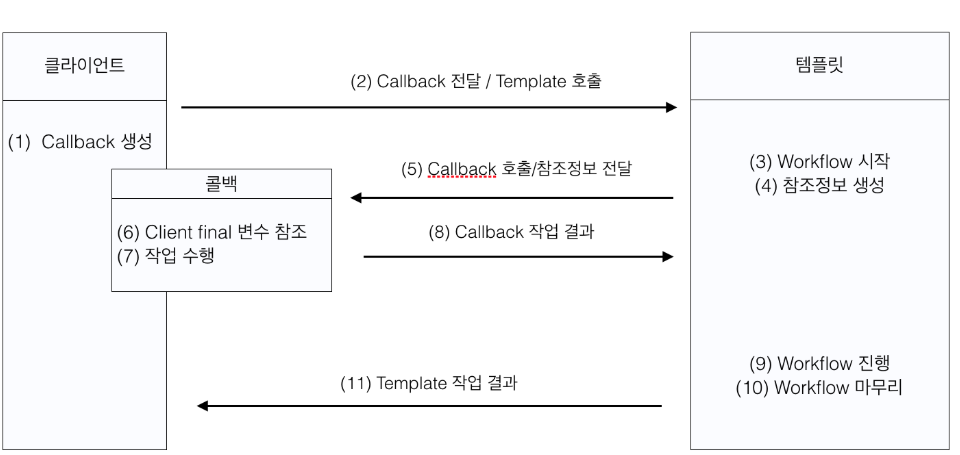

# 지옥 스터디 - 03 템플릿

- 템플릿이란, 바뀌는 성질이 다른 코드 중에 변경이 거의 일어나지 않고 일정한 패턴으로 유지되는 특성을 가진 부분을
- 자유롭게 변경되는 성질을 가진 부분으로부터 독립시켜 효과적으로 활용할 수 있도록 하는 기법

## 다시 보는 초난감 DAO

- UserDao 에 남아있는 문제 ? -> 예외상황에 대한 처리

`초난감 DAO 의 심각한 문제`

- 기존의 코드를 살펴보면, 예외상황이 발생할 경우 **자원에 대한 회수** 가 제대로 이뤄지지 못한다.
    - 이는 초난감 DAO 와 같이 실행후 바로종료되는 간단한 프로그램일 경우 문제가 없지만, 엔터프라이즈 애플리케이션의 경우 문제가 된다.
    - 자원 누수로 인해 서버가 다운되고, 이는 서비스 장애로 이어질 수 있다.

```java
class UserDao {

    // ...
    public void deleteAll() throws SQLException {
        Connection conn = dataSource.getConnection();
        PreparedStatement ps = conn.prepareStatement("delete from users");
        ps.executeUpdate(); // 여기서 예외가 발생하면 ?.. 아래의 close 메소드들은 호출되지 못한다..!

        ps.close();
        conn.close();
    }
}
```

`리소스 반환과 close() 메소드`

- Connection 이나 PreparedStatement 에는 close() 메소드가 있다.
- 단순하게 생각하면 생성했던 것을 종료하는 것으로 볼 수 있다.
- 하지만 보통 이는 **리소스 반환** 으로 이해하는 것이 좋다.
- Connection 이나 PreparedStatement 은 보통 Pool 을 이용해서 관리한다.
- 미리 정해진 수의 Connection 을 생성해두고, 이를 필요시 할당하고, 회수하는 식으로 재사용하는 방식으로 운용된다.

`JDBCConnection Pools`

- Commons DBCP
    - JDK 버전에 맞게 Commons DBCP 버전을 선택해야 안정된 동작을 기대할 수 있다.
    - JDBC API 버전이 올라감에 따라 예외가 세밀하게 추가되었다.
    - 이를 드라이버에서 전달할 때 DBCP 가 정교한 처리를 하지 못해 오류 파악이 힘들 수 있음

| Commons DBCP | JDK | JDBC |
| --- | --- | --- |
| DBCP 2 | JDK 7 | JDBC 4.1 |
| DBCP 1.4 | JDK 6 | JDBC 4 |
| DBCP 1.3 | JDK 1.4 ~ 1.5 | JDBC 3 |

- Commons DBCP 1.4.1 버전 기준 메모리 누수 버그가 존재함
    - https://issues.apache.org/jira/browse/DBCP-330
- Commons DBCP 2 는 **하위 호환성을 보장하지 않으므로 설정시 유의** 할것
- 커넥션 풀을 저장할 때, **PoolableConnection** 타입의 커넥션을 생성하고, ConnectionEventListener 를 등록한다.
    - ConnectionEventListener 는 커넥션을 풀로 반환하기 위해 JDBC 드라이버가 호출가능한 콜백메소드가 있음

```java
public interface ConnectionEventListener extends java.util.EventListener {

    /**
     * Notifies this <code>ConnectionEventListener</code> that
     * the application has called the method <code>close</code> on its
     * representation of a pooled connection.
     *
     * @param event an event object describing the source of
     * the event
     */
    void connectionClosed(ConnectionEvent event);

    /**
     * Notifies this <code>ConnectionEventListener</code> that
     * a fatal error has occurred and the pooled connection can
     * no longer be used.  The driver makes this notification just
     * before it throws the application the <code>SQLException</code>
     * contained in the given <code>ConnectionEvent</code> object.
     *
     * @param event an event object describing the source of
     * the event and containing the <code>SQLException</code> that the
     * driver is about to throw
     */
    void connectionErrorOccurred(ConnectionEvent event);

}
```

```java
private synchronized void allocate(){
    if(isClosed())return;

    // First use any objects in the pool to clear the queue
    for(;;){
    if(!_pool.isEmpty()&&!_allocationQueue.isEmpty()){
    Latch latch=(Latch)_allocationQueue.removeFirst();
    latch.setPair((ObjectTimestampPair)_pool.removeFirst());
    _numInternalProcessing++;
synchronized (latch){
    latch.notify();
    }
    }else{
    break;
    }
    }

    // Second utilise any spare capacity to create new objects
    for(;;){
    if((!_allocationQueue.isEmpty())&&(_maxActive< 0||(_numActive+_numInternalProcessing)<_maxActive)){
    Latch latch=(Latch)_allocationQueue.removeFirst();
    latch.setMayCreate(true);
    _numInternalProcessing++;
synchronized (latch){
    latch.notify();
    }
    }else{
    break;
    }
    }
    }
```

> synchronized 기반으로 동시성 제어를 한다.. 때문에 퍼포먼스 떨어짐 ㅜ

```java
 private void addObjectToPool(Object obj,boolean decrementNumActive)throws Exception{
    boolean success=true;
    if(_testOnReturn&&!(_factory.validateObject(obj))){
    success=false;
    }else{
    _factory.passivateObject(obj);
    }

    boolean shouldDestroy=!success;

// Add instance to pool if there is room and it has passed validation
// (if testOnreturn is set)
synchronized (this){
    if(isClosed()){
    shouldDestroy=true;
    }else{
    if((_maxIdle>=0)&&(_pool.size()>=_maxIdle)){
    shouldDestroy=true;
    }else if(success){
    // borrowObject always takes the first element from the queue,
    // so for LIFO, push on top, FIFO add to end
    if(_lifo){
    _pool.addFirst(new ObjectTimestampPair(obj));
    }else{
    _pool.addLast(new ObjectTimestampPair(obj));
    }
    if(decrementNumActive){
    _numActive--;
    }
    allocate();
    }
    }
    }

    // Destroy the instance if necessary
    if(shouldDestroy){
    try{
    _factory.destroyObject(obj);
    }catch(Exception e){
    // ignored
    }
    // Decrement active count *after* destroy if applicable
    if(decrementNumActive){
synchronized(this){
    _numActive--;
    allocate();
    }
    }
    }

    }
```

- Connection Pool 에 반납할때 maxIdle, 확인 후 임계치를 넘어선다면 제거해버림..!
- CursorableLinkedList 에 저장한다. (LIFO 형태)
    - ObjectTimestampPair 타입으로 저장

```java
static class ObjectTimestampPair implements Comparable {

    /** Object instance */
    Object value;

    /** timestamp */
    long tstamp;

    /**
     * Create a new ObjectTimestampPair using the given object and the current system time.
     * @param val object instance
     */
    ObjectTimestampPair(Object val) {
        this(val, System.currentTimeMillis());
    }

    /**
     * Create a new ObjectTimeStampPair using the given object and timestamp value.
     * @param val object instance
     * @param time long representation of timestamp
     */
    ObjectTimestampPair(Object val, long time) {
        value = val;
        tstamp = time;
    }
    // ...
}
```

- 커넥션 풀의 **커넥션들을 관리하는 별도의 쓰레드가 존재**
    - Evictor 쓰레드
    - **synchronized 를 이용한 모니터락을 활용해 동시성 제어** 를 한다.
- Evictor 스레드의 역할을 3가지
    1. 커넥션 풀에 존재하는 유휴 커넥션중 가장 오랫동안 사용되지 않은 커넥션을 제거한다.

    - 설정값에 기반하여 ObjectTimestampPair 에 저장된 타임스탬프와 현재 타임스탬프 값을 비교하여 처리
    - "-1" 로 지정하면 해당 기능 비활성화

    2. 커넥션 에 대해유효성 검사를 수행해 문제가 있다면 해당 커넥션을 제거한다.
    3. 커넥션의 개수가 minIdle 보다 작다면 minIdle 만큼 커넥션을 생성해 유지한다.
- Evictor 쓰레드 가 동작할 때 마다 커넥션 풀에 **락** 을 걸기 때문에 성능저하에 큰 영향이 있다.
    - 이는 서비스에 영향을 줄 수 있음

- Tomcat DBCP
    - Commons JDBC 에 비해 성능이 개선된 버전
    - Evictor -> PoolCleaner
        - 차이점 ?
        - JDK Concurrent 패키지에 존재하는 클래스들을 사용해 멀티쓰레드 환경에서 성능이 대폭 개선되었다.
- Hikari CP
    - Commons DBCP 와 Tomcat DBCP 의 풀과 유사한 목적으로 **House Keeper** 라는 이름의 커넥션 풀 관리 쓰레드를 사용한다.
        - 기존 커넥션 풀의 문제 ? -> 너무 잦은 Validation 으로 인해 DBMS 에 부하를 준다.
    - Hikari CP 는 minIdle < maxPoolSize 인 상황에서 minIdle 개수 이상의 커넥션이 존재하는 경우에만 Validation 을 수행해
      minIdle 개수를 유지한다.

`HikariCP Connection 누수 감지 옵션`

- datasource.hikari.leak-detection-threshold
    - 기본 값은 0 (누수를 감지하지 않겠다는 의미)
    - 최소값은 2000 ms

`예외 처리기능 적용하기`

```java
class UserDao {

    // ...
    public void deleteAll() throws SQLException {
        Connection conn = null;
        PreparedStatement ps = null;
        try {
            conn = dataSource.getConnection();
            ps = conn.prepareStatement("delete from users");
            ps.executeUpdate();
        } catch (SQLException e) {
            e.printStackTrace();
        } finally {
            if (ps != null) {
                try {
                    ps.close();
                } catch (SQLException e) {
                    e.printStackTrace();
                }

            }
            if (conn != null) {
                try {
                    conn.close();
                } catch (SQLException e) {
                    e.printStackTrace();
                }
            }
        }
    }
}
```

- JDBC 에서는 어떤 상황에서도 리소스 반환을 수행할 수 있도록 **try-catch-finally 구문을 권장** 하고 있다.
- 예외에서도 안정적인 코드가 되었지만 try-catch-finally 로 인해 꽤나 복잡한 구문이 되었다.

## 변하는 것과 변하지 않는 것

`JDBC try-catch-finally 의 문제`

- 예외에 안정적인 코드가 되었지만 코드를 보면 답이 없다.
- 복잡한 try-catch-finally 블록이 중첩되어 있고 모든 메소드마다 반복된다.
- 복잡해진 코드블록 덕분에 어떤 코드가 중요 관심사 인지 알기 힘들어진다.

> 이 문제의 핵심은, 중복되는 코드와 로직에 따라 확장되고 변하는 코드를 분리해 내는 것이다.

`템플릿 메소드 패턴 적용`

- 템플릿 메소드 패턴은 **상속** 을 통해 기능을 확장해서 사용한다.
- 변하지 않는 부분은 슈퍼클래스에, 변하는 부분은 추상 메소드로 정의하여 서브클래스에서 구현하도록 하는 방법이다.

```java
abstract class UserDao {

    // ...
    abstract protected PreparedStatement makeStatement(Connection conn) throws SQLException;
}
```

```java
class UserDaoDeleteAll extends UserDao {

    protected PreparedStatement makeStatement(Connection conn) throws SQLException {
        return conn.prepareStatement("delete from users");
    }
}
```

- 개선된 방법은 나름 괜찮아 보인다.
- UserDao 의 기능 확장이 필요할 때 마다 상속을 통해 자유롭게 확장이 가능하고, 상위 클래스에 불필요한 변화를 주지 않는다.
- 이는 OCP 를 만족한다. 하지만 단점도 분명하다.
- 가장 큰 문제는 **DAO 에 기능이 추가 될 때마다 상속을 통한 새로운 클래스가 만들어진다** 는 점이다.
- 확장 구조가 클래스를 설계하는 시점에서 **고정** 되어 버린다.
    - 컴파일 타임에 이미 관계가 결정되어 있다.

`전략 패턴 적용`

- OCP 를 만족하면서 템플릿 메소드 패턴보다 유연하고 확장성이 뛰어난 패턴
- 오브젝트를 분리하고, 클래스 레벨에서 **인터페이스에 의존하게 하는 전략 패턴** 이다.
    - Context 에서 일정한 구조를 가지고 동작하다가, 변하는 부분 은 외부의 전략 클래스에 위임한다.
- deleteAll 메소드의 컨텍스트를 나열해보면 다음과 같다.
    1. 커넥션 맺기
    2. PreparedStatement 를 생성할 외부 기능 호출
    3. 전달받은 PreparedStatement 실행
    4. 예외 발생시 메소드 밖으로 던지기
    5. 리소스 정리하기
- 여기서 2번에 해당하는 부분이 전략패턴에서 말하는 **전략** 이다.

```java
public interface StatementStrategy {

    PreparedStatement makePreparedStatement(Connection c) throws SQLException;
}
```

```java
public class DeleteAllStatement implements StatementStrategy {

    @Override
    public PreparedStatement makePreparedStatement(Connection c) throws SQLException {
        return c.prepareStatement("delete from users")
    }
}
```

```java
class UserDao {

    // ...
    public void deleteAll() throws SQLException {
        // ..
        try {
            c = dataSource.getConnection();
            ps = new DeleteAllStatement().makePreparedStatement(c);
            ps.executeUpdate();
        } catch (SQLException e) {
            // ..
        }
    }
}
```

- 그럭저럭 전략패턴을 적용했지만 한 가지 아쉬운 점이 있다.
- 전략 패턴은 필요에 따라 컨텍스트는 유지됙, 전략을 바꿔 쓸 수 있어야 한다.
- 하지만 deleteAll() 메소드의 경우 이미 전략 클래스가 DeleteAllStatement 로 고정되어 있다.

`DI 적용을 위한 클라이언트/컨텍스트 분리`

- 전략 패턴은, **Context 가 어떤 전략을 사용할지 결정하는 것은 Context 를 사용하는 Client 가 결정** 한다.
- 컨텍스트에 해당하는 부분을 메소드로 분리해 적용해보자.

```java
class UserDao {
    // ...

    public void deleteAll() throws SQLException {
        StatementStrategy st = new DeleteAllStatement();
        jdbcContextWithStatementStrategy(st);
    }

    public void jdbcContextWithStatementStrategy(StatementStrategy stmt) throws SQLException {
        Connection conn = null;
        PreparedStatement ps = null;
        try {
            conn = dataSource.getConnection();

            // 변하는것과 변하지 않는것의 분리.
            // deleteAll 에서 변하는것 ? -> DELETE Query 에 해당하는 Statement 생성
            // 나머지 부분 (커넥션을 맺고, 쿼리를 실행하고, 예외 처리및 자원 회수는 변하지 않는다.
            // 전략패턴 적용
            ps = stmt.makePreparedStatement(conn);

            ps.executeUpdate();
        } catch (SQLException e) {
            e.printStackTrace();
        } finally {
            if (ps != null) {
                try {
                    ps.close();
                } catch (SQLException e) {
                    e.printStackTrace();
                }

            }
            if (conn != null) {
                try {
                    conn.close();
                } catch (SQLException e) {
                    e.printStackTrace();
                }
            }
        }
    }
}
```

- 개선된 코드를 살펴보면 구조로 보았을 때 완벽한 전략 패턴의 모습을 갖추었다.
- 클라이언트와 컨텍스트는 클래스레벨에서의 분리가 이뤄지진 않았지만 의존관계와 책임으로 볼 때 이상적인 클라이언트/컨텍스트 관계를 형성하고 있다.

`마이크로 DI`

- DI 는 다양한 형태로 적용할 수 있다.
- DI 의 가장 중요한 개념 -> 제 3자의 도움을 받아 두 오브젝트 사이의 유연한 관계라 설정되도록 하는것
- 일반적으로는 제 3자 (오브젝트 팩토리) 가 존재하지만 경우에 따라 클라이언트가 오브젝트 팩토리의 책임을 함께 수행할 수도 있다.
- 심지어 이런 클라이언트와 DI 관계에 있는 오브젝트가 하나의 클래스에 담길 수도 있다.
- 매우 작은 단위의 코드와 메소드 사이에서도 일어나기도 하는데 이런 경우를 마이크로 DI 라고 한다.

## JDBC 전략 패턴의 최적화

- 기존의 deleteAll() 메소드를 보면 변하지 않는 부분과 변화는 부분을 전략 패턴을 적용해 깔끔하게 분리했다.
- 이번엔 add() 메소드에도 적용을 해보자.

```java
public class AddStatement implements StatementStrategy {

    User user;

    public AddStatement(User user) {
        this.user = user;
    }

    @Override
    public PreparedStatement makePreparedStatement(Connection c) throws SQLException {
        PreparedStatement ps = c.prepareStatement(
            "insert into users (id, name, password) values (?, ?, ?)");

        // User 는 어디서 받아올까 ?...
        ps.setString(1, user.getId());
        ps.setString(2, user.getName());
        ps.setString(3, user.getPassword());
        return ps;
    }
}
```

- Add 를 수행할 AddStatement 를 만들고 보니 한가지 문제가 있다.
- StatementStrategy 의 makePreparedStatement 메소드는 Connection 객체만을 인자로 받는다.
- 내부에서 User 의 참조가 필요한데 이는 어디서 받아와야 하는가 ?.. -> AddStatement 를 생성시 생성자 인자로 받아와 사용한다.

```java
class UserDao {

    // ..
    public void add(User user) throws ClassNotFoundException, SQLException {
        StatementStrategy stmt = new AddStatement(user);
        jdbcContextWithStatementStrategy(stmt);
    }
}
```

`불편한 진실`

- UserDao 를 개선해 add() 메소드에도 적용을 했다.
- 하지만 한 가지 불편한 진실이 있다.
    - DAO 메소드마다 StatementStrategy 구현 클래스를 매번 만들어야 한다.
        - 이는 템플릿 메소드패턴과 비교했을때 다를게 없다
    - 또한 add 메소드의 User 와 같은 부가정보가 필요할때 마다 매번 생성자를 통해 받아와 한다.
- 이를 해결하는 방법을 하나씩 살펴보자.

`로컬 클래스`

- 매번 구현 클래스를 만들어야 하는 문제의 간단한 해결 방법
- 전략 클래스를 새로운 클래스 파일로 만들지 않고, **메소드의 로컬 클래스로 정의** 한다.
    - 이는 특정 메소드에 강하게 결합되어 있기 때문에 적절해보인다.

```java
class UserDao {

    // ..
    public void add(final User user) throws ClassNotFoundException, SQLException {
        // 로컬 클래스로 개선
        // 로컬 클래스는 메소드 인자에 대한 참조에 접근할 수 있다.
        class AddStatement implements StatementStrategy {

            @Override
            public PreparedStatement makePreparedStatement(Connection c) throws SQLException {
                PreparedStatement ps = c.prepareStatement(
                    "insert into users (id, name, password) values (?, ?, ?)");
                ps.setString(1, user.getId());
                ps.setString(2, user.getName());
                ps.setString(3, user.getPassword());
                return ps;
            }
        }

        StatementStrategy stmt = new AddStatement();
        jdbcContextWithStatementStrategy(stmt);
    }
}
```

- 로컬 클래스를 사용하면 User 와 같은 부가정보가 필요할때 선언된 메소드 인자에 대한 참조에 접근할 수 있다.
- 때문에 두 번째 문제도 해결된다.

`익명 클래스`

```java
class UserDao {

    // ..
    public void add(final User user) throws ClassNotFoundException, SQLException {
        // 익명 클래스로 개선
        StatementStrategy stmt = new StatementStrategy() {

            @Override
            public PreparedStatement makePreparedStatement(Connection c) throws SQLException {
                PreparedStatement ps = c.prepareStatement(
                    "insert into users (id, name, password) values (?, ?, ?)");
                ps.setString(1, user.getId());
                ps.setString(2, user.getName());
                ps.setString(3, user.getPassword());
                return ps;
            }
        }
        jdbcContextWithStatementStrategy(stmt);
    }
}
```

- 위 방식도 썩 괜찮아 보이지만 익명 클래스를 사용하면 좀 더 간결하게 처리해볼 수 있다.

`익명 내부 클래스`

```java
class UserDao {

    // ..
    public void add(final User user) throws ClassNotFoundException, SQLException {
        // 익명 클래스로 개선
        jdbcContextWithStatementStrategy(new StatementStrategy() {

            @Override
            public PreparedStatement makePreparedStatement(Connection c) throws SQLException {
                PreparedStatement ps = c.prepareStatement(
                    "insert into users (id, name, password) values (?, ?, ?)");
                ps.setString(1, user.getId());
                ps.setString(2, user.getName());
                ps.setString(3, user.getPassword());
                return ps;
            }
        });
    }
}
```

- 익명 클래스를 한 단계 더 개선한 방식
- 익명 클래스를 선언함과 동시에 메소드 인자로 사용해 버린다.

## 컨텍스트와 DI

`JdbcContext 분리`

- jdbcContextWithStatementStrategy 메소드를 보면 JDBC 로 작성된 코드의 일반적인 작업 흐름을 가지고 있다.
- 이는 추후 다른 DAO 에서도 사용이 가능하다. -> 별도 클래스로 분리해보자

```java
public class JdbcContext {

    private DataSource dataSource;

    public void setDataSource(DataSource dataSource) {
        this.dataSource = dataSource;
    }

    public void workWithStatementStrategy(StatementStrategy stmt) throws SQLException {
        Connection conn = null;
        PreparedStatement ps = null;
        try {
            conn = dataSource.getConnection();

            // 전략패턴 적용
            ps = stmt.makePreparedStatement(conn);

            ps.executeUpdate();
        } catch (SQLException e) {
            e.printStackTrace();
        } finally {
            if (ps != null) {
                try {
                    ps.close();
                } catch (SQLException e) {
                    e.printStackTrace();
                }

            }
            if (conn != null) {
                try {
                    conn.close();
                } catch (SQLException e) {
                    e.printStackTrace();
                }
            }
        }
    }
}
```

```java
public class UserDao {

    private JdbcContext jdbcContext;

    public UserDao() {
    }

    public void setJdbcContext(JdbcContext jdbcContext) {
        this.jdbcContext = jdbcContext;
    }

    public void add(final User user) throws ClassNotFoundException, SQLException {
        // 익명 클래스로 개선
        jdbcContext.workWithStatementStrategy(new StatementStrategy() {

            @Override
            public PreparedStatement makePreparedStatement(Connection c) throws SQLException {
                PreparedStatement ps = c.prepareStatement(
                    "insert into users (id, name, password) values (?, ?, ?)");
                ps.setString(1, user.getId());
                ps.setString(2, user.getName());
                ps.setString(3, user.getPassword());
                return ps;
            }
        });
    }
}
```

- 기존에 UserDao 에 존재하던 메소드를 JdbcContext 로 분리하고, UserDao 는 이를 DI 받아 사용할 수 있게 ㅕㄴ경 했다.
- 하지만 JdbcContext 는 인터페이스가 아닌 **구체 클래스** 이다.
- DI 는 기본적으로 인터페이스를 사이에 두고 의존 클래스를 바꿔가며 사용하는게 목적이다.
- 하지만 현재 상황에선 JdbcContext 클래스는, JDBC 컨텍스트를 제공해주는 **서비스 오브젝트** 로 의미가 있다.
    - 구현 방법이 바뀔 가능성은 없다.
- 때문에 인터페이스를 사이에 두지 않은 특별한 DI 방법

`JdbcContext 의 특별한 DI`

- DI 개념을 충실히 따르면 인터페이스를 사이에 두고 클래스 레벨에서 의존관계가 고정되지 않아야한다.
- 인터페이스를 사용하진 않았지만 JdbcContext 와 UserDao 를 DI 구조로 만들어야 할 이유는 다음과 같다.
    - JdbcContext 는 일종의 서비스 오브젝트로서 의미가 있다. 때문에 싱글톤으로 관리되어 여러 오브젝트에서 공유해 사용하는 것이 이상적이다.

> 이 처럼 클래스를 바로 사용하는 코드 구성을 DI 에 적용하는 것은 가장 마지막 단계에서 고려해 보아야할 사항이다.

## 템플릿과 콜백

- UserDao, StatementContext, JdbcContext 를 이용해 작성된 코드를 보면 일종의 전략패턴이 적용되어 있고, 전략 패턴의 기본 구조에 **익명 내부
  클래스** 를 활용한 방식이다.
- 이런 방식을 스프링에서는 **템플릿/콜백 패턴** 이라고 한다.
    - 전략패턴의 컨텍스트 -> 템플릿
    - 익명 내부 클래스로 만들어지는 오브젝트 -> 콜백

`템플릿과 콜백`

- **템플릿** 은 어떤 목적을 위해 미리 만들어둔 모양이 있는 틀을 가리킨다.
- 프로그래밍에서는 고정된 틀 안에 바꿀 수 있는 부분을 넣어 사용하는 경우를 템플릿 이라고 한다.
- **콜백** 은 **실행되는 것을 목적으로 다른 오브젝트의 메소드에 전달되는 오브젝트** 를 말한다.
    - 특정 로직을 담은 메소드를 실행시키는 것이 목적이다.
- 자바에서는 메소드 자체를 파라메터로 전달할 방법이 없기 때문에 오브젝트를 넘겨야 한다.
- 때문에 **펑셔널 오브젝트** 라고도 한다.

`템플릿/콜백의 특징`

- 템플릿/콜백 패턴의 콜백은, 보통 단일 메소드 인터페이스를 사용한다.
    - 템플릿 작업 흐름 중 특정 기능을 위해 한 번 호출되는 경우가 일반적이기 때문



- 위는 템플릿/콜백 패턴의 일반적인 작업 흐름이다.
- 언뜻 보면 복잡해 보이지만 DI 방식의 **전략 패턴 구조** 를 가지고 있다.
    - 템플릿 콜백은, 매번 메소드 단위로 사용할 오브젝트를 새롭게 전달받는다.

`템플릿/콜백 개선`

- 현재 JdbcContext 만 보아도 기존 JDBC 코드에 비해 장점이 많다.
- 하지만 한 가지 아쉬운 점이 있다.
- DAO 메소드에서 매번 익명 내부 클래스를 사용하기 때문에 코드 작성 및 가독성이 떨어진다는 점이다.
- 이를 개선해 보자.

```java
public class JdbcContext {

    private DataSource dataSource;

    public void setDataSource(DataSource dataSource) {
        this.dataSource = dataSource;
    }

    public void workWithStatementStrategy(StatementStrategy stmt) throws SQLException {
        Connection conn = null;
        PreparedStatement ps = null;
        try {
            conn = dataSource.getConnection();

            // 전략패턴 적용
            ps = stmt.makePreparedStatement(conn);

            ps.executeUpdate();
        } catch (SQLException e) {
            e.printStackTrace();
        } finally {
            if (ps != null) {
                try {
                    ps.close();
                } catch (SQLException e) {
                    e.printStackTrace();
                }

            }
            if (conn != null) {
                try {
                    conn.close();
                } catch (SQLException e) {
                    e.printStackTrace();
                }
            }
        }
    }

    public void executeSql(final String query) throws SQLException {
        workWithStatementStrategy(
            new StatementStrategy() {

                @Override
                public PreparedStatement makePreparedStatement(Connection c) throws SQLException {
                    return c.prepareStatement(query);
                }
            }
        );
    }
}
```

```java
class UserDao {

    // ..
    public void deleteAll() throws SQLException {
        jdbcContext.executeSql("delete from users");
    }
}
```
- 기존의 dao 메소드 들을 보면 바뀌지 않는 부분이 있다.
- workWithStatementStrategy 메소드를 호출하면서, new StatementStrategy() {...}; 를 통해 매번 익명 클래스를 생성한다.
- 여기서 매번 query 에 해당 하는 부분만 변경된다.
- 때문에 변하는 부분과, 변하지 않는 부분을 분리하고 개선해 이를 적용했다.
- deleteAll 메소드를 보면, 이전과 달리 해당 메소드가 처리할 SQL 에 집중할 수 있게 되었다.
  - 관심사의 분리

`템플릿/콜백의 응용`
- 템플릿/콜백 패턴은 스프링에서만 사용 하거나 스프링이 제공해주는 독자적인 기술이 아니다.
- 하지만 스프링 만큼 이 패턴을 적극적으로 활용하는 프레임워크는 없다.
- 스프링의 API 나 기능들을 살펴보면 템플릿/콜백 패턴을 적용한 경우를 많이 찾아볼 수 있다.
- 고정된 작업 흐름을 갖고 있으면서 여기저기 반복되는 코드가 있다면, 중복되는 코드를 분리할 방법을 생각해 보자..

## 스프링의 JdbcTemplate
- 스프링에서 제공하는 대표적인 템플릿/콜백 기술
- 거의 모든 종류의 JDBC 코드에 사용가능한 템플릿/콜백 을 제공하며, 자주 사용되는 패턴을 가진 콜백은 다시 템플릿에 결합시켜 간단한 메소드 호출로 사용이 가능하도록 만들었다.

```java
public class UserDao {

    private JdbcTemplate jdbcTemplate;

    public UserDao() {
    }

    /**
     * 수동 DI 방식
     */
    public void setDataSource(DataSource dataSource) {
        this.jdbcTemplate = new JdbcTemplate(dataSource);
    }

    public void add(final User user) throws ClassNotFoundException, SQLException {
        jdbcTemplate.update("insert into users(id, name, password) values (?, ?, ?)",
            user.getId(), user.getName(), user.getPassword());
    }

    public User get(String id) throws ClassNotFoundException, SQLException {
        return jdbcTemplate.queryForObject(
            "select * from users where id = ?",
            new BeanPropertyRowMapper<>(User.class),
            id
        );
    }

    public void deleteAll() throws SQLException {
        jdbcTemplate.update("delete from users");
    }

    public int getCount() throws SQLException {
        // queryForInt 는 Deprecated 됨
        return jdbcTemplate.queryForObject("select count(*) from users", Integer.class);
    }

    public List<User> getAll() {
        return jdbcTemplate.query("select * from users order by id",
            new BeanPropertyRowMapper<>(User.class));
    }
}
```

## 참고
- https://d2.naver.com/helloworld/5102792
- https://kakaocommerce.tistory.com/45?category=368198