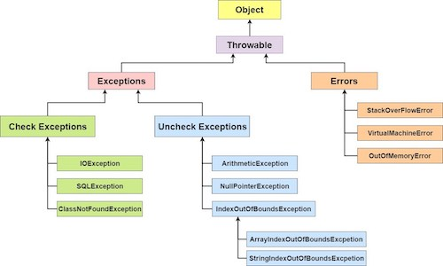
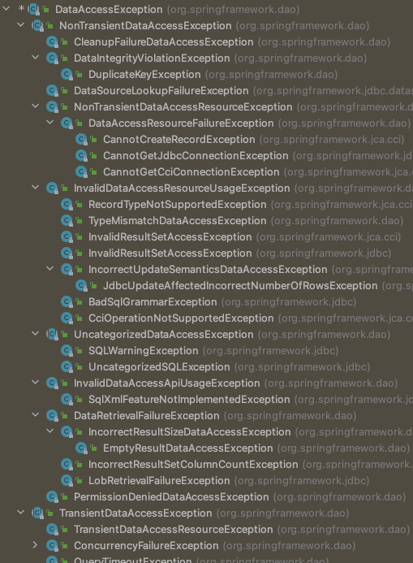

# 지옥 스터디 - 04 예외

## 서론

- 자바 개발자가 가장 신경쓰기 귀찮아 하는것 ? -> 예외
- 예외와 관련된 코드는 자주 엉망이 되거나 무성의하게 만들어지기 쉽다.
- JdbcTemplate 을 대표로 스프링 데이터 엑세스 기능에 담겨있는 예외 처리 및 관련된 접근 방법 그리고 예외 처리시 베스트 프렉티스에 대해 살펴본다.

## 사라진 SQLException

- JdbcContext 를 JdbcTemplate 으로 변경하면서 달라진점? -> 예외를 throws 하는 부분이 사라졌다.

```java
public void deleteAll()throws SQLException{
    jdbcContext.executeSql("delete from users");
    }

public void deleteAll(){
    jdbcTemplate.update("delete from users");
    }
```

## 초난감 예외처리

- 개발자들의 코드에서 종종 발견되는 초난감 예외처리의 대표 선수들을 살펴보자.

`예외 블랙홀`

```java
try{
    // ...
    }catch(SQLException e){

    }
```

- 예외를 잡고는 아무런 것도 하지 않는다.
- 예외 발생을 무시하고 정상적인 상황처럼 취급하는데, 이런 방식은 **지양** 해야 한다.
    - 예외가 발생했지만 무시되어 비정상적 동작을 하거나, 원인을 찾아내기가 매우 힘들다.

`초난감 예외처리 2`

```java
try{
    // ...
    }catch(SQLException e){
    System.out.println(e);
    }
```

`초난감 예외처리 3`

```java
try{
    // ...
    }catch(SQLException e){
    e.printStackTrace();
    }
```

- 언뜻보면 2/3은 별 문제가 없어보인다.
- 로그를 찍긴하지만, 다른 로그나 메세지에 묻히면 놓치기 쉽상이다.
- 누군가 로그를 계속 모니터링 하지않는 이상 이는 심각한 폭탄으로 남아있을 가능성이 높다.
- catch 블록을 통해 메세지 출력을 한 것은 예외 처리를 한 것이 아니다!!
    - 로그를 남길경우 **로깅 프레임워크** 를 사용하는 것이 좋다.
    - Tomcat에서 e.printStackTrace()로 콘솔에 찍힌 값은 {TOMCAT_HOME}/logs/catalina.out 에만 남는다.
    - 로깅 프레임워크를 이용하면 파일을 쪼개는 정책을 설정할 수 있고,
    - 여러 서버의 로그를 한곳에서 모아서 보는 시스템을 활용할 수도 있다.

> SQL Exception 이 발생하는 경우 대부분은 복구하지 못하는 경우가 많다. <br/>
> 콘솔에 로그나 예외 메세지를 출력하는것은 아무런 도움이 되지 못한다.

`무의미하고 무책임한 throws`

- catch 해 봐야 해결할 방법도 없고, 매번 throws 선언도 귀찮아지기 시작하면 다음과 같은 코드가 양산된다.

```java
public void method1()throws Exception{}
public void method2()throws Exception{}
public void method3()throws Exception{}
```

- EJB 가 한창쓰일때 자주 보이던 코드이다.
- 정말 어떤 예외가 발생할 수 있는지 얻을 수 있는 정보가 없다.
- 때문에 이런 메소드를 호출하는 메소드에서도 따라서 throw Exception 를 사용하는 수 밖에 없다
- 지금까지 살펴본 방식을 어떤 경우에도 용납하지 말아야 한다.

## 예외의 종류와 특징

`Error`

- java.lang.Error 의 서브클래스들
- 시스템에 비정상적인 상황이 발생한 경우 사용된다.
- 주로 VM 에서 발생하는 것이기 때문에 애플리케이션에서 잡으려고 해선 안된다.
- OutOfMemoryError / ThreadDeath 와 가은 에러는 catch 로 잡아봤자 아무런 대응 방법이 없다.
- 시스템 레벨에서 특별한 작업을 하는것이 아니라면 이런 에러에 대한 처리는 신경쓰지 않아도 된다.

`Exception 과 체크 예외`

- java.lang.Exception 과 서브 클래스들
- 이는 개발자들이 만든 애플리케이션에서 발생할 수 있는 예외상황에서 사용된다.
- Exception 클래스는 체크 예외와 언체크 예외로 나뉜다.
- 체크 예외는 반드시 catch 로 잡거나 throws 로 던져야 한다.
- 그렇지 않으면 컴파일 에러가 발생한다.

`Exception 과 언체크 예외`

- java.lang.RuntimeException 과 서브 클래스들
- 명시적인 예외처리를 강제하지 않는다.
- 이는 주로 프로그램 오류가 있을때 발생하도록 의도된 것들이다.
    - NPE / IllegalArgumentException 과 같은 것들이다.



## 예외처리 방법

`예외 복구`

- 예외상황을 파악하고 문제를 해결해 **정상 상태로 돌려놓는 것** 이다.
- 예를 들어 IOException 이 발생했을때, 사용자에게 상황을 알려주고 다른 파일을 이용하도록 안내해 해결할 수 있다.
- 하지만 에러메세지가 사용자에게 그냥 던져지는 것은 에러복구라고 볼 수 없다.
- 예외처리가 됬다면 기능적으로는 사용자에게 예외상황으로 비쳐도 애플리케이션에서는 **정상적으로 설계된 흐름을 따라 진행** 되어야 한다.

`예외처리 회피`

- 자신이 담당하지 않고 호출한 쪽으로 던져버리는 것이다.
- 이는 **자신이 처리하지 않고 회피** 하는 방법
- JdbcContext/JdbcTemplate 의 콜백 오브젝트를 보면 모두 예외를 throws 하고 있다.
    - 그 이유는 예외 처리의 책임이 콜백 오브젝트의 것이 아니기 때문이다.
    - 예외 처리에 대한 책임은 템플릿 (컨텍스트) 에게 있다.
- 예외를 **회피** 하는 것은 분명한 의도가 있어야한다.
- 템플릿/콜백 처럼 긴밀한 관계가 있는 다른 오브젝트에게 책임을 지게 하거나 자신을 사용하는 쪽에서 예외를 처리하는 것이 최선이라는 확신이 있어야 한다.

`예외 전환`

- 예외를 전환 하는 방법
- 회피와 비슷하게 예외를 복구해서 정상적으로 만들수 없기 때문에 메소드 밖으로 던지는 것이다.
    - 회피와의 차이점은, 그대로 던지는것이 아닌, 적절하고 의미있는 예외로 **변환** 해서 던지는 것이다.
- 예외 전환의 목적
    1. 내부에서 발생한 예외가 해당 상황에 대해 적절한 의미를 부여하지 못하는 경우
    2. 예외를 처리하기 쉽고 단순하게 만들기위해 **포장** 하는 것이다.
- 예외 전환의 경우 발생한 예외를 담아 **중첩 예외** 로 만드는 거이 좋다.
    - getCause() 를 통해 처음 발생한 예외가 무엇인지 확인할 수 있다.

```java
try{
    // ..
    }catch(SQLException e){
    throw new DuplicateUserIdException(e);
    }
```

```java
try{
    // ..
    }catch(SQLException e){
    throw new DuplicateUserIdException().initCause(e);
    }
```

## 예외처리 전략

- 런타임 예외를 보편화 하라
- 체크 예외의 활용도와 가치는 점점 떨어지고 있다.
- 대응 불가능한 체크예외라면 빨리 런타임 예외로 전환해 던지는것이 낫다.

`add() 메소드의 예외처리`

- 사용자 등록 도중 사용자 아이디가 중복 되었을 경우의 예외처리
    - 이를 의미하는 DuplicateUserIdException 을 정의한다.
    - 이 예외는 굳이 체크예외일 필요는 없다.
    - 대신 add 메소드가 DuplicateUserIdException 가 던진다는 것을 선언해 주어야 한다.

```java
public class DuplicateUserIdException extends RuntimeException {

    public DuplicateUserIdException(Throwable cause) {
        super(cause);
    }
}
```

```java
class UserDao {
    // ..

    public void add(final User user) throws DuplicateUserIdException {
        // ..
    }
}
```
- 런타임 예외를 보편화 했을때의 장점?
  - 불필요한 throws SQLException 이 사라졌다.
- 단 런타임 예외를 만들었기 때문에 주의를 요한다.
  - 컴파일러가 강제하지 않기 때문에 놓치는 부분이 있을 수 있ㄷ.
  - 이는 API 문서 / 레퍼런스 문서 등을 통해 메소드 사용시 발생 가능한 예외의 종류와 원인, 활용 방법을 자세히 설명해두어야한다.

`애플리케이션 예외`
- 런타임 예외 중심의 전략은 **낙관적인 예외처리** 기법 이라 할 수 있다.
  - 복구가능한 예외는 없다고 가정한다.
  - 예외가 발생하더라도 런타임 예외기 때문에 시스템레벨에서 처리해줄 것이다.
  - 반드시 필요한 경우 런타임 예외를 잡아서 처리할 수 있다.

> 체크 예외의 비관적인 접근 방법과 대비된다.

- 애플리케이션 자체의 로직에 의해 **의도적으로 발생** 시키고 반드시 catch 해 조치를 요구하는 예외도 있는데
- 이를 일반적으로 **애플리케이션 예외** 라고 한다.
- 은행 계좌 출금을 예를 들어보자.
- 잔고를 확인하고, 허용 범위를 넘어선다면 출금 작업을 중단시키고 적절한 경고를 사용자에게 알려야한다.
- 이런 경우 설계하는 방법은 크게 두가지다.
  1. 예외상황을 의미하는 에러코드를 반환해 이를 체크한다.
  2. 비즈니스적인 의미를 띈 예외를 던진다.
- 1번 방법의 가장 큰 문제는 예외 상황에 대한 값을 명확하게 코드화하고 잘 관리하지 않으면 혼란을 야기하고 버그가 발생할 가능성이 높다.
- 2번 방법의 경우에는 코드를 이해하기도 편하고 관리도 편하기 때문에 많은 장점이 있다.

```java
try {
    BigDecimal balance = account.withDraw(account);
    // ..
} catch (InsfficientBalanceException e) {
      BigDecimal availFunds = e.getAvailFunds();
      // 남은 잔고 출력...
}
```

`SQLException 은 어디로 갔는가 ?`
- SQLException 은 과연 복구 가능한 예외인가 ? -> 대부분의 경우 복구 불가능하다.
  - 프로그램 오류 또는 개발자의 실수로 인해 발생하거나 외부 상황떄문에 발생하는 것이다.
- 이런 경우 예외처리 전략을 적용해야 한다.
- 필요도 없는 throws 선언이 남발하기 때문에 가능한 빨리 언체크/런타음 예외러 **전환** 해 주어야한다.
- JdbcTemplate 은 이 예외처리 전략을 따르고 있다.
- 템플릿/콜백에서 발생하는 모든 SQLException 런타임 예외인 **DataAccessException** 으로 포장해 던져 준다. 

`SonarQube 의 Exception 관련 글`

```java
// Noncompliant - exception is lost
try{ /* ... */ }catch(Exception e){LOGGER.info("context");}

// Noncompliant - exception is lost (only message is preserved)       
    try{ /* ... */ }catch(Exception e){LOGGER.info(e.getMessage());}

// Noncompliant - exception is lost 
    try{ /* ... */ }catch(Exception e){throw new RuntimeException("context");}
```

- 위와 같이 구현하는 경우 Exception 상태가 **유실** 된다.
- SonarQube 에서는 다음과 같은 방식을 권장한다.

```java
try{ /* ... */ }catch(Exception e){LOGGER.info(e);}

    try{ /* ... */ }catch(Exception e){throw new RuntimeException(e);}

    try{
    /* ... */
    }catch(RuntimeException e){
    doSomething();
    throw e;
    }catch(Exception e){
    // Conversion into unchecked exception is also allowed
    throw new RuntimeException(e);
    }
```

> 예외 처리시 반드시 지켜야할 핵심 원칙 <br/>
> 모든 예외는 복구 되거나 작업을 중단시키고 개발자에게 통보되어야 한다.

`The Practice Of Programming - 예외는 저수준에서 잡고, 고수준에서 처리하라`

- 일반적으로 에러는 낮은 수준에서 잡고, 높은 수준에서 처리해야 한다.
- 대부분의 경우 **호출자** 가 에러를 어떻게 처리할지 결정해야 한다.

`The Practice Of Programming - 예외적인 상황에서만 예외 처리를 하라`

- 몇몇 언어는 비정상적 상황을 감지하고 해당 상황을 벗어나기 위해 예외 매커니즘을 제공한다.
- 이를 이용해 제어 흐름을 다른데로 돌릴 수 있다.
- 문제 해결을 하면서 리턴 값을 처리해야할 떄 예외를 사용해서는 안된다.
- 예외는 제어 흐름을 건들이기 떄문에 쉽게 남용될 수 있으며 버그가 발생하기 쉽게 구조가 꼬일 수 있다.

> 정말 예외적인 경우를 대비해 예외를 아껴야 한다.

## 예외 전환
- 예외 전환의 목적 ? 
  - 런타임 예외로 포장하여 불필요한 catch/throws 를 제거하기 위함
  - 로우레벨의 예외를 좀 더 의미있고 추상회된 예외로 전환하는 것
- JdbcTemplate 이 던지는 DataAccessException 은 런타임 예외로 포장해 던진다.
- 또한 **일관성 있는 예외로 전환해 추상화** 목적도 있다.

`JDBC 의 한계`
- JDBC 는 자바를 이용해 DB 에 접근하는 API 를 추상화 해두고, 각 벤더사 별로 이를 구현하도록 하였다.
- JDBC 에 정의된 표준 인터페이스를 통해 그 기능을 제공하기 때문에 DB 종류에 관계없이 일관된 방법으로 개발할 수 있다.
- 하지만 JDBC 의 한계는, DB 를 자유롭게 변경해 사용할 수 있는 **유연한 코드** 를 보장해주지는 못한다.

`비표준 SQL`
- JDBC 에서 사용하는 SQL 이 걸림돌 이다.
- SQL 은 어느정도 표준화된 언어고 규약이 있긴 하지만, 대부분의 DB 는 표준을 따르지 않는 비표준 문법과 기능을 제공한다.
- 대용량 데이터 처리를 위하 최적화 기법과 페이징 처리라거나, 또는 함수를 사용할 경우 문제가 된다.
- 이 문제의 해결은 표준 SQL 만 사용하거나, DB 별로 DAO 를 만들거나 SQL 을 외부로 독립시켜 DB 에 따라 변경해 사용하는 방법 등이 있다.

`호환성 없는 SQLException 의 DB 에러정보`
- DB 마다 에러의 종류와 원인도 제각각 인것이 문제이다.
- JDBC 는 데이터 처리중 발생하는 예외를 SQLException 하나로 다 담아버린다.
- 에러의 원인은 예외 내부에 담긴 에러코드와 SQL 상태정보를 참좨야 한다.
- 하지만 이런 에러코드가 정형화 되어 있지 않다.
  - DB 벤더사 별로 제각각 이다.
- 이런 문제 때문에 **OpenGroup** 의 XOPEN SQL 의 스펙에 정의된 상태 코드를 따르게 되어있따.
- JDBC 3.0 에서는 SQL 99 의관례를 JDBC4.0 은 SQL 2003 의 관례를 추가적으로 따르게 정의되어 있긴 하다.
- 하지만 각 벤더사가 이를 준수하고 있지 않다.
  - 정확한 에러 코드라는 보장이 없다.

`DB 에러코드 매핑을 통한 전환`
- SQLException 에 담긴 SQL 상태코드는 신뢰할 만한 것이 아니다.
- 때문에 DB 별로 고유의 에러코드를 참조해 매핑 테이블로 만들어 두는 것이다.
  - 이런 방식이 고유 에러코드이기 때문에 좀 더 관리되고 있고 신뢰성이 높다.
- 스프링의 DataAccessException 은 이에 대한 서브 클래스들을 정의해두고 세분화된 예외를 표현한다.
- SQL 문법이 문제라면 BadSqlGrammerException 등이 있다.
- 스프링은 DB 별 에러코드를 분류해 예외 클래스와 매핑해둔 매핑 테이블을 이용한다.

> 드라이버나 DB 메타정보를 활용해 각 벤더사 별로 매핑테이블을 이용해 적절한 예외로 던져준다.

`DAO 인터페이스와 DataAccessException 계층 구조`
- DataAccessException 은 JDBC SQLException 처리를 위한 용도로만 만든 것이 아니다.
- JDBC 외의 자바 데이터 엑세스 기술에서 발생하는 예외에도 적용된다.
- JDO/JPA 도 JDBC 처럼 자바의 표준 퍼시스턴스 기술이지만, JDBC 와 성격과 사용방법이 매우 다르다.
- DataAccessException 은 의미가 같다면 데이터 엑세스 기술에 상관없이 일관된 예외가 발생하도록 만들어준다.

`DAO 인터페이스와 구현의 분리`
- DAO 를 굳이 별도로 만들어 사용하는 이유 ?
  - 비즈니스 로직과 데이터 엑세스 로직은 서로 성격이 다른 코드다.
  - 때문에 **관심사의 분리** 가 필요하다.
- DAO 를 사용하는 쪽에서는 DAO 가 어떤 데이터 엑세스 기술을 사용하는지 신경쓰지 않아도 된다.

```java
public interface UserDao {
    void add(User user);
}
```

`데이터 엑세스 예외 추상화와 DataAccessException 계층 구조`
- 스프링은 자바의 다양한 엑세스 기술 사용시 발생가능한 예외들을 추상화해 계층화 해 두었다.
- DataAccessException 은 대부분의 예외를 추상화 하고 있다.


- JdbcTemplate 과 같이 스프링 데이터 엑세스 지원 기술을 이용해 DAO 를 만들면, 사용 기술에 독립적인 **일관성 있는 예외** 를 던질 수 있다.

## 기술에 독립적인 DAO 만들기

`인터페이스 적용하기`
- 지금까지 사용했던 UserDao 를 인터페이스/구현부 로 분리해 보자.
- JDBC 를 이용한 구현체는 UserDaoJdbc, JPA 는 UserDaoJpa 등으로 하도록 한다.

```java
public interface UserDao {

    void add(User user);

    User get(String id);

    List<User> getAll();

    void deleteAll();

    int getCount();
}
```

```java
public class UserDaoJdbc implements UserDao {

    private JdbcTemplate jdbcTemplate;

    public UserDaoJdbc() {
    }

    /**
     * 수동 DI 방식
     */
    public void setDataSource(DataSource dataSource) {
        this.jdbcTemplate = new JdbcTemplate(dataSource);
    }

    @Override
    public void add(final User user) throws DuplicateKeyException {
        jdbcTemplate.update("insert into users(id, name, password) values (?, ?, ?)",
            user.getId(), user.getName(), user.getPassword());
    }

    @Override
    public User get(String id) {
        return jdbcTemplate.queryForObject(
            "select * from users where id = ?",
            new BeanPropertyRowMapper<>(User.class),
            id
        );
    }

    @Override
    public void deleteAll() {
        jdbcTemplate.update("delete from users");
    }

    @Override
    public int getCount() {
        // queryForInt 는 Deprecated 됨
        return jdbcTemplate.queryForObject("select count(*) from users", Integer.class);
    }

    @Override
    public List<User> getAll() {
        return jdbcTemplate.query("select * from users order by id",
            new BeanPropertyRowMapper<>(User.class));
    }
}
```
- 인터페이스의 도입, 스프링 데이터 엑세스 지원을 통한 일관된 추상화를 제공하는 예외 덕분에 데이터 엑세스 기술에 구애 받지 않는 UserDao 가 완성되었다.

## DataAccessException 사용시 주의
- DataAccessException 이 추상회된 예외를 제공하지만 한계가 존재한다.
- 은탄환은 없다.
- JDBC 는 데이터 중복일 경우 DuplicateKeyException 을, Hibernate 는 ConstraintViolationException 을 발생시킨다.
- 스프링은 이를 해석해 좀 더 포괄적인 예외인 DataIntegrityViolationException 으로 변환 한다.
  - 제약조건을 위반해도 동일한 예외가 발생하기 때문에 이용 가치가 떨어진다
- 스프링은 SQLException 을 DataAccessException 으로 전환하는 다양한 방법을 제공해준다.
- 가장 보편적인 방법은 DB 에러 코드를 활용하는 방법이다.
- SQLException 을 코드레벨에서 직접 전환하고 싶다면 **SQLExceptionTranslator** 를 활용하면 된다.
  - DB 의 정보를 알아내기 위해 DataSource 를 인자로 받는다.
  
```java
dao.deleteAll();

try {
    dao.add(user1);
    dao.add(user1);
} catch (DuplicateKeyException e) {
    SQLException sqlEx = (SQLException) e.getRootCause();
    SQLErrorCodeSQLExceptionTranslator translator = new SQLErrorCodeSQLExceptionTranslator(dataSource);
    assertThat(translator.translate(null, null, sqlEx)).isInstanceOf(DuplicateKeyException.class);
}
```

## 정리
- 예외를 잡아서 아무런 조취를 취하지 않거나 의미없는 throws 는 안티패턴이다.
- 예외는 복구할 수 없다면 차라리 잡지 말아라.
- 좀 더 의미한 예외로 변경하거나 불필요한 catch/throws 를 피하기 위해 런타임 예외로 포장하는 예외 전환을 사용해야 한다.

## 참고

- https://www.slipp.net/questions/350
- https://joswlv.github.io/2018/10/29/java_exception/