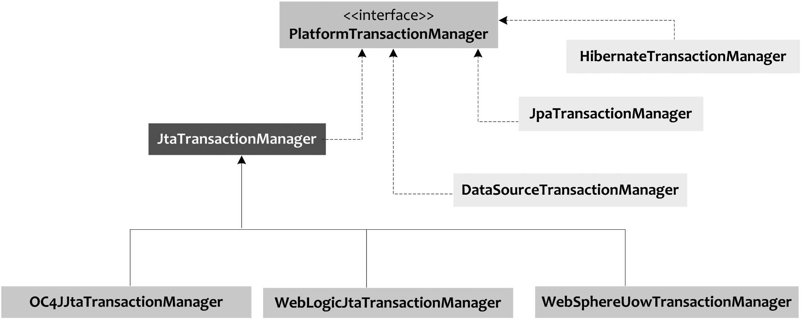

# 지옥 스터디 - 05 서비스 추상화

## 사용자 레벨 관리 기능
- UserDao 는 간단한 CRUD 기능만을 제공한다.
- 여기에 사용자 레벨 관리 라는 비즈니스 로직을 추가해보자.
- 구현해야 할 비즈니스 로직은 다음과 같다.
  - 사용자의 레벨은 BASIC, SILVER, GOLD 세 가지
  - 최초 가입시 BASIC 레벨이며 활동에 따라 변경될 수 있다.
  - 가입후 50회 이상 로그인시 SILVER LEVEL
  - SILVER 레벨일때 30번 이상 추천을 받으면 GOLD LEVEL 이 된다.
  - 사용자 레벨 변경 작업은 일정 주기로 일괄적으로 처리된다. 작업 전에는 변경작업이 일어나지 않는다.

### Level enum 의 사용

`User.java`

```java
public class User {
    String id;
    String name;
    String password;
    int level; // ???
    int login;
    int recommend;
    
    // ...
}
```
- 사용자의 LEVEL 을 정수형 데이터의 상수로 처리한다고 가정해보자.
- BASIC, SILVER, GOLD 와 같이 상수로 선언해두고 처리하면 다음과 같이 깔끔하게 처리가 가능해진다.

```java
if (user.getLevel() == User.BASIC) {
    // 레벨업 처리...    
}
```
- 하지만 이런 방식은 문제점이 있는데, 바로 **휴먼 에러에 취약** 하다는 점이다.
- 상수로 정의해 두긴 했지만, 다른 정수 데이터가 들어가도 컴파일러가 잡아주지 못한다.
- 때문에 의도치 않은 버그가 발생할 확률이 높다.
- 이런 경우 상수보다는 **ENUM** 을 사용하는 것이 안전하다.

`Level.java`

```java
public enum Level {
    BASIC(1), SILVER(2), GOLD(3);

    private final int value;

    Level(int value) {
        this.value = value;
    }

    /**
     * Getter 사용을 **지양** 해야한다.
     * Getter 는 객체를 객체로 존중하는 것이 아닌, 무시하고 데이터 자료구조로 쓰이게만 할 뿐이다.
     * 또한 내부 필드 (구현) 이 그대로 노출된다.
     */
    public int intValue() {
        return value;
    }

    public static Level valueOf(int value) {
        switch (value) {
            case 1 : return BASIC;
            case 2 : return SILVER;
            case 3 : return GOLD;
            default : throw new AssertionError("Unknown value : " + value);
        }
    }
}

```
- 여기서 값을 가져오는 메소드를 getValue() 가 아닌 intValue() 라고 정의했다.
- 이게 뭔 대수인가?.. 라고 생각할 수도 있지만 객체지향 개발을 하면서 무의식적인 Getter 사용을 많이하는데 이는 **지양** 해야 할 방식이다.
- Getter 는 객체를 객체로 존중하는 것이 아닌 **데이터 자료구조** 로 취급해 사용하는 것과 동일하다.
- 그렇다면 객체와 자료구조의 차이는 뭘까 ?..

`객체와 자료구조`
- 다음은 C 코드로 구현한 자료구조

```c
struct Cash {
  int dollars;
}
```

- 다음은 C++ 에서 자료구조가 아닌 **객체** 표현
```cpp
#include <string>

class Cash {
  public:
    Cash(int v): dollars(v) {};
    std:string print() const;
  private:
    int dollars; 
}
```

- 이 두방식의 차이는 뭘까요 ??

```cpp
// c
printf("Cash value is %d", cash.dollars);

// c++
printf("Cash value is %s", cash.print());
```
- struct (자료구조) 로 선언한 경우 멤버인 dollars 에 접근한 뒤 해당 값을 취급한다.
  - struct 인 Cash 는 아무것도 하고 있지 않다.
  - 이는 단순한 데이터 자료구조
- class 로 선언한 경우 멤버 dollars 에 접근하는 것이 아닌, print() 함수를 통해 **객체에게 출력해달라고 요청** 한다.
  - 내부에 자신이 가진 필드를 외부로 노출하지 않는다.
  - dollars 라는 필드가 있는지 조차 알 수 없다.

> 이런 방식이 OOP 가 지향하는 설계 원칙중 하나인 **캡슐화**

- 자료구조는 **투명** 하지만, 객체는 **불투명** 하다.
- 자료구조는 **수동적** 이지만 객체는 **능동적** 이다.
- 근본적으로 getter/setter 는 캡슐화 원칙을 **위반** 한다.
- 메소드를 통해 호출하지만, 근본적으로 내부에 있는 필드가 어떤것인지 **외부에 노출** 하고 있으며, 사실상 직접접근하는 것과 차이가 없다.
- 이런 getter setter 방식은 **클래스를 자료구조로써 다루기 위해 도입된 방식** 이다.

```java
class Cash {
    private final int value;
    
    Cash(int value) {
        this.value = value;
    }
    
    public int getDollars() {
        return this.value;
    }
    
    public int dollars() {
        return this.value;
    }
}
```
- getDollars() 와 dollars() 메소드의 차이는 뭘까요 ?...
- 이 차이는 근본적으로 매우 중요하다.
- getDollars() 는, **데이터 중 dollars 를 찾아 반환하라.** 라고 이야기 하는 것 
- dollars() 는 **얼마나 많은 달러가 있나요?** 하고 객체에게 묻는 것
- getter/setter 는 객체지향 프로그래밍에서 지양해야할 **안티 패턴** 중 하나이다.

> 우리는 지금까지 어떤식의 개발을 해왔는지 한번 돌아보는 시간을 가졌으면 좋겠습니다.

`개선된 User.java`

```java
public class User {
    String id;
    String name;
    String password;
    Level level;
    int login;
    int recommend;

    public User() {
    }
  
    public User(String id, String name, String password, Level level, int login, int recommend) {
      this.id = id;
      this.name = name;
      this.password = password;
      this.level = level;
      this.login = login;
      this.recommend = recommend;
    }
}
```

### 사용자 수정 기능
- 비즈니스 로직에 따라 사용자 정보는 수정이 가능하다.
- 성능을 극대화 하기 위해 필드 종류에 따라 각각 수정용 DAO 를 만들어야 할 때도 있다.
- 하지만 대부분의 경우 전체 update 를 하는게 성능이 더 좋다.
  - 컬럼이 30개 이상 넘어가지 않는경우 대부분 전체 update 방식이 성능이 더 좋음

`수정 기능 테스트`

```java
class UserDaoTest {
    
    // ...
    
    @Test
    void update() throws Exception {
      dao.deleteAll();

      dao.add(user1);

      user1.setName("엔쿠쿠다스");
      user1.setPassword("password2");
      user1.setLevel(Level.GOLD);
      user1.setLogin(1_000);
      user1.setRecommend(999);
      dao.update(user1);

      User updatedUser1 = dao.get(user1.getId());
      checkSameUser(user1, updatedUser1);
    }

    private void checkSameUser(User user1, User user2) {
      assertThat(user1.getId()).isEqualTo(user2.getId());
      assertThat(user1.getName()).isEqualTo(user2.getName());
      assertThat(user1.getPassword()).isEqualTo(user2.getPassword());
      assertThat(user1.getLevel()).isEqualTo(user2.getLevel());
      assertThat(user1.getLogin()).isEqualTo(user2.getLogin());
      assertThat(user1.getRecommend()).isEqualTo(user2.getRecommend());
    }
}
```
- User Fixture 를 생성하고, update 호출후에 DB 에 반영된 데이터가 제대로 수정되었는지 확인하는 테스트

`UserDao`

```java
public interface UserDao {

    void add(User user);

    User get(String id);

    List<User> getAll();

    void deleteAll();

    int getCount();

    void update(User user);
}

public class UserDaoJdbc implements UserDao {

    // ...
    @Override
    public void update(User user) {
      jdbcTemplate.update(
              "update users set name = ?, password = ?, level = ?, login = ?, recommend = ? "
                      + "where id = ? ",
              user.getName(), user.getPassword(), user.getLevel().intValue(), user.getLogin(), user.getRecommend(),
              user.getId()
      );
    }
}
```

### 레벨 관리 기능 구현
- 사용자 관리로직은 비즈니스 로직이기 때문에 DAO 에 구현하는 것은 좋지 않다.
  - DAO -> 데이터를 어떻게 가져오고 다룰 것인가가 관심사이다.
- 비즈니스 로직 처리를위한 UserService 를 정의하고, UserService 는 UserDao 에 의존하도록 구현한다.


#### upgradeLevels

`UserService`

```java
public class UserService {
    UserDao userDao;

    public void setUserDao(UserDao userDao) {
        this.userDao = userDao;
    }

    public void upgradeLevels() {
        List<User> users = userDao.getAll();
        for (User user : users) {
            Boolean changed = null;

            // BASIC LEVEL 업그레이드
            if (user.getLevel() == Level.BASIC && user.getLogin() >= 50) {
                user.setLevel(Level.SILVER);
                changed = true;
            } else if (user.getLevel() == Level.SILVER && user.getRecommend() >= 30) {
                // SILVER LEVEL 업그레이드
                user.setLevel(Level.GOLD);
                changed = true;
            } else if (user.getLevel() == Level.GOLD) {
                changed = false;
            } else {
                changed = false;
            }

            if (changed) {
                userDao.update(user);
            }
        }
    }
}
```
- UserDao 를 이용해 UserService 를 구현
1. 모든 유저목록을 가져온다.
2. 현재 레벨을 확인한다.
3. 레벨 업 조건을 확인한다.
4. 조건에 맞다면 레벨업 처리를 한다.
5. 레벨이 변경되었다면 DB 에 반영한다.


`UserServiceTest`

```java
@ExtendWith(SpringExtension.class)
@ContextConfiguration(
    classes = DaoFactory.class
)
class UserServiceTest {

    @Autowired
    UserService userService;

    @Autowired
    UserDao userDao;

    List<User> users;

    @BeforeEach
    void setUp() {
        users = List.of(
            new User("ncucu", "엔꾸꾸", "p", Level.BASIC, 49, 0),
            new User("ncucu1", "엔꾸꾸1", "p1", Level.BASIC, 50, 0),
            new User("ncucu2", "엔꾸꾸2", "p2", Level.SILVER, 60, 29),
            new User("ncucu3", "엔꾸꾸3", "p3", Level.SILVER, 60, 30),
            new User("ncucu4", "엔꾸꾸4", "p4", Level.GOLD, 100, 100)
        );
    }
    
    @Test
    void upgradeLevels() {
        userDao.deleteAll();
        for (User user : users) {
            userDao.add(user);
        }
        userService.upgradeLevels();

        checkLevel(users.get(0), Level.BASIC);
        checkLevel(users.get(1), Level.SILVER);
        checkLevel(users.get(2), Level.SILVER);
        checkLevel(users.get(3), Level.GOLD);
        checkLevel(users.get(4), Level.GOLD);
    }
    
    private void checkLevel(User user, Level expectedLevel) {
        User updatedUser = userDao.get(user.getId());
        assertThat(updatedUser.getLevel()).isEqualTo(expectedLevel);
    }
}
```

#### add
- 사용자 레벨업 처리를 하는 비즈니스는 구현했지만, 최초 가입시 BASIC 등급이여야 한다는 비즈니스는 아직 구현하지 않은 상태
- 해당 비즈니스는 어디서 구현하는것 이 좋을까 ?
  - DAO 는 레벨업 처리와 마찬가지로 적합하지 않다.
    - 관심사가 다르다.
  - User 클래스의 Level 필드를 아에 Level.BASIC 으로 초기화하는 것도 적합하지 않다.
    - 최초 가입시에만 유효한 정보인데 이걸 클래스에서 직접 초기화 하는것은 무의미하다.
- 해당 비즈니스는 UserService 의 add 메소드를 통해 구현하도록 한다.

`UserService`

```java
public class UserService {
    // ...
  
    public void add(User user) {
        if (user.getLevel() == null) {
            user.setLevel(Level.BASIC);
        }
        userDao.add(user);
    }
}
```
- User 의 Level 이 NULL 일 경우에만 BASIC Level 로 지정하도록 비즈니스 구현을 했다.
  - 이유 ? -> 모종의 사유로 가입시 바로 등급을 부여하거나 하는 경우가 있을 수도 있다.

`UserServiceTest`

```java
@ExtendWith(SpringExtension.class)
@ContextConfiguration(
    classes = DaoFactory.class
)
class UserServiceTest {
    // ...

    @Test
    void add() {
        userDao.deleteAll();

        // GOLD 레벨로 지정되어 있다면 레벨이 초기화되지 않아야됨
        User userWithLevel = users.get(4);
        User userWithoutLevel = users.get(0); // Level 이 지정되어 있지 않다면 BASIC 으로 지정
        userWithoutLevel.setLevel(null);

        userService.add(userWithLevel);
        userService.add(userWithoutLevel);

        User userWithLevelRead = userDao.get(userWithLevel.getId());
        User userWithoutLevelRead = userDao.get(userWithoutLevel.getId());

        assertThat(userWithLevelRead.getLevel()).isEqualTo(userWithLevel.getLevel());
        assertThat(userWithoutLevelRead.getLevel()).isEqualTo(Level.BASIC);
    }

    private void checkLevel(User user, Level expectedLevel) {
        User updatedUser = userDao.get(user.getId());
        assertThat(updatedUser.getLevel()).isEqualTo(expectedLevel);
    }
}
```

### 코드 개선
- 비즈니스 로직은 모두 구현 했으나 구현했던 코드를 살펴보면 좀 많이 불편하다..

#### upgradeLevels 메소드의 문제
- for-loop 내에 존재하는 if else-if else 블록이 섞여있고 각 로직들을 이해하기가 쉽지 않다.
- 플래그값을 이용해 update 하는 방식도 썩 만족스러운 방식은 아니다.

> 문제의 원흉은, 서로 다른 성격을 가진 코드가 한곳에 섞여있기 때문이다

- 현 구조에서 새로운 레벨이 추가된다면, enum 에도 추가하고 if 절도 추가되어야 한다..!
- 점점 갈수록 이해하기 힘들고 관리가 힘들어 질 것이다.

`upgradeLevels 리팩토링`

```java
public class UserService {
    // ...
  
    public void upgradeLevels() {
        List<User> users = userDao.getAll();
        for (User user : users) {
            if (canUpgradeLevel(user)) {
                upgradeLevel(user);
            }
        }
    }

    private boolean canUpgradeLevel(User user) {
        Level currentLevel = user.getLevel();
        switch (currentLevel) {
            case BASIC : return user.getLogin() >= 50;
            case SILVER : return user.getRecommend() >= 30;
            case GOLD : return false;
            default : throw new IllegalArgumentException("Unknown Level : " + currentLevel);
        }
    }

    private void upgradeLevel(User user) {
        if (user.getLevel() == Level.BASIC) {
            user.setLevel(Level.SILVER);
        } else if (user.getLevel() == Level.SILVER) {
            user.setLevel(Level.GOLD);
        }
        userDao.update(user);
    }
}
```
- 성격이 서로 다른 코드를 메소드를 이용해 분리했다.
- upgradeLevels 메소드는 기본적인 작업의 흐름을 담당하고, canUpgradeLevel 을 통해 레벨업 가능한지 여부룰 우선 판단한다.
- 레벨업이 가능하다고 판단했다면 upgradeLevel 을 통해 레벨업 처리를 하고 DB 에 이를 반영한다.
- 전체적으로 개선이 되었지만, 한가지 거슬리는 부분은 실제 Level 처리를 담당하는 upgradeLevel 메소드 이다.
- **레벨의 순서와 다음 레벨이 무엇인지 에 대한 관심** 이 해당 메소드에 녹아있다.
  - 이는 Level 을 담당하는 Level 객체의 관심사다.
- 레벨은 유저 객체의 **상태** 이다.
- 유저 객체 스스로의 상태를 변경하도록 변경한다.

`Level`

```java
public enum Level {
    GOLD(3, null),
    SILVER(2, Level.GOLD),
    BASIC(1, Level.SILVER),
    ;

    private final int value;
    private final Level next;

    Level(int value, Level next) {
        this.value = value;
        this.next = next;
    }

    /**
     * Getter 사용을 **지양** 해야한다.
     * Getter 는 객체를 객체로 존중하는 것이 아닌, 무시하고 데이터 자료구조로 쓰이게만 할 뿐이다.
     * 또한 내부 필드 (구현) 이 그대로 노출된다.
     */
    public int intValue() {
        return value;
    }

    public Level nextLevel() {
        return next;
    }

    public static Level valueOf(int value) {
        switch (value) {
            case 1 : return BASIC;
            case 2 : return SILVER;
            case 3 : return GOLD;
            default : throw new AssertionError("Unknown value : " + value);
        }
    }
}
```

`User`

```java
public class User {
    String id;
    String name;
    String password;
    Level level;
    int login;
    int recommend;

    public User() {
    }

    public User(String id, String name, String password, Level level, int login, int recommend) {
        this.id = id;
        this.name = name;
        this.password = password;
        this.level = level;
        this.login = login;
        this.recommend = recommend;
    }

    public void upgradeLevel() {
        Level nextLevel = this.level.nextLevel();
        if (nextLevel == null) {
            throw new IllegalStateException(level + "은 업그레이드 불가능합니다.");
        }
        this.level = nextLevel;
    }
}
```
- Level 은 레벨에 대한 책임을 가지고 있고, 다음 레벨이 무엇인지 알고 있다.
- User 객체는 레벨이라는 스스로의 상태를 변경한다.
- 이 과정에서 nextLevel() 메소드를 통해 Level 과 메세지를 주고받는 **협력관계** 가 되었다.

`개선된 upgradeLevel()`

```java
public class UserService {
    UserDao userDao;

    public void upgradeLevels() {
        List<User> users = userDao.getAll();
        for (User user : users) {
            if (canUpgradeLevel(user)) {
                upgradeLevel(user);
            }
        }
    }

    private boolean canUpgradeLevel(User user) {
        Level currentLevel = user.getLevel();
        switch (currentLevel) {
            case BASIC : return user.getLogin() >= 50;
            case SILVER : return user.getRecommend() >= 30;
            case GOLD : return false;
            default : throw new IllegalArgumentException("Unknown Level : " + currentLevel);
        }
    }

    private void upgradeLevel(User user) {
        user.upgradeLevel();
        userDao.update(user);
    }
}
```
- 개선된 UserService 를 살펴보면 canUpgradeLevel 메소드를 통해 해당 유저가 레벨업 대상인지 확인한다.
- 그 후 user 에게 레벨업 처리를 하라는 요청을 한뒤, userDao 를 이용해 이를 반영한다.
- 개선전에 비해 비즈니스 흐름 파악도 쉬워지고 코드도 단순해졌다.
- 하지만 여기서 찜찜한점 ? -> canUpgradeLevel 메소드
  - **레벨업 대상인지 여부** 를 UserService 에서 판단하고 있다.
  - 이것도 하나의 비즈니스 라고 판단할 수도 있겠지만, 이를 서비스에서 담당해야 하는가 ? 는 생각해볼만 하다.
  - 이는 **사용자 레벨업 정책** 이라고 볼 수 있는데, 해당 정책이 변경된다고 가정하면 어떻게 될까 ?
  - 지금이야 서비스의 로직이 얼마 되지 않아 변경에 문제는 없지만 추후 서비스 로직이 추가되고 수많은 메소드들 중에 관련 처리를 찾아 수정해야 한다.
  - 또한 이전과 마찬가지로 User 객체의 **getLevel()** 을 통해 사용자 레벨을 가져와 나열하고 이를 기준으로 여러가지 판단을 하고 있다.
  - 이는 객체지향적인 코드와는 거리가 조금 멀다.
- 스탭을 한단계 나아가서 **사용자 레벨업 정책** 클래스를 정의하고, 이를 UserService 에서 분리해보자.

`UserLevelUpgradePolicy`

```java
public interface UserLevelUpgradePolicy {
    boolean canUpgradeLevel(User user);
    void upgradeLevel(User user);
}
```

```java
public class DefaultUserLevelUpgradePolicy implements UserLevelUpgradePolicy {

    public static final int MIN_LOGIN_COUNT_FOR_SILVER = 50;
    public static final int MIN_RECOMMEND_FOR_GOLD = 30;

    @Override
    public boolean canUpgradeLevel(User user) {
        Level currentLevel = user.getLevel();
        switch (currentLevel) {
            case BASIC:
                return user.getLogin() >= MIN_LOGIN_COUNT_FOR_SILVER;
            case SILVER:
                return user.getRecommend() >= MIN_RECOMMEND_FOR_GOLD;
            case GOLD:
                return false;
            default:
                throw new IllegalArgumentException("Unknown Level : " + currentLevel);
        }
    }

    @Override
    public void upgradeLevel(User user) {
        user.upgradeLevel();
    }
}
```
- UserLevelUpgradePolicy 인터페이스를 선언하고, 이를 DefaultUserLevelUpgradePolicy 클래스가 구현하도록 했다.
- 현재 기본정책은 서비스에 구현되었던 코드를 그대로 가져온다.
- 추후에 정책이 바뀌거나, 이벤트나 프로모션 기간중에 적용할 정책이 필요하다면 UserLevelUpgradePolicy 인터페이스를 구현하기만 하면 된다.

## 트랜잭션 서비스 추상화
- 사용자 레벨 관리 기능에대한 구현을 마치고 테스트를 통한 검증도 완료 했지만 한가지 걸리는게 있다.
  - 사용자 레벨 관리 작업 수행중 네트워크 나 서버에 장애가 발생하면 어떻게 되나요 ?
- 만약 장애가 발생한다면 진행되었던 작업도 모두 취소시키도록 한다.
  - 일부 사용자는 레벨이 조정됬지만 일부는 그대로인 이런 문제보다는 차라리 모두 조정되지 않았다가 재 작업하는것이 훨씬 낫다.

### 모 아니면 도

`테스트용 UserService **대역**`
- 지금 필요한건 **예외** 테스트 이다.
- 사용자 레벨업 작업 도중 예외가 발생하는 테스트가 필요한데, 이를 위해 실제 UserService 객체의 구현을 변경하는 것은 좋은 방법이 아니다.
- 이런 경우 UserService 를 대신할 **테스트 대역 (test double)** 이 필요하다.
- 테스트용으로 UserService 를 상속받는 클래스를 만들고, upgradeLevels() 메소드를 override 해 특정 시점에서 예외가 발생하도록 한다.

```java
@ExtendWith(SpringExtension.class)
@ContextConfiguration(
    classes = DaoFactory.class
)
class UserServiceTest {
    
    // ...

    @Test
    void upgradeAllOrNothing() throws Exception {
        userDao.deleteAll();
        for (User user : users) {
            userDao.add(user);
        }

        TestUserService service = new TestUserService(users.get(3).getId());
        service.setUserDao(this.userDao);
        try {
            service.upgradeLevels();
            fail("TestUserServiceException expected"); // 예외가 발생하지 않는다면 실패
        } catch (TestUserServiceException ignored) {}
        checkLevel(users.get(1), false);
    }

    private void checkLevel(User user, boolean upgraded) {
        User updatedUser = userDao.get(user.getId());
        Level expectedLevel = upgraded ? user.getLevel().nextLevel() : user.getLevel();
        assertThat(updatedUser.getLevel()).isEqualTo(expectedLevel);
    }

    // 테스트용 UserService
    static class TestUserService extends UserService {
        private String id;

        public TestUserService(String id) {
            this.id = id;
        }

        @Override
        protected void upgradeLevel(User user) {
            if (user.getId().equals(this.id)) {
                throw new TestUserServiceException();
            }
            super.upgradeLevel(user);
        }
    }

    static class TestUserServiceException extends RuntimeException {}
}
```
- 테스트 대역을 담당할 TestUserService 는, 특정 ID 를 만나면 TestUserServiceException 예외를 발생시킨다.
- 예외 테스트를 위한 upgradeAllOrNothing 메소드를 살펴보면 TestUserService 를 이용해 예외에 대한 테스트를 수행한다.
- 예외가 발생하지 않으면 테스트는 실패하고, 예외가 발생했다면 우리가 원하는 시나리오 대로 모두 레벨업 처리가 되지 않아야한다.
- 하지만 이 테스트는 **실패** 한다.

### 테스트 실패의 원인
- 위 테스트가 실패한 원인은 **트랜잭션** 때문이다.
- upgradeLevels() 메소드의 작업이 하나의 트랜잭션 내에서 동작하지 않았다.

### JDBC 트랜잭션 경계 설정
- 다음은 JDBC 를 이용해 트랜잭션을 적용하는 가장 간단한 예제

```java
Connection c = dataSource.getConnection();
c.setAutoCommit(false);

try {
    // ...
    c.commit(); // 커밋    
} catch (Exception e) {
    c.rollback(); // 롤백
}
c.close();
```
- JDBC 의 트랜잭션은, **하나의 Connection** 에서 이뤄진다.
  - 즉 커넥션 하나당, 하나의 트랜잭션이라는 의미
- JDBC 에서는 기본적으로 DB 작업 수행 직후 자동으로 커밋이 되도록 지정되어 있다.
  - 이를 위해 autoCommit = false 로 지정해 주어야한다.
- 트랜잭션이 시작되면, commit/rollback 이 수행될때 까지의 작업 결과가 하나의 트랜잭션으로 묶인다.
- 이런식으로 트랜잭션의 **시작을 선언** 하고, 트랜잭션의 **종료하는 작업** 을 **트랜잭션 경계설정** 이라고 한다.
- 하나의 커넥션 내에서 만들어지는 트랜잭션을, **로컬 트랜잭션** 이라고도 한다.

### UserService 와 UserDao 의 트랜잭션 문제
- UserService 와 UserDao 에 왜 트랜잭션이 적용되지 않았는가 ? -> 트랜잭션을 지정하는 코드가 없다.
  - 트랜잭션을 지정하는 코드는 Connection 객체를 활용한다.
  - JdbcTemplate 으로 전환한 이후 이런 코드는 구경도 못했다..!
- JdbcTemplate 은 JdbcContext 와 흐름이 거의 유사하다.
- 하나의 템플릿 메소드내에서 커넥션을 가져오고, DB 작업을 처리한뒤 커넥션을 닫아버린다..!
  - 즉 JdbcTemplate 의 메소드를 호출할때 마다 매번 트랜잭션이 새로 시작되고, 종료되는 일이 반복되는 것이다.
- 정리하면 JdbcTemplate 을 사용하는 UserDao 는 모두 **독립적인 트랜잭션** 으로 실행되고 있던 것이다.

### 비즈니스 로직 내의 트랜잭션 경계 설정
- 이 문제를 해결하기 위해 DAO 메소드 내부로 upgradeLevels 로직을 옮기는 것은 바람직 하지 않다.
- 지금까지 개선했던 수고들이 모두 물거품된다.
- 현재 구조를 유지하면서 트랜잭션을 적용하려면 트랜잭션 경계설정 작업은 **UserService** 로 가져와야 한다.
- 지금 까지 고민한 구조대로 UserService 와 UserDao 를 변경한다고 하면 인터페이스는 다음과 같이 변경될 것이다..

`UserService`

```java
class UserService {
    
    public void upgradeLevels() throws Exception {
        Connection c = dataSource.getConnection();
        c.setAutoCommit(false);
  
        try {
          // ...
          upgradeLevel(c, user);
          // ...
          c.commit(); // 커밋    
        } catch (Exception e) {
          c.rollback(); // 롤백
        }
        c.close();
    }
    
    protected void upgradeLevel(Connection c, User user) {
        user.upgradeLevel();
        userDao.update(c, user);
    }
}

interface UserDao {
    void update(Connection c, User user);
}
```
- JDBC 를 활용한 트랜잭션 경계 설정은, Connection 객체를 활용해야 하기 떄문에 위와 같은 구조를 띌 수 밖에 없다.
- 하지만 이 방식의 가장 큰 문제는 트랜잭션 경계에 존재하는 모든 메소드가 Connection 파라미터를 받아야하고, 
- UserService 가 **JDBC 에 종속적인 코드가 되어버린다** 는 것이다. 

### 스프링 트랜잭션 동기화
- 스프링에서는 위의 문제를 해결해주는 **멋진** 방법을 제공해준다.
- 바로 독립적인 **트랜잭션 동기화** 방식 이다.
  - 트랜잭션을 시작하기 위해 Connection 객체를 특별한 저장소에 저장해두고, 이후 호출되는 DAO 에서 이를 가져와 사용하게 하는 방식이다.


### 트랜잭션 동기화 적용

```java
public class UserService {
    
    // ... 
  
    DataSource dataSource;

    public void upgradeLevels() {
        TransactionSynchronizationManager.initSynchronization();
        Connection c = DataSourceUtils.getConnection(dataSource);
        try {
            c.setAutoCommit(false);

            List<User> users = userDao.getAll();
            for (User user : users) {
                if (canUpgradeLevel(user)) {
                    upgradeLevel(user);
                }
            }

            c.commit();
        } catch (Exception e) {
            try {
                c.rollback();
            } catch (SQLException ex) {
            }
            try {
                throw e;
            } catch (SQLException ex) {
            }
        } finally {
            DataSourceUtils.releaseConnection(c, dataSource);
            TransactionSynchronizationManager.unbindResource(dataSource);
            TransactionSynchronizationManager.clearSynchronization();
        }

    }
}

```
- 스프링은 트랜잭션 동기화 기능을 지원하는 유틸리티 메소드를 제공한다.
- TransactionSynchronizationManager 를 이용해 트랜잭션 동기화 작업을 수행한다.
- 커넥션을 다룰때 스프링이 제공하는 DataSourceUtils 를 사용하는 이유는, 커넥션을 다룰뿐 아니라 트랜잭션 동기화를 위한 저장소에도 이를 바인딩 해주기 때문이다.

`DataSourceUtils.java`

```java
class DataSourceUtils {

  // ...
  public static Connection doGetConnection(DataSource dataSource) throws SQLException {
    Assert.notNull(dataSource, "No DataSource specified");

    ConnectionHolder conHolder = (ConnectionHolder) TransactionSynchronizationManager.getResource(dataSource);
    if (conHolder != null && (conHolder.hasConnection() || conHolder.isSynchronizedWithTransaction())) {
      conHolder.requested();
      if (!conHolder.hasConnection()) {
        logger.debug("Fetching resumed JDBC Connection from DataSource");
        conHolder.setConnection(fetchConnection(dataSource));
      }
      return conHolder.getConnection();
    }
    // Else we either got no holder or an empty thread-bound holder here.

    logger.debug("Fetching JDBC Connection from DataSource");
    Connection con = fetchConnection(dataSource);

    if (TransactionSynchronizationManager.isSynchronizationActive()) {
      try {
        // Use same Connection for further JDBC actions within the transaction.
        // Thread-bound object will get removed by synchronization at transaction completion.
        ConnectionHolder holderToUse = conHolder;
        if (holderToUse == null) {
          holderToUse = new ConnectionHolder(con);
        }
        else {
          holderToUse.setConnection(con);
        }
        holderToUse.requested();
        TransactionSynchronizationManager.registerSynchronization(
                new ConnectionSynchronization(holderToUse, dataSource));
        holderToUse.setSynchronizedWithTransaction(true);
        if (holderToUse != conHolder) {
          TransactionSynchronizationManager.bindResource(dataSource, holderToUse);
        }
      }
      catch (RuntimeException ex) {
        // Unexpected exception from external delegation call -> close Connection and rethrow.
        releaseConnection(con, dataSource);
        throw ex;
      }
    }

    return con;
  }
}
```
- DataSourceUtils 의 메소드 중 일부.. 살펴보면 TransactionSynchronizationManager 를 통해 Connection 객체를 가져오는데 이는 **ConnectionHolder** 타입
- TransactionSynchronizationManager.initSynchronization(); 이 호출된 이후에만 ConnectionHolder 를 통한 동일 트랜잭션 내에서 같은 커넥션 객체를 공유한다.

`ConnectionHolder.java`

```java
public class ConnectionHolder extends ResourceHolderSupport {

  /**
   * Prefix for savepoint names.
   */
  public static final String SAVEPOINT_NAME_PREFIX = "SAVEPOINT_";


  @Nullable
  private ConnectionHandle connectionHandle;

  @Nullable
  private Connection currentConnection;

  private boolean transactionActive = false;

  @Nullable
  private Boolean savepointsSupported;

  private int savepointCounter = 0;
  
  public Connection getConnection() {
    Assert.notNull(this.connectionHandle, "Active Connection is required");
    if (this.currentConnection == null) {
      this.currentConnection = this.connectionHandle.getConnection();
    }
    return this.currentConnection;
  }
  // ..
}
```
- ConnectionHolder 가 하는 역할을 JavaDoc 을 참고하면 다음과 같은데..

```text
Resource holder wrapping a JDBC Connection. DataSourceTransactionManager binds instances of this class to the thread, for a specific javax.sql.DataSource.
Inherits rollback-only support for nested JDBC transactions and reference count functionality from the base class.
```
- ConnectionHolder 는 JDBC Connection 을 래핑하고 있다.
- DataSourceTransactionManager 는 특정 DataSource 에 대해 ConnectionHolder 인스턴스를 스레드에 바인딩한다.
- 중첩 JDBC 트랜잭션 참여 및 rollback 전용을 지원한다.

> Connection 의 트랜잭션 기능을 확장하기 위한 클래스..

- ConnectionHolder 의 getConnection() 메소드는, currentConnection, connectionHandle 의 참조를 가지고 있는데
- 실제 커넥션 객체가 없다면, ConnectionHandle 을 통해 커넥션을 반환해준다.

`TransactionSynchronizationManager`

```java
class TransactionSynchronizationManager {
    // ..

    private static final ThreadLocal<Map<Object, Object>> resources =
            new NamedThreadLocal<>("Transactional resources");
  
    private static final ThreadLocal<Set<TransactionSynchronization>> synchronizations =
            new NamedThreadLocal<>("Transaction synchronizations");
  
    private static final ThreadLocal<String> currentTransactionName =
            new NamedThreadLocal<>("Current transaction name");
  
    private static final ThreadLocal<Boolean> currentTransactionReadOnly =
            new NamedThreadLocal<>("Current transaction read-only status");
  
    private static final ThreadLocal<Integer> currentTransactionIsolationLevel =
            new NamedThreadLocal<>("Current transaction isolation level");
  
    private static final ThreadLocal<Boolean> actualTransactionActive =
            new NamedThreadLocal<>("Actual transaction active");

    public static void initSynchronization() throws IllegalStateException {
      if (isSynchronizationActive()) {
        throw new IllegalStateException("Cannot activate transaction synchronization - already active");
      }
      synchronizations.set(new LinkedHashSet<>());
    }
    
    public static void registerSynchronization(TransactionSynchronization synchronization)
            throws IllegalStateException {
  
      Assert.notNull(synchronization, "TransactionSynchronization must not be null");
      Set<TransactionSynchronization> synchs = synchronizations.get();
      if (synchs == null) {
        throw new IllegalStateException("Transaction synchronization is not active");
      }
      synchs.add(synchronization);
    }
}
```
- TransactionSynchronizationManager 는 **ThreadLocal** 기반으로 트랜잭션 관련 리소스들을 관리한다.
- 그 말은 ?... 
  - Thread-Safe 하다.
  - 별도 스레드를 이용한 작업시 동작하지 않는다...!
  - ThreadLocal 기반 기술들은 사용시 유의해야 한다.
  - Spring Security 라던가 ..

> JDBC 를 활용한 트랜잭션 경계설정 방식과 비교 했을때 간단한 트랜잭션 동기화 작업을 붙여 줌으로 인해 Connection 객체를 여기저기 달고다니는 지저분한 구현이 사라졌다.

### JdbcTemplate 과 트랜잭션 동기화
- 한가지 궁금한점 ? -> JdbcTemplate 은 직접 Connection 을 생성하고 종료하는 일을 모두 담당한다.
- TransactionSynchronizationManager 를 이용해 커넥션을 저장해 두었을때 이를 어떻게 가져와서 처리하는건가 ?..
- 이는 다음 메소드 하나로 모든 설명이 된다.

```java
class JdbcTemplate {
    // ...

    @Nullable
    private <T> T execute(StatementCallback<T> action, boolean closeResources) throws DataAccessException {
      Assert.notNull(action, "Callback object must not be null");
  
      Connection con = DataSourceUtils.getConnection(obtainDataSource());
      Statement stmt = null;
      try {
        stmt = con.createStatement();
        applyStatementSettings(stmt);
        T result = action.doInStatement(stmt);
        handleWarnings(stmt);
        return result;
      }
      catch (SQLException ex) {
        // Release Connection early, to avoid potential connection pool deadlock
        // in the case when the exception translator hasn't been initialized yet.
        String sql = getSql(action);
        JdbcUtils.closeStatement(stmt);
        stmt = null;
        DataSourceUtils.releaseConnection(con, getDataSource());
        con = null;
        throw translateException("StatementCallback", sql, ex);
      }
      finally {
        if (closeResources) {
          JdbcUtils.closeStatement(stmt);
          DataSourceUtils.releaseConnection(con, getDataSource());
        }
      }
    }
}
```
- JdbcTemplate 도 DataSourceUtils 를 통해 Connection 을 얻어 오기 때문에 저장소에 저장되어 있던 커넥션 객체를 가져와 이를 활용한다.
- 이전에 DataSourceUtils 과 관련된 내용을 훑어봤기 때문에 딱히 설명은 필요없을거라 생각한다..!

### 기술과 환경에 종속되는 트랜잭션 경계 코드
- 스프링 트랜잭션 동기화 방식을 이용해 문제를 해결하긴 했지만.. 한가지 걸리는게 있다.
  - 서비스 코드가 JDBC 에 종속되어 있다.
  - 별도의 트랜잭션 매니저를 통해 관리하는 글로벌 트랜잭션을 사용해야 한다거나,, JTA, JMS 같은 메세징 API 의 트랜잭션 처리를 해야할 경우 Service 코드를 수행해야 한다...!
- 다행인 점은 트랜잭션 경계를 설정하는 코드는 **일정한 패턴을 가지는 유사한 구조** 라는 점이다.
- 이런 방식으로 공통점이 있다면 **추상화** 를 고민해 볼만 하다.

### 스프링 트랜잭션 서비스 추상화
- 스프링은 트랜잭션 기술의 공통점을 담은 트랜잭션 추상화 기술을 제공한다.
- 이를 이용하면 애플리케이션 코드에서 직접 각 기술의 API 를 이용하지 않고도, **일관된 방식** 으로 트랜잭션을 제어하는 경계설정 작업이 가능해진다.
- 이는 스프링의 3대 핵심요중 하나인 **PSA (Portable Service Abstraction)** 이다.

`PSA`
- PSA(Portable Service Abstraction)는 일관성있는 추상화다.
- 서비스 추상화의 가장 좋은예는 JDBC 이다.
- JDBC 라는 표준스펙이 존재하기 때문에 DBMS를 오라클을 사용하던 , MYSQL 을 사용하던 공통된 방식으로 코드를 작성할 수 있다.
- 데이터베이스 종류에 관계없이 같은방식으로 제어 할수있는 디자인패턴 (어댑터 패턴) 을 적용해 다수의 기술을 공통 인터페이스로 제어할수있도록 한 것을 서비스 추상화 라고한다.
- 스프링은 OXM, ORM, 캐시, 트랜잭션 등 다양한 기술에 대한 PSA 를 제공한다.

`트랜잭션 추상화 계층 구조`



`스프링 트랜잭션 서비스 추상화 적용`

```java
public class UserService {
    
    // ...
    public void upgradeLevels() {
      PlatformTransactionManager transactionManager = new DataSourceTransactionManager(dataSource);
  
      // 트랜잭션 시작
      TransactionStatus status = transactionManager.getTransaction(new DefaultTransactionDefinition());
      try {
        List<User> users = userDao.getAll();
        for (User user : users) {
          if (canUpgradeLevel(user)) {
            upgradeLevel(user);
          }
        }
  
        // 트랜잭션 커밋
        transactionManager.commit(status);
      } catch (RuntimeException e) {
        transactionManager.rollback(status);
        throw e;
      }
    }
}
```
- JDBC 로컬 트랜잭션을 사용하기 때문에, DataSourceTransactionManager 를 이용한다.
- transactionManager 를 통해 트랜잭션을 시작할 때, getTransaction 메소드를 이용하는데, 인자로 **DefaultTransactionDefinition** 를 넘긴다.
  - 이는 트랜잭션에 대한 속성정보를 담고 있다.
  - 자세한건 6장..
- 이전과 비슷한 구조로 트랜잭션을 시작하고, 커밋하고, 롤백하는 구조로 이를 사용한다.

`AbstractPlatformTransactionManager`

```java
abstract class AbstractPlatformTransactionManager implements PlatformTransactionManager, Serializable {
    // ...
    @Override
    public final TransactionStatus getTransaction(@Nullable TransactionDefinition definition)
            throws TransactionException {

      // Use defaults if no transaction definition given.
      TransactionDefinition def = (definition != null ? definition : TransactionDefinition.withDefaults());

      Object transaction = doGetTransaction();
      boolean debugEnabled = logger.isDebugEnabled();

      if (isExistingTransaction(transaction)) {
        // Existing transaction found -> check propagation behavior to find out how to behave.
        return handleExistingTransaction(def, transaction, debugEnabled);
      }

      // Check definition settings for new transaction.
      if (def.getTimeout() < TransactionDefinition.TIMEOUT_DEFAULT) {
        throw new InvalidTimeoutException("Invalid transaction timeout", def.getTimeout());
      }

      // No existing transaction found -> check propagation behavior to find out how to proceed.
      if (def.getPropagationBehavior() == TransactionDefinition.PROPAGATION_MANDATORY) {
        throw new IllegalTransactionStateException(
                "No existing transaction found for transaction marked with propagation 'mandatory'");
      }
      else if (def.getPropagationBehavior() == TransactionDefinition.PROPAGATION_REQUIRED ||
              def.getPropagationBehavior() == TransactionDefinition.PROPAGATION_REQUIRES_NEW ||
              def.getPropagationBehavior() == TransactionDefinition.PROPAGATION_NESTED) {
        SuspendedResourcesHolder suspendedResources = suspend(null);
        if (debugEnabled) {
          logger.debug("Creating new transaction with name [" + def.getName() + "]: " + def);
        }
        try {
          return startTransaction(def, transaction, debugEnabled, suspendedResources);
        }
        catch (RuntimeException | Error ex) {
          resume(null, suspendedResources);
          throw ex;
        }
      }
      else {
        // Create "empty" transaction: no actual transaction, but potentially synchronization.
        if (def.getIsolationLevel() != TransactionDefinition.ISOLATION_DEFAULT && logger.isWarnEnabled()) {
          logger.warn("Custom isolation level specified but no actual transaction initiated; " +
                  "isolation level will effectively be ignored: " + def);
        }
        boolean newSynchronization = (getTransactionSynchronization() == SYNCHRONIZATION_ALWAYS);
        return prepareTransactionStatus(def, null, true, newSynchronization, debugEnabled, null);
      }
    }

    protected abstract Object doGetTransaction() throws TransactionException;
}
```
- DataSourceTransactionManager 는 AbstractPlatformTransactionManager 를 상속받고 있고, AbstractPlatformTransactionManager 는 PlatformTransactionManager 인터페이스를 구현한다.
- 우리가 transactionManager 를 통해 트랜잭션을 시작할때 getTransaction 메소드를 호출했는데, 이는 PlatformTransactionManager 인터페이스에 정의되어 있고 AbstractPlatformTransactionManager 가 구현하고 있다.
- 이는 트랜잭션 시작을 위한 **템플릿** 메소드이다.
- 코드를 살펴보면 보면 실제 트랜잭션을 시작할때 doGetTransaction() 메소드인데 abstract 메소드로 선언되어 있다.
  - 벌써 부터 냄새가 난다..

`DataSourceTransactionManager`

```java
public class DataSourceTransactionManager extends AbstractPlatformTransactionManager
		implements ResourceTransactionManager, InitializingBean {
    // ...
    @Override
    protected Object doGetTransaction() {
      DataSourceTransactionObject txObject = new DataSourceTransactionObject();
      txObject.setSavepointAllowed(isNestedTransactionAllowed());
      ConnectionHolder conHolder =
              (ConnectionHolder) TransactionSynchronizationManager.getResource(obtainDataSource());
      txObject.setConnectionHolder(conHolder, false);
      return txObject;
    }
}
```
- 스프링의 최애 패턴이 적용되어 있음을 알 수 있다.
- 우리가 이전에 살펴보았던 TransactionSynchronizationManager 와 ConnectionHolder 를 활용하고 있다..!
  - 여기서 모든 의문이 풀린다..!

### 트랜잭션 기술 설정의 분리
- 트랜잭션 서비스 추상화를 적용한 UserService 에 글로벌 트랜잭션으로 변경을 해야한다면 어떻게 해야할까 ?
  - PlatformTransactionManager 의 구현체를 JTA 구현체로 변경하면 된다.
- 지금 소스코드에는 UserService 에서 new 키워드를 통해 직접 생성하고 있다.
  - 이는 DI 원칙에 위배된다.
- 지금까지 그래왔듯이 외부로 부터 주입받는 방식으로 개선하자.

```java
public class UserService {
    
    // ... 
  
    PlatformTransactionManager transactionManager;

    public void setTransactionManager(PlatformTransactionManager transactionManager) {
        this.transactionManager = transactionManager;
    }

    public void upgradeLevels() {
        // 트랜잭션 시작
        TransactionStatus status = transactionManager.getTransaction(new DefaultTransactionDefinition());
        try {
            List<User> users = userDao.getAll();
            for (User user : users) {
                if (canUpgradeLevel(user)) {
                    upgradeLevel(user);
                }
            }

            // 트랜잭션 커밋
            transactionManager.commit(status);
        } catch (RuntimeException e) {
            transactionManager.rollback(status);
            throw e;
        }
    }
}

```

## 서비스 추상화와 단일 책임 원칙

### 수직, 수평 계층구조와 의존관계
- 지금까지 살펴본 대로 기술과 서비스에 대한 추상화 기법을 활용하면 **특정 기술에 종속되지 않는 포터블한 코드** 를 만들 수 있따.
- UserDao / UserService 는 각각 담당하는 코드의 기능적인 관심에 따라 분리되고, 독자적으로 확장이 가능하다.
  - 이는 같은 계층으로 바라본 **수평적인 분리** 라고 할 수 있다.
- 하지만 트랜잭션 추상화는 조금 다르다.
- 애플리케이션의 비즈니스 로직과 / 그 밑에서 동작하는 로우레벨의 기술인 트랜잭션은 **전혀 다른 계층의 특성** 을 갖는 코드이다.


- UserService 는 스프링이 제공하는 PlatformTransactionManager 인터페이스를 통한 추상화 계층을 통해, 구체적인 트랜잭션 기술에 독립적인 코드가 됬다.
- 수평적 구분이던, 수직적 구분이던 자유로운 확장이 가능한 구조가 될 수 있는 것엔 스프링의 DI 가 중요한 역할을 하고 있다.
- DI 의 가치는, **관심, 책임, 성격** 이 다른 코드를 깔끔하게 분리하는데 있다.

### 단일 책임 원칙
- 객체지향 설계 원칙중 하나인 단일 책임 원칙 (SRP)
- 이는 하나의 모듈은 한 가지 책임을 가져야 한다는 의미이다.
  - 모듈이 변경되는 이유는 한 가지 여야한다.
- 변경이 필요할때 수정 대상이 명확해진다.

> 객체지향 설계와 프로그래밍 원칙은 긴밀하게 관련되어 있다. <br/>
> 좋은 코드를 설계하고 만들기 위해선 꾸준한 노력이 필요하다. (공감됨) <br/>
> 디자인 패턴, 원칙만 달달 외운다고 한순간에 뚝딱 되는것이 아니다. <br/>
> 각종 오픈소스나 프레임워크들을 살펴봤을때 우와 하는 코드가 있지만 그 코드를 만들어가는 과정은 상당히 지저분하고 힘들고 고된임임.. <br/>
> 그저 동작한다고 땡치지 말고 계속 다듬고 개선하려는 의지가 가장 중요함..!

## 메일 서비스 추상화

### JavaMail 을 이용한 메일 발송
- 자바에서 메일을 발송하려면 **JavaMail** 을 사용하면 된다.

```java
class UserService {
    // ...
    private void sendUpgradeEmail(User user) {
        Properties properties = new Properties();
        properties.put("mail.smtp.host", "mail.ksug.org");
        Session s = Session.getInstance(properties, null);
        MimeMessage message = new MimeMessage(s);
        try {
            message.setFrom(new InternetAddress("pupupee9@gmail.com"));
            message.addRecipient(
                Message.RecipientType.TO,
                  new InternetAddress(user.getEmail())
            );
            message.setSubject("Upgrade 안내");
            message.setText("사용자님의 등급이 " + user.getLevel().name() + "로 업그레이드 되었습니다.");
            Transport.send(message);
        } catch (Exception e) {
            throw new RumtimeException(e);
        }
    }
}
```
- 이는 JavaMail 을 사용하는 가장 전형적인 코드
- 이제 테스트를 짜야하는데, 테스트 코드는 어떻게 작성해야할까 ?...
  - 메일 서버가 준비되어 있지 않다면 ?...
  - 개발용 메일서버를 준비해야하나 ?...
  - 테스트마다 매번 메일 발송되는게 바람직한가 ?...
  - 실제로 발송되는 것도 맞는건가 ?...
- 메일 발송기능은, 사용자 등급업 기능중에 **부가 기능** 에 속한다.
- 실제 중요한 것은 사용자 등급업 기능이지, 메일이 정말 발송되었는지 여부는 중요하지 않다.
- 현재 구조에선 메일 발송 테스트는 불가능하다.
  - 정말 발송되었는지 어떻게 확인할 것인가 ?..
  - 메일 서버로 전송되었다고 발송 되었다고 확정지을수 있나 ?

### 테스트를 위한 서비스 추상화
- 실제 메일전송을 수행하는 JavaMail 대신, 테스트에서 사용할 JavaMail 이 필요하다.
- 테스트용 DataSource 를 이용해 UserDao 를 테스트했던것 처럼 말이다..!

`JavaMail 의 문제`
- JavaMail API 는 DataSource 처럼 테스트용 객체로 바꿔치는게 불가능하다.
- DataSource 처럼 인터페이스로 구현되어 있는것이 없다..
- 생성자가 모두 private 이고, 스태틱 팩토리 메소드로 되어있다. 구현을 바꿔치기 하는게 힘들다.. ㅜ

`메일 발송 기능 추상화`
- 스프링은 이런 문제를 해결하기 위해 JavaMail 에 대한 추상화된 인터페이스를 제공한다.

```java
public interface JavaMailSender extends MailSender {

	MimeMessage createMimeMessage();

	MimeMessage createMimeMessage(InputStream contentStream) throws MailException;

	void send(MimeMessage mimeMessage) throws MailException;
    
	void send(MimeMessage... mimeMessages) throws MailException;
    
	void send(MimeMessagePreparator mimeMessagePreparator) throws MailException;

	void send(MimeMessagePreparator... mimeMessagePreparators) throws MailException;

}
```
- 이 인터페이스는, SimpleMailMessage 인터페이스를 구현체를 담은 메일 메시지를 전송하는 메소드만 가직 ㅗ있다.
- 기본적으로 JavaMailSenderImpl 을 사용하면 된다.

`JavaMailSenderImpl`

```java
public class JavaMailSenderImpl implements JavaMailSender {

	/** The default protocol: 'smtp'. */
	public static final String DEFAULT_PROTOCOL = "smtp";

	/** The default port: -1. */
	public static final int DEFAULT_PORT = -1;

	private static final String HEADER_MESSAGE_ID = "Message-ID";


	private Properties javaMailProperties = new Properties();

	@Nullable
	private Session session;

	@Nullable
	private String protocol;

	@Nullable
	private String host;

	private int port = DEFAULT_PORT;

	@Nullable
	private String username;

	@Nullable
	private String password;

	@Nullable
	private String defaultEncoding;

	@Nullable
	private FileTypeMap defaultFileTypeMap;
    
    // ... 
  
	protected void doSend(MimeMessage[] mimeMessages, @Nullable Object[] originalMessages) throws MailException {
		Map<Object, Exception> failedMessages = new LinkedHashMap<>();
		Transport transport = null;

		try {
			for (int i = 0; i < mimeMessages.length; i++) {

				// Check transport connection first...
				if (transport == null || !transport.isConnected()) {
					if (transport != null) {
						try {
							transport.close();
						}
						catch (Exception ex) {
							// Ignore - we're reconnecting anyway
						}
						transport = null;
					}
					try {
						transport = connectTransport();
					}
					catch (AuthenticationFailedException ex) {
						throw new MailAuthenticationException(ex);
					}
					catch (Exception ex) {
						// Effectively, all remaining messages failed...
						for (int j = i; j < mimeMessages.length; j++) {
							Object original = (originalMessages != null ? originalMessages[j] : mimeMessages[j]);
							failedMessages.put(original, ex);
						}
						throw new MailSendException("Mail server connection failed", ex, failedMessages);
					}
				}

				// Send message via current transport...
				MimeMessage mimeMessage = mimeMessages[i];
				try {
					if (mimeMessage.getSentDate() == null) {
						mimeMessage.setSentDate(new Date());
					}
					String messageId = mimeMessage.getMessageID();
					mimeMessage.saveChanges();
					if (messageId != null) {
						// Preserve explicitly specified message id...
						mimeMessage.setHeader(HEADER_MESSAGE_ID, messageId);
					}
					Address[] addresses = mimeMessage.getAllRecipients();
					transport.sendMessage(mimeMessage, (addresses != null ? addresses : new Address[0]));
				}
				catch (Exception ex) {
					Object original = (originalMessages != null ? originalMessages[i] : mimeMessage);
					failedMessages.put(original, ex);
				}
			}
		}
		finally {
			try {
				if (transport != null) {
					transport.close();
				}
			}
			catch (Exception ex) {
				if (!failedMessages.isEmpty()) {
					throw new MailSendException("Failed to close server connection after message failures", ex,
							failedMessages);
				}
				else {
					throw new MailSendException("Failed to close server connection after message sending", ex);
				}
			}
		}

		if (!failedMessages.isEmpty()) {
			throw new MailSendException(failedMessages);
		}
	}
}
```
- JavaMailSenderImpl 의 핵심 메소드는 **doSend** 메소드이다.
- 우리가 이전에 Session 객체 등을 활용해 JavaMail API 를 직접 구현해서 작성한 코드의 작업이 여기에 녹아있다.

`Spring MailSender 를 활용한 메세지 발송 코드`

```java
class UserService {
    // ...
    MailSender mailSender;
    
    private void sendUpgradeEmail(User user) {
        SimpleMailMessage mailMessage = new SimpleMailMessage();
        mailMessage.setTo(user.getEmail());
        mailMessage.setFrom("useradmin@ksug.org");
        mailMessage.setSubject("Upgrade 안내");
        mailMessage.setText("사용자님의 등급이 : " + user.getLevel().name());
        mailSender.send(mailMessage);
    }
}
```
- MailSender 인터페이스를 DI 로 주입받아 메일을 보내는 코드로 개선 했다.
- 실제 운영환경에서 mailSender 의 구현체는 JavaMailSenderImpl 이 들어올 것이다.
- 이제 메일 발송 기능이 **MailSender** 인터페이스에 의존하게 되었으니, 메일 발송 테스트도 훨씬 수월해 진다.

`테스트용 메일 발송 객체`

```java
public class DummyMailSender implements MailSender {

    @Override
    public void send(SimpleMailMessage simpleMessage) throws MailException {

    }

    @Override
    public void send(SimpleMailMessage... simpleMessages) throws MailException {

    }
}
```
- DummyMailSender 는 MailSender 인터페이스를 구현하고 있고, 아무것도 하고 있지 않다.
- send() 메소드가 호출되었다면 메일 서버로 발송되었다고 판단하고, 테스트는 성공적으로 끝난다.

### 테스트와 서비스 추상화
- 스프링이 제공하는 MailSender 인터페이스를 핵심으로 메일 전송 서비스 추상화를 사용했다.
- 일반적으로 서비스 추상화라고 하면, 트랜잭션과 같이 기능은 유사하지만 사용방법이 다른 로우레벨 기술에 대해 일관적인 접근 방법을 제공해주는 것을 말한다.
- 하지만 JavaMail 과 같이 테스트를 어렵게 만드는 방식으로 설계된 API 를 사용할 때도 유용하게 쓰인다.


- 스프링이 제공하는 MailSender 는 트랜잭션 추상화 기술과는 대비되지만, 이를 사용하면서 얻는 이점은 크다.
- 다른 메세징 서버를 사용해야 한다거나, 또는 메세지 일괄전송을 위해 큐에 담에 놓는다거나 작업이 필요한 경우, 해당 인터페이스만 구현하다면 일관된 방식으로 사용이 가능하다.
- 또한 객체지향적인 설계 측면에서도 이점이 많다.
- UserService 는 비즈니스를 수행하고, 메일을 발송되기만 하면된다.
- 실제 어떤 메세징 서버를 사용하고, 어떤 방식으로 메일이 발송되는지는 UserService 입장에서는 상관이 없다.

> 외부 리소스와 연동하는 대부분의 작업은, 추상화의 대상이 될 수 있다.

## 테스트 대역의 종류와 특징
- DummyMailSender 처럼 테스트용으로 사용되는 특별한 오브젝트 들이 있다.
- 테스트 환경을 만들어 주기 위해 테스트 대상이 되는 오브젝트 기능에만 충실하게 수행하면서 빠르고 자주 테스트 실행할 수록 사용하는 오브젝트들을 통들어 **테스트 대역 (test double)** 이라고 한다.
- 대표적인 테스트 대역은 **테스트 스텁 (test stub)** 이다.
  - 테스트 스텁은 테스트 대상 오브젝트의 의존객체로 존재하면서 테스트 실행동안 정상적으로 수행할 수 있도록 돕는 것
- 테스트 스텁은 테스트 코드에서 간접적으로 사용된다.
- DI 등을 통해 미리 의존오브젝트로 테스트 스텁을 변경해야 한다.
  - DummyMailSender 는 가장 단순하고 심플한 테스트 스텁의 예
- 테스트 는 일반적으로 어떤 **입력을 주었을때 기대하는 출력이 나오는지를 검증** 하는 방식이다.
- 하지만 출력뿐 아니라 테스트 오브젝트가 의존 오브젝트에 넘기는 값과 **행위에 대한 검증** 이 필요하다면 어떻게 해야하는가 ?
- 이런 경우 특별히 설계된 **목 오브젝트 (mock object)** 를 사용해야 한다.
- 이는 스텁처럼 테스트 오브젝트가 정상 실행하도록 도와주고 테스트 결과를 검증하는데 활용할 수 있게 해준다.

## 목 오브젝트를 활용한 테스트
- 목 오브젝트를 활용해 UserServiceTest 를 개선해보자.
- 기존에 DummyMailSender 를 만들었지만 아무것도 하고 있지 않다.
- 메일 발송 요청이 왔을때 메일 전송 대상을 저장해 두었다가 검증할 때 사용할 수 있는 기능을 추가한 MockMailSender 클래스를 정의한다.

`MockMailSender`

```java
class MockMailSender implements MailSender {
    private List<String> requests = new ArrayList<>();

    public List<String> getRequests() {
        return requests;
    }

    @Override
    public void send(SimpleMailMessage simpleMessage) throws MailException {
        requests.add(simpleMessage.getTo()[0]);
    }

    @Override
    public void send(SimpleMailMessage... simpleMessages) throws MailException {
    }
}
```
- MockMailSender 의 send 메세지는 전송 요청 받은 메세지의 사용자 메일을 스트에 저장해두는 기능을 포함하고 있다.
- 이 목록을 이용에 추후 검증에 활용할 수 있다.
- 목 오브젝트를 이용한 테스트는 작성하기 간편하면서 기능을 상당히 강력하다.
- 일반적인 테스트방법으로는 검증하기 까다로운 부분에 대한 검증도 손쉽기 때문이다.