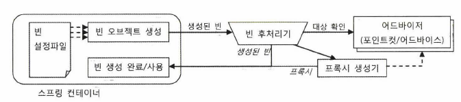
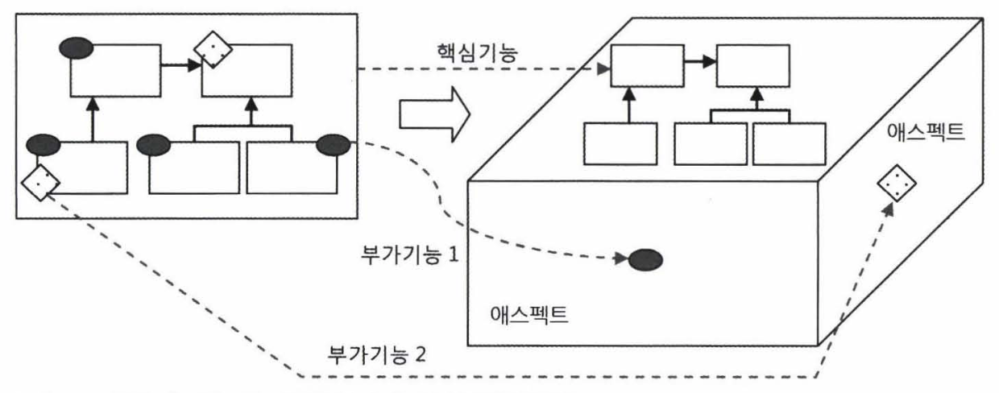

# 지옥 스터디 - 06 AOP
- AOP 는 IoC/DI, PSA 와 더불어 스프링 3대 기반 기술 중 하나.
- AOP 는 OOP 를 대체하는 개념이 아니다.
- 스프링에 적용된 AOP 의 가장 대표적인 사례는 선언적 트랜잭션 기능

## 트랜잭션 코드의 분리
- 서비스 추상화를 통해 트랜잭션 기술에 독립적인 코드가 됬지만 한 가지 걸리는 부분이 있다.
  - UserService 에 트랜잭션 경계설정을 위해 넣은 코드가 존재한다.
- 논리적으로 봤을때 UserService 에 트랜잭션 경계가 설정되어야 하는것은 맞지만 뭔가 찜찜하다..

### DI 를 통한 클래스 분리
- 메소드를 이용한 분리는 사실상 의미가 없다.
- 결국에는 UserService 에 트랜잭션 경계설정을 위한 코드가 남기 때문이다.
- 클래스로 분리했을때 문제라면 구체적인 구현 클래스를 직접 사용하게 된다면 트랜잭션 기능이 빠지게 된다.
- 직접 사용하는게 문제라면 **간접적으로 사용** 하게 만들면 된다.
- UserService 인터페이스를 도출하고, 인터페이스를 통해 사용하게끔 개선 해보자.

`UserService 인터페이스 도입`


- 지금까지는 DI 시 한번에 하나의 구현 클래스를 사용하는 방식을 택했다.
- 하지만 **반드시 그래야할까?**
- 한 번에 두개의 구현클래스를 동시에 이용한다면 어떨까
- 클라이언트 입장에서는 UserService 인터페이스를 통해 접근하기 때문에 구현 클래스를 몇개를 사용하던 문제 될 것은 없다.
- 실제 비즈니스로직을 담당하는 것은 UserServiceImpl 이고, 트랜잭션 처리를 담당하는것은 UserServiceTx 클래스이다.
  - UserServiceTx 는 UserServceImpl 을 통해 비즈니스 처리를 위임한다.
- UserService 를 사용하는 입장에선 UserService 인터페이스에 의존하고 있기 때문에 문제 될 것이 전혀 없다.

```java
public interface UserService {

    void add(User user);

    void upgradeLevels();
}
```

```java
public class UserServiceImpl implements UserService {

    UserLevelUpgradePolicy policy;

    UserDao userDao;

    DataSource dataSource;

    PlatformTransactionManager transactionManager;

    MailSender mailSender;

    public void setUserDao(UserDao userDao) {
        this.userDao = userDao;
    }

    public void setUserLevelUpgradePolicy(UserLevelUpgradePolicy policy) {
        this.policy = policy;
    }

    public void setDataSource(DataSource dataSource) {
        this.dataSource = dataSource;
    }

    public void setTransactionManager(PlatformTransactionManager transactionManager) {
        this.transactionManager = transactionManager;
    }

    public void setMailSender(MailSender mailSender) {
        this.mailSender = mailSender;
    }

    @Override
    public void add(User user) {
        if (user.getLevel() == null) {
            user.setLevel(Level.BASIC);
        }
        userDao.add(user);
    }

    @Override
    public void upgradeLevels() {
        // 트랜잭션 시작
        TransactionStatus status = transactionManager.getTransaction(
            new DefaultTransactionDefinition());
        try {
            upgradeLevelsInternal();
            // 트랜잭션 커밋
            transactionManager.commit(status);
        } catch (RuntimeException e) {
            transactionManager.rollback(status);
            throw e;
        }
    }

    private void upgradeLevelsInternal() {
        List<User> users = userDao.getAll();
        for (User user : users) {
            if (canUpgradeLevel(user)) {
                upgradeLevel(user);
            }
        }
    }

    private boolean canUpgradeLevel(User user) {
        return policy.canUpgradeLevel(user);
    }

    protected void upgradeLevel(User user) {
        policy.upgradeLevel(user);
        userDao.update(user);
        sendUpgradeEmail(user);
    }

    /**
     * 스프링 메일 추상화 사용
     */
    private void sendUpgradeEmail(User user) {
        SimpleMailMessage mailMessage = new SimpleMailMessage();
        mailMessage.setTo(user.getEmail());
        mailMessage.setFrom("useradmin@ksug.org");
        mailMessage.setSubject("Upgrade 안내");
        mailMessage.setText("사용자님의 등급이 : " + user.getLevel().name());
        mailSender.send(mailMessage);
    }
}
```

```java
public class UserServiceTx implements UserService {

    PlatformTransactionManager transactionManager;
    UserService userService;

    public void setUserService(UserService userService) {
        this.userService = userService;
    }

    public void setTransactionManager(PlatformTransactionManager transactionManager) {
        this.transactionManager = transactionManager;
    }

    @Override
    public void add(User user) {
        userService.add(user);
    }

    @Override
    public void upgradeLevels() {
        // 트랜잭션 시작
        TransactionStatus status = transactionManager.getTransaction(
            new DefaultTransactionDefinition());
        try {
            userService.upgradeLevels();
            // 트랜잭션 커밋
            transactionManager.commit(status);
        } catch (RuntimeException e) {
            transactionManager.rollback(status);
            throw e;
        }
    }
}
```

### 트랜잭션 경계설정 코드 분리의 장점
- 트랜잭션 경계설정 코드의 분리와 DI 를 통한 연결을 마쳤다.
- 이런 작업을 함으로 인해 얻을수 있는 장점은 무엇인가 ?
  1. 비즈니스 로직을 담당하는 UserServiceImpl 의 코드를 작성할 때는 트랜잭션과 같은 기술적인 내용에는 신경쓰지 않아도 된다.
  2. 비즈니스 로직에 대한 테스트를 손 쉽게 만들 수 있다.

## 고립된 단위 테스트
- 가장 편하고 좋은 테스트 방법 ? -> **작은 단위로 쪼개서 테스트**
- 작은 단위의 테스트가 좋은 이유 ? -> 테스트 실패시 원인을 찾는 것이 수월해진다.
  - 테스트 의도나 내용도 분명해지고 만들기도 쉬워진다.
- 작은 단위로 테스트 하더라도, 테스트 대상이 다른 오브젝트나 환경에 **의존적** 이라면 작은 단위테스트가 주는 장점을 얻기 힘들다.

### 복잡한 의존관계 속의 테스트
- UserService 를 테스트하려면 UseService 가 의존하고 있는 객체도 같이 동작하게 된다.
  - UserDao, TransactionManager, MailSender..
- UserService 를 테스트하는것 처럼 보이지만, 사실은 그 뒤에 존재하는 많은 오브젝트들과 환경, 서비스, 서버 심지어 네트워크까지 함께 테스트하는 셈이다.
- UserService 에 문제가 있는것도 아닌데 **다른 환경들에 의해 테스트가 실패할 수 있는것** 이다..!
  - 때문에 그 뒤에 존재하는 모든것이 합쳐져 테스트 대상이 되는것..

### 테스트 대상 고립시키기
- 테스트 대상이 환경이나 외부 서버 등 다른 요인에 의해 종속되고 영향 받지않고 **고립** 시킬 필요가 있다.
- MailSender 에 적용한 것 처럼 **테스트를 위한 대역** 을 사용하는 것이다.


- 고립된 테스트가 가능하도록 UserService 를 재구성 해보면 위와 같은 구조가 될 것이다.
- UserServiceImpl 에 대한 테스트가 진행될 때 사전에 테스트를 위해 준비된 동작을 하는 **목 오브젝트에만 의존** 하는 그림이다.

### 고립된 단위 테스트 적용

```java
class MockUserDao implements UserDao {

    private List<User> users;
    private List<User> updated = new ArrayList<>();

    public MockUserDao(List<User> users) {
        this.users = users;
    }

    /**
     * Stub 제공
     */
    public List<User> getUpdated() {
        return updated;
    }

    /**
     * Mock Object 제공
     */
    @Override
    public List<User> getAll() {
        return users;
    }

    @Override
    public void update(User user) {
        updated.add(user);
    }

    @Override
    public void add(User user) {
        throw new UnsupportedOperationException();
    }

    @Override
    public User get(String id) {
        throw new UnsupportedOperationException();
    }

    @Override
    public void deleteAll() {
        throw new UnsupportedOperationException();
    }

    @Override
    public int getCount() {
        throw new UnsupportedOperationException();
    }
}
```
- 고립된 단위 테스트를 위해 MockUserDao 를 구현했따.
- MockUserDao 는, getAll() 메소드를 호출하면 이미 만들어둔 Mock Users 목록을 반환한다.
- update() 호출시엔 해당 유저가 업데이트 대상이 되었다는 updated 목록에 이를 저장해 두었다가 검증시 활용한다.

`MockUserDao 를 활용한 고립된 테스트`

```java
class UserServiceTest {
    // ..
  
    @Test
    void upgradeLevels() {
      UserServiceImpl userService = new UserServiceImpl();
    
      MockUserDao mockUserDao = new MockUserDao(users);
      userService.setUserDao(mockUserDao);
      userService.setUserLevelUpgradePolicy(policy);

      MockMailSender mockMailSender = new MockMailSender();
      userService.setMailSender(mockMailSender);

      userService.upgradeLevels();

      List<User> updated = mockUserDao.getUpdated();
      assertThat(updated.size()).isEqualTo(2);
      checkUserAndLevel(updated.get(0), "ncucu1", Level.SILVER);
      checkUserAndLevel(updated.get(1), "ncucu3", Level.GOLD);

      List<String> request = mockMailSender.getRequests();
      assertThat(request.size()).isEqualTo(2);
      assertThat(request.get(0)).isEqualTo(users.get(1).getEmail());
      assertThat(request.get(1)).isEqualTo(users.get(3).getEmail());
    }

    private void checkUserAndLevel(User updated, String expected, Level expectedLevel) {
      assertThat(updated.getId()).isEqualTo(expected);
      assertThat(updated.getLevel()).isEqualTo(expectedLevel);
    }
}
```
- 테스트 대상인 UserServiceImpl 은 MockUserDao 에 의존하고 있다.
- upgradeLevels() 를 호출하면, MockUserDao 에 미리 생성해둔 유저 목록을 불러와 업데이트 대상을 선정한 뒤 MockUserDao 의 update 메소드를 호출할 것이다.
- update 메소드 호출대상이된 유저들은 MockUserDao 의 updated 컬렉션에 담기게 되고, upgradeLevels() 메소드 호출이 종료된 후 해당 목록을 가져와 이를 검증한다.

`테스트 수행 성능의 향상`
- UserServiceTest#upgradeLevels 를 호출하면 성공한다.
- 간단한 테스트라 차이를 체감하지 못하겠지만 테스트 수행시간은 이전에 비해 분명히 빨라졌다.
- 기존에는 DB 까지 연동하는 테스트라 수행 시간이 훨씬 길었다.
- 이는 UserServiceImpl 의 테스트를 도와주는 목 오브젝트 덕분이다.
- 고립된 테스트를 하면, 테스트 준비뿐 아니라 수행 성능도 크게 향상된다.
- 테스트가 빨라질수록 부담없이 자주 테스트를 돌려볼 수 있다.

## 단위 테스트와 통합 테스트
- 단위 테스트의 단위는 정하기 나름이다.
- 사용자 관리 기능 전체를 하나의 단위로 볼 수도 있을것이고, 하나의 클래스나 하나의 메소드를 하나의 단위로 볼 수도 있다.
- 중요한것은 **하나의 단위에 초점을 맞춰야 한다.**
- 두 개 이상의 성격이나 계층이 다른 오브젝트가 서로 연동하는 테스트거나 외부 환경에 요인을 받는다면 이는 **통합 테스트** 라고 부른다.
  - 스프링 프레임워크의 도움을 받아 DI 된 오브젝트를 테스트하는 것 또한 통합 테스트이다.

### 단위 테스트와 통합 테스트의 선택
- 단위 테스트와 통합 테스트 중 어떤 것을 사용할지 몇가지 가이드라인을 제시한다.
1. 항상 단위 테스트를 먼저 고려하라.
2. **하나의 클래스나 성격과 목적이 같은 긴밀한 클래스** 를 모아 외부와의 의존관계를 모두 차단하고 테스트 대역을 이용하도록 테스트를 작성하라.
3. 외부 리소스를 사용해야만 한다면 **통합 테스트** 로 만들라.
4. DAO 테스트는 통합 테스트로 분류된다.
5. 여러 단위가 의존관계를 가지고 동작할때를 위한 통하 테스트는 필요하다.
6. 단위 테스트를 만들기 복잡하다면 처음부터 통합테스트를 고려하라.
7. 스프링 컨텍스트를 사용하는 테스트도 통합 테스트이다.
8. 가능하면 스프링의 지원없이 가능한 테스트를 작성하라.

> 테스트하기 쉬운 코드는 좋은 코드다.

## 목 프레임워크
- 단위 테스트를 만들기 위해 스텁이나 목 오브젝트 사용은 필수적
- 하지만 매번 목 오브젝트를 만드는것은 현실적으로 봤을때 매우 번거로운 일이다.
- 이런 번거로운 목 오브젝트를 편리하게 작성하도록 도와주는 다양한 목 오브젝트 지원 프레임워크가 있다.

### Mockito
- Java 진영에서는 Mockito 가 큰 인끼를 끌고 있다.
- 목 프레임워크는 목 클래스를 일일히 준비해둘 필요가 없다.
- 간단한 메소드 호출만으로 다이나믹하게 특정 인터페이스를 구현한 테스트용 목 오브젝트를 만들 수 있다.

```java
UserDao mockUserDao = mock(UserDao.class);
```
- 위 처럼 목 오브젝트를 간단하게 생성할 수 있는데, 생성 직후 목 오브젝트는 아무런 기능이 없다.
- getAll() 메소드를 호출했을때 사용자 목록을 리턴하도록 **스텁기능** 을 추가해보자.

```java
when(mockUseDao.getAll()).thenReturn(this.users);
```
- 위 코드는 mockUserDao.getAll() 호출이 발생하면 users 목록을 반환하라는 선언이다.

```java
verity(mockUserDao, times(2)).update(any(User.class));
```
- 위 코드는 update 호출이 있었는지 검증하는 코드이다.
- Mockito 를 통해 생성된 목 오브젝트는 메소드 호출과 관련된 정보를 저장해 두고, 이를 검증할 수 있게 해준다.

`Mockito 를 적용한 테스트 코드`

```java
class UserServiceTest {
    // ..
    @Test
    void mockUpgradeLevels() throws Exception {
      UserServiceImpl userService = new UserServiceImpl();

      UserDao mockUserDao = mock(UserDao.class);
      when(mockUserDao.getAll()).thenReturn(this.users);
      userService.setUserDao(mockUserDao);

      MailSender mockMailSender = mock(MailSender.class);
      userService.setMailSender(mockMailSender);
      userService.setUserLevelUpgradePolicy(policy);

      userService.upgradeLevels();

      verify(mockUserDao, times(2)).update(any(User.class));
      verify(mockUserDao).update(users.get(1));
      assertThat(users.get(1).getLevel()).isEqualTo(Level.SILVER);
      verify(mockUserDao).update(users.get(3));
      assertThat(users.get(3).getLevel()).isEqualTo(Level.GOLD);

      ArgumentCaptor<SimpleMailMessage> mailMessageArg = ArgumentCaptor.forClass(SimpleMailMessage.class);
      verify(mockMailSender, times(2)).send(mailMessageArg.capture());
      List<SimpleMailMessage> mailMessages = mailMessageArg.getAllValues();
      assertThat(mailMessages.get(0).getTo()[0]).isEqualTo(users.get(1).getEmail());
      assertThat(mailMessages.get(1).getTo()[0]).isEqualTo(users.get(3).getEmail());
    }

    private void checkUserAndLevel(User updated, String expected, Level expectedLevel) {
      assertThat(updated.getId()).isEqualTo(expected);
      assertThat(updated.getLevel()).isEqualTo(expectedLevel);
    }
}
```
- ArgumentCaptor 를 사용했는데, 이는 실제 MailSender 의 목 오브젝트에 전달된 파라미터를 가져와서 내용을 검증할 수 있는 방법이다.

## 다이나믹 프록시와 팩토리 빈

### 프록시 패턴, 데코레이터 패턴
- 단순히 확장성을 고려해 한 가지 기능을 분리한다면, 전략 패턴을 사용하면 된다.
- 트랜잭션 기능에는 이미 전략패턴이 적용되어 있다.
- 하지만 전략패턴으로는, 트랜잭션 기능의 구현 내용을 분리했을 뿐, 트랜잭션 적용 코드는 그대로 남아 있다.
  - 구현 코드는 제거 했지만, 위임 기능을 통해 사용하는 코드는 함께 존재한다.
- 트랜잭션이라는 기능은 비즈니스 로직과는 성격이 다르다.
- 아예 그 적용 사실 자체를 밖으로 분리해야 한다.
- 때문에 이 방법을 활용해 UseServiceTx 를 만들고, UserServiceImpl 에는 트랜잭션 관련 코드가 남지 않았다.
- UserServiceTx 는 부가기능을 담은 클래스이다.
- 부가기능을 담은 클래스는 부가 기능외 나머지 기능은 핵심기능을 가진 클래스로 **위임** 해야 한다.
- 클라언트가 자신을 거쳐 부가기능을 적용한 핵심기능을 사용하게끔 해야한다.
- 때문에 UserService 인터페이스를 도출한 것이다.
- 이렇게 마치 클라이언트가 사용하려는 실제 대상인것 처럼 위장해 클라이언트의 요청을 받아 주는것을 대리자 와 같은 역할을 한다고 해서 **프록시** 라고 부른다.
- 프록시는 최종적으로 요청을 위임받아 처리하는 실제 오브젝트를 **타깃** 이라고 부른다.


- 프록시의 특징은 **타깃과 같은 인터페이스를 구현했고, 프록시가 타겟을 제어** 한다는 점이다.
- 프록시는 사용 목적에 따라 두가지로 구분한다.
  1. 클라이언트가 타깃에 접근하는 방법을 제어
  2. 타깃에 부가적인 기능을 부여하기 위함

> 이 두가지는 프록시를 둔다는것은 동일하지만 목적에 따라 디자인패턴에선 다른 패턴으로 구분한다.

`데코레이터 패턴`
- 데코레이터 패턴은 **런타임에 타깃에 부가적인 기능을 부여해주기 위해 프록시를 사용하는 패턴** 이다.
  - 런타임에 기능을 부가한다는 것은 컴파일 시점, 코드상에는 어떤 방법과 순서로 프록시와 타깃이 연결되는지 정해져 있지 않다.
- 데코레이터 패턴이라 불리는 이유 ?
  - 마치 제품이나 케익을 여러 겹으로 포장하고 장식을 붙이는것 과 같다.
  - 프록시가 한개로 제한되지 않고, 여러개의 프록시를 겹겹히 쌓아 올릴 수 있다.

> java.io 패키지의 InputStream/OutputStream 은 데코레이터 패턴의 대표적인 예

`프록시 패턴`
- 프록시 패턴의 프록시는 타깃의 기능을 확장하거나 추가하지 않는다.
- 클라이언트가 타깃에 접근하는 방식을 제어한다.
- 타깃 오브젝트를 생성하기 복잡하거나 당장 필요하지 않은 경우 실제 사용시점 까지 생성을 미루는 것이 가능하다.
  - 실제 타깃오브젝트가 아닌 프록시 객체의 레퍼런스를 참조한다.

> 프록시 패턴은, 타깃의 기능에는 관여하지 않으면서 접근하는 방법을 제어해주는 프록시를 이용한다. <br/>
> 다만 프록시는 코드에서 자신이 생성해야할 타깃 클래스 정보를 알아야하는 경우가 많다.

### 다이나믹 프록시
- java.lang.reflect 패키지에는 프록시를 손쉽게 만들 수 있도록 지원하는 클래스들이 있다.
- 기본적인 아이디어는 목 프레임워크와 비슷하다.
- 프록시 처럼 동작하는 오브젝트를 다이나믹하게 생성하는 것

`프록시 클래스`
- 다이나믹 프록시는 **리플렉션** 을 활용해 프록시를 만든다.
- 이를 활용한 프록시를 만들어 보자.

```java
interface Hello {
    String sayHello(String name);
    String sayHi(String name);
    String sayThankYou(String name);
}
```

```java
class HelloTarget implements Hello {

    @Override
    public String sayHello(String name) {
        return "Hello " + name;
    }

    @Override
    public String sayHi(String name) {
        return "Hi " + name;
    }

    @Override
    public String sayThankYou(String name) {
        return "Thank You " + name;
    }
}
```
- 프록시를 적용할 간단한 인터페이스와 그에 대한 구현체를 정의했다.

```java
class HelloUppercase implements Hello {

    Hello hello;

    public HelloUppercase(Hello hello) {
        this.hello = hello;
    }

    @Override
    public String sayHello(String name) {
        return hello.sayHello(name).toUpperCase();
    }

    @Override
    public String sayHi(String name) {
        return hello.sayHi(name).toUpperCase();
    }

    @Override
    public String sayThankYou(String name) {
        return hello.sayThankYou(name).toUpperCase();
    }
}
```
- Hello 인터페이스를 구현한 프록시 이다.
- 이는 데코레이터 패턴을 적용해 HelloTarget 에 부가기능을 추가한다.

`다이나믹 프록시 적용`
- 클래스로 만든 프록시인 HelloUppercase 를 다이나믹 프록시를 이용해 생성해 보자.
- 다이나믹 프록시는 **프록시 팩토리** 에 의해 런타임시 생성된 오브젝트이다.
- 때문에 타깃의 인터페이스와 같은 타입으로 만들어진다.
- 다이나믹 프록시가 구현 클래스는 자동으로 만들어주지만, 부가기능을 제공할 코드는 직접 작성해야 한다.
- 프록시 오브젝트와 별개로 **InvocationHandler** 인터페이스를 구현해야 한다.
  - 이는 invoke() 메소드 하나만을 가지고 있는 간단한 인터페이스 이다.
  
```java

```
- 다이나믹 프록시는 클라이언트의 요청을 리플렉션 정보로 변환해 이를 InvocationHandler 구현 오브젝트의 invoke 메소드로 넘겨주는 역할을 한다.
- 다음은 InvocationHandler 인터페이스를 구현한 부가기능 코드이다.

```java
class UppercaseHandler implements InvocationHandler {

    Hello target;

    public UppercaseHandler(Hello target) {
        this.target = target;
    }

    @Override
    public Object invoke(Object proxy, Method method, Object[] args) throws Throwable {
        Object ret = method.invoke(target, args);
        if (ret instanceof String) {
            return ((String)ret).toUpperCase();
        }
        return ret;
    }
}
```

```java
class JdkProxyTest {
    // ...
    @Test
    void jdkProxy() throws Exception {
      Hello proxiedHello = (Hello) Proxy.newProxyInstance(
              getClass().getClassLoader(), // 클래스 로딩에 사용할 클래스 로더
              new Class[]{Hello.class}, // 구현할 인터페이스
              new UppercaseHandler(new HelloTarget()) // 부가기능과 위임코드를 담은 구현체
      );
      assertThat(proxiedHello.sayHello("ncucu")).isEqualTo("HELLO NCUCU");
      assertThat(proxiedHello.sayHi("ncucu")).isEqualTo("HI NCUCU");
      assertThat(proxiedHello.sayThankYou("ncucu")).isEqualTo("THANK YOU NCUCU");
    }
}
```
- 다이나믹 프록시의 생성은 Proxy#newProxyInstance 를 통해 생성할 수 있다.
  - 다이나믹 프록시는 여러 인터페이스를 구현할 수 있기 때문에 이를 배열로 받는다.

### 다이나믹 프록시를 적용한 트랜잭션 부가기능
- 이전에 구현했던 UserServiceTx 를 다이나믹 프록시 방식으로 변경해보자.
- UserServiceTx 는 인터페이스의 모든 메소드를 구현해야하고 트랜잭션이 필요한 메소드마다 트랜잭션 처리가 중복된다.
- 때문에 트랜잭션 부가기능을 제공하는 다이나믹 프록시를 만들어 적용하는 것이 효율적이다.

`TransactionHandler`

```java
public class TransactionHandler implements InvocationHandler {

    private Object target;
    private PlatformTransactionManager transactionManager;
    private String pattern;

    public void setTarget(Object target) {
        this.target = target;
    }

    public void setTransactionManager(
        PlatformTransactionManager transactionManager) {
        this.transactionManager = transactionManager;
    }

    public void setPattern(String pattern) {
        this.pattern = pattern;
    }

    @Override
    public Object invoke(Object proxy, Method method, Object[] args) throws Throwable {
        if (method.getName().startsWith(pattern)) {
            return invokeInTransaction(method, args);
        }
        return method.invoke(target, args);
    }

    private Object invokeInTransaction(Method method, Object[] args) throws Throwable {
        TransactionStatus status =
            transactionManager.getTransaction(new DefaultTransactionDefinition());
        try {
            Object ret = method.invoke(target, args);
            transactionManager.commit(status);
            return ret;
        } catch (InvocationTargetException e) {
            transactionManager.rollback(status);
            throw e.getTargetException();
        }
    }
}
```
- 트랜잭션 부가기능을 구현한 TransactionHandler 이다.
- 요청을 위임할 타겟을 DI 로 제공 받는다.
- 또한 트랜잭션 추상화 인터페이스는 PlatformTransactionManager 도 DI 로 제공 받는다.
- 타깃 오브젝트의 모든 메소드에 트랜잭션을 적용하지 않도록 트랜잭션을 적용할 메소드의 패턴을 DI 받는다.
- TransactionHandler 가 호출되면, 트랜잭션을 적용할 메소드인지 먼저 선별을하고, 트랜잭션 적용대상이라면, invokeInTransaction 메소드를 / 아니라면 타깃 메소드를 그대로 호출한다.

### 다이나믹 프록시를 위한 팩토리 빈
- TransactionHandler 와 다이나믹 프록시를 스프링 DI 를 통해 사용할 수 있게 만들어야 한다.
- 하지만 다이나믹 프록시는 일반적인 스프링 빈으로 등록할 방법이 없다.
  - 스프링은 지정된 클래스명을 가지고 리플렉션을 이용해 오브젝트를 생성한다.
  - 다이나믹 프록시는 이런 방식으로 프록시 객체를 생성할 수 없다.

`팩토리 빈`
- 스프링은 클래스정보를 기반으로 오브젝트를 만드는 방법 외에 다양한 방법을 제공해준다.
- 대표적인 방법은 **팩토리 빈** 을 활용하는 것이다.
  - 이는 스프링을 대신해 오브젝트 생성로직을 담당하도록 만들어진 특별한 빈을 말한다.
- 팩토리빈을 만드는 방법중 간단한 방법은 FactoryBean 인터페이스를 구현하는 것이다.

```java
public interface FactoryBean<T> {

	String OBJECT_TYPE_ATTRIBUTE = "factoryBeanObjectType";

	@Nullable
	T getObject() throws Exception;

	@Nullable
	Class<?> getObjectType();
    
	default boolean isSingleton() {
		return true;
	}

}
```
- FactoryBean#getObject : 빈 오브젝트를 생성한다.
- FactoryBean#getObjectType : 생성되는 오브젝트 타입을 알려준다.
- FactoryBean#isSingleton : 빈 오브젝트가 싱글톤 오브젝트인지 알려준다.

> FactoryBean 을 구현한 클래스를 스프링 빈으로 등록하면 팩토리 빈으로써 동작한다.

`팩토리빈 학습 테스트`
- 팩토리빈 동작 원리 파악을 위한 학습 테스트이다.

```java
public class Message {
    String text;

    private Message(String text) {
        this.text = text;
    }

    public String getText() {
        return text;
    }

    public static Message newMessage(String text) {
        return new Message(text);
    }
}
```

```java
public class MessageFactoryBean implements FactoryBean<Message> {

    String text;

    public void setText(String text) {
        this.text = text;
    }

    @Override
    public Message getObject() throws Exception {
        return Message.newMessage(text);
    }

    @Override
    public Class<?> getObjectType() {
        return Message.class;
    }

    @Override
    public boolean isSingleton() {
        return false;
    }
}
```
- 일반적인 생성자로 생성할 수 없는 Message 클래스를 정의하고, 이를 생성하는 MessageFactoryBean 을 정의했다.
  - 스프링은 private 생성자도 빈으로 생성할 수 있지만, 이는 스태틱 메소드를 통해 오브젝트가 만들어져야 하는 중요한 이유가 있다는 것이다.
  - 때문에 이를 무시하고 강제로 생성하는 것은 위험하다.

```java
class Factory {
    @Bean
    public MessageFactoryBean message() {
      MessageFactoryBean messageFactoryBean = new MessageFactoryBean();
      messageFactoryBean.setText("Factory Bean");
      return messageFactoryBean;
    }
}
```

```java
@ExtendWith(SpringExtension.class)
@ContextConfiguration(
    classes = DaoFactory.class
)
class MessageFactoryBeanTest {

    @Autowired
    ApplicationContext applicationContext;

    @Test
    void getMessageFromFactoryBean() {
        Object message = applicationContext.getBean("message");
        assertThat(message).isInstanceOf(Message.class);
        assertThat(((Message)message).getText()).isEqualTo("Factory Bean");
    }
}
```
- 이는 팩토리빈이 생성해주는 오브젝트를 검증하는 테스트 코드이다.
- 드물게 팩토리빈 자체를 가져오고 싶을 때도 있다.
- 이런경우 getBean 메소드 호출시 빈이름앞에 '&' 를 붙여 호출하면 팩토리빈 자체를 반환한다.

```java
class MessageFactoryBeanTest {

    @Autowired
    ApplicationContext applicationContext;

    @Test
    void getFactoryBean() {
        Object message = applicationContext.getBean("&message");
    }
}
```

`트랜잭션 프록시 팩토리 빈`

```java
public class TxProxyFactoryBean implements FactoryBean<Object> {

    Object target;
    PlatformTransactionManager transactionManager;
    String pattern;
    Class<?> serviceInterface;

    public void setTarget(Object target) {
        this.target = target;
    }

    public void setTransactionManager(
        PlatformTransactionManager transactionManager) {
        this.transactionManager = transactionManager;
    }

    public void setPattern(String pattern) {
        this.pattern = pattern;
    }

    public void setServiceInterface(Class<?> serviceInterface) {
        this.serviceInterface = serviceInterface;
    }

    @Override
    public Object getObject() throws Exception {
        TransactionHandler txHandler = new TransactionHandler();
        txHandler.setTarget(target);
        txHandler.setTransactionManager(this.transactionManager);
        txHandler.setPattern(pattern);
        return Proxy.newProxyInstance(
            getClass().getClassLoader(),
            new Class[]{serviceInterface},
            txHandler
        );
    }

    @Override
    public Class<?> getObjectType() {
        return serviceInterface;
    }

    /**
     * FactoryBean 이 매번 동일한 오브젝트를 반환하지 않도록...
     */
    @Override
    public boolean isSingleton() {
        return false;
    }
}
```

### 팩토리 빈 방식의 장점 과 한계
- TransactionHandler 를 사용하는 다이나믹 프록시를 생성해주는 TxProxyFactoryBean 을 적용했다.
- 이는 코드의 수정 없이 다양한 클래스에 적용이 가능하다.
- 타깃 오브젝트에 맞는 프로퍼티 정보를 설정해 빈으르 등록하기만 하면 된다.
- 이를 활용하면 프록시 기법을 아주 빠르고 쉽게 적용할 수 있다.
- 하지만 단점도 분명히 존재한다.
- 프록시를 통해 타깃에 부가기능을 제공하는 것은 **메소드 단위** 로 일어난다.
- 한 번에 **여러 클래스에 공통적인 부가기능** 을 부여하는것은 현재로서는 불가능하다.
- 트랜잭션 처럼 여러 클래스에 적용할 필요가 있다면 팩토리빈의 설정이 중복된다.
- 하나의 타깃에 여러 부가기능을 적용할 때도 문제가 된다.
- 또 하나는 TransactionHandler 객체가 팩토리 빈 갯수만큼 만들어진다는 점이다.

## 스프링 프록시 팩토리 빈

### ProxyFactoryBean
- 스프링은 트랜잭션 기술처럼 서비스 추상화를 프록시 기술에도 적용하고 있다.
  - JDK 다이나믹 프록시 외에도 편리하게 프록시를 만들 수 있는 다양한 기술이 존재한다.
- 스프링은 일관된 방법으로 프록시를 만들 수 있게 추상화 레이어를 제공한다.
- ProxyFactoryBean 은 프록시를 생성해 빈 오브젝트로 등록하게 해주는 팩토리 빈이다.
- TxProxyFactoryBean 과 달리 ProxyFactoryBean 은 **순수하게 프록시를 생성하는 작업만 담당** 한다.
  - 프록시를 통해 제공할 부가기능은 별도 빈으로 등록해 사용할 수 있다.
- ProxyFactoryBean 이 생성하는 프록시에 사용할 부가기능은 **MethodInterceptor** 인터페이스를 구현해 만든다.
  - InvocationHandler 와 비슷하지만 다른점 ? -> ProxyFactoryBean 으로 부터 타깃 오브젝트에 대한 정보까지 받는다.
    - 때문에 타깃 오브젝트와 별개로 독립적으로 만들어 질 수 있다.
    - 싱글톤 빈으로 등록이 가능

```java
class UpperCaseAdvice implements MethodInterceptor {

    @Override
    public Object invoke(MethodInvocation invocation) throws Throwable {
        String ret = (String)invocation.proceed();
        return ret.toUpperCase();
    }
}
```

```java
class JdkProxyTest {
    // ..
    @Test
    void proxyFactoryBean() {
      ProxyFactoryBean proxyFactoryBean = new ProxyFactoryBean();
      proxyFactoryBean.setTarget(new HelloTarget());
      proxyFactoryBean.addAdvice(new UpperCaseAdvice());
      Hello proxiedHello = (Hello) proxyFactoryBean.getObject();
      assertThat(proxiedHello.sayHello("ncucu")).isEqualTo("HELLO NCUCU");
      assertThat(proxiedHello.sayHi("ncucu")).isEqualTo("HI NCUCU");
      assertThat(proxiedHello.sayThankYou("ncucu")).isEqualTo("THANK YOU NCUCU");
    }
}
```

### 어드바이스
- MethodInterceptor 를 구현한 클래스에는 타깃 오브젝트가 없다.
- 메소드 정보와 함께 타깃 오브젝트 담긴 **MethodInvocation** 이 전달되기 때문이다.
- 때문에 이는 부가기능에 집중 할 수 있다.
  - 관심사의 분리가 이뤄짐
- MethodInvocation 은 콜백 오브젝트로, proceed() 를 호출하면 타깃 오브젝트의 메소드를 내부적으로 실행해준다.
  - MethodInterceptor 는 일종의 템플릿처럼 동작한다.
- ProxyFactoryBean 의 가장 큰 장점이다.
  - 작은 단위의 템플릿/콜백 패턴을 적용했기 때문에 MethodInterceptor 를 싱글톤으로 두고 공유할 수 있다.
- 마치 JdbcTemplate 의 구조와 유사하다.
- ProxyFactoryBean 에 부가기능을 추가할때 ProxyFactoryBean#addAdvice 를 사용하는것 도 특징중 하나이다.
  - add 라는 것은, 즉 여러 부가기능을 추가할 수 있다는 의미이다.
  - addMethodInterceptor 가 아닌 addAdvice 이다..!
  - MethodInterceptor 는 Advice 인터페이스를 상속하는 서브 인터페이스
- 타깃 오브젝트에 적용하는 부가기능을 담은 오브젝트 -> 스프링에서는 Advice 라고 한다.
- ProxyFactoryBean 은 타깃 오브젝트의 타입정보를 스스로 알아낼 수도 있고, 프로퍼티를 통해 제공받을 수도 있다.

### 포인트컷
- 프록시의 핵심 가치는 타깃을 대신해 클라이언트 요청을 받아 처리하는 오브젝트 존재 자체 이다.
- 메소드를 선별하는 기능은 프록시로 부터 분리하는 것이 낫다.
- InvocationHandler 의 문제중 하나는 부가기능을 가진 객체가 타깃과 메소드 선정 알고리즘 코드에 의존하고 있다는 것이었다.
  - 때문에 특정 객체에 종속적인 구조가 되고, 타깃이 추가될때마다 매번 새롭게 빈으로 등록을 했던 것이다..!
- ProxyFactoryBean 은 부가기능 (Advice) 과 메소드 선정 알고리즘 (Pointcut) 을 활용하는 유연한 구조를 제공한다.


- 부가 기능을 제공하는 오브젝트 : Advice
- 메소드 선정 알고리즘을 담은 오브젝트 : Pointcut
- 이 두가지 모두 프록시에 DI 로 주입되어 사용된다.
  - 여러 프록시에서 공유가 가능하도록 만들어지기 때문에 싱글톤 빈으로 등록이 가능하다.
- 프록시는 요청을 받으면, Pointcut 을 통해 적용 대상인지 확인한다.
- 적용대상이라면 그때 Advice 를 호출한다.
- 이는 전형적인 전략패턴의 구조이며 OCP 를 지키는 구조이다.

`Pointcut 학습 테스트`

```java
class JdkProxyTest {
    // ...
    @Test
    void pointCutAdvisor() {
      ProxyFactoryBean proxyFactoryBean = new ProxyFactoryBean();
      proxyFactoryBean.setTarget(new HelloTarget());

      // 포인트 컷 지정
      // 포인트컷 : 부가기능 적용 대상 선정 알고리즘
      NameMatchMethodPointcut pointcut = new NameMatchMethodPointcut();
      pointcut.setMappedName("sayH*");

      // 어드바이스 지정
      // 어드바이스 : 부가기능
      // 어드바이저 : 포인트컷 + 어드바이스
      // 어드바이저로 지정하는 이유 ?
      // 여러 개의 어드바이스와 포인트컷이 존재할 수 있기 때문이다.
      proxyFactoryBean.addAdvisor(new DefaultPointcutAdvisor(pointcut, new UpperCaseAdvice()));

      Hello proxiedHello = (Hello) proxyFactoryBean.getObject();
      assertThat(proxiedHello.sayHello("ncucu")).isEqualTo("HELLO NCUCU");
      assertThat(proxiedHello.sayHi("ncucu")).isEqualTo("HI NCUCU");
      assertThat(proxiedHello.sayThankYou("ncucu")).isEqualTo("Thank You ncucu");
    }
}
```
- NameMatchMethodPointcut : 스프링이 제공하는 구현체중 하나, 메소드 이름을 비교해 대상을 선정하는 포인트컷
- 포인트컷과 어드바이스를 함께 등록하려면 이를 하나로 묶어 Advisor 타입으로 다뤄야 한다.
  - 이유 ?
  - ProxyFactoryBean 에는 여러 어드바이스와 포인트컷이 존재할 수 있다.
  - 때문에 어떤 어드바이스에 대해 어떤 포인트컷을 적용해야 하는지 애매해지기 때문에 이런 방식을 컴포짓 타입으로 취급하는 것이다.
- 어드바이스와 포인트컷을 묶은 오브젝트를 **어드바이저** 라고 부른다.

### ProxyFactoryBean 적용

`TransactionAdvice`

```java
public class TransactionAdvice implements MethodInterceptor {

    PlatformTransactionManager transactionManager;

    public void setTransactionManager(PlatformTransactionManager transactionManager) {
        this.transactionManager = transactionManager;
    }

    @Override
    public Object invoke(MethodInvocation invocation) throws Throwable {
        TransactionStatus status =
            transactionManager.getTransaction(new DefaultTransactionDefinition());
        try {
            Object ret = invocation.proceed();
            transactionManager.commit(status);
            return ret;
        } catch (RuntimeException e) {
            transactionManager.rollback(status);
            throw e;
        }
    }
}
```
- 트랜잭션 부가기능을 담당하는 TransactionAdvice
- 학습테스트에서 구현해본것 처럼 MethodInterceptor 인터페이스를 구현한다.
- JDK 다이나믹 프록시를 이용했을때 보다 코드가 간결해졌다.
- 타깃 메소드가 던지는 예외도, 다이나믹 프록시는 **InvocationTargetException** 으로 포장된 예외가 왔지만
- 이는 예외를 그대로 반환하기 때문에 그대로 처리하면 된다.

`빈 설정`

```java
@Configuration
class Factory {
    // ... 
  
    @Bean
    public TransactionAdvice transactionAdvice() {
      TransactionAdvice transactionAdvice = new TransactionAdvice();
      transactionAdvice.setTransactionManager(transactionManager());
      return transactionAdvice;
    }
  
    @Bean
    public NameMatchMethodPointcut transactionPointCut() {
      NameMatchMethodPointcut pointcut = new NameMatchMethodPointcut();
      pointcut.setMappedName("upgrade*");
      return pointcut;
    }
  
    @Bean
    public DefaultPointcutAdvisor transactionAdvisor() {
      return new DefaultPointcutAdvisor(transactionPointCut(), transactionAdvice());
    }
  
    @Bean
    public ProxyFactoryBean userService() {
      ProxyFactoryBean proxyFactoryBean = new ProxyFactoryBean();
      proxyFactoryBean.setTarget(userServiceImpl());
      proxyFactoryBean.setInterceptorNames("transactionAdvisor");
      return proxyFactoryBean;
    }
}
```

### 어드바이스와 포인터컷의 재사용성
- ProxyFactoryBean 은 스프링의 DI, 템플릿/콜백 패턴, 서비스 추상화 기법이 모두 적용된 것이다.
- 때문에 독립적이며 여러 프록시가 공유가능한 어드바이스와 포인트컷으로 확장 기능을 분리할 수 있었다.

## 스프링 AOP
- 지금까지 했던 작업의 목표 ? -> 비즈니스 로직에 반복적으로 등장한 트랜잭션 코드를 깔끔하게 분리하는것.
  - 이는 투명한 부가기능으로써 제공되어야 한다.
  - 투명하다 ? -> 부가기능 적용을 하더라도 기존 설계와 코드에는 영향이 없어야 한다.

### 자동 프록시 생성
- 부가기능을 적용할때 발생했던 문제들은 대부분 해결 됬다.
  - 부가기능은 모든 타깃과 메소드에 재사용가능
  - 타깃메소드 선정도 독립적으로 상요 가능
- 남은 문제는 부가기능 적용이 필요한 타깃 오브젝트마다 거의 비슷한 내용의 빈 설정정보를 추가해주는 부분이다.
  - 설정을 매번 복사해서 약간의 수정이 필요하다.

### 중복 문제의 접근
- 반복적인 프록시 메소드의 구현을 자동생성 기법을 통해 해결했다.
- 그렇다면 반복적인 ProxyFactoryBean 설정 문제는 **설정 자동등록** 기법으로 해결가능하지 않을까 ?..

### 빈 후처리기를 이용한 자동 프록시 생성기
- 스프링은 OCP 의 가장 중요한 요소인 **유연한 확장** 이라는 개념을 컨테이너에도 적용하고 있따.
- 컨테이너로서 제공하는 기능 중 변하지 않는 핵심적인 부분 외에는 대부분 확장이 가능하도록 **확장 포인트** 를 제공한다.
- 그중 하나는, **BeanPostProcessor** 인터페이스를 구현하는 빈 후처리기이다.
- 스프링 빈 오브젝트로 만든 뒤 빈 오브젝트를 가공할 수 있게 해준다.
- 스프링이 제공하는 빈 후처리기 중 하나인 **DefaultAdvisorAutoProxyCreator** 를 사용한다.
- 이는 이름에서 알 수 있듯이 어드바이저를 이용한 **자동 프록시 생성기** 이다.
- 빈 후처리기를 빈에 등록하는 것만으로 적용 하는 방법은 끝난다.
- 스프링은 빈 후처리기가 빈으로 등록되어 있다면, 빈 오브젝트가 생성될 때 마다 후처리기에 보내 처리를 요청한다.
  - 이때 프로퍼티를 수정하거나 별도의 초기화작업이 가능하며, 심지어 오브젝트를 바꿔치기 할 수도 있다.



- DefaultAdvisorAutoProxyCreator 는, 빈으로 등록된 모든 어드바이저 내의 포인트컷을 이용해 적용 대상을 파악한다.
- 적용대상일 경우 내장된 프록시 생성기에 빈에 대한 프록시를 만들구 해당 프록시에 어드바이저를 연결해 준다.
- 프록시가 생성되었다면 컨테이너에게 프록시 객체를 전달해준다.
  - 이로서 컨테이너는 최종적으로 프록시 객체를 사용하게 되는것..

### 확장된 포인트컷
- 지금까지 포인트컷은 **메소드** 를 대상으로 이뤄졌다.
- 사실 포인트 컷은 두 가지 기능을 가지고 있다.
  - 클래스선정 / 메소드 선정
- Pointcut 인터페이스를 잘 살펴보면 클래스필터 와 메소드 매처 두가지를 가지고 있다.

```java
public interface Pointcut {

	/**
	 * Return the ClassFilter for this pointcut.
	 * @return the ClassFilter (never {@code null})
	 */
	ClassFilter getClassFilter();

	/**
	 * Return the MethodMatcher for this pointcut.
	 * @return the MethodMatcher (never {@code null})
	 */
	MethodMatcher getMethodMatcher();


	/**
	 * Canonical Pointcut instance that always matches.
	 */
	Pointcut TRUE = TruePointcut.INSTANCE;

}
```
- 지금까지는 MethodMatcher 기능만 활용했던 것이다..!

### 포인트컷 학습 테스트
- 이전에 사용했던 NameMatchMethodPointcut 는 메소드에 대해서만 선별 기능을 포함하고 있다.
- 이번엔 이를 확장해 클래스에 대한 선별도 가능하도록 해보자.

```java
class ProxyTest {
    // ...
    @Test
    void classNamePointcutAdvisor() {
      // 포인트컷 준비
      NameMatchMethodPointcut classMethodPointCut = new NameMatchMethodPointcut() {
        @Override
        public ClassFilter getClassFilter() {
          return new ClassFilter() {
            @Override
            public boolean matches(Class<?> clazz) {
              return clazz.getSimpleName().startsWith("HelloT");
            }
          };
        }
      };
      classMethodPointCut.setMappedName("sayH*");

      checkAdviced(new HelloTarget(), classMethodPointCut, true);

      class HelloWord extends HelloTarget {};
      checkAdviced(new HelloWord(), classMethodPointCut, false);

      class HelloToby extends HelloTarget {};
      checkAdviced(new HelloToby(), classMethodPointCut, true);
    }
    
    private void checkAdviced(Object target, Pointcut pointcut, boolean adviced) {
      ProxyFactoryBean proxyFactoryBean = new ProxyFactoryBean();
      proxyFactoryBean.setTarget(target);
      proxyFactoryBean.addAdvisor(new DefaultPointcutAdvisor(pointcut, new UpperCaseAdvice()));
      Hello proxiedHello = (Hello) proxyFactoryBean.getObject();
  
      if (adviced) {
        assertThat(proxiedHello.sayHello("ncucu")).isEqualTo("HELLO NCUCU");
        assertThat(proxiedHello.sayHi("ncucu")).isEqualTo("HI NCUCU");
        assertThat(proxiedHello.sayThankYou("ncucu")).isEqualTo("Thank You ncucu");
      } else {
        assertThat(proxiedHello.sayHello("ncucu")).isEqualTo("Hello ncucu");
        assertThat(proxiedHello.sayHi("ncucu")).isEqualTo("Hi ncucu");
        assertThat(proxiedHello.sayThankYou("ncucu")).isEqualTo("Thank You ncucu");
      }
    }
}
```

### DefaultAdvisorAutoProxyCreator 의 적용

`클래스 필터 적용`

```java
public class NameMatchClassMethodPointcut extends NameMatchMethodPointcut {

    public void setMappedClassName(String mappedClassName) {
        this.setClassFilter(new SimpleClassFilter(mappedClassName));
    }

    static class SimpleClassFilter implements ClassFilter {
        String mappedName;

        private SimpleClassFilter(String mappedName) {
            this.mappedName = mappedName;
        }

        @Override
        public boolean matches(Class<?> clazz) {
            return PatternMatchUtils.simpleMatch(mappedName, clazz.getSimpleName());
        }
    }
}
```
- NameMatchClassMethodPointcut 는 NameMatchMethodPointcut 을 확장해 클래스 필터 기능이 추가된 포인트컷이다.

`어드바이저를 이용하는 자동 프록시 생성기 등록`

```java
class Factory {
    // ...
  
    @Bean
    public NameMatchClassMethodPointcut transactionPointcut() {
      NameMatchClassMethodPointcut nameMatchClassMethodPointcut = new NameMatchClassMethodPointcut();
      nameMatchClassMethodPointcut.setMappedClassName("*ServiceImpl");
      nameMatchClassMethodPointcut.setMappedName("upgrade*");
      return nameMatchClassMethodPointcut;
    }
}
```
- 적용한 클래스명의 패턴은 *ServiceImpl 로 끝나는 클래스고, 적용대상 메소드는 upgrade* 로 시작되는 메소드이다.

### 포인트컷 표현식을 이용한 포인트컷
- 이번엔 좀 더 편리한 포인트컷 작성법을 살펴보자.
- 지금까지 사용했던 방식은 각각 클래스 필터와 메소드 매처 오브젝트로 비교해 선정하는 방식이었다.
  - 일일히 클래스 필터/메소드 매처를 구현하거나 스프링이 제공하는 클래스를 사용해야 했다.
- 단순 이름 비교에서는 문제가 되지 않겠지만 복잡하고 세물한 기준으로 메소드를 선정해야한다면 ?
  - 가능이야 하겠지만 포인트컷이 점점 복잡해지고 지저분해질 확률이 높다.
  - 이는 유지보수성 저하의 원인이 된다.
- 스프링은 아주 간단하고 효과적인 방법으로 이를 가능하게 끔 한다.
- 일종의 표현식 언어를 통해 작성이 가능한데, 이를 **포인트컷 표현식 (Pointcut Expression)** 이라고 한다.

`포인트컷 표현식`
- 포인트컷 표현식을 지원하는 포인트컷을 적용하기 위해서는 **AspectJExpressionPointcut** 클래스를 사용하면 된다.
- 기존에는 포인트컷 구현클래스가 클래스와 메소드 이름을 **독립적** 으로 비교했다.
- 하지만 이 클래스는 포인트컷 표현식을 이용해 한 번에 지정할 수 있게 해준다.
- 스프링이 사용하는 포인트컷 표현식은 **AspectJ** 에서 제공하는 문법의 일부를 확장해서 사용하고 있다
- 때문에 **AspectJ 포인트컷 표현식** 이라고도 한다.

`표현식 테스트 클래스`

```java
interface TargetInterface {

    void hello();

    void hello(String a);

    int minus(int a, int b) throws RuntimeException;

    int plus(int a, int b);
}

class Target implements TargetInterface {

    @Override
    public void hello() {
    }

    @Override
    public void hello(String a) {
    }

    @Override
    public int minus(int a, int b) throws RuntimeException {
        return 0;
    }

    @Override
    public int plus(int a, int b) {
        return 0;
    }

    public void method() {
    }
}

class Bean {

    public void method() throws RuntimeException {

    }
}
```

`표현식 문법`
- 표현식은 포인트컷 지시자를 이용해 작성한다.

| 종류 | 설명 |
| --- | --- |
| execution | Advice 적용 메소드를 명시할 때 사용 |
| within | 특정 타입에 속하는 메소드를 JoinPoint 로 설정되도록 명시할때 사용 |
| bean | 스프링 2.5부터 지원하며 스프링 빈을 이용해 설정한다. |
| @annotation | 특정 애노테이션이 적용된 대상을 선정한다. |

```text
execution([수식어] 리턴타입 [클래스이름].이름(파라미터)
```
- 조금 복잡해 보일 수 있는데 이해를 돕기 위해 다음 코드를 실행해보자.

```java
System.out.println(Target.class.getMethod("minus", int.class, int.class));
// public int pointcut.PointcutTest$Target.minus(int,int) throws java.lang.RuntimeException
```
- 실행하면 다음과 같은 결과를 얻을 수 있는데 이를 하나씩 살펴보자.

- public
  - 접근 제어자
  - 포인트컷 표현식에서 생략이 가능하다.
  - 생략한다는 것은 이 항목에 대해서 조건을 부여하지 않는다는 의미
- int
  - 반환 타입
  - 필수값이다.
  - 와일드 카드를 통해 모든 타입을 대상으로 지정할 수도 있다.
- pointcut.PointcutTest$Target
  - 패키지를 포함한 클래스 타입이다.
  - 생략 가능하다.
  - 생략시 모든 타입을 허용한다.
  - 와일드 카드 사용이 가능하며 '..' 을 사용하면 한번에 여러개의 패키지를 선택할 수 있다.
- minus
  - 메소드 이름이다.
  - 필수값이다.
  - 와일드 카드 선언이 가능하다.
- (int, int)
  - 메소드 파라미터이다.
  - 필수값이다.
  - 파라미터를 ',' 로 구분해 순서대로 적으면 된다.
  - 파라미터가 없다면 괄호안을 비워두면 된다.
  - 타입과 개수에 상관없이 모두 허용한다면 (..) 과 같이 선언하면 된다.
- throws java.lang.RuntimeException
  - 예외에 대한 타입이다.
  - 생략이 가능하다.

> 포인트컷 표현식은 Method 객체를 출력했을때 나오는 시그니쳐와 동일한 구조를 띄고 있다.

```java
public class PointcutTest {

    @Test
    void methodSignaturePointcut() throws Exception {
      AspectJExpressionPointcut pointcut = new AspectJExpressionPointcut();
      pointcut.setExpression(
              "execution(public int pointcut.PointcutTest$Target.minus(int,int) throws java.lang.RuntimeException)"
      );
      assertThat(pointcut.getClassFilter().matches(Target.class) &&
              pointcut.getMethodMatcher()
                      .matches(Target.class.getMethod("minus", int.class, int.class), null)).isTrue();
  
      assertThat(pointcut.getClassFilter().matches(Target.class) &&
              pointcut.getMethodMatcher()
                      .matches(Target.class.getMethod("plus", int.class, int.class), null)).isFalse();
    }
}
```

### 포인트컷 표현식을 사용하는 포인트컷 적용
- AspectJ 포인트컷 표현식은 메소드 선정시 편리하게 사용가능한 강력한 표현이다.
- 예제에서는 execution 을 사용했지만 @annotation 도 자주 사용되는 방식중 하나이다.

```java
class Factory {
    @Bean
    public AspectJExpressionPointcut transactionPointcut() {
      AspectJExpressionPointcut aspectJExpressionPointcut = new AspectJExpressionPointcut();
      aspectJExpressionPointcut.setExpression("execution(* *..*ServiceImpl.upgrade*(..))");
      return aspectJExpressionPointcut;
    }
}
```

### 타입 패턴과 클래스 명 패턴
- 포인트컷 표현식 적용 전에는 **클래스 명 패턴** 을 사용했다.
- 하지만 포인트컷 표현식에서는 **타입 패턴** 을 적용한다.
- 타입을 대상으로 적용되기 때문에 구체클래스뿐 아니라 구현중인 인터페이스에 추상클래스에도 적용이 되는 셈이다.

## AOP 란 무엇인가 ?
- 지금까지 UserService 에 트랜잭션을 적용해온 과정을 다시 정리해보자.

### 트랜잭션 서비스 추상화
- 트랜잭션 경계설정 코드가 비즈니스 로직을 담은 코드에 넣으면서 발생한 문제
  - 특정 트랜잭션 기술에 종속되어 버린다.
  - 트랜잭션 처리라는 기본적인 목적이 변하지 않더라도 구체적인 기술이 변경되면 많은 수정이 필요하다.
- 트랜잭션 추상화는 인터페이스와 DI 를 통해 무엇을 하는지 남기고, 그것을 어떻게 할지 분리한 것이다.
- **어떻게 하는지 (세부구현)** 에 대한 것은 더이상 비즈니스 로직에 영항없이 독립적인 변경이 가능해졌다.

### 프록시와 데코레이터 패턴
- 트랜잭션 세부구현에 대해서는 분리를 했지만 여전히 비즈니스로직에 트랜잭션 적용사실이 드러나있다.
  - 트랜잭션이라는 부가기능을 어디에 적용할 것인지가 코드에 남아있다.
- 문제는 거의 대부분의 비즈니스로직에 트랜잭션 처리가 필요하다.
- 또한 이런 코드의 특성상 단순 추상화와 메소드 추출로는 제거할 방법이 없다.
- 때문에 도입한 것은 DI 를 이용한 **데코레이터 패턴** 이다.
- **투명한 부가기능** 을 부여하는 데코레이터 패턴의 적용 덕에 비즈니스로직을 담은 코드에는 영향을 주지 않으며 트랜잭션 이라는 부가기능을 자유롭게 부여할 수 있는 구조가 되었다.

### 다이나믹 프록시와 프록시 팩토리 빈
- 프록시/데코레이터패턴 덕에 비즈니스 코드에서 트랜잭션 코드는 제거 되었지만, 트랜잭션 기능을 부여하는 코드를 넣어 프록시 코드 클래스를 매번 생성해야 했다.
- 이를 해결하기 위해 JDK 다이나믹 프록시를 사용했다.
- 프록시 클래스 생성의 부담과 여기저기 중복되는 코드도 제거되었다.
- 하지만 동일한 기능의 프록시를 여러 클래스에 걸쳐 적용할 경우 오브젝트 단위의 중복이 발생했다.
- 때문에 스프링의 **프록시 팩토리 빈** 을 통해 이를 해결했다.
- 템플릿/콜백 패턴을 사용했기 때문에 부가기능과 부가기능 선정 알고리즘은 프록시로 부터 분리되 재사용가능하고 여러 프록시에 걸쳐 활용될 수 있었다.

### 프록시 자동 생성과 포인트 컷
- 지금까지 대부분의 문제는 해결되었지만 트랜잭션 적용대상마다 프록시 팩토리빈을 일일히 등록해야 한다는 부담아 남아있다.
- 이를 해결하기 위해 스프링의 **BeanPostProcessor** 를 활용했다.
- 최종적으로는 포인트컷 표현식 까지 도입하면서 간단한 설정으로 적용 대상을 손쉽게 선택이 가능해졌다.

### 부가기능의 모듈화
- **관심사** 가 같은 코드를 분리해 한데 모으는 것은 **소프트웨어 개발의 가장 기본** 이다.
- 코드를 분리하고 인터페이스를 도입, DI 를 통한 의존관계 설정 등을 통해 대부분의 문제를 해결했다.
- 하지만 트랜잭션과 같은 문제는 지금까지 사용한 방법으로는 독립적인 모듈로 만들수가 없다.
- 이런 성격을 가진 기능은 핵심기능과 같은 방식으로는 모듈화하기 힘들다.
- 트랜잭션 부가기능은 타깃이 존재해야만 의미가 있다.
  - 타깃은 애플리케이션의 핵심 기능
- 지금까지 적용한 DI, 데코레이터, 다이나믹 프록시, 빈 후처리, 자동 프록시 생성, 포인트컷 과 같은 기법은 이런 문제를 해결하기 위한 대표적인 방법이다.
- 이를 통해 트랜잭션 경계설정 기능이 TransactionAdvice 라는 별도 모듈로 자리잡게 되었다.

### AOP : 관점지향 프로그래밍
- 전통적인 객체지향 기술설계로는 모듈화가 불가능한 이런 기능의 경우 기존 패러다임과의 차이가 존재한다.
- 때문에 객체지향에서 말하는 오브젝트와 달리 특별한 이름으로 부르기시작했는데, 그것이 바로 **Aspect** 이다.
  - 이는 애플리케이션의 핵심기능을 담고있진 않지만 애플리케이션을 구성하는 중요한 요소이고 핵심 기능에 부가되었을때 의미를 갖는 특별한 모듈이다.
- Aspect 는 어드바이스와 포인트컷을 함께 가지고 있다.
- Aspect 는 단어 의미대로 애플리케이션을 구성하는 한 가지 측면이라 생각할 수 있다.



- 애플리케이션의 핵심적인 기능에서 부가적인 기능을 분리하는 방식을 Aspect
- 이런 개발방법을 AOP (Aspect Oriented Programming) 이라고 한다.
- 이름만 들었을땐 OOP 를 대체하는 개념 같지만 이는 보조적인 기술이지 OOP 를 대체하는 새로운 개념이 아니다.

### AOP 적용 기술

`프록시 기반 AOP`
- 스프링은 IoC/DI, 다이나믹 프록시, 데코레이터/프록시 패턴, 자동 프록시 생성 기법, 빈 후처리 기법 등을 조합해 AOP 를 지원하고 있다.
- 그중 가장 핵심은 **프록시** 를 이용 한다는 점이다.
- 프록시로 만들어 DI 로 연결된 빈 사이에 적용해 부가기능을 제공해 준다.
- 때문에 JDK 와 스프링 외에 특별한 기술이나 환경을 요구하지 않는다.
- **독립적으로 개발한 부가기능 모듈** 을 다양한 타깃 오브젝트에 적용하기 위해 가장 중요한 역할을 하는것이 프록시 이다.

`바이트코드 생성 기반 AOP`
- 가장 강력한 AOP 프레임워크인 AspectJ 는 프록시 기반이 아니다.
- 이는 프록시 처럼 간접적인 방법이 아닌, **타깃 오브젝트를 뜯어 고쳐 부가기능을 직접 넣어 준다.**
- 클래스가 JVM 로드 시점에 가로채 바이트코드를 조작하는 방법
- 이를 사용하는 이유는 두 가지로 생각해볼 수 있다.
  1. 바이트코드 조작을 사용하면 스프링과 같은 컨테이너의 도움을 받지 않아도 AOP 를 쉽게 적용할 수 있다.
  2. 프록시 보다 강력하고 유연한 AOP 가 가능해진다.
     - 프록시 기반일 경우 클라이언트가 호출하는 메소드로 타깃이 제한되지만 바이트코드 조작은 생성자나 스태틱 초기화 등 다앙햔 작업에 부가기능 부여가 가능해진다.
- 대부분의 부가기능은 프록시 기반 방식으로도 충분하다.
- 특별한 요구사항이 생겨 프록시 기반의 방식을 넘어서는 기능이 필요하다면 AspectJ 를 사용하면 된다.

### AOP 용어
- 타깃
  - 부가기능을 부여할 대상
- 어드바이스
  - 타깃에 제공할 부가기능을 담은 모듈
- 조인 포인트
  - 어드바이스가 적용될 수 있는 위치
  - 타깃 오브젝트가 구현한 인터페이스의 모든 메소드는 조인포인트가 된다.
- 포인트 컷
  - 어드바이스를 적용할 조인 포인트를 선별하는 작업
- 프록시
  - 클라이언트와 타깃 사이에 존재하며 부가기능을 제공하는 오브젝트
- 어드바이저
  - 포인트 컷과 어드바이스의 컴포짓 객체
- 애스펙트
  - AOP 의 기본 모듈
  - 하나 또는 그 이상의 포인트컷/어드바이스 조합으로 만들어지며 싱글톤 객체로 존재한다.

### AOP 네임스페이스
- 스프링의 프록시 기반 AOP 를 적용하려면 최소한 4가지 빈을 등록해야 한다.
1. 자동 프록시 생성기
   - DefaultAdvisorAutoProxyCreator 를 빈으로 등록한다.
   - 오로지 독립적으로 존재하는 객체
   - 이는 스프링 컨테이너가 빈 **객체를 생성하는 과정에 후처리기** 로 참여하며 해당 사이클에 프록시를 자동 생성한다.
2. 어드바이스
   - 부가기능을 구현한 클래스를 빈으로 등록한다.
   - TransactionAdvice 가 예
3. 포인트 컷
   - AspectJExpressionPointcut 을 빈으로 등록해 expression 프로퍼티에 작성한다.
4. 어드바이저
   - DefaultPointcutAdvisor 를 빈으로 등록한다.
   - 어드바이스와 포인트컷을 참조하는 것 외 기능은 없다.
   - 자동 프록시 생성기에 의해 자동 검색되어 사용된다.

## 트랜잭션 속성
- PlatformTransactionManager 를 살펴볼 때 넘어간 부분이 있다.
  - DefaultTransactionDefinition

```java
TransactionStatus status =
    transactionManager.getTransaction(new DefaultTransactionDefinition());
try {
    Object ret = method.invoke(target, args);
    transactionManager.commit(status);
    return ret;
} catch (InvocationTargetException e) {
    transactionManager.rollback(status);
    throw e.getTargetException();
}
```
- 트랜잭션을 얻어올 때 DefaultTransactionDefinition 객체를 인자로 넘겨주었는데 이에 대해 살펴보자.

### 트랜잭션 정의
- 트랜잭션은 모두 같은 방식으로 동작하는것이 아니다.
- DefaultTransactionDefinition 이 구현하고 있는 TransactionDefinition 인터페이스는 트랜잭션 동작방식에 영향을 주는 네 가지 속성을 정의하고 있다.

`트랜잭션 전파`
- 트랜잭션 전파는 트랜잭션 경계에서 이미 진행중인 트랜잭션이 있거나 혹은 없을때 동작 방식을 정의한 것이다.
- PROPAGATION_REQUIRED
  - 가장 많이 사용되는 트랜잭션 전파 속성
  - 진행중인 트랜잭션이 없다면 새로 시작하고, 있다면 기존 트랜잭션에 참여한다.
  - DefaultTransactionDefinition 의 기본 속성이다.
- PROPAGATION_REQUIRES_NEW
  - 항상 새로운 트랜잭션을 시작한다.
  - 진행중인 트랜잭션 여부와 상관없이 독립적인 트랜잭션으로 다룬다.
- PROPAGATION_NOT_SUPPORTED
  - 이 속성을 사용하면 트랜잭션 없이 동작하도록 만들수도 있다.
  - 진행중인 트랜잭션이 있어도 무시한다.

`격리레벨`
- 모든 DB 트랜잭션은 격리레벨을 갖고 있어야 한다.
- 서버 환경에서는 다수의 트랜잭션이 동시에 진행될 수 있기에 적절한 격리수준을 조정해 가능한 많은 트랜잭션을 진행시키면서 문제가 발생하지 않게끔 제어 하는것이 필요하다.
- 격리레벨은 기본적으로 DB 에 설정되어 있지만, JDBC/DataSource 등을 통해 재설정할 수 있고, 필요시 트랜잭션 단위로 격리수준 조정이 가능 하다.
- DefaultTransactionDefinition 에 설정된 수준은 ISOLATION_DEFAULT
  - 이는 DB/DataSource 에 설정값을 따른다.

`타임아웃`
- 트랜잭션 수행시 제한시간을 설정할 수 있다.
- 기본 설정은 무제한이다.

`읽기전용`
- 읽기전용 으로 설정해두면 트랜잭션 내에서 데이터 조작을 막아준다.
- 데이터 엑세스 기술에 따라 성능이 향상될 수도 있다.

### 트랜잭션 인터셉터와 트랜잭션 속성

`TransactionInterceptor`
- 스프링에는 편리하게 트랜잭션 경계설정 어드바이스로 사용할 수 있게 만들어진 TransactionInterceptor 를 제공한다.
- TransactionInterceptor 는 기존에 구현했던 TransactionAdvice 와 드라지 않다.
- TransactionAdvice 는 런타임 예외가 발생한 경우에만 트랜잭션을 롤백 시켰다.
- 스프링이 제공하는 TransactionInterceptor 는 두가지 처리 방식이 있다.
- 런타임 예외가 발생하면 트랜잭션이 발생하면 롤백되고, 체크 예외를 던지면 예외로 판단하지 않는다.
- 또 한가지는 이런 기본 예외처리 원칙을 따르지 않도록 설정하는 방식도 있다.
- TransactionAttribute 에 **rollbackOn** 이라는 속성을 두어 기본 전략과 다른 예외처리가 가능하게 끔 한다.

### 프록시 기반 AOP 는 타깃 오브젝트 내 메소드 호출시 유의
- 프록시 방식의 AOP 에서는 프록시를 통한 부가기능의 적용이 **클라이언트로 부터 호출이 발생할 때** 이다.
- 여기서 클라이언트는 인터페이스를 통해 다른 타깃 오브젝트를 사용하는 객체를 말한다.
- 반대로 타깃 오브젝트가 자신의 메소드를 호출할 때는 부가기능 적용이 일어나지 않는다.
- 이런 문제를 해결하는 방식은 두 가지가 있다.
  - 스프링 API 를 통해 프록시 객체에 대한 참조를 가져와 처리하는 방식
  - AspectJ 와 같은 바이트코드 조작 기술을 적용하는 방식

> 위 두가지 방식 모두 좋은 방법은 아니다. (스프링 API 에 종속된다.) <br/>
> 필요시 서비스를 잘게 쪼개거나 self Injection 이 좀 더 나은 방식인 것 같다..

## 애노테이션 트랜잭션 속성과 포인트 컷
- 세밀한 트랜잭션 속성 제어가 필요한 경우 스프링이 제공하는 방법이 있다.
- 직접 타깃에 트랜잭션 속성정보를 가진 **애노테이션** 을 지정하는 방법이다.

`트랜잭션 애노테이션`

```java
@Target({ElementType.TYPE, ElementType.METHOD})
@Retention(RetentionPolicy.RUNTIME)
@Inherited
@Documented
public @interface Transactional {

	@AliasFor("transactionManager")
	String value() default "";

	@AliasFor("value")
	String transactionManager() default "";

	String[] label() default {};

	Propagation propagation() default Propagation.REQUIRED;

	Isolation isolation() default Isolation.DEFAULT;

	int timeout() default TransactionDefinition.TIMEOUT_DEFAULT;

	String timeoutString() default "";

	boolean readOnly() default false;

	Class<? extends Throwable>[] rollbackFor() default {};

	String[] rollbackForClassName() default {};

	Class<? extends Throwable>[] noRollbackFor() default {};

	String[] noRollbackForClassName() default {};

}
```
- 스프링 3.0 에서는 자바 5 에 등장한 애노테이션을 많이 사용한다.
- @Transactional 애노테이션의 타깃은 메소드와 타입
  - 메소드, 클래스, 인터페이스에 사용 가능하다.
- @Transactional 애노테이션을 트랜잭션 속성정버로 사용하면, 스프링은 해당 애노테이션이 지정된 모든 객체를 타깃으로 인식한다.
- 이때 사용되는 포인트 컷은 **TransactionAttributeSourcePointcut** 이다.
  - 이는 @Transactional 애노테이션이 적용되어 있다면 포인트컷 선정 대상으로 판단한다.

`트랜잭션 속성을 사용하는 포인트 컷`
- TransactionInterceptor 는 AnnotationTransactionAttributeSource 를 사용한다.
  - @Transactional 애노테이션 에서 트랜잭션 속성을 가져와 적용한다.
- 메소드 별로 다르게 지정할 수 있기에 매우 유연한 트랜잭션 속성 설정이 가능하다.

### 대체 정책
- 스프링은 @Transactional 적용시 4단계의 대체 정책 (fallback) 을 제공한다.
- 메소드 속성 확인시 타깃 메소드 / 타깃 클래스/ 선언 메소드 / 선언 타입 순으로 가장 먼저 발견된 속성정보를 사용한다.

```java
@Transactional
public interface UserService {

    void add(User user);

    void upgradeLevels();

    @Transactional(readOnly = true)
    User get(String id);

    void deleteAll();

    @Transactional(readOnly = true)
    int getCount();


    @Transactional(readOnly = true)
    List<User> getAll();
}
```
> 개인적인 생각으론 구현 클래스에 선언하는 것이 가장 좋다고 생각함...

## 테스트를 위한 트랜잭션 애노테이션
- 테스트에도 @Transactional 애노테이션을 사용할 수 있다.
- 테스트에서 사용하는 것은 AOP 를 위한 것은 아니다.
- 테스트 컨텍스트에 의해 트랜잭션을 부여해주는 용도이다.
- 기본적인 동작방식은 UserService 에 적용한 @Transactional 과 동일하다.
- 주의할 점은 테스트에서는 기본적으로 rollback 이다.
- 이는 테스트의 기본적인 철학과 관련있다.
  - 각 테스트 메소드는 서로간의 영향을 주지 않아야 한다.