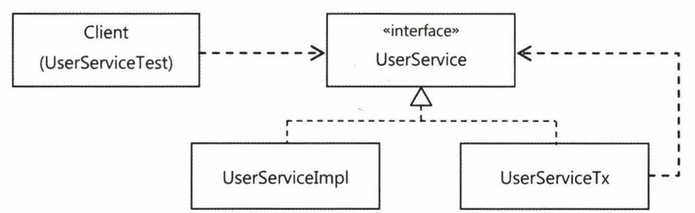
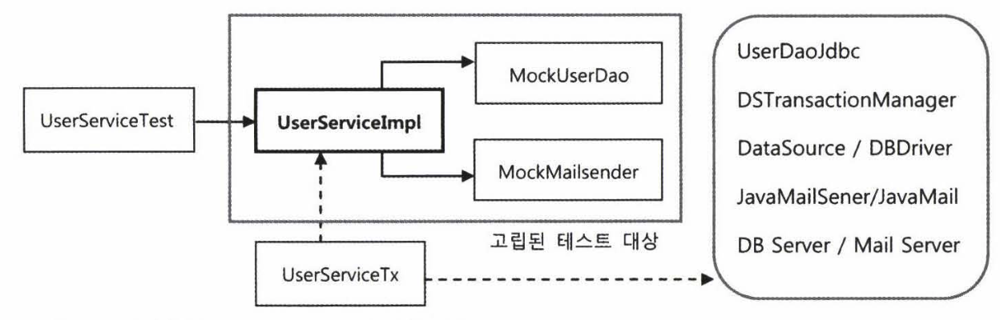
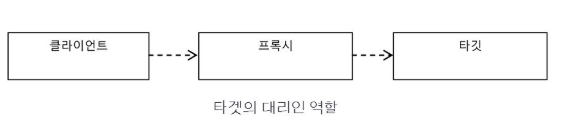
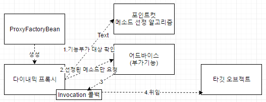

# 지옥 스터디 - 06 AOP
- AOP 는 IoC/DI, PSA 와 더불어 스프링 3대 기반 기술 중 하나.
- AOP 는 OOP 를 대체하는 개념이 아니다.
- 스프링에 적용된 AOP 의 가장 대표적인 사례는 선언적 트랜잭션 기능

## 트랜잭션 코드의 분리
- 서비스 추상화를 통해 트랜잭션 기술에 독립적인 코드가 됬지만 한 가지 걸리는 부분이 있다.
  - UserService 에 트랜잭션 경계설정을 위해 넣은 코드가 존재한다.
- 논리적으로 봤을때 UserService 에 트랜잭션 경계가 설정되어야 하는것은 맞지만 뭔가 찜찜하다..

### DI 를 통한 클래스 분리
- 메소드를 이용한 분리는 사실상 의미가 없다.
- 결국에는 UserService 에 트랜잭션 경계설정을 위한 코드가 남기 때문이다.
- 클래스로 분리했을때 문제라면 구체적인 구현 클래스를 직접 사용하게 된다면 트랜잭션 기능이 빠지게 된다.
- 직접 사용하는게 문제라면 **간접적으로 사용** 하게 만들면 된다.
- UserService 인터페이스를 도출하고, 인터페이스를 통해 사용하게끔 개선 해보자.

`UserService 인터페이스 도입`



- 지금까지는 DI 시 한번에 하나의 구현 클래스를 사용하는 방식을 택했다.
- 하지만 **반드시 그래야할까?**
- 한 번에 두개의 구현클래스를 동시에 이용한다면 어떨까
- 클라이언트 입장에서는 UserService 인터페이스를 통해 접근하기 때문에 구현 클래스를 몇개를 사용하던 문제 될 것은 없다.
- 실제 비즈니스로직을 담당하는 것은 UserServiceImpl 이고, 트랜잭션 처리를 담당하는것은 UserServiceTx 클래스이다.
  - UserServiceTx 는 UserServceImpl 을 통해 비즈니스 처리를 위임한다.
- UserService 를 사용하는 입장에선 UserService 인터페이스에 의존하고 있기 때문에 문제 될 것이 전혀 없다.

```java
public interface UserService {

    void add(User user);

    void upgradeLevels();
}
```

```java
public class UserServiceImpl implements UserService {

    UserLevelUpgradePolicy policy;

    UserDao userDao;

    DataSource dataSource;

    PlatformTransactionManager transactionManager;

    MailSender mailSender;

    public void setUserDao(UserDao userDao) {
        this.userDao = userDao;
    }

    public void setUserLevelUpgradePolicy(UserLevelUpgradePolicy policy) {
        this.policy = policy;
    }

    public void setDataSource(DataSource dataSource) {
        this.dataSource = dataSource;
    }

    public void setTransactionManager(PlatformTransactionManager transactionManager) {
        this.transactionManager = transactionManager;
    }

    public void setMailSender(MailSender mailSender) {
        this.mailSender = mailSender;
    }

    @Override
    public void add(User user) {
        if (user.getLevel() == null) {
            user.setLevel(Level.BASIC);
        }
        userDao.add(user);
    }

    @Override
    public void upgradeLevels() {
        // 트랜잭션 시작
        TransactionStatus status = transactionManager.getTransaction(
            new DefaultTransactionDefinition());
        try {
            upgradeLevelsInternal();
            // 트랜잭션 커밋
            transactionManager.commit(status);
        } catch (RuntimeException e) {
            transactionManager.rollback(status);
            throw e;
        }
    }

    private void upgradeLevelsInternal() {
        List<User> users = userDao.getAll();
        for (User user : users) {
            if (canUpgradeLevel(user)) {
                upgradeLevel(user);
            }
        }
    }

    private boolean canUpgradeLevel(User user) {
        return policy.canUpgradeLevel(user);
    }

    protected void upgradeLevel(User user) {
        policy.upgradeLevel(user);
        userDao.update(user);
        sendUpgradeEmail(user);
    }

    /**
     * 스프링 메일 추상화 사용
     */
    private void sendUpgradeEmail(User user) {
        SimpleMailMessage mailMessage = new SimpleMailMessage();
        mailMessage.setTo(user.getEmail());
        mailMessage.setFrom("useradmin@ksug.org");
        mailMessage.setSubject("Upgrade 안내");
        mailMessage.setText("사용자님의 등급이 : " + user.getLevel().name());
        mailSender.send(mailMessage);
    }
}
```

```java
public class UserServiceTx implements UserService {

    PlatformTransactionManager transactionManager;
    UserService userService;

    public void setUserService(UserService userService) {
        this.userService = userService;
    }

    public void setTransactionManager(PlatformTransactionManager transactionManager) {
        this.transactionManager = transactionManager;
    }

    @Override
    public void add(User user) {
        userService.add(user);
    }

    @Override
    public void upgradeLevels() {
        // 트랜잭션 시작
        TransactionStatus status = transactionManager.getTransaction(
            new DefaultTransactionDefinition());
        try {
            userService.upgradeLevels();
            // 트랜잭션 커밋
            transactionManager.commit(status);
        } catch (RuntimeException e) {
            transactionManager.rollback(status);
            throw e;
        }
    }
}
```

### 트랜잭션 경계설정 코드 분리의 장점
- 트랜잭션 경계설정 코드의 분리와 DI 를 통한 연결을 마쳤다.
- 이런 작업을 함으로 인해 얻을수 있는 장점은 무엇인가 ?
  1. 비즈니스 로직을 담당하는 UserServiceImpl 의 코드를 작성할 때는 트랜잭션과 같은 기술적인 내용에는 신경쓰지 않아도 된다.
  2. 비즈니스 로직에 대한 테스트를 손 쉽게 만들 수 있다.

## 고립된 단위 테스트
- 가장 편하고 좋은 테스트 방법 ? -> **작은 단위로 쪼개서 테스트**
- 작은 단위의 테스트가 좋은 이유 ? -> 테스트 실패시 원인을 찾는 것이 수월해진다.
  - 테스트 의도나 내용도 분명해지고 만들기도 쉬워진다.
- 작은 단위로 테스트 하더라도, 테스트 대상이 다른 오브젝트나 환경에 **의존적** 이라면 작은 단위테스트가 주는 장점을 얻기 힘들다.

### 복잡한 의존관계 속의 테스트
- UserService 를 테스트하려면 UseService 가 의존하고 있는 객체도 같이 동작하게 된다.
  - UserDao, TransactionManager, MailSender..
- UserService 를 테스트하는것 처럼 보이지만, 사실은 그 뒤에 존재하는 많은 오브젝트들과 환경, 서비스, 서버 심지어 네트워크까지 함께 테스트하는 셈이다.
- UserService 에 문제가 있는것도 아닌데 **다른 환경들에 의해 테스트가 실패할 수 있는것** 이다..!
  - 때문에 그 뒤에 존재하는 모든것이 합쳐져 테스트 대상이 되는것..

### 테스트 대상 고립시키기
- 테스트 대상이 환경이나 외부 서버 등 다른 요인에 의해 종속되고 영향 받지않고 **고립** 시킬 필요가 있다.
- MailSender 에 적용한 것 처럼 **테스트를 위한 대역** 을 사용하는 것이다.



- 고립된 테스트가 가능하도록 UserService 를 재구성 해보면 위와 같은 구조가 될 것이다.
- UserServiceImpl 에 대한 테스트가 진행될 때 사전에 테스트를 위해 준비된 동작을 하는 **목 오브젝트에만 의존** 하는 그림이다.

### 고립된 단위 테스트 적용

```java
class MockUserDao implements UserDao {

    private List<User> users;
    private List<User> updated = new ArrayList<>();

    public MockUserDao(List<User> users) {
        this.users = users;
    }

    /**
     * Stub 제공
     */
    public List<User> getUpdated() {
        return updated;
    }

    /**
     * Mock Object 제공
     */
    @Override
    public List<User> getAll() {
        return users;
    }

    @Override
    public void update(User user) {
        updated.add(user);
    }

    @Override
    public void add(User user) {
        throw new UnsupportedOperationException();
    }

    @Override
    public User get(String id) {
        throw new UnsupportedOperationException();
    }

    @Override
    public void deleteAll() {
        throw new UnsupportedOperationException();
    }

    @Override
    public int getCount() {
        throw new UnsupportedOperationException();
    }
}
```
- 고립된 단위 테스트를 위해 MockUserDao 를 구현했따.
- MockUserDao 는, getAll() 메소드를 호출하면 이미 만들어둔 Mock Users 목록을 반환한다.
- update() 호출시엔 해당 유저가 업데이트 대상이 되었다는 updated 목록에 이를 저장해 두었다가 검증시 활용한다.

`MockUserDao 를 활용한 고립된 테스트`

```java
class UserServiceTest {
    // ..
  
    @Test
    void upgradeLevels() {
      UserServiceImpl userService = new UserServiceImpl();
    
      MockUserDao mockUserDao = new MockUserDao(users);
      userService.setUserDao(mockUserDao);
      userService.setUserLevelUpgradePolicy(policy);

      MockMailSender mockMailSender = new MockMailSender();
      userService.setMailSender(mockMailSender);

      userService.upgradeLevels();

      List<User> updated = mockUserDao.getUpdated();
      assertThat(updated.size()).isEqualTo(2);
      checkUserAndLevel(updated.get(0), "ncucu1", Level.SILVER);
      checkUserAndLevel(updated.get(1), "ncucu3", Level.GOLD);

      List<String> request = mockMailSender.getRequests();
      assertThat(request.size()).isEqualTo(2);
      assertThat(request.get(0)).isEqualTo(users.get(1).getEmail());
      assertThat(request.get(1)).isEqualTo(users.get(3).getEmail());
    }

    private void checkUserAndLevel(User updated, String expected, Level expectedLevel) {
      assertThat(updated.getId()).isEqualTo(expected);
      assertThat(updated.getLevel()).isEqualTo(expectedLevel);
    }
}
```
- 테스트 대상인 UserServiceImpl 은 MockUserDao 에 의존하고 있다.
- upgradeLevels() 를 호출하면, MockUserDao 에 미리 생성해둔 유저 목록을 불러와 업데이트 대상을 선정한 뒤 MockUserDao 의 update 메소드를 호출할 것이다.
- update 메소드 호출대상이된 유저들은 MockUserDao 의 updated 컬렉션에 담기게 되고, upgradeLevels() 메소드 호출이 종료된 후 해당 목록을 가져와 이를 검증한다.

`테스트 수행 성능의 향상`
- UserServiceTest#upgradeLevels 를 호출하면 성공한다.
- 간단한 테스트라 차이를 체감하지 못하겠지만 테스트 수행시간은 이전에 비해 분명히 빨라졌다.
- 기존에는 DB 까지 연동하는 테스트라 수행 시간이 훨씬 길었다.
- 이는 UserServiceImpl 의 테스트를 도와주는 목 오브젝트 덕분이다.
- 고립된 테스트를 하면, 테스트 준비뿐 아니라 수행 성능도 크게 향상된다.
- 테스트가 빨라질수록 부담없이 자주 테스트를 돌려볼 수 있다.

## 단위 테스트와 통합 테스트
- 단위 테스트의 단위는 정하기 나름이다.
- 사용자 관리 기능 전체를 하나의 단위로 볼 수도 있을것이고, 하나의 클래스나 하나의 메소드를 하나의 단위로 볼 수도 있다.
- 중요한것은 **하나의 단위에 초점을 맞춰야 한다.**
- 두 개 이상의 성격이나 계층이 다른 오브젝트가 서로 연동하는 테스트거나 외부 환경에 요인을 받는다면 이는 **통합 테스트** 라고 부른다.
  - 스프링 프레임워크의 도움을 받아 DI 된 오브젝트를 테스트하는 것 또한 통합 테스트이다.

### 단위 테스트와 통합 테스트의 선택
- 단위 테스트와 통합 테스트 중 어떤 것을 사용할지 몇가지 가이드라인을 제시한다.
1. 항상 단위 테스트를 먼저 고려하라.
2. **하나의 클래스나 성격과 목적이 같은 긴밀한 클래스** 를 모아 외부와의 의존관계를 모두 차단하고 테스트 대역을 이용하도록 테스트를 작성하라.
3. 외부 리소스를 사용해야만 한다면 **통합 테스트** 로 만들라.
4. DAO 테스트는 통합 테스트로 분류된다.
5. 여러 단위가 의존관계를 가지고 동작할때를 위한 통하 테스트는 필요하다.
6. 단위 테스트를 만들기 복잡하다면 처음부터 통합테스트를 고려하라.
7. 스프링 컨텍스트를 사용하는 테스트도 통합 테스트이다.
8. 가능하면 스프링의 지원없이 가능한 테스트를 작성하라.

> 테스트하기 쉬운 코드는 좋은 코드다.

## 목 프레임워크
- 단위 테스트를 만들기 위해 스텁이나 목 오브젝트 사용은 필수적
- 하지만 매번 목 오브젝트를 만드는것은 현실적으로 봤을때 매우 번거로운 일이다.
- 이런 번거로운 목 오브젝트를 편리하게 작성하도록 도와주는 다양한 목 오브젝트 지원 프레임워크가 있다.

### Mockito
- Java 진영에서는 Mockito 가 큰 인끼를 끌고 있다.
- 목 프레임워크는 목 클래스를 일일히 준비해둘 필요가 없다.
- 간단한 메소드 호출만으로 다이나믹하게 특정 인터페이스를 구현한 테스트용 목 오브젝트를 만들 수 있다.

```java
UserDao mockUserDao = mock(UserDao.class);
```
- 위 처럼 목 오브젝트를 간단하게 생성할 수 있는데, 생성 직후 목 오브젝트는 아무런 기능이 없다.
- getAll() 메소드를 호출했을때 사용자 목록을 리턴하도록 **스텁기능** 을 추가해보자.

```java
when(mockUseDao.getAll()).thenReturn(this.users);
```
- 위 코드는 mockUserDao.getAll() 호출이 발생하면 users 목록을 반환하라는 선언이다.

```java
verity(mockUserDao, times(2)).update(any(User.class));
```
- 위 코드는 update 호출이 있었는지 검증하는 코드이다.
- Mockito 를 통해 생성된 목 오브젝트는 메소드 호출과 관련된 정보를 저장해 두고, 이를 검증할 수 있게 해준다.

`Mockito 를 적용한 테스트 코드`

```java
class UserServiceTest {
    // ..
    @Test
    void mockUpgradeLevels() throws Exception {
      UserServiceImpl userService = new UserServiceImpl();

      UserDao mockUserDao = mock(UserDao.class);
      when(mockUserDao.getAll()).thenReturn(this.users);
      userService.setUserDao(mockUserDao);

      MailSender mockMailSender = mock(MailSender.class);
      userService.setMailSender(mockMailSender);
      userService.setUserLevelUpgradePolicy(policy);

      userService.upgradeLevels();

      verify(mockUserDao, times(2)).update(any(User.class));
      verify(mockUserDao).update(users.get(1));
      assertThat(users.get(1).getLevel()).isEqualTo(Level.SILVER);
      verify(mockUserDao).update(users.get(3));
      assertThat(users.get(3).getLevel()).isEqualTo(Level.GOLD);

      ArgumentCaptor<SimpleMailMessage> mailMessageArg = ArgumentCaptor.forClass(SimpleMailMessage.class);
      verify(mockMailSender, times(2)).send(mailMessageArg.capture());
      List<SimpleMailMessage> mailMessages = mailMessageArg.getAllValues();
      assertThat(mailMessages.get(0).getTo()[0]).isEqualTo(users.get(1).getEmail());
      assertThat(mailMessages.get(1).getTo()[0]).isEqualTo(users.get(3).getEmail());
    }

    private void checkUserAndLevel(User updated, String expected, Level expectedLevel) {
      assertThat(updated.getId()).isEqualTo(expected);
      assertThat(updated.getLevel()).isEqualTo(expectedLevel);
    }
}
```
- ArgumentCaptor 를 사용했는데, 이는 실제 MailSender 의 목 오브젝트에 전달된 파라미터를 가져와서 내용을 검증할 수 있는 방법이다.

## 다이나믹 프록시와 팩토리 빈

### 프록시 패턴, 데코레이터 패턴
- 단순히 확장성을 고려해 한 가지 기능을 분리한다면, 전략 패턴을 사용하면 된다.
- 트랜잭션 기능에는 이미 전략패턴이 적용되어 있다.
- 하지만 전략패턴으로는, 트랜잭션 기능의 구현 내용을 분리했을 뿐, 트랜잭션 적용 코드는 그대로 남아 있다.
  - 구현 코드는 제거 했지만, 위임 기능을 통해 사용하는 코드는 함께 존재한다.
- 트랜잭션이라는 기능은 비즈니스 로직과는 성격이 다르다.
- 아예 그 적용 사실 자체를 밖으로 분리해야 한다.
- 때문에 이 방법을 활용해 UseServiceTx 를 만들고, UserServiceImpl 에는 트랜잭션 관련 코드가 남지 않았다.
- UserServiceTx 는 부가기능을 담은 클래스이다.
- 부가기능을 담은 클래스는 부가 기능외 나머지 기능은 핵심기능을 가진 클래스로 **위임** 해야 한다.
- 클라언트가 자신을 거쳐 부가기능을 적용한 핵심기능을 사용하게끔 해야한다.
- 때문에 UserService 인터페이스를 도출한 것이다.
- 이렇게 마치 클라이언트가 사용하려는 실제 대상인것 처럼 위장해 클라이언트의 요청을 받아 주는것을 대리자 와 같은 역할을 한다고 해서 **프록시** 라고 부른다.
- 프록시는 최종적으로 요청을 위임받아 처리하는 실제 오브젝트를 **타깃** 이라고 부른다.



- 프록시의 특징은 **타깃과 같은 인터페이스를 구현했고, 프록시가 타겟을 제어** 한다는 점이다.
- 프록시는 사용 목적에 따라 두가지로 구분한다.
  1. 클라이언트가 타깃에 접근하는 방법을 제어
  2. 타깃에 부가적인 기능을 부여하기 위함

> 이 두가지는 프록시를 둔다는것은 동일하지만 목적에 따라 디자인패턴에선 다른 패턴으로 구분한다.

`데코레이터 패턴`
- 데코레이터 패턴은 **런타임에 타깃에 부가적인 기능을 부여해주기 위해 프록시를 사용하는 패턴** 이다.
  - 런타임에 기능을 부가한다는 것은 컴파일 시점, 코드상에는 어떤 방법과 순서로 프록시와 타깃이 연결되는지 정해져 있지 않다.
- 데코레이터 패턴이라 불리는 이유 ?
  - 마치 제품이나 케익을 여러 겹으로 포장하고 장식을 붙이는것 과 같다.
  - 프록시가 한개로 제한되지 않고, 여러개의 프록시를 겹겹히 쌓아 올릴 수 있다.

> java.io 패키지의 InputStream/OutputStream 은 데코레이터 패턴의 대표적인 예

`프록시 패턴`
- 프록시 패턴의 프록시는 타깃의 기능을 확장하거나 추가하지 않는다.
- 클라이언트가 타깃에 접근하는 방식을 제어한다.
- 타깃 오브젝트를 생성하기 복잡하거나 당장 필요하지 않은 경우 실제 사용시점 까지 생성을 미루는 것이 가능하다.
  - 실제 타깃오브젝트가 아닌 프록시 객체의 레퍼런스를 참조한다.

> 프록시 패턴은, 타깃의 기능에는 관여하지 않으면서 접근하는 방법을 제어해주는 프록시를 이용한다. <br/>
> 다만 프록시는 코드에서 자신이 생성해야할 타깃 클래스 정보를 알아야하는 경우가 많다.

### 다이나믹 프록시
- java.lang.reflect 패키지에는 프록시를 손쉽게 만들 수 있도록 지원하는 클래스들이 있다.
- 기본적인 아이디어는 목 프레임워크와 비슷하다.
- 프록시 처럼 동작하는 오브젝트를 다이나믹하게 생성하는 것

`프록시 클래스`
- 다이나믹 프록시는 **리플렉션** 을 활용해 프록시를 만든다.
- 이를 활용한 프록시를 만들어 보자.

```java
interface Hello {
    String sayHello(String name);
    String sayHi(String name);
    String sayThankYou(String name);
}
```

```java
class HelloTarget implements Hello {

    @Override
    public String sayHello(String name) {
        return "Hello " + name;
    }

    @Override
    public String sayHi(String name) {
        return "Hi " + name;
    }

    @Override
    public String sayThankYou(String name) {
        return "Thank You " + name;
    }
}
```
- 프록시를 적용할 간단한 인터페이스와 그에 대한 구현체를 정의했다.

```java
class HelloUppercase implements Hello {

    Hello hello;

    public HelloUppercase(Hello hello) {
        this.hello = hello;
    }

    @Override
    public String sayHello(String name) {
        return hello.sayHello(name).toUpperCase();
    }

    @Override
    public String sayHi(String name) {
        return hello.sayHi(name).toUpperCase();
    }

    @Override
    public String sayThankYou(String name) {
        return hello.sayThankYou(name).toUpperCase();
    }
}
```
- Hello 인터페이스를 구현한 프록시 이다.
- 이는 데코레이터 패턴을 적용해 HelloTarget 에 부가기능을 추가한다.

`다이나믹 프록시 적용`
- 클래스로 만든 프록시인 HelloUppercase 를 다이나믹 프록시를 이용해 생성해 보자.
- 다이나믹 프록시는 **프록시 팩토리** 에 의해 런타임시 생성된 오브젝트이다.
- 때문에 타깃의 인터페이스와 같은 타입으로 만들어진다.
- 다이나믹 프록시가 구현 클래스는 자동으로 만들어주지만, 부가기능을 제공할 코드는 직접 작성해야 한다.
- 프록시 오브젝트와 별개로 **InvocationHandler** 인터페이스를 구현해야 한다.
  - 이는 invoke() 메소드 하나만을 가지고 있는 간단한 인터페이스 이다.
  
```java

```
- 다이나믹 프록시는 클라이언트의 요청을 리플렉션 정보로 변환해 이를 InvocationHandler 구현 오브젝트의 invoke 메소드로 넘겨주는 역할을 한다.
- 다음은 InvocationHandler 인터페이스를 구현한 부가기능 코드이다.

```java
class UppercaseHandler implements InvocationHandler {

    Hello target;

    public UppercaseHandler(Hello target) {
        this.target = target;
    }

    @Override
    public Object invoke(Object proxy, Method method, Object[] args) throws Throwable {
        Object ret = method.invoke(target, args);
        if (ret instanceof String) {
            return ((String)ret).toUpperCase();
        }
        return ret;
    }
}
```

```java
class JdkProxyTest {
    // ...
    @Test
    void jdkProxy() throws Exception {
      Hello proxiedHello = (Hello) Proxy.newProxyInstance(
              getClass().getClassLoader(), // 클래스 로딩에 사용할 클래스 로더
              new Class[]{Hello.class}, // 구현할 인터페이스
              new UppercaseHandler(new HelloTarget()) // 부가기능과 위임코드를 담은 구현체
      );
      assertThat(proxiedHello.sayHello("ncucu")).isEqualTo("HELLO NCUCU");
      assertThat(proxiedHello.sayHi("ncucu")).isEqualTo("HI NCUCU");
      assertThat(proxiedHello.sayThankYou("ncucu")).isEqualTo("THANK YOU NCUCU");
    }
}
```
- 다이나믹 프록시의 생성은 Proxy#newProxyInstance 를 통해 생성할 수 있다.
  - 다이나믹 프록시는 여러 인터페이스를 구현할 수 있기 때문에 이를 배열로 받는다.

### 다이나믹 프록시를 적용한 트랜잭션 부가기능
- 이전에 구현했던 UserServiceTx 를 다이나믹 프록시 방식으로 변경해보자.
- UserServiceTx 는 인터페이스의 모든 메소드를 구현해야하고 트랜잭션이 필요한 메소드마다 트랜잭션 처리가 중복된다.
- 때문에 트랜잭션 부가기능을 제공하는 다이나믹 프록시를 만들어 적용하는 것이 효율적이다.

`TransactionHandler`

```java
public class TransactionHandler implements InvocationHandler {

    private Object target;
    private PlatformTransactionManager transactionManager;
    private String pattern;

    public void setTarget(Object target) {
        this.target = target;
    }

    public void setTransactionManager(
        PlatformTransactionManager transactionManager) {
        this.transactionManager = transactionManager;
    }

    public void setPattern(String pattern) {
        this.pattern = pattern;
    }

    @Override
    public Object invoke(Object proxy, Method method, Object[] args) throws Throwable {
        if (method.getName().startsWith(pattern)) {
            return invokeInTransaction(method, args);
        }
        return method.invoke(target, args);
    }

    private Object invokeInTransaction(Method method, Object[] args) throws Throwable {
        TransactionStatus status =
            transactionManager.getTransaction(new DefaultTransactionDefinition());
        try {
            Object ret = method.invoke(target, args);
            transactionManager.commit(status);
            return ret;
        } catch (InvocationTargetException e) {
            transactionManager.rollback(status);
            throw e.getTargetException();
        }
    }
}
```
- 트랜잭션 부가기능을 구현한 TransactionHandler 이다.
- 요청을 위임할 타겟을 DI 로 제공 받는다.
- 또한 트랜잭션 추상화 인터페이스는 PlatformTransactionManager 도 DI 로 제공 받는다.
- 타깃 오브젝트의 모든 메소드에 트랜잭션을 적용하지 않도록 트랜잭션을 적용할 메소드의 패턴을 DI 받는다.
- TransactionHandler 가 호출되면, 트랜잭션을 적용할 메소드인지 먼저 선별을하고, 트랜잭션 적용대상이라면, invokeInTransaction 메소드를 / 아니라면 타깃 메소드를 그대로 호출한다.

### 다이나믹 프록시를 위한 팩토리 빈
- TransactionHandler 와 다이나믹 프록시를 스프링 DI 를 통해 사용할 수 있게 만들어야 한다.
- 하지만 다이나믹 프록시는 일반적인 스프링 빈으로 등록할 방법이 없다.
  - 스프링은 지정된 클래스명을 가지고 리플렉션을 이용해 오브젝트를 생성한다.
  - 다이나믹 프록시는 이런 방식으로 프록시 객체를 생성할 수 없다.

`팩토리 빈`
- 스프링은 클래스정보를 기반으로 오브젝트를 만드는 방법 외에 다양한 방법을 제공해준다.
- 대표적인 방법은 **팩토리 빈** 을 활용하는 것이다.
  - 이는 스프링을 대신해 오브젝트 생성로직을 담당하도록 만들어진 특별한 빈을 말한다.
- 팩토리빈을 만드는 방법중 간단한 방법은 FactoryBean 인터페이스를 구현하는 것이다.

```java
public interface FactoryBean<T> {

	String OBJECT_TYPE_ATTRIBUTE = "factoryBeanObjectType";

	@Nullable
	T getObject() throws Exception;

	@Nullable
	Class<?> getObjectType();
    
	default boolean isSingleton() {
		return true;
	}

}
```
- FactoryBean#getObject : 빈 오브젝트를 생성한다.
- FactoryBean#getObjectType : 생성되는 오브젝트 타입을 알려준다.
- FactoryBean#isSingleton : 빈 오브젝트가 싱글톤 오브젝트인지 알려준다.

> FactoryBean 을 구현한 클래스를 스프링 빈으로 등록하면 팩토리 빈으로써 동작한다.

`팩토리빈 학습 테스트`
- 팩토리빈 동작 원리 파악을 위한 학습 테스트이다.

```java
public class Message {
    String text;

    private Message(String text) {
        this.text = text;
    }

    public String getText() {
        return text;
    }

    public static Message newMessage(String text) {
        return new Message(text);
    }
}
```

```java
public class MessageFactoryBean implements FactoryBean<Message> {

    String text;

    public void setText(String text) {
        this.text = text;
    }

    @Override
    public Message getObject() throws Exception {
        return Message.newMessage(text);
    }

    @Override
    public Class<?> getObjectType() {
        return Message.class;
    }

    @Override
    public boolean isSingleton() {
        return false;
    }
}
```
- 일반적인 생성자로 생성할 수 없는 Message 클래스를 정의하고, 이를 생성하는 MessageFactoryBean 을 정의했다.
  - 스프링은 private 생성자도 빈으로 생성할 수 있지만, 이는 스태틱 메소드를 통해 오브젝트가 만들어져야 하는 중요한 이유가 있다는 것이다.
  - 때문에 이를 무시하고 강제로 생성하는 것은 위험하다.

```java
class Factory {
    @Bean
    public MessageFactoryBean message() {
      MessageFactoryBean messageFactoryBean = new MessageFactoryBean();
      messageFactoryBean.setText("Factory Bean");
      return messageFactoryBean;
    }
}
```

```java
@ExtendWith(SpringExtension.class)
@ContextConfiguration(
    classes = DaoFactory.class
)
class MessageFactoryBeanTest {

    @Autowired
    ApplicationContext applicationContext;

    @Test
    void getMessageFromFactoryBean() {
        Object message = applicationContext.getBean("message");
        assertThat(message).isInstanceOf(Message.class);
        assertThat(((Message)message).getText()).isEqualTo("Factory Bean");
    }
}
```
- 이는 팩토리빈이 생성해주는 오브젝트를 검증하는 테스트 코드이다.
- 드물게 팩토리빈 자체를 가져오고 싶을 때도 있다.
- 이런경우 getBean 메소드 호출시 빈이름앞에 '&' 를 붙여 호출하면 팩토리빈 자체를 반환한다.

```java
class MessageFactoryBeanTest {

    @Autowired
    ApplicationContext applicationContext;

    @Test
    void getFactoryBean() {
        Object message = applicationContext.getBean("&message");
    }
}
```

`트랜잭션 프록시 팩토리 빈`

```java
public class TxProxyFactoryBean implements FactoryBean<Object> {

    Object target;
    PlatformTransactionManager transactionManager;
    String pattern;
    Class<?> serviceInterface;

    public void setTarget(Object target) {
        this.target = target;
    }

    public void setTransactionManager(
        PlatformTransactionManager transactionManager) {
        this.transactionManager = transactionManager;
    }

    public void setPattern(String pattern) {
        this.pattern = pattern;
    }

    public void setServiceInterface(Class<?> serviceInterface) {
        this.serviceInterface = serviceInterface;
    }

    @Override
    public Object getObject() throws Exception {
        TransactionHandler txHandler = new TransactionHandler();
        txHandler.setTarget(target);
        txHandler.setTransactionManager(this.transactionManager);
        txHandler.setPattern(pattern);
        return Proxy.newProxyInstance(
            getClass().getClassLoader(),
            new Class[]{serviceInterface},
            txHandler
        );
    }

    @Override
    public Class<?> getObjectType() {
        return serviceInterface;
    }

    /**
     * FactoryBean 이 매번 동일한 오브젝트를 반환하지 않도록...
     */
    @Override
    public boolean isSingleton() {
        return false;
    }
}
```

### 팩토리 빈 방식의 장점 과 한계
- TransactionHandler 를 사용하는 다이나믹 프록시를 생성해주는 TxProxyFactoryBean 을 적용했다.
- 이는 코드의 수정 없이 다양한 클래스에 적용이 가능하다.
- 타깃 오브젝트에 맞는 프로퍼티 정보를 설정해 빈으르 등록하기만 하면 된다.
- 이를 활용하면 프록시 기법을 아주 빠르고 쉽게 적용할 수 있다.
- 하지만 단점도 분명히 존재한다.
- 프록시를 통해 타깃에 부가기능을 제공하는 것은 **메소드 단위** 로 일어난다.
- 한 번에 **여러 클래스에 공통적인 부가기능** 을 부여하는것은 현재로서는 불가능하다.
- 트랜잭션 처럼 여러 클래스에 적용할 필요가 있다면 팩토리빈의 설정이 중복된다.
- 하나의 타깃에 여러 부가기능을 적용할 때도 문제가 된다.
- 또 하나는 TransactionHandler 객체가 팩토리 빈 갯수만큼 만들어진다는 점이다.

## 스프링 프록시 팩토리 빈

### ProxyFactoryBean
- 스프링은 트랜잭션 기술처럼 서비스 추상화를 프록시 기술에도 적용하고 있다.
  - JDK 다이나믹 프록시 외에도 편리하게 프록시를 만들 수 있는 다양한 기술이 존재한다.
- 스프링은 일관된 방법으로 프록시를 만들 수 있게 추상화 레이어를 제공한다.
- ProxyFactoryBean 은 프록시를 생성해 빈 오브젝트로 등록하게 해주는 팩토리 빈이다.
- TxProxyFactoryBean 과 달리 ProxyFactoryBean 은 **순수하게 프록시를 생성하는 작업만 담당** 한다.
  - 프록시를 통해 제공할 부가기능은 별도 빈으로 등록해 사용할 수 있다.
- ProxyFactoryBean 이 생성하는 프록시에 사용할 부가기능은 **MethodInterceptor** 인터페이스를 구현해 만든다.
  - InvocationHandler 와 비슷하지만 다른점 ? -> ProxyFactoryBean 으로 부터 타깃 오브젝트에 대한 정보까지 받는다.
    - 때문에 타깃 오브젝트와 별개로 독립적으로 만들어 질 수 있다.
    - 싱글톤 빈으로 등록이 가능

```java
class UpperCaseAdvice implements MethodInterceptor {

    @Override
    public Object invoke(MethodInvocation invocation) throws Throwable {
        String ret = (String)invocation.proceed();
        return ret.toUpperCase();
    }
}
```

```java
class JdkProxyTest {
    // ..
    @Test
    void proxyFactoryBean() {
      ProxyFactoryBean proxyFactoryBean = new ProxyFactoryBean();
      proxyFactoryBean.setTarget(new HelloTarget());
      proxyFactoryBean.addAdvice(new UpperCaseAdvice());
      Hello proxiedHello = (Hello) proxyFactoryBean.getObject();
      assertThat(proxiedHello.sayHello("ncucu")).isEqualTo("HELLO NCUCU");
      assertThat(proxiedHello.sayHi("ncucu")).isEqualTo("HI NCUCU");
      assertThat(proxiedHello.sayThankYou("ncucu")).isEqualTo("THANK YOU NCUCU");
    }
}
```

### 어드바이스
- MethodInterceptor 를 구현한 클래스에는 타깃 오브젝트가 없다.
- 메소드 정보와 함께 타깃 오브젝트 담긴 **MethodInvocation** 이 전달되기 때문이다.
- 때문에 이는 부가기능에 집중 할 수 있다.
  - 관심사의 분리가 이뤄짐
- MethodInvocation 은 콜백 오브젝트로, proceed() 를 호출하면 타깃 오브젝트의 메소드를 내부적으로 실행해준다.
  - MethodInterceptor 는 일종의 템플릿처럼 동작한다.
- ProxyFactoryBean 의 가장 큰 장점이다.
  - 작은 단위의 템플릿/콜백 패턴을 적용했기 때문에 MethodInterceptor 를 싱글톤으로 두고 공유할 수 있다.
- 마치 JdbcTemplate 의 구조와 유사하다.
- ProxyFactoryBean 에 부가기능을 추가할때 ProxyFactoryBean#addAdvice 를 사용하는것 도 특징중 하나이다.
  - add 라는 것은, 즉 여러 부가기능을 추가할 수 있다는 의미이다.
  - addMethodInterceptor 가 아닌 addAdvice 이다..!
  - MethodInterceptor 는 Advice 인터페이스를 상속하는 서브 인터페이스
- 타깃 오브젝트에 적용하는 부가기능을 담은 오브젝트 -> 스프링에서는 Advice 라고 한다.
- ProxyFactoryBean 은 타깃 오브젝트의 타입정보를 스스로 알아낼 수도 있고, 프로퍼티를 통해 제공받을 수도 있다.

### 포인트컷
- 프록시의 핵심 가치는 타깃을 대신해 클라이언트 요청을 받아 처리하는 오브젝트 존재 자체 이다.
- 메소드를 선별하는 기능은 프록시로 부터 분리하는 것이 낫다.
- InvocationHandler 의 문제중 하나는 부가기능을 가진 객체가 타깃과 메소드 선정 알고리즘 코드에 의존하고 있다는 것이었다.
  - 때문에 특정 객체에 종속적인 구조가 되고, 타깃이 추가될때마다 매번 새롭게 빈으로 등록을 했던 것이다..!
- ProxyFactoryBean 은 부가기능 (Advice) 과 메소드 선정 알고리즘 (Pointcut) 을 활용하는 유연한 구조를 제공한다.



- 부가 기능을 제공하는 오브젝트 : Advice
- 메소드 선정 알고리즘을 담은 오브젝트 : Pointcut
- 이 두가지 모두 프록시에 DI 로 주입되어 사용된다.
  - 여러 프록시에서 공유가 가능하도록 만들어지기 때문에 싱글톤 빈으로 등록이 가능하다.
- 프록시는 요청을 받으면, Pointcut 을 통해 적용 대상인지 확인한다.
- 적용대상이라면 그때 Advice 를 호출한다.
- 이는 전형적인 전략패턴의 구조이며 OCP 를 지키는 구조이다.

`Pointcut 학습 테스트`

```java
class JdkProxyTest {
    // ...
    @Test
    void pointCutAdvisor() {
      ProxyFactoryBean proxyFactoryBean = new ProxyFactoryBean();
      proxyFactoryBean.setTarget(new HelloTarget());

      // 포인트 컷 지정
      // 포인트컷 : 부가기능 적용 대상 선정 알고리즘
      NameMatchMethodPointcut pointcut = new NameMatchMethodPointcut();
      pointcut.setMappedName("sayH*");

      // 어드바이스 지정
      // 어드바이스 : 부가기능
      // 어드바이저 : 포인트컷 + 어드바이스
      // 어드바이저로 지정하는 이유 ?
      // 여러 개의 어드바이스와 포인트컷이 존재할 수 있기 때문이다.
      proxyFactoryBean.addAdvisor(new DefaultPointcutAdvisor(pointcut, new UpperCaseAdvice()));

      Hello proxiedHello = (Hello) proxyFactoryBean.getObject();
      assertThat(proxiedHello.sayHello("ncucu")).isEqualTo("HELLO NCUCU");
      assertThat(proxiedHello.sayHi("ncucu")).isEqualTo("HI NCUCU");
      assertThat(proxiedHello.sayThankYou("ncucu")).isEqualTo("Thank You ncucu");
    }
}
```
- NameMatchMethodPointcut : 스프링이 제공하는 구현체중 하나, 메소드 이름을 비교해 대상을 선정하는 포인트컷
- 포인트컷과 어드바이스를 함께 등록하려면 이를 하나로 묶어 Advisor 타입으로 다뤄야 한다.
  - 이유 ?
  - ProxyFactoryBean 에는 여러 어드바이스와 포인트컷이 존재할 수 있다.
  - 때문에 어떤 어드바이스에 대해 어떤 포인트컷을 적용해야 하는지 애매해지기 때문에 이런 방식을 컴포짓 타입으로 취급하는 것이다.
- 어드바이스와 포인트컷을 묶은 오브젝트를 **어드바이저** 라고 부른다.