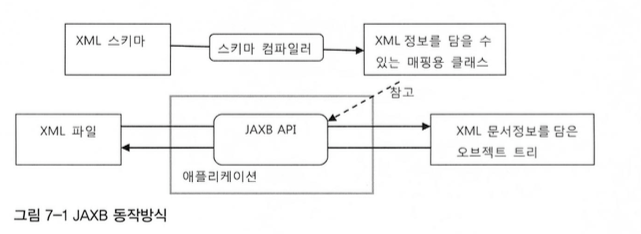
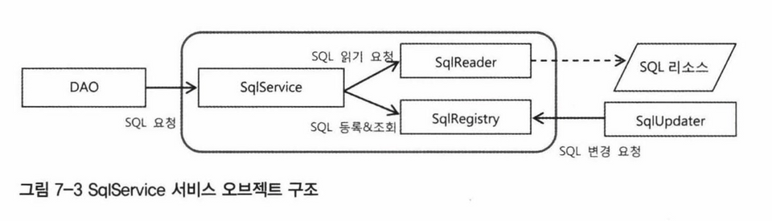
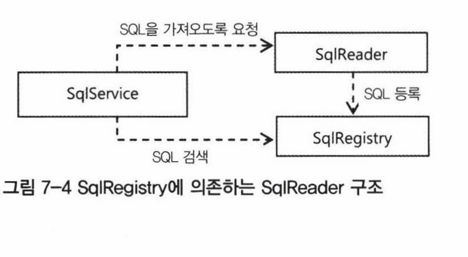
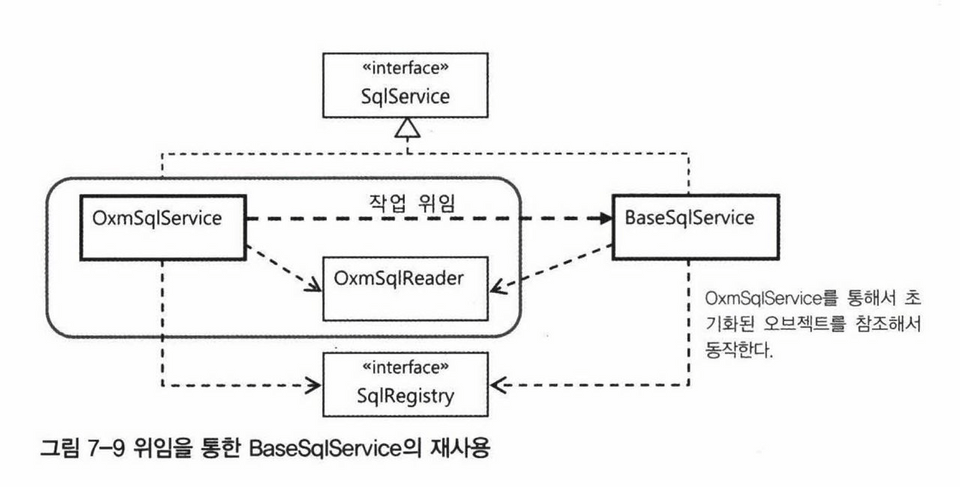

# 지옥 스터디 - 07 스프링 핵심 기술의 응용

## SQL 과 DAO 의 분리
- UserDao 는 지속적은 개선을 통해 더 이상 손대지 않아도 될 정도로 만들었다.
- 하지만 마지막으로 한 가지 더 욕심을 내보자면, **SQL 을 DAO 에서 분리하는 것** 이다.
- 반복적인 JDBC 흐름 작업은 템플릿을 통해, 트랜잭션과 예외 처리는 서비스 추상화와 AOP 를 통해 모두 제거했다.
  - 데이터 액세스 작업을 둘러싼 다양한 코드를 **책임과 성격** 에 따라 분리 했다.
- DAO 는 데이터를 가져오고 조작하는 작업의 **인터페이스** 역할을 한다.
- 데이터 엑세스 로직이 바뀌지 않으면 DAO 는 수정될 일이 없다.
  - 하지만 DB 테이블, 필드명, SQL 문이 수정될 수 있따.
  - 이런 이유로 인해 DAO 코드의 수정이 불가피해 진다.
- SQL 을 DAO 에서 분리해 관리할 수 있다면 좋을 것이다.

### XML 을 이용한 분리
- 가장 손 쉽게 생각해볼 수 있는 분리 방법은, SQL 을 XML 설정 파일로 빼내는 것
- 스프링은 설정을 통해 빈에 값을 주입해 줄 수 있다.

`UserDaoJdbc`

```java
class UserDaoJdbc implements UserDao {

    private String userAdd;

    public void setUserAdd(String userAdd) {
        this.userAdd = userAdd;
    }
    
    public void add(User user) {
        jdbcTemplate.update(
            userAdd,
            user.getId(), user.getName(), user.getPassword(), user.getLevel().intValue(), user.getLogin(), user.getRecommend()
        );
    }
}
```
- userAdd 라는 insert SQL 을 XML 설정으로 분리해 주입한다면, 위와 같은 형태로 사용하게 될 것이다.
- 하지만 이런 방식은 SQL 이 많아 질 수록 DAO 에 프로퍼티가 계속 추가된다는 문제가 있다.
- 이를 개선하기 위해 Map 을 활용해 보자.

`개선된 UserDaoJdbc`

```java
class UserDaoJdbc implements UserDao {

    private Map<String, String> sqlMap;

    public void setSqlMap(Map<String, String> sqlMap) {
        this.sqlMap = sqlMap;
    }

    public void add(User user) {
        jdbcTemplate.update(
            sqlMap.get("add"),
            user.getId(), user.getName(), user.getPassword(), user.getLevel().intValue(), user.getLogin(), user.getRecommend()
        );
    }
}
```
- sqlMap 이라는 프로퍼티를 선언하고, Map 으로 모든 SQL 문을 주입받아 이를 사용한다.
- SQL 용 프로퍼티를 일일히 추가하는 것 보다 작업량도 적고 코드도 간단하다.
- 대신 SQL 을 가져다 사용할 때 문자열로 된 키를 사용하기 때문에 **휴먼 에러** 에 취약하다는 단점이 있다.

### SQL 제공 서비스
- 스프링 설정파일을 통해 SQL 을 분리 했지만 몇 가지 문제가 있다.
- SQL 과 DI 설정정보가 한데 섞여있어 지저분하기 관리하기 쉽지 않다.
- SQL 을 따로 구분해 둬야 관리 및 리뷰, 튜닝 작업시 수월하다.
- 반드시 XML 로만 읽어오리라는 법도 없다.
  - 경우에 따라 다른 파일 또는 DB, 심지어 HTTP 를 통해 읽어들어야 할 수도 있다.

`SQL Service 인터페이스`
- 가장 먼저할일 ? -> SQL Service 인터페이스 설계
- DAO 는 SQL Service 를 통해서 조회해 사용하기만 하면 된다.
  - SQL 이 어디에 저장되어 있는지, 어떻게 검색하느지에 대한 것은 관심사가 아니다.

```java
interface SqlService {
    String getSql(String key) throws SqlRetrievalFailureException;
}
```
- SqlService 인터페이스를 정의한다.
- 이는 getSql 이라는 하나의 메소드만 가지고 있고, 주어진 키를 기반으로 SQL 을 조회해 온다.
- 만약 키에 해당하는 SQL 이 없다면, SqlRetrievalFailureException 예외가 발생한다.

```java
class UserDaoJdbc implements UserDao {

    private SqlService sqlService;
  
    public void setSqlService(SqlService sqlService) {
      this.sqlService = sqlService;
    }
  
    @Override
    public void add(final User user) throws DuplicateKeyException {
      jdbcTemplate.update(
              sqlService.getSql("userAdd"),
              user.getId(), user.getName(), user.getPassword(), user.getLevel().intValue(), user.getLogin(), user.getRecommend()
      );
    }
  
    @Override
    public User get(String id) {
      return jdbcTemplate.queryForObject(
              sqlService.getSql("userGet"),
              userMapper,
              id
      );
    }
  
    @Override
    public void deleteAll() {
      jdbcTemplate.update(sqlService.getSql("userDelete"));
    }
  
    @Override
    public int getCount() {
      return jdbcTemplate.queryForObject(sqlService.getSql("userCount"), Integer.class);
    }
  
    @Override
    public void update(User user) {
      jdbcTemplate.update(
              sqlService.getSql("userUpdate"),
              user.getName(), user.getPassword(), user.getLevel().intValue(), user.getLogin(), user.getRecommend(),
              user.getId()
      );
    }
  
    @Override
    public List<User> getAll() {
      return jdbcTemplate.query(sqlService.getSql("userGetAll"), userMapper);
    }
}
```
- 모든 메소드에서 SqlService 를 통해 해당 SQL 을 가져와 사용하도록 UserDaoJdbc 를 변경했다.
- UserDaoJdbc SqlService 인터페이스에 의존한다.

`스프링 설정 기반 초간단 SQL 서비스`
- SqlService 를 가장 간단한 방법으로 구현해보자.
- 이전에 사용했던 Map/스프링 설정 기반 으로 구현한다.

```java
public class SimpleSqlService implements SqlService {

    private Map<String, String> sqlMap;

    public void setSqlMap(Map<String, String> sqlMap) {
        this.sqlMap = sqlMap;
    }

    @Override
    public String getSql(String key) throws SqlRetrievalFailureException {
        String sql = sqlMap.get(key);
        if (sql == null) {
            throw new SqlRetrievalFailureException(key + "에 대한 SQL 을 찾을 수 없습니다.");
        }
        return sql;
    }
}
```

## 인터페이스 분리와 자기참조 빈

### XML 기반 SQL Service
- 스프링의 XML 설정으로 SQL 정보를 넣는 것은 좋은 방식이 아니다.
- SQL 을 저장해두는 전용 포맷을 가진 **독립적인 파일** 을 사용하는 것이 바람직하다.
- 검색을 위한 KEY 와 SQL 을 담은 간단한 XML 문서를 설계하고, 이를 가져다 사용하는 SQL 서비스를 구현하자.

`Jaxb`
- XML 에 담긴 정보를 가져오는 방법은 다양하다.
- 이중 JAXB (Java Architecture for XML Binding) 를 사용한다.
- 전통적인 **DOM** 방식과 비교했을때 JAXB 의 장점은 **XML 문서정보를 거의 동일한 구조의 오브젝트로 매핑해준다** 는 점이다.
  - DOM 은 XML 정보를 리플렉션 API 로 간접적으로 접근해야 한다.



`SQL 을 위한 스키마 작성과 컴파일`

```xml
<?xml version="1.0" encoding="UTF-8" ?>
<sqlmap xmlns="http://ncucu.me/sqlmap" xmlns:xsi="http://www.w3.org/2001/XMLSchema-instance"
  xsi:schemaLocation="http://ncucu.me/sqlmap ../../../../schema.xsd">
  <sql key="userAdd">insert into users(id, name, password, level, login, recommend) values (?, ?, ?, ?, ?, ?)</sql>
  <sql key="userGet">select * from users where id = ?</sql>
  <sql key="userGetAll">select * from users order by id</sql>
  <sql key="userDelete">delete from users</sql>
  <sql key="userCount">select count(*) from users</sql>
  <sql key="userUpdate">update users set name = ?, password = ?, level = ?, login = ?, recommend = ? where id = ?</sql>
</sqlmap>
```

```xml
<?xml version="1.0" encoding="UTF-8" ?>
<schema xmlns="http://www.w3.org/2001/XMLSchema"
  targetNamespace="http://ncucu.me/sqlmap"
  xmlns:tns="http://ncucu.me/sqlmap" elementFormDefault="qualified">

  <element name="sqlmap">
    <complexType>
      <sequence>
        <element name="sql" maxOccurs="unbounded" type="tns:sqlType"/>
      </sequence>
    </complexType>
  </element>
  <complexType name="sqlType">
    <simpleContent>
      <extension base="string">
        <attribute name="key" use="required" type="string"/>
      </extension>
    </simpleContent>
  </complexType>
</schema>
```
- SQL 을 다룰 XML 과 해당 XML 의 스키마 파일이다.
- XML 의 스키마 파일을 .xsd 포맷으로 저장하고, JAXB 컴파일러를 활용해 컴파일 하면 다음과 같은 파일이 생성된다.
  - `-xjc -p sqlservice.jaxb sqlmap.xsd -d src/main/java`

```java
@XmlRegistry
public class ObjectFactory {


    /**
     * Create a new ObjectFactory that can be used to create new instances of schema derived classes for package: sqlservice.jaxb
     * 
     */
    public ObjectFactory() {
    }

    /**
     * Create an instance of {@link Sqlmap }
     * 
     */
    public Sqlmap createSqlmap() {
        return new Sqlmap();
    }

    /**
     * Create an instance of {@link SqlType }
     * 
     */
    public SqlType createSqlType() {
        return new SqlType();
    }

}
@XmlAccessorType(XmlAccessType.FIELD)
@XmlType(name = "", propOrder = {
        "sql"
})
@XmlRootElement(name = "sqlmap")
public class Sqlmap {

  @XmlElement(required = true)
  protected List<SqlType> sql;

  /**
   * Gets the value of the sql property.
   *
   * <p>
   * This accessor method returns a reference to the live list,
   * not a snapshot. Therefore any modification you make to the
   * returned list will be present inside the JAXB object.
   * This is why there is not a <CODE>set</CODE> method for the sql property.
   *
   * <p>
   * For example, to add a new item, do as follows:
   * <pre>
   *    getSql().add(newItem);
   * </pre>
   *
   *
   * <p>
   * Objects of the following type(s) are allowed in the list
   * {@link SqlType }
   *
   *
   */
  public List<SqlType> getSql() {
    if (sql == null) {
      sql = new ArrayList<SqlType>();
    }
    return this.sql;
  }

}
@XmlAccessorType(XmlAccessType.FIELD)
@XmlType(name = "sqlType", propOrder = {
        "value"
})
public class SqlType {

  @XmlValue
  protected String value;
  @XmlAttribute(name = "key", required = true)
  protected String key;

  /**
   * value 속성의 값을 가져옵니다.
   *
   * @return
   *     possible object is
   *     {@link String }
   *
   */
  public String getValue() {
    return value;
  }

  /**
   * value 속성의 값을 설정합니다.
   *
   * @param value
   *     allowed object is
   *     {@link String }
   *
   */
  public void setValue(String value) {
    this.value = value;
  }

  /**
   * key 속성의 값을 가져옵니다.
   *
   * @return
   *     possible object is
   *     {@link String }
   *
   */
  public String getKey() {
    return key;
  }

  /**
   * key 속성의 값을 설정합니다.
   *
   * @param value
   *     allowed object is
   *     {@link String }
   *
   */
  public void setKey(String value) {
    this.key = value;
  }

}
```
- JAXB 컴파일러가 생성한 파일들을 살펴보면, 스키마 파일을 기반으로 XML 문서를 바인딩할 클래스들을 생성했다.
  - 이는 JavaBeans 스타일의 접근자로 구성되어 있다.
- 때문에 이해는 어렵지 않을 것이다.

### JAXB 학습 테스트
- JAXB API 의 사용법을 익히기 위한 학습 테스트이다.
- 우선 테스트용 XML 을 작성하고 이를 이용해 자바오브젝트로 변환이 되는지 확인해 본다.

`테스트용 xml`

```xml
<?xml version="1.0" encoding="UTF-8" ?>
<sqlmap xmlns="http://ncucu.me/sqlmap" xmlns:xsi="http://www.w3.org/2001/XMLSchema-instance"
  xsi:schemaLocation="http://ncucu.me/sqlmap ../../../../schema.xsd">
  <sql key="add">insert</sql>
  <sql key="get">select</sql>
  <sql key="delete">delete</sql>
</sqlmap>
```

`JaxbTest`

```java
public class JaxbTest {

    @Test
    void readSqlMap() throws Exception {
        String contextPath = Sqlmap.class.getPackage().getName();
        JAXBContext context = JAXBContext.newInstance(contextPath);
        Unmarshaller unmarshaller = context.createUnmarshaller();

        Sqlmap sqlMap = (Sqlmap) unmarshaller.unmarshal(
            getClass().getResourceAsStream("dao/sqlmap.xml")
        );

        List<SqlType> sqlList = sqlMap.getSql();

        assertThat(sqlList.size()).isEqualTo(3);
        assertThat(sqlList.get(0).getKey()).isEqualTo("add");
        assertThat(sqlList.get(0).getValue()).isEqualTo("insert");

        assertThat(sqlList.get(1).getKey()).isEqualTo("get");
        assertThat(sqlList.get(1).getValue()).isEqualTo("select");

        assertThat(sqlList.get(2).getKey()).isEqualTo("delete");
        assertThat(sqlList.get(2).getValue()).isEqualTo("delete");
    }
}
```
- XML 문서를 읽어, 자바 오브젝트로 변환하는 것을 JAXB 에서는 언마샬링 / 반대로 오브젝트를 XML 로 변환하는 것을 마샬링 이라고 한다.

### XML SQL Service 구현
- JAXB 를 이용해 XML 을 읽는것은 문제가 없다.
- 하지만 **언제 XML 을 읽어올 것인가** 에 대해 고민이 필요하다.
- DAO 가 요청할때 마다 매번 새로 읽어들이는것은 너무 비효율적이다.
- 최초 1회 읽어 들인 뒤 이를 캐싱 (맵에 저장) 한 뒤 재사용 하는 방식이 좋을것 같다.

`XmlSqlService`

```java
public class XmlSqlService implements SqlService {

    private Map<String, String> sqlMap = new HashMap<>();

    public XmlSqlService() {
        String contextPath = Sqlmap.class.getPackage().getName();
        try {
            JAXBContext context = JAXBContext.newInstance(contextPath);
            Unmarshaller unmarshaller = context.createUnmarshaller();
            InputStream is = UserDao.class.getResourceAsStream("sqlmap.xml");
            Sqlmap sqlmap = (Sqlmap) unmarshaller.unmarshal(is);
            for (SqlType sql : sqlmap.getSql()) {
                sqlMap.put(sql.getKey(), sql.getValue());
            }
        } catch (JAXBException e) {
            throw new RuntimeException(e);
        }
    }

    @Override
    public String getSql(String key) throws SqlRetrievalFailureException {
        String sql = sqlMap.get(key);
        if (sql == null) {
            throw new SqlRetrievalFailureException(key + " 에 해당하는 SQL 을 찾을 수 없습니다.");
        }
        return sql;
    }
}
```
- XmlSqlService 를 **스프링 빈** 으로 등록해 활용할 것이다.
- 근데 스프링이 언제 이 빈오브젝트를 생성할지 모르기 때문에 SQL 을 최초 1회 읽어오는 작업을 어디서 처리해야할지 가 막막하다.
- 때문에 우선 생성자를 통해 구현을 했다.
- XmlSqlService 오브젝트가 생성되면 JAXB API 를 이용해 sqlmap.xml 파일을 읽고 해당 내용을 sqlMap 이라는 내부 필드에 캐싱한다.
- 그 이후 getSql 요청이 오면 sqlMap 에 저장된 데이터를 서빙하는 구조이다.

### 빈의 초기화 작업
- XmlSqlService 의 기능 구현은 무사히 마쳤다.
- 의도한대로 잘 동작하고 큰 문제는 없어 보인다.
- 하지만 몇 가지 개선했으면 하는 점이 있다.
1. 생성자에서 복잡한 초기화 작업을 수행하고 있다.
   - 생성자에서는 예외가 발생할 수 있는 복잡한 초기화작업은 하지 않는것이 좋다.
   - 오브젝트중 발생하는 예외는 다루기 힘들고, 상속하기 불편하며, 보안에 문제가 발생할 수도 있다.
2. 읽어들일 파일의 위치와 이름이 코드에 고정되어 있다.

`개선된 XmlSqlService`

```java
public class XmlSqlService implements SqlService {

    private Map<String, String> sqlMap = new HashMap<>();
    private String sqlmapFile;

    public XmlSqlService() {

    }

    public void setSqlmapFile(String sqlmapFile) {
        this.sqlmapFile = sqlmapFile;
    }

    /**
     * 스프링이 제공하는 BeanPostProcessor
     * @see InitDestroyAnnotationBeanPostProcessor
     * @see CommonAnnotationBeanPostProcessor
     */
    @PostConstruct
    public void loadSql() {
        // 생성자에 복잡한 초기화 로직을 넣는것은 좋은 방법이 아니다.
        // 별도의 메소드로 추출해 호출해 주는 방식 사용..
        String contextPath = Sqlmap.class.getPackage().getName();
        try {
            JAXBContext context = JAXBContext.newInstance(contextPath);
            Unmarshaller unmarshaller = context.createUnmarshaller();
            InputStream is = UserDao.class.getResourceAsStream(sqlmapFile);
            Sqlmap sqlmap = (Sqlmap) unmarshaller.unmarshal(is);
            for (SqlType sql : sqlmap.getSql()) {
                sqlMap.put(sql.getKey(), sql.getValue());
            }
        } catch (JAXBException e) {
            throw new RuntimeException(e);
        }
    }

    @Override
    public String getSql(String key) throws SqlRetrievalFailureException {
        String sql = sqlMap.get(key);
        if (sql == null) {
            throw new SqlRetrievalFailureException(key + " 에 해당하는 SQL 을 찾을 수 없습니다.");
        }
        return sql;
    }
}
```
- 위에서 언급된 문제들을 개선했다.
- 우선 초기화 작업을 loadSql() 이라는 별도의 초기화 메소드를 만들어 옮겼다.
- 그리고 sql 파일명이 고정되어 있기 때문에 DI 받을 수 있도록 변경했다.
- 하지만 한 가지 걸리는 점은 초기화 메소드가 언제 호출되어야 할까 ? 또 어떻게 실행할 수 있을지가 관건이다.
- XmlSqlService 의 **제어권** 은 스프링에게 있다. 때문에 초기화도 스프링에게 맡겨야 한다.
- 스프링은 지정한 초기화 메소드를 호출해주는 기능을 가지고 있다.
- AOP 를 학습할때 잠깐 살펴보았던 **빈 후처리기** 가 그에 대한 해답이다.
- 스프링이 제공하는 빈 후처리기중 애노테이션을 이용한 빈 설정을 지원하는 후처리기가 있다.
  - CommonAnnotationBeanPostProcessor 는 @PostConstruct, @PreDestroy 를 지원한다.
  - java.lang.annotations 에 포함된 공통 애노테이션이다. (JSR-250)
    - JavaEE5 / JDK6 의 표준
- @PostConstruct 를 이용해 스프링 빈 후처리기에 의해 초기화 로직이 실행될 수 있도록 한다.

### 변화를 위한 준비 : 인터페이스 분리
- XmlSqlService 는 현재로서도 큰 문제는 없지만, SQL 서비스 기능에는 확장할 영역이 많이 남아 있다.
- 현재 구조는, 특정 포맷의 XML 에서 SQL 을 읽어오고 이를 HashMap 에 저장해 둔다.
  - SQL 을 읽어옴에 있어 특정 기술에 종속되어 있다.
  - XML 대신 다른 파일로부터 읽는 다거나, DB 혹은 HTTP 로 부터 가져와야 할 수도 있다.
- HashMap 이라는 자료구조가 아닌 다른 방식으로 저장하고 사용 하기위해서도 구현의 변경이 필요하다.
- 두 가지 변화 모두 XmlSqlService 를 수정해야 한다.
- SQL 을 읽어오는 것과 저장하고 사용하는 것은 충분히 독자적인 이유로 변경이 가능하다.

`책임에 따른 인터페이스 정의`
- 가장 먼저 분리가능한 **관심사** 를 구분해 보는 것이다.
1. SQL 을 외부 리소스로 부터 읽어온다.
   - 이는 파일일 수도 있고, DB 일수도 있다.
2. SQL 을 저장하고, 사용한다.
   - SQL 의 양에 따라 다양한 방식의 저장 방법을 사용할 수 있다.
- 여기에 부가적인 책임을 생각한다면, SQL 을 필요에 따라 수정도 할 수 있다.
  - 운영중 서버를 재시작하는 것은 매우 부담되는 일이다.
  - 때문에 경우에 따라 운영중 SQL 을 수정해야 하는 일이 발생할 수 있다.
- 관심사에 다른 인터페이스를 도출하고, SqlService 가 해당 인터페이스에 의존하는 형태로 구현해 본다.



- 한가지 생각해볼 점은 SqlReader 가 읽어온 내용을 SqlRegistry 에 전달해 등록해야 한다.
- 전달하는 과정과 형식은 어떻게 할 것인가 ? -> Map 으로 처리할까 ?..
  - SqlService 가 중간에서 단순히 전달해주는 역할만 한다면 SqlService 가 중간에서 빠지면 어떨까 ?
  - SqlReader 가 SqlRegistry 를 받아 직접 저장해주는 것이다.



`SqlReader`

```java
public interface SqlReader {

    void read(SqlRegistry registry);
}
```
- SQL 을 읽어 들여 SqlRegistry 에 전달하는 역할을 한다.
- 이는 SqlRegistry 에 의존하고 있다.

`SqlRegistry`

```java
public interface SqlRegistry {

    void registerSql(String key, String sql);

    String findSql(String key) throws SqlNotFoundException;
}
```
- SQL 을 제공받아 키로 검색한 결과를 돌려주는 역할을 담당한다.
- 등록/검색 두가지 기능을 정의하고 있다.
- SqlNotFoundException 는 Runtime 예외지만 해당 예외가 발생할 수 있음을 선언해 준다.

### 자기 참조 빈으로 시작

`다중 인터페이스 구현과 간접 참조`
- SqlService 구현 클래스는 SqlReader 와 SqlRegistry 두 개의 인터페이스에 의존한다.
- 기존에 만들었던 XmlSqlService 를 해당 구조에 맞게 변경한다.
  - 기존에는 세가지 관심과 책임을 하나의 클래스에 구현 했던 것이다.
- 책임에 따라 분리되지 않았던 XmlSqlService 를, 세분화된 책임을 정의한 인터페이스를 구현하도록 만든다.
- 동일한 클래스의 코드지만, 책임이 다른 코드는 직접 접근하지 않고 인터페이스를 통해 간접적으로 접근하도록 한다.

`인터페이스를 이용한 분리`
- XmlSqlService 는 SqlService 인터페이스만 구현한 독립적인 클래스라 가정한다.
  - SqlReader, SqlRegistry 인터페이스에 의존하는 구조가 되어야한다.

```java
public class XmlSqlService implements SqlService, SqlRegistry, SqlReader {

    private SqlReader reader;
    private SqlRegistry registry;

    private Map<String, String> sqlMap = new HashMap<>();
    private String sqlmapFile;

    public XmlSqlService() {

    }

    public void setSqlmapFile(String sqlmapFile) {
        this.sqlmapFile = sqlmapFile;
    }

    public void setReader(SqlReader reader) {
        this.reader = reader;
    }

    public void setRegistry(SqlRegistry registry) {
        this.registry = registry;
    }

    /**
     * 스프링이 제공하는 BeanPostProcessor
     * @see InitDestroyAnnotationBeanPostProcessor
     * @see CommonAnnotationBeanPostProcessor
     */
    @PostConstruct
    public void loadSql() {
        reader.read(registry);
    }

    @Override
    public String getSql(String key) throws SqlRetrievalFailureException {
        try {
            return registry.findSql(key);
        } catch (SqlNotFoundException e) {
            throw new SqlRetrievalFailureException(e);
        }
    }

    @Override
    public void registerSql(String key, String sql) {
        sqlMap.put(key,sql);
    }

    @Override
    public String findSql(String key) throws SqlNotFoundException {
        String sql = sqlMap.get(key);
        if (sql == null) {
            throw new SqlRetrievalFailureException(key + " 에 해당하는 SQL 을 찾을 수 없습니다.");
        }
        return sql;
    }

    @Override
    public void read(SqlRegistry registry) {
        String contextPath = Sqlmap.class.getPackage().getName();
        try {
            JAXBContext context = JAXBContext.newInstance(contextPath);
            Unmarshaller unmarshaller = context.createUnmarshaller();
            InputStream is = UserDao.class.getResourceAsStream(sqlmapFile);
            Sqlmap sqlmap = (Sqlmap) unmarshaller.unmarshal(is);
            for (SqlType sql : sqlmap.getSql()) {
                registry.registerSql(sql.getKey(), sql.getValue());
            }
        } catch (JAXBException e) {
            throw new RuntimeException(e);
        }
    }
}
```

`자기참조 빈 설정`
- XmlSqlService 에 혼재되어 있던 성격이 다른 코드를, 세 가지 인터페이스를 구현하는 방법을 통해 서로 깔끔하게 분리했다.
- 같은 클래스내에 구현된 내용이지만, SQL 을 읽을때는 SqlReader / 저장하고 사용할때는 SqlRegistry 인터페이스에 의존한다.

```java
@Configuration
class Factory {
    
    @Bean
    public SqlService sqlService() {
      XmlSqlService sqlService = new XmlSqlService();
      sqlService.setSqlmapFile("sqlmap.xml");
      // Self 참조 빈
      sqlService.setReader(sqlService);
      sqlService.setRegistry(sqlService);
      return sqlService;
    }
}
```
- 자기 참조 빈은 흔히 쓰이는 방법은 아니다.
- 책임이 다르다면 클래스를 구분하고 각기 다른 오브젝트로 만드는것이 자연스럽다.
- 자기 참조 빈을 만들어보는 것은, 책임과 관심사가 복잡하게 얽혀 있어 확장이 힘들고 변경에 취약한 구조의 클래스를 유연한 구조로 만들려고 할 때 시도해볼 수 있는 방법이다.
- 당장 확장 구조를 통해 구현을 바꾸지 않더라도 확장 구조를 만들어두는 것이 좋다고 생각할때 가장 간단히 접근 가능한 방법이다.
  - 실제로 스프링이 제공하는 클래스 중에는 자기참조 빈이 많다.

### 디폴트 의존관계

`확장 가능한 기반 클래스`
- SqlRegistry / SqlReader 를 이용하는 가장 간단한 SqlService 를 만들어 보자.
- 자기 참조빈 으로 구현한 XmlSqlService 코드에서 의존 인터페이스와 구현 코드를 제거하기만 하면 된다.

```java
public class BaseSqlService implements SqlService {

    protected SqlReader reader;
    protected SqlRegistry registry;

    public BaseSqlService() {

    }


    public void setReader(SqlReader reader) {
        this.reader = reader;
    }

    public void setRegistry(SqlRegistry registry) {
        this.registry = registry;
    }

    /**
     * 스프링이 제공하는 BeanPostProcessor
     *
     * @see InitDestroyAnnotationBeanPostProcessor
     * @see CommonAnnotationBeanPostProcessor
     */
    @PostConstruct
    public void loadSql() {
        reader.read(registry);
    }

    @Override
    public String getSql(String key) throws SqlRetrievalFailureException {
        try {
            return registry.findSql(key);
        } catch (SqlNotFoundException e) {
            throw new SqlRetrievalFailureException(e);
        }
    }
}
```

`HashMapSqlRegistry`

```java
public class HashMapSqlRegistry implements SqlRegistry {

    private Map<String, String> sqlMap = new HashMap<>();

    @Override
    public void registerSql(String key, String sql) {
        sqlMap.put(key, sql);
    }

    @Override
    public String findSql(String key) throws SqlNotFoundException {
        String sql = sqlMap.get(key);
        if (sql == null) {
            throw new SqlNotFoundException(key + " 에 해당하는 SQL 을 찾을 수 없습니다.");
        }
        return sql;
    }
}
```

`JaxbXmlSqlReader`

```java
public class JaxbXmlSqlReader implements SqlReader {

    private String sqlmapFile;

    public void setSqlmapFile(String sqlmapFile) {
        this.sqlmapFile = sqlmapFile;
    }

    @Override
    public void read(SqlRegistry registry) {
        String contextPath = Sqlmap.class.getPackage().getName();
        try {
            JAXBContext context = JAXBContext.newInstance(contextPath);
            Unmarshaller unmarshaller = context.createUnmarshaller();
            InputStream is = UserDao.class.getResourceAsStream(sqlmapFile);
            Sqlmap sqlmap = (Sqlmap) unmarshaller.unmarshal(is);
            for (SqlType sql : sqlmap.getSql()) {
                registry.registerSql(sql.getKey(), sql.getValue());
            }
        } catch (JAXBException e) {
            throw new RuntimeException(e);
        }
    }
}
```
- 세 가지 인터페이스를 구현하던 XmlSqlService 를 SqlService 만 구현하도록 변경하고, 각 인터페이스를 구현하는 구현체를 만들었다.
- 이제 BaseSqlService 라는 이름으로 기반이 되는 SqlService 클래스가 되었다.

```java
@Configuration
class Factory {
    
    @Bean
    public SqlService sqlService() {
      BaseSqlService sqlService = new BaseSqlService();
      sqlService.setReader(sqlReader());
      sqlService.setRegistry(sqlRegistry());
      return sqlService;
    }
  
    @Bean
    public SqlReader sqlReader() {
      JaxbXmlSqlReader sqlReader = new JaxbXmlSqlReader();
      sqlReader.setSqlmapFile("sqlmap.xml");
      return sqlReader;
    }
  
    @Bean
    public SqlRegistry sqlRegistry() {
      return new HashMapSqlRegistry();
    }
}
```

### 디폴트 의존관계를 갖는 빈 만들기
- BaseSqlService 는 sqlReader / sqlRegistry 를 DI 로 의존관계를 자유롭게 변경하며 기능을 확장할 수 있다.
- 유연성을 보장하려면 이런 구조가 필요하지만, 3개의 빈을 등록해야 한다는 점도 있다.
- 특정 의존 오브젝트가 대부분의 환경에서 거의 디폴트라고 해도 좋을 만큼 기본적으로 사용될 가능성이 있다면, 디폴트 의존관계를 갖는 빈을 만드는걸 고려해볼 수 있다.

```java
public class DefaultSqlService extends BaseSqlService {

    // DefaultSqlService 에 프로퍼티를 두고 JaxbXmlSqlReader 에 기본값을 주는것은 좋은 방식 이 아니다.
    // 이름 그대로 디폴트 의존관계일 뿐이지, 그 이상의 역할을 하게 됨.

    /**
     * 디폴트 의존관계
     */
    public DefaultSqlService() {
        setReader(new JaxbXmlSqlReader());
        setRegistry(new HashMapSqlRegistry());
    }
}
```
- 생성자를 보면 디폴트 의존관계를 갖는 빈을 스스로 DI 해주는 형태로 구현되어 있다.
- 하지만 현재 상태로 테스트를 돌려보면 테스트는 **실패** 한다.
  - JaxbXmlSqlReader 의 sqlmapFile 프로퍼티가 비어있기 때문...
  - SQL 읽어올 파일을 알 수 없다.
- 이를 해결하기 위해 sqlmapFile 을 프로퍼티로 저장하는 방법이 있는데, 이는 좋은 방식이 아니다.
- DefaultSqlService 는 디폴트 의존관계 일 뿐이지, 그 이상의 역할을 수행하게 된다.
- 따라서 이 방법보다는 sqlmapFile 의 기본 값을 JaxbXmlSqlReader 을 가지게 하는 방법을 사용해 보자.

```java
public class JaxbXmlSqlReader implements SqlReader {

    private static final String DEFAULT_SQLMAP_FILE = "sqlmap.xml";

    private String sqlmapFile = DEFAULT_SQLMAP_FILE;

    public void setSqlmapFile(String sqlmapFile) {
        this.sqlmapFile = sqlmapFile;
    }

    @Override
    public void read(SqlRegistry registry) {
        String contextPath = Sqlmap.class.getPackage().getName();
        try {
            JAXBContext context = JAXBContext.newInstance(contextPath);
            Unmarshaller unmarshaller = context.createUnmarshaller();
            InputStream is = UserDao.class.getResourceAsStream(sqlmapFile);
            Sqlmap sqlmap = (Sqlmap) unmarshaller.unmarshal(is);
            for (SqlType sql : sqlmap.getSql()) {
                registry.registerSql(sql.getKey(), sql.getValue());
            }
        } catch (JAXBException e) {
            throw new RuntimeException(e);
        }
    }
}
```
- JaxbXmlSqlReader 는 필요시 DI 를 통해 대상이 되는 파일을 변경할 수도 있고, 지정하지 않았다면 기본 값으로 정해진 파일을 사용하게 된다.

> DefaultSqlService 는 BaseSqlService 를 상속했다는 점이 중요하다. <br/>
> BaseSqlService 의 sqlReader / sqlRegistry 를 모두 가지고 있고, 원한다면 프로퍼티 변경도 가능하다.

## 서비스 추상화
- 자바는 JAXB 외에도 XML 과 자바 오브젝트를 매핑하는 기술이 있다.
- XML 파일을 좀 더 다양한 소스에서 가져올 수 있게 한다.

### OXM 서비스 추상화
- JAXB 뿐 아니라 자주사용되는 XML 과 오브젝트 매핑 기술이 있다. 대표적으로 아래 네 가지가 될 수 있다.
  - Castor XML
  - JiBX
  - XmlBeans
  - Xstream
- 위 처럼 XML 과 자바오브젝트를 매핑해주는 기술을 **OXM (Object XML Mapping)** 이라고 한다.
- OXM 프레임워크와 기술들은 기능 면에서 상호 호환성이 있다.
- JAXB 를 포함해 모두 사용 목적이 동일하기 때문에, 유사한 기능과 API 를 제공한다.
- 이런 경우 서비스 추상화의 대상이 될 수 있다.
- 스프링이 제공하는 OXM 추상 계층 API 를 사용해 이를 처리하면 코드 수정없이 OXM 기술을 자유롭게 바꿔서 적용할 수 있다.

`OXM 서비스 인터페이스`
- 스프링이 제공하는 OXM 추상화 서비스 인터페이스는 Marshaller / Unmarshaller 가 있다.

```java
interface Marshaller {

	/**
	 * Indicate whether this marshaller can marshal instances of the supplied type.
	 * @param clazz the class that this marshaller is being asked if it can marshal
	 * @return {@code true} if this marshaller can indeed marshal instances of the supplied class;
	 * {@code false} otherwise
	 */
	boolean supports(Class<?> clazz);

	/**
	 * Marshal the object graph with the given root into the provided {@link Result}.
	 * @param graph the root of the object graph to marshal
	 * @param result the result to marshal to
	 * @throws IOException if an I/O error occurs
	 * @throws XmlMappingException if the given object cannot be marshalled to the result
	 */
	void marshal(Object graph, Result result) throws IOException, XmlMappingException;

}
```

```java
public interface Unmarshaller {

	/**
	 * Indicate whether this unmarshaller can unmarshal instances of the supplied type.
	 * @param clazz the class that this unmarshaller is being asked if it can marshal
	 * @return {@code true} if this unmarshaller can indeed unmarshal to the supplied class;
	 * {@code false} otherwise
	 */
	boolean supports(Class<?> clazz);

	/**
	 * Unmarshal the given {@link Source} into an object graph.
	 * @param source the source to marshal from
	 * @return the object graph
	 * @throws IOException if an I/O error occurs
	 * @throws XmlMappingException if the given source cannot be mapped to an object
	 */
	Object unmarshal(Source source) throws IOException, XmlMappingException;

}
```

`JAXB 구현 테스트`
- 이전에 작성했던 학습 테스트를 스프링 OXM 인터페이스를 사용하도록 변경해 보자.

```xml
<?xml version="1.0" encoding="UTF-8"?>
<beans xmlns="http://www.springframework.org/schema/beans"
        xmlns:xsi="http://www.w3.org/2001/XMLSchema-instance"
        xsi:schemaLocation="http://www.springframework.org/schema/beans http://www.springframework.org/schema/beans/spring-beans.xsd">

  <bean id="unmarshaller" class="org.springframework.oxm.jaxb.Jaxb2Marshaller">
    <property name="contextPath" value="sqlservice.jaxb"/>
  </bean>
</beans>
```

```java
@ExtendWith(SpringExtension.class)
@ContextConfiguration(
    locations = "classpath:OxmTest-context.xml"
)
class OxmTest {

    @Autowired
    Unmarshaller unmarshaller;

    @Test
    void unmarshallSqlMap() throws Exception {
        Source xmlSource = new StreamSource(getClass().getResourceAsStream("sqlmap.xml"));
        Sqlmap sqlMap = (Sqlmap) unmarshaller.unmarshal(xmlSource);

        List<SqlType> sqlList = sqlMap.getSql();

        assertThat(sqlList.size()).isEqualTo(3);
        assertThat(sqlList.get(0).getKey()).isEqualTo("add");
        assertThat(sqlList.get(0).getValue()).isEqualTo("insert");

        assertThat(sqlList.get(1).getKey()).isEqualTo("get");
        assertThat(sqlList.get(1).getValue()).isEqualTo("select");

        assertThat(sqlList.get(2).getKey()).isEqualTo("delete");
        assertThat(sqlList.get(2).getValue()).isEqualTo("delete");
    }
}
```
- Jaxb2Marshaller 는 Marshaller / Unmarshaller 모두 구현하고 있다.

`Castor 구현 테스트`
- 이번엔 Castor 로 OXM 구현기술을 변경해 보자.

```xml
<?xml version="1.0"?>
<!DOCTYPE mapping PUBLIC "-//EXOLAB/Castor Mapping DTD Version 1.0//EN"
  castor.org
  "http://castor.org/mapping.dtd">
<mapping>
  <class name="sqlservice.jaxb.Sqlmap">
    <map-to xml="sqlmap">
      <field name="sql" type="sqlservice.jaxb.SqlType" required="true" collection="arraylist">
        <bind-xml name="sql" node="element"/>
      </field>
    </map-to>
  </class>
  <class name="sqlservice.jaxb.SqlType">
    <map-to xml="sql">
      <field name="key" type="string" required="true">
        <bind-xml name="key" node="attribute"/>
      </field>
      <field name="value" type="string" required="true">
        <bind-xml node="text"/>
      </field>
    </map-to>
  </class>
</mapping>
```

```xml
<?xml version="1.0" encoding="UTF-8"?>
<beans xmlns="http://www.springframework.org/schema/beans"
  xmlns:xsi="http://www.w3.org/2001/XMLSchema-instance"
  xsi:schemaLocation="http://www.springframework.org/schema/beans http://www.springframework.org/schema/beans/spring-beans.xsd">

<!--  CastorMarshaller 4.3.13 부터 Deprecated -->
  <bean id="unmarshaller" class="org.springframework.oxm.castor.CastorMarshaller">
    <property name="mappingLocation" value="mapping.xml"/>
  </bean>
</beans>
```
- CastorMarshaller 는 4.3.13 버전 부터 Deprecated 되었다..

### OXM 서비스 추상화 적용
- 스프링 OXM 추상화 기능을 활용하는 SqlService 를 만들어 보자.
- OxmSqlService 라 정의하고, SqlReader 는 OXM 인터페이스에 의존하도록 고정시켜야 한다.
- SQL 을 읽는 방식을 **OXM 으로 제한해 사용성을 극대화** 하는 것이 목적이다.

`멤버 클래스를 참조하는 통합 클래스`
- OxmSqlService 는 BaseSqlService 와 유사하지만, SqlReader 를 OXM 에 의존하도록 **고정** 시켜야한다.
- 때문에 이를 **스태틱 멤버 클래스** 로 내장하고, 자신만 사용하도록 구현한다.
  - 의존 오브젝트를 자신 만이 사용하도록 독점하는 구조이다.
- 유연성은 조금 손해보더라도 내부적으로 낮은 결합도를 유지한 채 응집도가 높은 구현을 만들 때 유용하게 사용가능한 방법이다.

```java
public class OxmSqlService implements SqlService {

    // 의존 오브젝트를 static 멤버로 선언하여 의존 오브젝트를 자신만이 독점하는 구조로 설계
    // 외부에선 하나의 오브젝트 지만 스스로 의존관계를 가진 오브젝트가 결합되어 동작한다.
    // 유연성은 떨어지지만 내부적으로 낮은 결합도와 높은 응집도를 가진 구현을 가진 방법..
    // -> OXM 을 이용하는 서비스 구조로 최적화 하기 위한 구조..
    private final OxmSqlReader oxmSqlReader = new OxmSqlReader();
    private SqlRegistry registry = new HashMapSqlRegistry();

    @PostConstruct
    public void loadSql() {
        oxmSqlReader.read(registry);
    }

    @Override
    public String getSql(String key) throws SqlRetrievalFailureException {
        try {
            return registry.findSql(key);
        } catch (SqlNotFoundException e) {
            throw new SqlRetrievalFailureException(e);
        }
    }

    public void setRegistry(SqlRegistry registry) {
        this.registry = registry;
    }

    /**
     * OxmSqlService 를 통해 간접적으로 OxmSqlReader 가 주입받는 구조
     */

    public void setUnmarshaller(Unmarshaller unmarshaller) {
        oxmSqlReader.setUnmarshaller(unmarshaller);
    }

    public void setSqlmapFile(String sqlmapFile) {
        oxmSqlReader.setSqlmapFile(sqlmapFile);
    }

    private class OxmSqlReader implements SqlReader {

        private Unmarshaller unmarshaller;
        private String sqlmapFile;

        @Override
        public void read(SqlRegistry registry) {
            try {
                Source source = new StreamSource(sqlmapFile);
                Sqlmap sqlmap = (Sqlmap) unmarshaller.unmarshal(source);
                for (SqlType sql : sqlmap.getSql()) {
                    registry.registerSql(sql.getKey(), sql.getValue());
                }
            } catch (IOException e) {
                throw new IllegalArgumentException(sqlmapFile + " 을 가져올 수 없습니다.", e);
            }
        }

        public void setUnmarshaller(Unmarshaller unmarshaller) {
            this.unmarshaller = unmarshaller;
        }

        public void setSqlmapFile(String sqlmapFile) {
            this.sqlmapFile = sqlmapFile;
        }
    }
}
```
- OxmSqlReader 는 외부에 노출되지 않기 때문에 OxmSqlService 에 의해서만 생성되고, 스스로 빈으로 등록될 수 없다.
- 자신이 DI 받아야 할 프로퍼티가 있따면, OxmSqlService 의 공개된 프로퍼티를 통해 **간접적인 DI** 로 제공받아야 한다.

### 위임을 이용한 BaseSqlService 의 재사용
- OxmSqlService 은 Reader 를 OXM 에 특화된 형태로 구성했다.
- 때문에 설정은 간결해지고, 의도되지 않은 방식으로 확장될 위험이 없다.
- 한 가지 걸리는 부분은 loadSql() / getSql() 의 구현이 BaseSqlService 와 동일하다는 점이다.
- 현재로써 문제되는 수준은 아니지만, 미래를 대비하는 차원에서 중복 코드를 제거해보자.
- 이런 경우 위임 구조를 이용해 중복 코드를 제거할 수 있다.
- loadSql() / getSql() 의 구현을 BaseSqlService 에만 두고 OxmSqlService 는 이를 위임하는 형태로 사용하는 것이다.
- 그렇다면, OxmSqlService 는 설정 과 기본 구성을 변경해주기 위핸 어댑터 개념으로 BaseSqlService 앞에 두는 설계가 가능해진다.
  - OxmSqlService 의 기본 틀은 유지한채, SqlService 로서의 기능은 BaseSqlService 로 위임하는 것이다.




`개선된 OxmSqlService`

```java
public class OxmSqlService implements SqlService {

    // 의존 오브젝트를 static 멤버로 선언하여 의존 오브젝트를 자신만이 독점하는 구조로 설계
    // 외부에선 하나의 오브젝트 지만 스스로 의존관계를 가진 오브젝트가 결합되어 동작한다.
    // 유연성은 떨어지지만 내부적으로 낮은 결합도와 높은 응집도를 가진 구현을 가진 방법..
    // -> OXM 을 이용하는 서비스 구조로 최적화 하기 위한 구조..
    private final OxmSqlReader oxmSqlReader = new OxmSqlReader();

    // OxmSqlService 는 Read/Registry 에 대한 확장 기능만 담당하고 있다.
    // 기본적인 기능은 BaseSqlService 가 처리한다. (위임 구조)
    private final BaseSqlService baseSqlService = new BaseSqlService();

    private SqlRegistry registry = new HashMapSqlRegistry();

    @PostConstruct
    public void loadSql() {
        baseSqlService.setReader(oxmSqlReader);
        baseSqlService.setRegistry(registry);
        baseSqlService.loadSql();
    }

    @Override
    public String getSql(String key) throws SqlRetrievalFailureException {
        return baseSqlService.getSql(key);
    }

    public void setRegistry(SqlRegistry registry) {
        this.registry = registry;
    }

    /**
     * OxmSqlService 를 통해 간접적으로 OxmSqlReader 가 주입받는 구조
     */

    public void setUnmarshaller(Unmarshaller unmarshaller) {
        oxmSqlReader.setUnmarshaller(unmarshaller);
    }

    public void setSqlmapFile(String sqlmapFile) {
        oxmSqlReader.setSqlmapFile(sqlmapFile);
    }

    private class OxmSqlReader implements SqlReader {

        private Unmarshaller unmarshaller;
        private String sqlmapFile;

        @Override
        public void read(SqlRegistry registry) {
            try {
                Source source = new StreamSource(sqlmapFile);
                Sqlmap sqlmap = (Sqlmap) unmarshaller.unmarshal(source);
                for (SqlType sql : sqlmap.getSql()) {
                    registry.registerSql(sql.getKey(), sql.getValue());
                }
            } catch (IOException e) {
                throw new IllegalArgumentException(sqlmapFile + " 을 가져올 수 없습니다.", e);
            }
        }

        public void setUnmarshaller(Unmarshaller unmarshaller) {
            this.unmarshaller = unmarshaller;
        }

        public void setSqlmapFile(String sqlmapFile) {
            this.sqlmapFile = sqlmapFile;
        }
    }
}
```

### 리소스 추상화
- OxmSqlReader / XmlSqlReader 에는 공통적인 문제점이 있다.
- XML 파일 명을 DI 받을순 있찌만, UserDao 클래스와 같은 클래스패스에 존재하는 파일로 제한된다는 점이다.
  - 클래스 패스 루트에 존재하는 XML 등을 읽어야 한다면 어떻게 해야할까 ?..
  - 상대 패스가 아닌 특정 폴더에 있는 파일을 읽어야 한다면 ?...
- 자바에는 이런 리소스에 대한 단일화된 접근 인터페이스를 제공해 주진 않는다..
- 스프링은 자바에의 리소스 접근 API 를 추상화해 Resource 라는 추상화 인터페이스를 정의했다.

```java
public interface Resource extends InputStreamSource {

	/**
	 * Determine whether this resource actually exists in physical form.
	 * <p>This method performs a definitive existence check, whereas the
	 * existence of a {@code Resource} handle only guarantees a valid
	 * descriptor handle.
	 */
	boolean exists();

	/**
	 * Indicate whether non-empty contents of this resource can be read via
	 * {@link #getInputStream()}.
	 * <p>Will be {@code true} for typical resource descriptors that exist
	 * since it strictly implies {@link #exists()} semantics as of 5.1.
	 * Note that actual content reading may still fail when attempted.
	 * However, a value of {@code false} is a definitive indication
	 * that the resource content cannot be read.
	 * @see #getInputStream()
	 * @see #exists()
	 */
	default boolean isReadable() {
		return exists();
	}

	/**
	 * Indicate whether this resource represents a handle with an open stream.
	 * If {@code true}, the InputStream cannot be read multiple times,
	 * and must be read and closed to avoid resource leaks.
	 * <p>Will be {@code false} for typical resource descriptors.
	 */
	default boolean isOpen() {
		return false;
	}

	/**
	 * Determine whether this resource represents a file in a file system.
	 * A value of {@code true} strongly suggests (but does not guarantee)
	 * that a {@link #getFile()} call will succeed.
	 * <p>This is conservatively {@code false} by default.
	 * @since 5.0
	 * @see #getFile()
	 */
	default boolean isFile() {
		return false;
	}

	/**
	 * Return a URL handle for this resource.
	 * @throws IOException if the resource cannot be resolved as URL,
	 * i.e. if the resource is not available as descriptor
	 */
	URL getURL() throws IOException;

	/**
	 * Return a URI handle for this resource.
	 * @throws IOException if the resource cannot be resolved as URI,
	 * i.e. if the resource is not available as descriptor
	 * @since 2.5
	 */
	URI getURI() throws IOException;

	/**
	 * Return a File handle for this resource.
	 * @throws java.io.FileNotFoundException if the resource cannot be resolved as
	 * absolute file path, i.e. if the resource is not available in a file system
	 * @throws IOException in case of general resolution/reading failures
	 * @see #getInputStream()
	 */
	File getFile() throws IOException;

	/**
	 * Return a {@link ReadableByteChannel}.
	 * <p>It is expected that each call creates a <i>fresh</i> channel.
	 * <p>The default implementation returns {@link Channels#newChannel(InputStream)}
	 * with the result of {@link #getInputStream()}.
	 * @return the byte channel for the underlying resource (must not be {@code null})
	 * @throws java.io.FileNotFoundException if the underlying resource doesn't exist
	 * @throws IOException if the content channel could not be opened
	 * @since 5.0
	 * @see #getInputStream()
	 */
	default ReadableByteChannel readableChannel() throws IOException {
		return Channels.newChannel(getInputStream());
	}

	/**
	 * Determine the content length for this resource.
	 * @throws IOException if the resource cannot be resolved
	 * (in the file system or as some other known physical resource type)
	 */
	long contentLength() throws IOException;

	/**
	 * Determine the last-modified timestamp for this resource.
	 * @throws IOException if the resource cannot be resolved
	 * (in the file system or as some other known physical resource type)
	 */
	long lastModified() throws IOException;

	/**
	 * Create a resource relative to this resource.
	 * @param relativePath the relative path (relative to this resource)
	 * @return the resource handle for the relative resource
	 * @throws IOException if the relative resource cannot be determined
	 */
	Resource createRelative(String relativePath) throws IOException;

	/**
	 * Determine a filename for this resource, i.e. typically the last
	 * part of the path: for example, "myfile.txt".
	 * <p>Returns {@code null} if this type of resource does not
	 * have a filename.
	 */
	@Nullable
	String getFilename();

	/**
	 * Return a description for this resource,
	 * to be used for error output when working with the resource.
	 * <p>Implementations are also encouraged to return this value
	 * from their {@code toString} method.
	 * @see Object#toString()
	 */
	String getDescription();

}
```
- 스프링은, 애플리케이션 컨텍스트가 설정 정보를 지정하는 것 부터 시작해 스프링의 거의 모든 API 가 외부 리소스 정보가 필요하다면 Resource 추상화를 이용한다. 
- Resource 는 다른 서비스 추상화와 달리 빈이 아닌 **값** 으로 취급된다.
  - OXM 이나 트랜잭션 처럼 서비스 제공이 아닌 단순한 정보를 가진 값으로 지정된다.

### 리소스 로더
- 스프링에는 URL 클래스와 유사하게 접두어를 이용해 Resource 오브젝트를 선언하는 방법이 있다.
- 문자열 내에 리소스의 종류와 리소스의 위치를 함께 표현하게 해준다.
- 이렇게 문자열로 지정된 리소스를 Resource 타입 오브젝트로 변환해주는 **ResourceLoader** 를 제공한다.
- ResourceLoader 의 가장 대표적인 예는 애플리케이션 컨텍스트
- ApplicationContext 인터페이스는 ResourceLoader 인터페이스를 상속받고 있다.
- 스프링 컨테이너는 리소스 로더를 다양한 목적으로 사용하고 있다.
- XML 설정 정보를 읽어 온다거나 빈 프로퍼티 값 변환시에도 사용한다.

### Resource 를 통해 XML 파일 가져오기
- OxmSqlService 에 Resource 를 적용해 SQL 매핑정보가 담긴 파일을 다양한 위치에서 가져올수 있게 한다.

```java
public class OxmSqlService implements SqlService {

    // 의존 오브젝트를 static 멤버로 선언하여 의존 오브젝트를 자신만이 독점하는 구조로 설계
    // 외부에선 하나의 오브젝트 지만 스스로 의존관계를 가진 오브젝트가 결합되어 동작한다.
    // 유연성은 떨어지지만 내부적으로 낮은 결합도와 높은 응집도를 가진 구현을 가진 방법..
    // -> OXM 을 이용하는 서비스 구조로 최적화 하기 위한 구조..
    private final OxmSqlReader oxmSqlReader = new OxmSqlReader();

    // OxmSqlService 는 Read/Registry 에 대한 확장 기능만 담당하고 있다.
    // 기본적인 기능은 BaseSqlService 가 처리한다. (위임 구조)
    private final BaseSqlService baseSqlService = new BaseSqlService();

    private SqlRegistry registry = new HashMapSqlRegistry();

    @PostConstruct
    public void loadSql() {
        baseSqlService.setReader(oxmSqlReader);
        baseSqlService.setRegistry(registry);
        baseSqlService.loadSql();
    }

    @Override
    public String getSql(String key) throws SqlRetrievalFailureException {
        return baseSqlService.getSql(key);
    }

    public void setRegistry(SqlRegistry registry) {
        this.registry = registry;
    }

    /**
     * OxmSqlService 를 통해 간접적으로 OxmSqlReader 가 주입받는 구조
     */

    public void setUnmarshaller(Unmarshaller unmarshaller) {
        oxmSqlReader.setUnmarshaller(unmarshaller);
    }

    public void setSqlmap(Resource sqlmap) {
        oxmSqlReader.setSqlmap(sqlmap);
    }

    private class OxmSqlReader implements SqlReader {

        private Unmarshaller unmarshaller;
        private Resource sqlmap = new ClassPathResource("sqlmap.xml", UserDao.class);

        @Override
        public void read(SqlRegistry registry) {
            try {
                Source source = new StreamSource(sqlmap.getInputStream());
                Sqlmap sqlmap = (Sqlmap) unmarshaller.unmarshal(source);
                for (SqlType sql : sqlmap.getSql()) {
                    registry.registerSql(sql.getKey(), sql.getValue());
                }
            } catch (IOException e) {
                throw new IllegalArgumentException(sqlmap.getFilename() + " 을 가져올 수 없습니다.", e);
            }
        }

        public void setUnmarshaller(Unmarshaller unmarshaller) {
            this.unmarshaller = unmarshaller;
        }

        public void setSqlmap(Resource sqlmap) {
            this.sqlmap = sqlmap;
        }
    }
}
```
- Resource 오브젝트는 실제 리소스가 아니다.
- 따라서 Resource 오브젝트가 있다고 해도 실제 리소스가 존재하지 않을 수 있음을 유의해야 한다.

```java
@Configuration
public class Factory {

  @Autowired
  ResourceLoader resourceLoader;

  @Bean
  public SqlService sqlService() {
    OxmSqlService sqlService = new OxmSqlService();
    sqlService.setUnmarshaller(marshaller());
    sqlService.setSqlmap(resourceLoader.getResource("classpath:dao/sqlmap.xml"));
    return sqlService;
  }

  @Bean
  public Jaxb2Marshaller marshaller() {
    Jaxb2Marshaller marshaller = new Jaxb2Marshaller();
    marshaller.setContextPath("sqlservice.jaxb");
    return marshaller;
  }
} 
```

## 인터페이스 상속을 통한 안전한 기능 확장
- 원칙적으로 권장되진 않지만 운영중인 서버를 재시작하지 않고 SQL 을 변경해야 할 수도 있다.
- 지금까지 구현한 SqlService 구현 클래스들은, 최초 1회 리소스를 읽은 뒤 메모리에 두고 그대로 사용한다.
- SQL 매핑정보 파일을 변경했다고 해서 메모리상 SQL 정보가 갱신되지 않는다.
- 굳이 방법이 있다면 서버를 재시작하거나 웹 애플리케이션을 리로딩해 다시 SqlService 구현 빈을 초기화하는 것이다.

### DI 와 기능의 확장
- DI 는 특별한 기술이 아니다.
- 일종의 디자인 패턴 또는 프로그래밍 모델이라는 관점에서 이해하는 것이 좋다.
- 스프링과 같은 DI 프레임워크를 적용하고 빈 설정파일을 이용해 구성했다고 해서 DI 를 올바르게 활용하고 있다고 볼 수 없다.

### DI 를 의식하는 설계
- 모든 기능을 클래스 하나에 때려박아 구현 했다면 지금 까지 해왔던 다양한 기능의 확장이 가능했을까 ?
- 새로운 기술을 적용하고, 추가된 요구사항을 만족시키고 설정이 좀 더 편리하게 만들려고 할 때마다 클래스 전부를 뜯어 고쳐야했을 것이다.
- 유연하고 확장가능한 좋은 오브젝트 설계와 DI 프로그래밍 모델은 서로 상승작용을 한다.
- 하지만 DI 의 가치를 제대로 누리기는 쉽지 않다.
- DI 에 필요한 유연하고 확장성이 뛰어난 오브젝트를 설계하려면 많은 고민과 학습. 훈련. 경험이 필요하다.
- 객체지향 설계를 잘하는 방법은 다양하지만 그중 하나는 DI 를 의식하면서 설계하는 것이다.
- **적절한 책임** 에 따라 오브젝트를 분리해줘야 한다.
- 항상 의존 오브젝트는 **자유롭게 확장될 수 있다** 는 점을 염두해야 한다.
- DI 란, 결국 **미래를 프로그래밍** 하는 것이다.

### DI 와 인터페이스 프로그래밍
- DI 적용시 가능하면 인터페이스를 사용하게 해야 한다.
- 인터페이스를 사용하지 않고도 DI 는 가능하지만 사용하는 이유는 다음과 같다.
1. 인터페이스를 통해 다형성을 얻기 위함이다.
2. 인터페이스 분리 원칙을 통해 **클라이언트와 의존 오브젝트 사이의 관계를 명확 하게 해줄 수 있다.**
- 인터페이스는 하나의 오브젝트가 여러 개를 구현할 수 있다.
- 즉 하나의 오브젝트를 바라보는 여러 시각이 존재할 수 있다는 뜻이다.
  - 각기 다른 관심과 목적을 가지고 오브젝트에 의존할 수 있다는 의미
- 인터페이스는, 클라이언트의 종류에 따라 적절하게 분리해 오브젝트가 구현하게 하면 매우 유용하다.

> 오브젝트가 그 자체로 충분히 응집도가 높은 작은 단위로 설계 되었더라도, 목적과 관심이 각기 다른 클라이언트가 있다면 인터페이스를 통해 적절히 분리해줄 필요가 있다. <br/>
> 이를 인터페이스 분리 원칙 ISP 라고 한다.

### 인터페이스 상속
- 하나의 오브젝트가 인터페이스를 여러개 구현하는 이유는 오브젝트 기능이 발전하는 과정에서 다른 종류의 클라이언트가 등장하기 때문이다.
- 때로는 여러개의 인터페이스 보다 기존 **인터페이스를 확장** 하는 방법도 사용된다.
- 인터페이스 분리 원칙의 장점은, 자신의 관심에 따른 접근 방식을 불필요한 간섭 없이 유지할 수 있다는 점이다.
  - 때문에 클라이언트에 영향을 주지 않은 채로 오브젝트의 기능을 확장하거나 수정할 수 있다.
- SqlRegistry 인터페이스에 의존하고 있는 객체 들이 있다.
- 그런데 만약 SqlRegistry 의 기능을 확장해야 한다면 어떻게 해야할까 ?
  - SqlRegistry 인터페이스를 수정하는 것은 좋은 방법이 아니다.
  - SqlRegistry 에 의존하고 있는 오브젝트 들이 있다.
  - SqlRegistry 에 의존하고 있던 기존 오브젝트들은 SqlRegistry 가 제공하는 기능이면 충분하기 때문이다.
- 인터페이스 분리 원칙을 지키기 위해 SqlRegistry 를 직접 건들이기 보다는 SqlRegistry 를 확장하는 것이 바람직하다.
- 클라이언트의 목적과 용도에 적합한 인터페이스 만을 제공해야 한다.

`UpdatableSqlRegistry`

```java
/**
 * SqlUpdate 기능이 필요하다고 해서 기존 인터페이스를 수정하는것은 좋은 방법이 아니다.
 * 기존인터페이스에 의존하고 있는 객체들에게 영향이 가기 때문이다.
 * -> 클라이언트의 목적과 용도에 적합한 인터페이스 만을 제공해야 한다!
 * 때문에 기존 인터페이스를 확장하는 새로운 인터페이스를 만드는 것이 더 좋은 방법이다.
 */
public interface UpdatableSqlRegistry extends SqlRegistry {

    void updateSql(String key, String sql) throws SqlUpdateFailureException;

    void updateSql(Map<String, String> sqlmap) throws SqlUpdateFailureException;
}
```
- UpdatableSqlRegistry 는 SqlRegistry 의 기능을 확장해 SQL 을 수정하기는 기능을 포함한다.
- SqlRegistry 의 기본 기능만 필요한 클라이언트는 SqlRegistry 에, Update 기능까지 필요한 경우 UpdatableSqlRegistry 에 의존하도록 설계할 수 있다.

## DI 를 활용해 다양한 구현방법 적용하기
- 인터페이스 상속을 통한 확장과 클라이언트에 따른 인터페이스 분리 원칙을 잘 지키는 구조를 만들었다.
- 하지만 구현하려고 보니 고려해야 할 부분이 생겼다.
- 바로 **동시성** 문제 이다.

### ConcurrentHashMap 을 이용한 수정 가능 SQL Registry
- 지금 까지는 JDK HashMap 을 사용했다.
- 하지만 HashMap 은 멀티스레드 환경에서 동시에 수정을 시도하거나 수정과 동시에 요청할 경우 예상치 못한 결과가 발생할 수 있다.
- 때문에 동기화된 해시 데이터 조작에 최적화된 ConcurrentHashMap 을 사용하는 방법이 일반적으로 권장된다.

`ConcurrentHashMapSqlRegistry`

```java
public class ConcurrentHashMapSqlRegistry implements UpdatableSqlRegistry {

    /**
     * 동시성 처리를 위해 ConcurrentHashMap 사용
     */
    private Map<String, String> sqlmap = new ConcurrentHashMap<>();

    @Override
    public void registerSql(String key, String sql) {
        sqlmap.put(key, sql);
    }

    @Override
    public String findSql(String key) throws SqlNotFoundException {
        String sql = sqlmap.get(key);
        if (sql == null) {
            throw new SqlNotFoundException(key + " 에 해당하는 SQL 을 찾을 수 없습니다.");
        }
        return sql;
    }

    @Override
    public void updateSql(String key, String sql) throws SqlUpdateFailureException {
        if (!sqlmap.containsKey(key)) {
            throw new SqlUpdateFailureException(key + " 에 해당하는 SQL 을 찾을 수 없습니다.");
        }
        sqlmap.put(key, sql);
    }

    @Override
    public void updateSql(Map<String, String> sqlmap) throws SqlUpdateFailureException {
        for (Entry<String, String> entry : sqlmap.entrySet()) {
            updateSql(entry.getKey(), entry.getValue());
        }
    }
}
```

### 내장 DB 를 활용한 SQL 레지스트리
- ConcurrentHashMap 이 멀티스레드 환경에서 동시성을 보장해주지만 데이터 양이 많아지고 조회와 변경이 빈번하다면 한계가 있다.
- 이런 경우 안정적인 처리가 가능한 것이 데이터베이스 이다.
- 하지만 배보다 배꼽이 클 수 있기 때문에 인메모리 DB 를 사용하는 것이 적당하다.

### 스프링 인메모리 DB 지원
- 자바에서 많이 사용되는 인메모리 디비는 Derby, HSQL, H2 가 있다.
- 모두 JDBC 드라이버 표준을 준수하고 표준 DB 와 호환되는 기능을 제공한다.
- JDBC 방식이지만 DataSource / DAO 를 사용하는 모델을 그대로 사용하는건 좋은 방법이 아니다.
- 인메모리 디비는 초기화 스크립트 등을 실행시키는 별도의 초기화 작업이 필요하기 때문이다.
- 스프링은 인메모리 디비를 위한 서비스 추상화 기능을 제공한다.
  - 인메모리 디비 초기화를 위한 빌더를 제공

`인메모리 DB 빌더 학습 테스트`

```sql
create table sqlmap (
  key_ varchar(100) primary key,
  sql_ varchar(100) not null
);
insert into sqlmap(key_, sql_) values('KEY1', 'SQL1');
insert into sqlmap(key_, sql_) values('KEY2', 'SQL2');
```

```java
public class EmbeddedDbTest {

    EmbeddedDatabase db;
    JdbcTemplate template;

    @BeforeEach
    void setUp() {
        db = new EmbeddedDatabaseBuilder()
            .setType(EmbeddedDatabaseType.HSQL)
            .addScript("classpath:schema.sql")
            .addScript("classpath:data.sql")
            .build();

        template = new JdbcTemplate(db);
    }

    @AfterEach
    void tearDown() {
        db.shutdown();
    }

    @Test
    void initData() {
        assertThat(template.queryForObject("select count(*) from sqlmap", int.class)).isEqualTo(2);

        List<Map<String, Object>> list = template.queryForList(
            "select * from sqlmap order by key_");
        assertThat(list.get(0).get("key_")).isEqualTo("KEY1");
        assertThat(list.get(0).get("sql_")).isEqualTo("SQL1");
        assertThat(list.get(1).get("key_")).isEqualTo("KEY2");
        assertThat(list.get(1).get("sql_")).isEqualTo("SQL2");
    }

    @Test
    void insert() {
        template.update("insert into sqlmap(key_, sql_) values(?, ?)", "KEY3", "SQL3");

        assertThat(template.queryForObject("select count(*) from sqlmap", int.class)).isEqualTo(3);
    }

    // https://www.baeldung.com/spring-boot-hsqldb
}
```

### 인메모리 DB 를 이용한 SqlRegistry

`EmbeddedDbSqlRegistry`

```java
public class EmbeddedDbSqlRegistry implements UpdatableSqlRegistry {

    JdbcTemplate template;

    public void setDataSource(DataSource dataSource) {
        template = new JdbcTemplate(dataSource);
    }

    @Override
    public void registerSql(String key, String sql) {
        template.update("insert into sqlmap(key_, sql_) values(?, ?)", key, sql);
    }

    @Override
    public String findSql(String key) throws SqlNotFoundException {
        try {
            return template.queryForObject(
                "select sql_ from sqlmap where key_ = ?",
                String.class,
                key
            );
        } catch (EmptyResultDataAccessException e) {
            throw new SqlNotFoundException(key + " 에 해당하는 SQL 을 찾을 수 없습니다.", e);
        }
    }

    @Override
    public void updateSql(String key, String sql) throws SqlUpdateFailureException {
        int affected = template.update("update sqlmap set sql_ = ? where key_ = ?", sql, key);
        if (affected == 0) {
            throw new SqlUpdateFailureException(key + " 에 해당하는 SQL 을 찾을 수 없습니다.");
        }
    }

    @Override
    public void updateSql(Map<String, String> sqlmap) throws SqlUpdateFailureException {
        for (Entry<String, String> entry : sqlmap.entrySet()) {
            updateSql(entry.getKey(), entry.getValue());
        }
    }
}
```

### 테스트 코드의 재사용
- EmbeddedDbSqlRegistry 에 대한 테스트코드를 작성하려고 보니 UpdatableSqlRegistry 인터페이스를 구현하고 있기 때문에 
- ConcurrentHashMapSqlRegistryTest 의 테스트와 중복될 가능성이 높다.
- 때문에 기존 테스트코드를 재 사용하는 방법을 찾아보자.
- Junit 을 사용하는 테스트 클래스는 간단하게 상속구조로 만들어 재사용이 가능하다.
- UpdatableSqlRegistry 구현 객체를 생성하는 부분만 분리한다면, 나머지 테스트 코드는 모두 공유가 가능하다.

`AbstractUpdatableSqlRegistryTest`

```java
public abstract class AbstractUpdatableSqlRegistryTest {

    UpdatableSqlRegistry registry;

    @BeforeEach
    void setUp() {
        registry = createUpdatableSqlRegistry();
        registry.registerSql("KEY1", "SQL1");
        registry.registerSql("KEY2", "SQL2");
        registry.registerSql("KEY3", "SQL3");
    }

    abstract protected UpdatableSqlRegistry createUpdatableSqlRegistry();

    @Test
    void find() {
        checkFindResult("SQL1", "SQL2", "SQL3");
    }

    @Test
    void unknownKey() {
        assertThrows(SqlNotFoundException.class, () -> registry.findSql("SQL99999!@#$%"));
    }

    @Test
    void updateSingle() {
        registry.updateSql("KEY2", "Modified2");
        checkFindResult("SQL1", "Modified2", "SQL3");
    }

    @Test
    void updateMulti() {
        Map<String, String> sqlmap = new HashMap<>();
        sqlmap.put("KEY1", "Modified1");
        sqlmap.put("KEY3", "Modified3");

        registry.updateSql(sqlmap);
        checkFindResult("Modified1", "SQL2", "Modified3");
    }

    @Test
    void updateWithNotExistingKey() {
        assertThrows(SqlUpdateFailureException.class,
            () -> registry.updateSql("SQL99999!@#$!@%!@%", "Modified2"));
    }

    protected void checkFindResult(String expected1, String expected2, String expected3) {
        assertThat(registry.findSql("KEY1")).isEqualTo(expected1);
        assertThat(registry.findSql("KEY2")).isEqualTo(expected2);
        assertThat(registry.findSql("KEY3")).isEqualTo(expected3);
    }
}
```

`ConcurrentHashMapSqlRegistryTest`

```java
class ConcurrentHashMapSqlRegistryTest extends AbstractUpdatableSqlRegistryTest {

    @Override
    protected UpdatableSqlRegistry createUpdatableSqlRegistry() {
        return new ConcurrentHashMapSqlRegistry();
    }
}
```

`EmbeddedDbSqlRegistryTest`

```java
class EmbeddedDbSqlRegistryTest extends AbstractUpdatableSqlRegistryTest {

    EmbeddedDatabase db;

    @Override
    protected UpdatableSqlRegistry createUpdatableSqlRegistry() {
        db = new EmbeddedDatabaseBuilder()
            .setType(EmbeddedDatabaseType.HSQL)
            .addScript("classpath:schema.sql")
            .build();

        EmbeddedDbSqlRegistry registry = new EmbeddedDbSqlRegistry();
        registry.setDataSource(db);
        return registry;
    }

    @AfterEach
    void tearDown() {
        db.shutdown();
    }
}
```

### 트랜잭션 적용
- EmbeddedSqlRegistry 는 하나의 SQL 을 수정할 때는 문제가 없다.
- 하지만 여러 개의 SQL 을 수정할 땐 문제가 될 수 있다.
- 이는 트랜잭션이 적용되지 않아 문제가 발생한다.

`EmbeddedDbSqlRegistryTest 트랜잭션 테스트`

```java
class EmbeddedDbSqlRegistryTest extends AbstractUpdatableSqlRegistryTest {

    EmbeddedDatabase db;

    @Override
    protected UpdatableSqlRegistry createUpdatableSqlRegistry() {
        db = new EmbeddedDatabaseBuilder()
            .setType(EmbeddedDatabaseType.HSQL)
            .addScript("classpath:schema.sql")
            .build();

        EmbeddedDbSqlRegistry registry = new EmbeddedDbSqlRegistry();
        registry.setDataSource(db);
        return registry;
    }

    @Test
    void transactionalUpdate() {
        checkFindResult("SQL1", "SQL2", "SQL3");

        Map<String, String> sqlmap = new HashMap<>();
        sqlmap.put("KEY1", "Modified1");
        sqlmap.put("KEY99999!@#$", "Modified9999");

        try {
            registry.updateSql(sqlmap);
            fail();
        } catch (SqlUpdateFailureException ignored) {}
        checkFindResult("SQL1", "SQL2", "SQL3");
    }

    @AfterEach
    void tearDown() {
        db.shutdown();
    }
}
```

`EmbeddedDbSqlRegistry 트랜잭션 적용`

```java
public class EmbeddedDbSqlRegistry implements UpdatableSqlRegistry {

    JdbcTemplate template;
    TransactionTemplate transactionTemplate;

    public void setDataSource(DataSource dataSource) {
        template = new JdbcTemplate(dataSource);
        transactionTemplate = new TransactionTemplate(
            new DataSourceTransactionManager(dataSource)
        );
    }

    @Override
    public void registerSql(String key, String sql) {
        template.update("insert into sqlmap(key_, sql_) values(?, ?)", key, sql);
    }

    @Override
    public String findSql(String key) throws SqlNotFoundException {
        try {
            return template.queryForObject(
                "select sql_ from sqlmap where key_ = ?",
                String.class,
                key
            );
        } catch (EmptyResultDataAccessException e) {
            throw new SqlNotFoundException(key + " 에 해당하는 SQL 을 찾을 수 없습니다.", e);
        }
    }

    @Override
    public void updateSql(String key, String sql) throws SqlUpdateFailureException {
        int affected = template.update("update sqlmap set sql_ = ? where key_ = ?", sql, key);
        if (affected == 0) {
            throw new SqlUpdateFailureException(key + " 에 해당하는 SQL 을 찾을 수 없습니다.");
        }
    }

    /**
     * 일반적으로는 트랜잭션 관련 객체를 싱글톤 빈으로 등록해야 사용한다.
     * 하지만 적용범위가 EmbeddedDbSqlRegistry 처럼 협소한경우 TransactionTemplate 을 사용하는 방식도 있다.
     * 또한 특정 메소드에서만 적용할 것이기 때문에 TransactionTemplate 을 직접 생성해서 사용하는 것이 낫다.
     */
    @Override
    public void updateSql(Map<String, String> sqlmap) throws SqlUpdateFailureException {
        transactionTemplate.execute(new TransactionCallbackWithoutResult() {

            @Override
            protected void doInTransactionWithoutResult(TransactionStatus status) {
                for (Entry<String, String> entry : sqlmap.entrySet()) {
                    updateSql(entry.getKey(), entry.getValue());
                }
            }
        });
    }
}
```
- 일반적으로는 PlatformTransactionManager 를 빈으로 등록해서 사용한다.
- 하지만 이처럼 적용 범위가 협소한 경우 TransactionTemplate 을 사용하는 방식도 있다.
- 또한 특정 메소드에서만 적용할 것이기 때문에 TransactionTemplate 을 해당 클래스 내부에서 직접 생성해 사용하는 것이 낫다.
  - TransactionTemplate 도 Thread-Safe 하게 설계되어 있다.

## 참고
- https://en.wikipedia.org/wiki/JSR_250


