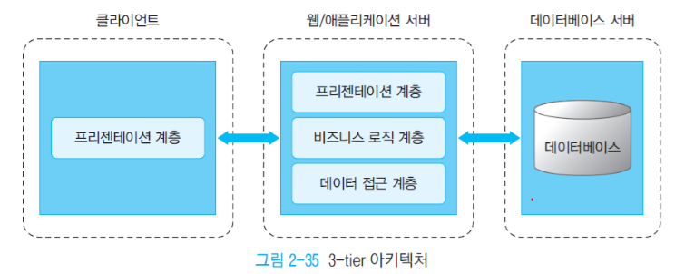
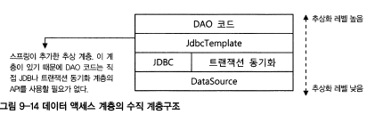
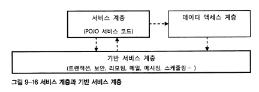
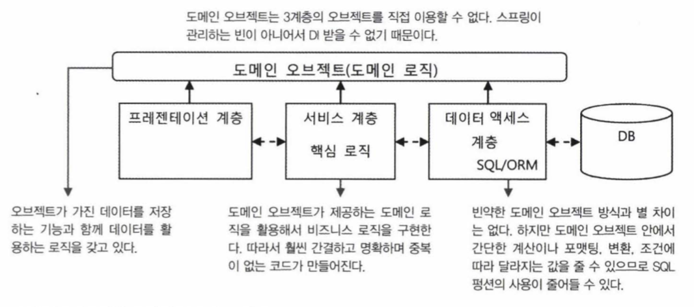

# 지옥 스터디 - 09 스프링 프로젝트 시작하기

## 빌드 툴과 라이브러리 관리

- 자바 진영의 대표적인 빌드툴은 Maven 과 Ant 이다.
- Ant 는 점점 사라지는 추세이고, Gradle 이라는 Groovy 기반 빌드툴이 등장한 뒤 Maven 과 Gradle 2강 체제가 되었다.

### Maven 과 Gradle 살펴보기

`Maven`

- 가장 오래 되었고 가장 많이 사용하는 빌드 툴
- 필요한 라이브러리를 특정 포맷의 문서 (pom.xml) 에 정의해 놓으면 라이브러리 와 라이브러리가 동작하는데 필요한 다른 라이브러리들 까지 관리해준다.
- Maven 중앙 저장소를 통해 의존성 관리서버를 둘 수 있고, 회사만의 저장소를 구축할 수도 있다. (Nexus)
- 또한 프로젝트의 **라이프사이클** 을 관리하는 도구이다.

`Maven 의 LifeCycle`

- maven 에서는 미리 정의하고 있는 `빌드 순서` 가 있으며, 이 순서를 **라이프사이클** 이라고 한다.
- 라이프 사이클의 각 빌드 단계를 Phase 라고 하는데, 이 Phase 들은 서로 의존관계를 가지고 있다.
    - Clean : 이전 빌드에서 생성된 파일을 삭제하는 단계
    - Validate : 프로젝트가 올바른지 확인하고, 필요한 모든 정보를 사용할 수 있는지 검증하는 단계
    - Compile : 프로젝트의 소스코드를 컴파일하는 단계
    - Test : 테스트를 수행하는 단계 (스킵 가능)
    - Package : 컴파일된 소스코드와 리소스들을 Jar 등으로 패키지하는 단계
    - Verify : 통합테스트 결과에 대한 검사를 수행해 품질 기준을 충족하는지 확인하는 단계
    - Install : 패키지를 로컬 저장소에 설치하는 단계
    - Site : 프로젝트 문서를 생성하는 단계
    - Deploy : Package 를 원격 저장소에 배포하는 단계
- 최종 빌드 순서는 compile > test > package

`Maven 의 Phase`

- Build 라이브사이클의 각 단계를 Phase 라고 한다.
- 이들은 서로 의존관계를 가지고 있으며, Phase 가 수행되기 위해선 **이전 단계의 모든 Phase 가 수행되어야 한다.**

`Maven 의 Goal`

- 특정 작업, 최소 실행 단위 (Task)
- 하나의 플러그인에서 여러 Task 를 수행할 수 있도록 지원한다.
- 플러그인에서 실행가능한 각각의 명령을 **Goal** 이라고 한다.

`Maven 의 POM`

- POM 은 Project Object Model 의 약자
- 메이븐을 사용하는 프로젝트의 root 에 존재하는 **XML 포맷** 의 파일이다.
- Maven 의 기능을 이용하기 위해 사용된다, 프로젝트의 모든 의존성 등을 확인할 수 있다.
- 파일명은 일반적으로 pom.xml 로 사용하는데 다른 파일명으로 지정할 수도 있다.

```xml
<?xml version="1.0" encoding="UTF-8"?>
<project xmlns="http://maven.apache.org/POM/4.0.0"
  xmlns:xsi="http://www.w3.org/2001/XMLSchema-instance"
  xsi:schemaLocation="http://maven.apache.org/POM/4.0.0 https://maven.apache.org/xsd/maven-4.0.0.xsd">
  <modelVersion>4.0.0</modelVersion> <!--POM model의 버전-->
  
  <parent> <!--프로젝트의 계층 정보-->
    <groupId>org.springframework.boot</groupId>
    <artifactId>spring-boot-starter-parent</artifactId>
    <version>2.2.4.RELEASE</version>
    <relativePath/> <!-- lookup parent from repository -->
  </parent>
  
  <groupId>me.june</groupId> <!--프로젝트를 생성하는 조직의 고유 아이디를 결정한다. 일반적으로 도메인 이름을 거꾸로 적는다.-->
  <artifactId>ncucu</artifactId> <!--프로젝트 빌드시 파일 대표이름 이다. groupId 내에서 유일해야 한다.Maven을 이용하여 빌드시 다음과 같은 규칙으로 파일이 생성 된다. artifactid-version.packaging. 위 예의 경우 빌드할 경우 bo-0.0.1-SNAPSHOT.war 파일이 생성된다.-->
  <version>0.0.1-SNAPSHOT</version> <!--프로젝트의 현재 버전, 프로젝트 개발 중일 때는 SNAPSHOT을 접미사로 사용-->
  <packaging>jar</packaging> <!--패키징 유형(jar, war, ear 등)-->
  <name>ncucu</name> <!--프로젝트, 프로젝트 이름-->
  <description>Demo project for Spring Boot</description> <!--프로젝트에 대한 간략한 설명-->
  <url>https://ncucu.me</url> <!--프로젝트에 대한 참고 Reference 사이트-->
  
  <properties> <!-- 버전관리시 용이 하다. ex) 하당 자바 버전을 선언 하고 dependencies에서 다음과 같이 활용 가능 하다. <version>${java.version}</version> -->
    <java.version>1.8</java.version>
  </properties>
  
  <dependencies> <!--dependencies태그 안에는 프로젝트와 의존 관계에 있는 라이브러리들을 관리 한다.-->
    <dependency>
      <groupId>org.springframework.boot</groupId>
      <artifactId>spring-boot-starter-web</artifactId>
    </dependency>
    <dependency>
      <groupId>org.springframework.boot</groupId>
      <artifactId>spring-boot-starter-tomcat</artifactId>
      <scope>provided</scope>
    </dependency>
    <dependency>
      <groupId>org.springframework.boot</groupId>
      <artifactId>spring-boot-starter-test</artifactId>
      <scope>test</scope>
      <exclusions>
        <exclusion>
          <groupId>org.junit.vintage</groupId>
          <artifactId>junit-vintage-engine</artifactId>
        </exclusion>
      </exclusions>
    </dependency>
  </dependencies>
  
  <build> <!--빌드에 사용할 플러그인 목록-->
    <plugins>
      <plugin>
        <groupId>org.springframework.boot</groupId>
        <artifactId>spring-boot-maven-plugin</artifactId>
      </plugin>
    </plugins>
  </build>
</project>
```
- modelVersion : POM 의 model 버전
- parent : Maven 프로젝트를 계층 형태로 구성가능한데, 부모로 참조하는 프로젝트의 정보
- groupId : 프록트 생성시 조직의 고유 아이디, 일반적으로 도메인 이름을 거꾸로 사용한다.
- artifactId : 프로젝트 빌드시 파일 대표이름, groupId 내에서 유일해야 한다.
  - Maven 빌드시 다음과 같은 규칙으로 파일이 생성됨
  - ncucu-0.0.1.SNAPSHOT.jar
- version : 프로젝트의 현재 버전, 개발중일 경우 SNAPSHOT 을 접미사로 많이 사용한다.
- packaging : 패키지 유형 (jar, war, ear)
- name : 프로젝트, 프로젝트 이름
- description : 프로젝트에 대한 간략한 설명
- url : 프로젝트에 대한 Reference 사이트
- properties : 프로젝트 내에서 사용하는 라이브러리 버전 관리시 용이
- dependencies : 프로젝트와 의존관계에 있는 라이브러리 관리
- build : 빌드에 사용할 플러그인 목록

`Gradle`
- Gradle 은 기본적으로 배포 필드 툴 이다. Maven 과 Ant 의 장점들을 모아 만들었다.
- 안드로이드 앱 공식 빌드 시스템이기도 하며 Java, C/C++ Python, Kotlin 등을 지원한다.
- Ant 와 같이 Groovy 기반으로 구축되어 Ant 에서 사용하는 기능을 모두 사용할 수 있다.
- 스크립트 언어로 구성되어 있기 때문에 변수선언, if-else 등 로직구현이 가능하여 간결한 구성이 가능하다.
- 모든 Gradle Script 는 하나 이상의 project 로 구성되며, 모든 프로젝트는 하나 이상의 Task 로 구성된다.
- Project 는 소스를 jar 로 패키징하거나, 자바 프로젝트를 컴파일, 테스트 실행 배포 등의 업무로 구성된다.
- Task 는 Gradle **작업의 최소 단위** 이다.

`Gradle - LifeCycle`
- 초기화 (Initialization)
  - 빌드 대상 프로젝트를 결정하고, 각각에 대한 **Project 객체를 생성** 한다.
  - settings.gradle 파일 등을 참조하여 구성한다.
- 구성 (Configuration)
  - 빌드 대상이 되는 모든 프로젝트의 빌드 스크립트를 실행한다.
  - configured task 실행
- 실행 (Execution)
  - 구성 단계에서 생성하고 설정된 프로젝트의 테스크 중 실행 대상을 결정한다.
  - gradle 명령행에서 지정한 테스크 이름 인자와 현재 디렉토리를 기반으로 테스크를 결정해 선택된 Task 들을 실행한다.

`Gradle - Plugin`
- plugin 은 미리 구성된 Task 들의 그룹이며, 특정 빌드 과정에 필요한 기본 정보들을 포함하고, 필요에 따라 정보를 수정해 목적에 맞게 사용할 수 있다.

```groovy
plugins {
    id 'org.springframework.boot' version '2.3.0.RELEASE'
    id 'io.spring.dependency-management' version '1.0.9.RELEASE'
    id 'java'
}

group = 'me.june'
version = '0.0.1-SNAPSHOT'
sourceCompatibility = '1.8'
```

`Gradle - 저장소 설정`

```groovy
repositories {
  mavenLocal() // 로컬 저장소
  mavenCentral() // maven 중앙 저장소
  maven { url "http://repo.company.com/maven" } // maven 원격 저장소 
}
```

`Gradle - 의존관계 설정`

```groovy
dependencies {
  implementation 'org.springframework.boot:spring-boot-starter-web'
  providedRuntime 'org.springframework.boot:spring-boot-starter-tomcat'
  testImplementation ('org.springframework.boot:spring-boot-starter-test') {
    exclude group: 'org.junit.vintage' module: 'junit-vintage-engine'
  }
}
```
- implementation : 프로젝트 컴파일시 필요한 의존성
- providedCompile : compile 시에 필요하지만, 배포에 제외할 의존성
- providedRuntime : runtime 시에 필요하지만, 배포에 제외할 의존성
- testImplementation : 테스트시 필요한 의존성

`Gradle - Test`

```groovy
test {
  useJunitPlatform()
}
```
- Junit5 사용

### Maven, Gradle 그래서 뭐가 좋냐 ?
- Gradle 의 비교문서에 따르면 장점은 다음과 같다.
- Build 라는 동적요소는 XML 로 표현하기에 어려운 부분이 많다.
- Groovy 기반이기 때문에 좀 더 유연한 설정 작성이 가능하다.
- Gradle 은 메이븐 보다 **최대 100배** 빠르다.

> 개인적인 의견으론, Gradle 을 사용하지 않는건 **익숙함** 뿐이라고 생각한다. <br/>
> 하지만 협업환경에서 완전 새로운 문법을 배우는건 쉽지 않은 일이다. <br/>
> 신규 프로젝트에서는 Gradle 을 주저없이 선택할것 같지만, 기존에 Maven 을 잘 사용하고 있었다면 코스트에 비해 이득이 적다보니 비추한다.

## 스프링 모듈의 두 가지 이름과 리포지토리
- 스프링 모듈 jar 파일의 이름을 보면 두가지 형태가 있다.
- core 모듈을 예로 들면 다음과 같다.

```text
spring-core-3.0.7.RELEASE.jar
org.springframework.core-3.0.7-RELEASE.jar
```
- 위 두파일은 사실 동일한 파일이지만, 배포되는 기술에 따라 관례적으로 다른 이름일 뿐이다.
- 전자는 Maven 에서 사용하는 명명 규칙을 따른것이다.
- 두번째는 **OSGi*8 모듈의 명명 규칙을 따른것이다.
- 스프링의 모든 모듈은 OSGi 호환 모듈로 만들어져 있다.
- OSGi 에서 사용하지 않더라도 OSGi 스타일 모듈명을 사용할것을 권장한다.

`OSGi`
- Open Service Gateway initiative
- 1999년 썬, IBM, 에릭손 등이 구성한 개방형 표준 단체
- 원격 관리 될 수 있는 자바 기반의 서비스 플랫폼을 제정해왔다.
- 표준의 핵심은 응용 프로그램의 생명주기(Life cycle) 모델과 서비스 레지스트리(Service Registry)를 정의하는 프레임워크(Framework)이다. 
- OSGi 표준 사양에는 이 프레임워크에 기반하여 매우 다양한 OSGi 서비스가 정의되어 있다.

> https://ko.wikipedia.org/wiki/OSGi

## 애플리케이션 아키텍쳐

### 계층형 아키텍쳐
- 관심, 책임, 성격, 변하는 이유와 방식이 서로 다른것을 **분리** 함으로 인해 각 요소들의 응집도는 높아지고, 결합도는 낮아진다.
- 성격이 다른 모듈이 강하게 결합되어 있고 한데 모여있다면 한 가지 이유로 변경이 일어날 때 그와 상관이 없는 요소도 함께 영향을 받을 수 있다.
- 때문에 작업 속도는 물론 (영향도 파악) 오류가 발생할 확률이 높아진다.

`아키텍쳐와 SoC`
- 지금까지는 **오브젝트 레벨** 에서의 분리 문제에 대해 고민했다.
- 성격이 다른 것을 두 개의 오브젝트로 분리하고, 그 사이에 유연한 결합을 가질 수 있도록 인터페이스를 두고, 그 관계를 DI 컨테이너를 두는 방식의 유연한 설계와 구현 전략이었다.
- 아키텍쳐 레벨에서 좀 더 큰 단위에도 동일하게 적용이 가능하다.
- 데이터 엑세스 로직을 담당하는 DAO 들은 하나의 단위로 생각해야 한다.
- 비즈니스 로직을 구현해둔 비즈니스 서비스 오브젝트들도 같은 단위로 묶어 놓을 수 있다.
  - 이런 오브젝트들은 **특정 기술과 환경에 종속되지 않으면서 도메인 업무에만 밀접하게 관련을 갖고 있는 POJO** 로 만들어야 한다.
- 이런 애플리케이션 오브젝트들을 분리하지 않는다면 다음과 같은일이 발생할 것이다.
- MVC Model1 JSP 시절의 악몽...
  - JSP 에서 커넥션을 맺고, 데이터를 조회하고, 비즈니스 처리하고, 응답까지 내려주는 것이 한곳에 다 모여있다 ㅜ
- 이는 개발속도는 빠를 수 있지만, 유지보수를 생각하면 머리가 아프다.
- 모든 설계와 원칙들은 **유지보수 성** 을 위해 탄생한 것이다
- 성격이 다른 것들은 아키텍쳐 레벨에서 분리하는것이 좋다.
- 분리한다면 독자적인 개발/테스트가 가능해지기 때문에 개발이 빨리지고, 유연한 구조를 띌 수 있다.
- 이처럼 책임과 성격이 다른 것을 크게 그룹핑 해두는 것을 아키텍쳐 차원에서 **계층형 아키텍쳐 (Layered Architecture)** 라고 한다.
  - 혹은 멀티 티어 아키텍쳐, 일반적으로 세 개의 계층을 띈다고 하고 3계층 애플리케이션 이라고 한다.
- 반드시 3계층으로 만들어야 하는 것은 아니고, 좀 더 세분화해 작은 단위로 나눌수도 있다.

`3계층 아키텍쳐와 수직 계층`
- 3계층 아키텍쳐는 일반적으로 백엔드의 DB 나 레거시와 연동하는 인터페이스 역할을 하는 DAO 계층
- 비즈니스 로직을 처리하는 서비스 계층
- 웹 기반의 UI 를 만들고 흐름을 관리하는 프레젠테이션 계층으로 구분한다.



`DAO Layer`
- DAO 레이어는 일반적으로 DAO 패턴을 보편적으로 사용하기 때문에 DAO 레이어 라고 한다.
- DB 외 ERP, 레거시 시스템, 메인프레임 등에 접근하는 역할을 하기 때문에 **EIS (Enterprise Information System)** 계층 이라고도 한다.
- 하지만 대부분 DB 이용을 주 목적으로 사용한다.
- 외부 시스템을 호출하는 것은 Infrastructure layer 로 분리하기도 한다.
- DAO Layer 는 다시 세분화할 수 있다.
- 수평적인 계층이 아닌, **추상화 수준** 에 따른 구분이다. (때문에 수직적인 계층 이라고도 한다.)
- 기본적인 Layer 는 기술 보단 역할에 따른 구분이기 때문에 위에서 살펴본것 처럼 가로로 배열한다.
- 하지만 같은 책임을 가졌지만, 추상화 레벨에 따라 구분하는 경우 세로로 배열한다.
- 스프링의 JdbcTemplate 을 사용하는 DAO 라면 다음과 같이 구분할 수 있다.


- 추상화 계층은 반드시 위 그림대로 구성해야 하는것은 아니다.
- 추상화 계층은 얼마든지 추가 될 수 있다.
- 하지만 새로운 계층을 추가하는 것은 개발자의 애플리케이션 코드에 영향을 줄 수 있기 때문에 매우 신중하게 결저해야 한다.
- 또한 한번 만들어 적용하면 이를 최대한 유지하도록 하위 계층의 변화에 대응해야하는 책임도 갖게 된다.

`Service Layer`
- 서비스 계층은 구조로 보면 가장 단순하다.
- 스프링의 서비스 계층은 이상적인 POJO 로 작성된다.
  - 객체지향적인 설계 기법이 적용된 코드를 통해 비즈니스 로직의 핵심을 잘 담아내고, 이를 쉽게 테스트하고 유연하게 확장할수 있다.
- 서비스 계층은 DAO 계층을 호출하고 이를 활용해 만들어진다.
- 데이터 엑세스를 위한 기능외 서버/시스템 레벨에서 제공하는 기반 서비스를 필요로 할 때도 있다.
- 서비스 계층은 대부분의 경우 추상화 수직 계층 구조를 가질 필요가 없다.
- 기술 API 를 직접 다루는 코드가 아니기 때문에 추상화할 필요가 없기 때문이다.
- 비즈니스 로직을 담은 **서비스 계층** 과 엔터프라이즈 서비스를 제공하는 **기반 서비스 계층** 을 잘 구분해야 한다.
- 기반 서비스 계층은 3계층 어디서나 접근이 가능하다.
- 일반적으로 서비스 계층이 필요에따라 기반 서비스 계층을 호출한다.
- 하지만 반대의 경우도 있다. (대표적인 예 : 스케쥴링)
- 원칙적으로는 서비스 계층의 코드가 기반 서비스 계층의 코드에 종속되서는 안된다.



`Presentation Layer`
- 프레젠테이션 계층은 가장 복잡한 계층이다.
- 다양한 기술과 프레임워크의 조합을 가질 수 있다.
- 웹과 프레젠테이션 계층은, 끊임없이 발전하고 새로운 모델이 등장한다.
- 엔터프라이즈 애플리케이션의 경우 HTTP 프로토콜을 사용하는 서블릿 기반을 일반적으로 많이 사용한다.
- 프레젠테이션 계층은 클라이언트까지 그 범위를 확장할 수도 있다.
- 초기에는 SSR 을 하면서 서버에서 HTML 결과 까지 만들어 전달하는 형태 였다.
- 최근에는 이런 프레젠테이션 로직들이 클라이언트로 이동하고 있다. RIA (Rich Internet Application), SOFEA (Service Oriented Front End Architecture)

### 계층형 아키텍쳐 설계 원칙
- 오브젝트 관계에 적용했던 대부분의 객체지향 설계 원칙을 아키텍쳐 레벨에도 동일하게 적용할 ㅅ ㅜ있따.
- 각 계층은 **응집도** 가 높으면서 다른 계층과는 **낮은 결합도** 를 유지해야 한다.
- 자신의 역할과 기술에만 충실한 계층을 만들면, 각 계층 사이의 결합도는 자연스레 낮아진다.
- 종종 실수하는 계층간의 설계를 살펴보면 다음과 같다.

`Service 가 호출할 DAO 인터페이스`

```java
interface UserDao {
    ResultSet findUsersByName(String name) throws SQLExeption;
}
```
- 얼핏보면 별 문제가 없어보이지만, 가장 큰 문제는 **데이터 액세스 계층의 세부 구현 기술과 역할을 다른 계층에 노출** 한다는 점이다.
- JDBC API 인 ResultSet 으로 반환하고 있기 때문에, 이를 사용하는 서비스 계층의 코드는 결국 JDBC 라는 **기술에 종속** 되어버린다.
- 또한 ResultSet 을 사용하기 위한 예외처리 등 데이터 엑세스 작업도 서비스가 처리해야 할 것이다.
- 예외또한 마찬가지다.
- 계층 간에 강한 결합이 생기면 유연성이 떨어지기 때문에, 각 계층의 구현이 변하게 되면 다른 계층의 코드도 함께 수정해야 한다.

```java
interface UserDao {
    List<User> findUsersByName(String name) throws DataAccessException;
}
```
- 문제를 해결하기 위해서는, 위와 같은 인터페이스로 변경되어야 한다.
- 특정 계층이나 기술에 종속되지 않는 단순한 오브젝트 형태의 결과로 반환해야 하고, 파라미터나 예외 또한 마찬가지이다.
- 또 흔히 저지르는 실수 중 하나는 프레젠테이션 계층의 객체를 그대로 서비스로 전달하는 것이다.
  - HttpServletRequest, HttpSession 등등.. 
  - 매우 심심찮게 보이는 부분..
- **계층의 경계를 넘나들때는 반드시 특정 계층에 종속되지 않는 형태로 변환** 해서 넘겨주어야 한다.
- 클라이언트에 종속되는 결과가 나타날 수 있고, POJO 기반의 단위 테스트를 작성하기가 힘들어진다.
- 어떠한 경우라도 계층사이의 낮은 결합도를 유지해야 한다.
- 인터페이스를 하나 더 만들라는게 아니다. 인터페이스에 별 생각없이 퍼블릭 메소드를 추가한다면 이미 사용중인 인터페이스는 변경이 매우 까다롭다. (영향도가 크기 때문임)
  - ISP 도 준수해야 한다.

### 애플리케이션 정보 아키텍쳐
- 애플리케이션을 사이에 두고 흘러다니는 정보를 어떻게 다룰지도 아키텍쳐 결정시 매우 중요한 기준이 된다.
- 일반적으로 단순히 데이터로 다루는 경우와 오브젝트로 다루는 경우 두가지로 구분해 볼 수 있다.

`데이터 중심 아키텍쳐`
- 데이터 중심 아키텍쳐 는 애플리케이션에 흘러다니는 정보를 단순히 **값** 으로 취급한다.
- DB 에서 가져온 정보를 값으로 다루고, 그 값을 취급하는 코드를 만들어 로직을 구현하고 그대로 프레젠테이션 레이어까지 내려주는 경우가 대다수이다.
- 비즈니스로직이 DB 의 SQL 에 녹아잇는 경우가 대다수이다.
- 이런경우 굳이 자바가 아니더라도 구현이 가능하며, 객체지향의 장점을 다 버리는 방식이다.
- 자바와 스프링을 사용하더라도, 이런 방식은 그저 DB 의 게이트웨이 역할을 하는것에 지나지 않는다.

> 데이터 중심 아키텍쳐는 핵심 비즈니스 로직을 어디에 많이 두냐에 따라 DB 중심 / 서비스 중심에 무게를 두는 구조로 구분이 가능하다.

`DB/SQL 중심`
- 데이터 중심구조의 특징은 하나의 업무 트랜잭션에 **모든 계층의 코드가 종속** 된다.
- 사용자 이름으로 사용자정보를 검색한다면, 모든 계층의 코드가 이를 기준으로 만들어 진다.
- 검색조건은 SQL 로 만들어지고, 가입일자중 연도만 보여줘야한다면 SQL 의 펑션을 활용한다.
- 이미 SQL 에서 부터 어떻게 뷰를 수정할지가 결정되어 있다는 소리이다.
- 이는 코드 재사용성도 매우 낮고, SQL 이 조금만 바뀌어도 전체로직이 바뀐다.
- 변화에 매우 취약하다는 가장 큰 문제가 있다.

`거대한 서비스 계층 방식`
- 여전히 데이터는 DB 에서 가져온 로우데이터를 사용하지만, 비즈니스로직이 서비스 계층으로 옮겨진 방식이다.
- 서비스 계층의 비중이 커진만큼, 비즈니스 로직이 복잡해지면 서비스 계층의 코드도 매우 복잡해 지고 커지게 된다.
- 상대적으로 단순한 DAO 를 사용하고, 비즈니스로직의 대부분이 서비스에 존재하는, **거대한 서비스 계층** 을 만들게 된다.

> 데이터 중심 아키텍쳐 중 두 가지 방식을 살펴봤다. 처음에는 개발이 쉽다는 장점이 있지만, 갈수록 코드 중복이 많아지고, 수정 및 유지보수가 힘들어진다.

`오브젝트 중심 아키텍쳐`
- 오브젝트 중심 아키텍쳐가 데이터 중심 아키텍쳐와 다른 점은, 계층간을 이동하는 정보가 도메인 모델을 반영하는 객체 형태로 다뤄진다는 점이다.
- 대개 도메인 모델은, DB 의 엔티티 설계에도 반영되기 때문에 비슷한 구조를 띄고 있을 확률이 높다.
- 오브젝트를 만들어두고, 각 계층 사이에 전달하게 만드는 것이 오브젝트 중심아키텍쳐 이다.

`도메인 오브젝트를 사용하는 코드`
- 오브젝트 중심 방식에서 비즈니스 로직의 구현 방식을 살펴보자.
- 특정 카테고리에 포함된 상품의 모든 가격을 계산해야 한다는 로직이 필요하다면 일반적으로 서비스 계층의 오브젝트에서 다음과 같이 구현을 할 것이다.

```java
public int calcuateTotalOfProductPrice(Category category) {
    int sum = 0;
    for (Product product: category.getProducts()) {
        sumt += product.getPrice();    
    }
    return sum;
}
```
- 데이터 중심 아키텍쳐였다면, SQL 의 Function 을 이용해 가격계산을 할것이고, 카테고리에 포함된 상품을 Join 해서 처리하는 등 SQL 이 복잡해져갔을 것이다.
- 또한 SQL 에 로직이 존재하기 때문에 이를 테스트하는 것은 복잡하고 불편하다.

`도메인 오브젝트의 문제점`
- 최적화된 SQL 을 매번 만들어 사용하는 경우에 비해 성능 면에서는 어느정도 손해를 감수해야 하는 경우도 있다.
- DAO 에서는 비즈니스 로직을 모르기 때문에 도메인 오브젝트의 모든 필드를 채워서 반환해야 한다.
- 특정 비즈니스에서는 단순이 어떤 필드가 하나만 필요한 경우에도 말이다.
- 어떤 비즈니스에서는 단순히 Product 정보만 필요하다고 가정했을때
- DAO 가 반환해준 Product 에는 Category 정보도 포함되어 있을 것이다.
- 이런 경우 상당한 낭비가 될 수 있다.
- 때문에 이를 구분해서 DAO 를 만들어 줄 수도 있찌만, null 이 채워질 경우 문제가 될 수 있다.
- 최적화를 생각해서 DAO 를 작성하면 결국 데이터 중심 아키텍쳐의 단점 중 하나였던 **DAO 와 비즈니스 로직의 결합도가 높아지는 문제가 발생** 한다.
- 이를 해결하는 방식은 lazy-loading 기법, 가장 이상적인 방법은 JPA, 하이버네이트 같은 ORM 을 사용하는 것이다.
- 때문에 도메인 오브젝트 방식을 사용한다면, ORM 과 같은 기술을 사용하는 것을 권장한다.

`빈약한 도메인 오브젝트 방식`



- 자바 오브젝트에 **정보** 만 담겨 있고, **기능** 이 없다면 완전한 오브젝트라고 보긴 힘들다. (반쪽짜리 객체)
- 물론 이렇게 활용하더라도 데이터중심 아키텍쳐보단 낫다. (이런 형태를 취하는 경우도 상당히 많다...!)
- 이 방식의 문제는 결국 ORM 을 활용하던 뭘 하던간에 이전에 살펴본 **거대 서비스 계층** 방시과 유사하다.
- 도메인 오브젝트를 통해 SQL 의존적인 방식 보단 낫지만, 여전히 서비스 계층에 대부분의 비즈니스 로직이 존재한다.


`풍성한 도메인 오브젝트 방식`


- 풍성한/영리한 도메인 오브젝트 방식은, 빈약한 도메인 오브젝트 방식의 단점을 극복하고 좀 더 객체지향 적인 특징을 잘 살려 사용할수 있도록 개선한 방식이다.
- 비즈니스 로직은 특정 도메인 객체나 그 관련 오브젝트가 가진 정보와 깊은 관계가 있다.
- 이런 로직을 서비스 계층의 아닌 도메인 오브젝트에 넣어주는 것이다.

```java
class Category {
    
    List<Product> products;
    
    public int calculateTotalOfProductPrice() {
        int sum = 0;
        for (Product product: this.products) {
            sum += product.getPrice();
        }
        return sum;
    }
}
```
- 예전에는 이런 방식이 객체지향 적이지..!! 하고 생각 했지만 요즘은 생각이 좀 달라졌다.
- **가격을 계산하는 책임** 을 Category 가 가져야하는가 ?...
  - 상품의 가격인데 ?..
- 상품 가격 계산의 책임을 질 객체가 필요하다 라는 생각이 듦

```java
class ProductPriceCalculator {
    
    public int calculatePrice(Product product) {
        /// 기본 가격 - 할인가 적용을 한다던가.. 등등..
        return 0;
    }
    
    public int calculatePrice(List<Product> products) {
        int sum = 0;
        for (Product product : products) {
            sum += calculatePrice(product);
        }
        return sum;
    }
}
```
- 대충 이런 느낌...
- 상품 가격 계산이 필요한 경우 ProductPriceCalculator 객체를 통해서 이뤄지기 때문에, 응집도도 높아지고, 가격 계산 로직 수정이 필요할때 ProductPriceCalculator 클래스만 수정하면 된다.
- 만약 이런 로직이 Product 나 Category 객체에 있었다면, 쉽지 않을것이라고 생각됨
  - 카테고리/상품 관련된 데이터 조작이나 비즈니스 로직도 분명히 있을것...
  - ex) 카테고리라면 특정 카테고리가 자식 카테고리 인지 확인한다거나 ?... 
- DDD 에서는 이런 경우 **도메인 서비스** 를 활용한다고 한다.

```java
class ProductPriceCalculateService {
    public int calculatePrice(Product product) {
      /// 기본 가격 - 할인가 적용을 한다던가.. 등등..
      return 0;
    }
  
    public int calculatePrice(List<Product> products) {
      int sum = 0;
      for (Product product : products) {
        sum += calculatePrice(product);
      }
      return sum;
    }
}

class Category {
    List<Product> products;
  
    public int calculateTotalOfProductPrice(ProductPriceCalculateService calculatorService) {
        return calcuatorService.calculatePrice(this.products);
    }
}
```
- 상품 가격 계산이라는 책임을 특정 도메인에 두기 애매한 경우... **도메인 서비스** 를 추출해 이를 활용 한다.
  - 이 때 도메인 서비스는, **도메인 레이어** 에 속한다.
  - 즉 서비스 클래스가, 애플리케이션 서비스, 도메인 서비스 2가지가 존재하게 됨
- 위 방식은, DDD 에서 소개하는 방식중 하나이다.
- 이러면 도메인 오브젝트에 비즈니스 로직이 응집되고, 애플리케이션의 서비스 오브젝트에서는 **비즈니스 처리를 위한 흐름을 제어하는 역할** 만 하게 된다.

> DDD 를 깊게 공부해본 적은 없지만, 딱 봤을때 나쁘지 않은 방식이긴 한데.. Service 라는 것이 좀 걸림 ㅜ 네이밍과 선입견 때문 일지도... 좀 낯선 방식이라 그런것 같다. <br/>
> 전체적인 그림을 봤을때는 좀 더 객체지향적이고 도메인 지향적인 방식인 것 같다. <br/>
> 추후에 같이 DDD 스터디를 해봐도 좋을듯..!

- 이런 방식에도 단점은 있다. 도메인 오브젝트는 다른 계층의 오브젝트 (DAO) 를 직접 이용할 수 없다. DI 를 받기 위해서는 스프링 컨테이너의 관리를 받는 빈으로 등록되어야 하기 때문임...
- 풍성한 도메인 오브젝트는 빈약한 오브젝트에 비해 서비스 계층의 코드가 보다 간결하고, 객체지향 적이다.
- 하지만 빈약한 오브젝트 가 나쁜 방식은 아니다.
- 사전에 협의되지 않은 방식이고, 팀의 성향과 맞지 않는다면 오히려 안좋은 영향을 미칠 수 있다.

`도메인 계층 방식`
- 도메인 오브젝트를 한 단계 올린것이 도메인 계층 이다.
- 도메인 오브젝트들이 하나의 독립적인 계층을 이뤄 서비스와 DAO 계층 사이에 존재하게 된다.
- 도메인 객체도 DI 를 통해 다른 계층의 빈을 주입받아 자체적으로 모든 비즈니스를 처리할 수 있게 된다.
  - 하지만 도메인 객체는 다른 빈과 달리 스프링 컨테이너를 통해 생성되는 것이 아니다. 또한 싱글톤으로 관리되어서도 안된다.
  - 스프링이 관리하지 않는 객체에 DI 적용을 위해선 AOP 가 필요하다.
  - **AspectJ** AOP 를 활용해 클래스의 생성자 호출시점에도 AOP 적용이 가능하며, 스프링 빈이 아니더라도 AOP 적용이 가능하다.
- 또 하나의 문제는 도메인 오브젝트에서 비즈니스로직을 담당하게 되면서 이를 과연 어디까지 그대로 전달해야 하는가 이다.
- 프레젠테이션 계층에서 이를 그대로 사용하는 것은 문제가 있다. 도메인 객체의 기능을 제한하는 프록시를 전달하거나 아에 읽기만 가능한 DTO 로 변환해서 내려주는 생각할 수도 있다.

> 도메인 계층을 활용하는 방식은, 오브젝트 중심 아키텍쳐의 두 가지 방식을 충분히 경험해 보고 선택하는 것이 좋다.

`DTO 와 리포트 쿼리`
- 오브젝트 중심 아키텍쳐라고 해서 모든 정보를 항상 도메인 오브젝트에 담아야 하는것은 아니다.
- 대표적인 예로 리포트 쿼리 라고 불리는 통계 데이터 등이 있다.
- 이런 쿼리의 결과는 DB 테이블에 담긴 필드 내용보단, 합계 평균과 같은 값 계산이다.
- DB 쿼리 하나로 결과를 만들어내기 힘들기 때문에 코드를 통해 데이터를 분석하고 가공하는 작업이 필요하다. 이런경우 DTO 나 맵을 활용해 형식에 맞게 변경하는 작업이 필요하다.

## DTO - Domain 객체 간의 변환은 어디서 이뤄져야 할까 ?
- DTO 가 필요한 상황이라면 결국 최종적으로 DTO 가 전달되고, 백엔드 데이터 저장소에는 Domain 객체 가 전달된다.
- 따라서 서로 변환되는 지점이 필요한데 과연 어디가 적절한가 ?..

### 컨트롤러냐 서비스냐
- 컨트롤러 메소드 인자 로 DTO 가 사용되는 것을 생각해보면 컨트롤러에 변환 로직을 두는것이 적절한 것 같다.
- 하지만 DTO 를 Domain 객체로 변환할때 Repository 를 통한 조회가 필요한 경우가 종종 있다.
- 컨트롤러가 서비스 계층을 통하지 않고 Repository 에 직접 접근하는 것은 Layered Architecture 구조를 위반하므로 일반적으로는 권장되는 구조는 아니다.
- 따라서 서비스에서 DTO - Domain 객체 변환을 담당하게 하는것이 타당하다.
- 조금 지나서는 별도의 `Converter (Mapper)` 를 두는것이 좋겠다는 생각도 있다.
- 단순한 변환의 경우 DTO 의 생성 메소드를 활용하면 되지만, 사실 실무에서 그런 경우는 매우 드물다.
- DTO 는 데이터만을 가지고 있어야하는데 그렇게 되면 비즈니스를 처리하게 될 확률이 높다.
- 또한 DI 를 통한 설계도 어렵고, 스프링 컨테이너의 도움을 받기가 힘들다는 단점도 있다.

```java
class ProductDto {
    /// ...
  static class from(Product product) {
    ////....
    // 다양한 가격 계산 을 위한 Utils 등을 사용..
    // 그외 데이터 가공을 위한 객체 활용.. 이런 로직이 100줄?... 가격 계산 Utils 가 변경되어서 그부분만을 찾아 수정하기란 쉽지 않다.
    return new ProductDto(...);  
  }
}
```
- 이 뿐만이 아니라 DTO - Domain 변환간의 **방향** 이 존재하는데 이에 대해서도 생각해볼 필요가 있다.

### Domain -> DTO -> View
- Domain -> View 로 흐르는 방향은, 필요한 Domain 객체를 서비스에서 Repository 에 접근해 얻어올 수 있따.
- DTO 에 전달할 데이터를 Domain 객체가 가지고 있기때문에, Converter 메소드로 전달할 때 큰 어려움이 없다.
- 이런 방향일때 Domain -> DTO 변환을 컨트롤러에서 하게 된다면 문제가 있다.
  - 클라이언트는 필요가 없는 데이터까지 Domain 객체에 포함되어 컨트롤러까지 넘어온다.
  - 컨트롤러가 서비스 계층의 역할을 하게 될 확률이 높다. (도메인객체를 직접 다룰수 있게 되니 비즈니스를 처리하게 될 수 있음)
  - 여러 도메인 객체를 조합해 DTO 를 만들어야 한다면 일이 더 심각해진다.
  - JPA 를 사용한다면 OSIV 관련 문제가 생길 수 있다. 

### View -> DTO -> Domain
- View -> Domain 으로 흐르는 방향은, View 를 통해 받은 정보만으로 Domain 객체 구성이 얼벼다.
- 클라이언트로 부터 ID 만을 전달받는 경우가 많은데, ID 만으로는 도메인 객체 구성이 어렵기 때문에 Repository 를 통해 조회해야 한다.
- Converter 에서 독립적인 처리가 불가능하게되고, Repository 계층에 의존하게 된다.
- Converter 가 Repository 에 직접 접근하는 것은 좋은 방법이 아니라고 생각한다.
  - 차라리 Service 에 위임하는것이 낫다.

### DTO 라는 용어는 적절한가 ?
- 클라이언트 -> 서버, 서버 -> 클라이언트 두 가지 방향에서의 중간 객체를 모두 DTO 로 칭하다 보니 커뮤니케이션 문제도 있고 혼란이 올 수 있다.
- 둘은 책임이 다르다. 용도에 따라 적절히 분리하는 것이 좋을 것 같다.
- DTO 는 요청을 받거나, 응답을 내려주는 것이 아닌, 서버간의 통신시에만 사용한다면 명명하는것이 좋아보인다.
  - ex) ProductRequest, ProductResponse, ProductDto
- DTO 가 데이터 셔틀역할을 하는것은 맞지만 [마틴 파울러의 글](https://martinfowler.com/eaaCatalog/dataTransferObject.html)에 의하면 단순 셔틀이 아닌, 서버가 여러번 요청을 받아 회신해야 할 정보중 함께 사용되는 것들을 DTO 에 담아 원격 호출 횟수를 줄여주는 데 의의가 있다.

### 정리
- Domain <-> DTO 간의 변환은 서비스 레이어에서 하는것이 적절하다.
- 실질적인 변환은 Converter 에서 처리하되, 변환에 필요한 도메인 객체들을 Service 에서 만들어 Converter 에서 넘겨주도록 한다.
  - 단순한 경우라면 생성 메소드를 활용해도 좋다.
  - ex) ProductDto.from(entity);, dto.toEntity() 등등..


## 참고
- https://goddaehee.tistory.com/199
- https://ko.wikipedia.org/wiki/OSGi
- https://github.com/HomoEfficio/dev-tips/blob/master/DTO-DomainObject-Converter.md
- https://martinfowler.com/eaaCatalog/dataTransferObject.html