# 지옥 스터디 - 13 스프링 @MVC

## Spring MVC 구성요소

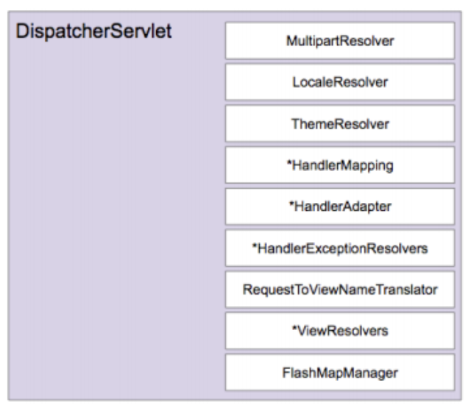

## @RequestMappingHandlerMapping

- @MVC 의 가장 큰 특징 -> 기존에는 매핑의 대상이 오브젝트 였다면, **메소드** 단위로 변경되었다.
    - Ruby On Rails 와 같은 프레임워크의 영향을 많이 받음..
- @MVC 의 핸들러 매핑 처리를 위해 **DefaultAnnotationHandlerMapping (deprecated)** 를 사용한다.
    - 3.1 부터 RequestMappingHandlerMapping 으로 대체됨
- @RequestMapping 애노테이션을 매핑 정보로 활용한다.
    - 타입/메소드 레벨에 적용가능 하다.
- 최종적으로 **두 가지 위치에 적용된 정보를 결합해 최종 매핑 정보를 생성** 한다.

### @RequestMapping

- @RequestMapping 애노테이션은 매핑 정보 제공을 위한 다양한 엘리먼트들이 존재한다.
    - Spring 2.5 버전부터 추가됨
- 모든 엘리먼트들은 **생략 가능**

```java

@Target({ElementType.TYPE, ElementType.METHOD})
@Retention(RetentionPolicy.RUNTIME)
@Documented
@Mapping
public @interface RequestMapping {

    String name() default "";

    @AliasFor("path")
    String[] value() default {};

    /**
     * The path mapping URIs (e.g. {@code "/profile"}).
     * <p>Ant-style path patterns are also supported (e.g. {@code "/profile/**"}).
     * At the method level, relative paths (e.g. {@code "edit"}) are supported
     * within the primary mapping expressed at the type level.
     * Path mapping URIs may contain placeholders (e.g. <code>"/${profile_path}"</code>).
     * <p><b>Supported at the type level as well as at the method level!</b>
     * When used at the type level, all method-level mappings inherit
     * this primary mapping, narrowing it for a specific handler method.
     * <p><strong>NOTE</strong>: A handler method that is not mapped to any path
     * explicitly is effectively mapped to an empty path.
     * @since 4.2
     */
    @AliasFor("value")
    String[] path() default {};

    RequestMethod[] method() default {};

    String[] params() default {};

    String[] headers() default {};

    String[] consumes() default {};

    String[] produces() default {};

}
```

`String[] value()`

```java

@Controller
@RequestMapping("/api/v1") // 타입 레벨에 정의, 타입 레벨에 정의 되었다면 이는 메소드레벨에 정의된 매핑 정보의 "공통 정보" 로써 사용된다.
public class SimpleController {

    // 메소드 레벨에 정의
    @RequestMapping("/users")
    public String users() {
        return "users";
    }

    /**
     * 파일확장자 패턴으로 매칭도 가능하다. 하지만 스프링 부트의 경우 기본적으로 false 로 지정되어 있다.
     * 보안상의 이슈..
     *
     * https://stackoverflow.com/questions/9688065/spring-mvc-application-filtering-html-in-url-is-this-a-security-issue
     * https://stackoverflow.com/questions/30610607/how-to-change-spring-request-mapping-to-disallow-url-pattern-with-suffix
     * https://stackoverflow.com/questions/30307678/why-does-requestmapping-spring-annotation-in-controller-capture-more-that-i-wan
     * https://stackoverflow.com/questions/22845672/requestmapping-in-spring-with-weird-patterns
     *
     * https://github.com/spring-projects/spring-framework/issues/23915
     * https://github.com/spring-projects/spring-framework/issues/24179
     *
     */
    @RequestMapping("/main.*")
    public String main() {
        return "main";
    }

    /**
     * value 속성에 명시하며, value 애트리뷰트 명은 생략가능
     */
    @RequestMapping(value = "/hello")
    public String hello() {
        return "hello";
    }

    /**
     * 배열로 하나 이상의 URL 패턴 지정도 가능하다.
     */
    @RequestMapping({"/wow", "/fantastic"})
    public String wow() {
        return "wow";
    }
}
```

- 디폴트 엘리먼트
- 스트링 배열로 URL 패턴 지정이 가능하다.
- 가장 기본이 되는 매핑 정보
- 파일 **확장자 패턴** 으로 매핑도 가능하다.
    - useSuffixPatternMatch 옵션
- 하지만 기본적으로 해당 옵션이 false 로 지정되어 있음
    - 스프링 부트의 경우 꽤나 오래전부터 false 였지만.. 스프링 MVC 의 경우에는 좀 최근에 변경됨..
    - 이는 보안상의 이슈..

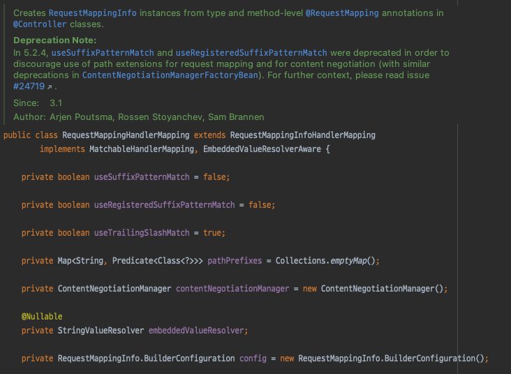

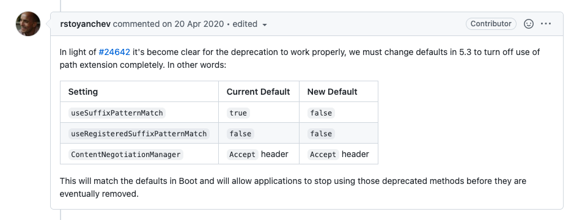

```java
@RequestMapping("/welcome")
```

- 이와 같이 매핑이 되어있다고 가정하면..
- http://www.example.com/welcome.check.blah 라고 요청을 보내도 동작하게 된다.
- 스크립트 태그가 있는 GET URL 이 있어도 요청을 보내게됨
    - http://www.example.com/welcome.<script>alert("hi")</script>

`RequestMethod[] method()`

```java
public enum RequestMethod {

    GET, HEAD, POST, PUT, PATCH, DELETE, OPTIONS, TRACE

}
```

```java

@Controller
@RequestMapping("/api/v1") // 타입 레벨에 정의, 타입 레벨에 정의 되었다면 이는 메소드레벨에 정의된 매핑 정보의 "공통 정보" 로써 사용된다.
public class SimpleController {

    /**
     * 요청 메소드 지정도 가능하다 (배열로 지정가능)
     * 동일한 요청 URL 이더라도 메소드가 다르다면, 다른 매핑으로 인지한다.
     * @see org.springframework.web.bind.annotation.RequestMethod
     */
    @RequestMapping(value = "/ncucu", method = RequestMethod.GET)
    public String requestMethod() {
        return "requestMethod";
    }

    /**
     * 메타 애노테이션으로 활용한 GetMapping, PostMapping 등이 편의를 위해 추가됨 (스프링 4.3)
     */
    @GetMapping("/ncucu2")
    public String requestMethod2() {
        return "requestMethod2";
    }
}
```

- HTTP 요청 메소드를 지정
- RequestMethod 는 HTTP 메소드를 정의한 enum
- 배열로 지정이 가능하고, 동일한 URL 이더라도 요청 메소드가 다르다면 다른 매핑으로 인지한다.
- 스프링 4.3 부터 @GetMapping, @PostMapping 과 같은 편의를 위한 메타 애노테이션이 추가되었다.

```java

@Target(ElementType.METHOD)
@Retention(RetentionPolicy.RUNTIME)
@Documented
@RequestMapping(method = RequestMethod.GET)
public @interface GetMapping {

    @AliasFor(annotation = RequestMapping.class)
    String name() default "";

    @AliasFor(annotation = RequestMapping.class)
    String[] value() default {};

    @AliasFor(annotation = RequestMapping.class)
    String[] path() default {};

    @AliasFor(annotation = RequestMapping.class)
    String[] params() default {};

    @AliasFor(annotation = RequestMapping.class)
    String[] headers() default {};

    @AliasFor(annotation = RequestMapping.class)
    String[] consumes() default {};

    @AliasFor(annotation = RequestMapping.class)
    String[] produces() default {};

}
```

`String[] params()`

```java

@Controller
@RequestMapping("/api/v1") // 타입 레벨에 정의, 타입 레벨에 정의 되었다면 이는 메소드레벨에 정의된 매핑 정보의 "공통 정보" 로써 사용된다.
public class SimpleController {

    /**
     * 요청 파라미터와 값을 비교해 매핑하는 방식
     * 동일한 URL 이더라도, 요청 파라미터에 따라 별도의 작업을 해 줄 수 있다.
     */
    @GetMapping(value = "params", params = "type=admin")
    public String admin(String type) {
        return "admin";
    }

    @GetMapping(value = "params", params = "type=member")
    public String member(String type) {
        return "member";
    }

    /**
     * 특정 파라미터가 존재해선 안된다는 매핑 선언도 가능
     */
    @GetMapping(value = "params", params = "!type")
    public String notType(String type) {
        return "notType";
    }
}
```

- 요청 파라미터와 값을 비교해 매핑 정보를 제공
- 동일 URL 이더라도, 요청 파라미터에 따라 별도의 작업을 할 수 있다.

`String[] headers()`

```java

@Controller
@RequestMapping("/api/v1") // 타입 레벨에 정의, 타입 레벨에 정의 되었다면 이는 메소드레벨에 정의된 매핑 정보의 "공통 정보" 로써 사용된다.
public class SimpleController {

    /**
     * 특정 헤더와 키/값이 동일할때만 매핑해준다.
     * 요청 파라미터와 유사하다
     */
    @GetMapping(value = "header", headers = "content-type=text/*")
    public String headers() {
        return "";
    }
}

```

- HTTP 헤더 정보를 활용한 매핑 정보를 제공
- 자주 사용되지는 않는다.

### 메소드/타입 레벨 매핑

- @RequestMapping 은 메소드 단위로 핸들러를 매핑하는 방식
- 메소드/타입 레벨에 매핑정보를 지정할 수 있다.
- 메소드 단위 매핑중에 공통적인 정보가 있다면, 타입레벨로 이를 추출해 해당 클래스 전역으로 활용도 가능하다.
    - 공통적인 매핑 정보가 없다면, 타입레벨 매핑은 생략을 해도 무관하다.
    - 대부분의 경우는 UserController / ProductController 이런 식으로 구성을 해서 사용할 것이기 때문에 메소드 + 타입 레벨 매핑을 주로 사용함..

```java

@Controller
@RequestMapping("/api/v1") // 타입 레벨에 정의, 타입 레벨에 정의 되었다면 이는 메소드레벨에 정의된 매핑 정보의 "공통 정보" 로써 사용된다.
public class SimpleController {

    // 메소드 레벨에 정의
    @RequestMapping("/users")
    public String users() {
        return "users";
    }
}
```

### 타입 상속과 매핑

- @RequestMapping 이 적용된 클래스를 **상속** 해서 사용한다면 슈퍼 클래스의 정보는 어떻게 될까 ?
    - 언어차원에서 봤을때 애노테이션 정보는 기본적으로 상속되지 않는다. (@Inherited 가 적용되지 않은 경우)
- 하지만 **프레임워크** 레벨로 들어갔을때는 조금 다르다.
- 부모 클래스에 적용된 애노테이션까지 처리하는 경우가 많음.. (Spring/JPA 같은...)
- 스프링의 @RequestMapping 은 상속된다 라고 이해해도 좋다.
    - 프레임워크 레벨에서 부모 클래스에 적용된 애노테이션 정보까지 활용하기 때문
- 매핑 정보 상속과 종류의 대표적인 경우를 몇가지 살펴보자...

`상위 타입과 메소드의 @RequestMapping`

```java

@RequestMapping("/user")
public class Super {

    @RequestMapping("/list")
    public String list() {
        return "";
    }
}

/**
 * 클래스 상속의 경우 슈퍼 클래스의 매핑정보가 자식에게 그대로 적용된다.
 * 매핑정보가 명시된 슈퍼 클래스의 메소드를 오버라이드 했더라도, 자식클래스에 매핑정보를 명시하지 않는한 해당 정보도 상속된다.
 */
public class Sub extends Super {

    @Override
    public String list() {
        return super.list();
    }
}
```

- 부모 클래스에만 @RequestMapping 을 적용하고, 이를 상속한 자식 클래스에서는 아무런 적용도 하지 않았을 경우이다.
- 클래스 상속의 경우 부모 클래스의 매핑 정보가 자식 클래스에게 그대로 적용된다.
- 하위 클래스가 해당 메소드를 오버라이드 하더라도, 자식 클래스에 매핑 정보를 명시하지 않는한, 해당 정보도 **상속** 된다.
    - 인터페이스 구현의 경우도 동일하다.

`상위 타입의 @RequestMapping 과 하위 타입 메소드의 @RequestMapping`

```java

@RequestMapping("/user")
public class Super {


    public String list() {
        return "";
    }
}


public class Sub extends Super {

    @RequestMapping("/list")
    @Override
    public String list() {
        return super.list();
    }
}
```

- 부모 클래스의 타입에만 @RequestMapping 이 적용되어 있고, 자식 클래스에는 메소드에만 @RequestMapping 이 적용된 경우이다.
- 부모 타입레벨 매핑정보 + 자식 메소드레벨 매핑정보가 결합되어 최종적인 매핑 정보가 생성된다.
    - 인터페이스 구현의 경우도 동일하다.

`상위 타입 메소드의 @RequestMapping 과 하위 타입의 @RequestMapping`

- 이전 케이스와 반대되는 경우이다.
- 부모 클래스에는 메소드 레벨에만 적용되었고, 자식 클래스는 타입 레벨에만 적용된 경우..
- 이도 마찬가지로 매핑정보가 상속되어 결합된다.
    - 인터페이스 구현의 경우도 동일하다.

`하위 타입과 메소드의 @RequestMapping 재정의`

```java

@RequestMapping(value = "/user", method = RequestMethod.POST)
public class Super {

    @RequestMapping("/list")
    public String list() {
        return "";
    }
}

@RequestMapping("/ncucu")
public class Sub extends Super {

    @RequestMapping("/me")
    @Override
    public String list() {
        return super.list();
    }
}
```

- 자식 클래스가 @RequestMapping 을 적용하면 부모의 매핑정보를 대체해서 적용된다.
    - 이는 타입/메소드 레벨 모두 적용된다.
- 조금 주의할 점은, @RequestMapping 이 통으로 오버라이드 된다고 이해하면 좋다.
    - 예제에서 부모 클래스에 정의된 RequestMethod 매핑 정보는 사라짐..

`하위 타입 메소드의 URL 패턴이 없는 @RequestMapping 재정의`

- 자식 클래스에서 재정의한 @RequestMapping 은 부모 클래스에 정의한 매핑 정보를 대체한다.
- 하지만 조금 특이한 케이스는, **클래스 상속** 에 한해 오버라이드한 하위 메소드에 한해 URL 매핑 정보가 없다면 이는 무시된다.

> 다양한 매핑 정보 상속을 알아봤는데... 사실 실무에서 사용하는 경우는 거의 없을 거라고 생각함.. <br/>
> 사내 프레임워크를 만든다거나 하지 않는한 거의 안쓰이는 부분이고 사실 사용한다고 해도 가능하면 명시적으로 사용하는걸 권장하고 싶음... <br/>
> 의도치 않게 동작할 수도 있고 모든 팀원이 이걸 다 알아야 제대로 사용이 가능하다고 생각..

## @Controller

- RequestMappingHandlerMapping 은 @RequestMapping 의 매핑 정보를 활용해 핸들러 메소드에 매핑을 해주는 역할을 수행한다.
- RequestMappingHandlerAdapter 는 매핑된 메소드를 **호출 하는 역할** 을 수행한다.
    - Spring 3.1 버전에 추가됨
    - 2.5 버전까지는 AnnotationMethodHandlerAdapter
- 기존에는 특정 인터페이스를 구현하는 방식의 매핑을 사용하고, **오브젝트 단위** 로 핸들러가 존재했기 때문에 핸들러 메소드의 파라미터와 리턴 타입 등을 쉽게 알 수 있었다.
    - 핸들러 메소드의 파라미터 등의 정보가 인터페이스에 정의되어 있다.
- 하지만 애노테이션 기반의 방식으로 바뀌면서 해당 정보를 얻어오는 방식이 복잡해 졌다.
- 반대로 말하면 애노테이션 기반의 핸들러는 특정 인터페이스에 종속되지 않는 핸들러 정의가 가능해 졌기 때문에 그만큼 **유연성** 을 가졌다는 의미이기도 하다.
- @Controller 를 사용한 방식은 핸들러 메소드의 파라미터나 리턴 타입을 자유롭게 결정할 수 있다.

### 핸들러 메소드의 파라미터 종류

`HttpServletRequest/Response`

- 대부분의 경우 상세한 정보를 담은 파라미터 타입을 활용하겠지만 서블릿에서 다루는 로우레벨의 HttpServletRequest/Response 도 파라미터로 사용이 가능하다.
- ServletRequest/Response 도 지원

`HttpSession`

- HttpSession 은 HttpServletRequest 로 부터 가져올 수도 있지만, 세션이 필요한 경우라면 HttpSession 타입으로 직접 받을 수도 있다.
- HttpSession 은 서버에 따라 Thread-Safe 하지 않을 수 있다.
- 서버에 상관없이 HttpSession 을 Thread-Safe 하게 사용하고 싶다면 핸들러 어댑터의 synchronizeOnSession=true 로 지정해 주어야한다.
    - 기본값 : false

```java
public class RequestMappingHandlerAdapter extends AbstractHandlerMethodAdapter
    implements BeanFactoryAware, InitializingBean {

    // ...
    @Override
    protected ModelAndView handleInternal(HttpServletRequest request,
        HttpServletResponse response, HandlerMethod handlerMethod) throws Exception {

        ModelAndView mav;
        checkRequest(request);

        // Execute invokeHandlerMethod in synchronized block if required.
        if (this.synchronizeOnSession) {
            HttpSession session = request.getSession(false);
            if (session != null) {
                Object mutex = WebUtils.getSessionMutex(session);
                synchronized (mutex) {
                    mav = invokeHandlerMethod(request, response, handlerMethod);
                }
            } else {
                // No HttpSession available -> no mutex necessary
                mav = invokeHandlerMethod(request, response, handlerMethod);
            }
        } else {
            // No synchronization on session demanded at all...
            mav = invokeHandlerMethod(request, response, handlerMethod);
        }

        if (!response.containsHeader(HEADER_CACHE_CONTROL)) {
            if (getSessionAttributesHandler(handlerMethod).hasSessionAttributes()) {
                applyCacheSeconds(response, this.cacheSecondsForSessionAttributeHandlers);
            } else {
                prepareResponse(response);
            }
        }

        return mav;
    }
}
```

`WebRequest/NativeWebRequest`

- WebRequest 는 HttpServletRequest 의 요청 정보를 대부분 가지고 있는 **서블릿에 종속되지 않는** 타입 이다.
- 서블릿/포틀릿 환경에서 사용가능한 범용적인 핸들러를 만들기 위해 만들어 졌으나 스프링 MVC 에서는 사실 직접 다룰일이 거의 없다.

`Locale`

- java.util.Locale 타입으로 LocaleResolver 가 결정한 Locale 객체를 지원한다.

`InputStream/Reader`

- HttpServletRequest#getInputStream() 을 통해 얻을 수 있는 콘텐트 스트림/Reader 타입 객체를 지원한다.

`OutputStream/Writer`

- HttpServletResponse#getOuputStream() 을 통해 얻을 수 있는 콘텐트 스트림/Reader 타입 객체를 지원한다.

`@PathVaraible`

- @RequestMapping 의 매핑정보에 사용되는 패스 변수를 받을 수 있다.
    - /users/{userId}
- Path 변수의 이름과 메소드 인자의 변수명이 일치한다면 Path 변수명은 생략할 수 있다.
- RESTful 방식으로 API 설계를 많이 하기 때문에 유용하게 사용할 수 있다.
    - 이후에 살펴볼 **ArgumentResolver** 를 통해 이를 처리 한다.

```java
@RequestMapping("/users/{userId}")
public String getUser(@PathVariable("id") int id){
    // ...
    return"";
    }
```

`@RequestParam`

```java

@Target(ElementType.PARAMETER)
@Retention(RetentionPolicy.RUNTIME)
@Documented
public @interface RequestParam {

    @AliasFor("name")
    String value() default "";

    /**
     * The name of the request parameter to bind to.
     * @since 4.2
     */
    @AliasFor("value")
    String name() default "";

    boolean required() default true;

    String defaultValue() default ValueConstants.DEFAULT_NONE;

}
```

- HTTP 요청 파라미터를 메소드 파라미터로 받을 수 있다.
    - **RequestParamMethodArgumentResolver** 를 이용해 처리한다.
- 하나 이상의 파라미터에 적용이 가능하고, 스프링 내장 변환기가 핸들링 할 수 있는 모든 타입을 지원한다.
- 기본적으로 해당 파라미터가 반드시 존재해야 한다. 존재하지 않는다면 400 응답을 반환
- 디폴트 값과, 필수값 여부 지정도 가능하다.

```java
public String get(@RequestParam int id,@RequestParam String name,@RequestParam MultipartFile file){
    // ..
    return"";
    }
```

- 만약 모든 파라미터를 받고 싶다면, Map<String, String> 또는 MultiValueMap<String, String> 타입으로 받을 수 있다.

```java
public String get(@RequestParam Map<String, String> params){
    // ..
    return"";
    }
```

- 재밌는점은, 스프링의 기본 ArgumentResolver 등록부분을 보면 RequestParamMethodArgumentResolver 를 2번 등록한다.

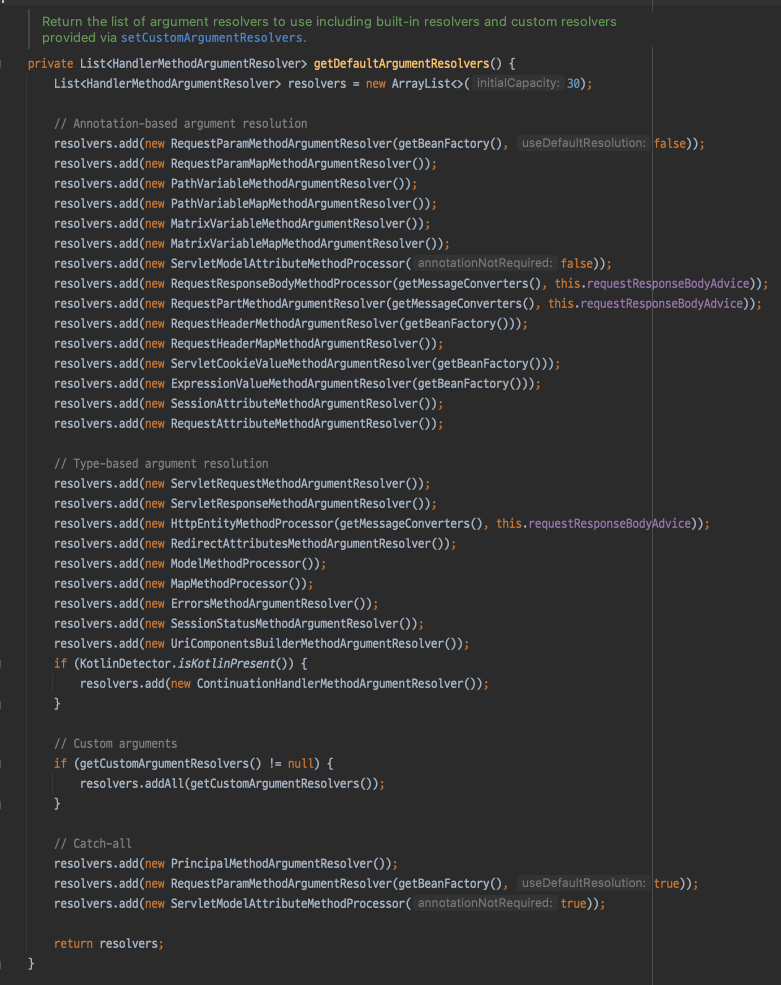

- useDefaultResolution 을 true 로 지정해서 한번 더 등록함..
    - 이놈이 애노테이션 생략이 가능한 비밀의 열쇠...

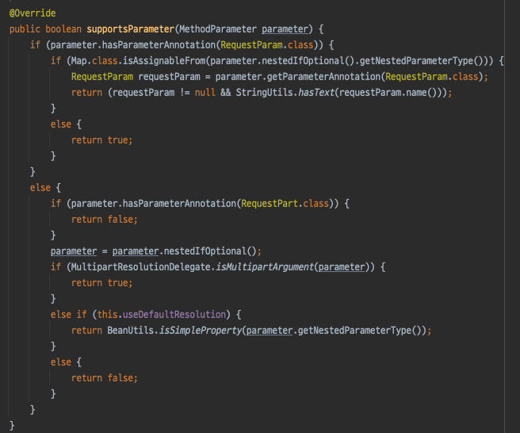

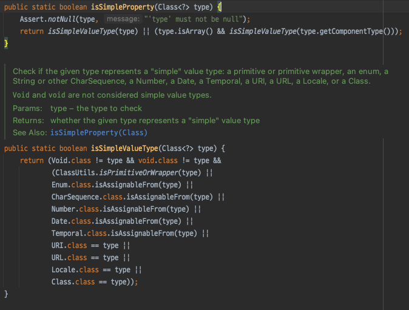

- isSimpleProperty 로 판단되는 타입이라면, @RequestParam 이 없어도, 메소드 인자로 지원을 해준다..

`@CookieValue`

- HTTP 요청과 함께 전달된 쿠키 값을 인자로 받을 수 있도록 지원한다.
    - ServletCookieValueMethodArgumentResolver 를 이용해 처리한다.
- @RequestParam 과 마찬가지로 기본적으로 값이 반드시 존재해야 하며, 디폴트 값과, 필수값 여부 지정도 가능하다.

```java
public String check(@CookeValue("auth") String auth){
    // ..
    return"";
    }
```

`@RequesHeader`

- HTTP 요청 헤더 정보를 인자로 받을 수 있도록 지원한다.
    - RequestHeaderMethodArgumentResolver 를 이용해 처리한다.
- @RequestParam 과 마찬가지로 기본적으로 값이 반드시 존재해야 하며, 디폴트 값과, 필수값 여부 지정도 가능하다.

```java
public void header(@RequestHeader("Host") String host){
    // ...    
    }
```

`Map/Model/ModelMap`

- 별도의 애노테이션이 적용되지 않은 java.util.Map, org.springframework.ui.Model, org.springframework.ui.ModelMap 은
  모두 모델 정보를 담는데 사용가능한 객체로 전달된다.
- 모델을 담을 맵을 핸들러 메소드에서 직접 생성할 수도 있지만, 메소드 인자로 받아 편리하게 처리가 가능한 것이다.

`@ModelAttribute`

- @ModelAttribute 는 메소드 레벨과 메소드 파라미터 레벨 모두 적용이 가능하다.
- 하지만 사용목적이 다르기 때문에 주의해야 한다.
- 기본적으로 @ModelAttribute 는 컨트롤러가 처리할 요청 정보를 **하나 이상의 값을 가진 오브젝트** 로 받기 위한 용도이다.
    - 하나의 오브젝트에 클라이언트의 요청정보를 담아 한 번에 전달되는 것이기 때문에 **커맨트 패턴** 에서 말하는 커맨드 오브젝트 라고도 한다.
- 예를 들어 검색 조건에 필요한 필드가 id, name, level, email 이라고 가정하면, 이를 UserSearch 라는 커멘트 오브젝트 하나로 받을 수 있는 것이다.

```java
public class UserSearch {

    int id;
    String name;
    int level;
    String email;
}
```

```java
public String search(@ModelAttribute UserSearch userSearch) {
    // ...
    return "";    
}
```
- @RequestParam 과 마찬가지로 생략이 가능하다.
  - @RequestParam 과 동일하게 이를 처리하는 ArgumentResolver 가 두번 등록된다.
- 생략할 경우 @RequestParam 과 @ModelAttribute 의 적용 기준은..
  - @RequestParam 적용 대상이 아니라면 모두 @ModelAttribute 가 생략된 것이라고 간주한다.

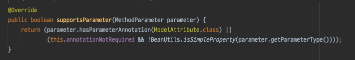

- 그리고 눈여겨 봐야할 점이 있는데.. 추후에 살펴볼 **DataBinder/ConversionService** 를 이용해 값을 변환하는데 사용한다.
  - 상당히 중요한 부분... 늘 기억하고 있자..
  
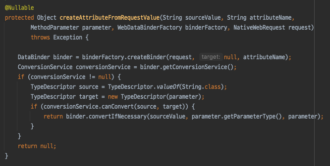

- @ModelAttribute 를 적용하면 지원하는 기능이 한가지 더 있는데, 컨트롤러가 반환할 모델 객체에 파라미터로 받은 객체를 자등으로 추가해준다.
  - @ModelAttribute 로 받은 객체는, ModelMap 에 자동으로 담긴다 라고 이해하면 편하다.

`Errors/BindinResult`
- @ModelAttribute 와 @RequestParam 의 차이점은, **검증 작업** 이 존재한다는 점이다.
  - 타입이 일치하지 않으면 @RequestParam 은 바로 400 에러를 뱉지만, @ModelAttribute 는 검증 작업이 존재하기 때문에, 이를 통해 핸들링이 가능해진다.

```java
public void create(@ModelAttribute UseRequest request, Errors errors) {
      if (errros.hasErrors()) {
          // 핸들링..
      }    
}
```

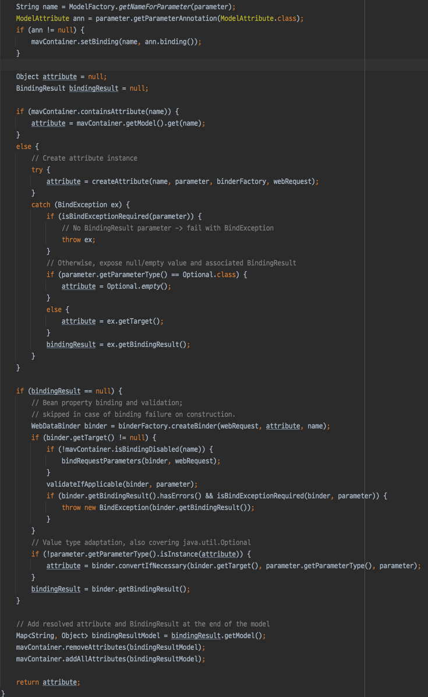

- attribute 를 생성하는 부분을 보면 BindingException 이 발생할 수 있음을 암시한다.
- 로직이 굉장히 복잡해서 일부를 생략하고 중요한 부분만 살펴보면..

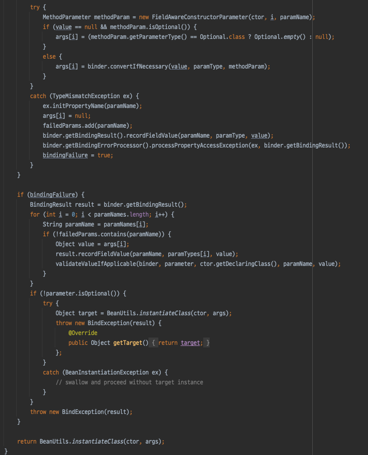

- 타입 불일치가 발생해서 에러가 발생하면, BindingResult 객체를 만들어 해당 객체에 에러 정보를 담아 BindingException 과 함께 던져준다.
- 다시 코어로직으로 돌아오면 BindingException 이 발생했을때, 파라미터로 Errors 타입이 존재한다면 이를 통해 핸들링이 가능하다.
  - BindingResult 에 담긴 정보들도 Model 에 모두 담아주는 것도 알 수 있다.

`SessionStatus`
- 컨트롤러가 제공하는 기능중, 모델 객체를 세션에 저장해 두었다가 재활용 가능하게끔 하는 기능이 있다.
- 이 기능과 거의 한쌍을 이뤄 사용하는 객체
- 더이상 필요가 없을때 SessionStatus 객체를 통해 이를 만료시켜버릴 수 있다.

`@RequestBody`
- HTTP 요청 본문을 읽어 바인딩할 때 사용한다.
- 일반적인 GET, 폼 처리방식이라면 사용할 일이 없겠지만, 요즈음 에는 대부분 REST-API 방식으로 많이 개발하기 때문에 실질적으로 가장 많이 사용할 애노테이션..
- 추후에 살펴볼 **HttpMessageConverter** 와 관련이 깊다.
- @RequestBody 가 적용된 인자가 있다면 미디어 타입을 활용해 존재하는 HttpMessageConverter 중 사용할 것을 선정하고 이를 통해 요청 본문을 읽어 해당 객체 타입으로 변환을 해 준다.
  - 대표적으로 **MappingJackson2HttpMessageConverter** 를 많이 사용할 것..

```java
/**
 * @RequestBody 는 요청 본문을 바인딩할 때 사용한다.
 * 이 애노테이션이 적용되었다면, HttpMessageConverter 를 사용한다.
 * 미디어 타입과 파라미터 타입을 확인하고, MessageConverter 중에 이를 선출해 처리한다.
 * JSON/XML/STRING 등등 다양한 컨버터들이 존재한다.
 */
@RequestMapping("/request-body")
public String requestBody(@RequestBody UserRequest request) {
    return "";
}
```

`@Value`
- 빈의 값 주입에 사용하던 @Value 도 메소드 인자로 지원한다.
- DI 에서 활용하던 프로퍼티나 필드 에 사용하던 방식과 동일하다.

```java
public String hello(@Value("#{systemProperties['os.name]}") String osName) {
    // ..
    return "";    
}
```


`@Valild`
- JSR-303 애노테이션을 사용해 검증하도록 지시하는 애노테이션
- 일반적으로 @ModelAttribute 나 @RequestBody 와 함께 사용한다.
- 자세한 사용 법은 추후 살펴볼 예정..

### 핸들러 메소드 리턴 타입의 종류
- @Controller 를 지정한 클래스의 메소드의 리턴타입은 다양한 타입을 지원하는데, 결론적으로 봤을때 다른 정보들과 조합해 최종적으로 **ModelAndView** 타입으로 만들어 진다.

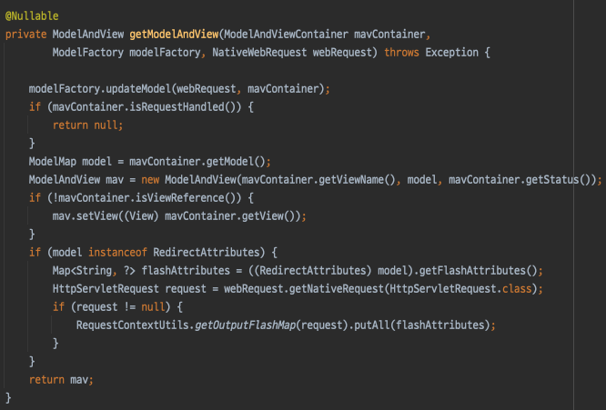

#### 자동 추가 모델 오브젝트와 자동 생성 뷰 이름
- 다음 네 가지 정보는, 메소드 리턴타입과 관계없이 조건이 맞다면 모델 객체에 자동으로 추가된다.

`@ModelAttribute 모델 객체 또는 커맨드 오브젝트`
- @ModelAttribute 가 적용된 커맨드 오브젝트는 자동적으로 컨트롤러 반환하는 모델에 추가된다.
- 기본적으로 **파라미터 타입 명** 을 따르고, 이름을 직접 지정할 수도 있다.

`Map/Model/ModelMap`
- 핸들러 메소드 인자로 Map, Model, ModelMap 타입 파라미터를 사용하면 사전에 생성된 모델 맵 오브젝트를 받아 사용이 가능하다.
- 별도로 ModelAndView 를 생성해 리턴하더라도 파라미터로 받은 맵에 추가한 오브젝트는 모두 모델에 추가된다.

`@ModelAttribute 메소드`
- @ModelAttribute 는 컨트롤러 클래스의 일반 메소드에도 적용이 가능하다.
- 뷰에서 참고 정보로 사용되는 모델 오브젝트를 만드는 용도로 사용한다.

```java
@ModelAttribute("codes")
public List<Code> codes() {
    return codeService.getAllCodes();    
}
```

> 개인적으로 상당히 애용했던 기능.. 예를 들어서 등록/수정 이런 폼에서 ENUM 정보가 지속적으로 참조되는 경우 매우 쓸만함

`BindinResult`
- @ModelAttribute 와 함께 사용되는 BindingResult 타입 오브젝트도 모델에 자동으로 추가된단.
- 이때 키는 'org.springframework.validation.BindingResult.<모델명>' 이다.
- JSP 와 같은 템플릿 엔진에서 커스텀 태그에서참조하기 위함이다.

#### 반환 타입 종류

`ModelAndView`
- ModelAndView 는 컨트롤러가 반환해야할 대표적인 타입
- 하지만 이보다 편리한 방법이 많아 직접적으로 많이 사용되지는 않는다.
- 다양한 반환타입을 지원하는데 결국 최종적으로는 **ModeAndView 타입으로 변환** 된다는 사실을 기억해야 한다.

```java
@RequestMapping("/hello")
public ModelAndView hello() {
    return new ModelAndView("hello");    
}
```

`String`
- 리턴타입이 스트링이라면 이 값은 **뷰 이름** 으로 사용된다.
- 모델 정보는 모델 맵파라미터라 가져와 추가하는 등의 방법을 사용해야 한다.
  - 가장 심플하고 간편하기 때문에 가장 많이 사용되는 방식..

```java
@RequestMapping("/hello")
public String hello(Model model) {
    return "hello";    
}
```

`void`
- 메소드 반환타입을 void 로 지정할 수도 있다.
- 이때는 **RequestToViewNameTranslator** 를 사용해 자동생성되는 뷰 이름이 사용된다.
- URL 과 뷰 이름이 일관되게 통일 가능하다면 사용을 고려해볼만 하지만 권장하는 방식은 아니다.

```java
@RequestMapping("/hello")
public void hello(Model model) {
}
```

`모델 오브젝트`
- 뷰의 이름을 RequestToViewNameTranslator 로 자동생성되는것을 활용하고, Model 오브젝트를 바로 반환하는 방식이다.
- 스프링은 리턴타입이 미리 지정된 타입이라면 이를 모델 오브젝트로 인지해 자동으로 추가해준다.

```java
@RequestMapping("/hello")
public User view() {
    return new User();
}
```

`Map/Model/ModelMap`
- Map/Model/ModelMap 을 생성해 반환한다면 이는 모델로 사용된다.
- 하지만 실질적으로 많이 사용되는 방식은 아니다.

```java
@RequestMapping("/hello")
public Map view() {
    return new HashMap();  
}
```

`View`
- 뷰 이름대신 뷰 오브젝트를 사용하고 싶을때 사용한다.

```java
class UserController {
    MarshallingView view;
    
    @RequestMappping("/view")
    public View view() {
        return this.view;
    }
    
}
```

`@ResponseBody`
- @ResponseBody 는 @RequestBody 와 유사한 방식으로 동작한다.
- 이는 메소드가 반환하는 오브젝트를 HttpMessageConverter 를 사용해 응답 본문으로 변환한다.
- 번외로 @RestController 라는 메타 애노테이션이 존재하는데, 이 애노테이션이 적용된 컨트롤러는 모든 메소드에 @ResponseBody 가 적용된 것과 동일하다.

```java
@RequestMapping("/hello")
@ResponseBody
public String hello() {
    return "<html><body>hello</body></html>";
}
```

### @SessionAttributes/SessionStatus
- @SessionAttributes 는 컨트롤러 메소드가 생성하는 모델 중 지정한 이름과 동일한 것이 있다면, 세션에 저장해두었다가 이를 재사용한다.
  - @ModelAttribute 가 지정된 파라미터 중에 이름이 동일한 것이 있다면 이를 세션에서 가져온다.
- 이름에서 알 수 있듯이 하나 이상의 모델을 세션에 저장하고 활용할 수 있으며, 클래스의 모든 메소드에 적용된다.
- 이제 더이상 세션에 담아둘 필요가 없을때 SessionStatus 를 참조해 이를 제거하는 것 또한 가능하다.
  - SessionAttributesHandler/SessionAttributeStore
  - 기본적으로 SessionScope 으로 Request#setAttribute 를 사용하는 방식을 사용하고, 별도로 커스터마이징 하는것 또한 가능하다.
  
```java
@Controller
@SessionAttributes("user")
public class SessionAttributesController {


  @RequestMapping(value = "/user/edit", method = RequestMethod.GET)
  public String editForm(@RequestParam int id, Model model) {
    model.addAttribute("user", new User());
    return "user/edit";
  }

  @RequestMapping(value = "/user/edit", method = RequestMethod.POST)
  public String submit(@ModelAttribute User user, SessionStatus sessionStatus) {
    // ... 등록 처리
    sessionStatus.setComplete(); // 세션에서 제거
    return "";
  }
}
```

- 여기서 의문은.. 넣어주는건 알겠는데 어디서 가져오는가 ?... (메소드 인자니까 ArgumentResolver 가 하는건 알겠는데..)
  - ArgumentResolver 들을 살펴보면 모두 공통적으로 ModelAndViewContainer 를 참조하고 있다.
  - 핵심은 **ModelAndViewContainer**

```java
public class ModelAndViewContainer {

	private boolean ignoreDefaultModelOnRedirect = false;

	@Nullable
	private Object view;

	private final ModelMap defaultModel = new BindingAwareModelMap();

	@Nullable
	private ModelMap redirectModel;

	private boolean redirectModelScenario = false;

	@Nullable
	private HttpStatus status;

	private final Set<String> noBinding = new HashSet<>(4);

	private final Set<String> bindingDisabled = new HashSet<>(4);

	private final SessionStatus sessionStatus = new SimpleSessionStatus();

	private boolean requestHandled = false;


	public ModelMap getModel() {
		if (useDefaultModel()) {
			return this.defaultModel;
		}
		else {
			if (this.redirectModel == null) {
				this.redirectModel = new ModelMap();
			}
			return this.redirectModel;
		}
	}
    
	private boolean useDefaultModel() {
		return (!this.redirectModelScenario || (this.redirectModel == null && !this.ignoreDefaultModelOnRedirect));
	}

	public void setBindingDisabled(String attributeName) {
		this.bindingDisabled.add(attributeName);
	}

	public boolean isBindingDisabled(String name) {
		return (this.bindingDisabled.contains(name) || this.noBinding.contains(name));
	}

	public void setBinding(String attributeName, boolean enabled) {
		if (!enabled) {
			this.noBinding.add(attributeName);
		}
		else {
			this.noBinding.remove(attributeName);
		}
	}

	public SessionStatus getSessionStatus() {
		return this.sessionStatus;
	}

	public void setRequestHandled(boolean requestHandled) {
		this.requestHandled = requestHandled;
	}

	public boolean isRequestHandled() {
		return this.requestHandled;
	}

	public ModelAndViewContainer addAttribute(String name, @Nullable Object value) {
		getModel().addAttribute(name, value);
		return this;
	}
    
	public ModelAndViewContainer addAttribute(Object value) {
		getModel().addAttribute(value);
		return this;
	}

	public ModelAndViewContainer addAllAttributes(@Nullable Map<String, ?> attributes) {
		getModel().addAllAttributes(attributes);
		return this;
	}

	public ModelAndViewContainer mergeAttributes(@Nullable Map<String, ?> attributes) {
		getModel().mergeAttributes(attributes);
		return this;
	}

	public ModelAndViewContainer removeAttributes(@Nullable Map<String, ?> attributes) {
		if (attributes != null) {
			for (String key : attributes.keySet()) {
				getModel().remove(key);
			}
		}
		return this;
	}

	public boolean containsAttribute(String name) {
		return getModel().containsAttribute(name);
	}

}
```
- ModelAndViewContainer 를 통해 애트리뷰트를 저장하고, 이를 참조하도록 구현되어 있다.

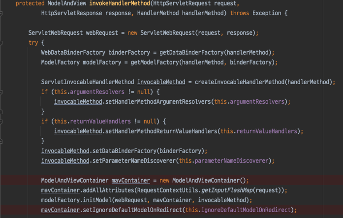

- 예상한대로 HandlerAdapter 에서 ModelAndViewContainer 를 생성하고, 이에대한 초기화 작업을 수행한 뒤 ArgumentResolver 에서 사용하고 있는 것

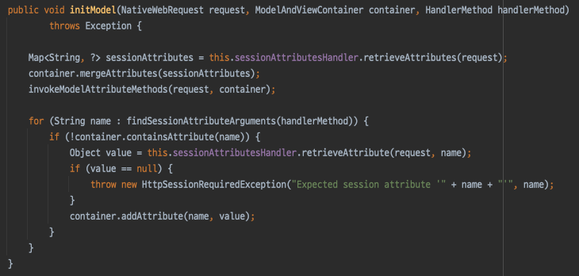

- 세션에 담아두었던 정보들 (@SessionAttributes 가 적용된 모델) 을 미리 가져와서 ModelAndViewContainer 에 merge 해 주고 있다.. 이로서 모든 의문이 해결..

## 모델 바인딩과 검증
- @ModelAttribute 가 적용된 파라미터를 사용하면 크게 3가지 작업이 진행된다.
  1. 파라미터 타입의 오브젝트 생성 / @SessionAttributes 에 의해 저장된 오브젝트가 있다면 이를 가져와 사용한다.
  2. 모델 오브젝트에 웹 파라미터를 바인딩 해준다.
  3. 모델의 값을 검증한다.
- 이번에는 모델 오브젝트에 파라미터 바인딩 과정과 검증에 관해 살펴볼 예정

### PropertyEditor
- 스프링이 제공하는 기본적인 타입 변환용 API
- 사실 따져보면 스프링 API 가 아닌 자바빈 표준 인터페이스이다.
  - 기존 용도는 GUI 컴포넌트에서 활용하기 위함이었음
- Spring MVC 3.0 이전 까지 주로 사용되었다.

### 디폴트 프로퍼티 에디터
- 프로퍼티 에디터는 @Controller 파라미터에도 동일하게 적용된다.
- String 을 Charset 타입으로 변환하기 위해 제공하는 CharsetEditor 를 사용한다면 ?charset=UTF-8 이라는 쿼리파라미터를 핸들러 메소드의 Charset 타입으로 받을 수 있다.

```java
/**
 * ?charset=UTF-8 로 들어온다면, Charset.UTF-8 타입으로 받게된다.
 */
@RequestMapping("/hello")
public void hello(@RequestParam Charset charset, Model model){

}
```

## 참고

- https://github.com/spring-projects/spring-framework/issues/23915
- https://github.com/spring-projects/spring-framework/issues/24179
- https://stackoverflow.com/questions/9688065/spring-mvc-application-filtering-html-in-url-is-this-a-security-issue
- https://stackoverflow.com/questions/30610607/how-to-change-spring-request-mapping-to-disallow-url-pattern-with-suffix
- https://stackoverflow.com/questions/30307678/why-does-requestmapping-spring-annotation-in-controller-capture-more-that-i-wan
- https://stackoverflow.com/questions/22845672/requestmapping-in-spring-with-weird-patterns
- https://hamait.tistory.com/314