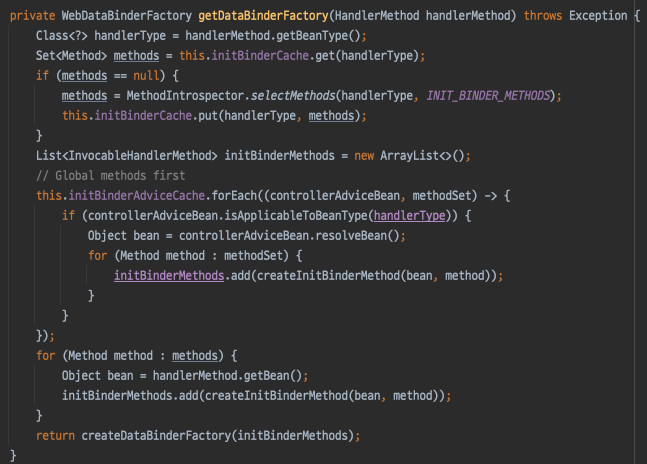
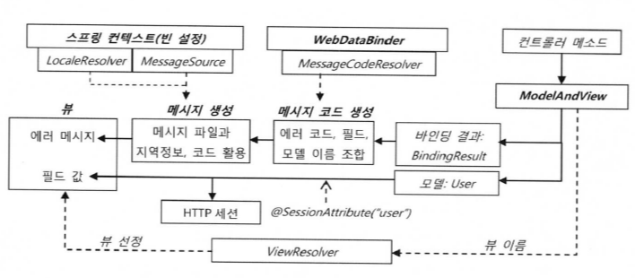

# 지옥 스터디 - 13 스프링 @MVC

## Spring MVC 구성요소


## @RequestMappingHandlerMapping

- @MVC 의 가장 큰 특징 -> 기존에는 매핑의 대상이 오브젝트 였다면, **메소드** 단위로 변경되었다.
    - Ruby On Rails 와 같은 프레임워크의 영향을 많이 받음..
- @MVC 의 핸들러 매핑 처리를 위해 **DefaultAnnotationHandlerMapping (deprecated)** 를 사용한다.
    - 3.1 부터 RequestMappingHandlerMapping 으로 대체됨
- @RequestMapping 애노테이션을 매핑 정보로 활용한다.
    - 타입/메소드 레벨에 적용가능 하다.
- 최종적으로 **두 가지 위치에 적용된 정보를 결합해 최종 매핑 정보를 생성** 한다.

### @RequestMapping

- @RequestMapping 애노테이션은 매핑 정보 제공을 위한 다양한 엘리먼트들이 존재한다.
    - Spring 2.5 버전부터 추가됨
- 모든 엘리먼트들은 **생략 가능**

```java

@Target({ElementType.TYPE, ElementType.METHOD})
@Retention(RetentionPolicy.RUNTIME)
@Documented
@Mapping
public @interface RequestMapping {

    String name() default "";

    @AliasFor("path")
    String[] value() default {};

    /**
     * The path mapping URIs (e.g. {@code "/profile"}).
     * <p>Ant-style path patterns are also supported (e.g. {@code "/profile/**"}).
     * At the method level, relative paths (e.g. {@code "edit"}) are supported
     * within the primary mapping expressed at the type level.
     * Path mapping URIs may contain placeholders (e.g. <code>"/${profile_path}"</code>).
     * <p><b>Supported at the type level as well as at the method level!</b>
     * When used at the type level, all method-level mappings inherit
     * this primary mapping, narrowing it for a specific handler method.
     * <p><strong>NOTE</strong>: A handler method that is not mapped to any path
     * explicitly is effectively mapped to an empty path.
     * @since 4.2
     */
    @AliasFor("value")
    String[] path() default {};

    RequestMethod[] method() default {};

    String[] params() default {};

    String[] headers() default {};

    String[] consumes() default {};

    String[] produces() default {};

}
```

`String[] value()`

```java

@Controller
@RequestMapping("/api/v1") // 타입 레벨에 정의, 타입 레벨에 정의 되었다면 이는 메소드레벨에 정의된 매핑 정보의 "공통 정보" 로써 사용된다.
public class SimpleController {

    // 메소드 레벨에 정의
    @RequestMapping("/users")
    public String users() {
        return "users";
    }

    /**
     * 파일확장자 패턴으로 매칭도 가능하다. 하지만 스프링 부트의 경우 기본적으로 false 로 지정되어 있다.
     * 보안상의 이슈..
     *
     * https://stackoverflow.com/questions/9688065/spring-mvc-application-filtering-html-in-url-is-this-a-security-issue
     * https://stackoverflow.com/questions/30610607/how-to-change-spring-request-mapping-to-disallow-url-pattern-with-suffix
     * https://stackoverflow.com/questions/30307678/why-does-requestmapping-spring-annotation-in-controller-capture-more-that-i-wan
     * https://stackoverflow.com/questions/22845672/requestmapping-in-spring-with-weird-patterns
     *
     * https://github.com/spring-projects/spring-framework/issues/23915
     * https://github.com/spring-projects/spring-framework/issues/24179
     *
     */
    @RequestMapping("/main.*")
    public String main() {
        return "main";
    }

    /**
     * value 속성에 명시하며, value 애트리뷰트 명은 생략가능
     */
    @RequestMapping(value = "/hello")
    public String hello() {
        return "hello";
    }

    /**
     * 배열로 하나 이상의 URL 패턴 지정도 가능하다.
     */
    @RequestMapping({"/wow", "/fantastic"})
    public String wow() {
        return "wow";
    }
}
```

- 디폴트 엘리먼트
- 스트링 배열로 URL 패턴 지정이 가능하다.
- 가장 기본이 되는 매핑 정보
- 파일 **확장자 패턴** 으로 매핑도 가능하다.
    - useSuffixPatternMatch 옵션
- 하지만 기본적으로 해당 옵션이 false 로 지정되어 있음
    - 스프링 부트의 경우 꽤나 오래전부터 false 였지만.. 스프링 MVC 의 경우에는 좀 최근에 변경됨..
    - 이는 보안상의 이슈..


```java
@RequestMapping("/welcome")
```

- 이와 같이 매핑이 되어있다고 가정하면..
- http://www.example.com/welcome.check.blah 라고 요청을 보내도 동작하게 된다.
- 스크립트 태그가 있는 GET URL 이 있어도 요청을 보내게됨
    - http://www.example.com/welcome.<script>alert("hi")</script>

`RequestMethod[] method()`

```java
public enum RequestMethod {

    GET, HEAD, POST, PUT, PATCH, DELETE, OPTIONS, TRACE

}
```

```java

@Controller
@RequestMapping("/api/v1") // 타입 레벨에 정의, 타입 레벨에 정의 되었다면 이는 메소드레벨에 정의된 매핑 정보의 "공통 정보" 로써 사용된다.
public class SimpleController {

    /**
     * 요청 메소드 지정도 가능하다 (배열로 지정가능)
     * 동일한 요청 URL 이더라도 메소드가 다르다면, 다른 매핑으로 인지한다.
     * @see org.springframework.web.bind.annotation.RequestMethod
     */
    @RequestMapping(value = "/ncucu", method = RequestMethod.GET)
    public String requestMethod() {
        return "requestMethod";
    }

    /**
     * 메타 애노테이션으로 활용한 GetMapping, PostMapping 등이 편의를 위해 추가됨 (스프링 4.3)
     */
    @GetMapping("/ncucu2")
    public String requestMethod2() {
        return "requestMethod2";
    }
}
```

- HTTP 요청 메소드를 지정
- RequestMethod 는 HTTP 메소드를 정의한 enum
- 배열로 지정이 가능하고, 동일한 URL 이더라도 요청 메소드가 다르다면 다른 매핑으로 인지한다.
- 스프링 4.3 부터 @GetMapping, @PostMapping 과 같은 편의를 위한 메타 애노테이션이 추가되었다.

```java

@Target(ElementType.METHOD)
@Retention(RetentionPolicy.RUNTIME)
@Documented
@RequestMapping(method = RequestMethod.GET)
public @interface GetMapping {

    @AliasFor(annotation = RequestMapping.class)
    String name() default "";

    @AliasFor(annotation = RequestMapping.class)
    String[] value() default {};

    @AliasFor(annotation = RequestMapping.class)
    String[] path() default {};

    @AliasFor(annotation = RequestMapping.class)
    String[] params() default {};

    @AliasFor(annotation = RequestMapping.class)
    String[] headers() default {};

    @AliasFor(annotation = RequestMapping.class)
    String[] consumes() default {};

    @AliasFor(annotation = RequestMapping.class)
    String[] produces() default {};

}
```

`String[] params()`

```java

@Controller
@RequestMapping("/api/v1") // 타입 레벨에 정의, 타입 레벨에 정의 되었다면 이는 메소드레벨에 정의된 매핑 정보의 "공통 정보" 로써 사용된다.
public class SimpleController {

    /**
     * 요청 파라미터와 값을 비교해 매핑하는 방식
     * 동일한 URL 이더라도, 요청 파라미터에 따라 별도의 작업을 해 줄 수 있다.
     */
    @GetMapping(value = "params", params = "type=admin")
    public String admin(String type) {
        return "admin";
    }

    @GetMapping(value = "params", params = "type=member")
    public String member(String type) {
        return "member";
    }

    /**
     * 특정 파라미터가 존재해선 안된다는 매핑 선언도 가능
     */
    @GetMapping(value = "params", params = "!type")
    public String notType(String type) {
        return "notType";
    }
}
```

- 요청 파라미터와 값을 비교해 매핑 정보를 제공
- 동일 URL 이더라도, 요청 파라미터에 따라 별도의 작업을 할 수 있다.

`String[] headers()`

```java

@Controller
@RequestMapping("/api/v1") // 타입 레벨에 정의, 타입 레벨에 정의 되었다면 이는 메소드레벨에 정의된 매핑 정보의 "공통 정보" 로써 사용된다.
public class SimpleController {

    /**
     * 특정 헤더와 키/값이 동일할때만 매핑해준다.
     * 요청 파라미터와 유사하다
     */
    @GetMapping(value = "header", headers = "content-type=text/*")
    public String headers() {
        return "";
    }
}

```

- HTTP 헤더 정보를 활용한 매핑 정보를 제공
- 자주 사용되지는 않는다.

### 메소드/타입 레벨 매핑

- @RequestMapping 은 메소드 단위로 핸들러를 매핑하는 방식
- 메소드/타입 레벨에 매핑정보를 지정할 수 있다.
- 메소드 단위 매핑중에 공통적인 정보가 있다면, 타입레벨로 이를 추출해 해당 클래스 전역으로 활용도 가능하다.
    - 공통적인 매핑 정보가 없다면, 타입레벨 매핑은 생략을 해도 무관하다.
    - 대부분의 경우는 UserController / ProductController 이런 식으로 구성을 해서 사용할 것이기 때문에 메소드 + 타입 레벨 매핑을 주로 사용함..

```java

@Controller
@RequestMapping("/api/v1") // 타입 레벨에 정의, 타입 레벨에 정의 되었다면 이는 메소드레벨에 정의된 매핑 정보의 "공통 정보" 로써 사용된다.
public class SimpleController {

    // 메소드 레벨에 정의
    @RequestMapping("/users")
    public String users() {
        return "users";
    }
}
```

### 타입 상속과 매핑

- @RequestMapping 이 적용된 클래스를 **상속** 해서 사용한다면 슈퍼 클래스의 정보는 어떻게 될까 ?
    - 언어차원에서 봤을때 애노테이션 정보는 기본적으로 상속되지 않는다. (@Inherited 가 적용되지 않은 경우)
- 하지만 **프레임워크** 레벨로 들어갔을때는 조금 다르다.
- 부모 클래스에 적용된 애노테이션까지 처리하는 경우가 많음.. (Spring/JPA 같은...)
- 스프링의 @RequestMapping 은 상속된다 라고 이해해도 좋다.
    - 프레임워크 레벨에서 부모 클래스에 적용된 애노테이션 정보까지 활용하기 때문
- 매핑 정보 상속과 종류의 대표적인 경우를 몇가지 살펴보자...

`상위 타입과 메소드의 @RequestMapping`

```java

@RequestMapping("/user")
public class Super {

    @RequestMapping("/list")
    public String list() {
        return "";
    }
}

/**
 * 클래스 상속의 경우 슈퍼 클래스의 매핑정보가 자식에게 그대로 적용된다.
 * 매핑정보가 명시된 슈퍼 클래스의 메소드를 오버라이드 했더라도, 자식클래스에 매핑정보를 명시하지 않는한 해당 정보도 상속된다.
 */
public class Sub extends Super {

    @Override
    public String list() {
        return super.list();
    }
}
```

- 부모 클래스에만 @RequestMapping 을 적용하고, 이를 상속한 자식 클래스에서는 아무런 적용도 하지 않았을 경우이다.
- 클래스 상속의 경우 부모 클래스의 매핑 정보가 자식 클래스에게 그대로 적용된다.
- 하위 클래스가 해당 메소드를 오버라이드 하더라도, 자식 클래스에 매핑 정보를 명시하지 않는한, 해당 정보도 **상속** 된다.
    - 인터페이스 구현의 경우도 동일하다.

`상위 타입의 @RequestMapping 과 하위 타입 메소드의 @RequestMapping`

```java

@RequestMapping("/user")
public class Super {


    public String list() {
        return "";
    }
}


public class Sub extends Super {

    @RequestMapping("/list")
    @Override
    public String list() {
        return super.list();
    }
}
```

- 부모 클래스의 타입에만 @RequestMapping 이 적용되어 있고, 자식 클래스에는 메소드에만 @RequestMapping 이 적용된 경우이다.
- 부모 타입레벨 매핑정보 + 자식 메소드레벨 매핑정보가 결합되어 최종적인 매핑 정보가 생성된다.
    - 인터페이스 구현의 경우도 동일하다.

`상위 타입 메소드의 @RequestMapping 과 하위 타입의 @RequestMapping`

- 이전 케이스와 반대되는 경우이다.
- 부모 클래스에는 메소드 레벨에만 적용되었고, 자식 클래스는 타입 레벨에만 적용된 경우..
- 이도 마찬가지로 매핑정보가 상속되어 결합된다.
    - 인터페이스 구현의 경우도 동일하다.

`하위 타입과 메소드의 @RequestMapping 재정의`

```java

@RequestMapping(value = "/user", method = RequestMethod.POST)
public class Super {

    @RequestMapping("/list")
    public String list() {
        return "";
    }
}

@RequestMapping("/ncucu")
public class Sub extends Super {

    @RequestMapping("/me")
    @Override
    public String list() {
        return super.list();
    }
}
```

- 자식 클래스가 @RequestMapping 을 적용하면 부모의 매핑정보를 대체해서 적용된다.
    - 이는 타입/메소드 레벨 모두 적용된다.
- 조금 주의할 점은, @RequestMapping 이 통으로 오버라이드 된다고 이해하면 좋다.
    - 예제에서 부모 클래스에 정의된 RequestMethod 매핑 정보는 사라짐..

`하위 타입 메소드의 URL 패턴이 없는 @RequestMapping 재정의`

- 자식 클래스에서 재정의한 @RequestMapping 은 부모 클래스에 정의한 매핑 정보를 대체한다.
- 하지만 조금 특이한 케이스는, **클래스 상속** 에 한해 오버라이드한 하위 메소드에 한해 URL 매핑 정보가 없다면 이는 무시된다.

> 다양한 매핑 정보 상속을 알아봤는데... 사실 실무에서 사용하는 경우는 거의 없을 거라고 생각함.. <br/>
> 사내 프레임워크를 만든다거나 하지 않는한 거의 안쓰이는 부분이고 사실 사용한다고 해도 가능하면 명시적으로 사용하는걸 권장하고 싶음... <br/>
> 의도치 않게 동작할 수도 있고 모든 팀원이 이걸 다 알아야 제대로 사용이 가능하다고 생각..

## @Controller

- RequestMappingHandlerMapping 은 @RequestMapping 의 매핑 정보를 활용해 핸들러 메소드에 매핑을 해주는 역할을 수행한다.
- RequestMappingHandlerAdapter 는 매핑된 메소드를 **호출 하는 역할** 을 수행한다.
    - Spring 3.1 버전에 추가됨
    - 2.5 버전까지는 AnnotationMethodHandlerAdapter
- 기존에는 특정 인터페이스를 구현하는 방식의 매핑을 사용하고, **오브젝트 단위** 로 핸들러가 존재했기 때문에 핸들러 메소드의 파라미터와 리턴 타입 등을 쉽게 알 수 있었다.
    - 핸들러 메소드의 파라미터 등의 정보가 인터페이스에 정의되어 있다.
- 하지만 애노테이션 기반의 방식으로 바뀌면서 해당 정보를 얻어오는 방식이 복잡해 졌다.
- 반대로 말하면 애노테이션 기반의 핸들러는 특정 인터페이스에 종속되지 않는 핸들러 정의가 가능해 졌기 때문에 그만큼 **유연성** 을 가졌다는 의미이기도 하다.
- @Controller 를 사용한 방식은 핸들러 메소드의 파라미터나 리턴 타입을 자유롭게 결정할 수 있다.

### 핸들러 메소드의 파라미터 종류

`HttpServletRequest/Response`

- 대부분의 경우 상세한 정보를 담은 파라미터 타입을 활용하겠지만 서블릿에서 다루는 로우레벨의 HttpServletRequest/Response 도 파라미터로 사용이 가능하다.
- ServletRequest/Response 도 지원

`HttpSession`

- HttpSession 은 HttpServletRequest 로 부터 가져올 수도 있지만, 세션이 필요한 경우라면 HttpSession 타입으로 직접 받을 수도 있다.
- HttpSession 은 서버에 따라 Thread-Safe 하지 않을 수 있다.
- 서버에 상관없이 HttpSession 을 Thread-Safe 하게 사용하고 싶다면 핸들러 어댑터의 synchronizeOnSession=true 로 지정해 주어야한다.
    - 기본값 : false

```java
public class RequestMappingHandlerAdapter extends AbstractHandlerMethodAdapter
    implements BeanFactoryAware, InitializingBean {

    // ...
    @Override
    protected ModelAndView handleInternal(HttpServletRequest request,
        HttpServletResponse response, HandlerMethod handlerMethod) throws Exception {

        ModelAndView mav;
        checkRequest(request);

        // Execute invokeHandlerMethod in synchronized block if required.
        if (this.synchronizeOnSession) {
            HttpSession session = request.getSession(false);
            if (session != null) {
                Object mutex = WebUtils.getSessionMutex(session);
                synchronized (mutex) {
                    mav = invokeHandlerMethod(request, response, handlerMethod);
                }
            } else {
                // No HttpSession available -> no mutex necessary
                mav = invokeHandlerMethod(request, response, handlerMethod);
            }
        } else {
            // No synchronization on session demanded at all...
            mav = invokeHandlerMethod(request, response, handlerMethod);
        }

        if (!response.containsHeader(HEADER_CACHE_CONTROL)) {
            if (getSessionAttributesHandler(handlerMethod).hasSessionAttributes()) {
                applyCacheSeconds(response, this.cacheSecondsForSessionAttributeHandlers);
            } else {
                prepareResponse(response);
            }
        }

        return mav;
    }
}
```

`WebRequest/NativeWebRequest`

- WebRequest 는 HttpServletRequest 의 요청 정보를 대부분 가지고 있는 **서블릿에 종속되지 않는** 타입 이다.
- 서블릿/포틀릿 환경에서 사용가능한 범용적인 핸들러를 만들기 위해 만들어 졌으나 스프링 MVC 에서는 사실 직접 다룰일이 거의 없다.

`Locale`

- java.util.Locale 타입으로 LocaleResolver 가 결정한 Locale 객체를 지원한다.

`InputStream/Reader`

- HttpServletRequest#getInputStream() 을 통해 얻을 수 있는 콘텐트 스트림/Reader 타입 객체를 지원한다.

`OutputStream/Writer`

- HttpServletResponse#getOuputStream() 을 통해 얻을 수 있는 콘텐트 스트림/Reader 타입 객체를 지원한다.

`@PathVaraible`

- @RequestMapping 의 매핑정보에 사용되는 패스 변수를 받을 수 있다.
    - /users/{userId}
- Path 변수의 이름과 메소드 인자의 변수명이 일치한다면 Path 변수명은 생략할 수 있다.
- RESTful 방식으로 API 설계를 많이 하기 때문에 유용하게 사용할 수 있다.
    - 이후에 살펴볼 **ArgumentResolver** 를 통해 이를 처리 한다.

```java
@RequestMapping("/users/{userId}")
public String getUser(@PathVariable("id") int id){
    // ...
    return"";
    }
```

`@RequestParam`

```java

@Target(ElementType.PARAMETER)
@Retention(RetentionPolicy.RUNTIME)
@Documented
public @interface RequestParam {

    @AliasFor("name")
    String value() default "";

    /**
     * The name of the request parameter to bind to.
     * @since 4.2
     */
    @AliasFor("value")
    String name() default "";

    boolean required() default true;

    String defaultValue() default ValueConstants.DEFAULT_NONE;

}
```

- HTTP 요청 파라미터를 메소드 파라미터로 받을 수 있다.
    - **RequestParamMethodArgumentResolver** 를 이용해 처리한다.
- 하나 이상의 파라미터에 적용이 가능하고, 스프링 내장 변환기가 핸들링 할 수 있는 모든 타입을 지원한다.
- 기본적으로 해당 파라미터가 반드시 존재해야 한다. 존재하지 않는다면 400 응답을 반환
- 디폴트 값과, 필수값 여부 지정도 가능하다.

```java
public String get(@RequestParam int id,@RequestParam String name,@RequestParam MultipartFile file){
    // ..
    return"";
    }
```

- 만약 모든 파라미터를 받고 싶다면, Map<String, String> 또는 MultiValueMap<String, String> 타입으로 받을 수 있다.

```java
public String get(@RequestParam Map<String, String> params){
    // ..
    return"";
    }
```

- 재밌는점은, 스프링의 기본 ArgumentResolver 등록부분을 보면 RequestParamMethodArgumentResolver 를 2번 등록한다.


- useDefaultResolution 을 true 로 지정해서 한번 더 등록함..
    - 이놈이 애노테이션 생략이 가능한 비밀의 열쇠...


- isSimpleProperty 로 판단되는 타입이라면, @RequestParam 이 없어도, 메소드 인자로 지원을 해준다..

`@CookieValue`

- HTTP 요청과 함께 전달된 쿠키 값을 인자로 받을 수 있도록 지원한다.
    - ServletCookieValueMethodArgumentResolver 를 이용해 처리한다.
- @RequestParam 과 마찬가지로 기본적으로 값이 반드시 존재해야 하며, 디폴트 값과, 필수값 여부 지정도 가능하다.

```java
public String check(@CookeValue("auth") String auth){
    // ..
    return"";
    }
```

`@RequesHeader`

- HTTP 요청 헤더 정보를 인자로 받을 수 있도록 지원한다.
    - RequestHeaderMethodArgumentResolver 를 이용해 처리한다.
- @RequestParam 과 마찬가지로 기본적으로 값이 반드시 존재해야 하며, 디폴트 값과, 필수값 여부 지정도 가능하다.

```java
public void header(@RequestHeader("Host") String host){
    // ...    
    }
```

`Map/Model/ModelMap`

- 별도의 애노테이션이 적용되지 않은 java.util.Map, org.springframework.ui.Model, org.springframework.ui.ModelMap 은
  모두 모델 정보를 담는데 사용가능한 객체로 전달된다.
- 모델을 담을 맵을 핸들러 메소드에서 직접 생성할 수도 있지만, 메소드 인자로 받아 편리하게 처리가 가능한 것이다.

`@ModelAttribute`

- @ModelAttribute 는 메소드 레벨과 메소드 파라미터 레벨 모두 적용이 가능하다.
- 하지만 사용목적이 다르기 때문에 주의해야 한다.
- 기본적으로 @ModelAttribute 는 컨트롤러가 처리할 요청 정보를 **하나 이상의 값을 가진 오브젝트** 로 받기 위한 용도이다.
    - 하나의 오브젝트에 클라이언트의 요청정보를 담아 한 번에 전달되는 것이기 때문에 **커맨트 패턴** 에서 말하는 커맨드 오브젝트 라고도 한다.
- 예를 들어 검색 조건에 필요한 필드가 id, name, level, email 이라고 가정하면, 이를 UserSearch 라는 커멘트 오브젝트 하나로 받을 수 있는 것이다.

```java
public class UserSearch {

    int id;
    String name;
    int level;
    String email;
}
```

```java
public String search(@ModelAttribute UserSearch userSearch){
    // ...
    return"";
    }
```

- @RequestParam 과 마찬가지로 생략이 가능하다.
    - @RequestParam 과 동일하게 이를 처리하는 ArgumentResolver 가 두번 등록된다.
- 생략할 경우 @RequestParam 과 @ModelAttribute 의 적용 기준은..
    - @RequestParam 적용 대상이 아니라면 모두 @ModelAttribute 가 생략된 것이라고 간주한다.


- 그리고 눈여겨 봐야할 점이 있는데.. 추후에 살펴볼 **DataBinder/ConversionService** 를 이용해 값을 변환하는데 사용한다.
    - 상당히 중요한 부분... 늘 기억하고 있자..


- @ModelAttribute 를 적용하면 지원하는 기능이 한가지 더 있는데, 컨트롤러가 반환할 모델 객체에 파라미터로 받은 객체를 자등으로 추가해준다.
    - @ModelAttribute 로 받은 객체는, ModelMap 에 자동으로 담긴다 라고 이해하면 편하다.

`Errors/BindinResult`

- @ModelAttribute 와 @RequestParam 의 차이점은, **검증 작업** 이 존재한다는 점이다.
    - 타입이 일치하지 않으면 @RequestParam 은 바로 400 에러를 뱉지만, @ModelAttribute 는 검증 작업이 존재하기 때문에, 이를 통해 핸들링이
      가능해진다.

```java
public void create(@ModelAttribute UseRequest request,Errors errors){
    if(errros.hasErrors()){
    // 핸들링..
    }
    }
```


- attribute 를 생성하는 부분을 보면 BindingException 이 발생할 수 있음을 암시한다.
- 로직이 굉장히 복잡해서 일부를 생략하고 중요한 부분만 살펴보면..


- 타입 불일치가 발생해서 에러가 발생하면, BindingResult 객체를 만들어 해당 객체에 에러 정보를 담아 BindingException 과 함께 던져준다.
- 다시 코어로직으로 돌아오면 BindingException 이 발생했을때, 파라미터로 Errors 타입이 존재한다면 이를 통해 핸들링이 가능하다.
    - BindingResult 에 담긴 정보들도 Model 에 모두 담아주는 것도 알 수 있다.

`SessionStatus`

- 컨트롤러가 제공하는 기능중, 모델 객체를 세션에 저장해 두었다가 재활용 가능하게끔 하는 기능이 있다.
- 이 기능과 거의 한쌍을 이뤄 사용하는 객체
- 더이상 필요가 없을때 SessionStatus 객체를 통해 이를 만료시켜버릴 수 있다.

`@RequestBody`

- HTTP 요청 본문을 읽어 바인딩할 때 사용한다.
- 일반적인 GET, 폼 처리방식이라면 사용할 일이 없겠지만, 요즈음 에는 대부분 REST-API 방식으로 많이 개발하기 때문에 실질적으로 가장 많이 사용할 애노테이션..
- 추후에 살펴볼 **HttpMessageConverter** 와 관련이 깊다.
- @RequestBody 가 적용된 인자가 있다면 미디어 타입을 활용해 존재하는 HttpMessageConverter 중 사용할 것을 선정하고 이를 통해 요청 본문을 읽어 해당
  객체 타입으로 변환을 해 준다.
    - 대표적으로 **MappingJackson2HttpMessageConverter** 를 많이 사용할 것..

```java
/**
 * @RequestBody 는 요청 본문을 바인딩할 때 사용한다.
 * 이 애노테이션이 적용되었다면, HttpMessageConverter 를 사용한다.
 * 미디어 타입과 파라미터 타입을 확인하고, MessageConverter 중에 이를 선출해 처리한다.
 * JSON/XML/STRING 등등 다양한 컨버터들이 존재한다.
 */
@RequestMapping("/request-body")
public String requestBody(@RequestBody UserRequest request){
    return"";
    }
```

`@Value`

- 빈의 값 주입에 사용하던 @Value 도 메소드 인자로 지원한다.
- DI 에서 활용하던 프로퍼티나 필드 에 사용하던 방식과 동일하다.

```java
public String hello(@Value("#{systemProperties['os.name]}") String osName){
    // ..
    return"";
    }
```

`@Valild`

- JSR-303 애노테이션을 사용해 검증하도록 지시하는 애노테이션
- 일반적으로 @ModelAttribute 나 @RequestBody 와 함께 사용한다.
- 자세한 사용 법은 추후 살펴볼 예정..

### 핸들러 메소드 리턴 타입의 종류

- @Controller 를 지정한 클래스의 메소드의 리턴타입은 다양한 타입을 지원하는데, 결론적으로 봤을때 다른 정보들과 조합해 최종적으로 **ModelAndView** 타입으로
  만들어 진다.


#### 자동 추가 모델 오브젝트와 자동 생성 뷰 이름

- 다음 네 가지 정보는, 메소드 리턴타입과 관계없이 조건이 맞다면 모델 객체에 자동으로 추가된다.

`@ModelAttribute 모델 객체 또는 커맨드 오브젝트`

- @ModelAttribute 가 적용된 커맨드 오브젝트는 자동적으로 컨트롤러 반환하는 모델에 추가된다.
- 기본적으로 **파라미터 타입 명** 을 따르고, 이름을 직접 지정할 수도 있다.

`Map/Model/ModelMap`

- 핸들러 메소드 인자로 Map, Model, ModelMap 타입 파라미터를 사용하면 사전에 생성된 모델 맵 오브젝트를 받아 사용이 가능하다.
- 별도로 ModelAndView 를 생성해 리턴하더라도 파라미터로 받은 맵에 추가한 오브젝트는 모두 모델에 추가된다.

`@ModelAttribute 메소드`

- @ModelAttribute 는 컨트롤러 클래스의 일반 메소드에도 적용이 가능하다.
- 뷰에서 참고 정보로 사용되는 모델 오브젝트를 만드는 용도로 사용한다.

```java
@ModelAttribute("codes")
public List<Code> codes(){
    return codeService.getAllCodes();
    }
```

> 개인적으로 상당히 애용했던 기능.. 예를 들어서 등록/수정 이런 폼에서 ENUM 정보가 지속적으로 참조되는 경우 매우 쓸만함

`BindinResult`

- @ModelAttribute 와 함께 사용되는 BindingResult 타입 오브젝트도 모델에 자동으로 추가된단.
- 이때 키는 'org.springframework.validation.BindingResult.<모델명>' 이다.
- JSP 와 같은 템플릿 엔진에서 커스텀 태그에서참조하기 위함이다.

#### 반환 타입 종류

`ModelAndView`

- ModelAndView 는 컨트롤러가 반환해야할 대표적인 타입
- 하지만 이보다 편리한 방법이 많아 직접적으로 많이 사용되지는 않는다.
- 다양한 반환타입을 지원하는데 결국 최종적으로는 **ModeAndView 타입으로 변환** 된다는 사실을 기억해야 한다.

```java
@RequestMapping("/hello")
public ModelAndView hello(){
    return new ModelAndView("hello");
    }
```

`String`

- 리턴타입이 스트링이라면 이 값은 **뷰 이름** 으로 사용된다.
- 모델 정보는 모델 맵파라미터라 가져와 추가하는 등의 방법을 사용해야 한다.
    - 가장 심플하고 간편하기 때문에 가장 많이 사용되는 방식..

```java
@RequestMapping("/hello")
public String hello(Model model){
    return"hello";
    }
```

`void`

- 메소드 반환타입을 void 로 지정할 수도 있다.
- 이때는 **RequestToViewNameTranslator** 를 사용해 자동생성되는 뷰 이름이 사용된다.
- URL 과 뷰 이름이 일관되게 통일 가능하다면 사용을 고려해볼만 하지만 권장하는 방식은 아니다.

```java
@RequestMapping("/hello")
public void hello(Model model){
    }
```

`모델 오브젝트`

- 뷰의 이름을 RequestToViewNameTranslator 로 자동생성되는것을 활용하고, Model 오브젝트를 바로 반환하는 방식이다.
- 스프링은 리턴타입이 미리 지정된 타입이라면 이를 모델 오브젝트로 인지해 자동으로 추가해준다.

```java
@RequestMapping("/hello")
public User view(){
    return new User();
    }
```

`Map/Model/ModelMap`

- Map/Model/ModelMap 을 생성해 반환한다면 이는 모델로 사용된다.
- 하지만 실질적으로 많이 사용되는 방식은 아니다.

```java
@RequestMapping("/hello")
public Map view(){
    return new HashMap();
    }
```

`View`

- 뷰 이름대신 뷰 오브젝트를 사용하고 싶을때 사용한다.

```java
class UserController {

    MarshallingView view;

    @RequestMappping("/view")
    public View view() {
        return this.view;
    }

}
```

`@ResponseBody`

- @ResponseBody 는 @RequestBody 와 유사한 방식으로 동작한다.
- 이는 메소드가 반환하는 오브젝트를 HttpMessageConverter 를 사용해 응답 본문으로 변환한다.
- 번외로 @RestController 라는 메타 애노테이션이 존재하는데, 이 애노테이션이 적용된 컨트롤러는 모든 메소드에 @ResponseBody 가 적용된 것과 동일하다.

```java
@RequestMapping("/hello")
@ResponseBody
public String hello(){
    return"<html><body>hello</body></html>";
    }
```

### @SessionAttributes/SessionStatus

- @SessionAttributes 는 컨트롤러 메소드가 생성하는 모델 중 지정한 이름과 동일한 것이 있다면, 세션에 저장해두었다가 이를 재사용한다.
    - @ModelAttribute 가 지정된 파라미터 중에 이름이 동일한 것이 있다면 이를 세션에서 가져온다.
- 이름에서 알 수 있듯이 하나 이상의 모델을 세션에 저장하고 활용할 수 있으며, 클래스의 모든 메소드에 적용된다.
- 이제 더이상 세션에 담아둘 필요가 없을때 SessionStatus 를 참조해 이를 제거하는 것 또한 가능하다.
    - SessionAttributesHandler/SessionAttributeStore
    - 기본적으로 SessionScope 으로 Request#setAttribute 를 사용하는 방식을 사용하고, 별도로 커스터마이징 하는것 또한 가능하다.

```java

@Controller
@SessionAttributes("user")
public class SessionAttributesController {


    @RequestMapping(value = "/user/edit", method = RequestMethod.GET)
    public String editForm(@RequestParam int id, Model model) {
        model.addAttribute("user", new User());
        return "user/edit";
    }

    @RequestMapping(value = "/user/edit", method = RequestMethod.POST)
    public String submit(@ModelAttribute User user, SessionStatus sessionStatus) {
        // ... 등록 처리
        sessionStatus.setComplete(); // 세션에서 제거
        return "";
    }
}
```

- 여기서 의문은.. 넣어주는건 알겠는데 어디서 가져오는가 ?... (메소드 인자니까 ArgumentResolver 가 하는건 알겠는데..)
    - ArgumentResolver 들을 살펴보면 모두 공통적으로 ModelAndViewContainer 를 참조하고 있다.
    - 핵심은 **ModelAndViewContainer**

```java
public class ModelAndViewContainer {

    private boolean ignoreDefaultModelOnRedirect = false;

    @Nullable
    private Object view;

    private final ModelMap defaultModel = new BindingAwareModelMap();

    @Nullable
    private ModelMap redirectModel;

    private boolean redirectModelScenario = false;

    @Nullable
    private HttpStatus status;

    private final Set<String> noBinding = new HashSet<>(4);

    private final Set<String> bindingDisabled = new HashSet<>(4);

    private final SessionStatus sessionStatus = new SimpleSessionStatus();

    private boolean requestHandled = false;


    public ModelMap getModel() {
        if (useDefaultModel()) {
            return this.defaultModel;
        } else {
            if (this.redirectModel == null) {
                this.redirectModel = new ModelMap();
            }
            return this.redirectModel;
        }
    }

    private boolean useDefaultModel() {
        return (!this.redirectModelScenario || (this.redirectModel == null
            && !this.ignoreDefaultModelOnRedirect));
    }

    public void setBindingDisabled(String attributeName) {
        this.bindingDisabled.add(attributeName);
    }

    public boolean isBindingDisabled(String name) {
        return (this.bindingDisabled.contains(name) || this.noBinding.contains(name));
    }

    public void setBinding(String attributeName, boolean enabled) {
        if (!enabled) {
            this.noBinding.add(attributeName);
        } else {
            this.noBinding.remove(attributeName);
        }
    }

    public SessionStatus getSessionStatus() {
        return this.sessionStatus;
    }

    public void setRequestHandled(boolean requestHandled) {
        this.requestHandled = requestHandled;
    }

    public boolean isRequestHandled() {
        return this.requestHandled;
    }

    public ModelAndViewContainer addAttribute(String name, @Nullable Object value) {
        getModel().addAttribute(name, value);
        return this;
    }

    public ModelAndViewContainer addAttribute(Object value) {
        getModel().addAttribute(value);
        return this;
    }

    public ModelAndViewContainer addAllAttributes(@Nullable Map<String, ?> attributes) {
        getModel().addAllAttributes(attributes);
        return this;
    }

    public ModelAndViewContainer mergeAttributes(@Nullable Map<String, ?> attributes) {
        getModel().mergeAttributes(attributes);
        return this;
    }

    public ModelAndViewContainer removeAttributes(@Nullable Map<String, ?> attributes) {
        if (attributes != null) {
            for (String key : attributes.keySet()) {
                getModel().remove(key);
            }
        }
        return this;
    }

    public boolean containsAttribute(String name) {
        return getModel().containsAttribute(name);
    }

}
```

- ModelAndViewContainer 를 통해 애트리뷰트를 저장하고, 이를 참조하도록 구현되어 있다.


- 예상한대로 HandlerAdapter 에서 ModelAndViewContainer 를 생성하고, 이에대한 초기화 작업을 수행한 뒤 ArgumentResolver 에서 사용하고
  있는 것


- 세션에 담아두었던 정보들 (@SessionAttributes 가 적용된 모델) 을 미리 가져와서 ModelAndViewContainer 에 merge 해 주고 있다.. 이로서
  모든 의문이 해결..

## 모델 바인딩과 검증

- @ModelAttribute 가 적용된 파라미터를 사용하면 크게 3가지 작업이 진행된다.
    1. 파라미터 타입의 오브젝트 생성 / @SessionAttributes 에 의해 저장된 오브젝트가 있다면 이를 가져와 사용한다.
    2. 모델 오브젝트에 웹 파라미터를 바인딩 해준다.
    3. 모델의 값을 검증한다.
- 이번에는 모델 오브젝트에 파라미터 바인딩 과정과 검증에 관해 살펴볼 예정

### PropertyEditor

- 스프링이 제공하는 기본적인 타입 변환용 API
- 사실 따져보면 스프링 API 가 아닌 자바빈 표준 인터페이스이다.
    - 기존 용도는 GUI 컴포넌트에서 활용하기 위함이었음
- Spring MVC 3.0 이전 까지 주로 사용되었다.

### 디폴트 프로퍼티 에디터

- 프로퍼티 에디터는 @Controller 파라미터에도 동일하게 적용된다.
- String 을 Charset 타입으로 변환하기 위해 제공하는 CharsetEditor 를 사용한다면 ?charset=UTF-8 이라는 쿼리파라미터를 핸들러 메소드의
  Charset 타입으로 받을 수 있다.

```java
/**
 * ?charset=UTF-8 로 들어온다면, Charset.UTF-8 타입으로 받게된다.
 */
@RequestMapping("/hello")
public void hello(@RequestParam Charset charset,Model model){

    }
```

- 데이터 바인딩 과정에서 변환할 타입에 맞는 프로퍼티 에디터가 자동으로 선정되어 사용된다.
- 스프링이 기본적으로 제공하는 타입 외에 별도의 타입 변환이 필요하다면 **커스텀 프로퍼티 에디터** 를 등록해서 사용해야 한다.

### 커스텀 프로퍼티 에디터

- 스프링이 제공하는 프로퍼티 에디터는 자바의 기본적인 타입 20여가지 밖에 지원하지 않는다.
- 애플리케이션에서 개발자가 만든 타입으로 바인딩 하려면 프로퍼티 에디터를 만들어야 한다.
- 이전에 사용했던 Level 이라는 Enum 에 대한 프로퍼티 에디터를 만들어 보자

```java
public enum Level {
    GOLD(3), SILVER(2), BASIC(1),
    ;

    private int value;

    Level(int value) {
        this.value = value;
    }

    public int intValue() {
        return this.value;
    }

    public static Level valueOf(int value) {
        switch (value) {
            case 1:
                return BASIC;
            case 2:
                return SILVER;
            case 3:
                return GOLD;
            default:
                throw new AssertionError("Unknown value: " + value);
        }
    }
}
```

```java
/**
 * PropertyEditor 인터페이스를 직접 구현하는것 보단 Support 클래스를 사용해 필요한 부분만 Override 하는 방식으로 구현
 */
public class LevelPropertyEditor extends PropertyEditorSupport {

    @Override
    public String getAsText() {
        return String.valueOf(((Level) this.getValue()).intValue());
    }

    @Override
    public void setAsText(String text) throws IllegalArgumentException {
        setValue(Level.valueOf(Integer.parseInt(text.trim())));
    }
}
```

- PropertyEditor 인터페이스를 구현하기 보단 PropertyEditorSupport 클래스를 상속받아 필요한 메소드만 override 하는 방식이 더 낫다.
    - PropertyEditor 를 구현하기 위한 기본적인 구현이 어느정도 제공된다.

### @InitBinder

- 스프링의 HandlerAdapter 는 @RequestParam 과 같이 메소드 인자를 지원하기 위한 애노테이션을 만나면 **WebDataBinder** 를 먼저 생성한다.
- WebDataBinder 는 여러 기능을 제공하는데, HTTP 요청으로 부터 받아온 문자열을 메소드 인자 타입으로 변환하는 역할도 포함한다.
    - 이 변환시 프로퍼티 에디터를 활용한다.
- 때문에 애플리케이션에서 직접 정의한 프로퍼티 에디터를 사용하려면 WebDataBinder 에 이를 등록해 주는 작업이 필요하다.
- 스프링은 WebDataBinder 를 직접 노출하고 있지 않기 때문에 별도로 제공하는 **초기화 메소드** 를 활용해야 한다.

```java

@Controller
@RequestMapping("/property-editor")
public class PropertyEditorController {

    /**
     * HandlerAdapter 는, @RequestParam, @ModelAttribute 와 같은 변수 바인딩 전 WebDataBinder 를 먼저 생성한다.
     * WebDataBinder 의 적용대상은 @RequestParam, @CookieValue, @RequestHeader, @PathVariable,
     * @ModelAttribute 이 적용된 파라미터이다. 커스텀 프로퍼티 에디터를 사용하려면 WebDataBinder 에 등록을 해주어야 한다. 이때 스프링이 제공하는
     * @InitBinder 라는 초기화 메소드를 사용해야 한다.
     *
     * @see org.springframework.web.servlet.mvc.method.annotation.RequestMappingHandlerAdapter#getDataBinderFactory
     */
    @InitBinder
    public void initBinder(WebDataBinder webDataBinder) {
        webDataBinder.registerCustomEditor(Level.class, new LevelPropertyEditor());
    }
}
```


- 아까 보았던 invokeHandlerMethod 의 구현을 다시 살펴보면, ModelAndViewContainer 를 생성하기 전에 WebDataBinderFactory 를
  생성한다.
    - 이때 @InitBinder 가 적용된 메소드를 호출하는데, 캐싱을 해두고 재활용하는 방식으로 사용한다.



> 다시 정리하면, @InitBinder 가 적용된 메소드는 항상 핸들러 메소드의 요청 처리전에 호출된다. 라고 정리할 수 있다.

- WebDataBinder 가 활용되는 바인딩 적용 대상은, @RequestParam, @CookieValue, @RequestHeader, @PathVariable,
  @ModelAttribute 가 적용된 파라미터 이다.
- WebDataBinder 에 커스텀 프로퍼티 에디터를 등록하는 방식은 다시 **두 가지로 구분** 이 가능하다.

`특정 타입에 무조건 적용`

- registerCustomEditor() 메소드를 통해 등록을 했다면, 해당 타입을 가진 바인딩 대상을 만나면 항상 프로퍼티 에디터가 적용된다.
- 스프링이 기본적으로 제공하지 않는 프로퍼티 에디터 사용이 필요하다면 기본적으로 이 전략을 따르는 것이 좋다.

`특정 이름을 가지는 프로퍼티에만 적용`

- 프로퍼티 에디터 오브젝트 외 추가로 **적용할 프로퍼티 명을 지정** 하는 것이다.
- 동일한 타입이어도, 프로퍼티 명이 일치하지 않으면 프로퍼티 에디터가 적용되지 않는다.

```java
public class MinMaxPropertyEditor extends PropertyEditorSupport {

    int min;
    int max;

    public MinMaxPropertyEditor(int min, int max) {
        this.min = min;
        this.max = max;
    }

    @Override
    public String getAsText() {
        return String.valueOf(getValue());
    }

    @Override
    public void setAsText(String text) throws IllegalArgumentException {
        int value = Integer.parseInt(text);
        if (value < min) {
            value = min;
        } else if (value > max) {
            value = max;
        }
        setValue(value);
    }
}
```

- 특정 범위 내에만 값이 포함되도록 강제하는 프로퍼티 에디터
- age 라는 필드에 0~200 사이 범위로만 값을 포함하도록 강제하도록 등록하려면 다음과 같이 하면 된다.

```java

@Controller
@RequestMapping("/property-editor")
public class PropertyEditorController {

    /**
     * HandlerAdapter 는, @RequestParam, @ModelAttribute 와 같은 변수 바인딩 전 WebDataBinder 를 먼저 생성한다.
     * WebDataBinder 의 적용대상은 @RequestParam, @CookieValue, @RequestHeader, @PathVariable,
     * @ModelAttribute 이 적용된 파라미터이다. 커스텀 프로퍼티 에디터를 사용하려면 WebDataBinder 에 등록을 해주어야 한다. 이때 스프링이 제공하는
     * @InitBinder 라는 초기화 메소드를 사용해야 한다.
     *
     * @see org.springframework.web.servlet.mvc.method.annotation.RequestMappingHandlerAdapter#getDataBinderFactory
     */
    @InitBinder
    public void initBinder(WebDataBinder webDataBinder) {
        webDataBinder.registerCustomEditor(Level.class, new LevelPropertyEditor());
        // 특정 프로퍼티 명에만 프로퍼티 에디터 적용도 가능하다.
        // 이런 경우 @ModelAttribute 로 받는 커맨드 오브젝트에만 가능하니 주의해야 한다.
        webDataBinder.registerCustomEditor(int.class, "age", new MinMaxPropertyEditor(0, 200));
    }
}
```

- @InitBinder 메소드 인자는 WebRequest 타입 인자도 지원한다.
- 이는 HttpServletRequest 에 존재하는 거의 대부분의 정보를 다룰 수 있다.

### WebBindingInitializer

- @InitBinder 를 통해 등록한 프로퍼티 에디터는 특정 컨트롤러 메소드에만 적용된다.
- 만약 애플리케이션 전역에 걸쳐 등록할 필요가 있다면 매번 컨트롤러마다 등록하기 보다는 **WebBindingInitializer** 를 이용하면 좋다.
- WebBindingInitializer 인터페이스를 구현해 프로퍼티 에디터를 추가하는 코드를 작성하면 된다.

```java
/**
 * 특정 컨트롤러가 아닌 컨트롤러 전역에 커스텀 프로퍼티 에디터 설정이 필요한 경우 사용한다.
 * 이를 빈으로 등록후 핸들러 어댑터에 프로퍼티로 DI 해주면 된다.
 */
public class MyWebBindingInitializer implements WebBindingInitializer {

    @Override
    public void initBinder(WebDataBinder binder) {
        binder.registerCustomEditor(Level.class, new LevelPropertyEditor());
    }
}

```

### 프로토타입 빈 프로퍼티 에디터

- 커스텀 프로퍼티 에디터 등록 코드를 살펴보면 모든 메소드에서 new 키워드를 사용해 새로운 오브젝트를 생성하고 있다.
- 프로퍼티 에디터는 싱글톤 빈으로 사용할 수 없기 때문이다.
- 프로퍼티 에디터 오브젝트는 상태를 가진다. 때문에 setValue/getAsText 를 활용해 변환을 수행한다.
- 프로퍼티 에디터가 다른 빈을 참조 해야하는 경우가 있을 수도 있다.
- 이런경우에는 프로퍼티 에디터를 싱글톤 빈으로 등록하지 않고 **프로토 타입 빈** 으로 등록해 DL 방식으로 사용해야 한다.

```java

@Component
@Scope("prototype")
public class CodePropertyEditor extends PropertyEditorSupport {

    @Autowired
    CodeService service;

    @Override
    public void setAsText(String text) throws IllegalArgumentException {
        setValue(service.getCode(Integer.parseInt(text)));
    }

    @Override
    public String getAsText() {
        return String.valueOf(((Code) getValue()).getId());
    }

    @Service
    static class CodeService {

        public Code getCode(int id) {
            return null;
        }
    }
}
```

## Converter 와 Formatter

- PropertyEditor 는 필요할 때 마다 새로운 오브젝트를 생성해야 한다는 문제가 있다.
- 가벼운 오브젝트라 크게 문제 될 것은 없지만, 싱글톤 서비스 오브젝트 중심으로 돌아가는 스프링과는 어울리지 않는 느낌을 주기도 한다.
- 때문에 스프링 3.0 부터는 PropertyEditor 를 대신할 새로운 API 가 도입되었는데, 바로 Converter 와 Formatter 이다.
- 이들은 상태를 갖지 않기 때문에 싱글톤 빈으로 등록해서 사용이 가능하다.

### Converter

- Converter 는 소스타입 -> 타깃 타입으로 단방향 변환만을 지원한다.
    - 양방향 변환이 필요하다면 반대 방향으로 하나 더 만들면 가능하다.
- 이전에 프로퍼티 에디터로 Level ENUM 을 변환하는 컨버터를 구현한다면 다음과 같다.

```java
/**
 * 프로퍼티 에디터와의 차이는 stateless 하기때문에 싱글톤 빈으로 등록해서 사용이 가능하다.
 * 컨버터의 경우 단방향 변환만 지원하기 때문에 반대의 경우도 구현해서 사용하면, 프로퍼티 에디터와 동일한 기능을 한다.
 */
public class LevelToStringConverter implements Converter<Level, String> {

    @Override
    public String convert(Level source) {
        return String.valueOf(source.intValue());
    }
}

public class StringToLevelConverter implements Converter<String, Level> {

    @Override
    public Level convert(String source) {
        return Level.valueOf(Integer.parseInt(source));
    }
}
```

#### StringToEnumConverterFactory

- 문자열과 ENUM 간의 단순한 변환만 처리한다면, 매번 Enum 처리를 위한 컨버터는 등록하지 않아도 이를 처리가 가능하다.
- 매번 새로운 타입이 ENUM 이 추가 될때마다 컨버터를 새롭게 구현하고 이를 빈으로 등록하는 것은 매우 귀찮은 일..
    - 바로 스프링이 제공하는 StringToEnumConverterFactory 때문
- Spring 3.0 부터 추가되었다.

```java

@SuppressWarnings({"rawtypes", "unchecked"})
final class StringToEnumConverterFactory implements ConverterFactory<String, Enum> {

    @Override
    public <T extends Enum> Converter<String, T> getConverter(Class<T> targetType) {
        return new StringToEnum(ConversionUtils.getEnumType(targetType));
    }


    private static class StringToEnum<T extends Enum> implements Converter<String, T> {

        private final Class<T> enumType;

        StringToEnum(Class<T> enumType) {
            this.enumType = enumType;
        }

        @Override
        @Nullable
        public T convert(String source) {
            if (source.isEmpty()) {
                // It's an empty enum identifier: reset the enum value to null.
                return null;
            }
            return (T) Enum.valueOf(this.enumType, source.trim());
        }
    }

}
```

> GenericConverter/ConverterFactory 를 이용해서도 컨버터를 만들 수 있다.

### ConversionService

- 바인딩 작업시 커스텀하게 만든 컨버터를 적용하기 위한 방법
- PropertyEditor 가 개별로 추가하는것 과는 달리 ConversionService 타입의 객체를 통해 WebDataBinder 에 등록해 주어야한다.
- ConversionService 는 여러 종류의 컨버터를 가지고 있고, 하나 이상의 타입변환 서비스를 제공해주는 오브젝트
    - 스프링 부트의 경우 부트에서 제공되는 WebConversionService 가 자동으로 빈으로 등록된다. (2.0 이상)
- ConversionService 구현시 일반적으로 GenericConversionService 를 활용한다.
- WebDataBinder 에 등록해서 사용하는 방법은 두 가지가 있다.

`@InitBinder`

- 일부 컨트롤러에만 적용이 필요한 경우 적합하다.
- PropertyEditor 와의 차이는 매번 new 를 통해 새로 생성하는 것이 아니라 싱글톤 빈으로 등록해두고 이를 재사용한다.

```java

@Controller
public class SearchController {

    @Autowired
    ConversionService conversionService;

    /**
     * 컨버전 서비스를 사용할때 InitBinder 를 활용한 수동 등록 방법
     */
    @InitBinder
    public void initBinder(WebDataBinder webDataBinder) {
        webDataBinder.setConversionService(conversionService);
    }

}
```

`ConfigurableWebBindingInitializer`

- 프로퍼티 에디터를 일괄적용시 사용했던 WebBindingInitializer 를 활용한다.
- ConversionService 등록시 ConfigurableWebBindingInitializer 를 사용하면 빈 설정만으로도 등록이 가능하다.

```java

@Configuration
public class ConversionServiceConfig {

    /**
     * GenericConversionService 를 생성하는 팩토리빈을 활용한다.
     * 컨버전 서비스는 일반적으로 GenericConversionService 를 빈으로 등록해 사용한다.
     */
    @Bean
    public ConversionServiceFactoryBean conversionService() {
        ConversionServiceFactoryBean factoryBean = new ConversionServiceFactoryBean();
        factoryBean.setConverters(
            Sets.newHashSet(
                Arrays.asList(new LevelToStringConverter(), new StringToLevelConverter()))
        );
        return factoryBean;
    }

    /**
     * ConversionService 를 전역으로 등록하는 방법
     */
    @Bean
    public ConfigurableWebBindingInitializer webBindingInitializer(
        ConversionService conversionService) {
        ConfigurableWebBindingInitializer bindingInitializer = new ConfigurableWebBindingInitializer();
        bindingInitializer.setConversionService(conversionService);
        return bindingInitializer;
    }
}
```

### Formatter 와 FormattingConversionService

- Converter 는 범용적인 타입 변환을 목적으로 설계되었다.
- 때문에 유연하다는 장점있다. 하지만 반대로 말하면 특화된 기능이 없어 불편한 부분도 분명히 존재한다.
- 스프링은 Formatter 라는 웹에 특화된 변환 API 를 제공하고 있다.
- 이는 양방향으로 적용 가능하도록 두개의 변환 메소드를 정의하고 있다.
- Formatter 는 그대로 등록해서 사용할 수 없고, ConversionService 에서도 사용하도록 FormattingConversionService 를 통해서만 사용이
  가능하다.
    - 이는 Formatter 를 GenericConverter 타입으로 래핑해서 등록해 준다.

```java
/**
 * Formatter 는 웹에 특화된 버전이다.
 * Locale 정보 등을 참조해서 지역화 i18n 등에 활용할 수도 있다.
 */
public class LevelFormatter implements Formatter<Level> {

    @Override
    public Level parse(String text, Locale locale) throws ParseException {
        return Level.valueOf(Integer.parseInt(text));
    }

    @Override
    public String print(Level level, Locale locale) {
        return String.valueOf(level.intValue());
    }
}
```

- Formatter 의 또 한가지 장점은 AnnotationFormatterFactory 를 활용해 애노테이션 정보를 활용한 팩토리를 만들 수 있다.
- 스프링이 기본적으로 지원하는 AnnotationFormatterFactory 를 지원하는 애노테이션들을 살펴보자.

`@NumberFormat`

- 다양한 타입의 숫자 변환을 지원한다.
- 문자열로 표현된 숫자를 java.lang.Number 타입으로 변환해 준다.
- style, pattern 을 지정할 수 있다.

```java
public class Product {

    /**
     * 특정 숫자를 일정한 포맷에 맞게 변환해주는 포매터
     * NumberFormatAnnotationFormatterFactory 가 등록되어있어야한다.
     */
    @NumberFormat(pattern = "$###,##0.00")
    BigDecimal price;
}
```

`@DateTimeFormat`
- 날짜와 시간관련 변환을 지원한다.
- 스타일과 ISO 형식, pattern 을 지원한다.

```java
/**
 * 스프링부트의 경우 FormattingConversionService 로 WebConversionService 가 기본적으로 등록된다.
 */
public class Product {

    /**
     * 현재 지역정보에 따른 풀 포맷
     */
//    @DateTimeFormat(style = "F-")
    /**
     * 커스텀 포맷
     */
    @DateTimeFormat(pattern = "yyyy/MM/dd")
    Calendar birthDay;
}

```

## 바인딩 기술 적용 우선순위 및 전략

`Converter : 사용자 정의 타입 바인딩을 위한 일괄 적용`
- Level ENUM 과 같은 애플리케이션에서 정의한 타입이면서 모델에서 자주 활용된다면 컨버터로 만들어 컨버전 서비스로 묶어 적용하는 것이 좋다.
  - ENUM 이라면 EnumFactory 가 있기 때문에 굳이 정의하지 않아도 됨

`ConditionalGenericConverter : 필드/메소드 인자/애노테이션 등 메타정보를 활용한 조건부 변환`
- 바인딩이 일어나는 필드와 메소드 파라미터 등에 의해 조건이 변한다면 ConditionalGenericConverter 를 이용해야 한다.
- ConditionalGenericConverter 는 Converter 와 이름이 비슷하지만 직접적인 관계는 없다는 점을 유의해야 한다.

`AnnotationFormatterFactory/Formatter : 애노테이션 정보를 활용한 HTTP 요청 바인딩`
- @NumberFormat/@DateTimeFormat 과 같은 애노테이션 기반 기능을 활용하려면 AnnotationFormatterFactory 를 활용 해야 한다.
- 이는 웹에 특화되어 있기 때문에 Locale 등 다양한 정보를 활용할 수 있다.

`PropertyEditor : 특정 필드에 적용되는 변환 기능`
- 특정 모델의 필드로 제한해 변환 기능을 제공해야 할 경우가 있다.
- MinMaxPropertyEditor 와 같이 특정 필드에 대해 별도 변환 기능을 제공하고 싶다면 커스텀 프로퍼티 에디터를 만들어 사용해야 한다.

> 우선순위 : 커스텀 프로퍼티 에디터 > 컨버전 서비스의 컨버터 > 디폴트 프로퍼티 에디터 <br/>
> WebBindingInitializer 로 일괄적용한 컨버전서비스/프로퍼티데이터 는 @InitBinder 로 직접 등록한 것 보다 우선순위가 밀린다.

## WebDataBinder 설정 항목

`allowedFields, disallowedFields`
- 바인딩을 허용/금지 하는 필드목록을 지정할 수 있다.

```java
@InitBinder
public void initBinder(WebDataBinder webDataBinder) {
    // 바인딩 허용 필드 / 바인딩 금지 필드 설정 및 가져오기가 가능하다.
    // 그 외 요청 파라미터는 모두 막아준다.
    webDataBinder.setAllowedFields("name", "email", "tel");
    webDataBinder.getAllowedFields();
    webDataBinder.getDisallowedFields();
}
```

`requiredFields`
- 필수 파라미터에 대한 목록을 지정할 수 있다.

```java
@InitBinder
public void initBinder(WebDataBinder webDataBinder) {

  // 필수 파라미터 체크시 활용이 가능하다.
  // HTTP 요청에 필수파라미터가 제외되었다면 바인딩 에러로 처리가 가능하다.
  webDataBinder.setRequiredFields("name");
  webDataBinder.getRequiredFields();
}
```

`fieldMarkerPrefix`
- 필드마커 사용시 활용이 가능하다.
- HTTP Form 특성상 체크박스는 체크를 풀었을때 해당 필드를 전송하지 않는다.
- 때문에 SessionAttributes 등을 활용했을때 문제의 소지가 될 수 있다.
- 이런경우 필드마커를 활용하는데, 이는 히든 필드의 활용이다.
- 필드마커를 통해 해당필드가 있음을 알 수 있기 때문에 처리가 가능하다.
- 이는 히든필드 앞에 붙는 접두어를 지정한다.
- 기본값은 _ 언더바 이다.

```java
@InitBinder
public void initBinder(WebDataBinder webDataBinder) {
  // 필드마커 사용시 활용이 가능하다.
  // HTTP Form 특성상 체크박스는 체크를 풀었을때 해당 필드를 전송하지 않는다.
  // 때문에 SessionAttributes 등을 활용했을때 문제의 소지가 될 수 있다.
  // 이런경우 필드마커를 활용하는데, 이는 히든 필드의 활용이다.
  // 필드마커를 통해 해당필드가 있음을 알 수 있기 때문에 처리가 가능하다.
  // 이는 히든필드 앞에 붙는 접두어를 지정한다.
  // 기본값은 _ 언더바 이다.
  webDataBinder.setFieldMarkerPrefix("_");
  webDataBinder.getFieldMarkerPrefix();

}
```

`fieldDefaultPrefix`
- 히든 필드를 활용해 체크박스에 대한 디폴트 값 설정이 사용한다.
- 기본값은 ! 느낌표 이다.

```java
@InitBinder
public void initBinder(WebDataBinder webDataBinder) {
    // 히든 필드를 활용해 체크박스에 대한 디폴드값 설정시 사용한다.
    // 기본 값은 ! 느낌표이다.
    webDataBinder.setFieldDefaultPrefix("!");
    webDataBinder.getFieldDefaultPrefix();
}
```

## Validator 와 BindingResult, Errors
- 스프링은 검증과정에서 활용가능한 Validator 인터페이스와, 검증 결과를 핸들링 할 수 있는 BindingResult 를 제공한다.
  - 이는 Errors 의 서브인터페이스

`Validator`
- Validator 는 스프링에서 범용적으로 사용 가능한 오브젝트 검증기를 정의할 수 있는 API
- supports, validate 두개의 메소드만 정의되어 있다.

```java
public class UserValidator implements Validator {

    @Override
    public boolean supports(Class<?> clazz) {
        return User.class.isAssignableFrom(clazz);
    }

    @Override
    public void validate(Object target, Errors errors) {
        User user = (User) target;
        if (user.getName() == null || user.getName().length() == 0) {
            errors.rejectValue("name", "field.required");
        }
        // ValidationUtils 를 활용할 수 있다. 공백도 허용하지 않는다면 rejectIfEmptyOrWhitespace 메소드로 처리가 가능하다.
        ValidationUtils.rejectIfEmpty(errors, "name", "field.required");

        if (user.age < 0) {
            // 에러 메세지 제공시 활용
            errors.rejectValue("name", "field.min", new Object[]{0}, null);
        }

        // 여러 필드에 걸쳐 벨리데이션을 수행해야 한다면 reject 메소드를 활용한 글로벌 에러를 만드는것이 좋다.
        errors.reject("field.reject",null);

    }
}
```

### JSR-303 빈 검증 기능
- JSR-303 애노테이션 기반 검증 기능도 스프링에서 제공한다.
- LocalValidatorFactoryBean 을 이용해 이를 활용할 수 있다.
- LocalValidatorFactoryBean 는 JSR-303 을 스프링 Validator 처럼 사용할 수 있게 해주는 일종의 어댑터 이다.

```java
/**
 * JSR 303 애노테이션을 활용한 벨리데이션 하려면 LocalValidatorFactoryBean 이 빈으로 등록되어 있어야 한다.
 */
public class User {

    int id;

    @Min(0)
    int age;

    @NotNull
    String name;

    public int getId() {
        return id;
    }

    public void setId(int id) {
        this.id = id;
    }

    public int getAge() {
        return age;
    }

    public void setAge(int age) {
        this.age = age;
    }

    public String getName() {
        return name;
    }

    public void setName(String name) {
        this.name = name;
    }
}
```

### BindingResult/MessageCodeResolver
- BindingResult 에는 모델 바인딩 작업중에 발생한 타입 변환 오류 정보와 검증 작업에서 발견된 오류 정보가 모두 저장된다.
- MessageCodesResolver 가 BindingResult 에 담긴 정보를 활용해 메세지로 변환을 한다.
  - 스프링은 DefaultMessageCodesResolver 를 제공한다.

```text
"typeMismatch.user.groups[0].name"
"typeMismatch.user.groups.name"
"typeMismatch.groups[0].name"
"typeMismatch.groups.name"
"typeMismatch.name"
"typeMismatch.java.lang.String"
"typeMismatch
```
- 구체적인 코드일 수록 메세지 우선순위가 높다.

### MessageSource
- MessageCodesResolver 는 message.properties 와 같은 프로퍼티나 외부 설정 파일로 부터 메세지를 읽어와 이를 처리할 수 있다.
- 이때 사용되는 번들 파일을 직접 읽는 것이 아닌 MessageSource 라는 인터페이스를 통해 전달된다.
- StaticMessageSource/ResourceBundleMessageSource 등을 제공한다.
- 일반적으로 리소스 번들파일로 관리하기 때문에 ResourceBundleMessageSource 를 기본적으로 사용한다.
- 일정 주기로 reload 가 필요하다면 ReloadableResourceBundleMessageSource 를 사용한다.

> 요기서는 YamlMessageSource 라고 별도로 커스텀하게 만들어서 사용중

### 검증 로직은 어디에 위치해야 할까 ?
- 개발자 들 사이의 논쟁... 실제 작년에 회사에서도 있었음
- 컨트롤러에서 수행을 해야하는가, 서비스에서 수행을 해야하는가에 대한 논란이다.
  - 오히려 Validator 가 필요한가 에 대한 의견도 있었다.
- 개인적인 생각으론 **Validator 는 필요하다.**
  - 왜 ? 라고 묻는다면 당연한 얘기를 왜 묻지 라는 생각부터 듦
  - 설계와 테스트 관점에서 생각보면 사실 당연한 얘기..
  - Service 레이어에서 비즈니스에 대한 검증을 private 메소드로 구현을 했다고 하자.
  - 매우 간단한 로직인 경우 private 메소드로 구현을 해도 상관은 없다고 생각한다.
  - 하지만 실무에선 그런경우가 드물다.
  - 오히려 그런 비즈니스에 대한 검증 로직과 실제 서비스의 역할은 비즈니스의 흐름을 기술한 로직이 여기저기 난데 없이 뒤섞여있고, 서비스 코드가 길어질수록 유지보수 하기 힘들어 진다.
  - 가장 결정적인 이유는, 비즈니스에 대한 검증 로직을 **독립적으로 테스트하기 힘들다.**
  - 때문에 Validator 는 필요하다고 생각한다.
- 그리고 다시 돌아가면 컨트롤러에서 수행해야 하는가 ? 서비스에서 수행 해야하는가 ? 에 대한 논란은 개인적으로 좀 어이없다고 생각을 하는데..
- 애초에 둘이 하는 역할이 다르다.
  - 매우 간단하게 역할을 정의하면 다음과 같다. 
  - 컨트롤러의 역할 -> 사용자에게 제공될 END-POINT, 즉 요청을 받아 적절한 형태로 만들어 비즈니스를 처리하도록 서비스에게 위임한다.
  - 서비스의 역할 -> 비즈니스를 처리하는 역할
- 여기서 이미 답이 나와 있지 않나 ?
  - 컨트롤러의 역할 -> 요청을 받아, 해당 요청이 유효한 요청인지 값에 대한 검증을 수행
  - 서비스의 역할 -> 비즈니스를 처리시 값이 아닌, 실제 비즈니스가 유효한지 검증을 수행
- 컨트롤러냐 서비스냐에 대한 논란 자체가 레이어링을 제대로 못한게 아닐까 라는 생각도 듦
- 정리하면 개인적인 생각은 다음과 같다.
  - 벨리데이터는 필요하다. 하지만 Trade-Off 가 필요한 부분/ 매우 간단한 경우라면 private 메소드로 수행해도 문제가 없다.
    - 추후 복잡도가 올라가면 Validator 로 분리가 필요하다.
  - 컨트롤러에서는 요청 값에 대한 검증을 수행하고, 서비스에서는 비즈니스에 대한 검증을 수행해야 한다.

## 모델의 일생 돌아보기

`HTTP 요청 부터 컨트롤러 메소드 까지`


`컨트롤러 메소드 부터 뷰 까지`



## 메세지 컨버터
- 메세지 컨버터는 XML 이나 JSON 을 이용한 REST-API 개발시 주로 사용한다.
- HTTP 요청 본문과 응답 본문을 직접 다루는 방식이다.

### 메세지 컨버터의 종류
- 메세지 컨버터는 RequestMappingHandlerAdapter 를 통해 등록한다.
- 기본적으로 제공되는 컨버터들은 다음과 같다.

`ByteArrayHttpMessageConverter`
- 바이트 배열을 지원하고, 모든 미디어 타입에 대응한다.
- @RequestBody 로 받을때 모든 요청을 받을 수 있고, @ResponseBody 로 응답시에는 application/octet-stream 으로 설정된다.

`StringHttpMessageConverter`
- 문자열 타입을 지원하고, 모든 미디어 타입에 대응한다.
- 요청 본문을 스트링으로 그대로 다룰 수 있다.
- 응답의 경우 text/plain 으로 전달된다.

`FormHttpMessageConverter`
- 미디어 타입이 application/x-www-form-url-encoded 로 정의된 폼 데이터를 주고 받을 때 사용한다.
- MultiValueMap<String, String> 을 지원
- 하지만 이는 거의 사용할 일이 없다..

`SourceHttpMessageConverter`
- application/xml, application/*+xml, text/xml 세 가지를 지원
- javax.xml.transform.Source 타입을 지원한다.
- 최근에는 OXM 기술의 발달로 이를 활용한다.

`Jaxb2RootElementHttpMessageConverter`
- JAXB2 의 @XmlRootElement 와 @XmlType 이 적용된 클래스를 활용해 XML 과 오브젝트를 변환한다.
- 기본적으로 SourceHttpMessageConverter 가 지원하는 동일한 미디어 타입에 대응한다.

`MarshallingHttpMessageConverter`
- 스프링 OXM 인 Marshaller/Unmarshaller 를 활용해 XML 과 오브젝트를 변환해 준다.
- 미디어 타입은 다른 XML 컨터버와 도잉ㄹ하다.

`MappingJacksonHttpMessageConverter`
- Jackson ObjectMapper 를 활용해 JSON 문서를 오브젝트로 변환한다.
- 사실상 가장 많이 사용..

## MVC 확장 포인트
- @MVC 애플리케이션 개발에 필요한 유용한 기능을 대부분 제공한다.
- 전략 패턴을 통해 사용하게 해주므로 원하는 것을 선택해 적용도 가능하다.
- 그중 유용하게 몇가지 만 살펴봄

### SessionAttributeStore
- SessionAttributeStore 는 @SessionAttributes 가 적용된 모델을 HTTP 세션에 저장해 두었다가 재사용한다.
- 이는 기본 구현체인 DefaultSessionAttributeStore 가 HTTP Session 기반으로 구현을 했기 때문에 동작하는 방식
- 필요하다면 NoSQL 이라 거나 IMDG 같은 별도 저장소를 통해 관리하도록 구현도 가능하다.

### ArgumentResolver
- 컨트롤러 메소드의 파라미터로 사용할 수 있는 종류를 확장할 수 있도록 제공하는 인터페이스 이다.
- 스프링 2.5 (WebArgumentResolver), 스프링 3.1 (HandlerMethodArgumentResolver)
- 이를 구현하면 애플리케이션에 특화된 파라미터 타입을 추가할 수 있다.

> 이는 실무에서 조금 유용하게 쓰임..

### ModelAndViewResolver
- 스프링3.0 (ModelAndViewResolver), 스프링3.1 (HandlerMethodReturnValueHandler)
- 얘네들은 제공을 해주긴 하는데.. 사실 실무에서 사용할 일이 크게 있을것 같진 않다.
- 사내 프레임워크 개발을 한다거나 그런경우라면 유용하겠지만, 애플리케이션을 개발하는 입장에서는 사용할 일도 없고 가능하면 사용하지 않는게 좋음..

## 디폴트 서블릿
- html, css, js 와 같은 정적 리소스에 대한 처리도 모두 DispatchServlet 으로 들어오게 된다. (이는 문제가 됨..)
  - 요즘에는 아에 CDN 서버로 분리해서 하지만 SI 나 혹은 작은 서비스라면 WAS 서버 하나로 다 충당하는 경우도 많다.
  - 이런 경우 실제 요청을 처리하는 DispatchServlet 과의 분리가 필요하다.
- 이 때 제공하는것이 DefaultServlet
  - 직전 회사에서도 이런 정적 리소스 관련해서 이슈가 있어서 DefaultServlet 를 활용했던 경험이 있음
- 이는 DispatchServlet 에 정적 리소스에 대한 요청을 DefaultServlet 으로 포워딩 하는 기능 추가도 필요함..
- 스프링 MVC 에서는 mvc:default-servlet-handler 로 관련된 빈을 한번에 등록할 수 있다. 

## 참고

- https://github.com/spring-projects/spring-framework/issues/23915
- https://github.com/spring-projects/spring-framework/issues/24179
- https://stackoverflow.com/questions/9688065/spring-mvc-application-filtering-html-in-url-is-this-a-security-issue
- https://stackoverflow.com/questions/30610607/how-to-change-spring-request-mapping-to-disallow-url-pattern-with-suffix
- https://stackoverflow.com/questions/30307678/why-does-requestmapping-spring-annotation-in-controller-capture-more-that-i-wan
- https://stackoverflow.com/questions/22845672/requestmapping-in-spring-with-weird-patterns
- https://hamait.tistory.com/314