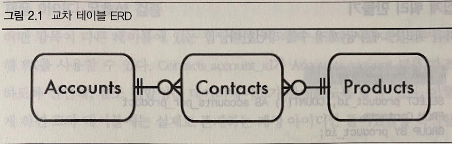

# 지옥 스터디 - 02 무단횡단
- 개발자들은 보통 다대다 관계를 위한 교차테이블을 피하기 위해 **쉼표로 구분된 목록 (Comma Separated list)** 를 사용한다.
- 이 안티패턴을 무단 횡단이라고 부른다.
- 무단횡단 혹은 교차로를 피하는 행위이기 때문

## 안티퍄턴 : 쉼표로 구분된 목록에 저장

```sql
CREATE TABLE Products (
    product_id SERIAL PRIMARY KEY,
    product_name VARCHAR (1000),
    account_id VARCHAR (100), -- 쉼표로 구분된 목록
);
```
- 제품의 담당자가 여러명 일수도 있기 때문에 제품과 계정의 관계에서 다대일/일대다 관계도 지원해야 한다.
- 데이터베이스 구조 변경을 최소화 하기 위해 account_id 칼럼에 여러 계정 아이디를 쉼표로 구분해 나열한다.
- 단지 하나의컬럼의 데이터 타입만을 변경했을 뿐이기에 성공한 것 처럼 보인다.

### 특정 계정에 대한 제품 조회
- 모든 FK 가 **하나의 필드에 결합** 되어 있다면 쿼리가 어려워진다.
- 같은지 (=) 비교를 더이상할 수 없으며, 패턴 매칭을 사용해야 한다.
- MySQL 기준 위 스키마 대로라면 아래와 같은 쿼리를 사용할 수 있다.

```sql
SELECT * FROM Products WHERE account_id REGEXP '[[:<:]]12[[:>:]]';
```
- 12 라는 계정이 담당자인 제품을 검색하는 쿼리이다.
- 패턴 매칭을 사용하면 잘못된 결과가 나올 수 있고, 인덱스도 제대로 활용하지 못한다.
- 또한 데이터베이스 벤더에 종속적인 문법을 사용할 수 밖에 없다.

### 주어진 제품에 대한 계정 정보 조회
- 쉼표로 구분된 목록을 참조하는 테이블의 행과 조인하기도 불편하고 비용도 많이들게 된다.

```sql
SELECT * FROM Products AS p JOIN Accounts AS a 
ON p.account_id = REGEXP '[[:<:]]' || a.account_id || '[[:>:]]'
WHERE p.product_id = 123;
```
- 이런 표현식을 사용하 조인하면 인덱스를 사용할 수 없다.
- 두 테이블을 모두 읽어 카테시안 곱을 생성한 뒤 모든 행에 대해 정규 표현식을 평가해야만 한다.

### 집계 쿼리 만들기
- 집계 쿼리는 COUNT(), SUM(), AVG() 와 같은 함수를 사용한다.
- 이런 함수는 **행의 그룹** 에 대해 사용하도록 설계되었지, 쉼표로 구분된 목록에 대해 사용하도록 설계된 것이 아니다.
- 때문에 다음과 같이 기교를 사용해 처리해야 한다.

```sql
SELECT product_id, LENGTH(account_id) - LENGTH(REPLACE(account_id), ',', '') + 1 AS contacts_per_product
FROM Producdts;
```
- 이런 기교는 교묘하지만 명확하지 않으며 디버깅 하기도 어렵다.

### 특정 제품에 대한 계정 갱신
- 목록의 마지막에 문자열 결합을 통해 새로운 아이디를 추가할 수는 있지만, 목록이 정렬된 상태로 유지되지 않는다.

```sql
UPDATE Products
SET account_id = account_id || ',' || 56
WHERE product_id = 123;
```

### 제품 아이디 유효성 검증
- 사용자가 banana와 같은 유효하지 않은 항목을 입력하는 것을 어떻게 방지할 수 있을까 ?
- 사용자들은 해당 값을 입력하는 방법을 찾아낼 것이고, 데이터베이스에는 에러가 발생하진 않지만, 데이터는 의미없는 것이 될 것이다.

### 구분자 문자 선택
- 정수 목록 대신 문자열 목록을 저장하는 경우 목록의 일부 항목이 구분자 문자를 포함할 수 있다.
- 이를 쉼표를 사용하면 모호해 질 수 있다.
- 구분자로 다른 문자를 사용할 수도 있지만, 이 구분자가 **항목에 절대 나오지 않는다고 단언할 수 있는가 ?**

### 목록 길이 제한
- VARCHAR(30) 에 얼마나 많은 항목을 저장할 수 있을까 ?
- 각 항목의 길에아 따라 다르게 된다.
- 각 항목의 길이가 2라면 10개를.. 6이라면 4개를 저장할 수 있다.
- VARCHAR(30) 에 미래에 필요한 가장 긴 목록을 지원할 수 있는지 예측이 가능한가 ?
- 얼마나 길게 해야 충분한가 ? 길이에 대한 제한을 설명해보길 바란다.

## 안티패턴 인식 방법
- 프로젝트 팀에서 다음과 같은 말이 나온다면 무단횡단 안티패턴이 사용되고 있음을 암시한다.
1. 이 모곡이 지원해야하는 최대 항목 수는 얼마나 될까 ?
   - VARCHAR 의 길이를 선정할때..
2. SQL 에서 단어의 경계를 어떻게 알아내는지 알아 ?
   - 정규 표현식을 사용해 일부를 찾아낸다면 별도로 저장해야함을 암시..
3. 이 목록에서 절대 나오지 않을 문자가 어떤게 있을까 ?
   - 어떤 구분자를 쓰든 해당 문자는 언젠가는 나올것이라 예상해야 한다.

## 안티패턴 사용이 합당한 경우
- 어떤 종료의 쿼리는 **반정규화 (denormalization)** 를 적용해 성능을 향상시킬 수 있다.
- 쉼표 구분자도 반정규화의 예이다.
- 목록안의 개별 값을 분리할 필요가 없다면 안티패턴을 사용할 수 있다.
- 반정규화 사용을 결정할 때는 **보수적** 이어야 한다.
- 데이터베이스 정규화가 먼저이다.
- 정규화는 애플리케이션 코드를 좀더 융통성 있게 하고, 데이터베이스 정합성을 유지할 수 있게 한다.

## 해법 : 교차 테이블 생성
- account_id 를 Products 테이블이 아닌 별도 테이블에 저장하는 것이 좋다.
- 다음 테이블은 Products 와 Accounts 사이의 다대다를 구현한다.

```sql
CREATE TABLE Contacts (
    product_id BIGINT NOT NULL,
    account_id BIGINT NOT NULL,
    PRIMARY KEY (product_id, account_id),
    FOREIGN KEY (product_id) REFERENCES  Products(product_id),
    FOREIGN KEY (account_id) REFERENCES  Accounts(account_id)
);
```
- 어떤 테이블이 FK 로 두 테이블을 참조할 때 이를  **교차 테이블** 이라고 한다.
- 이는 두 테이블 사이의 다대다 관계를 구현한다.



### 계정으로 제품 조회하기와 제품으로 계정 조회하기
- 주어진 계정에 대한 모든 제품의 속성을 조회하기 위해 Products 테이블과 Contacts 테이블을 조인하면 된다.

```sql
SELECT p.*
FROM Products AS p JOIN Contacts AS c
ON p.product_id = c.product_id
WHERE c.account_id = 34;
```
- 조인을 포함한 쿼리에 대해 성능이 나쁘다고 생각하는 사람들도 있다.
- 하지만 이 쿼리는 안티패턴에서 살펴본 쿼리보다 인덱스를 훨씬 잘 사용한다.
- 읽기도 쉽고 최적화 하기도 쉽다.
- 난해한 정규표현식을 사용하는 대신 조인을 통한 효율적인 인덱스를 사용한다.

### 집계 쿼리 만들기
- 다음 쿼리는 제품당 계정 수를 리턴한다.

```sql
SELECT product_id, COUNT(*) AS accounts_per_product
FROM Contacts
GROUP BY product_id;
```
- 계정당 제품 수를 구하는 것도 간단하다.

```sql
SELECT account_id, COUNT(*) AS products_per_account
FROM Contacts
GROUP BY account_id;
```

### 특정 제품에 대한 계정 갱신
- 목록에 항목을 추가/삭제 하는것은 교차테이블에 행을 삽입/삭제하는 것으로 할 수 있다.

### 제품 아이디 유효성 검증
- 어떤 항목이 다른 테이블에 있는 합당한 값에 대해 유효한지를 확인하기 위해 FK 를 사용할 수 있다.
- 참조 정합성을 데이터베이스가 강제하도록 할 수 있다.
- 실제 존재하는 계정 아이디만 들어있음을 확신할 수 있다.
- SQL 데이터 타입을 이용해 제한도 가능하다.

### 구분자 문자 선택
- 각 항목을 행으로 관리하므로 구분자를 사용하지 않는다.

### 목록 길이 제한
- 별도 행으로 관리하므로 한 테이블에 물리적으로 저장가능한 행 수에만 제한을 받는다.
- 항목 수를 제한해야 한다면 애플리케이션에 항목 수를 세어 이 정책을 강제해야 한다.

### 교차 테이블의 다른 장점
- 인덱스를 활용하면 성능이 좋아진다.
- FK 선언시 많은 데이터베이스가 내부적으로 인덱스를 생성한다.
- 교차 티에블에 컬럼을 추가해 각 항목에 축적인 속성을 넣을수도 있다.
- 날짜 혹은 주 담당자.. 부담당자 등등..
- 쉼표로 구분된 목록에서는 이런 것들을 할 수 없다.