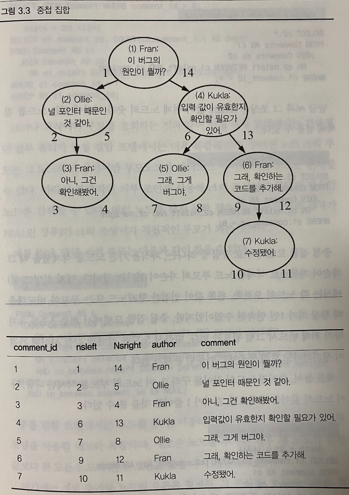
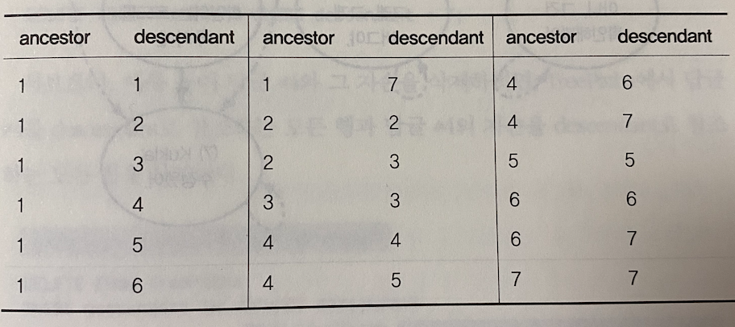
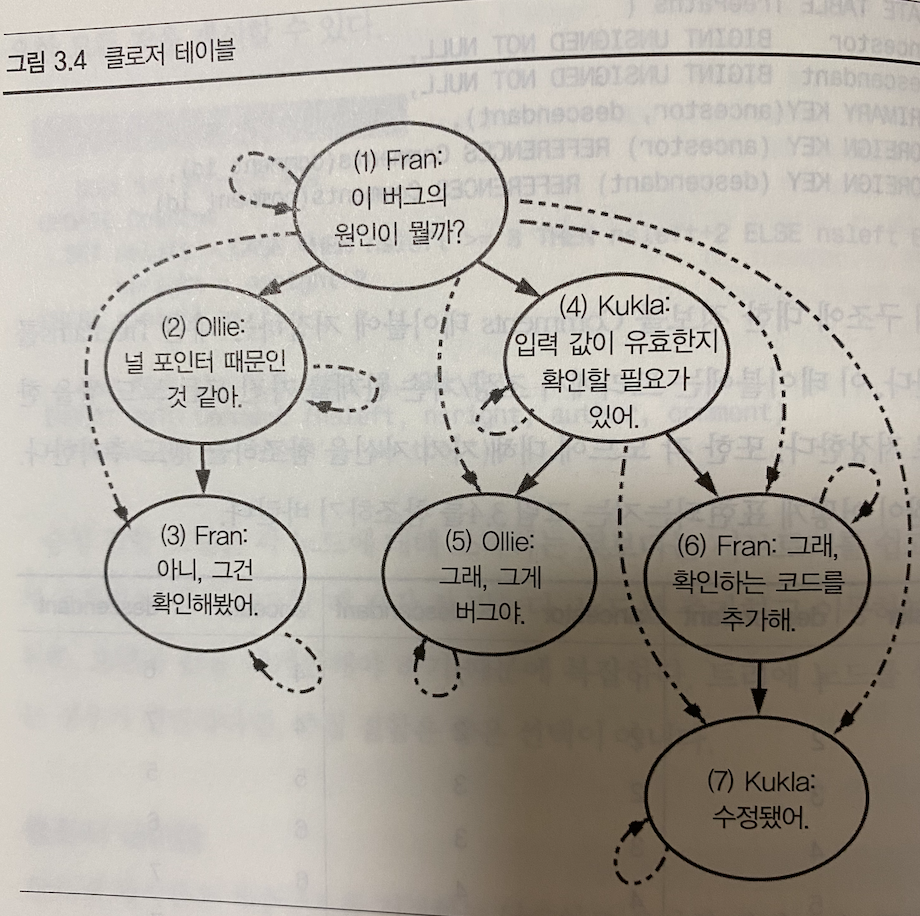

# 지옥 스터디 - 03 순진한 트리
- 독자들이 답글을 달 수 있고, 답글에 대한 답글을 달 수 있는 웹사이트를 개발한다고 가정해보자.
- 이런 답글 타래를 추적하기 위해 각 답글은, 답글을 다는 대상 글에 대한 참조를 가지도록하는 단순한 해법을 선택했음.

```sql
CREATE TABLE Comments (
    comment_id SERIAL PRIMARY KEY,
    parent_id BIGINT,
    comment TEXT NOT NULL,
    FOREIGN KEY (parent_id) REFERENCES  Comments (comment_id)
);
```
- 하지만 답글의 긴 타래를 하나의 SQL 로 불러오기가 힘들어진다.
- 글타래는 깊이가 무제한이기 때문에 모든 답글을 얻기 위해 수많은 SQL 을 실행해야 한다.
- 트리 알고리즘을 사용하는 방식을 채택할수도 있겠지만, 하루에 수십개 글이 올라오고 수백개의 답글이 달린다.
- 매번 수백만개의 답글을 정렬하는것은 비현실적이기에 더 좋은 방법이 있어야 한다.

## 목표 : 계층구조 저장 및 조회
- 데이터가 재귀적인 관계를 가지는 것은 흔한 일이다.
- 트리 데이터 구조에서 각 항목은 **노드** 라고 불리고, 노드는 여러 자식을 가지며 부모를 가지고 있다.
- 부모가 없는 최상위 노드는 **뿌리 (root)** 라고 한다.
- 가장 아래에 있는 자식이 없는 노드를 **종말 노드 (leaf)** 라고 한다.
- 트리 데이터구조를 가지는 예는 다음과 같은 것들이 있다.
  - 조직도
  - 글타래

## 안티패턴 : 항상 부모에 의존하기
- 책이나 글에서 흔히 설명하는 **초보적인 방법** 은 parent_id 컬럼을 사용하는 것이다.
- 이는 같은 테이블 안의 다른 글을 참조하며 이 관계를 강제하기 위해 FK 제약조건을 걸 수 있다.

```sql
CREATE TABLE Comments (
    comment_id SERIAL PRIMARY KEY,
    parent_id BIGINT,
    bug_id BIGINT,
    author BIGINT,
    author BIGINT,
    comment_date DATETIME,
    comment TEXT NOT NULL,
    FOREIGN KEY (parent_id) REFERENCES  Comments (comment_id),
    FOREIGN KEY (bug_id) REFERENCES  Bugs (bug_id),
    FOREIGN KEY (author) REFERENCES  Accounts (account_id)
);
```
- 이와 같은 설계는 **인접 목록 (Adjacency List)** 이라 불린다.
- 계층적 데이터를 저장하는데 사용하는 가장 흔한 설계이다.

### 인접 목록에서 트리 조회하기
- 인접 목록은 많은 개발자들이 기본으로 선택하는 방법이지만, 트리에서 필요한 가장흔한 작업중 하나인 **모든 자식 조회하기** 를 제대로 수행하지 못한다면 안티패턴이 될 수 있다.

```sql
SELECT c1.*, c2.*
FROM Comments c1 LEFT OUTER JOIN Comments c2
ON c2.parent_id = c1.comment_id;
```
- 답글과 답글의 자식은 위 쿼리로 손쉽게 얻을 수 있지만. 이 방식은 단지 **두 단계만 조회** 한다
- 트리는 깊이가 무한정 확장이 가능하기 때문에 단계 상관없이 자식들을 조회할 수 있어야 한다.
- COUNT() 로 답글수를 계산한다거나 하는 쿼리들을 구할 수 있어야하는데, 인접목록을 사용한다면 이런 쿼리들이 이상해진다.
- SQL 특징상 조인의 회수가 미리 고정되어야 하기 때문에 이미 **쿼리에서 깊이가 결정** 되어 버린다.

### 인접 목록에서 트리 유지하기
- 인접 목록에서 새로운 노드를 추가하는 것과 같은 일부 연산은 간단해진다.

```sql
INSERT INTO Comments (bug_id, parent_id, author, comment)
VALUES (1234, 7, 'Kukla', 'Thanks!');
```
- 노드 하나 혹은 서브 트리를 이동하는 것 또한 간단하다.

```sql
UPDATE Comments SET parent_id = 3 WHERE comment_id = 6;
```
- 트리에서 노드를 삭제하는 것은 좀 더 복잡한데, 서브 트리 전체를 삭제하기 위해서는 FK 제약조건을 만족하기 위해 여러 쿼리를 날려 모든 자손을 찾은 뒤 차례대로 삭제해야한다.
- 인접목록 모델을 사용할 경우를 살펴보았는데, 상당히 많은 코드를 작성해야만 한다.
- 이런 작업은 데이터베이스 단계에서 좀 더 단순하고 효율적으로 처리가 가능해야 한다.

## 안티패턴 인식 방법
- 다음과 같은 말을 듣는다면 순진한 트리 안티패턴이 사용되고 있음을 암시한다.
1. 트리에서 얼마나 깊이를 지원해야하나 ?
2. 트리 데이터 구조를 관리하는 코드는 건드리기 겁난다.
3. 트리에서 고아 노드를 정리하기 위해 주기적으로 스크립트를 돌려야 한다.

## 안티패턴 사용이 합당한 경우
- 인접 목록 모델이 애플리케이션에서 필요한 작업을 처리하는데 적당한 경우도 있다.
- 인접 목록의 강점은 주어진 노드의 부모/자식을 바로 얻을 수 있으며 새로운 코드를 추가하기도 쉽다는 점이다.
- 계층적 데이터를 처리하는데 이정도 수준으로도 충분하다면 이는 적절한 방법이다.

> 베스트 프렉티스만을 생각하고 너무 복잡하게 만들지 말아야 한다.

## 해법 : 대안 트리 모델 사용
- 계층적 데이터를 저장하는 방법은 인접 목록 모델 외에도 **경로 열거 (Path Enumeration)**, **중첩 집합 (Nested Sets)**, **클로저 테이블 (Closure Table)** 과 같은 대안이 있다.
- 이 방법들은 인접 목록에서 어렵거나 복잡했던 조작을 쉽게 해준다.

### 경로 열거
- 인접 목록의 약점 중 하나는 **트리에서 주어진 노드의 조상들을 얻는 데 비용이 크다** 는 점이다.
- 경로 열거 방법에서는 **일련의 조상을 각 노드의 속성으로 저장해 해결** 한다.
- 디렉터리 구조에서 흔히 볼 수 있는 구조이다.

```sql
CREATE TABLE Comments (
    comment_id SERIAL PRIMARY KEY,
    path VARCHAR(1000),
    bug_id BIGINT,
    author BIGINT,
    author BIGINT,
    comment_date DATETIME,
    comment TEXT NOT NULL,
    FOREIGN KEY (parent_id) REFERENCES  Comments (comment_id),
    FOREIGN KEY (bug_id) REFERENCES  Bugs (bug_id),
    FOREIGN KEY (author) REFERENCES  Accounts (account_id)
);
```
- parent_id 대신 path 컬럼을 정의하고, 마치 디렉터리 구조처럼 꼭대기부터 현재행 까지 모두 나열한다.
- ex) 1/2/3/
- 경로 패턴을 비교해 조회하는 방식을 사용한다.
- 경로가 1/4/6/7 인 답글 #7의 조상을 찾는다면 다음과 같이 할 수 있다.

```sql
SELECT *
FROM Comments AS c
WHERE '1/4/6/7/' LIKE cpath || '%';
```
- LIKE 인수를 반대로 하면 자식을 구할 수 있다.

```sql
SELECT *
FROM Comments AS c
WHERE c.path LIKE '1/4/' || '%';
```
- SUM() 을 계산한다거나 답글 #4에서 시작하는 서브트리에서 글쓴이당 답글수를 세는 쿼리는 다음과 같이 처리가 가능하다.

```sql
SELECT COUNT(*)
FROM Comments AS c
WHERE c.path LIKE '1/4/' || '%'
GROUP BY c.author;
```
- 새로운 노드를 삽입하는 방법은 인접 목록 모델과 유사하다.
- 다른 노드를 수정하지 않아도 종단이 아닌 노드를 삽입할 수 있다.

```sql
INSERT INTO Comments (author, comment) VALUES ('Ollie', 'Good job!');

UPDATE Comments
SET path = (SELECT path FROM Comments WHERE comment_id = 7 || LAST_INSERT_ID() || '/')
WHERE comment_id = LAST_INSERT_ID();
```
- 이 방식은, 경로 문자열을 유지하는것 자체가 애플리케잇연 코드에 종속되며, 검증 비용도 상당하다.
- VARCHAR 컬럼의 길이를 아무리 길에 잡아도 결국 제한이 존재하기 때문에 지원가능한 트리의 깊이도 제한된다.

### 중첩 집합
- 중첩 집합은 각 노드가 부모를 저장하는 대신, 자기 자손의 지합에 대한 정보를 저장한다.

```sql
CREATE TABLE Comments (
    comment_id SERIAL PRIMARY KEY,
    nsleft INTEGER NOT NULL,
    nsright INTEGER NOT NULL,
    bug_id BIGINT,
    author BIGINT,
    author BIGINT,
    comment_date DATETIME,
    comment TEXT NOT NULL,
    FOREIGN KEY (parent_id) REFERENCES  Comments (comment_id),
    FOREIGN KEY (bug_id) REFERENCES  Bugs (bug_id),
    FOREIGN KEY (author) REFERENCES  Accounts (account_id)
);
```
- 각 노드의 nsleft 와 nsright 수는 다음과 같이 주어진다.
- `nsleft` 는 모든 자식 노드의 nsleft 보다 작아야한다.
- `nsright` 는 모든 자식의 nsright 보다 커야 한다.
  - TREE 노드를 DB 에 저장하는 형태. 
- 각 노드에 이 값을 할당하면 이를 이용해 주어진 노드의 조상이나 자손을 찾을 수 있다.


- 답글 #6 과 그 조상은 nsright 값이 현재 노드의 숫자 사이에 있는 노드를 검색해 얻을 수 있다.

```sql
SELECT c2.*
FROM Comments AS c1
JOIN Comments as c2
ON c2.nsleft BETWEEN c1.nsleft AND c1.nsright
WHERE c1.comment_id = 4;
```
- 중첩 집합 모델의 강점은, **자식을 가진 노드를 삭제 했을때 그 자손이 자동으로 삭제된 노드 부모의 자손이 된다** 는 것이다.
- 노드를 삭제해 값들 사이에 간격이 생기더라도 트리 구조에는 아무런 문제가 없다.
- 하지만 자식이나 부모를 조회하는것과 같은 인접 모델에서 간단했던 일부 쿼리가 중첩 모델에선느 더욱 복잡해 진다.
- 답글 #6 의 부모는 다음과 같이 찾을 수 있다.

```sql
SELECT parent.*
FROM Comemnt AS c
JOIN Comment AS parent
ON c.nsleft BETWEEN parent.nsleft AND parent.nsright
LEFT OUTER JOIN Comment AS in_between
ON c.nsleft BETWEEN in_between.nsleft AND in_between.nsright
AND in_between nsleft BETWEEN parent.nsleft AND parent.nsright
WHERE c.comment_id = 6
AND in_between.comment_id IS NULL;
```
- 중첩 집합 모델에서는 노드 추가/이동이 복잡해진다.
- 새로운 노드를 추가하는 경우, 새 노드의 왼쪽/오른쪽 값을 계산해야 한다.
  - 새로 추가한 노드의 오른쪽 형제들, 조상들, 조상의 오른쪽 형제들 등이 포함된다.
- 새로 추가하는 노드가 리프노드인 경우 다음과 같은 방식으로 처리가 가능하다.

```sql
-- NS값 8과 9사이에 공간 확보
UPDATE Comment
SET nsleft = CASE WHEN nsleft >= 8 THEN nsleft + 2 ELSE nsleft END, nsright = nsright + 2
WHERE nsright >= 7;

INSERT INTO Comment (nsleft, nsright, author, comment)
VALUES (8, 9 ,'Fran', 'Me too!');
```
- 중첩 집합 모델은 각 노드 조작보단 **서브 트리를 쉽고 빠르게 조회하는 것이 중요** 할때 좋다.
- 트리에 노드를 빈번하게 삽입해야 한다면 적절하지 않다.

### 클로저 테이블
- 클로저 테이블은 계층구조를 저장하는 단순하고 우아한 방법이다.
- 부모-자식 관계 뿐 아닌 **트리의 모든 경로를 저장** 한다.

```sql
CREATE TABLE Comments (
    comment_id SERIAL PRIMARY KEY,
    bug_id BIGINT,
    author BIGINT,
    author BIGINT,
    comment_date DATETIME,
    comment TEXT NOT NULL,
    FOREIGN KEY (parent_id) REFERENCES  Comments (comment_id),
    FOREIGN KEY (bug_id) REFERENCES  Bugs (bug_id),
    FOREIGN KEY (author) REFERENCES  Accounts (account_id)
);

CREATE TABLE TreePaths(
    ancestor BIGINT UNSIGNED NOT NULL,
    descendant BIGINT UNSIGNED NOT NULL,
    PRIMARY KEY (ancestor, descedant),
    FOREIGN KEY (ancestor) REFERENCES  Comments (comment_id),
    FOREIGN KEY (descendant) REFERENCES  Comments (comment_id)
);
```
- 트리구조에 대한 정보를 Comments 테이블 대신 TreePaths 테이블에 저장한다.
- 트리에서 조상/자식 관계를 가진 모든 노드 쌍을 한 행으로 저장함.
- 각 노드에 대해 자기 자신을 참조하는 행도 추가한다.


- 조상이나 자손을 가져오는 쿼리는 중첩 집합에 비해 매우 직관적이다.
- 답글 #4 의 자손을 가져오려면 `ancestor` 가 4인 행을 조회하면 된다.

```sql
SELECT c.*
FROM Comments AS c
JOIN TreePaths AS t ON c.comment_id = t.descendant
WHERE t.ancestor = 4;
```

- 답글 #6 의 조상을 얻으려면 descendant 가 6인 행을 가져오면 된다.



- 답글 #5 에 새로운 자식을 추가하려면, 먼저 자기 자신을 참조하는 행을 추가하고, #5 를 descendant 로 참조하는 ㅗ든 행을 복사해 descendant 를 새로운 답글 아이디로 변경한다.

```sql
INSERT INTO TreePaths(ancestor, descendant)
SEELCT t.ancestor, 8
FROM TreePaths AS t
WHERE t.descendant = 5
UNION ALL
SELECT 8, 8;
```
- 답글 #7 (리프노드) 를 삭제할때는 #7 을 descendant 로 참조하는 모든 행을 삭제한다.

```sql
DELETE FROM TreePaths WHERE descendant = 7;
```
- 서브트리 답글 #4 와 자식을 삭제하려면, #4 를 descendant 로 참조하는 모든 행과 답글 #4 자손을 descendant 로 참조하는 모든행을 삭제한다.

```sql
DELETE FROM TreePaths
WHERE descendant IN (SELECT descendant FROM TreePaths WHERE ancestor = 4);
```
- 서브 트리를 다른 위치로 이동하려면, 서브트리의 최상위 노드와 그 노드의 자손들을 참조하는 행을 삭제해 서브트리와 조상의 연결을 먼저 끊는다.
- 답글 #6을 답글 #3의 자식으로 옮긴다면 다음과 같이 처리해야 한다. (#6 자신의 참조는 삭제하지 않도록 주의)

```sql
DELETE FROM TreePahts
WHERE descendant IN (SELECT descendant FROM TreePaths WHERE ancestor = 6)
AND ancestor IN (SELECT ancestor FROM TreePaths WHERE descendant = 6 AND ancestor != descendant);
```
- 이후 새로운 위치의 조상과 서브  트리의 자손들에 해당하는 행을 추가해 서브트리를 붙여야 한다.
  - CROSS JOIN 을 사용해 새 위치 조상과 서브트리의 모든 노드를 대응하는데 필요한 행을 만들수 있음.

```sql
INSERT INTO TreePaths (ancestor, descendant)
SELECT supertree.ancestor, subtree.descendant
FROM TreePaths supertree
CROSS JOIN TreePaths AS subtree
WHERE supertree.descendant = 3
AND subtree.ancestor = 6;
```
- 크로스 조인은 서브 트리가 높은 단계 혹은 낮은 단계로 이동하더라도 필요한 모든 경로를 생성해 준다.
- 클로저 테이블 모델은 중첩 집합모델 보다 직관적이다.
- 계층구조 정보를 유지하기가 쉽다.

### 어떤 모델을 사용해야 하는가 ?
- 각 모델은 장단점이 있기에 어떤 모델을 사용할때 가장효율적인지를 고민해 보아야한다.
- **인접 목록** 은 가장 흔히 사용되며 많은 개발자가 알고 있다.
- **경로 열거** 는 브레드 크럼을 사용자 인터페이스로 보여줄때좋지만 참조 정합성을 강제하지 못하며 정보를 중복저장하기 때문에 깨지기 쉬운 구조이다.
- **중첩 집합** 은 영리한 방법이지만 지나친것 일수도 있다. 참조 정합성을 지원하지는 못하지만 트리를 수정할일이 거의없고 조회를 많이 하는 경우 적합하다.
- **클로저 테이블** 은 가장 융통성 있는 모델이고 한 노드가 여러 트리에 속하는 것을 허용하는 유일한 모델이다.
  - 계산을 줄이는 대신 저장 공간을 많이 사용하는 트레이드 ㅇ프가 발생한다.

## 계층적 데이터 모델 비교

| 모델 | 테이블 수 | 자식 조회 | 트리 조회 | 삽입 | 삭제 | 참조 정합성 |
| --- | --- | --- | --- | --- | --- | --- |
| 인접 목록 | 1 | 쉽다 | 어렵다 | 쉽다 | 쉽다 | 가능 |
| 재귀적 쿼리 | 1 | 쉽다 | 쉽다 | 쉽다 | 쉽다 | 가능 |
| 경로 열거 | 1 | 쉽다 | 쉽다 | 쉽다 | 쉽다 | 불가능 |
| 중첩 집합 | 1 | 어렵다 | 쉽다 | 어렵다 | 어렵다 | 불가능 |
| 클로저 테이블 | 2 | 쉽다 | 쉽다 | 쉽다 | 가능 |

