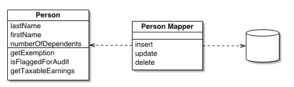

# 지옥 스터디 - 06 엔티티 속성 값
- 날짜별 행 수를 어떻게 해야 하는가 ?

```sql
SELECT date_reported, COUNT(*)
FROM Bugs
GROUP BY date_reported;
```
- 위 답에는 두 개의 가정이 숨어있다.
  - 값이 Bugs.date_reported 와 같이 한 칼럼에 저장된다.
  - 값을 서로 비교할 수 있어 GROUP BY 에서 같은 값끼리 모을 수 있다.
- 이런 가정이 맞지 않는다면 어떻게 될까 ?
- 엔티티-속성-값 이라는 안티패턴을 사용하는 경우 이런 문제에 봉착할 수 있다.

## 목표 : 가변 속성 지원
- 소프트웨어 프로젝트에서 **확장성** 은 중요한 목표
- 미래에서도 새로운 요구사항을 유동적으로 수용할 수 있도록 소프트웨어를 설계하는 것이다.
- 관계형 데이터베이스에서 **메타데이터의 비유연성** 에 대한 논란은 관계형 모델이 처음 제안된 1970년대 부터 지속되었다.
- 일반적인 테이블은 테이블에 있는 모든 행과 관계된 **속성 컬럼** 으로 이뤄져있으며 각 행은 비슷한 객체의 인스턴스를 나타낸다.
  - 속성 집합이 다르다면 객체의 타입도 다르다는 의미이며, 다른 테이블에 있어야 한다.
- 하지만 객체지향 프로그래밍 모델에서는 동일한 데이터 타입을 확장하는 것과 같은 방법으로도 객체의 타입도 관계를 가질 수 있다.
- 객체지향 설계에서 이런 객체들은 서브타입 인스턴스/베이스타입 인스턴스로 간주할 수도 있다.
- 여러 객체의 계산이나 비교를 간단히 하기 위해 객체를 하나의 데이터베이스 테이블에 행으로 저장하고 싶다.
- 객체의 각 서브타입이 베이스 타입이나 다른 서브타입에는 적용되지 않는 속성 칼럼을 저장하는 것도 허용해야 한다.

`버그 데이터베이스의 예`


- Bug 와 FeatureRequest 는 베이스 타입인 Issue 속성을 공통으로 가진다.
- 모든 이슈는 이슈를 보고한 사람과 관계가 있다.
- 이슈는 제품과 관계를 갖고 있고, 우선순위를 갖는다.
- 하지만 Bug 는 버그가 발생한 제품의 버전, 중요도와 같은 다른 속성을 갖는다. FeatureRequest 도 동일하다.

## 안티패턴 : 범용 속성 테이블 사용


- 가변 속성을 지원해야하는 경우 별도 테이블을 생성해 속성을 행으로 저장하는 것이다.
- 이 테이블의 각 행은 세 개의 칼럼을 갖고 있다.
- 엔터티 : 하나의 엔터티에 대해 하나의 행을 가지는 부모 테이블에 대한 FK
- 속성 : 일반적인 테이블에서 칼럼 이름을 나타내지만 새로운 설계에서는 각 행마다 속성이 하나씩 들어간다.
- 값 : 모든 엔터티는 각 속성에 대한 값을 가진다.
  - PK 가 1234 인 버그라면 status 라는 속성을 가지고 그 값은 NEW 이다.
- 이 설계는 엔터티-속성-값 (Entity-Attribute-Value) 를 줄여 EAV 라고 불린다.
  - 오픈 스키마, 스키마리스 또는 이름-값 쌍 이라 불리기도 함.

```sql
CREATE TABLE Issues (
    issue_id SERIAL PRIMARY KEY
);
CREATE TABLE IssueAttributes (
    issue_id BIGINT NOT NULL,
    attr_name VARCHAR(100) NOT NULL,
    attr_value VARCHAR(100) NOT NULL,
    PRIMARY KEY (issue_id, attr_name),
    FOREIGN KEY (issue_id) REFERENCES Issues(issue_id)
);

INSERT INTO (issue_id) VALUES (1234);
INSERT INTO IssueAttributes (issue_id, attr_name, attr_value)
VALUES (1234, 'product', '1'),
(1234, 'date_reported', '2009-06-01'),
(1234, 'status', 'NEW');
```
- 별도 테이블을 추가해 다음과 같은 이득을 얻은 것 처럼 보인다.
  - 두 테이블 모두 적은 컬럼을 가지고 있다.
  - 새로운 속성을 지원하기 위해 칼럼 수를 늘릴 필요가 없다.
  - 특정 속성이 해당 행에 적용되지 않은 경우 NULL 을 채워야하는 칼럼이 지저분하게 생기는 것을 피할 수 있다.
- 개선된 설계 처럼 보이지만 사용하기 어렵다.

> 전 회사에서 사용하던 안티패턴.... 유지보수 정말 힘듬

### 속성 조회
- 매일 보고된 버그 리포트를 필요로 한다고 가정
- 일반적인 테이블 설계에서는 Issue 테이블이 date_reported 와 같은 간단한 속성을 가질 것이다.

```sql
SELECT issue_id, date_reported FROM Issues;
```
- EAV 설계를 사용할 때 위 쿼리와 동일한 정보를 얻으려면, IssueAttributes 테이블에서 문자열로 date_reported 라는 속성을 가진 행을 꺼내야만 한다.

```sql
SELECT issue_id, attr_value AS 'date_reported'
FROM IssueAttributes
WHERE attr_name = 'date_reported';
```

### 데이터 정합성 지원
- EAV 를 사용하면 일반적인 데이터베이스 설계를 사용할 때 얻을 수 있는 여러가지 장점을 희생해야 한다.

`필수 속성 사용 불가`
- 리포트를 제대로 생성하려면 date_reported 속성이 값을 가지고 있어야 한다.
- 일반적인 설계라면 NOT NULL 제약조건을 이용해 이를 강제할 수 있다.
- EAV 설계에서는 각 속성이 행으로 대응된다.
- 각 issue_id 값에 대해 행이 존재하는지, 행의 attr_name 칼럼이 date_reported 라는 문자열을 가지고 있는지 제약조건이 필요하다.
- SQL 에서는 이런 제약조건은 수행할 수 없다.
- 이를 강제하는 애플리케이션 코드를 작성해야 한다.
- 또한 **잠재적인 버그** 를 가지고 있다.

`SQL 데이터 타입 사용 불가`
- 사람들이 날짜를 다른 형식으로 입력하거나, 날짜가 아닌 문자열을 입력했다면 리포트 생성시 문제가 발생할 수 있다.
- 일반적인 설계라면 DATE 타입으로 선언해 이를 방지할 수 있다.

```sql
INSERT INTO IssueAttributes (issue_id, attr_name, attr_value)
VALUES (1234, 'date_reported', 'banana'); -- ????
```
- 사용자 정의 데이터 타입이나 도메인을 지원하려면 더 많은 칼럼을 추가해야 한다.

`참조 정합성 강제 불가`
- FK 를 이용한 참조 정합성을 사용할 수 없다.
- 이런 제약 조건은 테이블의 모든 행에 적용된다.

`속성 이름 강제 불가`
- 속성 이름이 일관적이지 않다.
- 어떤 버그는 date_reported 를, 어떤 버그는 reported_date 를 사용한다면 날짜별 버그 수는 어떻게 셀수 있는가 ?
- 날짜를 다른 이름의 속성으로 저장한 버그가 없다는걸 어떻게 알 수 있는가 ?...

### 행을 재구성 하기
- Issue 테이블의 모든 행과 그행의 속성 칼럼을 조회하고 싶다면 다음과 같이 쿼리해 **행을 재구성** 해야 한다.

```sql
SELECT i.issue_id,
i1.attr_value AS 'date_reported',
i2.attr_value AS 'status',
i3.attr_value AS 'priority',
i4.attr_value AS 'description'
FROM Issues AS i 
LEFT OUTER JOIN IssueAttributes AS i1
    ON i.issue_id = i1.issue_id AND i1.attr_name = 'date_reported'
LEFT OUTER JOIN IssueAttributes AS i2
    ON i.issue_id = i2.issue_id AND i2.attr_name = 'status'
    .....
```
- 속성 개수가 늘어날 수록 조인회수도 늘어나고 쿼리 비용은 지수적으로 증가하게 된다.

## 안티패턴 인식 방법
- 다음과 같은 말을 하는 사람이 있다면 누군가 EAV 안티패턴을 사용하고 있다는 의미이다.
  - 이 데이터베이스는 메타데이터 변경 없이 확장이 가능하다.
  - 하나의 쿼리에서 조인을 최대 몇번할 수 있지 ?
  - 우리 플랫폼에서는 리포트를 어떻게 생성해야 할지 이해할 수 없다.

## 안티패턴 사용이 합당한 경우
- 관계형 데이터베이스에서 EAV 안티패턴 사용을 합리화 하긴 어렵다.
- 관계형 패러다임의 강점을 나타내는 기능 중 많은 부분을 포기해야 하기 때문..
- 대부분의 애플리케이션에서 동적 속성이 정말 필욯나 곳은 단지 테이블 두 세개 또는 하나 정도이다.
- EAV 사용의 위험과 이에 따른 부가 작업을 충분히 고려해 꼭 필욯나 곳에서만 사용한다면 나쁘다고만 할 순 없다.
- 하지만 EAV 를 사용하는 시스템은 1년 이내에 다루기가 매우 어려워질것이다.
- 비관계형이 필요하다면 가장 좋은 방법은 비관계형 기술을 사용하는 것이다.

## 해법 : 서브타입 모델링
- EAV 를 사용하지 않고 저장하는 몇 가지 방법이 있다.
- 서브 타입의 수에 제한이 있고 각 서브타입의 속성을 알고 있다면 대부분의 방법이 잘 들어 맞는다.
- 어떤 방법이 최적인가는 데이터를 어떻게 조회하느냐에 따라 다르기에 경우에 맞게 올바른 설계를 해야 한다.

### 단일 테이블 상속 (Single Table Inheritance)
- 가장 단순한 설계 방식
- 관련된 모든 타입을 하나의 테이블에 저장하고, 각 타입에 있는 모든 속성을 칼럼으로 짖어하게 한다.
- 속성 하나는 서브 타입을 나타내는데 사용하는 것이다.

```sql
CREATE TABLE Issues (
    issue_id SERIAL PRIMARY KEY,
    reported_by BIGINT NOT NULL,
    product_id VARCHAR(20),
    version_resolved VARCHAR(20),
    status VARCHAR(20),
    issue_type VARCHAR(10)
    ....
);
```
- 새로운 객체 타입이 생기면, 데이터베이스는 새로 생긴 객체 타입의 속성을 수용해야 한다.
- 새로운 객체에만 있는 속성에 대한 칼럼을 추가해 테이블을 변경해야 한다.
- 테이블에 들어가는 **칼럼 수의 한계** 에 직면할 수도 있다.
- 또 다른 한계는 **어떤 속성이 어느 서브타입에 속하는지 메타데이터가 없다**
- 서브타입의 수가 적고 속성의 개수가 적을때.. 액티브 레코드와 같은 단일 테이블 데이터베이스 접근 패턴을 사용해야할 때 가장 좋다.

`액티브 레코드 (Active Record) 패턴`
- 대표적인 예는 Rails 의 Active Record
- **도메인 내에서 데이터베이스 객체를 CRUD 할 수 있다.**


`Data Mapper Pattern`
- 대표적인 예는 Java 의 Hibernate
- Domain 과 Mapper 가 분리되면서 DB 와 Domain 이 완전 격리된다.




### 구체 테이블 상속 (Concrete Table Inheritance)
- 또 다른 방법은 서브타입별 별도의 테이블을 만드는 것
- 각 테이블에는 베이스 타입에 있는 공통 속성뿐 아닌 특정 서브타입에만 필요한 속성도 포함되어 있다.

```sql
CREATE TABLE Bugs (
    issue_id SERIAL PRIMARY KEY,
    reported_by BIGINT NOT NULL,
    product_id BIGINT,
    priority VARCHAR (20)
    ....
);
CREATE TABLE FeatureRequests(
    issue_id SERIAL PRIMARY KEY,
    reported_by BIGINT NOT NULL,
    product_id BIGINT,
    priority VARCHAR(20),
    version_resolved VARCHAR(20)
    ...
)
```
- 구체 테이블 상속이 단일 테이블 상속보다 좋은 점은 특정 서브타입 저장시 해당 타입에 적용되지 않은 속성은 저장할 수 없다.
- 또 다른 장점은 단일 테이블 상속 설계에필요한 `type` 구분 컬럼이 필요 없다는 점이다.
- 하지만 어떤 속성이 공통 속성이 알기가 어렵고, 새로운 공통속성이 추가된다면 모든 서브타입 테이블을 변경해야 한다.
- 이 바업은 **모든 서브타입을 한꺼번에 조회할 필요가 거의 없는 경우 적합하다**

### 클래스 테이블 상속 (Class Table Inheritance)
- 다른 방법은 테이블을 객체지향 클래스인 것 처럼 상속을 흉내내는 방법이다.
- 서브타입에 공통인 속성을 가지는 테이블을 만들고, 각 서브타입에 대응하는 테이블을 만든다.

```sql
CREATE TABLE Issues (
    issue_id SERIAL PRIMARY KEY,
    reported_by BIGINT NOT NULL,
    product_id BIGINT
    ...
);

CREATE TABLE Bugs (
    issue_id BIGINT PRIMARY KEY,
    severity VARCHAR(20)
    ....
);

CREATE TABLE FeatureRequests (
    issue_id BIGINT PRIMARY KEY,
    sponsor VARCHAR(50)
     ....
);
```
- 메타데이터에 의해 일대일 관계가 강제된다.
- 이 방식은 검색에서 베이스 타입에 잇는 속성만 참조하는 한 모든 서브타입에 대한 검색을 하는데 효율적인 방법을 제공한다.
- **모든 서브타입에 대한 조회가 많고 공통칼럼을 참조하는 경우가 많다면 적합하다.**

### 반구조적 데이터 (Semistructured Data)
- 서브타입 수가 많거나 새로운 속성을 지원해야 하는 경우가 빈번하다면 XML 또는 JSON 으로 만들어 TEXT 컬럼에 말아넣는 방식이다.
- 이를 직렬화된 LOB (Serialized LOB) 이라고 부른다.

```sql
CREATE TABLE Issues (
  issue_id SERIAL PRIMARY KEY,
  reported_by BIGINT NOT NULL,
  product_id BIGINT,
  issue_type VARCHAR(10),
  attributes TEXT NOT NULL
  ...
);
```
- 이 설계의 장점은 확장이 쉽다는 것이다.
- 단점은 SQL 이 특정 속성에 접근하는 것을 거의 지원하지 못한다.
  - MySQL JSON 타입 컬럼 등을 사용해야함..
- 서브 타입 개수를 제한할 수 없고 새로운 속성을 정의할 수 있는 완전 유연성이 필요한 경우 가장 적합하다.

### 사후 처리
- EAV 설계를 사용할 수 밖에 없는 상황이 있을 수 있다.
- 이런 경우라면 EAV 를 사용할 때 수반되는 부가 작업을 예상하고 계획해야 한다.
- 무엇보다 일반적인 테이블에 데이터가 저장되어 있을 때처럼 엔티티를 단일 행으로 조회하는 쿼리를 작성해서는 안된다.
- 엔티티에 관련된 속성을 조회해 그대로 한행씩 꺼낸뒤 이를 애플리케이션 레벨에서 처리해야 한다.

```sql
SELECT issue_id, attr_name, attr_value
FROM IssueAtributes
WHERE issue_id = 1234;
```

## 참고
- https://martinfowler.com/eaaCatalog/activeRecord.html
- https://martinfowler.com/eaaCatalog/dataMapper.html