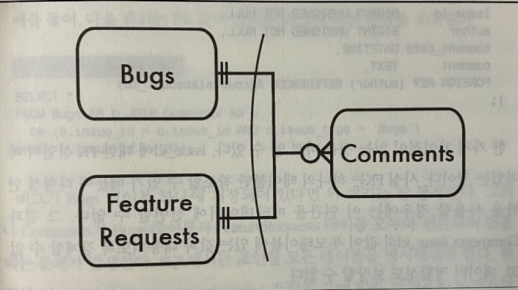
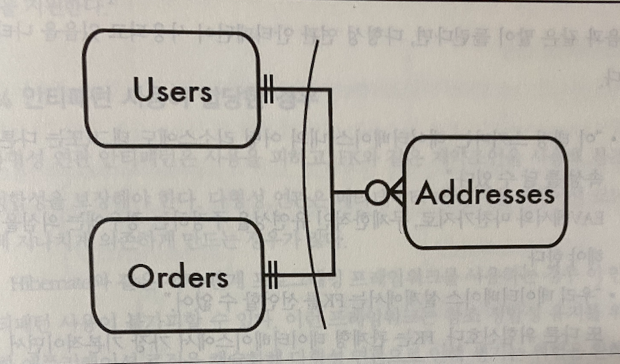

# 지옥 스터디 - 07 다형성 연관
- 사용자가 버그에 댓글을 달 수 있다고 가정
- 하나의 버그에는 여러 댓글을 달 수 있지만 하나의 댓글을 하나의 버그와만 연관된다.
- Bugs = Comments 는 일대다 관계

```sql
CREATE TABLE Comments (
    comment_id SERIAL PRIMARY KEY,
    bug_id BIGINT NOT NULL,
    author_id BIGINT NOT NULL,
    comment_date DATETIME NOT NULL,
    comment TEXT NOT NULL, 
);
```
- 댓글을 달 수 잇는 테이블이 두 개 일 수도 있다.
- Bugs 와 FeatureRequests 는 별도 테이블에 저장하지만 상당히 유사한 엔티티이다.
- 버그나 기능 요청 중 어느 이슈 타입이든 관계없이 Comments 를 하나의 테이블에 저장하고 싶다.

## 목표 : 여러 부모 참조


- 특정 댓글은 하나의 버그 또는 하나의 기능 요청 중 하나만 참조해야한다.

## 안티패턴 : 이중 목적의 FK 사용
- 이런 경우에 대한 해법은 **다형성 연관 (Polymorphic Associations)** 란 이름이 붙을 정도로 널리 알려져 있다.
- 여러 테이블을 참조하기에 난잡한 연관 (promiscuous association) 이라 불리기도 한다.

### 다형성 연관 정의
- 다형성 연관을 작동하게 하려면 FK 칼럼 issue_id 옆 문자열 타입의 별도 칼럼을 추가해야 한다.
- 이 컬럼에 현재 행이 참조중인 **부모 테이블의 이름** 을 넣는다.
  - type 으로 구분하는 방법

```sql
CREATE TABLE Comments (
      comment_id SERIAL PRIMARY KEY,
      issue_id BIGINT NOT NULL,
      issue_type VARCHAR(20), -- Bugs or FeatureRequests
      author_id BIGINT NOT NULL,
      comment_date DATETIME NOT NULL,
      comment TEXT NOT NULL,
);
```
- FK 는 하나의 테이블만 참조가 가능하기 때문에 다형성 연관을 사용할 경우 이를 메타데이터에 선언할 수 없다.
- 또한 데이터 정합성도 보장할 수 없다.

`데이터에 메타데이터 혼합`
- 다형성 연관 안티패턴은 EAV 안티패턴과 비슷한 특성을 가진다.
- 두 안티패턴 모두 메타데이터 객체 이름을 문자열로 저장한다.
- 이를 **데이터와 메타데이터 혼용** 이라 부른다.

### 다형성 연관에서의 조회
- Comments 테이블의 issue_id 값은 Bugs 와 FeatureRequests 양쪽 부모 테이블의 PK 칼럼에 나타날 수 있다.
- 자식테이블과 부모테이블을 조인할때 `issue_type` 을 정확하게 사용하는 것이 중요하다.

```sql
SELECT *
FROM Bugs AS b JOIN Comments AS c 
ON b.issue_id = c.issue_id AND c.issue_type = 'Bugs'
WHERE b.issue_id = 1234;
```

### 비객체지향 예제
- Bugs, FeatureRequests 예제에서 두 부모 테이블은 서로 관련된 서브타입 이었다.
- 다형성 연관은 부모 테이블이 아무런 관계도 없을때 사용도 가능하다.



```sql
CREATE TABLE Addresses (
    address_id SERIAL PRIMARY KEY,
    parent VARCHAR(20), -- Users Orders
    parent_id BIGINT NOT NULL,
    address TEXT,
);
```
- Addresses 테이블은 특정 주소에 대해 부모테이블을 Users/Orders 로 저장하는 다형성 컬럼을 가진다.
- 한 주소를 사용자/주문 둘 다에 연관시킬 수는 없다.
- 배송지주소가 아닌 청구지 주소도 가지고 있다면 이런 **구분방법이 Addresses 테이블에 존재** 해야 한다.

## 안티패턴 인식 방법
- 다음과 같은 얘기가 들린다면 다형성 연관 안티패턴이 사용되고 있음을 암시한다.
  - 이 태깅 스키마는 데이터베이스 내의 어떤 리소스에도 태그를 달 수 있다.
  - 우리 데이터베이스 설계에서는 FK 를 사용할 수 없다.
  - entity_type 컬럼 용도가 뭐지

> Rails, Java Hibernate 에서도 다양한 스키마 선언을 통해 다형성 연관을 지원한다.

## 안티패턴 사용이 합당한 경우
- 다형성 연관 안티패턴은 사용을 피하고, FK 와 같은 제약조건을 사용해 **참조 정합성을 보장** 해야 한다.
- 다형성 연관은 메타데이터 대신 애플리케이션 코드에 지나치게 의존하게 만드는 경우가 있다.
- Hibernate 와 같은 ORM 을 사용한다면 이 안티패턴 사용이 불가피할 수도 있다.
- 이런 프레임워크는 참조 정합성 유질르 위한 애플리케이션 로직을 캡슐화 했기 때문에 다형성 연관으로 인해 생기는 위험을 완화해 줄 수 있다.

> 프레임워크 도움없이 다형성 연관을 처음부터 직접 구현한다면 쓸데없는 작업을 반복하는 것이다.

## 해법 : 관계 단순화
- 다형성 연관의 단점을 피하면서 필요한 데이터 모델을 지원하기 위해서는 다시 설계하는 것이 낫다.