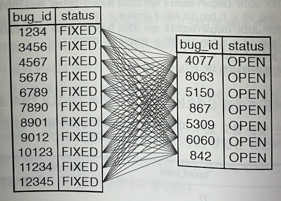

# 지옥 스터디 - 18 스파게티 쿼리

## 목표 : SQL 쿼리 줄이기
- SQL 개발자들이 일하면서 가장 흔하게 수렁에 빠지는 경우 -> "어걸 어떻게 하나의 쿼리로 처리할까 ?"
- 개발자들읜 하나의 SQL 이 복잡하고 어렵고 비용이 많이 든다고 생각하기에 문제 해결시 두 개 이상의 SQL 을 사용하는 것을 생각하지 않는다.
- 개발자는 작업의 복잡도는 줄일 수 없지만 방법은 단순화 하고 싶어 한다.

## 안티패턴 : 복잡한 문제를 한 번에 풀기
- SQL 은 표현력이 뛰어난 언어이지만, 모든 작업을 한 줄의 코드로 해치워야 한다는 작업이 좋은 접근 방법이 아니다.

### 의도하지 않은 제품
- 모든 결과를 하나의 쿼리로 만들어내려고 시도할 때 나타나는 흔한 결과중 하나 => **카테시안 곱 (Cartesian product)**
  - 쿼리에 사용된 두 테이블에 대해 관계를 제한하는 조건이 없을 때 발생함.
- 첫번째 테이블 모든행 x 두번째 테이블 모든행이 결과가 된다.



- 한 쿼리로 여러 작업을 처리하고자 할 때 의도치 않은 카테시안 곱을 생성하기 쉽다.

### 그래도 충분하지 않다면
- 이런 쿼리는 잘못된 결과를 얻기 쉽고, 작성하기 어려우며 수정하기도 어렵고, 디버깅하기도 어렵다는 점을 고려해야 한다.
- 애플리케이션 에서는 지속적인 개선 요청이 있을 것이라 예상해야 한다.
- SQL 이 복잡하다면 이를 개선하는데 더 많은 시간과 비용이 든다.
- 실행시 비용도 마찬가지이다.

## 안티패턴 인식 방법
- 프로젝트 구성원이 다음과 같은 말을 한다면 스파게티 쿼리 안티패턴이 사용되고 있음을 암시한다.
  - 합계와 개수가 왜 이렇게 크지 ?
  - 나는 하루 종일 이 괴물과 같은 SQL 쿼리와 씨름했어.
  - 우리 데이터베이스 리포트에는 아무것도 추가할 수 없어. SQL 쿼리가 어떻게 동작하는지 이해하려면 엄청난 시간이 걸릴꺼야
  - 쿼리에 DISTINCT 하나 더 추가해봐

> 어떤 쿼리가 스파게티 쿼리임을 나타내는 또 다른 실마리는, 쿼리가 지나치게 오래 실행되는 것이다. <br/>
> SQL 문장 하나로 지나치게 많은 일을 시도한 게 아닌지 확인해 보아야 한다.

## 안티패턴 사용이 합당한 경우
- 하나의 쿼리로 복잡한 작업을 수행하는 일반적인 경우 => 프레임워크 또는 비주얼 컴포넌트라이브러리 사용
- 여러 개의 쿼리 결과를 모아 정렬하는 코드를 애플리케이션에서 정렬하는 것 보다 데이터페이스에 이런 일을 시키는게 더 효율 적일 수도 있다.

## 해법 : 분할 정복 하기
- 오캄 윌리엄의 인용문은 **검약률 (law of parsimony)** 로도 알려져 있다.
- 검약률 : 두 개의 이론이 동일한 예측을 한다면 단순한 쪽이 좋은 이론.
- 동일한 결과 집합 두 개중 하나를 선택해야 한다면 단순한 쪽을 선택해야 한다.

### 한 번에 하나씩
- 의도치 않은 카테시안 곱이 생기는 두 테이블에 논리적인 조건을 찾을 수 없다면, 해당 조건이 없을 수도 있는 것
- 이런 경우 단순한 여러 개의 쿼리로 나눠야 한다.

```sql
SELECT p.product_id, COUNT(f.bug_id) AS count_fixed
FROM BugsProducts p
LEFT OUTER JOIN Bugs f ON p.bug_id = f.bug_id AND f.status = 'FIXED'
WHERE p.product_id = 1
GROUP BY p.product_id

SELECT p.product_id, COUNT(f.bug_id) AS count_open
FROM BugsProducts p
       LEFT OUTER JOIN Bugs f ON p.bug_id = f.bug_id AND f.status = 'OPEN'
WHERE p.product_id = 1
GROUP BY p.product_id
```
- 쿼리를 여러 개로 나누는 것은 **우아하지 못한 방법** 이라 생각할 수도 있다.
- 하지만 개발/유지보수/성능에 대한 여러 긍정적인 효과를 깨달으면 이는 안도감으로 바뀌게 된다.
