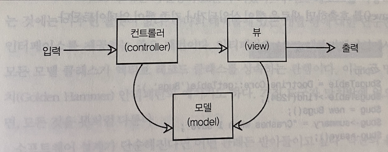

# 지옥 스터디 - 25 마법의 콩

[25.1 목표: MVC 에서 모델 단순화하기](#251-목표-MVC-에서-모델-단순화하기)

[25.2 안티패턴: 액티브 레코드 모델](#252-안티패턴-액티브-레코드-모델)

[25.3 안티패턴 인식 방법](#253-안티패턴-인식-방법)

[25.4 안티패턴 사용이 합당한 경우](#254-안티패턴-사용이-합당한-경우)

[25.5 해법: 액티브 레코드를 가지는 모델](#255-해법-액티브-레코드를-가지는-모델)

## 25.1 목표: MVC 에서 모델 단순화하기

 웹 애플리케이션 프레임워크는 애플리케이션에 기능 추가를 빠르고 쉽게 해준다.  
 소프트웨어 개발의 지적인 부분을 돕는 방법 하나는 디자인 패턴의 관례와 용어를 수용하는 것이다.
 - 싱글턴이나 퍼사드 팩터리 등을 얘기하면 팀내 다른 개발자들이 무얼 의미하는지 안다면 많은 시간을 절약할 수 있다.

MVC 아키텍쳐를 사용하면 **디자인 패턴** 과 **소프트웨어 프레임워크** 를 함께 사용하는 것이다.  
MVC 는 다음과 같이 애플리케이션에서 관심사를 분리한다.
 - 컨트롤러는 사용자 입력을 받고, 애플리케이션 응답을 위한 작업을 정의하고, 적절한 모델로 작업을 위임한 후 결과를 뷰로 내보낸다.
 - 모델은 다른 모든것을 처리한다. 애플리케이션의 중심이며 입력 값 검증, 비즈니스 로직 데이터베이스와의 상호작용을 포함한다.
 - 뷰는 사용자 인터페이스에 정보를 표시한다.

## 25.2 안티패턴: 액티브 레코드 모델

간단한 애플리케이션이라면 모델에 맞춤 로직이 많이 필요하지 않고 기본적인 CRUD 동작만 알면 된다.  
**액티브 레코드 패턴** 은 데이터베이스의 테이블에 대응되는 클래스를 정의하고, 클래스 메소드인 `find()` 를 호출해 테이블에 대응되는 객체의 인스턴스를 얻을 수 있고 생성자를 통해 새로운 행을 생성할 수 있다.  
이는 하나의 테이블에 있는 개별 행에 대한 단순한 인터페이스를 제공하는 좋은 패턴이다.  
안티패턴은 MVC 애플리케이션에서 모든 모델 클래스가 액티브 레코드 클래스를 상속하는 관행이다. 
액티브 레코드는 다음과 같은 단점들이 존재한다.

### 액티브 레코드는 모델을 스키마와 결합시킨다

액티브 레코드는 단순한 패턴이며, 데이터베이스의 테이블 또는 뷰를 나타낸다.  
이는 새로운 구조의 데이터를 표현하기 위해 데이터베이스를 리팩터링해야할 때 모델 클래스도 수정해야 하며 이를 사용하는 애플리케이션 로직도 수정해야 한다.

### 액티브 레코드는 CRUD 함수를 노출시킨다

모델 클래스를 사용하는 개발자가 내 의도와 달리 CRUD 함수로 데이터를 직접 업데이트 할 수 있다.  
의도와 달리 부적절하게 사용하는 일은 없어야 한다.

### 액티브 레코드는 빈약한 도메인 모델을 조장한다

대부분의 경우 모델이 기본적인 CRUD 메소드 외에 아무런 동작도 가지지 않는 경우가 많다.
모델을 단순한 데이터 접근 객체로 취급하면 비즈니스 로직은 모델 외부에 존재하고, 모델 동작의 **응집도** 가 낮아진다.
이를 빈약한 도메인 모델이라 부른다.

### 마법의 콩은 단위 테스트가 어렵다

마법의 콩 안티패턴을 사용하면, MVC 각 계층을 테스트하기 어려워진다.
- 모델 데스트
  - 모델을 액티브 레코드로 만들었기 때문에 데이터 접근과 분리한 모델 동작을 테스트할 수 없다.
  - 모델을 테스트 하기위해 실제 데이터베이스가 필요하며 준비 작업과 정리작업이 느려지며 에러가 발생할 가능성이 높다.
- 뷰 테스트
  - 프레임워크가 테스트 스크립트에서의 단정문을 단순화해도, 랜더링 이후 HTML 을 파싱해 특정 요소를 찾는 복잡한 코드를 실행해야 한다.
- 컨트롤러 테스트
  - 모델을 데이터 접근 객체로 사용함으로 인해 여러 컨트롤러에 동일 코드가 중복된다.
  - 이 모든것들이 테스트되어야 한다.

> 비즈니스 로직을 데이터베이스 접근과 분리하고 비즈니스 로직을 프레젠테이션과 분리하면 MVC 목표달성과 테스트도 단순해 진다.

## 25.3 안티패턴 인식 방법

다음 단서가 마법의 콩 이 있음을 의미할 수 있다.
- 모델 맞춤 SQL 을 어떻게 넘길 수 있을까 ?
- 복잡한 모델 쿼리를 모든 컨트롤러에 복사해야할까 ? 아니면 코드를 추상 컨트롤러에 한번만 작성해야 할까 ?
- 내 모델을 단위테스트 하기 위해 데이터베이스 픽스쳐를 더 작성해야해

## 25.4 안티패턴 사용이 합당한 경우

액티브 레코드 디자인 패턴 자체는 잘못이 없다.  
액티브 레코드 사용의 좋은 예는 **프로토타입** 을 만드는 경우 이다.  
코드를 빨리 작성하는 것이 테스트 가능하고 유지보수하기 쉬운 코드를 작성하는 것보다 중요할 때는 간단한 방법이 좋다.

## 25.5 해법: 액티브 레코드를 가지는 모델

프레임워크가 모델을 위하 만능 솔루션을 제공할 수는 없다.  
모델은 애플맄에ㅣ션을 위한 객체지향 설계의 나머지를 포함하고 있기 때문이다.

### 모델 이해하기

GRASP

`정보 전문가`

어떤 동작에 책임이 있는 객체는 동작을 수행하는데 필요한 모든 데이터를 가지고 있어야 한다.  
모델과 액티브 레코드와 같은 DAO 사이의 관계는 IS-A (상속) 가 아닌 HAS-A (집합 연관) 여야 한다.  
액티브 레코드를 사용하는 대부분의 프레임워크는 IS-A 관계를 가정한다.

`창조자`

모델이 데이터를 데이터베이스에 저장하는 방법은 내부적 구현 상세여야 한다.  
DAO 를 모은 도메인 모델이 DAO 객체 생성을 책임져야 한다.

`낮은 결합도`

논리적으로 독립적인 코드 블록을 분리하는 것은 중요하다.  
다른 곳에 영향을 주지 않으면서 클래스의 구현을 바꿀 수 있는 유연성을 얻을 수 있다.

`높은 응집도`

도메인 모델 클래스의 인터페이스는 의도된 사용법을 반영해야한다.  
데이터베이스의 물리적 구조나 CRUD 동작을 반영해서는 안된다.

### 간단한 객체 테스트하기

실제 데이터베이스 접근하지 않고도 모델을 테스트할 수 있어야 한다.  
모델을 DAO 에서 분리해 DAO 의 스텁과 목을 생성해 모델의 단위 테스트를 할 수 있다.

## SQL AntiPatterns Tip

테이블에서 모델을 분리하라.

