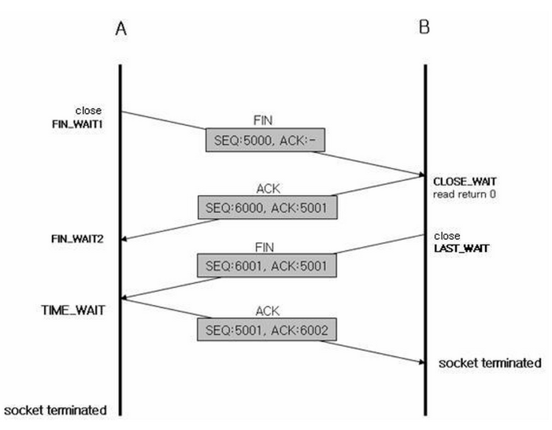

# Http Connection Pool 과 TimeWait
- MSA 구성시 각 서비스간 API 콜이 빈번한데, **HttpConnectionPool** 을 사용하지 않으면 문제가 발생할 수 있다.
- 가장 조심해야하는 사항중 하나가 Socket 을 지속적으로 open/close 하는 행위이다.
- Connection Pool 을 사용하는것과 사용하지 않는것의 차이는 TCP 통신 특성상 **네트워크 연결 비용이 좀더 들뿐이다** 라고 생각할 수 있다.
- 하지만 이보다 더 심각한 문제를 초례한다.

### TIME_WAIT
`HTTP - TIME_WAIT 관련 설명`
```
TIME_WAIT 포트 고갈은 성능 측정시 심각한 성능저하를 발생시키지만, 실제상황에서는 문제를 발생시키지 않는다.
클라이언트가 서버에 접속할 때 마다, 유일한 커넥션을 생성하기 위해 새로운 발신지 포트를 쓴다.
하지만 사용할 수 있는 발신지 포트의 수는 제한되어 있고 2MSL초 동안 커넥션이 재사용될 수 없으므로, 초당 500개로 커넥션이 제한된다.
서버가 초당 500개 이상의 트랜잭션을 처리할 만큼 빠르지 않다면 TIME_WAIT 포트 고갈은 일어나지 않는다.
```
- 소켓 통신을하면, 연결시 Hand-Shake 가 일어나는데, 매 연결시 마다 로컬포트를 소진한다.
- 소켓 통신이 종료되고난 후 소진했던 로컬포트를 바로 닫는것이 아닌 **TIME_WAIT** 상태에 전환된다.
    - TIME_WAIT 설정 시간만큼 해당 포트는 사용하지 못하고 대기한다.
    - 이는 OS 레벨에서 설정이 가능하고, CENTOS 기준 기본 설정은 1분이다.
    - OS 옵션으로 소진했던 로컬포트를 재사용할 수 있는 옵션이 존재한다.
- 만약 커넥션풀을 사용하지 않는다면, 트래픽 폭주시 로컬포트가 고갈나는 문제가 발생한다.
    - 이는 심각한 장애로 이어질 수 있음
- 외부 대용량 API CALL 을 한다면 반드시 ConnectionPool 을 사용해야함.

### TIME_WAIT 와 KEEP_ALIVE
```kotlin
TIME_WAIT 가 많다는 것은 서비스 응답속도가 느려질 수 있다는것을 의미한다.
```

`4WAY-HAND_SHAKE`

- 연결을 끊을때 사용하는 4-way-handshake
- timewait 소켓은 **먼저 연결을 끊는 쪽에서 생기는 소켓 상태** 이다.
- 추가로 받을 데이터가 있는지 상관없이 통신이 끝난뒤 연결을 끊어버린다.
- 더 보내야할 데이터가 없다면 상관없지만, 추가로 더 데이터를 보내야 한다면 3-way-handshake 가 한번 더 발생한다.

- keepalive 는 연결을 끊지 않고, 클라이언트의 요청을 처리한 후 일정시간 대기한다.
- 다수의 요청이 존재할 때 클라이언트는 커넥션을 1번만 맺은후 해당 커넥션을 재활용 하기때문에 네트워크 연결 비용이 줄어듦

> TIME_WAIT 소켓이 많다고 무작정 KEEP-ALIVE 를 켜는것도 장애로 이어질 수 있다.
